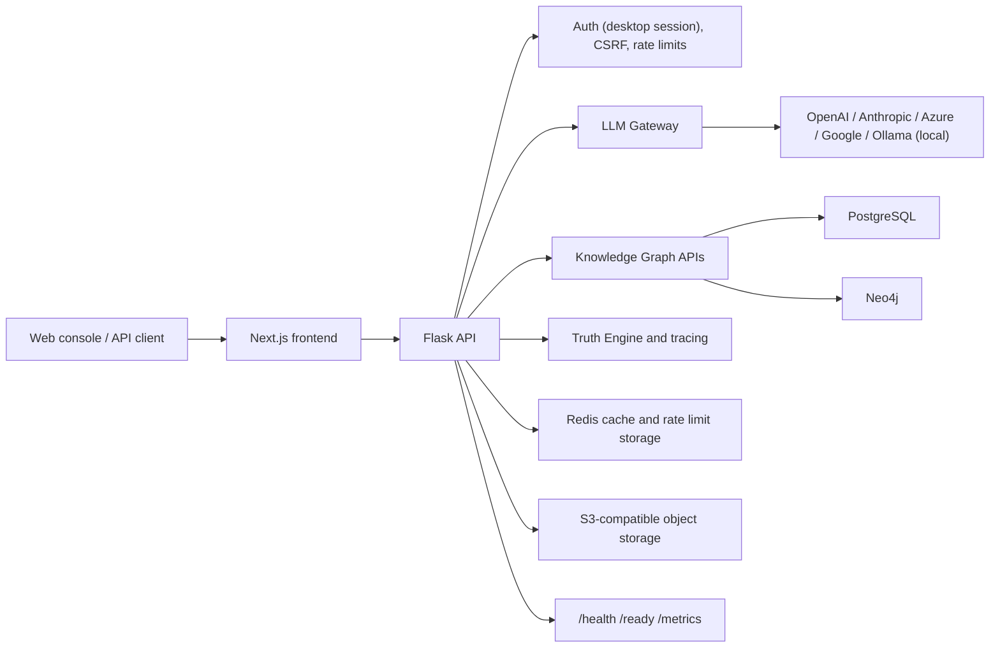

# DataLogicEngine

Enterprise AI orchestration, governed LLM routing, and knowledge graph reasoning in one deployable platform — currently under active development.

> ⚠️ **Active Development — Not Production Ready**
> DataLogicEngine is under active development. The architecture and subsystems described below reflect the current build state and intended design. **The application is not yet fully operational end-to-end** — individual subsystems (DMRF, Truth Engine, DSQP, LLM Gateway, Knowledge Graph, Trace Viewer) are implemented and tested in isolation while full integration, stabilization, and end-to-end validation are ongoing. Use for evaluation, architecture review, and non-production exploration only. Release status is tracked in [`docs/PRODUCTION_READINESS.md`](docs/PRODUCTION_READINESS.md) and [`TODO.md`](TODO.md).

[](https://github.com/kherrera6219/DataLogicEngine/actions/workflows/ci.yml)
[](https://github.com/kherrera6219/DataLogicEngine/actions/workflows/security.yml)
[](https://github.com/kherrera6219/DataLogicEngine/actions/workflows/deploy.yml)
[](requirements.txt)
[](frontend/package.json)
[](LICENSE)

DataLogicEngine (DLE) is a local-first Enterprise AI Platform built around the Universal Knowledge Graph (UKG).

Unlike traditional AI applications that operate as black boxes, DLE provides explainable reasoning, multi-agent orchestration, GraphRAG retrieval, governance controls, and complete audit traceability.

Designed for enterprise, government, compliance, cybersecurity, acquisition, and research environments, every AI decision can be traced through evidence sources, personas, reasoning stages, validation checkpoints, and immutable audit records designed to align with EU AI Act Article 53 transparency expectations. (Compliance mappings are evidence-guided design references, not a formal certification.)

Current Status: Active Development — Not Production Ready (Local-First Edition)

Major Subsystems Implemented (at subsystem level; full end-to-end integration, stabilization, and validation are ongoing):

- Universal Knowledge Graph (UKG)
- 17-Axis Knowledge Framework
- 10-Layer Truth Engine
- 12-Step Refinement Workflow
- Knowledge Algorithm Framework (100+ KAs)
- Multi-Agent Orchestration
- GraphRAG Integration
- Knowledge Ingestion Pipeline
- Trace Viewer
- MCP Integration Framework
- Local Database Lifecycle Management
- Enterprise Audit & Governance Framework
- 6-Tier Local LLM Chain (Ollama T0–T3, no API key required)

Current Focus:

- Accessibility validation (NVDA)
- Production code signing
- Release evidence package
- Public architecture assets
- Expanded integration benchmarks
- Public release readiness

What Makes DataLogicEngine Different?

Most AI applications answer questions.

DataLogicEngine explains how answers were produced.

Core Differentiators

**Universal Knowledge Graph (UKG)**

A structured knowledge system designed to organize information, expertise, regulations, compliance requirements, risk factors, locations, time contexts, and reasoning workflows into a unified framework accessible to human operators and AI agents.

**17-Axis Knowledge Framework**

A multidimensional coordinate system that maps every request across knowledge domains, industries, regulatory frameworks, compliance requirements, expertise models, geography, temporal context, risk profiles, and governance policies.

**10-Layer Truth Engine**

A progressive reasoning architecture that combines retrieval, validation, simulation, planning, trust analysis, safety controls, and audit generation into a governed AI workflow.

**12-Step Refinement Workflow**

A structured reasoning improvement pipeline that continuously validates, refines, audits, and strengthens outputs before release.

**Knowledge Algorithm Framework**

More than 100 specialized Knowledge Algorithms (KAs) provide modular capabilities for planning, validation, compliance analysis, contradiction detection, risk assessment, reasoning control, governance policy enforcement, and audit trace generation.

**Explainable AI**

Every response can be traced through:

- Evidence sources
- Personas
- Knowledge Algorithms
- Validation checkpoints
- Refinement stages
- Governance policies
- Audit records

**Local-First Architecture with Built-In Local LLMs**

Supports disconnected, air-gapped, enterprise, government, and workstation deployments without requiring external cloud infrastructure.

A built-in 6-tier LLM escalation chain runs entirely on-device via [Ollama](https://ollama.com) — no API key required. Local models (T0 `gemma4:latest` → T1 `gemma4:12b` → T2 `qwen3:14b` → T3 `devstral-small-2:latest`) handle the full reasoning workload by default. Cloud providers (T4 Gemini Flash 3.5, T5 GPT-5.5) auto-unlock only when a key is saved in Settings.

**Model Context Protocol (MCP)**

Native MCP support enables integration with tools, resources, external agent systems, subscriptions, and dynamic plugin architectures.


Roadmap

**Release Readiness:**

- Complete NVDA accessibility validation
- Production code-signing pipeline
- Final release evidence package
- Public architecture diagrams and assets
- Expanded integration and performance benchmarking

**Enterprise Enhancements:**

- Advanced policy-as-code governance
- Enhanced cost and usage analytics
- Human feedback and review workflows
- Advanced persona orchestration strategies

**Platform Evolution:**

- ~~Local SLM optimization for lower reasoning tiers~~ — Delivered: 6-tier Ollama chain (T0 `gemma4:latest` → T3 `devstral-small-2:latest`)
- Expanded GraphRAG retrieval capabilities
- Enterprise deployment automation
- Additional knowledge ingestion connectors
- Advanced knowledge graph learning and adaptation

**Recently Completed:**

- ✅ Local-first database lifecycle management
- ✅ GraphRAG integration
- ✅ Trace Viewer implementation
- ✅ PDF and DOCX ingestion support
- ✅ Async ingestion workflows
- ✅ SQL to Neo4j synchronization
- ✅ Advanced MCP integration framework
- ✅ Real-time trace streaming
- ✅ Automated documentation validation
- ✅ Portable workstation deployment stack
- ✅ Enterprise audit traceability framework
- ✅ Knowledge Algorithm expansion and validation
- ✅ Truth Engine release readiness improvements
- ✅ 6-tier local-to-cloud LLM escalation chain (Ollama T0–T3, Gemini Flash T4, GPT-5.5 T5)
- ✅ OllamaProvider SDK with health check, streaming, and JSON generation
- ✅ Cloud escalation auto-unlock when Google/OpenAI API key is saved in Settings

See [`TODO.md`](TODO.md) for the canonical backlog and release-readiness work items.

> Recommended architecture asset path: `docs/assets/readme/architecture-overview.png`. Add a dark-mode-safe PNG/SVG export when publishing visual docs.

## Quick Links

- 🚀 **Quick Start**: [Installation & Docker Compose](#quickstart)
- 🔒 **Report Security Issues**: See [`SECURITY.md`](SECURITY.md) for responsible disclosure
- ❓ **Ask Questions**: Open a [GitHub Discussion](https://github.com/kherrera6219/DataLogicEngine/discussions)
- 📚 **Need Help?**: See [Getting Help](#getting-help)
- 🚢 **Deploy to Production**: [`docs/DEPLOYMENT.md`](docs/DEPLOYMENT.md)

## Quickstart

Run the full local stack with Docker:

```bash
git clone https://github.com/kherrera6219/DataLogicEngine.git
cd DataLogicEngine
cp .env.template .env
docker compose up --build
```

Open:

| Service | URL |
| --- | --- |
| Web console | `http://localhost:3000` |
| Backend API | `http://localhost:5000` |
| Health probe | `http://localhost:5000/health` |
| Metrics | `http://localhost:5000/metrics` |
| Swagger UI | `http://localhost:5000/api/docs` |

Minimal API call:

```bash
curl http://localhost:5000/health
```

## Contents

- [Why DataLogicEngine](#why-datalogicengine)
- [Architecture](#architecture)
- [Installation](#installation)
- [Configuration](#configuration)
- [API Examples](#api-examples)
- [Deployment](#deployment)
- [Security and Compliance](#security-and-compliance)
- [Observability](#observability)
- [Testing](#testing)
- [Roadmap](#roadmap)
- [Getting Help](#getting-help)
- [Contributing](#contributing)
- [License](#license)
- [Repository Metadata](#repository-metadata)

## Why DataLogicEngine

DataLogicEngine is designed for teams that need AI workflows to be explainable, inspectable, and operable in regulated environments.

| Capability | What it provides |
| --- | --- |
| LLM gateway | Multi-provider routing with a 6-tier auto-escalation chain: local Ollama models (T0–T3, no API key required) through cloud providers (T4 Gemini Flash 3.5, T5 GPT-5.5). Includes retries, circuit-breaker behavior, cost tracking, and audit metadata. |
| Knowledge graph | Structured graph model with sectors, domains, pillars, knowledge nodes, edges, and 17-axis reasoning support. |
| Traceable reasoning | Runs, traces, stage timing, persona context, and evidence references for audit reconstruction. |
| Governance | Single-owner desktop auth, CSRF controls, CORS policy enforcement, prompt-injection checks, request limits, and immutable audit patterns. |
| Local-first distribution | Browser deployment plus Electron/NSIS Windows packaging for workstation and constrained-network scenarios. |
| Production operations | Docker Compose, cloud Dockerfile, health/readiness probes, metrics endpoint, Sentry integration, and CI/security workflows. |

## Architecture



### Runtime Components

| Layer | Components | Notes |
| --- | --- | --- |
| Frontend | Next.js 16, React 18, Electron 40 | Web console, desktop shell, graph visualization, admin surfaces. |
| Backend | Flask 3.1, SQLAlchemy, Socket.IO | API routing, auth, gateway orchestration, audit, tracing. |
| Data | PostgreSQL 15+, Neo4j 5+, Redis 7+, MinIO | Relational state, graph state, cache/rate limits, object storage. |
| AI | OpenAI, Anthropic, Azure OpenAI, Google/Gemini, Ollama (local) | 6-tier auto-escalation: T0–T3 route to local Ollama models (no key needed); T4–T5 route to cloud when a key is saved. Provider keys resolved at runtime from environment or configured provider records. |
| Quality | Pytest, Ruff, Vitest, Playwright, GitHub Actions | CI includes backend, frontend, governance, security, deploy, and Windows packaging checks. |

## Installation

### Prerequisites

| Tool | Version | Purpose |
| --- | --- | --- |
| Python | 3.11+ | Backend runtime and tests |
| Node.js | 24+ | Frontend and Electron tooling |
| Docker | Current stable | Local full-stack development |
| PostgreSQL | 15+ | Production relational store |
| Redis | 7+ | Cache, rate limiting, async support |
| Neo4j | 5+ | Knowledge graph storage |
| [Ollama](https://ollama.com) | Current stable | Local LLM inference — required for T0–T3 chain (no API key needed) |

### Backend Development

**Windows:**

```bash
python -m venv .venv
.venv\Scripts\activate
python -m pip install --upgrade pip
pip install -r requirements.txt
copy .env.template .env
python main.py
```

**macOS/Linux:**

```bash
python -m venv .venv
source .venv/bin/activate
python -m pip install --upgrade pip
pip install -r requirements.txt
cp .env.template .env
python main.py
```

### Frontend Development

```bash
cd frontend
npm ci
npm run dev
```

### Local Mode (no Docker, no cloud databases)

For workstation development without Docker, the setup script downloads and installs portable PostgreSQL, Redis, and Neo4j binaries locally and the app manages their lifecycle automatically:

```bash
# Install portable database binaries (one-time)
python scripts/setup_local_databases.py --all

# Seed Neo4j with UKG pillar taxonomy
python scripts/seed_neo4j.py

# Run database migrations
flask db upgrade

# Start the backend (databases auto-start on app launch)
python main.py
```

Verify all services are reachable:

```bash
python scripts/setup_local_databases.py --verify
```

### Desktop Build

```bash
npm --prefix frontend run electron:dist
```

Installer artifacts are copied to the repository root as a single canonical setup executable:

- `DataLogicEngine Setup Latest.exe`
- matching `.sha256` and `.blockmap` files

### Model Provider Setup

DataLogicEngine routes queries through a 6-tier escalation chain, but **the full chain is not required**. The app works with any combination of tiers — just one local model, just one cloud provider, a mix of both, or the full chain. Configure only what you have available.

| Tier | Model | Provider | Requires |
| --- | --- | --- | --- |
| T0 | `gemma4:latest` | Ollama (local) | Ollama installed + model pulled |
| T1 | `gemma4:12b` | Ollama (local) | Ollama installed + model pulled |
| T2 | `qwen3:14b` | Ollama (local) | Ollama installed + model pulled |
| T3 | `devstral-small-2:latest` | Ollama (local) | Ollama installed + model pulled |
| T4 | `gemini-3.5-flash` | Google / Gemini | Google API key |
| T5 | `gpt-5.5` | OpenAI | OpenAI API key |

#### Local models via Ollama (T0–T3)

[Ollama](https://ollama.com) runs models on-device with no API key or cloud account required.

**Install Ollama**

Download and run the installer from [ollama.com/download](https://ollama.com/download) (Windows, macOS, and Linux). Ollama starts as a background service on `http://localhost:11434`.

**Pull models** — pull only the tiers you want to use:

```bash
ollama pull gemma4:latest            # T0 — ultra-light, ~1s responses
ollama pull gemma4:12b               # T1 — local primary reasoning
ollama pull qwen3:14b                # T2 — extended reasoning (thinking model)
ollama pull devstral-small-2:latest  # T3 — code and structured output
```

> **Hardware note:** `gemma4:12b` (T1) and `qwen3:14b` (T2) are thinking models and perform best with 8 GB+ VRAM. `gemma4:latest` (T0) and `devstral-small-2:latest` (T3) are lighter and run on 4–6 GB VRAM or CPU offload.

**Verify:**

```bash
ollama list                # shows pulled models
curl http://localhost:11434  # returns: Ollama is running
```

Set `OLLAMA_BASE_URL` in `.env` only if Ollama is on a non-default host or port.

#### Cloud providers (T4 and T5, optional)

Cloud tiers are optional and unlock automatically when a key is saved in **Settings → AI/Model**. No restart required.

**T4 — Google Gemini Flash 3.5**

1. Get an API key at [aistudio.google.com](https://aistudio.google.com) (free tier available).
2. In the app: **Settings → AI/Model → Provider: google → paste key → Save**.
3. Or set `GOOGLE_API_KEY` (or `GEMINI_API_KEY`) in `.env` before starting the backend.

**T5 — OpenAI GPT-5.5**

1. Get an API key at [platform.openai.com](https://platform.openai.com).
2. In the app: **Settings → AI/Model → Provider: openai → paste key → Save**.
3. Or set `OPENAI_API_KEY` in `.env` before starting the backend.

Once a cloud key is saved, the gateway's cloud escalation gate opens and complex queries will route to T4/T5 automatically. The Dashboard **LLM Escalation Chain** card shows which tiers are currently unlocked.

## Configuration

Copy `.env.template` to `.env` and set values for your deployment target.

### Required Production Variables

| Variable | Required | Description |
| --- | --- | --- |
| `FLASK_ENV` | Yes | Use `production` for deployed environments. |
| `SECRET_KEY` | Yes | Flask session secret. Generate a unique 64+ character value. |
| `JWT_SECRET_KEY` | Vestigial | Legacy JWT signing secret (a dev default is provided). Single-mode auth uses Flask-Login sessions + desktop auto-login, not JWT flows; set a unique value only if you wire a token-based integration. |
| `SESSION_SECRET` | Yes | Session signing secret used by runtime checks. |
| `DATABASE_URL` | Yes | SQLAlchemy database URL. PostgreSQL is recommended for production. |
| `CORS_ORIGINS` | Yes | Comma-separated allowed browser origins. Do not use `*` in production. |

> **Single-owner note:** DataLogicEngine uses the OS user as the sole owner (desktop auto-login). There is no admin account to provision, so the former `ADMIN_USERNAME` / `ADMIN_PASSWORD` / `ADMIN_EMAIL` setup variables are no longer part of the model (any values set are only checked by the insecure-default security guard).

### Provider and Integration Variables

| Variable | Description |
| --- | --- |
| `OPENAI_API_KEY` | OpenAI provider key. |
| `ANTHROPIC_API_KEY` | Anthropic provider key. |
| `AZURE_OPENAI_ENDPOINT` | Azure OpenAI endpoint URL. |
| `AZURE_OPENAI_API_KEY` | Azure OpenAI provider key. |
| `GOOGLE_API_KEY` / `GEMINI_API_KEY` | Google/Gemini provider key. Enables T4 (Gemini Flash 3.5) cloud escalation. |
| `OLLAMA_BASE_URL` | Optional. Ollama endpoint (default: `http://localhost:11434`). Required when Ollama is on a non-default host/port. T0–T3 local inference requires no API key. |
| `SENTRY_DSN` | Enables crash reporting when configured. |
| `SENTRY_TRACES_SAMPLE_RATE` | Distributed trace sampling rate. Default: `0.1`. |
| `SENTRY_PROFILES_SAMPLE_RATE` | Profiling sample rate. Default: `0.1`. |

### Data Services

| Variable | Default / Example | Description |
| --- | --- | --- |
| `REDIS_URL` | `redis://localhost:6379/0` | Cache and runtime coordination. |
| `RATELIMIT_STORAGE_URI` | `redis://localhost:6379` | Flask-Limiter storage backend. |
| `NEO4J_URI` | `bolt://localhost:7687` | Neo4j Bolt endpoint. Standard Neo4j Bolt port. |
| `NEO4J_USER` | `neo4j` | Neo4j username. |
| `NEO4J_PASSWORD` | unset | Neo4j password. |
| `OBJECT_ENDPOINT_URL` | `http://localhost:9000` | S3-compatible object storage endpoint. |
| `OBJECT_ACCESS_KEY` | unset | Object storage access key. |
| `OBJECT_SECRET_KEY` | unset | Object storage secret key. |
| `OBJECT_BUCKET` | `datalogic` | Object storage bucket. |

## API Examples

Base URLs:

| Environment | Base URL |
| --- | --- |
| Local backend | `http://localhost:5000` |
| Versioned API | `http://localhost:5000/api/v1` |
| Production | `https://your-domain.example/api/v1` |

### Health and Readiness

```bash
curl http://localhost:5000/health
curl http://localhost:5000/live
curl http://localhost:5000/ready
```

### Authentication

DataLogicEngine is single-owner / local-first: the desktop app auto-logs in the
OS user as the owner (`POST /api/v1/auth/desktop/auto-login`), so there is no
public username/password login endpoint. For programmatic access, use an API
key — generate one in the app and include it as `X-API-Key`:

```bash
export UKG_KEY="ukg_<prefix>_<secret>"
curl -H "X-API-Key: $UKG_KEY" http://localhost:5000/api/v1/gateway/chat ...
```

### LLM Gateway Request

```bash
curl -X POST http://localhost:5000/api/v1/gateway/chat \
  -H "X-API-Key: $UKG_KEY" \
  -H "Content-Type: application/json" \
  -d '{
    "messages": [
      {
        "role": "user",
        "content": "Summarize the compliance impact of this control change."
      }
    ],
    "model": "gpt-5.5",
    "tier": "2"
  }'
```

Tier 2+ responses include a verifiable audit footer:

```
[UKG Audit Trace]
Tier: 2
Active Axes: ...
Personas Invoked: ...
Confidence: 0.395
Refinement Steps Executed: ...
Compliance Flags: ...
Key Assumption to Verify: ...
What Changes if Wrong: ...
```

Every Tier 2+ run also writes a `TruthAuditEvent` row with a SHA-256 hash-chain receipt for EU AI Act Article 53 compliance.

### Knowledge Graph Query

```bash
curl -H "X-API-Key: $UKG_KEY" \
  http://localhost:5000/api/v1/knowledge-nodes
```

### Knowledge Algorithm Execution

```bash
curl -X POST http://localhost:5000/api/v1/ka/algorithms/KA-001/execute \
  -H "X-API-Key: $UKG_KEY" \
  -H "Content-Type: application/json" \
  -d '{
    "input": {
      "claim": "New customer data must remain in-region.",
      "jurisdiction": "US"
    }
  }'
```

### Standard Response Shape

```json
{
  "success": true,
  "data": {},
  "error": null,
  "timestamp": "2026-01-11T19:35:00Z"
}
```

## Deployment

### Docker Compose

Use Docker Compose for local integration testing or single-host evaluation:

```bash
cp .env.template .env
docker compose up --build -d
docker compose ps
```

### Cloud Container

`Dockerfile.cloud` builds the frontend and backend into a single runtime image:

```bash
docker build -f Dockerfile.cloud -t datalogicengine:latest .
docker run --env-file .env -p 5000:5000 -p 3000:3000 datalogicengine:latest
```

### Production Checklist

- Set `FLASK_ENV=production`.
- Use PostgreSQL, Redis, Neo4j, and S3-compatible object storage outside the app container.
- Set unique secrets for `SECRET_KEY`, `JWT_SECRET_KEY`, and `SESSION_SECRET`.
- Configure exact `CORS_ORIGINS`.
- Run database migrations instead of enabling `AUTO_CREATE_SCHEMA`.
- Terminate TLS at a trusted reverse proxy or platform load balancer.
- Enable Sentry or equivalent crash reporting.
- Confirm `/health`, `/ready`, and `/metrics` are monitored.
- Review [`docs/DEPLOYMENT.md`](docs/DEPLOYMENT.md), [`docs/OPERATIONAL_RUNBOOKS.md`](docs/OPERATIONAL_RUNBOOKS.md), and [`deploy/DEPLOYMENT_CHECKLIST.md`](deploy/DEPLOYMENT_CHECKLIST.md).

## Security and Compliance

DataLogicEngine includes security controls intended for enterprise deployments, but each deployment must still be threat-modeled and configured for its environment.

| Area | Built-in Support |
| --- | --- |
| Authentication | Single-owner desktop auto-login (OS identity), Flask-Login session auth, and API-key auth for programmatic access. Multi-user login, MFA, and SSO/OIDC were removed in the single-mode consolidation. |
| Authorization | Single-owner ownership checks (`current_user_is_owner()`) with owner-gated admin routes. Multi-user RBAC and tenant isolation were removed; `tenant_id` columns remain as vestigial. |
| Request security | CSRF, request size limits, CORS enforcement, rate limiting, SSRF allowlisting utilities. |
| Data protection | Secret resolution controls, encryption manager, PII redaction utilities, audit logging. |
| AI governance | Prompt-injection checks, provider usage tracking, trace IDs, policy/gateway hooks. |
| Supply chain | GitHub Actions security workflow, Bandit, npm audit, pip-audit, SBOM-oriented workflow steps. |
| Release governance | Windows installer governance, signing workflows, integrity reporting, release checklist. |

Security references:

- [`SECURITY.md`](SECURITY.md)
- [`docs/SECURITY.md`](docs/SECURITY.md)
- [`docs/AI_MANAGEMENT_SYSTEM_42001.md`](docs/AI_MANAGEMENT_SYSTEM_42001.md)
- [`docs/SDLC_SSDF_MAPPING.md`](docs/SDLC_SSDF_MAPPING.md)
- [`docs/SLSA_LEVEL_3_ATTESTATION.md`](docs/SLSA_LEVEL_3_ATTESTATION.md)

**🔒 Report Security Issues Privately:**

Do not report vulnerabilities in public issues. Follow the private reporting process in [`SECURITY.md`](SECURITY.md).

## Observability

| Signal | Location |
| --- | --- |
| Liveness | `GET /live` |
| Readiness | `GET /ready` |
| Health summary | `GET /health` |
| Runtime metrics | `GET /metrics` |
| API docs | `GET /api/docs` |
| Gateway provider usage | LLM gateway usage models and admin routes |
| Crash reporting | `SENTRY_DSN`, `SENTRY_TRACES_SAMPLE_RATE`, `SENTRY_PROFILES_SAMPLE_RATE` |
| Run tracing | `/api/v1/trace/*` and run-oriented UI routes |

Recommended production integrations:

- Prometheus-compatible scraping for `/metrics`.
- Sentry or an equivalent error and performance backend.
- Centralized JSON logs via `python-json-logger` and platform log shipping.
- Alerting on readiness failures, provider error spikes, token cost anomalies, and authentication failures.

## Testing

```bash
# Backend
python -m pytest tests/
python -m pytest tests/ --cov=backend --cov=models --cov-report=html --cov-report=term-missing --cov-report=json --cov-fail-under=70
python -m ruff check .
python -m pip_audit -r requirements.txt --desc

# Frontend
npm --prefix frontend ci
npm --prefix frontend run lint
npm --prefix frontend run typecheck
npm --prefix frontend run test
npm --prefix frontend audit --audit-level=high
```

### Current CI Runs

- ✅ Backend tests and dependency audit
- ✅ Frontend lint, typecheck, tests, and build
- ✅ Security scan workflow
- ✅ Deploy build and test workflow
- ✅ Windows packaging smoke test
- ✅ Governance and release checklist workflows

## Roadmap

| Horizon | Focus |
| --- | --- |
| Near term | Complete app-readiness evidence: authenticated accessibility coverage, keyboard/NVDA checks, failure-mode tests, and export/delete end-to-end validation. |
| Near term | Tighten public API contracts, reduce legacy route aliases, and improve generated OpenAPI coverage. |
| Near term | Add public architecture assets under `docs/assets/readme/`. |
| Mid term | Expand deployment reference material for Kubernetes, managed Postgres, managed Redis, and managed Neo4j. |
| Mid term | Publish signed release artifacts with checksums and provenance metadata. |
| Long term | Cost controls, recursive persona evaluation, human feedback loops, and policy-as-code governance for larger deployments. |

## Getting Help

### Documentation

- **Setup & Configuration**: [`DEVELOPMENT.md`](DEVELOPMENT.md), [`.env.template`](.env.template)
- **Deployment**: [`docs/DEPLOYMENT.md`](docs/DEPLOYMENT.md), [`docs/OPERATIONAL_RUNBOOKS.md`](docs/OPERATIONAL_RUNBOOKS.md)
- **Testing**: [`TESTING.md`](TESTING.md)
- **Development Guide**: [`docs/DEVELOPER_GUIDE.md`](docs/DEVELOPER_GUIDE.md), [`docs/DOCUMENTATION_STANDARDS.md`](docs/DOCUMENTATION_STANDARDS.md)
- **Support**: [`SUPPORT.md`](SUPPORT.md)

### Community & Support

- **Questions**: Open a [GitHub Discussion](https://github.com/kherrera6219/DataLogicEngine/discussions)
- **Bug Reports**: [Create an issue](https://github.com/kherrera6219/DataLogicEngine/issues) with steps to reproduce
- **Security Issues**: See [`SECURITY.md`](SECURITY.md) for responsible disclosure
- **API Documentation**: Swagger UI at `http://localhost:5000/api/docs` (when running locally)

## Contributing

Contributions are welcome when they align with the project license and governance model.

1. Read [`CONTRIBUTING.md`](CONTRIBUTING.md).
2. Read [`CODE_OF_CONDUCT.md`](CODE_OF_CONDUCT.md).
3. Create an issue for non-trivial changes before implementation.
4. Run backend and frontend checks locally.
5. Submit a pull request using the repository template.

Development references:

- [`DEVELOPMENT.md`](DEVELOPMENT.md)
- [`TESTING.md`](TESTING.md)
- [`docs/DEVELOPER_GUIDE.md`](docs/DEVELOPER_GUIDE.md)
- [`docs/DOCUMENTATION_STANDARDS.md`](docs/DOCUMENTATION_STANDARDS.md)

## License

DataLogicEngine is licensed under the [PolyForm Noncommercial License 1.0.0](LICENSE).

Personal, research, and educational use are permitted under the license terms. Commercial use, production deployment in a business environment, or integration into a paid product requires a separate commercial license. See [`COMMERCIAL_LICENSE.md`](COMMERCIAL_LICENSE.md) for details.

## Repository Metadata

### Existing Supporting Files

| File | Status |
| --- | --- |
| `LICENSE` | Present |
| `COMMERCIAL_LICENSE.md` | Present |
| `SECURITY.md` | Present |
| `CONTRIBUTING.md` | Present |
| `CODE_OF_CONDUCT.md` | Present |
| `SUPPORT.md` | Present |
| `CHANGELOG.md` | Present |
| `.github/CODEOWNERS` | Present |
| `.github/pull_request_template.md` | Present |
| `.github/ISSUE_TEMPLATE/*` | Present |
| `.env.template` | Present |
| `Dockerfile.cloud` and `docker-compose.yml` | Present |

### Recommended Additions

| Recommendation | Purpose |
| --- | --- |
| `docs/assets/readme/architecture-overview.png` | Public README architecture image for GitHub social previews and non-Mermaid consumers. |
| `.github/FUNDING.yml` | Optional sponsorship metadata if the project accepts funding. |
| `CITATION.cff` | Citation metadata for research and academic users. |
| GitHub repository topics | Suggested: `ai`, `llm`, `knowledge-graph`, `flask`, `nextjs`, `governance`, `compliance`, `enterprise-ai`. |
