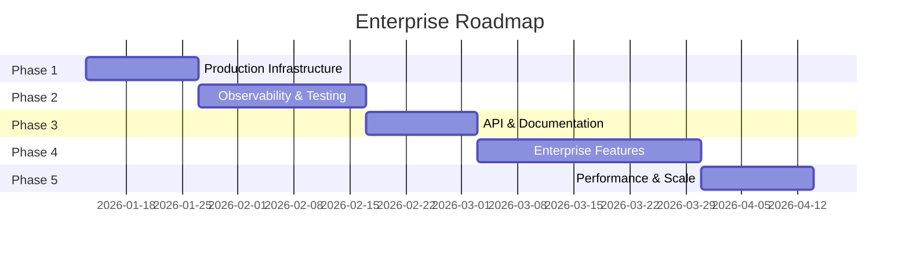
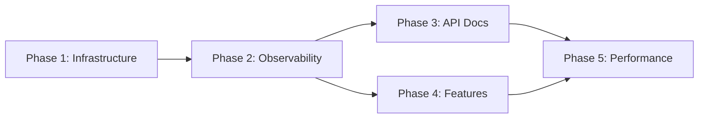

# Enterprise Roadmap: DataLogicEngine

**Version:** 1.0
**Created:** 2026-01-06
**Target Completion:** Q2 2026

---

## Overview

This roadmap outlines the phased approach to bring DataLogicEngine to enterprise production standards.

---

## Phase 1: Production Infrastructure (Weeks 1-2)

**Goal:** Production-ready deployment with security and reliability

### Week 1: Security & SSL

| Task                                    | Priority | Est. Hours | Owner    |
| --------------------------------------- | -------- | ---------- | -------- |
| Configure HTTPS with Let's Encrypt/cert | Critical | 4h         | DevOps   |
| Set up reverse proxy (nginx/Caddy)      | Critical | 2h         | DevOps   |
| Enable HSTS and security headers        | Critical | 1h         | Backend  |
| Configure production .env secrets       | Critical | 2h         | DevOps   |
| Validate production security scan       | Critical | 2h         | Security |

### Week 2: Reliability & Backups

| Task                                     | Priority | Est. Hours | Owner  |
| ---------------------------------------- | -------- | ---------- | ------ |
| Configure PostgreSQL automated backups   | Critical | 4h         | DevOps |
| Set up backup verification               | High     | 2h         | DevOps |
| Create disaster recovery runbook         | High     | 4h         | DevOps |
| Configure database replication (standby) | Medium   | 8h         | DevOps |

**Deliverables:**

- [ ] HTTPS enabled with valid certificates
- [ ] Automated daily database backups
- [ ] Disaster recovery documentation

---

## Phase 2: Observability & Testing (Weeks 3-5)

**Goal:** Full visibility into system health and comprehensive testing

### Week 3: Error Tracking & APM

| Task                                | Priority | Est. Hours | Owner   |
| ----------------------------------- | -------- | ---------- | ------- |
| Integrate Sentry for error tracking | Critical | 4h         | Backend |
| Configure Sentry alerts             | High     | 2h         | Backend |
| Add APM instrumentation             | High     | 4h         | Backend |
| Create runbook for common errors    | Medium   | 4h         | Backend |

### Week 4: Logging & Monitoring

| Task                                     | Priority | Est. Hours | Owner  |
| ---------------------------------------- | -------- | ---------- | ------ |
| Configure centralized logging (ELK/Loki) | High     | 8h         | DevOps |
| Set up log retention policies            | Medium   | 2h         | DevOps |
| Create monitoring dashboards (Grafana)   | High     | 6h         | DevOps |
| Configure uptime monitoring              | High     | 2h         | DevOps |
| Set up PagerDuty/alerting                | Medium   | 4h         | DevOps |

### Week 5: Test Coverage

| Task                           | Priority | Est. Hours | Owner |
| ------------------------------ | -------- | ---------- | ----- |
| Add API integration tests      | High     | 12h        | QA    |
| Add authentication tests       | High     | 6h         | QA    |
| Add simulation tests           | Medium   | 8h         | QA    |
| Set up test coverage reporting | Medium   | 4h         | QA    |
| Target: 80%+ coverage          | High     | Ongoing    | Team  |

**Deliverables:**

- [ ] Sentry integrated with alerts
- [ ] Centralized logging operational
- [ ] Monitoring dashboards live
- [ ] Test coverage ≥ 80%

---

## Phase 3: API & Documentation (Weeks 6-7)

**Goal:** Complete API documentation and developer experience

### Week 6: Swagger/OpenAPI

| Task                      | Priority | Est. Hours | Owner   |
| ------------------------- | -------- | ---------- | ------- |
| Document KA API endpoints | High     | 6h         | Backend |
| Document Truth Engine API | High     | 4h         | Backend |
| Document Persona API      | Medium   | 3h         | Backend |
| Document Compliance API   | Medium   | 3h         | Backend |
| Document Auth endpoints   | High     | 4h         | Backend |

### Week 7: Developer Docs

| Task                          | Priority | Est. Hours | Owner   |
| ----------------------------- | -------- | ---------- | ------- |
| Create API quickstart guide   | High     | 4h         | Docs    |
| Document authentication flows | High     | 4h         | Docs    |
| Create SDK/client examples    | Medium   | 6h         | Backend |
| Add Postman collection        | Medium   | 4h         | Backend |
| Update README with examples   | Medium   | 2h         | Docs    |

**Deliverables:**

- [ ] 100% API coverage in Swagger
- [ ] Developer quickstart guide
- [ ] Postman collection

---

## Phase 4: Enterprise Features (Weeks 8-11)

**Goal:** Complete enterprise feature set

### Week 8-9: Email & Notifications

| Task                               | Priority | Est. Hours | Owner    |
| ---------------------------------- | -------- | ---------- | -------- |
| Integrate email service (SendGrid) | High     | 8h         | Backend  |
| Password reset flow                | High     | 6h         | Backend  |
| Account verification emails        | High     | 4h         | Backend  |
| Notification preferences           | Medium   | 6h         | Backend  |
| Email templates                    | Medium   | 4h         | Frontend |

### Week 10: Real-Time Features

| Task                                   | Priority | Est. Hours | Owner    |
| -------------------------------------- | -------- | ---------- | -------- |
| Add WebSocket support (Flask-SocketIO) | High     | 12h        | Backend  |
| Real-time simulation updates           | High     | 8h         | Backend  |
| Live notification system               | Medium   | 6h         | Backend  |
| Frontend WebSocket integration         | High     | 8h         | Frontend |

### Week 11: Search & Export

| Task                        | Priority | Est. Hours | Owner    |
| --------------------------- | -------- | ---------- | -------- |
| PostgreSQL full-text search | High     | 8h         | Backend  |
| Knowledge node search UI    | Medium   | 6h         | Frontend |
| PDF export for simulations  | Medium   | 8h         | Backend  |
| CSV export for data         | Medium   | 4h         | Backend  |
| Excel export                | Low      | 4h         | Backend  |

**Deliverables:**

- [ ] Email service operational
- [ ] Password reset working
- [ ] WebSocket live updates
- [ ] Full-text search
- [ ] PDF/CSV exports

---

## Phase 5: Performance & Scale (Weeks 12-13)

**Goal:** Optimize for scale and performance

### Week 12: Caching & Optimization

| Task                               | Priority | Est. Hours | Owner   |
| ---------------------------------- | -------- | ---------- | ------- |
| Implement Redis caching            | High     | 8h         | Backend |
| Cache knowledge graph queries      | Medium   | 4h         | Backend |
| Add CDN for static assets          | Medium   | 4h         | DevOps  |
| Database query optimization        | High     | 8h         | Backend |
| Add database connection monitoring | Medium   | 2h         | DevOps  |

### Week 13: Scale & Load Testing

| Task                              | Priority | Est. Hours | Owner   |
| --------------------------------- | -------- | ---------- | ------- |
| Load testing with Locust          | High     | 8h         | QA      |
| Identify bottlenecks              | High     | 4h         | Backend |
| Configure auto-scaling (if cloud) | Medium   | 8h         | DevOps  |
| Document capacity limits          | Medium   | 4h         | Docs    |
| Performance regression tests      | Medium   | 4h         | QA      |

**Deliverables:**

- [ ] Redis caching operational
- [ ] Load test results documented
- [ ] Auto-scaling configured
- [ ] Performance baseline established

---

## Future Phases (Backlog)

### Phase 6: Internationalization

- Flask-Babel integration
- Translation workflow
- RTL language support

### Phase 7: Advanced Features

- Multi-tenancy support
- White-labeling
- Stripe payment integration
- Mobile PWA support
- Dark mode theme

### Phase 8: Compliance

- SOC 2 Type II certification
- GDPR compliance tools
- Data retention policies
- Right to deletion

---

## Resource Requirements

| Role               | Phase 1-2 | Phase 3-4 | Phase 5 |
| ------------------ | --------- | --------- | ------- |
| Backend Developer  | 1         | 2         | 1       |
| DevOps Engineer    | 1         | 0.5       | 1       |
| QA Engineer        | 0.5       | 1         | 1       |
| Technical Writer   | 0         | 0.5       | 0       |
| Frontend Developer | 0         | 1         | 0.5     |

**Total:** 3-4 developers for 13 weeks

---

## Success Metrics

| Metric              | Current     | Target  |
| ------------------- | ----------- | ------- |
| Test Coverage       | ~50%        | ≥80%    |
| API Documentation   | 6 endpoints | 100%    |
| Error Response Time | N/A         | <15 min |
| Uptime SLA          | N/A         | 99.9%   |
| Page Load Time      | Unknown     | <2s     |
| Database Query P95  | Unknown     | <100ms  |

---

## Risk Mitigation

| Risk                | Likelihood | Impact   | Mitigation                      |
| ------------------- | ---------- | -------- | ------------------------------- |
| SSL cert expiry     | Medium     | High     | Auto-renewal with Let's Encrypt |
| Database corruption | Low        | Critical | Daily backups + replication     |
| Secret exposure     | Low        | Critical | Secrets manager + rotation      |
| Third-party outage  | Medium     | Medium   | Circuit breakers + fallbacks    |

---

## Dependencies

---

_This roadmap should be reviewed weekly and adjusted based on progress and priorities._
