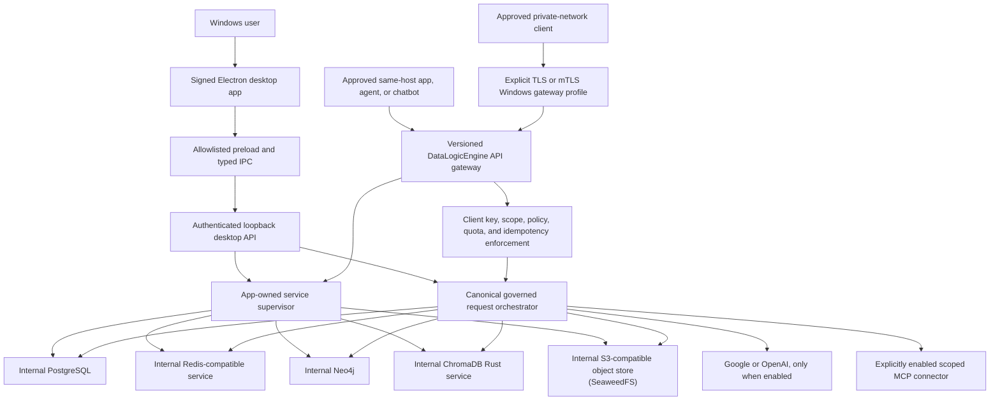

# DataLogicEngine 2026 Production Completion Plan

## Document metadata

| Field | Value |
|---|---|
| Document version | v1.25.0 |
| Plan date | 2026-07-12 |
| Status | Active production completion program |
| Product target | Local-first Windows 11 x64 governed LLM middleware with a desktop control, administration, audit, and validation application |
| Runtime model | Electron control/validation shell plus a Flask backend that is loopback-only by default and may expose an explicitly enabled private gateway mode |
| Data model | App-owned internal PostgreSQL, Redis, Neo4j, ChromaDB, and S3-compatible object-store services |
| External runtime dependency | Optional OpenAI or Google model access and explicitly enabled MCP connectors only |
| Current evidence baseline | `docs/audits/DataLogicEngine_Design_vs_Implementation_Audit_2026-07-12.md` |
| Execution ledger | Root `TODO.md` |
| Session continuity | Root `HANDOFF.md` |
| Release authority | `docs/RELEASE_READINESS_RECORD.md` and `docs/VERIFICATION_VALIDATION_REPORT.md` |

### Current execution checkpoint

Phase 13 reached its engineering checkpoint on 2026-07-14. Phase 11 selected MCP
`2025-11-25` over local stdio as the only external connector transport candidate.
Registration validates but does not execute one exact absolute command. Owner
consent binds its SHA-256 fingerprint and granular scope subset; DPAPI protects
credentials; caller-provided authority, shells/package runners, network targets,
repository hot-start, subscriptions, sampling, and placeholder UKG/KA/graph
defaults fail closed or are absent.

The backend owns a durable stdio loop, explicit timeout/cancellation, and a
Windows Job Object that terminates the process tree. PostgreSQL owns connector,
consent, discovery, lifecycle, and execution state; Redis carries content-free
live events; large governed results use `mcp-results`. Every result is untrusted,
bounded, hashed, redacted, and prompt-injection checked before any later governed
path may use it. The owner UI exposes exact authority and lifecycle controls.
ADR-0009 selects the durable Session Library instead of
an implied independent Project/workspace model. The improved production-source
inventory covers 27 pages and 194 control instances with zero enabled controls
without an obvious action. Hardcoded dashboard
trend, optimistic compliance/project/analytics state, and actionless advanced
configuration/chat/project/profile/response controls were removed or replaced
with real state and actions. The encrypted offline queue now supports owner
review, redacted export, governed replay, delete, and clear. At the Phase 12
checkpoint all 27 then-current routes passed axe and ten browser keyboard/app-
readiness workflows passed. Real installed handler-to-durable-effect, packaged
visual/scaling/high-contrast, and NVDA proof remain open release gates.

Phase 13 adds validated renderer/Electron/Flask/background correlation; shared
rotated/redacted `dle.log.v1` backend and desktop logs; explicit external-
telemetry opt-in; authenticated Diagnostics; previewed, confirmed, allowlisted,
re-redacted, hashed, retained, optionally encrypted support bundles; a complete
typed error taxonomy and critical fail-semantics map; evidence-backed compliance
outputs; real exception/import gates; expanded incident response; and stress24/
idle72 evaluators. All 28 routes pass axe. A short resource observation passes
engineering bounds but cannot satisfy CP13-E. Phase 13 remains at its
engineering checkpoint with installed evidence retained.

Phase 14 reached its engineering checkpoint on 2026-07-14. Product 4.3.0 now has
one version authority and one hashed Python release-lock authority. Windows file
metadata, UI/API/support consumers, versioned NSIS artifact identity, clean/tag/
lock gates, immutable workflow inputs, SBOM/content inventories, release
manifest, attestation verification, publisher/signature checks, and fail-closed
update/distribution policy are implemented. Legacy installer payload paths are
excluded. The canonical rebuilt/signed artifact, two-build repeatability,
installed lifecycle/update matrix, publisher/signing boundary, final supply-
chain evidence, legal authority, notices, and broad legacy reachability remain
release-blocking. Phase 15 system qualification is now active.

Phase 15 reached its release-candidate engineering checkpoint on 2026-07-14.
Commit `f2e4174f` freezes candidate inputs, separates unsigned qualification
builds from production signing, and packages a candidate-only release-channel
policy that cannot authorize production. A clean CPython 3.11.14 environment
reproduced the 315-package hash lock. The canonical local candidate passed
version, lock, workflow-pin, installer-integrity, and payload checks; its backend
contains 6,151 files with zero forbidden source/test/cache or stale Electron-test
findings. The invalid first build remains negative evidence because a drifted
developer environment leaked tests, caches, and source into the payload.

Two independent GitHub candidate builds from the frozen commit completed, but
their backend, portable, and installer hashes differ despite identical file
counts. The comparison exposes nondeterministic PyInstaller/Python archive and
Electron/NSIS content, so CP14-B repeatability remains open.

The packaged runtime probe reached the frozen backend and then failed closed at
the at-rest-protection gate because this workstation could not prove protected-
volume readiness. The candidate remains unsigned, and clean install/upgrade/
repair/rollback/uninstall, supported Windows, providers, five-service workflows,
failure recovery, accessibility, gateway, independent review, human pilot, and
24/72-hour evidence remain retained CP15-A through CP15-H release gates. Phase
16 documentation replacement is active without representing those installed
gates as passed.

This checkpoint does not close the installed production exit gates for Phases
3-13 and does not change the overall release verdict from **NO-GO**. The
supported 0.1.1 retained-
data upgrade, signed clean-machine recovery drill, protected-volume/ACL Windows
matrix, independent recovery/security/license acceptance, installed acceptance
of the selected object store, and real installed OpenAI/Gemini
trace proof, installed OpenAI/Google corpus results, live Phase 7 provider
acceptance, signed blinded human acceptance, and Phase 8 same-host/private,
TLS/firewall, backup/restore, UI, failure/load/soak, two-machine acceptance, and
Phase 9 installed restart/recovery, hostile-corpus, populated cross-store,
causal-retrieval, deletion, and Knowledge/Graph acceptance, plus Phase 10
installed live-provider budget, restart, event/UI, artifact/materialization, and
result-validity acceptance, plus Phase 11 installed file/network isolation,
process/reboot recovery, data-plane backup/restore, hostile fixture, and Electron
add/discover/call/cancel/stop/restart/remove acceptance remain open gates
that can only close against the later rebuilt release candidate.
Phase 12 installed real-service/store workflow reconciliation, Windows scaling/
high-contrast/visual checks, and manual NVDA acceptance likewise remain open.
Phase 13 installed multi-process/store correlation, complete failure injection,
all-output redaction/no-egress, support workflow, and 24/72-hour soak acceptance
likewise remain open.

Phase 16 CP16-A is complete on 2026-07-14. The owner-approved information
architecture selects exactly 30 canonical hand-maintained documents across five
classes, assigns all 134 current Markdown files one source-to-target disposition,
and applies verified controlled headers to all ten existing canonical documents.
The first CP16-B content checkpoint adds five canonical product/user documents,
migrates the canonical entry links, and passes source-map, required-topic,
truthful-status, and prohibited-claim verification. The inventory is now 139
Markdown files with 15 existing and 15 planned canonical targets. The signed-RC
unfamiliar-user walkthrough remains a retained CP16-B exit gate; CP16-C document
construction is active. Archive/delete authorization remains false.

The first CP16-C content batch adds canonical data architecture, interface and
integration, security architecture, software lifecycle, maintenance/disaster
recovery, requirements traceability, and V&V documents. Their seven approved
source maps, controlled headers, required topics, portal links, truthful statuses,
and prohibited-claim checks pass. The inventory is now 146 Markdown files with
22 existing and eight planned canonical targets. CP16-C remains active for the
KA/TruthCore, privacy impact, accessibility, third-party, and release-readiness
assurance records.

The second CP16-C content batch adds those five assurance/release records and
passes the expanded 12-target engineering/assurance verifier. The inventory is
now 151 Markdown files with 27 existing and three planned canonical targets.
CP16-C content construction is complete; exact signed-installed, provider/model,
manual accessibility, privacy/legal, supply-chain, independent, pilot, and soak
evidence remains retained. CP16-D/CP16-E external-review content is active.

CP16-D/CP16-E content construction is complete. The professional review index,
Microsoft submission dossier, and independent review record bring the canonical
set to 30 existing/zero planned documents across 154 classified Markdown files.
The current official Microsoft policy snapshot supports the traditional MSI/EXE
route as the qualification choice, not submission approval. Partner Center,
policy/WACK, signed artifact, reviewer assignment/findings, legal/distribution,
and external acceptance remain not evaluated or release blocked.

CP16-F replacement closure passed on 2026-07-15. All 72 merge sources were
hash-frozen with Git blob identity, reviewed against 18 routed canonical targets,
link-migrated, and archived intact under `docs/archive/phase-16/`. Post-move
verification reports 72/72 retained hashes, zero active legacy sources, zero
unmigrated active links, all 30 controlled headers, and the exact 154-file
inventory with zero unclassified or duplicate routes. CP16-G remains retained
for the exact signed installed release candidate. Phase 17 CP17-A through CP17-D
passed on 2026-07-15: the active authority is consolidated, 47/47 historical
dispositions are verified, generated parity passes 10/10 checks against 484 live
Flask routes and the product/provider/service/OpenAPI/environment/installer
authorities, and active documentation has zero errors or warnings. CP17-E
remains a signed-installed clean-machine walkthrough.

The 2026-07-15 CI/security maintenance checkpoint repaired the failing release
gates without changing the Phase 16 sequence or the production **NO-GO** verdict.
The exact Python authority now includes Flask async support and patched Pillow,
Starlette, and Transformers versions; the generated lock uses a line-ending-
independent source hash; Cosign v3 signs and verifies SBOM Sigstore bundles; and
new Bandit findings are removed or narrowly constrained to loopback-only calls.
Cross-platform policy, session, anonymous-mutation, and UI-inventory tests now
represent Windows paths and desktop bootstrap authority consistently. A clean
  short-path Windows environment installed all 315 pre-replacement hash-locked packages with no
broken requirements, the dependency audit had zero unignored findings, and the
  full backend suite passed 2,177 tests with 18 skipped.

Replacement Control passed for release qualification on 2026-07-24. ADR-0010
supersedes the historical Proposed ADR-0004, defines the capability
**app-owned S3-compatible object store**, and selects SeaweedFS 4.40-dle.1 for
rebuilt installed qualification. Production authorization remains false.

Because no patched ChromaDB SDK release exists, the 2026-07-15 replacement
removes the vulnerable Python SDK from both dependency authorities. The locked
Rust single-node service is now accessed through an app-owned restricted v2 HTTP
client that allows only loopback endpoints, caller-supplied vectors, and inert
no-embedding configuration. Eighteen adversarial/contract regressions, an
isolated zero-finding dependency audit, and a live five-service collection,
  query, deletion, restart, status, and cleanup qualification pass. GitHub alert
  389 is confirmed fixed;
  installed service/security/recovery approval remains a later release gate.

The subsequent consolidation-integrity audit expanded CP16-F verification from
index-only links to every active Markdown link and backtick path. It migrated
175 previously missed references to canonical or exact archived targets,
rebound KA/provider/ADR source references, and passed replacement closure,
documentation truth, all engineering/assurance document gates, and the complete
test suite (2,192 passed, 18 skipped).

The 2026-07-25 Knowledge Algorithm architecture review found that the Phase 6
classification checkpoint did not finish the KA subsystem to the product
contract. The executable registry exposes 125 IDs, but only 11 are enabled for
governed production use. Seven implemented Layer-9 KAs are absent from that
registry and are silently skipped by live TruthCore callers. The runtime also
merges descriptive metadata from a conflicting 277-row catalog, the Python SDK
ships a separate 114-row catalog plus sample/stub handlers, and the repository
retains multiple execution engines with incompatible contracts. At least one
live KA-Master selection branch is structurally invalid, and the Algorithms
page is catalog-only rather than the documented detail/input/execute/history
workflow.

Rebuilding the release candidate before correcting this major subsystem would
bind installed evidence to behavior already known to be incomplete. Phase 18 is
therefore inserted as a release-blocking Knowledge Algorithm production
completion phase. The previous production-launch Phase 18 becomes Phase 19.
The signed rebuild, CP16-G/CP17-E binding, and retained installed gates may
resume only after the Phase 18 source/contract/integration exit gate passes.

CP18-A passed on 2026-07-25. The approved machine-readable authority preserves
213 distinct capabilities: 132 existing implementation surfaces requiring
qualification and 81 implementation gaps. It collapses one confirmed semantic
duplicate to a scoped alias, reviews 11 similar-name pairs as materially
distinct, and reports zero exact name/purpose/contract collisions and zero
unresolved duplicate candidates. It also classifies 62 identity conflicts, 64
generic historical scaffolds, and 132 implementation plus 132 integration,
caller, API, SDK, and UI surfaces with zero unclassified records.

CP18-B passed on 2026-07-25. One generated runtime manifest now drives a typed
execution/effect/trace contract and `CanonicalKAController`; KA-Master no
longer merges the conflicting metadata catalog, the core engine/loader are thin
adapters, and Python/TypeScript SDK catalogs and clients are generated from the
same authority. The private SDK handler runtime and backend fallback imports
were removed. The runtime gate verifies 213 canonical capabilities, 132
one-to-one implementation owners, 81 explicit gaps, one reviewed scoped alias,
zero duplicate canonical collisions, and zero unclassified surfaces. CP18-C is
active; these counts remain a work authority, not a production-readiness claim.

## 1. Purpose

This plan defines the complete program required to finish DataLogicEngine as a
production-grade local-first Windows application. It converts the July 12 design
versus implementation audit into ordered engineering work with explicit entry
conditions, checkpoints, self-checks, evidence requirements, stop conditions,
documentation updates, and release gates.

This is not a rewrite plan. The repository already contains substantial working
infrastructure. The program preserves strong components, removes contradictory
or duplicate paths, completes disconnected components, and proves that the
installed application behaves exactly as the active product documents claim.

DataLogicEngine has two inseparable production surfaces. Its primary integration
surface is a versioned API gateway through which approved applications, agents,
and chatbots obtain governed model responses. Its signed desktop frontend is the
production control, configuration, administration, audit, observability, and
validation application. The built-in chat is a reference client and operational
proof surface for the same governed request lifecycle used by external clients;
it is not a separate simplified reasoning implementation.

The word `production` in this plan means a signed Windows application that can
be installed, upgraded, operated, backed up, restored, diagnosed, and removed on
a supported Windows machine without depending on externally hosted databases or
a cloud SaaS control plane.

## 2. Non-negotiable product decisions

### 2.1 Supported product

The production product is:

1. A Windows 11 x64 owner-operated application whose primary integration surface
   is the DataLogicEngine API gateway.
2. Local-first and single-owner, with the Windows user account as the primary
   operating-system trust boundary. Multiple named client applications and API
   principals do not make the product a hosted multi-tenant service.
3. An Electron control, administration, audit, observability, and validation
   frontend using a narrow preload bridge.
4. A built-in chat reference client that exercises the same canonical governed
   lifecycle as external API clients.
5. A Python/Flask backend bound only to loopback by default, with an explicitly
   enabled and separately qualified private Windows gateway profile.
6. Governed LLM middleware with optional outbound calls to explicitly configured
   Google or OpenAI models and explicitly enabled connectors.
7. A full app-owned internal data plane.
8. Installable, upgradeable, repairable, and uninstallable through a signed
   Windows installer.

The same signed package may run inside a Windows VM. A VM remains the same local
application architecture and does not change the data plane to managed cloud
services. Private-network API access from a Windows VM is supported only after
the dedicated gateway phase qualifies TLS, client identity, firewall policy,
service exposure, upgrade, diagnostics, and recovery. Public internet exposure
is not enabled by default and is not part of this completion program.

### 2.2 Required internal data services

PostgreSQL, Redis, Neo4j, ChromaDB, and app-owned S3-compatible object store are intentional parts of the
production architecture. They are not cleanup candidates and are not optional
substitutes for one another.

| Service | Production responsibility | Must remain true |
|---|---|---|
| PostgreSQL | Durable relational system of record for application state, sessions, chats, traces, audits, graph records, Truth Engine state, MCP metadata, and provider configuration | Transactional integrity, migrations, relational constraints, and audit persistence must be preserved. |
| Redis | Cache, rate-limit state, idempotency, queue/broker behavior, background-job coordination, and TruthLink/event streams | Expiration, atomic operations, queue semantics, and stream behavior must be preserved. |
| Neo4j | Durable graph-native relationships, traversal, provenance paths, and graph query behavior | Graph traversal semantics, relationship constraints, indexes, and durable graph state must be preserved. |
| ChromaDB | Local vector collections for embeddings and semantic retrieval | Collection schema, embedding dimensions, metadata, source identity, and rebuild behavior must be versioned. |
| app-owned S3-compatible object store | Internal S3-compatible object storage for trace bundles, audit artifacts, simulations, exports, deliverables, graph snapshots, and evaluation data | Bucket isolation, object metadata, integrity hashes, retention, export, and restore behavior must be preserved. |

SQLite, the local filesystem object backend, JSON memory files, and in-memory
NetworkX graphs may remain useful for bootstrap, development, staging, repair,
or materialized working state. They must not silently replace the production
responsibilities above. In particular:

- SQLite is not the production substitute for PostgreSQL.
- An in-memory graph is not the durable substitute for Neo4j.
- A directory that resembles object buckets is not the production substitute
  for app-owned S3-compatible object store unless a separately approved parity study proves otherwise.
- In-memory queues are not the production substitute for Redis.

### 2.3 Replacement control

No required data service may be removed or replaced merely because another
storage mechanism is easier to package. A replacement proposal must complete all
of the following before implementation:

1. Inventory every caller and every behavior supplied by the existing service.
2. Define a contract-parity test suite before introducing the candidate.
3. Demonstrate functional, transactional, durability, concurrency, performance,
   backup, restore, observability, and security parity.
4. Provide a versioned migration and a tested rollback path for existing data.
5. Complete license, redistribution, support-lifecycle, and vulnerability review.
6. Run comparative failure and recovery tests on supported Windows hardware.
7. Record the decision in an ADR.
8. Obtain explicit owner approval.

Until all eight conditions pass, the existing service remains part of the target
architecture.

### 2.4 Supported external providers

The production user-facing provider scope is Google Gemini and OpenAI. Model
providers are optional network integrations, not application hosting
dependencies. Production rules are:

1. No provider key is committed, embedded in the installer, or supplied as a
   shared default.
2. A key is `stored` until a live test proves model access; stored is not the
   same as validated.
3. Provider/model availability is discovered and cached with an expiration.
4. Every outbound disclosure is governed by the active privacy policy and
   recorded in local trace metadata.
5. Unsupported Azure, Anthropic, Ollama, Replit, or stale model branches are
   removed from the production path unless separately restored through an ADR,
   implementation, tests, UI support, and documentation.
6. The application remains useful for local data review when providers are not
   configured, but it must not fabricate a model answer.

### 2.5 Explicitly excluded from this completion program

The following are outside the production target:

- cloud SaaS hosting;
- multi-tenant application operation;
- externally hosted application databases;
- Kubernetes or a Kubernetes operator;
- mobile or React Native clients;
- macOS or Linux desktop packaging;
- public web registration, OAuth, or enterprise SSO;
- an anonymous, public-internet, or multi-tenant API gateway;
- a pass-through proxy that bypasses DataLogicEngine governance or exposes
  stored provider credentials to client applications;
- hosted vector stores or hosted object stores;
- silent expansion to unsupported model providers;
- compliance certification claims without independent certification evidence.

Code and documents for excluded targets must be removed from active runtime and
active product guidance or placed in the archive as future research.

### 2.6 First-of-kind engineering rule

The owner defines this combination of local internal data services, governed
reasoning, external LLM middleware, and a desktop administration/audit console as
a first-of-kind product architecture. The program therefore cannot rely on a
single predecessor product as proof that the integration works. It must:

1. decompose every novel claim into versioned, testable contracts;
2. prove each subsystem independently and then prove the complete causal path;
3. use the built-in chat and external reference clients as repeatable
   interoperability fixtures;
4. retain failure, performance, security, privacy, and recovery evidence from
   clean installed systems;
5. require independent architecture, security, API, usability, and operations
   review before release; and
6. avoid public claims that no comparable product exists unless a separate,
   current, documented market and patent review substantiates that statement.

Novelty is an integration-risk multiplier, not an exception to production
quality, documentation, compatibility, or release gates.

## 3. 2026 engineering baseline

The plan uses these current primary baselines, adapted to a local desktop threat
model rather than copied as cloud requirements:

1. [Electron security checklist](https://www.electronjs.org/docs/latest/tutorial/security): context isolation, sandboxing, restricted navigation/window creation, narrow IPC, current Electron, and no remote code with Node privileges.
2. [Microsoft Windows code-signing options](https://learn.microsoft.com/en-us/windows/apps/package-and-deploy/code-signing-options) and [SignTool](https://learn.microsoft.com/en-us/windows/win32/seccrypto/signtool): trusted Authenticode signatures, SHA-256 digests, trusted timestamping, and signature verification.
3. [NIST SP 800-218 SSDF 1.1](https://csrc.nist.gov/pubs/sp/800/218/final): prepare, protect, produce, and respond practices for the software lifecycle.
4. [OWASP ASVS 5.0](https://owasp.org/www-project-application-security-verification-standard/): an adapted Level 2 verification baseline for the local API, renderer, authentication, input, data, and error surfaces.
5. [Windows DPAPI](https://learn.microsoft.com/en-us/windows/win32/api/dpapi/nf-dpapi-cryptprotectdata): user-bound protection and integrity for local secrets.
6. [SQLite Online Backup API](https://www.sqlite.org/backup.html) and integrity pragmas for any retained SQLite bootstrap or repair database.
7. [GitHub artifact attestations](https://docs.github.com/en/actions/concepts/security/artifact-attestations): build provenance and SBOM linkage for released binaries.
8. Current vendor guidance for every bundled internal service, including current
   supported PostgreSQL, Redis-compatible Windows delivery, Neo4j/JDK, Chroma,
   and app-owned S3-compatible object store versions.

Passing a named framework does not create a certification claim. The release
evidence must identify which requirements were tested, which were not
applicable, and which remain accepted risks.

## 4. Source-of-truth and work-control model

The following authority order applies throughout the program:

1. Reproducible behavior of the installed application.
2. Automated tests that exercise the real production path.
3. Current implementation and configuration.
4. This production completion plan.
5. Root `TODO.md` for open tasks and current status.
6. Active architecture, API, security, operations, and release documents.
7. Audit reports as point-in-time evidence.
8. Archived plans, whitepapers, and historical session notes.

If code and an active document disagree, the disagreement is a defect. It must
be resolved by either correcting the code to the approved product contract or
correcting the product contract through an ADR. It must not be hidden by changing
only a status label.

### 4.1 One-phase execution rule

Work proceeds one numbered phase at a time unless the plan explicitly identifies
safe parallel work. Each phase follows this sequence:

1. Re-read the current audit finding and live callers.
2. Confirm the phase entry gate.
3. Add or correct tests that expose the current defect.
4. Implement the smallest coherent production behavior.
5. Run focused self-checks.
6. Run cross-system regression checks.
7. Validate the installed or packaged artifact where the phase affects runtime.
8. Save evidence under `reports/production-readiness/2026/phase-XX/`.
9. Update `TODO.md`, `HANDOFF.md`, and affected source-of-truth documents.
10. Commit only a reviewable, validated checkpoint.

When a checkpoint can only be measured on the later rebuilt, signed, installed
release candidate, the owner may authorize engineering work to advance without
calling that checkpoint passed. The deferral must be explicit in the phase
evidence, TODO, handoff, and release blockers; production/public release remains
NO-GO until the installed gate actually passes. This exception does not permit a
known data-loss, trust-boundary, false-success, or silent-fallback defect.

### 4.2 Required phase evidence

Every phase evidence directory must contain:

- `summary.md`: scope, decisions, changed behavior, known limits, and reviewer;
- `checks.json`: command, version, start/end time, exit code, and result;
- `test-results/`: machine-readable backend, frontend, security, and E2E output;
- `runtime/`: redacted health/capability snapshots and relevant local logs;
- `artifacts.json`: paths, sizes, SHA-256 hashes, versions, and signatures;
- `risk-register.md`: closed, accepted, deferred, and newly discovered risks;
- `docs-reviewed.md`: documents checked and updates made;
- `rollback.md`: how to reverse the phase without losing user data.

Evidence files must never contain provider keys, service passwords, raw user
documents, unredacted prompts, or other secrets.

### 4.3 Stop conditions

The program stops at the current phase if any of these conditions occur:

1. A test passes only because a feature silently falls back, skips, or fabricates
   a plausible value.
2. A migration, backup, restore, uninstall, or upgrade can lose data.
3. A public response exposes a raw exception or secret.
4. A route, IPC channel, MCP operation, or file-read capability is unclassified.
5. A trace claims a stage or validation that did not execute.
6. A required internal service is absent, bypassed, or reported healthy on probe
   failure.
7. The installer packages stale backend or frontend output.
8. A released executable is unsigned or its signature/update verification is
   disabled.
9. A Critical or High vulnerability is open without a documented release-blocking
   resolution.
10. The working implementation no longer matches the approved local-first scope.

## 5. Target production architecture

### 5.1 Runtime topology



The desktop principal and an external client principal use different admission
credentials, but converge on the same versioned governed request contract and
orchestrator. No external-client route may call a provider, retrieval store, KA,
TruthCore workflow, simulation, or MCP tool through an alternate ungoverned path.

### 5.2 Internal service delivery decision

The services remain required; the delivery mechanism is the decision to
standardize. The current repository has two incomplete approaches: Docker
Compose and portable Windows sidecars. Production must select one supported,
versioned mechanism instead of mixing both silently.

The recommended first production path is an app-managed local container profile
using pinned PostgreSQL, Redis, Neo4j, and app-owned S3-compatible object store images because it preserves the
intended services and avoids shipping the obsolete unofficial Redis 5 Windows
port. This path is acceptable only after the Phase 0 owner checkpoint confirms
that Docker/its licensing and hardware requirements are acceptable for the
target users.

If Docker is not acceptable, Phase 3 must deliver supported native sidecars:

- PostgreSQL official Windows binaries;
- an approved supported Redis-compatible Windows runtime with verified command,
  stream, persistence, and licensing parity;
- Neo4j Windows ZIP plus a supported bundled JRE;
- a supported app-owned S3-compatible object store Windows binary;
- the app-managed pinned ChromaDB Rust single-node service, with the Python
  package used only as a constrained client.

Changing the delivery mechanism does not remove any service responsibility.

### 5.3 Service ownership and paths

Production binaries and mutable data must be separated:

| Content | Required location policy |
|---|---|
| Signed application binaries | `Program Files` or the installer-selected application directory; read-only during normal use |
| Per-install machine configuration | Restrictive app-owned directory under `ProgramData` where machine-level install requires it |
| Per-user secrets and preferences | Per-user application data, protected with DPAPI and restrictive ACLs |
| PostgreSQL/Redis/Neo4j/app-owned S3-compatible object store/Chroma data | Version-independent app-owned data root outside the binary directory |
| Logs and support bundles | Per-user or machine data directory with rotation, redaction, and retention limits |
| Backups | User-selected or policy-selected directory, never inside the active data directory |
| Temporary extraction/cache | Per-user local cache with bounded size and cleanup policy |

No database, model, cache, or log may attempt to write under `Program Files`.

### 5.4 Canonical governed request path

Every built-in chat, external gateway chat, or governed tool request must use one
path:

1. Authenticate the desktop owner or external client principal and load its
   server-owned scope, project, routing, privacy, and budget policy.
2. Validate and normalize the request.
3. Apply policy, privacy, and prompt-injection defenses.
4. Create a run and record the actual execution mode.
5. Classify risk and select a bounded workflow.
6. Retrieve local context with stable source IDs.
7. Construct deterministic DSQP/persona context where required.
8. Execute TruthCore workflow steps that are actually required.
9. Call only the approved provider/tools within a request-wide budget.
10. Extract claims and validate evidence/provenance.
11. Refine only when measured convergence rules require it and budget remains.
12. Persist the answer, evidence, claims, metrics, memory, and only the stages that
    actually ran.
13. Return a public-safe, versioned result and a trace identifier through the
    initiating desktop or external API contract.

External clients receive DataLogicEngine client credentials and governed virtual
model identifiers by default. They do not receive or retrieve the stored Google
or OpenAI credential. Direct provider/model selection is allowed only through an
explicit client scope and server-owned allowlist.

The SDK may remain as a thin DataLogicEngine API client/provider adapter. It must
not implement a second competing reasoning pipeline.

### 5.5 Product surface responsibilities

| Surface | Production role | Required proof |
|---|---|---|
| DataLogicEngine API gateway | Primary integration surface used by approved applications, agents, and chatbots to obtain governed LLM results | Stable versioned API, client authentication, policy enforcement, canonical-path causality, streaming/async behavior, and installed interoperability tests |
| Desktop frontend | Control, configuration, administration, audit, observability, support, and validation application | Every visible control operates a real backend capability and every status is live, timestamped, explainable, and durable where required |
| Built-in chat | Reference client and human-visible proof of the governed request lifecycle | Uses the same request/result contract and canonical orchestrator as external clients and displays actual progress, trace, evidence, usage, and failures |
| Audit, trace, knowledge, graph, algorithm, simulation, MCP, storage, and settings pages | Operational views and controls for the corresponding production subsystems | No mocked, synthetic, disconnected, or actionless production state; frontend and backend effects agree |

Calling a page a validation or administration surface does not lower its quality
bar. The complete frontend remains part of the signed production application and
must work correctly, accessibly, and truthfully against the installed backend
and internal data services.

### 5.6 Health model

The application exposes three distinct concepts:

- **Liveness:** the process can respond and is not deadlocked.
- **Core readiness:** authentication, configuration, required internal services,
  migrations, and durable trace persistence are ready for core workflows.
- **Capabilities:** provider, ingestion, retrieval, graph, simulation, MCP,
  export, backup, and other feature-specific availability with a reason.

A failed probe is never converted to `managed`, `healthy`, or `available`.

## 6. Definition of production complete

DataLogicEngine is complete only when all of these statements are backed by
release evidence:

1. A clean signed installation starts the full internal data plane and the app
   without manual source-tree setup.
2. PostgreSQL, Redis, Neo4j, ChromaDB, and app-owned S3-compatible object store are all used for their approved
   production responsibilities.
3. Every service is loopback/private, authenticated where applicable, version
   pinned, health checked, supervised, upgraded, backed up, and restored.
4. Existing data survives supported upgrades and retention-aware reinstall.
5. An approved same-host client can call the versioned API gateway, and an
   explicitly enabled private Windows client can do the same through the
   qualified secure gateway profile, without receiving provider credentials.
6. Built-in chat and external API requests execute the same documented governed
   reasoning lifecycle below their respective authentication adapters.
7. Sync, streaming, and asynchronous gateway requests enforce client scope,
   idempotency, concurrency, token/call/cost budgets, cancellation, and stable
   public error contracts.
8. Every displayed trace stage, confidence, evidence claim, and compliance status
   is causally tied to measured execution.
9. Every mutation route, GraphQL operation, IPC channel, MCP call, and file-read
   capability is authenticated, authorized, and classified.
10. Every enabled UI control performs its stated action and reports a truthful
   result.
11. Provider/tool calls have explicit budgets, deadlines, cancellation, privacy
   disclosure, and diagnostic classification.
12. Ingestion, retrieval, graph, simulations, MCP, exports, backup, restore, and
    recovery work from the installed app against real internal services.
13. Clean-install, upgrade, rollback, uninstall, crash, offline, corruption,
    provider-failure, and low-resource tests pass.
14. The installer and all shipped executable content are trusted-signed and
    timestamped; update verification is enabled before updates are enabled.
15. CI produces reproducible hashes, SBOMs, provenance attestations, security
    results, and an immutable release evidence bundle.
16. Accessibility and privacy acceptance evidence is complete.
17. No open P0 or P1 finding remains; every P2 item is fixed, removed from scope,
    or explicitly accepted with owner and expiration.
18. Active documentation describes only verified current behavior.
19. A versioned product acceptance and requirements traceability matrix connects
    every release requirement to its implementation, tests, documentation,
    evidence, and named acceptance authority.
20. Every visible feature and retained legacy path has an approved release
    disposition; no partial, misleading, or unsupported production path remains.
21. The supported Windows operating contract, application/service ownership
    rules, and legal/distribution authority are approved.
22. Sensitive application data at rest has an approved protection model across
    every internal store, export, backup, temporary file, and support artifact.
23. Versioned AI quality evaluations and provider cost/quota controls pass their
    owner-approved release thresholds.
24. A human acceptance pilot passes on clean non-development Windows machines.
25. Production documentation has been rebuilt as a concise, controlled product
    set and professional external-review dossier rather than retained session
    history.
26. Every preserved Knowledge Algorithm capability has one canonical stable
    identity, a production implementation, a reachable dynamic call path, an
    individual functional test, explicit failure and side-effect semantics, and
    trace evidence; no placeholder, sample handler, catalog collision, or silent
    skip is shipped as working behavior.

## 7. Program overview

The program contains 20 gated phases numbered 0 through 19. Each later phase
inherits every applicable checkpoint and stop condition from earlier phases.

| Phase | Name | Primary result |
|---:|---|---|
| 0 | Scope, baseline, and authority lock | Approved production contract and reproducible baseline |
| 1 | Trust boundary and public error closure | Every entry point classified and fail-closed |
| 2 | Runtime factory, startup, and capability state | Deterministic startup/shutdown with truthful health |
| 3 | Full internal service delivery and supervision | PostgreSQL, Redis, Neo4j, ChromaDB, and app-owned S3-compatible object store managed as one local system |
| 4 | Data contracts, migrations, backup, and recovery | Safe schema/data lifecycle across every store |
| 5 | Canonical governed reasoning path | One real end-to-end path from user request to trace |
| 6 | Evidence, confidence, convergence, TruthCore, and KA validity | No synthetic governance claims |
| 7 | Provider execution, latency, privacy, streaming, and offline behavior | Bounded and observable network inference |
| 8 | External API Gateway and LLM middleware productization | Approved clients receive the full governed workflow through a stable local/private API |
| 9 | Ingestion, retrieval, graph, and memory completion | Local knowledge causally affects answers and reconciles safely |
| 10 | Simulation completion | One bounded, observable simulation architecture |
| 11 | MCP and connector completion | Real tools with server-owned scope and lifecycle |
| 12 | UI workflow, project model, and accessibility completion | No actionless or misleading user controls |
| 13 | Observability, diagnostics, compliance semantics, and support | Diagnosable local operation without overclaiming |
| 14 | Packaging, signing, updates, dependencies, and supply chain | Trusted reproducible Windows release artifacts |
| 15 | System qualification and release candidate | Real installed-app matrix passes without mocked APIs |
| 16 | Production documentation replacement and professional review dossier | Submission-quality product, engineering, assurance, and Microsoft review set |
| 17 | Documentation consolidation and release lock | One coherent active documentation set with historical material removed |
| 18 | Knowledge Algorithm production completion and dynamic integration | Every preserved KA is real, reachable, tested, governed, and traceable |
| 19 | Production launch and maintenance | Controlled release, monitoring, response, and servicing |

## 8. Phase 0 - Scope, baseline, and authority lock

### Objective

Freeze the exact product being completed, make current failures reproducible,
and prevent historical plans or false tests from steering implementation.

### Work packages

1. Approve this plan and record it as the active completion plan.
2. Confirm the required full internal service set and prohibit silent fallback in
   the production profile.
3. Approve the service-delivery mechanism:
   - app-managed pinned local containers; or
   - app-managed supported native sidecars.
4. Record an ADR for the service-delivery choice, redistribution/licensing
   obligations, minimum hardware, offline-install behavior, and update policy.
5. Define the supported Windows editions, CPU architecture, RAM, free disk,
   filesystem, administrator requirements, and virtualization requirements.
6. Create one machine-readable product manifest containing product version,
   schema and public API versions, supported gateway profiles, virtual-model and
   provider lists, model defaults, internal-service versions,
   Node/Electron/Python/SDK versions, and installer channel.
7. Inventory all Flask routes, GraphQL operations, Electron IPC channels, preload
   exports, WebSocket/SSE channels, MCP methods, local file entry points, and
   external network destinations. Classify desktop-only, client-gateway,
   administration, and internal-service surfaces separately.
8. Inventory all UI controls and classify them as working, partial, no-op,
   misleading, disabled, or unreachable.
9. Inventory every required service consumer and every fallback path.
10. Capture baseline clean-install behavior and representative built-in-chat and
    external-gateway runs plus trace, ingestion, graph, simulation, MCP, export,
    and backup workflows.
11. Establish reference hardware and measure startup time, idle resources, local
    API latency, provider-call count, orchestration overhead, disk growth, and
    shutdown time.
12. Create the production risk register and map every July 12 audit finding to a
    phase in this plan.
13. Freeze new feature work until all P0/P1 findings are closed.
14. Remove any real API key or shared service password from build inputs and
    confirm secret scanning is clean.
15. Create a product acceptance charter naming the supported user, primary jobs,
    external client applications, end-to-end workflows, measurable outcomes,
    explicit exclusions, and the person authorized to accept each outcome.
16. Create a machine-readable requirements traceability matrix. Every requirement
    must map to product intent, UI surface, API/IPC/MCP contract, owning service or
    store, implementation, automated/manual tests, evidence, user documentation,
    status, and acceptance authority.
17. Create a release feature-disposition matrix for every page, control, setting,
    KA, TruthCore capability, simulation mode, MCP operation, provider branch,
    gateway profile, virtual model, client scope, public route, SDK operation,
    compatibility field, and fallback. Assign exactly one of `ship`, `finish`,
    `disable`, `defer`, or `remove`, with rationale and target phase.
18. Assign a named responsibility and approval matrix for product, architecture,
    application security, privacy, data integrity, internal services, AI quality,
    API/SDK compatibility, accessibility, installer/signing, documentation,
    release, and support.
19. Approve a Windows support/exclusion matrix covering Windows edition/build,
    x64/ARM64, standard-user versus elevated operation, UAC, AppLocker/WDAC,
    antivirus/EDR, firewall, corporate proxy and TLS inspection, certificate
    store, BitLocker, local/OneDrive/roaming profiles, non-English locale,
    timezone/clock changes, display/scaling, sleep/hibernate/logoff, concurrent
    launches, multiple Windows users, same-host gateway clients, private Windows
    clients, TLS certificates, and approved listener/firewall profiles.
20. Create a legal and distribution authority register covering product name and
    branding rights, EULA/terms, privacy notices and consent, provider terms,
    third-party redistribution, open-source notices, export/commercial
    distribution review, Store declarations, and code-signing identity ownership.

### Checkpoints

- **CP0-A - Scope approval:** local-first Windows, full internal data plane,
  gateway/control-plane product model, supported client profiles, and provider
  scope are owner-approved.
- **CP0-B - Delivery approval:** container or native-sidecar delivery is selected
  with license/support evidence.
- **CP0-C - Baseline captured:** the installed app baseline and all inventories
  are stored in the phase evidence directory.
- **CP0-D - Backlog normalized:** root `TODO.md` contains open work only or clear
  links to historical logs; every open audit finding has one phase owner.
- **CP0-E - Acceptance contract:** product acceptance, requirements traceability,
  feature disposition, and named approvers are complete with no unowned release
  requirement.
- **CP0-F - Windows contract:** supported and unsupported Windows environments and
  application/service ownership scenarios are explicit and testable.
- **CP0-G - Distribution authority:** branding, provider, license, privacy,
  signing, and distribution decisions have documented owner approval or a
  release-blocking action.

### Self-checks

```powershell
git status --short --branch
python scripts/runtime_precheck.py --strict --skip-ports --allow-env-from-process
python scripts/verify_lockfiles.py
python scripts/verify_environment_parity.py --strict
python scripts/verify_docs_references.py
python scripts/generate_docs.py
```

New gates to create in this phase:

```text
scripts/generate_product_manifest.py
scripts/inventory_runtime_surfaces.py
scripts/inventory_ui_controls.py
scripts/inventory_service_consumers.py
scripts/capture_installed_baseline.ps1
scripts/verify_requirements_traceability.py
scripts/verify_feature_disposition.py
scripts/verify_release_ownership.py
```

### Exit gate

Phase 0 passes when the product boundary, service delivery, acceptance charter,
requirements traceability, feature disposition, supported platform, ownership,
legal/distribution authority, version manifest, inventories, baseline, risk
register, and finding-to-phase map are approved and reproducible. No product,
architectural, operating-environment, or acceptance ambiguity may be deferred
into implementation.

### Documents updated

`README.md`, `TODO.md`, `HANDOFF.md`, `docs/PRODUCT_REQUIREMENTS.md`,
`docs/ARCHITECTURE.md`, `docs/ADMINISTRATOR_OPERATIONS_GUIDE.md`, `docs/DATA_ARCHITECTURE.md`, and a new
service-delivery ADR, product acceptance charter, requirements traceability
matrix, feature-disposition matrix, Windows support matrix, responsibility/
approval matrix, and legal/distribution register.

## 9. Phase 1 - Trust boundary and public error closure

### Objective

Close all P0 authentication, authorization, IPC, MCP, file-capability, exception,
and local-network boundary defects before expanding functionality.

### Work packages

1. Generate a route manifest from the live Flask application. Every route must
   declare one of: public health, authenticated read, authenticated mutation,
   external-client read, external-client governed execution, owner/admin
   mutation, desktop-only, or internal-only.
2. Apply canonical JSON API authentication to every Truth Engine, pillar,
   methods, GraphQL, compliance, storage, simulation, ingestion, trace, and
   legacy alias route.
3. Require owner/admin authorization for governance configuration, service
   lifecycle, destructive storage, policy changes, MCP server configuration,
   backups, restores, and exports containing sensitive data.
4. Separate safe public health fields from authenticated diagnostics.
5. Build GraphQL context from the authenticated server principal, disable
   introspection in production unless explicitly needed, apply query depth and
   complexity limits, and normalize errors.
6. Make MCP execution context server-owned for REST and JSON-RPC. Reject
   caller-supplied identity, tenant, role, or scope fields and fail closed when
   scope context is missing.
7. Inventory Electron preload exports and replace generic send/invoke/listener
   access with one typed method per approved capability.
8. Validate IPC sender, argument schema, path scope, return schema, timeout, and
   cancellation for every channel.
9. Keep `nodeIntegration=false`, `contextIsolation=true`, `sandbox=true`, and
   `webSecurity=true`; enforce navigation and new-window allowlists.
10. Restrict external URL opening to parsed HTTPS origins on an explicit
    allowlist.
11. Keep desktop administration, diagnostics, and internal-service interfaces
    loopback/private. Only the separately qualified Phase 8 gateway listener may
    bind an approved private interface. Reject untrusted Host/Origin/listener
    combinations and ensure no local or network process relies on address alone
    as authentication.
12. Rotate and DPAPI-protect the desktop HMAC/install secret; define expiry,
    replay protection, nonce use, and recovery behavior.
13. Complete CSRF protection for cookie/session paths while allowing only valid
    signed desktop requests to use the desktop path.
14. Replace all public exception strings with stable error codes, safe messages,
    and correlation IDs. Preserve details only in redacted local logs.
15. Add repository-wide tests that inject sentinel exception text and prove it
    never reaches public JSON, GraphQL, SSE, WebSocket, export metadata, or UI
    notifications.
16. Replace arbitrary renderer-supplied ingestion paths with Electron file/folder
    picker capability tokens bound to selected paths and expiry.
17. Encrypt provider credentials and internal-service credentials at rest using
    DPAPI-wrapped keys, apply restrictive Windows ACLs, and verify no plaintext
    mirror exists in `.env`, `settings.json`, logs, crash reports, or backups.
18. Create a local-first threat model covering malicious local processes,
    compromised renderer/XSS, hostile documents, malicious MCP servers, provider
    compromise, malicious/compromised gateway clients, key theft, replay,
    concurrency/limit abuse, private-listener exposure, certificate/firewall
    failure, update tampering, database theft, and backup theft.

### Checkpoints

- **CP1-A - Surface classification:** route, GraphQL, IPC, MCP, file, and network
  inventories have no unclassified entry.
- **CP1-B - Anonymous denial:** every mutation fails closed without a valid
  principal and required authorization.
- **CP1-C - Error safety:** exception-sentinel and CodeQL checks are clear.
- **CP1-D - Electron boundary:** Electron security checklist and IPC schema tests
  pass against the packaged renderer.
- **CP1-E - Secret safety:** key rotation, ACL, DPAPI, log-redaction, and backup
  exclusion tests pass.
- **CP1-F - Gateway boundary:** client routes cannot reach owner/admin/internal
  capabilities, provider secrets, or internal service endpoints, and no private
  listener exists before Phase 8 qualification.

### Self-checks

```powershell
python -m ruff check app.py backend tests
python -m pytest tests/security tests/integration_routes -q
python -m pytest tests/unit/test_phase3_api_surface_governance.py -q
npm --prefix frontend run typecheck
npm --prefix frontend run lint
npm --prefix frontend test -- tests/unit/lib/api
```

New mandatory gates:

```text
scripts/verify_route_manifest.py --fail-unclassified
scripts/verify_public_error_contracts.py
scripts/verify_electron_security.py
scripts/verify_secret_storage.py
```

### Exit gate

No active or legacy mutation is anonymous, no caller can manufacture scope or
identity context, no raw exception or secret reaches a public sink, and the
packaged Electron boundary meets the approved security checklist. CodeQL must
show zero open exception-disclosure findings.

### Documents updated

`docs/SECURITY_ARCHITECTURE.md`, `docs/INTERFACE_INTEGRATION.md`, `docs/INTERFACE_INTEGRATION.md`,
`docs/INTERFACE_INTEGRATION.md`, `docs/INTERFACE_INTEGRATION.md`, `docs/PRIVACY_AI_NOTICE.md`,
`docs/ADMINISTRATOR_OPERATIONS_GUIDE.md`, and the route manifest.

## 10. Phase 2 - Runtime factory, startup, and capability state

### Objective

Make startup, shutdown, health, service ownership, and optional-feature behavior
deterministic and testable.

### Work packages

1. Replace import-time global application construction with a real app factory.
2. Divide startup into explicit phases:
   - load and validate signed/product configuration;
   - resolve app-owned data paths and ACLs;
   - acquire a single-instance/runtime lock;
   - start the internal service supervisor;
   - verify service versions and credentials;
   - run migrations and data compatibility checks;
   - initialize Chroma, app-owned S3-compatible object store buckets, Neo4j schema, and caches;
   - register routes and workers;
   - publish core readiness and feature capabilities.
3. Prohibit route modules and optional integrations from creating stores,
   threads, event loops, or network clients at import time.
4. Replace the per-call `DatabaseLifecycleManager` factory with one process-life
   supervisor owned by the app runtime.
5. Model every service as `not_installed`, `stopped`, `starting`, `migrating`,
   `ready`, `degraded`, `failed`, `stopping`, or `blocked`, with a safe reason.
6. Return per-service start/stop results rather than a generic initiated message.
7. Verify process identity and service-specific health, not only whether a port is
   occupied.
8. Detect foreign port owners and choose a safe configured port or fail with a
   repair action; never assume an unknown listener is the app service.
9. Define dependency order and time budgets for PostgreSQL, Redis, Neo4j, app-owned S3-compatible object store,
   Chroma, workers, and backend readiness.
10. Implement graceful shutdown with write drain, queue pause, provider-call
    cancellation, database checkpoint, worker stop, and bounded forced cleanup.
11. Recover orphaned child processes and stale locks after a crash.
12. Publish `/live`, `/ready`, and authenticated capability endpoints with
    machine-readable status and correlation IDs.
13. Make the Electron shell wait for core readiness, then render capability-level
    degradation accurately.
14. Treat required-service failure as not ready in the production profile. Do not
    silently fall back to SQLite, memory, or local files.
15. Add deterministic startup injection points so every phase can be failed in
    tests without relying on timing races.
16. Enforce the Phase 0 application/service ownership decision with an
    installation identity, runtime lock, and authenticated supervisor ownership
    record. A second renderer, backend, installer, updater, or user session must
    attach safely, receive an actionable refusal, or enter an approved read-only
    mode; it must never start a competing data plane.
17. Coordinate install, update, repair, backup, restore, and uninstall through one
    exclusive lifecycle lock with stale-owner detection and crash-safe recovery.
18. Handle Windows sleep, hibernate, resume, logoff, shutdown, time adjustment,
    and forced termination explicitly. Pause new work, drain or checkpoint writes
    where the event budget allows, then reconcile all stores on resume/startup.
19. Define behavior for multiple Windows users and concurrent launches according
    to the supported Windows contract; protect per-user secrets and prevent one
    account from attaching to another account's backend or data root.
20. Verify that the running backend and every supervised child process belong to
    the installed product version and expected Windows session before trusting
    health or issuing lifecycle commands.
21. Model the API gateway listener as a supervised capability separate from the
    desktop API. Keep it disabled or loopback-only until Phase 8 policy, TLS,
    firewall, and client-identity qualification is complete.
22. Drain or reject new external work during shutdown, migration, backup, restore,
    update, certificate failure, or policy-store failure and finalize every
    admitted request/job with a durable state.

### Checkpoints

- **CP2-A - Isolated factory:** multiple test app instances can be created without
  shared state, ports, threads, or database collisions.
- **CP2-B - Supervisor ownership:** one supervisor owns every required service and
  survives repeated status calls.
- **CP2-C - Truthful status:** liveness, readiness, and capabilities disagree only
  for documented reasons; probe failures never appear healthy.
- **CP2-D - Shutdown/recovery:** graceful, forced, and crash-recovery scenarios
  preserve data and leave no orphan processes.
- **CP2-E - Instance ownership:** concurrent launch, second-user, installer/
  updater collision, sleep/hibernate, logoff, and stale-lock scenarios follow the
  approved Windows contract without competing services or data corruption.

### Self-checks

```powershell
python -m pytest tests/unit tests/integration_routes -q
python scripts/runtime_precheck.py --strict --allow-env-from-process
powershell -NoProfile -ExecutionPolicy Bypass -File scripts/windows/start_local_stack.ps1 -WithDataServices
powershell -NoProfile -ExecutionPolicy Bypass -File scripts/windows/stop_local_stack.ps1 -WithDataServices
```

New mandatory tests:

- startup phase failure matrix;
- repeated start/status/stop cycles;
- foreign-port ownership;
- backend crash with service cleanup;
- Electron close during an active request;
- concurrent renderer/backend/installer/updater launches;
- supported second-Windows-user behavior and cross-user isolation;
- sleep, hibernate, resume, logoff, time change, and reboot during active work;
- low disk and read-only data path;
- corrupted configuration and stale runtime lock.

### Exit gate

One app factory and one service supervisor produce deterministic startup and
shutdown. The installed shell opens only after core readiness, reports each
capability truthfully, and recovers from failed startup without data loss or
orphan processes. One verified installation/runtime owner controls the data plane
across every supported Windows session and lifecycle event.

### Documents updated

`docs/ARCHITECTURE.md`, `docs/ARCHITECTURE.md`, `docs/ADMINISTRATOR_OPERATIONS_GUIDE.md`,
`docs/INSTALLATION_GUIDE.md`, `docs/INTERFACE_INTEGRATION.md`, and
`docs/ADMINISTRATOR_OPERATIONS_GUIDE.md`.

## 11. Phase 3 - Full internal service delivery and supervision

### Execution status - engineering checkpoint complete, installed gate deferred

The 2026-07-13 engineering checkpoint proved the complete five-service profile
on the supported Windows/Podman direction and recorded the result under
`reports/production-readiness/2026/phase-03/`. The live run passed real
PostgreSQL transactions, Redis key/stream behavior, Neo4j graph operations,
Chroma vector operations, all six required S3 bucket contracts, restart
durability, truthful identity/status, and full resource cleanup.

The clean signed-installer and exact locked-runtime portions of CP3-B/CP3-E are
explicitly deferred to the rebuilt installed release candidate. Independent
legal/security review, coordinated backup/recovery failure qualification, and
final object-store selection also remain open. These deferrals do not count as
passes and keep production/public release at **NO-GO**; they do not block Phase 4
engineering from defining and proving the data contracts those final gates need.

### Objective

Make PostgreSQL, Redis, Neo4j, ChromaDB, and app-owned S3-compatible object store a real, supported, app-owned
production data plane installed and controlled with the Windows application.

### Work packages

#### 11.1 Version, support, and license lock

1. Pin exact service versions and immutable container digests or binary hashes.
2. Replace `minio/minio:latest` and every floating dependency with a reviewed
   version/digest.
3. Replace the unsupported tporadowski Redis 5.0 Windows port in production. If
   the container path is approved, use the pinned official Redis image. If native
   sidecars are approved, use the owner-approved supported Redis-compatible
   runtime only after command/stream/persistence parity and licensing review.
4. Upgrade Neo4j and its JRE as a tested pair. Keep binary, configuration, data,
   logs, plugins, and dump directories separate so binary upgrades cannot remove
   data.
5. Pin PostgreSQL, app-owned S3-compatible object store, Chroma, Python drivers, and command-line tools used for
   migrations and backup.
6. Produce a third-party notices file and redistribution/license matrix for all
   shipped binaries, images, JRE files, Python wheels, Node packages, and native
   libraries.

#### 11.2 Secure local provisioning

1. Provision the data plane during install or first-run setup through one signed
   supervisor, not through unrelated scripts with different defaults.
2. Bind every published service port to `127.0.0.1` only. Container mappings must
   use explicit loopback host bindings.
3. Generate unique per-install PostgreSQL, Redis, Neo4j, and app-owned S3-compatible object store credentials
   with a cryptographic random generator.
4. Protect credentials with DPAPI and restrictive ACLs. Never use `postgres`,
   `neo4jpassword`, `minioadmin`, `minioadmin123`, or another known default in a
   production runtime.
5. Generate service configuration from a typed schema. Do not persist a plaintext
   `.env` containing production credentials.
6. Assign installation-specific names, labels, network, volume roots, and ports
   so two installations or a development stack cannot be confused.
7. Verify executable/image hash and publisher/provenance before first launch and
   after update.
8. Disable vendor telemetry where supported and document any residual telemetry.
9. Apply Windows Defender/firewall rules only where required; no service is
   exposed to LAN interfaces.
10. Set memory, CPU, disk, log, and restart limits suitable for supported hardware.

#### 11.3 PostgreSQL production integration

1. Make PostgreSQL the production SQLAlchemy system of record.
2. Remove production `AUTO_CREATE_SCHEMA` and SQLite fallback behavior.
3. Create the database, least-privilege application role, migration role where
   needed, schemas, extensions, and connection pool settings explicitly.
4. Use SCRAM authentication and loopback-only `pg_hba` policy.
5. Apply Alembic migrations before readiness.
6. Configure statement timeout, lock timeout, pool timeout, transaction isolation,
   connection recycling, and slow-query logging.
7. Verify constraints, indexes, foreign keys, cascade policies, and timezone/UUID
   behavior on PostgreSQL, not only SQLite.
8. Add PostgreSQL-specific integration tests for concurrency, transaction rollback,
   deadlocks, reconnect, and full trace persistence.

#### 11.4 Redis production integration

1. Define database/index ownership for rate limiting, application cache,
   embeddings, queues, results, TruthLink streams, and idempotency.
2. Determine which Redis data is disposable and which is operationally durable.
3. Configure authentication, protected mode, loopback-only binding, memory limit,
   eviction policy, persistence (AOF/RDB as required), and log rotation.
4. Replace in-memory production fallbacks for required queue/stream behavior with
   explicit capability failure.
5. Implement idempotent job submission, visibility/lease semantics, retry and
   dead-letter policy, and restart reconciliation.
6. Verify Celery or other worker ownership; eliminate duplicate queue abstractions
   that bypass the selected worker model.
7. Add stream consumer-group, replay, trimming, reconnect, and duplicate-delivery
   tests for TruthLink and simulation/ingestion events.

#### 11.5 Neo4j production integration

1. Use Neo4j as the durable graph-native store, with SQL graph rows serving only
   approved relational/indexing responsibilities rather than an accidental
   competing authority.
2. Define graph labels, relationship types, required properties, uniqueness
   constraints, indexes, and schema version.
3. Generate the initial password before first start; prohibit default-password
   first-login behavior.
4. Configure loopback-only Bolt/HTTP, JRE, memory, transaction timeout, log
   rotation, import path, plugin policy, and telemetry policy.
5. Implement idempotent SQL-to-Neo4j synchronization with checkpoint and
   reconciliation records.
6. Define conflict ownership when SQL and Neo4j disagree; never choose a winner
   silently.
7. Rebuild the USKD NetworkX materialization from a versioned Neo4j/SQL snapshot
   and record source revision.
8. Test graph restart, partial sync, duplicate edge, missing node, large traversal,
   transaction failure, and reconstruction.

#### 11.6 ChromaDB production integration

1. Define one registry for collection name, purpose, embedding provider/model,
   vector dimension, metadata schema, distance metric, schema version, and source
   corpus revision.
2. Refuse to mix incompatible vector dimensions or embedding models in one
   collection.
3. Implement a versioned collection migration/rebuild job with progress, pause,
   retry, rollback, and source-document reconciliation.
4. Record each chunk's source ID, content hash, ingest version, permission scope,
   and deletion state.
5. Make collection health query actual metadata and a sample read/write, not only
   directory existence.
6. Back up Chroma consistently with its source manifest and verify a restored
   collection through search parity.

#### 11.7 app-owned S3-compatible object store production integration

1. Restore app-owned S3-compatible object store as the active production `ObjectStore` backend. The current
   forced filesystem backend is a temporary implementation gap, not the target.
2. Add app-owned S3-compatible object store provisioning and lifecycle ownership to the selected service
   supervisor; current portable setup omits it.
3. Configure internal S3 endpoint, TLS policy where applicable, generated access
   credentials, bucket policies, lifecycle, versioning/retention as required,
   multipart limits, and server-side integrity behavior.
4. Create and validate all required buckets idempotently: audit logs, simulation
   artifacts, deliverables, graphs, evaluation data, trace exports, and any
   approved additional bucket.
5. Use least-privilege application credentials rather than the app-owned S3-compatible object store root account
   after bootstrap.
6. Preserve content type, metadata, SHA-256, logical owner, trace/run ID,
   retention class, encryption state, and creation time for every object.
7. Add real put/get/head/list/delete/presigned-access tests through the production
   backend.
8. Keep local filesystem storage only as a bounded staging/cache area with
   reconciliation into app-owned S3-compatible object store, or remove it from production behavior.

#### 11.8 Unified service status and UI

1. Replace configurable cloud database fields with the internal data-plane model.
2. Show installed version, expected version, process/container identity, state,
   endpoint, uptime, data size, last backup, last migration, and safe failure
   reason for every service.
3. Make start, stop, restart, repair, verify, backup, and restore actions call the
   singleton supervisor and return per-service outcomes.
4. Do not let users edit internal ports/paths through uncontrolled `defaultValue`
   fields. Use validated persisted settings with conflict checks, or make them
   read-only under normal operation.
5. Require explicit confirmation and a fresh backup before destructive repair or
   reset.

### Checkpoints

- **CP3-A - Delivery locked:** versions, digests, licenses, hardware, and delivery
  mechanism are approved.
- **CP3-B - Secure provisioning:** a clean machine receives unique protected
  credentials, loopback-only services, correct ACLs, and no default secrets.
- **CP3-C - Real use:** instrumented integration tests prove that production
  workflows actually read/write each required service.
- **CP3-D - Supervisor:** service lifecycle and state remain correct across start,
  stop, restart, crash, port conflict, and app relaunch.
- **CP3-E - Installed UI:** the Storage page reports the real five-service data
  plane and every action returns a truthful result.

### Self-checks

```powershell
python scripts/setup_local_databases.py --verify
python scripts/verify_local_data_stack.py
python scripts/validate_schema_parity.py --report reports/schema_parity_report_local.json
python -m pytest tests/integration tests/integration_routes -q
```

New production gate:

```text
scripts/verify_internal_data_plane.py --profile production --require-all --report <report>
```

The gate must verify versions, identity, authentication, loopback binding,
read/write semantics, persistence, cross-store references, and actual feature
consumption. A skipped service is a failure in the production profile.

### Exit gate

A clean supported Windows machine installs and starts all five required internal
services through one supervisor. Each service performs its approved role, uses
protected unique credentials, persists across app restart, and reports truthful
status. No production workflow silently substitutes SQLite, memory, or local
filesystem storage.

**Checkpoint interpretation:** the engineering implementation and lab
qualification are complete. The exit gate above remains open until the final
rebuilt application is installed on a clean supported Windows machine and all
deferred independent and failure/recovery gates pass.

### Documents updated

`docs/ARCHITECTURE.md`, `docs/DATA_ARCHITECTURE.md`, `docs/ADMINISTRATOR_OPERATIONS_GUIDE.md`,
`docs/INSTALLATION_GUIDE.md`, `docs/SECURITY_ARCHITECTURE.md`,
`docs/PRIVACY_AI_NOTICE.md`, and `docs/ADMINISTRATOR_OPERATIONS_GUIDE.md`.

## 12. Phase 4 - Data contracts, migrations, backup, and recovery

### Execution status - engineering checkpoint complete, installed gate deferred

Completed on 2026-07-13 for the current production data contract. CP4-A passed.
Current-version engineering portions of CP4-B through CP4-F passed where they
can be exercised before rebuilding the installer: the populated five-service
backup, isolated clean-root restore, restart/value/hash parity, prior-root
rollback preservation, and seven-surface deletion drill all succeeded.

The full exit gate remains open for the supported 0.1.1 retained-data upgrade,
signed clean-machine restore, supported-Windows BitLocker/ACL and key-recovery
matrix, independent backup/restore review, and installed release acceptance of
the ADR-0010 object-store selection.
These are retained release blockers under the owner-authorized installed-gate
deferral and do not block Phase 5 engineering. Evidence is under
`reports/production-readiness/2026/phase-04/`.

### Objective

Protect user data across schema changes, service upgrades, backup, restore,
repair, uninstall, and rollback for every required store.

### Work packages

#### 12.1 Cross-store data contract

1. Publish a data ownership matrix for every entity and artifact, including API
   clients, key-verification records, scopes, virtual models, routing policies,
   idempotency records, admission counters, asynchronous jobs, usage, and gateway
   audit events.
2. Assign one authoritative store for each data class and define materialized
   copies/indexes explicitly.
3. Use stable IDs across PostgreSQL, Neo4j, Chroma, Redis jobs, and app-owned S3-compatible object store objects.
4. Record schema/version and source revision on every cross-store record.
5. Define transaction boundaries and compensating actions where one transaction
   cannot span stores.
6. Implement an outbox/reconciliation pattern for PostgreSQL-to-Neo4j,
   PostgreSQL-to-Chroma, and PostgreSQL-to-app-owned S3-compatible object store work.
7. Make partial success visible and retryable; never mark a corpus, trace, export,
   or simulation complete until required stores agree.

#### 12.2 Versioned migrations

1. Create one migration coordinator invoked before core readiness.
2. Back up and verify the current data set before a destructive migration.
3. Apply PostgreSQL Alembic revisions transactionally where supported.
4. Add Neo4j schema/data revisions for constraints, indexes, labels,
   relationships, and property transformations.
5. Add Chroma collection revisions and rebuild plans.
6. Add app-owned S3-compatible object store bucket/object metadata revisions and retention-policy revisions.
7. Add Redis key namespace/version migration or intentional cache invalidation.
8. Add JSON memory and local configuration migrations for retained files.
9. Record overall and per-store migration versions in a durable migration ledger.
10. Prevent downgrade startup against a newer incompatible data version unless a
    tested rollback migration exists.
11. Test upgrades from every supported released version, including retained
    AppData after uninstall/reinstall.
12. Remove `AUTO_CREATE_SCHEMA` from production startup.

#### 12.3 Coordinated backup

1. Enter maintenance mode and stop new writes/jobs.
2. Drain or checkpoint queues and record outstanding work.
3. Create a PostgreSQL logical backup with schema/version metadata.
4. Create a consistent Neo4j dump using the supported Community/selected edition
   procedure; stop the graph service if required for consistency.
5. Capture Redis RDB/AOF or an approved durable-state export; list intentionally
   disposable keys separately.
6. Snapshot Chroma with collection manifests and source hashes.
7. Mirror/export app-owned S3-compatible object store buckets, versions, metadata, policies, and object hashes.
8. Capture retained configuration and JSON memory files without plaintext
   secrets.
9. Build a signed backup manifest containing product version, service versions,
   migration versions, item counts, sizes, SHA-256 hashes, and dependencies.
10. Encrypt portable backup archives with a user-controlled recovery secret. Do
    not rely only on machine-bound DPAPI when portability is required.
11. Resume writes only after backup integrity succeeds or the failure is shown to
    the user.

#### 12.4 Restore and disaster recovery

1. Restore into a temporary isolated data root first.
2. Verify archive signature/hash, compatibility, available disk, and credentials.
3. Start temporary service instances on isolated ports.
4. Restore each store, apply required forward migrations, and run integrity and
   referential checks.
5. Compare cross-store IDs, counts, hashes, queue state, graph links, vector
   sources, and app-owned S3-compatible object store object references.
6. Swap the restored data root atomically only after all checks pass.
7. Preserve the prior data root until owner-confirmed success or retention expiry.
8. Test rollback to the prior root after a failed post-restore validation.
9. Provide user-facing progress and a support bundle for every failed restore.

#### 12.5 Retention and deletion

1. Define retention classes for chats, traces, prompts, provider responses,
   external-client requests, idempotency state, gateway jobs/results, usage,
   client-key metadata, gateway audits, evidence, logs, simulations, ingested
   content, exports, backups, and cache.
2. Implement cross-store delete orchestration and tombstone/reconciliation.
3. Prove that user deletion removes or expires matching PostgreSQL, Neo4j,
   Chroma, Redis, app-owned S3-compatible object store, log, and memory data.
4. Preserve immutable audit requirements only where policy explicitly requires
   them and disclose the retention basis.
5. Make uninstall choices explicit: keep data, export then delete, or secure
   delete where technically supportable.

#### 12.6 Data-at-rest protection

1. Classify provider and client credentials, prompts, chats, external-client
   requests/results, traces, evidence, gateway audit/usage data, ingested
   documents, embeddings, graph data, simulations, exports, logs, backups, and
   support bundles by sensitivity and required retention.
2. Approve one production protection model for active data: require and verify
   BitLocker/device encryption on supported data volumes, implement reviewed
   application/store-level encryption, or define a documented combination. ACLs
   and non-obvious file locations are not encryption.
3. Protect PostgreSQL, Redis persistence, Neo4j, Chroma, app-owned S3-compatible object store, retained SQLite/
   JSON, temporary files, staging directories, exports, and crash artifacts
   consistently with their classifications.
4. Separate encryption keys from encrypted data. Protect local wrapping keys with
   DPAPI, define rotation and recovery, and prevent machine-bound secrets from
   making an explicitly portable backup impossible to restore.
5. Encrypt sensitive temporary and export artifacts or minimize their lifetime;
   verify cleanup after success, cancellation, crash, update, and uninstall.
6. Document that secure deletion cannot be guaranteed on every SSD, virtual disk,
   snapshot, or backed-up volume. Use cryptographic erasure where applicable and
   state residual-risk limitations truthfully.
7. Test copied-data-root, offline-disk, alternate-user, backup theft, lost-key,
   rotated-key, and partial-encryption failure scenarios on supported Windows
   configurations.

### Checkpoints

- **CP4-A - Ownership map:** every entity has one authority and documented
  materializations.
- **CP4-B - Upgrade matrix:** every supported prior release upgrades with no data
  loss and correct schema versions.
- **CP4-C - Backup:** coordinated backup passes integrity verification while the
  application is installed and populated.
- **CP4-D - Restore drill:** restore to a clean machine reproduces all required
  records, graph links, vector sources, objects, and operational state.
- **CP4-E - Delete parity:** retention/delete tests leave no unapproved remnants
  across stores.
- **CP4-F - At-rest protection:** every sensitive active, temporary, exported,
  diagnostic, and backed-up data class meets the approved encryption, key,
  access-control, recovery, and deletion contract.

### Self-checks

Required automated suites:

```text
tests/migrations/test_supported_upgrade_matrix.py
tests/storage/test_cross_store_reconciliation.py
tests/storage/test_coordinated_backup_restore.py
tests/storage/test_retention_delete_parity.py
tests/storage/test_data_at_rest_protection.py
tests/packaging/test_retained_data_reinstall.py
```

Required store-native checks include PostgreSQL constraint/query checks, Neo4j
schema and traversal checks, Redis persistence/stream checks, Chroma query parity,
app-owned S3-compatible object store object hash/metadata checks, and integrity checks for retained SQLite/JSON
files.

### Exit gate

The full populated data plane survives every supported upgrade, coordinated
backup, clean-machine restore, failed restore rollback, retention action, and
uninstall/reinstall choice without silent loss or cross-store inconsistency.
Sensitive data at rest and its keys meet the approved protection and recovery
contract across every retained location.

**Current result:** engineering checkpoint complete; full installed exit gate
deferred. Production/public release remains **NO-GO**.

### Documents updated

`docs/DATA_ARCHITECTURE.md`, `docs/ADMINISTRATOR_OPERATIONS_GUIDE.md`,
`docs/INSTALLATION_GUIDE.md`, `docs/ADMINISTRATOR_OPERATIONS_GUIDE.md`,
`deploy/DISASTER_RECOVERY.md`, `docs/PRIVACY_AI_NOTICE.md`, and the migration support
matrix, data-classification register, and data-at-rest/key-management standard.

## 13. Phase 5 - Canonical governed reasoning path

### Engineering checkpoint result - 2026-07-13

CP5-A through CP5-D passed. `governed.v1` is the shared contract; the backend
owns one orchestrator; built-in chat, gateway/replay/stream, compatible facades,
the public TruthCore adapter, persona/video callers, and SDK service clients no
longer own or bypass a second governed pipeline; and persisted/displayed stages
match real execution for success and failure classes. Confidence remains null
when unmeasured so Phase 6 can introduce category-valid formulas.

CP5-E is deliberately deferred under the owner-authorized installed-gate rule.
It remains release-blocking until the rebuilt installed application completes
real OpenAI and Gemini runs through the same contract with resolvable traces.
Evidence is under `reports/production-readiness/2026/phase-05/`. Production and
public release remain **NO-GO**.

### Objective

Deliver the central product promise through one causal, testable, bounded request
path rather than parallel DMRF, TruthCore, gateway, and SDK implementations.

### Work packages

1. Define a versioned `GovernedRequest`, `GovernedContext`, `GovernedResult`, and
   `GovernedFailure` contract used by the route, orchestrator, trace store, and UI.
2. Select one canonical orchestrator owned by the backend. Keep the SDK as a thin
   provider/client library or remove duplicate orchestration from it.
3. Define supported execution modes in product terms. Recommended modes:
   - `standard`: defenses, retrieval, deterministic routing/persona context, one
     provider call, validation, persistence;
   - `enhanced`: explicitly enabled deeper workflow with bounded additional
     validation/refinement;
   - `local_review`: local search/graph analysis without claiming a provider
     answer;
   - `simulation`: separate Phase 10 budgeted workflow.
4. Make DMRF classify risk, route the approved workflow, apply defense policy,
   and supply measured routing data rather than synthetic confidence.
5. Make DSQP deterministic by default. If cloud-generated persona work remains,
   require explicit mode/consent, make its output causally affect the result, and
   count every call.
6. Replace the plan-only TruthCore adapter with actual session/workflow execution.
7. Retrieve RAG/graph/memory context before provider invocation and include
   selected, source-identified context in the provider request.
8. Ensure policy gates can block or constrain provider/tool execution and that a
   blocked result is not queued as a network failure.
9. Execute only KAs required by the selected workflow, with typed inputs/outputs
   and deterministic ordering.
10. Send one constructed prompt/request containing approved query, context,
    persona contributions, policy constraints, and source IDs.
11. Validate returned output, claims, citations, policy, and evidence before
    finalization.
12. Run bounded refinement only when explicit validators request it and budget
    remains.
13. Persist session, messages, run, stages, provider calls, tools, evidence,
    claims, KAs, axes, personas, decisions, and memory through one transaction/
    reconciliation model.
14. Emit progress events from actual stage transitions.
15. Return one stable trace ID for success, policy block, validation failure,
    provider failure, cancellation, and internal failure.
16. Remove synthetic stage records, fixed durations, default confidence values,
    and telemetry for planned-but-unexecuted work.

### Checkpoints

- **CP5-A - Contract:** every participating subsystem compiles/tests against one
  request/result contract.
- **CP5-B - Causality:** changing retrieved evidence, DSQP input, or a TruthGate
  decision changes or blocks the final result in deterministic E2E tests.
- **CP5-C - Single path:** desktop chat, external gateway, replay, SDK, compatible
  facade, and simulation callers do not bypass or recursively invoke a duplicate
  governed pipeline.
- **CP5-D - Trace truth:** persisted and displayed stages exactly match executed
  stages for success and every failure class.
- **CP5-E - Installed proof:** a real installed Gemini and OpenAI run completes
  through the same path with a resolvable trace.

### Self-checks

Required E2E invariants:

1. Removing a retrieved source removes its citation and can change validation.
2. A blocked TruthGate prevents the provider call.
3. A DSQP contribution shown in trace exists in the provider request or final
   decision.
4. A KA shown in trace has a persisted input, output, duration, and status.
5. A provider failure does not create completed validation/evidence stages.
6. A cancelled run stops additional provider/tool calls.
7. Replaying the deterministic portion reproduces the same routing and KA output.

### Exit gate

The installed application's built-in chat and external-client service boundary
execute the approved governed lifecycle end to end through one orchestrator.
Every governance claim is causal, duplicate orchestration is gone, and trace
records are sufficient to explain exactly what happened.

### Documents updated

`docs/ARCHITECTURE.md`, `docs/ARCHITECTURE.md`, `docs/ARCHITECTURE.md`,
`docs/ARCHITECTURE.md`, `docs/ARCHITECTURE.md`, `docs/INTERFACE_INTEGRATION.md`,
`docs/PRODUCT_REQUIREMENTS.md`, and request-lifecycle diagrams.

## 14. Phase 6 - Evidence, confidence, convergence, TruthCore, and KA validity

### Objective

Replace plausible defaults, templates, and synthetic governance metrics with
explicit evidence and category-appropriate validation.

### Work packages

#### 14.1 Evidence and claim model

1. Define typed source, evidence, claim, citation, validator, and decision records.
2. Assign stable source IDs and content hashes at ingestion.
3. Record source type, origin, author/publisher where known, capture time,
   effective time, retrieval time, permissions, transformation chain, and
   embedding revision.
4. Extract claims from provider output with stable offsets/IDs.
5. Link each claim to supporting, contradicting, or insufficient evidence.
6. Separate retrieval relevance from source quality, freshness, provenance,
   consistency, and claim support.
7. Represent unavailable or unmeasured values as `null/not_measured`, never 0.85,
   0.90, or 0.95 defaults.
8. Make citation rendering derive from persisted evidence links.

#### 14.2 Confidence and convergence

1. Publish a versioned confidence formula with named components and bounds.
2. Prohibit confidence derived only from text length, debate turns, hashes,
   routing confidence, or stage completion.
3. Record component values, missing components, formula version, and result.
4. Define convergence criteria from claim support, contradiction, policy, and
   validator results.
5. Implement bounded refine/finalize/abstain/block decisions.
6. Prove termination under repeated non-convergence and provider failure.
7. Calibrate thresholds against a versioned local evaluation set.
8. Display confidence only with explanation and `not measured` state.

#### 14.3 TruthCore completion

1. Publish exact TruthCore input, output, state-transition, and failure contracts.
2. Remove stale `codestral`, `grok-4-fast`, and unsupported model routing.
3. Ensure every workflow step either performs real work or is removed from the
   production workflow.
4. Wire actual retrieval, personas, KAs, policy, provider results, evidence,
   claims, validation, refinement, memory, and trace records.
5. Ensure the final answer is the validated answer, not the last structurally
   successful step.
6. Replace hash-based DRL convergence with explicit validator inputs.
7. Use the simulation engine only through the separately approved simulation
   contract.

#### 14.4 Knowledge Algorithm production classification

1. Classify all 125 KAs as:
   - production validator;
   - deterministic heuristic;
   - experimental method;
   - presentation/template helper;
   - placeholder/not production-enabled.
2. Define minimum contract, determinism, evidence, test, performance, and
   documentation requirements per category.
3. Remove random outputs from governed production paths or require an explicit
   seeded stochastic contract with recorded seed.
4. Correct empty-evidence success behavior, templated confidence, configured
   provenance trust, and explanation labels identified in the audit.
5. Add semantic fixtures and invariants for every production-enabled KA; shape or
   import tests alone are insufficient.
6. Show category, guarantee, version, actual execution status, and limitations in
   the Algorithms UI.
7. Disable experimental/placeholder KAs by default and prevent a production trace
   from presenting them as validators.
8. Add a registry gate that fails when metadata, implementation, tests, and docs
   disagree.

#### 14.5 Versioned AI quality evaluation

1. Build a versioned, license-reviewed local golden corpus covering normal chat,
   local retrieval, graph reasoning, contradictory evidence, stale evidence,
   abstention, prompt injection, KAs, TruthCore decisions, simulations, and
   provider-disabled behavior.
2. Define expected claims, required/forbidden evidence, acceptable uncertainty,
   required trace stages, and policy outcomes. Do not reduce semantic evaluation
   to exact output-string matching.
3. Establish release thresholds for factual support, grounded citation,
   contradiction handling, unsupported-claim rate, abstention correctness,
   retrieval relevance, graph-path correctness, KA invariants, trace completeness,
   and regression from the approved baseline.
4. Add a documented human-review rubric and blinded acceptance sample with named
   reviewers, disagreement handling, and signed release result.
5. Evaluate every supported provider/model combination and deterministic local
   workflow separately. A passing Google result cannot approve OpenAI, and a
   provider-disabled test cannot approve a live-provider path.
6. Store corpus version, configuration, prompt/workflow versions, model identity,
   raw structured results, evaluator version, thresholds, and approval in release
   evidence without storing live credentials.
7. Detect provider/model drift on manifest changes and scheduled compatibility
   checks. Quarantine a regressed model from production defaults until evaluation
   and owner approval pass again.
8. Publish an AI system card describing intended use, prohibited use, data flow,
   provider dependencies, evaluation methodology, measured limitations, human
   oversight, and known failure modes without overstating assurance.

### Checkpoints

- **CP6-A - Evidence model:** every citation and claim resolves to persisted source
  records.
- **CP6-B - No synthetic metrics:** user-facing traces contain no fabricated
  confidence or evidence defaults.
- **CP6-C - Refinement:** deterministic tests prove refine, finalize, abstain, and
  block decisions change behavior and terminate safely.
- **CP6-D - KA catalog:** every KA is classified; only compliant KAs are enabled
  in production workflows.
- **CP6-E - TruthCore:** the canonical request path executes real TruthCore state
  transitions and returns the validated output.
- **CP6-F - Quality evaluation:** the versioned golden corpus, automated metrics,
  human-review sample, provider/model matrix, and AI system card meet approved
  thresholds with no hidden regression.

### Engineering checkpoint update - 2026-07-13

CP6-A through CP6-E pass in source, database-migration, API, UI, and deterministic
test evidence. CP6-F has the versioned repository-authored corpus, thresholds,
automated contract checks, provider/model drift gate, human-review rubric, and AI
system card. The deterministic local row passes. OpenAI `gpt-5.5`, Google
`gemini-3.1-pro-preview`, the blinded sample, second-reviewer assignment, and
owner release approval remain pending rebuilt-installed evidence. Those rows are
quarantined and the matrix reports `release_ready=false`.

This explicit installed-only deferral permits Phase 7 engineering to proceed; it
does not satisfy the Phase 6 exit gate or change production/public release from
**NO-GO**. Evidence is under
`reports/production-readiness/2026/phase-06/` and `docs/evaluation/`.

### Self-checks

Required suites include:

```text
tests/e2e/test_governed_evidence_causality.py
tests/truth_engine/test_confidence_formula.py
tests/truth_engine/test_convergence_termination.py
tests/knowledge_algorithms/test_production_semantics.py
tests/knowledge_algorithms/test_registry_governance.py
tests/evaluation/test_golden_corpus_contract.py
tests/evaluation/test_provider_model_regression.py
```

Evaluation checks must include supported, unsupported, contradicted, stale,
source-free, malicious, and ambiguous claims. Results and threshold decisions are
versioned in the release evidence.

### Exit gate

Every production confidence, evidence, citation, convergence, validation, and KA
claim is measured, persisted, reproducible, and accurately labeled. TruthCore
produces the validated final result in the canonical path. Every supported
provider/model and deterministic workflow passes the versioned quality baseline
and human acceptance rubric.

### Documents updated

`docs/ARCHITECTURE.md`, `docs/ARCHITECTURE.md`, `docs/ARCHITECTURE.md`,
`docs/INTERFACE_INTEGRATION.md`, `docs/USER_GUIDE.md`, KA registry documentation, and evaluation
methodology/evidence, golden-corpus manifest, human-review rubric, and AI system
card.

## 15. Phase 7 - Provider execution, latency, privacy, streaming, and offline behavior

### Objective

Make Google and OpenAI calls bounded, cancelable, observable, privacy-aware, and
truthfully represented in the UI.

### Work packages

1. Centralize provider names, model defaults, capabilities, minimum token limits,
   request formats, and product-visible labels in one generated manifest shared
   by Python, TypeScript, tests, and docs.
2. Remove unknown-provider-to-OpenAI fallback and all unsupported production
   provider factories/probes.
3. Use async provider clients end to end or isolate synchronous SDK calls in a
   bounded worker pool. An `async def` wrapper around a blocking call is not
   acceptable.
4. Apply one request-wide deadline across retrieval, DSQP, defense, provider,
   tools, validation, persistence, and refinement.
5. Propagate cancellation from UI to backend, orchestrator, provider/tool call,
   worker, and trace finalization.
6. Define retry policy by failure class. Retry only idempotent transient failures,
   honor provider retry guidance, cap attempts, add jitter, and include retries in
   the request budget.
7. Define circuit-breaker state and recovery probes per provider/model.
8. Discover model availability through a bounded live test. Distinguish invalid
   key, unauthorized model, invalid model name, quota, rate limit, network,
   provider outage, timeout, policy block, and internal error.
9. Never mark a key green because it merely exists. Display `not configured`,
   `stored`, `validating`, `available`, `limited`, `invalid`, or `unavailable`.
10. Implement native streaming where the provider supports it. Until then, label
    complete-response chunking as buffered output, not streaming.
11. Persist every provider and embedding call with provider, model, purpose,
    request stage, start/end, retry, token counts, latency, status, error class,
    and disclosed data categories. Never persist the secret.
12. Define provider-call budgets:
    - standard chat: one answer-model call by default;
    - enhanced chat: one answer call plus only owner-approved bounded validator
      or refinement calls;
    - deterministic DSQP: zero provider calls;
    - simulation: explicit scenario budget from Phase 10;
    - embedding: batched and independently disclosed.
13. Record orchestration overhead separately from provider latency.
14. Establish performance budgets from Phase 0 reference hardware, including
    cold/warm start, local stage overhead, time to first visible progress, time to
    first token where native streaming exists, p50/p95 completion, cancellation,
    and maximum call count.
15. Add a request cost estimator where provider pricing metadata is available,
    label estimates as estimates, and enforce user-configured caps.
16. Show a preflight disclosure when a workflow may send retrieved text, document
    chunks, persona content, or tool results externally.
17. Queue only classified transient provider/network failures and only when the
    user enables replay. Do not queue auth, policy, validation, schema,
    persistence, cancellation, or internal errors.
18. Encrypt queued payloads, set expiry and maximum size, show queue contents,
    allow delete/retry, preserve idempotency, and re-run policy at replay time.
19. Ensure no provider call occurs from idle status polling, page navigation,
    health checks, or background UI rendering.
20. Add provider contract tests pinned to recorded safe fixtures plus owner-run
    live acceptance tests with separately supplied keys.
21. Define server-enforced per-request, per-session, rolling-daily, and
    owner-configured monthly ceilings for provider calls, input/output tokens,
    embedding volume, retries, refinement, simulation work, and estimated spend.
22. Show the applicable budget, current usage, estimate basis, and remaining
    allowance before expensive work. Require explicit confirmation when an
    owner-approved warning threshold is crossed; never bypass a hard ceiling in
    the renderer.
23. Handle exhausted provider quota, billing suspension, pricing metadata expiry,
    and unavailable cost data as distinct states. Unknown price must be labeled
    unknown and governed by call/token limits, not represented as zero cost.
24. Persist a local usage ledger without secrets or prohibited content, reconcile
    it after retries/restarts, and provide review/export/reset controls protected
    by the local owner boundary.

### Checkpoints

- **CP7-A - Provider contract:** Python, frontend, tests, and docs use one provider
  manifest.
- **CP7-B - Deadline/cancellation:** blocked, slow, retrying, and cancelled calls
  stop within the approved budget and finalize trace correctly.
- **CP7-C - Call budget:** standard chat makes one answer call; every additional
  call is explicit and visible.
- **CP7-D - Privacy ledger:** every egress event identifies what categories left
  the machine and why.
- **CP7-E - Failure truth:** queue and UI behavior match the actual failure class.
- **CP7-F - Live providers:** owner-run installed-app Google and OpenAI acceptance
  succeeds without embedding keys in evidence.
- **CP7-G - Cost and quota:** per-request/session/day/month call, token, embedding,
  simulation, and estimated-spend limits are enforced server-side and remain
  correct across retry, cancellation, restart, and unknown-pricing conditions.

### Engineering checkpoint disposition - 2026-07-13

- **CP7-A passed:** `config/provider_manifest.v1.json` generates the Python,
  TypeScript, test, settings, product-copy, and model-support views for OpenAI
  `gpt-5.5` and Google `gemini-3.1-pro-preview`. Unsupported provider factories
  and SDK-owned provider execution were removed.
- **CP7-B passed:** `governed.v1` owns a server-capped request-wide deadline,
  cancellation registry, bounded provider timeout, typed retries, circuit state,
  and terminal trace finalization.
- **CP7-C passed:** standard mode permits one answer call and enhanced mode at
  most two total calls. Retries and refinement consume the same server budget;
  there is no silent cross-provider failover.
- **CP7-D passed:** migration `d3e4f5a6b7c8` persists a content-free local ledger
  for every provider attempt, including purpose, stage, retry, token/latency,
  result class, disclosed categories, and idempotency identity, without secrets
  or prompt/response content.
- **CP7-E passed:** only `network`, `provider_outage`, and `timeout` failures may
  enter the encrypted, expiring, size-bounded offline queue. Replay preserves
  idempotency and re-runs policy. Provider state and HTTP failure mapping are
  explicit.
- **CP7-F deferred release blocker:** the later rebuilt installed application
  must complete owner-authorized OpenAI and Google contract/latency/cancellation
  acceptance with redacted traces and separately supplied keys.
- **CP7-G passed for engineering:** call and token ceilings are server enforced
  per request/session/day/month. Optional known-price spend ceilings, 80-percent
  confirmation, unknown-pricing behavior, and owner ledger controls are covered
  by deterministic tests. Installed restart/reconciliation acceptance remains
  part of CP7-F and Phase 15 evidence.

The complete validation snapshot is 1,945 backend tests passed with 18 skipped,
402 frontend tests passed, 25 SDK tests passed, frontend typecheck/lint/build,
Ruff, Python compilation, generated-manifest parity, and migration head
`d3e4f5a6b7c8`. Evidence is under
`reports/production-readiness/2026/phase-07/`.

### Self-checks

Test matrix:

- valid key/model;
- invalid key;
- valid key without model entitlement;
- quota exhausted;
- 429 with retry guidance;
- DNS failure;
- TLS failure;
- connection timeout;
- response timeout;
- malformed provider response;
- cancellation before call, during call, and during streaming;
- provider succeeds but persistence fails;
- provider succeeds but validation blocks;
- request, session, daily, and monthly warning/hard limits;
- provider quota or billing exhausted and pricing metadata unavailable;
- retry/restart usage-ledger reconciliation;
- app restarts with an encrypted replay item;
- idle app produces zero provider calls.

### Exit gate

Provider execution is bounded by one end-to-end deadline, cancellation works,
call counts and egress are visible, native versus buffered behavior is accurate,
only transient replayable failures enter the offline queue, and owner-approved
call/token/cost ceilings cannot be bypassed by any UI or workflow path.

### Documents updated

`docs/INTERFACE_INTEGRATION.md`, `docs/PRIVACY_AI_NOTICE.md`, `docs/USER_GUIDE.md`,
`docs/ADMINISTRATOR_OPERATIONS_GUIDE.md`, `docs/PRODUCT_REQUIREMENTS.md`, and provider/model
support documentation, cost/quota policy, and local usage-ledger contract.

## 16. Phase 8 - External API Gateway and LLM middleware productization

### Objective

Make DataLogicEngine usable by approved applications, agents, and chatbots as
production governed LLM middleware. The API gateway becomes the primary
integration surface; the desktop frontend remains the complete production
control, configuration, administration, audit, observability, support, and
validation application. The built-in chat becomes the reference client that
proves the same canonical governed lifecycle external clients receive.

This phase does not create a second reasoning stack and does not turn the product
into cloud SaaS. It admits additional named client principals into the local or
explicitly enabled private Windows trust boundary and routes every accepted
request through the Phase 5-7 contracts.

### Execution status - engineering checkpoint complete, installed gates deferred

CP8-A, CP8-D, CP8-E, and CP8-H pass. CP8-B, CP8-C, CP8-F, CP8-G, and CP8-J pass
at the source/engineering boundary while their rebuilt-installed security,
recovery, packaged UI, expanded data-lifecycle, and failure/load/soak evidence
remains deferred. CP8-I remains a release blocker in full. Private mode is
disabled until TLS, certificate, firewall, client-policy, and two-machine
qualification pass. Evidence is under
`reports/production-readiness/2026/phase-08/`; production/public release remains
**NO-GO**.

### Work packages

#### 16.1 Product profiles and authority boundary

1. Define and version three supported profiles:
   - `desktop_loopback`: the desktop and approved same-host clients use loopback;
   - `same_host_gateway`: named applications use client API keys on the same
     Windows machine;
   - `private_windows_gateway`: an owner-enabled Windows machine or VM accepts
     approved private-network clients through TLS or mTLS.
2. Keep `desktop_loopback` as the secure default. Enabling private access must be
   an explicit owner action with a security summary, confirmation, and audit
   event.
3. Define owner, desktop-session, service, and external-client principals. Client
   applications are not users or tenants and do not gain desktop administration
   authority.
4. Define the exact API capabilities available in each profile and fail startup
   if configuration attempts an unsupported exposure mode.
5. Keep public-internet, anonymous, multi-tenant, browser registration, and hosted
   control-plane operation out of scope.
6. Define governed virtual models such as `dle-standard`, `dle-enhanced`, and
   `dle-local-review`. Map them server-side to approved execution mode, provider,
   model, tools, retrieval, validation, and budgets.
7. Keep Google/OpenAI credentials server-owned. External clients receive only
   DataLogicEngine client credentials and cannot read provider secrets.
8. Require an ADR for the gateway principal model, network profiles, virtual-model
   contract, OpenAI-compatibility boundary, and any later expansion of exposure.

#### 16.2 Listener, transport, and client security

1. Bind the installed application to loopback unless the owner enables the
   qualified private gateway profile.
2. For private mode, provision or select a trusted TLS certificate, validate name
   and expiration, protect the private key, and document renewal, replacement,
   revocation, backup, and failure behavior.
3. Support optional mTLS for managed private clients and record certificate
   identity separately from API-key identity.
4. Create and verify Windows Firewall rules only with explicit owner approval;
   restrict profile, interface, address ranges, and port. Remove or disable rules
   during profile shutdown and uninstall according to the retention choice.
5. Keep internal PostgreSQL, Redis, Neo4j, ChromaDB, app-owned S3-compatible object store, supervisor, diagnostic,
   and administrative ports private. Only the approved gateway listener may be
   reachable by client applications.
6. Generate high-entropy `ukg_` client secrets, return them only once, persist
   only protected verification material, and support named ownership, creation,
   expiration, last use, rotation overlap, immediate revocation, and deletion.
7. Replace ambiguous read/write permissions with explicit scopes, including
   `chat`, `stream`, `run:create`, `run:read`, `run:cancel`, `trace:read`,
   `evidence:read`, approved tool/simulation scopes, and administration scopes
   that are never granted to normal clients.
8. Apply server-owned project/workspace, virtual-model, provider/model, mode,
   retrieval, tool, data-classification, token, call, concurrency, queue, and cost
   policies to each client.
9. Implement atomic Redis-backed minute/day/concurrency limits with deterministic
   behavior across workers and restarts. Define fail-closed behavior when the
   required limiter or policy store is unavailable.
10. Enforce request-body, message, metadata, attachment, context, output, duration,
    and connection limits before expensive work begins.
11. Use header-based API authentication without browser CSRF semantics while
    preserving CSRF/origin protections for session-authenticated desktop routes.
    Keep CORS disabled by default and allow only explicitly approved origins if a
    browser client is later supported.
12. Redact client secrets, provider secrets, authorization headers, certificate
    private data, and prohibited prompt/content fields from every log, trace,
    error, metric, support bundle, and export.

#### 16.3 Versioned external API contract

1. Make the OpenAPI document the tested public contract for the native gateway.
   Document API-key and bearer-key authentication, not only desktop session/CSRF
   authentication.
2. Retain a canonical `/api/v1` namespace and publish compatibility, deprecation,
   and removal rules before release.
3. Define strict request schemas that reject unknown fields and explicitly include
   conversation/session identity, client request ID, idempotency key, virtual
   model, mode, messages, constraints, trace settings, timeout, token budget,
   stream behavior, safe metadata, and requested response detail.
4. Define one versioned success, accepted-job, policy-block, validation-failure,
   authentication, authorization, rate-limit, timeout, cancellation, provider,
   persistence, capability, and internal-error envelope.
5. Return stable request, client, session, run, trace, and idempotency identifiers
   where applicable. Return `Retry-After` and limit state for retryable admission
   failures without exposing sensitive policy internals.
6. Complete synchronous chat for bounded requests.
7. Complete native SSE streaming with typed events for admission, stage progress,
   provider output, validation, evidence, completion, cancellation, heartbeat,
   and safe failure. Handle disconnect, backpressure, reconnect, duplicate event,
   and resume policy explicitly.
8. Add durable asynchronous run creation, status, result, and cancellation routes
   for long workflows. Reconcile jobs after backend, Redis, service, or Electron
   restart.
9. Add idempotent request replay so a retry cannot duplicate provider spend,
   persistence, tools, simulations, or side effects.
10. Add virtual-model and capability discovery endpoints that return only what the
    authenticated client is allowed to use.
11. Add an optional, bounded OpenAI-compatible facade for `/v1/models` and
    `/v1/chat/completions`, including streaming. Publish an exact compatibility
    matrix and reject unsupported OpenAI fields rather than silently ignoring
    them.
12. Route the compatibility facade into the native request contract and canonical
    orchestrator. It may adapt shapes but may not bypass governance.
13. Support owner-approved local/private callbacks only if needed for asynchronous
    jobs, with destination allowlists, DNS/IP revalidation, TLS verification,
    signed delivery, retry limits, replay protection, and SSRF tests. Polling
    remains the safe baseline.

#### 16.4 Canonical governance and response value

1. Convert each admitted client request into the Phase 5 `GovernedRequest` with
   immutable principal, scope, project, virtual-model, privacy, and budget state.
2. Apply prompt/content defenses, retrieval, graph context, approved KAs,
   TruthCore, DSQP/persona context, MCP/tool policy, provider execution, evidence,
   claim validation, confidence, persistence, and trace according to the selected
   workflow.
3. Permit direct provider or model overrides only when the client scope and
   server-owned allowlist both authorize them.
4. Ensure a client cannot request `run_ukg_pipeline=false`, disable validation,
   suppress required audit, or select an internal shortcut unless a separately
   named and approved diagnostic scope exists.
5. Return the governed answer plus actual provider/virtual-model identity, usage,
   latency, policy outcome, trace reference, evidence/citation references, and
   measured confidence state according to the client's response scope.
6. Represent unavailable or unauthorized trace/evidence fields explicitly; do
   not generate synthetic stages, confidence, evidence, or success indicators.
7. Apply one end-to-end deadline and cancellation signal across admission,
   retrieval, provider/tool work, validation, persistence, streaming, and job
   finalization.
8. Make offline queuing an explicit client/profile policy. A `202` response must
   identify the durable job and replay conditions; auth, policy, validation,
   schema, cancellation, and internal defects are never treated as offline work.
9. Prove that changing an authorized source, policy, KA decision, TruthGate result,
   or virtual-model route causally changes or blocks the external response.

#### 16.5 Desktop gateway administration and reference client

1. Separate outbound **Provider Connections** from inbound **Client Gateway**
   configuration so the user cannot confuse provider credentials with client API
   keys.
2. Build Gateway Server, API Clients, Virtual Models and Routing, Policies and
   Limits, Usage, Audit, Health, and Integration Examples views.
3. Support create/copy-once, inspect metadata, rotate, revoke, expire, and delete
   client keys from the desktop with confirmation and durable audit evidence.
4. Display listener profile, bind addresses, TLS/mTLS state, certificate identity
   and expiration, firewall state, effective client policy, service dependencies,
   and safe diagnostics.
5. Make the built-in chat use the same versioned governed request/result contract
   and orchestrator as the gateway, with a desktop principal rather than a client
   API key.
6. Display actual request admission, routing, stage progress, provider call,
   evidence, validation, confidence state, usage, latency, cancellation, and final
   trace. Never invent a value solely to make the demonstration look complete.
7. Allow an external request to be found by client/request/run/trace ID across the
   Trace Explorer, audit, analytics, knowledge, graph, algorithm, and support
   surfaces according to authorization.
8. Provide copyable PowerShell, curl, Python, JavaScript, and compatible OpenAI
   examples generated from the active listener/profile without including a real
   secret in screenshots, logs, or documentation.
9. Every gateway control must prove both its visible UI outcome and durable
   backend/store effect. No enabled control may be a placeholder or no-op.

#### 16.6 Internal data-plane responsibilities

1. Use PostgreSQL as the authority for clients, key metadata, scopes, routing and
   virtual-model policy, requests, runs, usage reconciliation, audit events, and
   durable job/result references.
2. Use Redis atomic operations for admission counters, concurrency leases,
   idempotency, job coordination, cancellation, and streaming/event state.
3. Use Neo4j, ChromaDB, and PostgreSQL retrieval data only through the canonical
   authorized context path; client applications never receive direct database
   credentials or unrestricted store access.
4. Use app-owned S3-compatible object store for approved large request artifacts, evidence bundles, exports, and
   retained job results with hashes, encryption/ACL policy, retention, and source
   identity.
5. Define outbox/reconciliation behavior for request, usage, trace, evidence, and
   artifact writes that span stores.
6. Include gateway state in coordinated backup, restore, retention, export,
   deletion, upgrade, rollback, and uninstall tests.
7. Prevent a failed internal service from causing an unrecorded policy bypass or
   silent fallback. Return the approved capability/failure contract instead.

#### 16.7 SDK, examples, and developer contract

1. Consolidate duplicate/stale SDK implementations into thin supported Python
   and TypeScript/JavaScript DataLogicEngine clients generated from or tested
   against the OpenAPI contract.
2. Support sync chat, streaming, async runs, cancellation, model/capability
   discovery, safe retry, idempotency, trace/result retrieval, and typed errors.
3. Publish minimal same-host and private-network examples for a chatbot, agent,
   background service, and normal business application.
4. Publish an OpenAI-client compatibility example only for behavior covered by
   the compatibility matrix.
5. Pin SDK/API compatibility to the product version manifest and test supported
   older client versions through the approved compatibility window.
6. Add contract-diff CI that fails on an unversioned breaking change and verifies
   backend, OpenAPI, SDK, examples, and active documentation parity.

#### 16.8 Gateway observability and operations

1. Carry correlation, client, request, session, run, trace, idempotency, job, and
   provider-call IDs across every participating process and store.
2. Measure admission, queue, orchestration, retrieval, provider, validation,
   persistence, stream, callback, and total latency separately.
3. Record client requests, denials, limit use, cancellations, retries, provider
   calls/tokens/cost estimates, errors, key lifecycle, policy changes, listener
   changes, and administrative actions without recording secrets.
4. Build per-client and aggregate usage, reliability, latency, policy-denial, and
   cost views with honest unknown/not-measured states.
5. Add gateway readiness and capability checks that do not invoke a provider or
   expose internal topology to unauthorized clients.
6. Define alert thresholds, support-bundle content, incident procedures, key
   compromise response, certificate expiry response, and private-listener
   disable/repair actions.

#### 16.9 Current implementation closure and qualification

1. Correct the current request-contract mismatch in which `session_id` is read by
   the gateway handler but omitted from the validated request model.
2. Either wire `trace_settings` into actual execution or remove it from the public
   contract until implemented.
3. Replace permissive unknown-field ignoring with strict validation and clear
   field-level errors.
4. Correct OpenAPI authentication and route coverage, including the implemented
   chat-stream path and external API-key administration.
5. Replace non-atomic cache read/change/write rate limiting with atomic Redis
   enforcement and concurrency tests.
6. Replace broad read/write key permissions with the approved scopes and remove
   any ability for a read-only key to invoke a model.
7. Remove unqualified provider choices and synthetic confidence fallback from the
   gateway settings/reference-client UI.
8. Remove stale packaged gateway/backend artifacts from build inputs and prove a
   clean package contains only source from the qualifying commit.
9. Add native, compatibility, SDK, desktop-reference-client, and two-machine
   private-gateway contract suites.
10. Test malformed payloads, unknown fields, oversized input, invalid/expired/
    revoked keys, forbidden scopes, policy changes, concurrent limits, duplicate
    idempotency, disconnect/reconnect, slow clients, cancellation, restart,
    callback SSRF, provider failure, internal-service failure, full disk, clock
    changes, TLS expiry, and firewall drift.
11. Compare a built-in chat request and an external reference-client request using
    the same governed fixture. Differences must be limited to principal policy
    and explicitly documented transport fields.
12. Run same-host installed qualification and a separate Windows-client-to-
    Windows-VM/private-host qualification on clean supported machines.

### Checkpoints

- **CP8-A - Product boundary:** gateway, desktop control plane, built-in reference
  client, provider integration, and internal-service responsibilities are
  versioned and approved.
- **CP8-B - Secure profiles:** loopback remains the default and private mode cannot
  start without approved TLS, listener, firewall, principal, and policy state.
- **CP8-C - Client identity:** create, copy-once, authenticate, scope, rotate,
  expire, revoke, delete, backup, restore, and compromise-response tests pass.
- **CP8-D - API contract:** native sync, SSE, async, cancellation, idempotency,
  discovery, errors, and the bounded compatibility facade pass contract tests.
- **CP8-E - Canonical causality:** desktop and external requests converge on one
  governed path and no route can bypass required policy, evidence, validation,
  persistence, or audit.
- **CP8-F - Control plane:** every gateway frontend control changes real backend
  state and every displayed status/trace/metric is sourced and truthful.
- **CP8-G - Data plane:** PostgreSQL, Redis, Neo4j, ChromaDB, and app-owned S3-compatible object store perform
  their approved gateway responsibilities without production fallback.
- **CP8-H - SDK and docs:** OpenAPI, supported SDKs, examples, compatibility
  matrix, API version, and installed behavior agree.
- **CP8-I - Installed interoperability:** same-host and private two-machine
  clients complete real governed Google and OpenAI requests through the signed
  installed application.
- **CP8-J - Failure and load:** concurrency, stream, restart, security, privacy,
  service/provider failure, latency, and soak budgets pass without duplicate
  spend, silent bypass, secret exposure, or unbounded growth.

### Self-checks

The minimum end-to-end proof is:

1. install the signed application on a clean supported Windows machine;
2. start and verify the full internal data plane;
3. configure and live-validate an owner-supplied provider credential;
4. create a least-privilege DataLogicEngine client key in the desktop;
5. call the native gateway from a separate same-host reference application;
6. prove authentication, client policy, retrieval, selected KAs/TruthCore,
   provider execution, validation, evidence, persistence, and audit occurred;
7. verify the response, trace, evidence, usage, and latency in both the client and
   desktop control plane;
8. repeat through SSE, async/cancel, idempotent retry, and the supported
   compatibility facade;
9. revoke the key and prove new and resumed requests fail immediately and safely;
10. repeat from a separate private Windows client with the qualified TLS/firewall
    profile; and
11. run the concurrency, restart, dependency-failure, redaction, and soak matrix.

The built-in chat must pass the equivalent fixture and produce the same canonical
stage/evidence semantics. A successful provider answer without DataLogicEngine
governance evidence is a failed gateway test, not partial success.

### Exit gate

The signed installed application functions as local/private governed LLM
middleware. Approved client applications can securely call a stable API without
provider credentials, every request receives the configured DataLogicEngine
governance benefits, the desktop fully configures and audits the gateway, and the
built-in chat proves the same path. Native, streaming, async, compatibility,
security, data-plane, failure, performance, SDK, and two-machine acceptance
evidence is complete. No public, anonymous, ungoverned, mocked, or synthetic
production behavior remains.

### Documents updated

`docs/INTERFACE_INTEGRATION.md`, `docs/openapi.yaml`, `docs/INTERFACE_INTEGRATION.md`,
`docs/ARCHITECTURE.md`, `docs/PRODUCT_REQUIREMENTS.md`, `docs/PRODUCT_REQUIREMENTS.md`,
`docs/ARCHITECTURE.md`, `docs/ARCHITECTURE.md`, `docs/ARCHITECTURE.md`,
`docs/SECURITY_ARCHITECTURE.md`, `docs/PRIVACY_AI_NOTICE.md`, `docs/ADMINISTRATOR_OPERATIONS_GUIDE.md`,
`docs/INSTALLATION_GUIDE.md`, `docs/USER_GUIDE.md`,
`docs/ADMINISTRATOR_OPERATIONS_GUIDE.md`, SDK documentation, virtual-model/client-policy
contracts, private gateway/TLS/firewall runbook, compatibility matrix, and
gateway qualification evidence.

## 17. Phase 9 - Ingestion, retrieval, graph, and memory completion

### Objective

Make local knowledge ingestion durable, secure, reconcilable, and causally useful
to governed responses.

### Work packages

#### 17.1 Secure acquisition and job lifecycle

1. Accept local files/folders only through Electron picker capability tokens.
2. Copy or stream selected input into a bounded app staging area before parsing;
   do not keep unrestricted arbitrary path authority.
3. Validate file type using content and parser behavior, not extension alone.
4. Enforce configurable per-file, total-job, page, archive-depth, decompression,
   and parser time limits.
5. Scan/sanitize filenames and archives; prevent traversal, device names, links,
   network paths, and special-file abuse.
6. Persist ingestion jobs, files, chunks, attempts, errors, and checkpoints in
   PostgreSQL; use Redis for queue/lease/event behavior.
7. Store approved original/normalized artifacts in app-owned S3-compatible object store with hashes and
   retention metadata.
8. Run canonical prompt-injection/content-defense policy on extracted content and
   record the result.
9. Make pause, resume, cancel, retry, and restart reconciliation idempotent.
10. Show per-file and per-store progress through real events.

#### 17.2 Cross-store indexing

1. Assign stable document and chunk IDs before downstream writes.
2. Persist normalized metadata and source hashes in PostgreSQL.
3. Write graph entities/relationships to Neo4j through the outbox/reconciliation
   path.
4. Write vectors and metadata to the versioned Chroma collection.
5. Store large source/artifact payloads in app-owned S3-compatible object store.
6. Use Redis for jobs, locks, deduplication windows, and progress events.
7. Mark the job complete only when all required stores confirm the expected
   revision.
8. Persist partial failure and offer retry or rollback; never leave an invisible
   SQL-only or vector-only corpus.
9. Implement delete/update reconciliation for changed source files.
10. Add a corpus consistency scanner and repair UI.

#### 17.3 Retrieval and graph use

1. Query Chroma using the collection's recorded embedding provider/model and
   dimensions.
2. Combine vector results with PostgreSQL/Neo4j source records and permission/
   retention state.
3. Use graph traversal for relationships/provenance where the approved workflow
   requires it.
4. Load USKD/NetworkX working graphs from a recorded durable revision.
5. Apply retrieval thresholds, diversity, source limits, token limits, and
   deduplication deterministically.
6. Include selected context with stable source IDs in the canonical provider
   request.
7. Persist considered, selected, rejected, and cited sources with reason.
8. Test that changing corpus evidence changes or blocks the governed result.

#### 17.4 Memory model

1. Define the distinct roles of chat history, TruthMemory, UnifiedMemory, Redis
   cache, PostgreSQL records, Neo4j graph, and app-owned S3-compatible object store artifacts.
2. Remove duplicate memory authorities or define synchronization and conflict
   behavior.
3. Prevent memory poisoning by requiring source/run identity, policy result,
   validation state, and retention class.
4. Do not promote unvalidated provider output to trusted memory.
5. Implement memory review, deletion, export, compaction, and corruption recovery.
6. Version JSON formats that remain and migrate them through Phase 4 tooling.

#### 17.5 Knowledge UI and graph UI

1. Show source state, ingest revision, store consistency, parser result, defense
   result, vector model, graph sync, and last retrieval.
2. Wire graph search, camera, axis, filters, detail, provenance, expand, and export
   controls to real data.
3. Remove hardcoded compliance/pass labels from graph nodes.
4. Make empty, loading, partial, failed, rebuilding, and offline states distinct.
5. Add source-to-answer and answer-to-source navigation.

#### 17.6 Current engineering result

The Phase 9 source/engineering checkpoint completed on 2026-07-14:

1. Electron picker capabilities are consumed in the main process and sources
   are acquired into bounded app-owned staging before parsing. Path/reparse/
   device/UNC/special-file checks, content signatures, binary rejection, parser
   limits, archive/decompression limits, and `content-defense.v1` fail closed.
2. PostgreSQL owns ingestion jobs, files, chunks, attempts, checkpoints, hashes,
   and revisions; Redis owns content-free queue, lease, state, cancellation, and
   progress events. The data registry has 77 PostgreSQL entities and 30 logical
   contracts at Alembic head `c8d9e0f1a2b3`.
3. `knowledge-sources` is the eighth required object bucket. Original and
   normalized objects are both required, hashed revisions; PostgreSQL, Neo4j,
   Chroma, and S3 scan/repair/update/retry/reference-aware deletion paths are
   implemented.
4. Retrieval validates authority, permission, retention, hash, defense,
   embedding revision/dimensions, store revision, diversity, and character
   budgets; it persists considered, selected, rejected, and graph-context
   decisions and supplies only validated stable source IDs to `governed.v1`.
5. ADR-0006 and UnifiedMemory v2 separate working from validated trust, prohibit
   unvalidated promotion, and add integrity hashes, review, export, deletion,
   compaction, recovery, source cleanup, and v1 migration.
6. Knowledge, Graph, ingestion, memory, and run-detail controls expose live
   progress, consistency, provenance, lifecycle actions, and trace/source links.
7. Validation passed 2,033 backend tests with 18 skipped and 407 frontend tests,
   plus frontend typecheck/lint/build, Ruff, and Python compilation.

This is an engineering checkpoint, not installed acceptance. Rebuilt-installed
restart/recovery, populated-store parity, hostile-corpus, causal-answer,
deletion, and packaged Knowledge/Graph proof remain explicit CP9 gates.

### Checkpoints

- **CP9-A - Durable jobs:** ingestion survives backend/Electron restart without
  losing or duplicating work.
- **CP9-B - Cross-store consistency:** corpus scanner reports no unexplained
  PostgreSQL/Neo4j/Chroma/app-owned S3-compatible object store divergence.
- **CP9-C - Security:** malicious archive/path/content fixtures are contained and
  reported.
- **CP9-D - Causal retrieval:** source changes alter citations, validation, or
  answer behavior in installed E2E tests.
- **CP9-E - Deletion:** source deletion reconciles every store and memory layer.

### Self-checks

Acceptance corpus includes PDF, DOCX, plain text, UTF-8, large files, duplicate
files, modified files, empty files, malformed files, encrypted files, archive
traversal, decompression bomb, prompt injection, conflicting sources, stale
sources, and delete/reingest scenarios.

### Exit gate

Ingestion is secure and restart-safe, every required store reconciles, local
knowledge causally affects governed answers, and the installed Knowledge Base and
Graph surfaces report real state.

### Documents updated

`docs/USER_GUIDE.md`, `docs/ARCHITECTURE.md`, `docs/DATA_ARCHITECTURE.md`,
`docs/ARCHITECTURE.md`, `docs/SECURITY_ARCHITECTURE.md`, `docs/PRIVACY_AI_NOTICE.md`, and
ingestion/reconciliation runbooks.

## 18. Phase 10 - Simulation completion

### Objective

Select and complete one simulation architecture with bounded provider use,
durable progress, evidence-backed results, and safe cancellation.

### Work packages

1. Compare the active multi-agent debate engine and FROST implementation against
   the approved product contract.
2. Choose one authoritative simulation engine through an ADR. Reuse only proven
   components from the other path and archive/remove duplicate runtime entry
   points.
3. Define a versioned scenario schema, participant/agent schema, input corpus,
   workflow, budget, expected artifacts, and result schema.
4. Prevent recursive calls into the full governed pipeline from every internal
   debate turn. Use a simulation-specific bounded provider adapter.
5. Calculate and display the maximum provider/tool call count and estimated cost
   before execution.
6. Persist simulation, steps, events, calls, evidence, checkpoints, artifacts,
   cancellation, and final status in PostgreSQL/Redis/app-owned S3-compatible object store.
7. Emit real progress events consumed by the UI.
8. Support pause, resume, cancel, retry failed step, and app restart.
9. Derive confidence from explicit validators/evidence, not turn count or textual
   agreement.
10. Store large transcripts and artifacts in app-owned S3-compatible object store, relationship/provenance data
    in Neo4j, and searchable summaries in Chroma where approved.
11. Apply the same privacy, policy, trace, timeout, cancellation, and error
    taxonomy as the canonical request path.
12. Add fixed-seed deterministic local test mode and bounded live-provider mode.
13. Remove or disable any UI control unsupported by the selected engine.

### Checkpoints

- **CP10-A - Engine selected:** one authoritative engine and one public contract.
- **CP10-B - Budget enforced:** configured call/time/token/cost limits cannot be
  exceeded.
- **CP10-C - Durable progress:** restart resumes or safely terminates without
  duplicate calls.
- **CP10-D - Real events:** UI progress matches persisted step transitions.
- **CP10-E - Result validity:** confidence and conclusions link to validators and
  evidence.

### Self-checks

```powershell
python -m pytest tests/simulation tests/integration_routes -q
npm --prefix frontend test -- app/simulations
```

Add deterministic assertions for maximum provider/tool calls, persisted step
order, progress event parity, pause/resume, cancellation, restart recovery,
artifact presence in app-owned S3-compatible object store, graph links in Neo4j, and zero recursive invocation
of the full governed pipeline from individual debate turns.

### Engineering checkpoint status - complete 2026-07-14

CP10-A through CP10-E pass at the source/engineering boundary. ADR-0007 records
the sole runtime authority; `dle-simulation.v1` and the exact 4/5/7 call plans
are versioned; budgets fail closed; restart resumes only from verified
checkpoints; persisted progress events match the frontend contract; and numeric
confidence is emitted only from explicit cited evidence validators. Full
validation passed 2,050 backend tests with 18 skipped, all 410 frontend tests,
frontend typecheck/lint/build, and Ruff. Evidence is under
`reports/production-readiness/2026/phase-10/`.

The installed exit gate is intentionally retained. The rebuilt application must
still prove owner-configured live-provider ceilings, pause/cancel/restart and
ambiguous-call recovery, Redis event delivery, PostgreSQL/S3/Neo4j/Chroma
reconciliation, object hashes, installed UI parity, and trace/result validity.
Deterministic fixtures and source tests are not installed acceptance.

### Exit gate

A simulation runs from the installed app with a known bounded budget, durable
progress, safe cancellation/restart, complete trace/artifacts, and no recursive
provider-call explosion.

### Documents updated

`docs/PRODUCT_REQUIREMENTS.md`, `docs/ARCHITECTURE.md`, `docs/ARCHITECTURE.md`,
`docs/INTERFACE_INTEGRATION.md`, simulation user guidance, and simulation operational runbook.

## 19. Phase 11 - MCP and connector completion

### Objective

Turn MCP into a real, scoped connector/tool subsystem with no caller-controlled
authority or placeholder production behavior.

### Work packages

1. Define the supported MCP transport and lifecycle set for Windows production.
2. Build authenticated server-owned execution context for REST, JSON-RPC,
   subscriptions, prompts, sampling, and desktop IPC.
3. Fail closed on missing context and reject caller-supplied identity/scope.
4. Define granular connector/tool/resource scopes and require explicit user
   approval before first use or scope expansion.
5. Validate server command, executable path, arguments, working directory,
   environment, network destinations, and file capabilities.
6. Store connector credentials with DPAPI and never return them to the renderer.
7. Isolate MCP child processes, bound runtime/resources/output, redact logs, and
   terminate process trees on stop/app exit.
8. Replace hardcoded pillars, formatted fake KA execution, deterministic echo
   sampling, and unavailable placeholders with real backend operations or remove
   them from production registration.
9. Route KA execution through the real KA controller and production category
   restrictions.
10. Route graph resources through Neo4j/approved graph services with scoped
    queries.
11. Route sampling through the approved provider path with call budgets and
    trace/egress records.
12. Persist server/client configuration, lifecycle events, tool calls, consent,
    results, and errors in PostgreSQL; use Redis for live events and app-owned S3-compatible object store for
    large artifacts.
13. Add connector health, capability discovery, partial-discovery error state,
    restart, timeout, cancellation, and version compatibility.
14. Prevent tool output from bypassing prompt-injection, privacy, evidence, and
    validation controls before it influences an answer.
15. Add malicious MCP fixture servers for scope escalation, oversized output,
    path escape, command injection, delayed response, malformed JSON-RPC, and
    process-spawn tests.

### Checkpoints

- **CP11-A - Context authority:** all transports derive identity/scope from
  server state.
- **CP11-B - Real defaults:** every production-visible tool/resource executes real
  behavior or is absent.
- **CP11-C - Process containment:** child process, path, network, output, and
  shutdown controls pass adversarial tests.
- **CP11-D - Governed use:** MCP data cannot enter answers without policy,
  evidence, privacy, and trace records.
- **CP11-E - Installed workflow:** add, discover, call, cancel, stop, restart, and
  remove operations pass in Electron.

### Self-checks

```powershell
python -m pytest tests/mcp tests/integration_routes/test_mcp* -q
npm --prefix frontend test -- app/admin/mcp
```

Run malicious MCP fixture tests for scope escalation, caller-supplied context,
command/path injection, unauthorized network/file access, oversized output,
malformed JSON-RPC, timeout, cancellation, child-process cleanup, secret
redaction, and tool-result prompt injection.

### Exit gate

MCP provides only real, explicitly scoped operations; all authority is
server-owned; child processes are contained; and every tool/resource result is
governed and traceable.

### Documents updated

`docs/INTERFACE_INTEGRATION.md`, `docs/INTERFACE_INTEGRATION.md`, `docs/SECURITY_ARCHITECTURE.md`,
`docs/PRIVACY_AI_NOTICE.md`, `docs/ADMINISTRATOR_OPERATIONS_GUIDE.md`, and MCP user guidance.

## 20. Phase 12 - UI workflow, project model, and accessibility completion

### Objective

Finish every visible control-plane, administration, audit, observability, and
validation workflow; remove misleading presentation; and qualify the installed
desktop UI for keyboard and screen-reader use. A validation surface is still a
production surface and receives the same correctness bar as the API gateway.

### Work packages

#### 20.1 Complete control inventory

1. Re-run the Phase 0 control inventory after backend contracts stabilize.
2. For every enabled control, implement the action, confirmation, progress,
   success, error, cancellation, and retry behavior.
3. Disable with a truthful reason or remove any control not in production scope.
4. Add an E2E assertion that every visible enabled button/menu/toggle/input is
   reachable and has an observable action.

#### 20.2 Required workflow completion

Complete and test at minimum:

- first launch and internal-service setup;
- provider key save, validation, replacement, and removal;
- gateway listener/profile setup, TLS/firewall diagnostics, client-key lifecycle,
  virtual-model/routing policy, scopes, limits, usage, audit, and integration
  examples;
- built-in reference-client standard and enhanced governed chat using the same
  canonical contract as external clients;
- cancellation, retry, offline queue review, export, and clear/delete;
- trace details, stages, KAs, axes, personas, evidence, claims, provider calls,
  metrics, and export;
- project create/open/rename/archive/delete, files, notes, uploads, and linkage to
  chats/runs;
- Knowledge Base ingest/status/retry/delete/search;
- Knowledge Graph search/filter/detail/provenance/camera/export;
- Algorithms category/detail/input/execute/history/limitations;
- simulations create/run/pause/resume/cancel/results/artifacts;
- MCP add/configure/consent/discover/call/stop/remove;
- storage status/start/stop/restart/repair/backup/restore;
- privacy export/delete/retention controls;
- support bundle creation and diagnostics;
- settings save/reset/import/export where approved.

#### 20.3 Product semantics

1. **Selected 2026-07-14 by ADR-0009:** the initial product uses the durable
   Session Library over chat-session authority; `/projects` remains a
   compatibility route and no independent Project/workspace model is claimed.
2. Replace hardcoded dashboard trends, pass badges, health counts, compliance
   labels, and status text with sourced data and timestamps.
3. Show `not measured`, `not configured`, `degraded`, `partial`, and `unsupported`
   rather than optimistic defaults.
4. Make governance controls persist to a versioned policy and prove the backend
   enforces them; UI-only toggles are not governance.
5. Remove global Save buttons that do nothing or scope them to changed settings
   with dirty-state indication.
6. Distinguish local analysis, provider answer, queued request, policy block,
   validation failure, and internal error visually and semantically.
7. Present the frontend as the system control, administration, audit,
   observability, support, and validation application without implying that the
   frontend is the only product integration surface.
8. Keep gateway/provider/client terminology distinct: outbound provider
   credentials, inbound client credentials, virtual models, actual provider
   models, and desktop owner sessions must never be labeled interchangeably.

#### 20.4 Accessibility and resilience

1. Meet the applicable WCAG 2.2 AA desktop/web-content criteria.
2. Complete keyboard-only operation, visible focus, logical order, skip/navigation
   support, modal focus containment/return, and no keyboard traps.
3. Provide accessible names, roles, states, descriptions, errors, and live-region
   announcements.
4. Validate contrast, zoom/scaling, Windows text scaling, high contrast, reduced
   motion, long content, and error messages.
5. Run NVDA manual acceptance for every primary workflow.
6. Preserve user state through route errors and backend restart where safe.
7. Ensure text, buttons, toolbars, panels, and dialogs do not overlap at supported
   desktop resolutions/scaling.

#### 20.5 Real-backend UI tests

1. Keep component/unit tests for local behavior.
2. Add Playwright Electron tests against the packaged backend and internal data
   plane, not route mocks, for every primary workflow.
3. Add screenshot/visual checks for critical views and Windows scaling levels.
4. Assert backend/store effects, not only visible toast messages.
5. Capture console, network, IPC, backend, and service errors as test failures
   unless explicitly expected.

### Checkpoints

- **CP12-A - No no-ops:** no enabled visible control is actionless.
- **CP12-B - Truthful UI:** every status/value has a source, timestamp, and honest
  unavailable state.
- **CP12-C - Workflow E2E:** all required workflows pass against real installed
  services.
- **CP12-D - Reference-client parity:** built-in chat and external gateway
  fixtures use the same governed request/result semantics and produce resolvable
  trace, evidence, usage, and audit records.
- **CP12-E - Accessibility automation:** axe, keyboard, and visual checks pass.
- **CP12-F - NVDA:** manual NVDA checklist is completed with no release-blocking
  issue.

### Self-checks

```powershell
npm --prefix frontend run lint
npm --prefix frontend run typecheck
npm --prefix frontend test
npm --prefix frontend run test:a11y:ci
npm --prefix frontend run test:app-readiness
npm --prefix frontend run test:e2e
```

The Electron E2E run must use the packaged backend and full internal data plane.
For every control, assert both the visible result and the durable backend/store
effect. Complete the manual keyboard, Windows scaling, high-contrast, and NVDA
checklists on the release-candidate UI.

### Engineering checkpoint completed 2026-07-14

1. The production-source inventory covers 27 pages and 194 controls: 191 are
   wired/targeted, three are literally disabled, and zero enabled controls lack
   an obvious action. The zero-no-op result is an automated gate.
2. ADR-0009 selects the durable Session Library and retains `/projects` only as
   a compatibility route. Unsupported independent-workspace controls are absent.
3. Fabricated dashboard, analytics, project, compliance, and profile state was
   removed or replaced by sourced timestamps and explicit unavailable state.
4. The built-in chat exposes encrypted offline queue review, redacted metadata
   export, current-policy replay, single deletion, and confirmed clear.
5. Axe passes all 27 production routes; ten app-readiness/keyboard workflows,
   including queue review/export/replay, pass.
6. Full validation passes 2,097 backend tests with 18 skipped and 412 frontend
   tests, plus lint, typecheck, build, Ruff, compilation, and documentation gates.
7. Full regression also hardened Windows MCP shutdown: descendants are captured
   before stdin close and breakaway children are explicitly terminated.

This is an engineering checkpoint. CP12-C real installed workflow/store effects,
the packaged visual/scaling/high-contrast portion of CP12-E, and CP12-F manual
NVDA acceptance remain release blockers.

### Exit gate

Every enabled control works, primary workflows complete against real internal
services, the desktop accurately administers and validates the external gateway,
reference-client parity is proven, status language is truthful, and accessibility
acceptance is complete.

### Documents updated

`docs/PRODUCT_REQUIREMENTS.md`, `docs/USER_GUIDE.md`, `README.md`, accessibility
evidence, and workflow-specific troubleshooting.

## 21. Phase 13 - Observability, diagnostics, compliance semantics, and support

### Objective

Make the local system diagnosable and supportable without exporting private data
or presenting heuristic controls as certifications.

### Work packages

#### 21.1 Structured local observability

1. Use one correlation/run ID across Electron, loopback API, orchestrator,
   workers, providers, PostgreSQL, Redis jobs, Neo4j sync, Chroma operations,
   app-owned S3-compatible object store artifacts, simulations, and MCP.
2. Emit structured JSON logs with component, event, severity, safe error code,
   duration, state transition, and redaction classification.
3. Define fields that must never be logged: secrets, authorization headers,
   service credentials, full sensitive prompts/documents, raw provider payloads,
   and decrypted backup content.
4. Rotate logs by size/time, cap total disk, define retention, and purge safely.
5. Publish local metrics for startup, service health, migrations, queues, provider
   calls, latency, retries, cancellations, errors, ingestion, graph sync, vector
   search, object operations, simulation budgets, MCP, and backup/restore.
6. Keep external telemetry/crash reporting disabled by default. If later enabled,
   require explicit opt-in, redaction, endpoint disclosure, and separate review.
7. Build an authenticated diagnostics page with capability state and safe repair
   actions.

#### 21.2 Error taxonomy and fail behavior

1. Define typed errors for authentication, authorization, policy, validation,
   configuration, migration, service, provider, tool, timeout, cancellation,
   persistence, corruption, and internal defects.
2. Mark each boundary as fail-closed or fail-soft with an explicit rationale.
3. Replace broad catches in core logic with typed handling; retain broad catches
   only at process/task boundaries that log and preserve safe failure state.
4. Ban fabricated success/default values in exception paths.
5. Turn optional subsystem failures into explicit capability state.
6. Replace false scripts such as a circular-dependency checker that performs no
   analysis with a real gate or remove the claimed check.

#### 21.3 Support bundles

1. Generate a local support bundle only on explicit user action.
2. Include versions, manifest, service state, migration status, capabilities,
   recent redacted events, crash IDs, resource use, and configuration shape.
3. Exclude secrets and user content by default; allow preview before export.
4. Hash and optionally encrypt the bundle.
5. Add deterministic bundle-redaction tests with canary secrets and PII.

#### 21.4 Compliance and governance semantics

1. Classify outputs as control mapping, automated control check, self-assessment
   evidence, policy status, or independent certification.
2. Require a source record, check version, execution time, scope, result, and
   evidence link before displaying pass/fail.
3. Remove hardcoded `Active`, `Passed`, `live monitoring`, NIST, SOC 2, HIPAA, ISO,
   or similar conformance language where evidence is absent.
4. Separate technical product controls from organizational/process controls the
   application cannot verify.
5. Retain ISO 42001, SSDF, CIS, SLSA, and other maps as evidence maps, not claims
   of certification.
6. Make audit exports tamper-evident, signed where required, and independently
   verifiable.

#### 21.5 Operational readiness

1. Define incident severity, ownership, triage, containment, recovery, and
   evidence retention for local operation.
2. Complete runbooks for each internal service, provider, migration, backup,
   restore, corruption, full disk, high memory, failed update, invalid signature,
   MCP incident, prompt injection, and data deletion failure.
3. Establish provisional service-level objectives from the Phase 0 baseline and
   ratify numeric budgets before RC.
4. Add 24-hour and 72-hour soak profiles with bounded data growth and zero silent
   degradation.

### Checkpoints

- **CP13-A - Correlation:** one run can be reconstructed across all participating
  processes/stores without exposing secrets.
- **CP13-B - Fail semantics:** every injected failure produces the approved state,
  safe error, and support evidence.
- **CP13-C - Redaction:** canary secrets/PII do not appear in logs, metrics, crash
  output, exports, or support bundles.
- **CP13-D - Compliance truth:** every displayed status resolves to real evidence
  and no certification is implied.
- **CP13-E - Soak:** local operation remains stable, bounded, and diagnosable.

### Self-checks

Run the structured-log schema tests, public/private diagnostic contract tests,
canary redaction suite, support-bundle preview/export tests, compliance evidence
resolver tests, and the complete failure-injection matrix. Execute the 24-hour
stress and 72-hour idle/normal-use soak while monitoring memory, handles,
threads, child processes, connections, queues, logs, caches, object growth, and
provider/network calls.

No unexpected outbound request, unbounded resource trend, fabricated success, or
uncorrelated failure may remain unexplained.

### Exit gate

The installed application can diagnose and recover from expected failures using
local redacted evidence, support bundles are safe, and compliance language is
limited to what the evidence proves.

### Documents updated

`docs/ADMINISTRATOR_OPERATIONS_GUIDE.md`, `docs/VERIFICATION_VALIDATION_REPORT.md`,
`docs/SECURITY_ARCHITECTURE.md`, `docs/PRIVACY_AI_NOTICE.md`,
`docs/evaluation/AI_SYSTEM_CARD.md`, `docs/SOFTWARE_LIFECYCLE_PLAN.md`, and support
documentation.

### Engineering checkpoint reached 2026-07-14

The source checkpoint implements the structured/redacted log contract,
validated correlation ingress and context propagation, explicit telemetry opt-
in, authenticated diagnostics, preview/confirm/hash/encrypt support bundles,
typed failure semantics, truthful compliance evidence, real import/exception
gates, operational incidents, and stress24/idle72 evaluators.

CP13-D passes at the source boundary. CP13-A, CP13-B, CP13-C, and CP13-E retain
installed evidence rows: one real multi-process/store reconstruction, the
complete injected-failure matrix, installed all-output canary/no-egress proof,
and real 24-hour/72-hour soaks. The 1,104-site legacy broad-catch queue and four
import cycles remain tracked technical debt. Evidence is under
`reports/production-readiness/2026/phase-13/`.

## 22. Phase 14 - Packaging, signing, updates, dependencies, and supply chain

### Objective

Produce one trusted, reproducible Windows installer that contains or provisions
the exact reviewed application and internal service data plane.

### Work packages

#### 22.1 Version and dependency authority

1. Create one authoritative product version source consumed by Python,
   `package.json`, Electron Builder, UI, migrations, support bundles, docs, and
   release workflows.
2. Define separate but linked schema/data-plane, public API, SDK compatibility,
   virtual-model, and provider-manifest versions.
3. Choose one authoritative Python dependency workflow. Keep `requirements.txt`,
   `pyproject.toml`, and `uv.lock` generated/validated from the approved source or
   remove contradictory partial authority.
4. Lock npm dependencies with `package-lock.json`; prohibit unreviewed floating
   runtime ranges in the release build.
5. Pin internal service images/binaries by version and digest/hash.
6. Record Electron, Chromium, Node, Python, PyInstaller, PostgreSQL, Redis,
   Neo4j, JRE, Chroma, app-owned S3-compatible object store, SDK, driver, and native library versions in the
   release manifest.
7. Define supported upgrade cadence and emergency dependency-update procedure.

#### 22.2 Deterministic build

1. Build from a clean tagged commit in an isolated Windows runner.
2. Create the Python environment from the locked dependency set.
3. Build PyInstaller backend from current source and verify embedded package and
   native-library metadata.
4. Build the static frontend and Electron main/preload from the same commit.
5. Provision or package the selected internal service delivery assets from pinned
   sources.
6. Fail immediately on any native command failure; no later packaging step may
   hide an upstream failure.
7. Compare source commit, embedded version, file inventory, and hash manifest.
8. Run portable smoke before installer creation.
9. Generate installer, blockmap/update metadata where used, SHA-256 sidecars,
   SBOMs, notices, provenance, and release manifest.
10. Prove that repeated release builds from the same inputs are reproducible to
    the approved level, or document every nondeterministic field and verify the
    normalized content manifest.

#### 22.3 Installer behavior

1. Install signed binaries under the approved program directory and mutable data
   under the approved data root.
2. Detect hardware, free disk, virtualization/container requirement, port
   conflicts, supported Windows version, and required privileges before changing
   the system.
3. Provision the full internal service data plane securely and idempotently.
4. Apply ACLs and service/container configuration.
5. Run migrations before first core-ready launch.
6. Make repair reinstall missing/corrupt binaries without replacing valid user
   data or credentials.
7. Support silent install/uninstall with deterministic exit codes and logs.
8. Offer explicit uninstall choices for keep data, export then delete, or delete
   data.
9. Remove app-owned processes, services, containers, networks, temporary files,
   shortcuts, firewall rules, and scheduled tasks on uninstall while respecting
   the selected retention choice.
10. Ensure rollback restores the previous working binaries and data version after
    failed install/update.
11. Test non-default install path, non-ASCII Windows username, long path, standard
    user runtime, and controlled elevation.
12. Install the gateway in the safe loopback/disabled-private profile. Never open
    a private listener or firewall rule merely because the application was
    installed or upgraded.
13. Preserve owner-approved gateway policy and client-key metadata across repair
    and supported upgrade while preserving key revocation and audit history.
14. Provision, renew, replace, and remove app-managed private-gateway certificate
    and firewall assets only through the qualified owner workflow. Never package
    a shared private key or universal client credential.

#### 22.4 Authenticode and update trust

1. Select a trusted Windows signing path suitable for the distribution channel.
2. Sign and timestamp the installer and every executable/scripted binary for
   which signing is applicable.
3. Use SHA-256 file and timestamp digest settings.
4. Verify signature chain, timestamp, publisher identity, revocation, and file
   hash in CI and on a clean machine.
5. Set Electron update signature verification to true. The current
   `verifyUpdateCodeSignature: false` is a production blocker.
6. Keep auto-update disabled until signed update metadata, signature checks,
   downgrade prevention, staged rollout, rollback, and interrupted-update tests
   pass.
7. Reject unsigned, wrong-publisher, expired-without-valid-timestamp, revoked,
   corrupted, replayed, and downgraded updates.
8. Preserve the ability to install a signed offline update package without a
   SaaS control plane.

#### 22.5 Supply-chain evidence

1. Generate CycloneDX or SPDX SBOMs for Python, Node/Electron, internal service
   assets, JRE, and final installer contents.
2. Run dependency vulnerability, CodeQL, secret, license, malware/AV, and binary
   inventory checks.
3. Allow no open Critical/High vulnerability in shipped reachable code. Every
   Medium requires triage, owner, mitigation, expiration, and release approval.
4. Generate GitHub build provenance and SBOM attestations for the final binary.
5. Verify attestations as a release gate; generating without verification is not
   evidence.
6. Restrict workflow permissions, pin third-party GitHub Actions to reviewed
   commits, protect signing environments, and require approval for signing.
7. Protect signing credentials in the approved signing service/hardware boundary;
   never export long-lived private keys to normal build jobs.
8. Archive release manifest, hashes, signatures, SBOMs, attestations, scan results,
   test evidence, notices, and approval together.

#### 22.6 Legal and distribution readiness

1. Close every release-blocking item in the Phase 0 legal/distribution register.
2. Verify authority to use the product name, logos, screenshots, sample data, and
   organizational references. Do not imply affiliation, certification, or
   endorsement that has not been granted in writing.
3. Approve the EULA/terms, privacy policy, AI/provider disclosure, support policy,
   third-party notices, and data-retention/deletion commitments for the exact
   release behavior.
4. Verify Google, OpenAI, parser, model, SDK, database/service, font, icon, and
   other third-party terms for commercial redistribution and intended use.
5. Complete owner-directed legal/export review for the planned distribution
   regions and user/data categories. Engineering records the evidence and open
   decisions but does not represent the review as legal advice.
6. Confirm ownership, renewal, revocation, incident-response, and succession for
   the code-signing publisher identity and any Partner Center account.
7. Choose and qualify the distribution artifact: MSIX, packaged-with-external-
   location, or signed offline EXE/MSI. The choice must preserve the internal
   service architecture, lifecycle control, data durability, repair, and
   uninstall behavior; Store convenience cannot make required services optional.

#### 22.7 Legacy-path retirement

1. Use the Phase 0 feature-disposition matrix and runtime inventories to identify
   every old SQLite authority, filesystem object backend, in-memory queue/graph,
   Ollama/unsupported provider, duplicate route, alternate app factory, bypass
   workflow, stale configuration flag, and dead installer path.
2. Migrate retained user data before removing a legacy path and preserve a tested
   rollback until the supported upgrade window closes.
3. Add production-build assertions that fail if a required service caller resolves
   to a fallback or an unsupported provider/path is importable or reachable.
4. Remove or quarantine retired code, dependencies, UI controls, environment
   variables, tests, and documentation together. A hidden feature flag is not
   retirement unless it is explicitly retained and threat-modeled for repair.
5. Generate import, route, configuration, bundle, and runtime-coverage evidence
   proving the signed release cannot execute a retired production path.

### Checkpoints

- **CP14-A - Version unity:** installer, binaries, UI, schema, manifest, and docs
  report consistent versions.
- **CP14-B - Clean deterministic build:** a clean runner creates the complete
  reviewed artifact and no stale output can enter it.
- **CP14-C - Installer lifecycle:** clean install, repair, upgrade, rollback, and
  both uninstall modes pass.
- **CP14-D - Signature trust:** all executable release artifacts verify with the
  approved publisher and timestamp.
- **CP14-E - Supply chain:** SBOM, provenance, vulnerability/license results, and
  attestations are complete and verified.
- **CP14-F - Update trust:** tampered, unsigned, wrong-publisher, replayed, and
  downgrade packages are rejected.
- **CP14-G - Distribution authority:** branding, terms, privacy, provider/
  dependency rights, signing identity, distribution region, and Store/direct-
  download decisions are approved for the release.
- **CP14-H - Legacy retirement:** every `remove` or `disable` disposition is
  enforced in source, build, UI, configuration, runtime, tests, and documentation;
  no production fallback bypass remains reachable.

### Self-checks

```powershell
python scripts/build_backend.py
npm --prefix frontend run electron:dist
powershell -NoProfile -ExecutionPolicy Bypass -File scripts/windows/verify_nsis_governance.ps1 -RepoRoot (Get-Location).Path
python scripts/verify_installer_integrity.py --require-artifacts
powershell -NoProfile -ExecutionPolicy Bypass -File scripts/windows/run_packaging_smoke.ps1 -RepoRoot (Get-Location).Path
powershell -NoProfile -ExecutionPolicy Bypass -File scripts/windows/run_packaging_smoke.ps1 -RepoRoot (Get-Location).Path -Mode installer
powershell -ExecutionPolicy Bypass -File scripts/windows/verify_installer_signature.ps1 -RequireArtifacts -CheckRevocation
```

Add release gates for SBOM completeness, attestation verification, service asset
hashes, product-manifest parity, update rejection, stale-build detection, legal/
distribution approval, and retired-path reachability.

### Exit gate

A clean trusted runner produces one signed, timestamped, version-consistent,
fully inventoried installer. It provisions the full internal data plane, passes
install/upgrade/rollback/uninstall tests, rejects untrusted updates, and has
verified SBOM/provenance evidence. Its publisher/distribution authority is
approved and no retired or unsupported production path is reachable.

### Documents updated

`README.md`, `docs/ADMINISTRATOR_OPERATIONS_GUIDE.md`, `docs/INSTALLATION_GUIDE.md`,
`docs/RELEASE_READINESS_RECORD.md`, `docs/VERIFICATION_VALIDATION_REPORT.md`,
`docs/THIRD_PARTY_SOFTWARE_INDEX.md`, `docs/SECURITY_ARCHITECTURE.md`, `CHANGELOG.md`, and
third-party notices, distribution authority record, and legacy-retirement report.

### Phase 14 engineering checkpoint - 2026-07-14

The source checkpoint establishes product 4.3.0 version/dependency authority,
hashed Python and exact Node locks, supported Electron 43.1.1, versioned
installer identity, Windows file metadata, immutable workflow actions,
fail-closed signing/update/distribution policy, SBOM/content inventory/release
manifest generation, attestation verification, binary-signature inventory, and
legacy installer exclusion.

CP14-A passes at the source boundary. CP14-B, CP14-D, CP14-E, CP14-F, and CP14-H
retain final-artifact or installed rows. CP14-C and CP14-G remain open. The exact
deferred matrix and validation are under
reports/production-readiness/2026/phase-14/. The phase reaches an engineering
checkpoint, not the signed production exit gate.

## 23. Phase 15 - System qualification and release candidate

### Objective

Prove the complete installed product on supported Windows configurations with
real internal services and no mocked backend behavior.

### Work packages

#### 23.1 Release-candidate freeze

1. Close feature development and accept only blocker fixes.
2. Tag the RC commit and build only through the production workflow.
3. Verify no uncommitted build input, local key, developer database, or stale
   artifact enters the build.
4. Create populated upgrade fixtures from every supported prior release.
5. Create deterministic local test corpora, graphs, simulations, MCP fixtures,
   and failure injectors.

#### 23.2 Windows qualification matrix

Test the current supported Windows 11 servicing channels at release time on:

- minimum supported hardware;
- recommended hardware;
- high-DPI/multiple display setup;
- standard user runtime after elevated install;
- clean user profile;
- non-ASCII username/path;
- Windows VM using the same package;
- separate same-host reference client and separate private Windows client for the
  approved gateway profiles;
- container/service delivery enabled as approved;
- offline machine after installation;
- Windows Defender/SmartScreen enabled;
- supported corporate proxy/firewall conditions where provider use is expected;
- every supported UAC, AppLocker/WDAC, antivirus/EDR, TLS-inspection, certificate-
  store, BitLocker/device-encryption, local/OneDrive/roaming-profile, locale,
  timezone, and clock-change condition from the Phase 0 Windows contract.

Record exact OS build, CPU, RAM, disk, filesystem, virtualization, display
scaling, and security settings for each result.

#### 23.3 Lifecycle acceptance

Run and retain evidence for:

1. clean install;
2. first-run internal service provisioning;
3. first launch without provider keys;
4. provider setup and removal;
5. normal close/reopen;
6. Windows reboot while app is closed;
7. Windows reboot after forced app termination;
8. application/backend/service crash recovery;
9. repair install;
10. upgrade from every supported prior release;
11. failed migration rollback;
12. interrupted update recovery;
13. uninstall keeping data and reinstall;
14. uninstall deleting data;
15. clean-machine coordinated backup restore;
16. rollback to previous signed release where supported;
17. concurrent launch and approved second-Windows-user behavior;
18. sleep, hibernate, resume, logoff, shutdown, and time-change recovery;
19. installer/updater/backup/restore collision with an active app and data plane.
20. private gateway enable/disable, certificate renewal/replacement/expiry,
    firewall repair/removal, client-key rotation/revocation, and listener recovery.

#### 23.4 Functional acceptance

Complete the real installed-app workflows from Phase 12 using:

- PostgreSQL as SQL authority;
- Redis queues/streams/cache/rate-limit state;
- Neo4j graph persistence/traversal;
- Chroma vector retrieval;
- app-owned S3-compatible object store object/artifact storage;
- valid owner-supplied Google and OpenAI keys;
- provider-disabled/offline mode;
- a real local MCP fixture and malicious fixture;
- deterministic and live-provider simulation profiles.
- native API, SSE, async/cancel, SDK, and approved OpenAI-compatible requests from
  separate same-host and private Windows reference clients;
- desktop gateway configuration, client-key, routing/policy, usage, audit, health,
  diagnostics, and built-in chat reference-client workflows.

No primary-workflow test may pass through API route stubs, mocked stores, a mock
provider presented as real, SQLite production fallback, local object fallback,
or in-memory queue/graph fallback.

#### 23.5 Failure and recovery matrix

Inject at minimum:

- each required service absent, slow, locked, crashed, wrong version, wrong
  credentials, corrupt data, full disk, and foreign port owner;
- Chroma dimension mismatch and corrupt collection;
- PostgreSQL migration/constraint/deadlock/connection failure;
- Redis eviction, restart, duplicate job, stuck lease, and stream replay;
- Neo4j sync divergence, missing constraint, transaction failure, and restart;
- app-owned S3-compatible object store missing bucket, permission denial, partial upload, corrupt object, and
  restart;
- provider invalid key, unauthorized model, quota, rate limit, timeout, malformed
  response, partial stream, and cancellation;
- gateway malformed/oversized request, unknown field, invalid/expired/revoked
  client key, forbidden scope, duplicate idempotency key, atomic-limit contention,
  disconnect/reconnect, slow stream consumer, cancelled async job, callback SSRF,
  TLS/certificate failure, firewall drift, and unauthorized listener exposure;
- malicious document, path escape, oversized input, prompt injection, and parser
  failure;
- MCP scope escalation, command/path abuse, oversized output, malformed protocol,
  and child-process leak;
- corrupt configuration, expired desktop nonce, invalid HMAC, CSRF failure, and
  renderer navigation attempt;
- low RAM, high CPU, low disk, sleep/resume, and abrupt power/process termination
  where safely testable.

Every scenario must produce the approved readiness/capability state, public-safe
error, correlation ID, local diagnostic evidence, and recovery action.

#### 23.6 Performance and durability qualification

1. Ratify numeric budgets using Phase 0 reference hardware.
2. Measure cold/warm launch, core readiness, each internal service, route latency,
   UI response, orchestration overhead, provider latency, time to first token,
   call counts, cancellation, ingestion throughput, graph traversal, vector
   search, object transfer, simulation, backup, restore, and shutdown.
3. Run the owner-approved local/private gateway concurrency profile together with
   simultaneous background ingestion, built-in and external chat, streaming,
   async jobs, trace review, and storage operations without duplicate spend,
   limit bypass, corruption, or UI starvation.
4. Run 24-hour stress and 72-hour idle/normal-use soak.
5. Verify bounded memory, handle, thread, child process, connection, log, cache,
   queue, and disk growth.
6. Reboot or crash during writes and verify service-native recovery plus
   cross-store reconciliation.

#### 23.7 Security and privacy qualification

1. Run full CodeQL, dependency, secret, license, and malware scans on the RC.
2. Run route, GraphQL, IPC, MCP, file-capability, public-error, and auth tests.
3. Test Electron security settings in the packaged binary.
4. Inspect network activity while idle, offline, provider-enabled, and MCP-enabled.
5. Verify no undeclared egress, no internal-service port exposed beyond the
   private app network, and no gateway listener beyond the owner-approved
   loopback/private TLS profile.
6. Verify logs, support bundles, exports, backups, crash evidence, and uninstall
   contain no prohibited secret or retained data.
7. Complete the adapted ASVS and SSDF evidence matrix.
8. Perform a manual threat-model review and focused penetration test of the RC.

#### 23.8 Accessibility and documentation acceptance

1. Run automated accessibility and visual checks against the RC.
2. Complete keyboard and NVDA manual acceptance.
3. Follow install, first-run, backup, restore, troubleshooting, and uninstall
   documents exactly on a clean machine.
4. Treat any undocumented prerequisite or recovery step as a documentation or
   product defect.

#### 23.9 Human acceptance pilot

1. Run an owner-approved pilot on at least two clean non-development Windows
   machines representing minimum and recommended supported hardware.
2. Use the signed RC for multiple normal-use days with realistic, licensed,
   non-sensitive test documents and separately supplied provider credentials.
3. Complete every primary product job from the requirements traceability matrix,
   including provider setup/removal, built-in and external-client governed chat,
   gateway administration and client-key lifecycle, evidence/trace review,
   ingestion/retrieval/graph, KAs, simulations, MCP, export, backup/restore,
   restart/recovery, update or repair, and uninstall/reinstall.
4. Record outcome, duration, defects, confusing behavior, workarounds, resource
   observations, provider usage/cost, and acceptance decision without exposing
   keys or private content.
5. Require every pilot defect to be fixed and retested, explicitly accepted with
   owner/risk/expiry, or removed from the release feature disposition.
6. Freeze the accepted requirement and feature-disposition matrices with the RC
   evidence. Any user-visible behavior change invalidates affected pilot results.

### Checkpoints

- **CP15-A - Lifecycle matrix:** all clean/upgrade/repair/rollback/uninstall paths
  pass.
- **CP15-B - Functional matrix:** all primary workflows pass with the real five-
  service data plane and both supported providers.
- **CP15-C - Failure matrix:** every injected fault fails safely and recovers.
- **CP15-D - Performance/soak:** approved budgets and bounded-resource checks pass.
- **CP15-E - Security/privacy:** no release-blocking finding or undeclared egress.
- **CP15-F - Accessibility/docs:** automated and manual acceptance passes.
- **CP15-G - Human pilot:** named pilot users complete every primary requirement
  on clean non-development machines and sign the release acceptance record.
- **CP15-H - Gateway interoperability:** same-host and private Windows reference
  clients pass native, stream, async/cancel, SDK, compatibility, security,
  recovery, and desktop-control-plane acceptance against the signed RC.

### Self-checks

Run the complete CI-equivalent backend, frontend, security, data-plane,
migration, packaging, Electron, gateway/API/SDK, accessibility, and documentation
gates from the tagged RC commit. Then run the lifecycle, functional, gateway
interoperability, failure, performance, soak, security, privacy, requirements
traceability, Windows support, clean-document walkthrough, and human-pilot
matrices against the exact signed installer.

The evidence controller must compare the tested installer SHA-256 and signature
with the RC manifest before accepting any result. A source-tree/dev-server pass
cannot substitute for an installed-artifact result.

### Exit gate

The same signed RC artifact passes the complete qualification matrix and human
acceptance pilot. Any code change after this gate invalidates affected evidence
and requires a new RC build and rerun of the impacted plus regression gates.

### Documents updated

Only evidence/status documents should change during RC qualification. Functional
docs are corrected only when the RC exposes a mismatch, followed by the required
retest.

## 24. Phase 16 - Production documentation replacement and professional review dossier

### Objective

Replace the accumulated development, audit, session, and aspirational
documentation with a controlled production document set that accurately describes
the qualified application and can be evaluated by Microsoft, independent security
and architecture reviewers, procurement teams, accessibility professionals, and
other professional organizations.

This phase does not polish every existing Markdown file. It builds the minimum
sufficient production set from approved requirements, verified code, generated
contracts, test evidence, and the signed release candidate; then it merges,
archives, or deletes the superseded material. External review readiness must not
change or remove PostgreSQL, Redis, Neo4j, ChromaDB, or app-owned S3-compatible object store responsibilities.

### CP16-A information-architecture checkpoint - complete 2026-07-14

`config/documentation-authority.json` now selects the exact 30-document target
set across the five controlled classes. The generated bill of materials records
10 existing and 20 planned canonical documents, their IDs, owners, classes, and
required controlled-header/status vocabulary. The owner-approved crosswalk assigns
all 134 current root and `docs/**` Markdown files exactly one disposition:
14 authoritative inputs, five generated replacements, 43 historical/archive
records, and 72 merge routes. No file is unclassified and no merge route is
duplicated.

`scripts/generate_documentation_authority.py` owns the BOM, crosswalk, and
machine-readable inventory. `scripts/verify_documentation_bom.py` enforces the
30-document cap, unique IDs/paths, complete inventory coverage, valid classes,
and canonical merge targets. `scripts/verify_doc_authority.py` proves the
approval boundary, product-version binding, controlled vocabulary, exact IDs,
owners, approver, and all required header fields. Its verification passes for
all ten existing canonical documents; 20 targets remain planned.

CP16-A is approved and complete. This approval covers the classes, cap, IDs,
owners, vocabulary, and source-to-target dispositions only. Archive/delete
authorization remains false until target content, retained evidence, inbound
links, and technical review pass for each replacement.

### 24.1 Documentation architecture and controls

1. Establish five document classes with separate retention and review rules:
   - product/public documentation;
   - user, administrator, and support documentation;
   - engineering and maintenance documentation;
   - assurance, release, and external-submission documentation;
   - historical/research archive material.
2. Limit hand-maintained canonical active documents to 30 unless an ADR proves a
   separate document has a distinct owner, audience, lifecycle, and requirement.
   Generated `docs/README.md`, OpenAPI, schemas, inventories, SBOMs, test reports,
   and release evidence do not count toward that limit but must have one generated
   index.
3. Give every canonical document a controlled header containing document ID,
   title, version, product version, status, audience, owner, approver, source of
   authority, confidentiality, review date, next-review trigger, and related
   requirements/evidence.
4. Use `shall` only for an approved requirement. Label future, experimental,
   unsupported, historical, and externally certified behavior explicitly.
5. Bind release-specific documents and screenshots to the qualified commit,
   installer SHA-256, product manifest, and evidence bundle.
6. Keep narrative documentation separate from generated facts. Versions, routes,
   providers, models, environment variables, schemas, service assets, installer
   names, and hashes must be generated or checked against their authoritative
   manifests.
7. Publish a controlled vocabulary for product names, components, data stores,
   workflows, security boundaries, status terms, AI assurance terms, and release
   language. Prohibit `compliant`, `certified`, `validated`, or equivalent claims
   unless the stated scope and evidence justify the term.
8. Make every diagram source-controlled, text-readable, dated, and traceable to
   the architecture version. Diagrams must identify trust boundaries, external
   egress, data authorities, lifecycle ownership, and failure paths.
9. Keep reviewer evidence immutable. A changed code, installer, manifest,
   screenshot, or test result invalidates affected approval rather than silently
   updating the document.

### 24.2 Canonical production document set

The target is the following 30-or-fewer hand-maintained documents. Existing names
may be retained only when they meet the same role and control standard.

#### Root and project control

1. `README.md` - accurate product identity, value, supported scope, requirements,
   acquisition/build routes, first-run path, and links to the controlled set.
2. `CHANGELOG.md` - released user-visible, operational, security, migration, and
   compatibility changes.
3. `SECURITY.md` - supported versions, vulnerability reporting, response policy,
   and disclosure expectations.
4. `CONTRIBUTING.md` - development controls, required tests, documentation rules,
   and contribution review.
5. `TODO.md` - open production work and release blockers only.
6. `HANDOFF.md` - current checkpoint, evidence, blocker, and exact next action only.

#### Product, user, and support

7. Product requirements and acceptance specification, including supported users,
   jobs, use cases, exclusions, quality attributes, and requirement IDs.
8. User guide covering every shipped workflow and truthful limitation.
9. Installation, first-run, provider setup, update, repair, and uninstall guide.
10. Administrator and operations guide for the API gateway, client keys,
    virtual-model/routing policy, private listener/TLS/firewall operation,
    internal services, health, backup, restore, retention, diagnostics, and
    recovery.
11. Troubleshooting and support guide organized by user-visible symptom,
    correlation ID, safe action, escalation, and data-preserving recovery.
12. Privacy, AI-provider, local-data, consent, retention, and AI-limitations notice
    written for users rather than developers.

#### Engineering and maintenance

13. System architecture description with context, container, component, runtime,
    deployment, and lifecycle views.
14. Data architecture and schema specification covering PostgreSQL, Redis, Neo4j,
    ChromaDB, app-owned S3-compatible object store, cross-store IDs, migrations, reconciliation, retention,
    backup, restore, and encryption.
15. Interface and client-integration specification for native HTTP/OpenAPI,
    bounded OpenAI compatibility, SDKs, sync/SSE/async/cancel behavior, client
    identity/scopes, virtual models, GraphQL, IPC/preload, MCP, files, provider
    egress, errors, versions, authorization, and tested examples.
16. Security architecture and threat model covering trust boundaries, assets,
    abuse cases, mitigations, residual risks, and verification references.
17. Software lifecycle and configuration-management plan covering source,
    dependencies, builds, versions, change control, releases, updates, rollback,
    support, and end of life.
18. Developer build, test, packaging, and reproducibility guide.
19. Maintenance and disaster-recovery plan for the application and all five
    internal services.

#### Assurance and release

20. Requirements traceability matrix linking every requirement to design,
    implementation, test, evidence, documentation, disposition, and approval.
21. Verification and validation plan/report, including automated, installed-app,
    failure, recovery, performance, soak, security, and human acceptance results.
22. AI system card and evaluation report covering providers, intended/prohibited
    use, golden corpus, quality metrics, human review, costs, limitations, and
    model-drift controls.
23. KA and TruthCore validation dossier covering classifications, semantic tests,
    guarantees, limitations, and production enablement.
24. Privacy impact assessment and data inventory covering collection, authority,
    storage, egress, consent, access, deletion, encryption, and residual risk.
25. Accessibility conformance report using the current approved reporting format
    and evidence; it must state `not evaluated` rather than infer conformance.
26. SBOM, third-party software, redistribution, license, and notice index.
27. Release readiness, known-limitations, risk-acceptance, and signed go/no-go
    record for the exact installer.

#### External submission and professional review

28. Professional review index with executive summary, scope, document map,
    requirement/evidence navigation, open risks, reviewer instructions, and
    immutable artifact identifiers.
29. Microsoft distribution and Store submission dossier with packaging decision,
    current policy checklist, certification evidence, installer facts, privacy
    URL, declarations, listing assets/metadata, and certification notes.
30. Independent review record collecting architecture, security, privacy, AI,
    accessibility, operational, and release findings and their dispositions.

Generated companion artifacts include OpenAPI, GraphQL/IPC/MCP inventories,
database schemas, product/service manifests, SBOMs, threat/evidence maps, test
reports, WACK output where applicable, screenshots, hashes, signatures,
attestations, and the release evidence manifest.

### 24.3 Microsoft submission readiness

Microsoft submission is a review target, not permission to weaken the local data
plane. Phase 14 must select MSIX, package identity with external location, or a
signed offline EXE/MSI only after proving compatibility with the internal
services and lifecycle contract.

The dossier must:

1. Re-check the current Microsoft Store Policies and Partner Center requirements
   at submission time; a copied policy version is not permanent authority.
2. Record the packaging route and its consequences for hosting, signing, updates,
   elevation, process/service behavior, data location, repair, and uninstall.
3. For an unpackaged Win32 listing, prove the submitted `.exe` or `.msi` is an
   offline installer, the hosted URL is HTTPS and immutable for that submission,
   the binary is CA-signed by the approved publisher, and it installs only the
   intended product including its disclosed internal components.
4. For MSIX or another package-identity route, run the current Windows App
   Certification Kit workflow applicable to that package and retain the HTML/XML
   report. Resolve every applicable failure or document Microsoft-approved
   disposition before submission.
5. Produce accurate Store title, description, category, system requirements,
   capabilities, limitations, screenshots, icons, search terms, support contact,
   privacy-policy URL, age-rating answers, availability, and release notes from
   the qualified product rather than marketing aspiration.
6. Demonstrate that the first-run experience explains the product's distinct
   value, required local services, disk/RAM/virtualization needs, provider network
   use, and offline limitations without misleading the user.
7. Provide certification notes with deterministic install, first-run, internal-
   service readiness, provider-disabled test, optional reviewer credential/key
   procedure, primary workflows, backup/restore, and uninstall instructions.
8. Prove the product is testable without developer tools or source access and
   remains stable and understandable when provider access is unavailable.
9. Make the privacy policy reachable both through the required submission field
   and inside the app. Describe personal information and user content accessed,
   stored, protected, transmitted, disclosed, deleted, and controlled.
10. Verify explicit opt-in and revocation for sending user or third-party personal
    information to Google, OpenAI, or connectors where required by policy/law.
11. Ensure branding and metadata do not imply affiliation with UKG, Microsoft, a
    standards body, or another organization without written authority.
12. Localize listing and product content only for languages actually supported;
    undeclared localization is not a substitute for a tested locale.
13. Retain a submission manifest containing Partner Center product identity,
    policy version/date, installer URL/hash/signature, package metadata, listing
    asset hashes, declarations, certification notes, submitted date, result, and
    remediation history.

Primary Microsoft references to revalidate at execution are:

- [Microsoft Store Policies](https://learn.microsoft.com/en-us/windows/apps/publish/store-policies)
- [Distribute a Win32 application through Microsoft Store](https://learn.microsoft.com/en-us/windows/apps/distribute-through-store/how-to-distribute-your-win32-app-through-microsoft-store)
- [Windows application packaging overview](https://learn.microsoft.com/en-us/windows/apps/package-and-deploy/packaging/)
- [Windows App Certification Kit](https://learn.microsoft.com/en-us/windows/uwp/debug-test-perf/windows-app-certification-kit)
- [Microsoft app certification preparation](https://learn.microsoft.com/en-us/windows/apps/publish/faq/get-your-app-certified)

### 24.4 Professional external-review package

Structure the dossier using the applicable current editions of recognized
engineering references, without claiming certification or reproducing licensed
standards. The review plan must record which clauses/principles were adopted,
adapted, not applicable, or independently assessed. Initial references are:

- [ISO/IEC/IEEE 29148:2018 requirements engineering](https://www.iso.org/standard/72089.html),
  while monitoring its in-progress successor;
- [ISO/IEC/IEEE 42010:2022 architecture descriptions](https://www.iso.org/standard/74393.html);
- [ISO/IEC 25010:2023 product quality model](https://www.iso.org/standard/78176.html);
- [ISO/IEC/IEEE 12207:2026 software lifecycle processes](https://www.iso.org/standard/90219.html);
- [ISO/IEC/IEEE 15289:2019 lifecycle information items](https://www.iso.org/standard/74909.html),
  while monitoring its in-progress successor;
- [NIST Secure Software Development Framework](https://csrc.nist.gov/pubs/sp/800/218/final),
  [OWASP ASVS](https://owasp.org/www-project-application-security-verification-standard/),
  and [WCAG 2.2](https://www.w3.org/TR/WCAG22/).

1. Provide a short executive brief stating product purpose, supported scope,
   architecture, local/service boundary, external providers, assurance level,
   release status, and unresolved risks.
2. Give reviewers one index from every product claim and requirement to the exact
   architecture section, implementation revision, automated/manual result, risk
   disposition, and qualified artifact.
3. Supply reproducible review instructions for clean installation, service
   inspection, network/egress inspection, primary workflows, failure injection,
   backup/restore, privacy controls, accessibility, update, and uninstall.
4. Separate self-assessment, independent review, and formal certification. Never
   present an internal checklist as independent assurance.
5. Record reviewer name/organization, competence/scope, conflicts, methods,
   evidence received, findings, severity, response, retest, and closure authority.
6. Provide redacted evidence by default and a controlled process for any sensitive
   source, logs, credentials, sample data, or vulnerability details.
7. Make unresolved limitations and risk acceptances prominent; do not bury them in
   archived audits or release notes.
8. Obtain professional technical editing for the public/user set and independent
   architecture, security/privacy, accessibility, and AI-assurance review for the
   applicable dossier sections before claiming external-review readiness.

### 24.5 Replacement and reduction workflow

1. Inventory every root and `docs/**` Markdown file and assign one disposition:
   `authoritative input`, `merge into <target>`, `generated replacement`,
   `historical archive`, or `delete`.
2. Extract only verified requirements, decisions, procedures, and evidence from
   existing files. A repeated or polished statement is not evidence of current
   behavior.
3. Draft each canonical document from the approved requirement matrix, current
   architecture/code, generated contracts, installed-app tests, and release
   evidence. Use old documents as leads to verify, not as unquestioned source.
4. Run an owner/technical review, documentation edit, command/link validation,
   accessibility review, and unfamiliar-reader walkthrough for each target.
5. Maintain an old-to-new crosswalk until all inbound links and useful historical
   references are migrated.
6. Archive only material with durable audit/research value. Delete redundant,
   contradictory, obsolete, empty, generated-but-unneeded, and superseded files
   after evidence retention and link checks.
7. Remove active session transcripts, completed task diaries, stale roadmaps,
   duplicate diagrams, cloud/Kubernetes/mobile guidance, unsupported providers,
   and unverified certification language from the production reading path.
8. Generate a documentation bill of materials listing document IDs, versions,
   owners, approvals, requirement coverage, release binding, and archive map.
9. Require zero orphan active documents, zero duplicate authorities, zero broken
   links, zero undocumented shipped workflows, and zero unverified current-state
   claims.
10. Freeze the approved set against the signed RC; later behavior changes require
    impact analysis, document revision, review, and renewed evidence.

### Checkpoints

- **CP16-A - Information architecture - complete 2026-07-14:** the controlled
  classes, 30-document cap, templates, vocabulary, IDs, owners, controlled
  headers, and old-to-new disposition map are approved and machine-verified.
- **CP16-B - Product/user set - content checkpoint complete 2026-07-14; signed-RC
  walkthrough retained:** an unfamiliar supported user can install,
  configure, use, recover, update, and uninstall the signed RC using only the
  public/user/operations documents.
- **CP16-C - Engineering and assurance set - content checkpoint complete
  2026-07-14; installed/manual/independent evidence retained:** requirements, architecture, data,
  interfaces, security/privacy, AI/KA, accessibility, V&V, supply chain, and
  release records are internally consistent and evidence-linked.
- **CP16-D - Microsoft dossier - content checkpoint complete 2026-07-14;
  policy/WACK/submission evidence retained:** the selected distribution route, current policy
  checklist, applicable WACK/certification evidence, metadata/assets, privacy,
  declarations, and reviewer notes are complete and truthful.
- **CP16-E - Professional review - content checkpoint complete 2026-07-14;
  reviewer assignment/findings/acceptance retained:** independent reviewers can reproduce their
  scoped assessment from the index and record findings without relying on session
  history or undocumented developer knowledge.
- **CP16-F - Replacement closure - complete 2026-07-15:** every old active document is merged, generated,
  archived, or deleted; the canonical hand-maintained set is within the approved
  limit and has no duplicate source of truth.
- **CP16-G - Artifact binding:** every release-specific document and submission
  artifact resolves to the qualified commit, installer hash/signature, manifests,
  and immutable evidence bundle.

### Self-checks

```powershell
python scripts/generate_docs.py
python scripts/verify_docs_references.py
python scripts/verify_requirements_traceability.py
python scripts/verify_doc_authority.py
python scripts/verify_documentation_bom.py
python scripts/verify_product_user_docs.py
python scripts/verify_engineering_assurance_docs.py
python scripts/verify_submission_dossier.py
git diff --check
```

Create the missing verification scripts during this phase. Also perform:

- clean-machine public/user-document walkthrough against the signed RC;
- unfamiliar-engineer build, test, architecture, and recovery walkthrough;
- independent security/privacy, accessibility, and AI-assurance document review;
- Microsoft policy refresh and applicable certification-kit execution;
- screenshot, command, version, route, service, provider, schema, requirement, and
  artifact-hash parity checks;
- archive/delete/link scan proving no removed authority remains in the active path.

### Exit gate

The qualified application has a concise, professionally edited, versioned,
evidence-linked production documentation set and external-review dossier. An
unfamiliar user, engineer, auditor, or Microsoft reviewer can identify the exact
product, install and evaluate it, understand its five-service architecture,
verify material claims, reproduce scoped tests, find limitations, and trace every
requirement to approval without reading historical session logs. Superseded
documents are merged, archived, or deleted and no unverified certification or
affiliation claim remains.

### Documents updated

`docs/README.md`, the approved canonical production set, documentation bill of
materials, old-to-new crosswalk, Microsoft submission dossier, professional
review index, and archive index.

## 25. Phase 17 - Documentation consolidation and release lock

### Objective

Lock the Phase 16 replacement set as the sole concise, accurate active
documentation authority, preserve required historical evidence in the archive,
and prevent duplicate or stale guidance from re-entering the production path.

### 25.1 Canonical active set

The Phase 16 documentation bill of materials is the authority for the active set.
It contains:

1. the six root project-control documents defined in Phase 16;
2. generated `docs/README.md` as the sole documentation landing page;
3. the approved product/user, engineering/maintenance, assurance/release, and
   external-review documents from the 30-or-fewer canonical set;
4. generated OpenAPI, schema, interface, version, service, route, SBOM, test, and
   evidence indexes linked from the relevant canonical document;
5. this completion plan and the July 12 audit only until their exit/closure gates
   pass, after which they move to the historical archive;
6. the release readiness and release approval records for the currently
   supported release family.

Existing filenames such as `PRODUCT_OVERVIEW.md`, `PRODUCT_DESIGN.md`,
`ARCHITECTURE_MAP.md`, `COMPONENT_MAP.md`, `WORKFLOW.md`,
`DATA_FLOW_DIAGRAMS.md`, `DECISION_LOGIC.md`, `DATABASE_SCHEMA.md`,
`FILE_STRUCTURE.md`, `ENGINEER_ONBOARDING.md`, `DEVELOPER_GUIDE.md`,
`API_VERSIONING.md`, `docs/VERIFICATION_VALIDATION_REPORT.md`, `DEPLOYMENT.md`, and
`OPERATIONAL_RUNBOOKS.md` are transitional inputs, not automatically permanent
authorities. Each must be merged into an approved Phase 16 target, generated,
archived, or deleted according to the old-to-new crosswalk.

### 25.2 Consolidation actions

1. Move completed historical audit plans to `docs/archive/audits/` after link and
   evidence checks, including the completed Sprint Plan v2, old Complete Audit
   Plan v2, and Routes Audit when their current conclusions are represented in
   active docs/tests.
2. Keep the July 12 audit active until its finding matrix is fully closed, then
   archive it with the final closure report.
3. Move old root `TODO.md` completion/session logs to a dated archive journal and
   keep only open tasks, current phase, blockers, and release gates in root.
4. Move old root `HANDOFF.md` session logs to a dated archive journal and keep the
   root handoff short enough to read at session start.
5. Keep one canonical audit log. Remove the duplicate pointer file only after all
   inbound links are updated.
6. Merge `docs/INTERFACE_INTEGRATION.md` into `docs/INTERFACE_INTEGRATION.md` and `docs/SECURITY_ARCHITECTURE.md` after
   Phase 1 stabilizes, then archive/remove the standalone file.
7. Consolidate overlapping sequence/diagram descriptions so each diagram has one
   authoritative narrative and one index entry.
8. Keep whitepapers clearly labeled as design/research context. Move any current
   operating requirement out of a whitepaper into an active source-of-truth doc.
9. Remove active cloud SaaS, Kubernetes, mobile, multi-tenant, external database,
   unsupported provider, and certification language from production guidance.
10. Add `Current`, `Planned`, `Experimental`, `Historical`, or `Unsupported`
    labels to every capability statement that could be misread.
11. Generate versions, provider/service tables, API inventories, route manifests,
    file inventories, and release commands where possible instead of copying
    values by hand.
12. Normalize titles, heading levels, metadata, links, terminology, model names,
    paths, commands, and product version.
13. Resolve all documentation validator warnings, not only errors, before release.
14. Verify every command in README, onboarding, build, install, backup, restore,
    troubleshooting, and uninstall guidance on a clean machine.
15. Add owner, review date, status, and related source/test references to each
    source-of-truth document.

### 25.3 Per-phase documentation rule

Documentation is not deferred entirely to Phases 16 and 17. At each earlier phase:

1. Update affected API/architecture/user/operations documents in the same
   checkpoint as behavior.
2. Update `TODO.md` with remaining work, not a narrative of completed commands.
3. Update `HANDOFF.md` with current phase/checkpoint and exact next action.
4. Add behavior changes to `CHANGELOG.md` under Unreleased.
5. Regenerate file/structure inventories after structural changes.
6. Run the documentation validator.

Phase 16 replaces the accumulated documentation with the approved production and
review set. Phase 17 performs final authority consolidation, clean-machine
verification, and release lock after behavior and the replacement set are stable.

### Checkpoints

- **CP17-A - Authority:** every topic has one active source of truth.
- **CP17-B - History:** completed plans/session logs are archived with working
  links and no active-status ambiguity.
- **CP17-C - Generated parity:** versions, routes, providers, services, schemas,
  and inventories match code/build manifests.
- **CP17-D - Clean docs:** reference validator reports zero errors and zero style/
  heading warnings for active maintained documents.
- **CP17-E - Clean-machine walkthrough:** a new evaluator can build, install,
  configure, operate, back up, restore, troubleshoot, and uninstall by following
  active docs only.

### Self-checks

```powershell
python scripts/generate_docs.py
python scripts/verify_docs_references.py
git diff --check
```

Add a documentation truth gate that compares product version, provider list,
service versions, route manifest, OpenAPI, environment variables, and installer
artifact names against generated manifests.

### Exit gate

The active documentation set is concise, nonredundant, internally consistent,
verified on a clean machine, and contains no planned/historical claim presented
as current behavior.

### Documents updated

`docs/README.md`, the documentation bill of materials, canonical crosswalk,
generated contract/evidence index, root `README.md`, `TODO.md`, `HANDOFF.md`,
`CHANGELOG.md`, and every retained canonical authority affected by final
clean-machine verification.

## 26. Phase 18 - Knowledge Algorithm production completion and dynamic integration

### Objective

Finish the Knowledge Algorithm subsystem as a production application capability
before rebuilding the release candidate. Every preserved KA capability must have
one authoritative identity and contract, production behavior, a reachable
dynamic application call path, an individual functional test, truthful
side-effect and failure semantics, and persisted trace evidence. This phase does
not run every KA for every request; it makes the orchestrator and owning
subsystems select only the applicable KAs from declared triggers, dependencies,
budgets, policy, and runtime capability state.

### Entry condition and current findings

The documentation-first review used the active product, architecture, interface,
traceability, V&V, AI-assurance, user, and developer authorities plus retained
whitepapers as design context. The code/history reconciliation found:

1. `backend/knowledge_algorithms/ka_registry.yaml` exposes 125 executable IDs:
   117 numeric KAs, seven Layer-10 KAs, and KA-Master.
2. Seven additional Layer-9 implementations are called by the live
   meta-reasoning controller but are not in the executable registry; their
   failures are caught and logged as skipped.
3. `core/data/ka_registry.json` contains 277 metadata rows and disagrees with
   the implementation name/purpose for many live numeric IDs. It expanded from
   the original 114-row design catalog by generated scaffolding and must not be
   merged by numeric ID without a reviewed crosswalk.
4. The Python SDK retains a separate 114-row registry and explicitly
   sample/stub handlers, while `core/engine/ka_engine.py`,
   `core/knowledge_algorithm/ka_loader.py`, and KA-Master implement incompatible
   execution contracts.
5. Only 11 current entries are production enabled. Classification and import
   tests prove catalog shape, not complete production behavior.
6. KA-Master uses a bounded keyword chain that reaches only part of the catalog;
   one hypothesis-selection tuple has an invalid shape. Several effect-oriented
   KAs report operations without invoking an authoritative subsystem.
7. The Algorithms UI lists searchable cards but does not provide the documented
   detail, typed input, governed execution, history, limitation, and trace
   workflow.

The signed rebuild is paused until the source/contract/integration exit gate
below passes. Retained installed acceptance will then run against the rebuilt
artifact rather than against a known-incomplete subsystem.

### 26.1 Lossless capability and identity authority

1. Inventory every KA definition and implementation from the original 114-row
   design registry, the 277-row metadata file, the 125-entry executable registry,
   Layer 9, Layer 10, KA-Master, SDK data/handlers, call sites, tests, archived
   catalogs, and retained design reports.
2. Create a reviewed machine-readable crosswalk with source identity, historical
   ID/name/purpose, canonical capability ID, aliases, duplicate/superseded
   relationship, implementation, inputs/outputs, layer/persona/subsystem,
   dependencies, risk, side-effect class, triggers, and migration notes.
3. Classify generated generic scaffolds and true semantic duplicates as
   historical aliases rather than inventing multiple indistinguishable
   production algorithms. Preserve every distinct documented or executable
   capability; do not delete, renumber, or semantically overwrite one before a
   compatible alias/migration and regression proof exists.
4. Select one versioned runtime manifest as the authority. Generate API/UI/SDK
   catalogs and documentation evidence from it. Stop loading descriptive metadata
   by matching an unverified historical numeric ID.
5. Register Layer-9, Layer-10, and KA-Master through the same authority and
   support numeric, Layer-9, Layer-10, canonical, and approved alias formats
   without ID collisions.
6. Retire or convert duplicate engines/loaders into explicit compatibility
   adapters to the one controller. No production subsystem may retain a private
   handler registry or sample implementation.

### 26.2 Standard execution and state contract

1. Define a typed, versioned KA definition, execution context, request, result,
   failure, artifact, effect proposal, and trace contract.
2. Server-owned context includes principal/scope, request/run/session identity,
   workflow mode/tier/layer/persona, policy decisions, data/service capability
   state, deadline, cancellation, call/token/resource budget, configuration
   revision, and recorded random seed when applicable.
3. Results distinguish deterministic output, measured score, recommendation,
   validation decision, artifact, effect proposal, applied effect, unavailable
   prerequisite, blocked policy, invalid input, timeout, cancellation, and
   internal failure. A missing service or dependency never becomes success.
4. Preserve the orchestrator as the single writer. Pure KAs return typed values;
   effectful KAs call an approved app-owned service port only after policy,
   authorization, confirmation, idempotency, and transaction checks. They report
   the authoritative effect receipt, not a simulated operation.
5. Bind every execution to canonical KA ID and version, input/output schema
   versions, dependency executions, start/end/duration, seed, evidence/artifacts,
   effect receipt, failure code, and causal run/trace identity.
6. Redact secrets and disallowed content before persistence or UI/API return.
   Public errors remain code-owned and internal diagnostics remain access
   controlled.

### 26.3 Production implementation completion

1. Replace every placeholder, echo, random default, mock operation, metadata-only
   façade, and generic sample handler with the documented algorithm or an honest
   fail-closed unavailable result while its named prerequisite is absent.
2. Implement pure analysis KAs as bounded, typed, deterministic algorithms where
   their contract permits. Stochastic/search/model-assisted algorithms require a
   recorded seed or provider/model/prompt identity, explicit budget, cancellation,
   evaluation thresholds, and no factual-guarantee overclaim.
3. Connect data, graph, retrieval, memory, provider, simulation, MCP, gateway,
   ingestion, backup/recovery, diagnostics, training/model-management, messaging,
   and other effect-oriented capabilities only to the repository's authoritative
   app-owned services. A KA must not create a second database, queue, provider,
   connector, model-training, or network path.
4. Give every KA strict input/output schemas, boundary validation, stable
   failure codes, deterministic ordering, performance/resource budgets,
   documentation, limitations, risk and confirmation rules, and observable
   execution.
5. Keep all existing working behavior until parity tests prove its replacement.
   Capability completion may strengthen validation and truthfulness but shall not
   reduce an approved input, output, workflow, or integration surface.

### 26.4 Dynamic routing and application wiring

1. Replace the partial keyword `elif` chain with a versioned capability selector
   that evaluates normalized intent, domain, risk, tier/layer, persona, evidence
   state, dependency graph, policy, budget, and live service capabilities.
2. Validate the selected dependency DAG before execution; reject cycles,
   incompatible schemas, unavailable mandatory dependencies, unbounded fan-out,
   and budget overflow.
3. Wire applicable KAs into the canonical governed request path, TruthCore
   Layers 1-10, Layer-9 meta-reasoning, Layer-10 safety, the 12-step refinement
   workflow, DMRF, DSQP/personas, retrieval/graph/memory, ingestion, simulation,
   MCP, providers, client gateway, and operations workflows without creating a
   second answer-producing path.
4. Give every canonical KA at least one real reachable production call path and
   a selector fixture proving when it is selected and when it is not. Remove
   broad exception catches that silently convert required KA failure to a skip.
5. Persist planned, selected, dependency, executed, skipped-with-reason, blocked,
   failed, and applied-effect states separately. Only executed output may affect
   the answer, state, evidence, confidence, or trace conclusion.
6. Replay deterministic portions from recorded inputs and versions and reproduce
   selection, ordering, and outputs. Provider/model-assisted replay identifies
   the immutable recorded result instead of pretending it is deterministic.

### 26.5 API, SDK, desktop, and operator workflow

1. Consolidate list, search, detail, schema, dependency, dry-run/plan, governed
   execute, cancel, result, history, trace, capability, and health contracts
   under the authenticated versioned KA API.
2. Require production scope and risk-appropriate confirmation for direct
   execution. High-risk or effectful KAs cannot be enabled through a generic
   `allow_nonproduction` boolean.
3. Generate Python and TypeScript SDK models/clients from the same manifest and
   remove SDK sample handlers from production execution.
4. Complete the Algorithms desktop workflow with category/search filters,
   canonical detail and limitation views, typed inputs, dependency/side-effect
   preview, confirmation, execute/cancel, result/artifact/effect receipt,
   history, trace navigation, empty/loading/blocked/failed/offline states, and
   accessible keyboard/screen-reader behavior.
5. Show unavailable capabilities and prerequisites honestly. UI labels and
   controls must reflect the same policy and capability decision returned by the
   backend.

### 26.6 Security, reliability, and operations

1. Threat-model direct and dynamically selected KA execution for privilege
   escalation, prompt injection, path/network abuse, unsafe deserialization,
   dependency cycles, recursion/fan-out, resource exhaustion, sensitive data,
   provider/store bypass, replay, and forged effect receipts.
2. Enforce per-KA and workflow deadlines, cancellation, concurrency, memory/CPU,
   data-size, provider/tool, recursion, and side-effect budgets.
3. Make async work durable through the approved PostgreSQL/Redis/object-store
   ownership contract; do not use an unmanaged Celery default as a second queue.
4. Include KA catalog/version/readiness, recent failures, effect reconciliation,
   and trace correlation in Diagnostics and redacted support evidence.
5. Verify restart/recovery, dependency failure, service loss, cancellation,
   duplicate request/idempotency, partial effect, and trace-persistence failure
   behavior.

### 26.7 Required test function and evidence contract

1. Provide one individually named functional test function for every canonical
   KA. The test must execute its production entry point with a representative
   typed fixture and assert the documented semantic output or real effect
   receipt; an import test, shared shape assertion, or blanket parameter loop
   alone does not satisfy this requirement.
2. Add per-KA invalid/boundary/missing-prerequisite/failure tests and,
   where applicable, determinism/seed, security, cancellation, idempotency,
   side-effect, rollback, and performance tests.
3. Add manifest completeness gates proving every preserved capability has one
   canonical ID, implementation, schema, individual test function, selector
   fixture, call path, documentation, limitation, and trace contract.
4. Add cross-subsystem integration tests for selection/DAG execution, TruthCore
   L1-L10 including all L9/L10 KAs, DSQP/refinement, canonical chat, ingestion,
   retrieval/graph/memory, simulation, MCP, providers, gateway, and operational
   adapters as applicable.
5. Add authenticated API/SDK contract tests and real-backend desktop tests for
   detail, typed execute, confirmation, cancellation, history, effect receipt,
   trace navigation, failure, and accessibility.
6. Run focused KA tests first, then the full backend, SDK, frontend,
   Electron/browser, security, documentation, packaging-smoke, and governed
   request suites. Store a machine-readable per-KA result matrix and coverage
   evidence under `reports/production-readiness/2026/phase-18/`.

### Checkpoints

- **CP18-A - Authority and crosswalk:** every definition, implementation, alias,
  duplicate, scaffold, caller, test, and UI/SDK surface is classified with zero
  unresolved ID/name/purpose collisions and zero capability loss.
- **CP18-B - One contract and controller:** one manifest, one execution contract,
  one controller, generated clients/catalogs, and compatibility adapters replace
  private registries and incompatible engines.
- **CP18-C - Implementation parity:** every canonical KA has production behavior,
  schema, limits, failure semantics, and authoritative effect integration; no
  placeholder, sample, mock operation, or false success remains.
- **CP18-D - Dynamic integration:** every KA has a reachable application call
  path and selector proof; Layer-9/Layer-10, TruthCore/refinement, and owning
  subsystems execute without silent skips or duplicate reasoning paths.
- **CP18-E - Product workflow:** authenticated API/SDK and accessible desktop
  detail/input/execute/cancel/history/trace/effect workflows pass against the
  real backend.
- **CP18-F - Individual proof:** every canonical KA has its own named functional
  test plus applicable boundary, failure, determinism, security, side-effect,
  cancellation, recovery, and performance evidence.
- **CP18-G - Source qualification:** focused and full suites, security scans,
  docs/governance, packaging smoke, catalog/trace completeness, and no-capability-
  reduction gates pass from a clean source state.
- **CP18-H - Rebuilt installed acceptance:** after CP18-G permits the rebuild,
  the exact signed installed artifact passes representative selection,
  cross-subsystem, effect, failure/recovery, performance, UI/accessibility, and
  trace/replay acceptance and binds the final manifest/hash to the release
  record.

**Checkpoint status 2026-07-25:** CP18-A and CP18-B passed. The approved
capability authority is
`reports/production-readiness/2026/phase-18/ka-capability-crosswalk.json`.
`scripts/verify_ka_capability_inventory.py` and
`scripts/verify_ka_runtime_authority.py` enforce the deduplicated identity and
single-runtime boundaries. CP18-C is active; CP18-C through CP18-H remain open,
and the signed rebuild remains blocked.

### Stop conditions

Stop the checkpoint and keep rebuild blocked if any capability is unclassified,
an ID collision can route to the wrong purpose, a required caller silently skips
execution, a KA fabricates a service effect, a private engine bypasses the
canonical controller, an effect lacks authorization/idempotency/receipt, any KA
lacks its individual functional test or real call path, or API/UI/trace state
overstates execution or readiness.

### Source/contract/integration exit gate

CP18-A through CP18-G pass with zero unresolved capability/identity conflicts,
zero production placeholders or simulated operational claims, zero unreachable
canonical KAs, zero missing individual functional tests, one governed execution
path, complete per-KA traceability, clean full validation, and explicit retained
installed evidence. Passing this gate permits rebuilding the signed release
candidate; it does not by itself satisfy CP18-H or any earlier installed/manual/
independent release gate.

### Documents updated

`PRODUCTION_COMPLETION_PLAN_2026.md`, `TODO.md`, `HANDOFF.md`, `README.md`,
`docs/PRODUCT_REQUIREMENTS.md`, `docs/ARCHITECTURE.md`,
`docs/INTERFACE_INTEGRATION.md`, `docs/REQUIREMENTS_TRACEABILITY.md`,
`docs/VERIFICATION_VALIDATION_REPORT.md`,
`docs/KA_TRUTHCORE_VALIDATION_DOSSIER.md`, `docs/evaluation/AI_SYSTEM_CARD.md`,
`docs/USER_GUIDE.md`, `docs/DEVELOPER_GUIDE.md`, generated API/SDK/catalog
references, the KA manifest/crosswalk, and Phase 18 evidence.

## 27. Phase 19 - Production launch and maintenance

### Objective

Release the qualified signed artifact under controlled governance and maintain it
without allowing security, dependencies, service versions, docs, or recovery
evidence to drift.

### Work packages

1. Approve the final go/no-go record with owner, engineering, security, data
   integrity, accessibility, documentation, and release evidence.
2. Create the immutable release tag from the qualified commit.
3. Publish the exact signed installer, hashes, SBOMs, attestations, notices,
   release notes, known limitations, and verification instructions.
4. Preserve the release evidence bundle and source/build linkage.
5. Perform post-publish signature, hash, attestation, download, clean-install,
   first-launch, internal-service, and provider smoke checks.
6. Keep automatic update disabled for the first release unless Phase 14 update
   qualification is complete. Manual signed updates are acceptable.
7. Define release channels only if needed: internal pilot, stable, and emergency
   hotfix. Every channel remains signed and versioned.
8. Track crashes, support bundles, data-recovery incidents, provider contract
   changes, gateway/API/SDK compatibility changes, client-key or certificate
   incidents, dependency advisories, and service CVEs without collecting user
   data by default.
9. Define remediation targets:
   - actively exploited/Critical: immediate release stop and emergency response;
   - High: block next release and patch on an approved emergency timeline;
   - Medium: triage with owner, mitigation, and expiry;
   - Low: normal backlog with rationale.
10. Re-run dependency/security/provider compatibility checks on a schedule and
    before every release.
11. Test one backup and restore drill per release family and after any data-plane
    version change.
12. Support at least the documented prior version upgrade path and publish end-of-
    support policy.
13. Keep internal service versions supported and plan data migrations before
    upstream end-of-life.
14. Revalidate Windows compatibility on current supported servicing channels.
15. Run documentation drift checks on every change to routes, settings, providers,
    data stores, installer, or user workflows.
16. Hold a post-release review and convert every escaped defect into a regression
    test and, where applicable, a process/control improvement.

### Checkpoints

- **CP19-A - Final approval:** all required signoffs and evidence are present.
- **CP19-B - Published artifact:** downloaded artifact verifies and matches the
  qualified hash/signature/attestation.
- **CP19-C - Post-release smoke:** clean installation and primary workflow smoke
  pass from the published package.
- **CP19-D - Servicing ready:** vulnerability, hotfix, rollback, backup, support,
  and end-of-support processes are operational.

### Self-checks

1. Download the published artifact through the same path users receive it.
2. Verify SHA-256, Authenticode publisher/timestamp/revocation, SBOM linkage, and
   build/SBOM attestations.
3. Install on a clean supported Windows machine and run first-launch, all-service
   readiness, provider-disabled, one Google/OpenAI owner-run built-in-chat smoke,
   same-host external gateway and private-client smoke, trace/audit review,
   backup, and uninstall-retention checks.
4. Exercise the emergency rollback/hotfix procedure without publishing a real
   update.
5. Confirm scheduled dependency/service-version scans, backup drill, docs drift,
   and support review jobs are active and produce owned results.

### Exit gate

The published signed package matches the qualified RC, post-release validation
passes, and an operational servicing process exists for the full application and
all internal services.

### Documents updated

`CHANGELOG.md`, release notes, known limitations, supported-version and API/SDK
compatibility matrices, security/advisory policy, support and end-of-life policy,
published artifact verification instructions, post-release smoke evidence, and
the immutable release documentation index.

## 28. Audit finding closure map

| Finding | Owning phase(s) | Closure evidence |
|---|---|---|
| P0-1 governed lifecycle not executed | 5, 6 | Causal installed E2E path and truthful trace |
| P0-2 unauthenticated mutations | 1 | Route manifest and anonymous fail-closed tests |
| P0-3 public exception exposure | 1 | Error-sink sentinel tests and clear CodeQL |
| P1-1 synthetic evidence/convergence | 6 | Versioned evidence/confidence and convergence tests |
| P1-2 DSQP latency without causal value | 5, 7 | Deterministic default or causal contribution plus call ledger |
| Added control: external gateway is not a production middleware surface | 5, 7, 8, 12, 15 | Secure client API, canonical-path parity, control-plane administration, and installed same-host/private interoperability evidence |
| P1-3 RAG not used in chat | 5, 9 | Source-change causality E2E test |
| P1-4 blocking provider calls | 7 | Deadline/cancellation/concurrency tests |
| P1-5 packaged storage mismatch | 2, 3 | Full five-service installed production profile |
| P1-6 unsafe desktop schema evolution | 4 | Supported-version upgrade and rollback matrix |
| P1-7 simulation mismatch/call explosion | 10 | One bounded durable simulation engine |
| P1-8 nonfunctional controls | 12 | Control inventory and real-backend Electron E2E |
| P1-9 weak readiness | 2, 3 | Liveness/readiness/capability contract |
| P1-10 MCP scope bypass | 1, 11 | Server-owned context and adversarial MCP tests |
| P2-1 uneven KA depth | 6, 18 | Lossless KA authority, production implementations, dynamic call paths, individual functional tests, and installed trace/effect evidence |
| P2-2 TruthCore scaffolds/defaults | 5, 6 | Production contract and actual workflow execution |
| P2-3 offline queue hides defects | 7 | Failure taxonomy and queue eligibility tests |
| P2-4 side-effect-heavy startup | 2 | Isolated app factory and startup failure matrix |
| P2-5 provider/version inconsistency | 0, 7, 14 | Generated product/provider/version manifest |
| P2-6 bounded ingestion governance | 1, 9 | Capability-token ingestion and reconciliation |
| P2-7 compliance overclaim | 13 | Evidence-backed status and wording audit |
| P2-8 broad fail-soft behavior | 2, 13 | Typed boundaries and fault-injection evidence |
| Added control: product acceptance ambiguity | 0, 12, 15 | Approved requirement/feature matrices and signed human pilot |
| Added control: Windows instance/lifecycle ambiguity | 0, 2, 15 | Support contract and concurrent/session lifecycle matrix |
| Added control: data-at-rest exposure | 4, 15 | Encryption/key/recovery contract and adversarial evidence |
| Added control: AI quality and cost drift | 6, 7, 15 | Golden evaluation, human rubric, usage ledger, and hard limits |
| Added control: legal/distribution and legacy paths | 0, 14 | Approved authority register and unreachable-path report |
| Added control: accumulated documentation | 16, 17 | Controlled production set, review dossier, and archive/delete evidence |

## 29. Mandatory self-check matrix

These checks are cumulative. Later phases run all earlier applicable gates.

### 29.1 Every code checkpoint

```powershell
python -m ruff check . --select E9,F63,F7
python -m pytest -q
npm --prefix frontend run lint
npm --prefix frontend run typecheck
npm --prefix frontend test
npm --prefix frontend run build
python scripts/verify_docs_references.py
git diff --check
```

The exact environment and commands must be standardized in CI. A local pass on a
different dependency set is not equivalent.

### 29.2 Every API/security checkpoint

- route manifest classification;
- anonymous/authenticated/owner authorization matrix;
- desktop-owner/external-client/service principal and scope matrix;
- loopback/private gateway, TLS/mTLS, certificate, firewall, and listener tests;
- client-key generation, one-time display, rotation, expiry, revocation, and
  concurrent atomic-limit tests;
- CSRF/origin/HMAC/replay checks;
- public exception sentinel;
- GraphQL depth/complexity/error checks;
- MCP scope and malicious fixture checks;
- Electron IPC/navigation/window/openExternal checks;
- secret/PII log and support-bundle canaries;
- CodeQL, dependency, and secret scans.

### 29.3 Every data-plane checkpoint

- exact version/digest and process identity;
- loopback/private binding;
- protected unique credentials;
- real read/write/transaction semantics;
- persistence across restart;
- migration version;
- backup status;
- restore verification;
- cross-store references and counts;
- low disk, crash, wrong credentials, and corrupt-data response;
- no production fallback.

### 29.4 Every governed-path checkpoint

- one stable run ID;
- stage causality;
- retrieval source identity;
- DSQP contribution causality;
- KA input/output/version;
- provider/tool call ledger and budget;
- evidence/claim links;
- measured confidence or `not_measured`;
- bounded convergence/refinement;
- persistence and trace review;
- cancellation and each failure class.
- built-in chat/external-client canonical contract and trace parity;
- client policy, virtual-model routing, idempotency, stream, and async-job
  causality.

### 29.5 Every release candidate

- clean build and stale-output protection;
- full backend/frontend/Electron suites;
- real internal-service integration;
- clean install and first run;
- upgrade, repair, rollback, and uninstall;
- backup/restore and delete parity;
- functional workflow matrix;
- same-host and two-machine private gateway interoperability matrix;
- native API, SSE, async, SDK, and bounded OpenAI-compatibility contract suites;
- failure injection and soak;
- accessibility and NVDA;
- signing, revocation, hashes, SBOM, attestations;
- CodeQL/dependency/license/secret/malware scans;
- clean documentation and clean-machine walkthrough;
- approved requirement/feature/Windows/legal matrices;
- data-at-rest/key-recovery and provider cost/quota controls;
- versioned golden AI evaluation and human acceptance pilot;
- professional review/Microsoft dossier and documentation bill of materials.

## 30. Provisional quality budgets

Phase 0 must establish and owner-approve final numeric budgets on named reference
hardware. The following are initial targets, not waivers if the baseline misses
them:

| Area | Initial target |
|---|---|
| Cold launch to usable shell | p95 at or below 20 seconds on recommended hardware |
| Warm launch to usable shell | p95 at or below 10 seconds |
| Local UI interaction feedback | visible response within 100 ms; long work moves to progress state |
| Normal local API reads | p95 at or below 300 ms excluding intentionally heavy queries |
| Normal local API mutations | p95 at or below 750 ms before asynchronous work handoff |
| Gateway admission overhead | p95 at or below 100 ms on same-host reference hardware, excluding governed orchestration/provider work |
| Streaming admission feedback | first typed SSE admission/progress event at or below 250 ms on same-host reference hardware |
| Gateway idempotency | zero duplicate provider/tool calls or durable side effects across tested client retries |
| Gateway limit accuracy | zero accepted requests above configured hard limits under the approved peak-concurrency test |
| Governed orchestration overhead | p95 at or below 2 seconds excluding provider/tool network time |
| Standard chat provider calls | exactly 1 answer call; embeddings counted separately |
| Deterministic DSQP provider calls | 0 |
| Enhanced refinement | bounded and owner-approved; default maximum 1 additional answer/refinement call |
| Cancellation acknowledgement | UI state within 250 ms; no new downstream calls after cancellation |
| Shutdown | graceful completion at or below 15 seconds before controlled forced cleanup |
| Required service health | identity-aware probe and useful reason, no optimistic fallback |
| Data durability | zero acknowledged-write loss under tested normal restart/crash scenarios |
| Backup | 100% manifest/hash verification before success |
| Restore | 100% required-store and cross-store verification before activation |
| Idle provider/network activity | zero provider calls; only documented local checks/update checks |
| Provider spend control | 100% of provider/model paths enforce approved call, token, and cost ceilings server-side |
| AI quality regression | no approved metric below its release threshold and no unaccepted baseline regression |
| Security | zero open Critical/High; every Medium explicitly triaged |
| Documentation | zero errors and zero active-doc style/heading warnings |

Resource budgets for RAM, CPU, disk, log growth, Chroma/Neo4j cache, Redis memory,
app-owned S3-compatible object store capacity, and worker concurrency must be derived from the full five-service
profile. They must not be set by measuring the current SQLite/filesystem fallback
profile.

## 31. Final production go/no-go checklist

The release is **GO** only when every item is `PASS` with linked evidence:

### Product and architecture

- [ ] Local-first Windows scope is unchanged and documented.
- [ ] PostgreSQL, Redis, Neo4j, ChromaDB, and app-owned S3-compatible object store are present and actively used.
- [ ] No cloud database, SaaS control plane, or unsupported provider is required.
- [ ] One canonical governed path matches the architecture and UI.
- [ ] The API gateway is the primary integration surface and the desktop is its
      complete production control, administration, audit, observability, support,
      and validation application.
- [ ] Built-in chat and external clients converge on the same versioned governed
      request/result contract and canonical orchestrator.
- [ ] No production fallback bypasses a required service.
- [ ] Product acceptance and requirement traceability cover every shipped
      workflow, quality attribute, and limitation.
- [ ] Every feature/legacy path has an enforced `ship`, `finish`, `disable`,
      `defer`, or `remove` disposition.
- [ ] The supported Windows environment and application/service ownership
      contract pass their qualification matrix.

### Security and privacy

- [ ] Every route, GraphQL operation, IPC channel, MCP operation, and file
      capability is classified and protected.
- [ ] No raw exception, key, credential, sensitive prompt, or private document is
      exposed in public output/evidence.
- [ ] Electron security and local HMAC/CSRF/origin/replay controls pass.
- [ ] External client keys, scopes, rotation, revocation, atomic limits,
      idempotency, and public-safe errors pass adversarial tests.
- [ ] Private gateway mode cannot start without qualified TLS, listener,
      certificate, firewall, client-policy, and internal-service isolation state.
- [ ] No external client can retrieve a provider credential or directly access an
      internal database/service.
- [ ] Internal services are loopback/private, authenticated, and ACL protected.
- [ ] Sensitive active, temporary, exported, diagnostic, and backup data meet the
      approved at-rest encryption and key-recovery contract.
- [ ] Egress is explicit, consented where required, and locally traceable.
- [ ] Security scans and adapted ASVS/SSDF evidence have no blocker.

### Data and recovery

- [ ] All schemas and cross-store contracts are versioned.
- [ ] Supported upgrades preserve data.
- [ ] Coordinated backup, clean-machine restore, and rollback pass.
- [ ] Retention/delete/uninstall behavior reconciles every store.
- [ ] Crash, corruption, full disk, and service restart tests pass.

### Functionality and truthfulness

- [ ] Governed chat, evidence, confidence, convergence, and trace are causal.
- [ ] Native sync, SSE, async/cancel, SDK, and approved OpenAI-compatible gateway
      contracts pass from separate installed reference clients.
- [ ] The desktop can configure, validate, monitor, audit, rotate/revoke, and
      diagnose the gateway without disconnected controls or synthetic state.
- [ ] Ingestion/retrieval/graph/memory affect answers as designed.
- [ ] KAs and TruthCore meet their production contracts.
- [ ] Every supported provider/model and deterministic path passes the versioned
      golden evaluation and human-review thresholds.
- [ ] Provider call/token/quota/cost ceilings are enforced server-side and visible
      to the user.
- [ ] Simulations and MCP are real, bounded, and governed.
- [ ] Every enabled UI control works.
- [ ] Compliance and status language is evidence-backed.

### Quality and operations

- [ ] Full automated, real-backend Electron, failure, performance, and soak suites
      pass.
- [ ] Accessibility automation, keyboard, scaling, and NVDA acceptance pass.
- [ ] The signed RC passes the owner-approved multi-day human acceptance pilot on
      clean non-development machines.
- [ ] Liveness/readiness/capability and support diagnostics are truthful.
- [ ] Incident, recovery, vulnerability, and servicing processes are ready.

### Release trust

- [ ] Product/dependency/service versions are unified and pinned.
- [ ] Clean build and stale-output checks pass.
- [ ] Installer lifecycle matrix passes.
- [ ] Installer and shipped executables are signed and timestamped.
- [ ] Update signature verification is enabled before update is enabled.
- [ ] Hashes, SBOMs, licenses, provenance, attestations, and approvals are complete.
- [ ] Branding, EULA/privacy, provider/dependency rights, distribution regions,
      signing identity, and Store/direct-download authority are approved.
- [ ] Retired fallbacks, providers, routes, configuration, and installer paths are
      unreachable in the signed production build.
- [ ] Published artifact matches qualified evidence.

### Documentation

- [ ] Active docs contain one source of truth per topic.
- [ ] The 30-or-fewer canonical hand-maintained production set and generated
      evidence index match the documentation bill of materials.
- [ ] Completed plans/session logs are archived.
- [ ] Every superseded document is merged, generated, archived, or deleted with
      working inbound-link replacements.
- [ ] TODO and HANDOFF contain current work only.
- [ ] All commands and walkthroughs pass on a clean machine.
- [ ] Product/user, engineering, assurance, Microsoft submission, and professional
      review dossiers are complete, truthful, versioned, and artifact-bound.
- [ ] Documentation validation is clean.

Any unchecked item makes the release **NO-GO**. Percent-complete scores do not
override a failed binary gate.

## 32. Expected delivery scale

This is a multi-month production program, not a final polish sprint. A realistic
planning range is:

- one experienced full-time engineer: approximately 50-75 focused engineering
  weeks, plus signing/licensing/procurement, professional documentation editing,
  and independent review time;
- a coordinated small team covering backend/data, Electron/frontend, security/
  release, product/QA, API/SDK, and professional documentation: approximately
  24-38
  calendar weeks if dependencies and
  phase gates are respected.

Phase 16 alone should reserve approximately 4-8 team weeks, or 6-12 solo weeks,
depending on how much existing content survives verification and the availability
of independent reviewers. Microsoft or another external review timeline is
outside the engineering estimate and cannot be treated as guaranteed approval.

Phase 8 should reserve approximately 6-10 team weeks, or 10-18 solo weeks, for
contract consolidation, security hardening, control-plane completion, SDK work,
same-host and two-machine qualification, and failure/performance evidence. This
range assumes Phases 5-7 have already produced a stable canonical orchestrator
and provider contract; unresolved foundations increase the estimate.

These are planning ranges, not commitments. Phase 0 baseline, service-delivery
choice, data migration complexity, and the number of defects exposed by real
installed-app tests can change them. No schedule pressure changes a production
exit gate.

## 33. Immediate next action

Execute Phase 18 CP18-C against the approved 213-capability manifest. Qualify
the 132 existing implementations and build the 81 explicit gaps in validated
batches. Replace every placeholder, metadata-only facade, mock/simulated
operation, weak or unrecorded random default, and false success with bounded
typed production behavior or an honest prerequisite failure through an
authoritative app-owned service. Preserve every approved capability and keep the
no-duplicate runtime gate mandatory.

Then complete CP18-D through CP18-G in validated implementation batches. The
signed release-candidate rebuild is explicitly paused until the Phase 18
source/contract/integration exit gate passes. After that gate, rebuild the exact
candidate with SeaweedFS 4.40-dle.1, execute CP18-H, bind CP16-G/CP17-E, and run
the retained installed/manual/external gates.

Keep the Phase 15 candidate hash and all CP15-A through CP15-H installed,
signed, provider, five-service, failure, Windows, accessibility, gateway,
independent-review, human-pilot, and 24/72-hour evidence as release blockers.
Phase 18 source evidence cannot convert unsigned qualification into installed
production acceptance.

Preserve automatic-update disablement, production signing/distribution NO-GO,
all independent-review requirements, and object-store production-approval false
until their named installed evidence and owner approvals exist.
