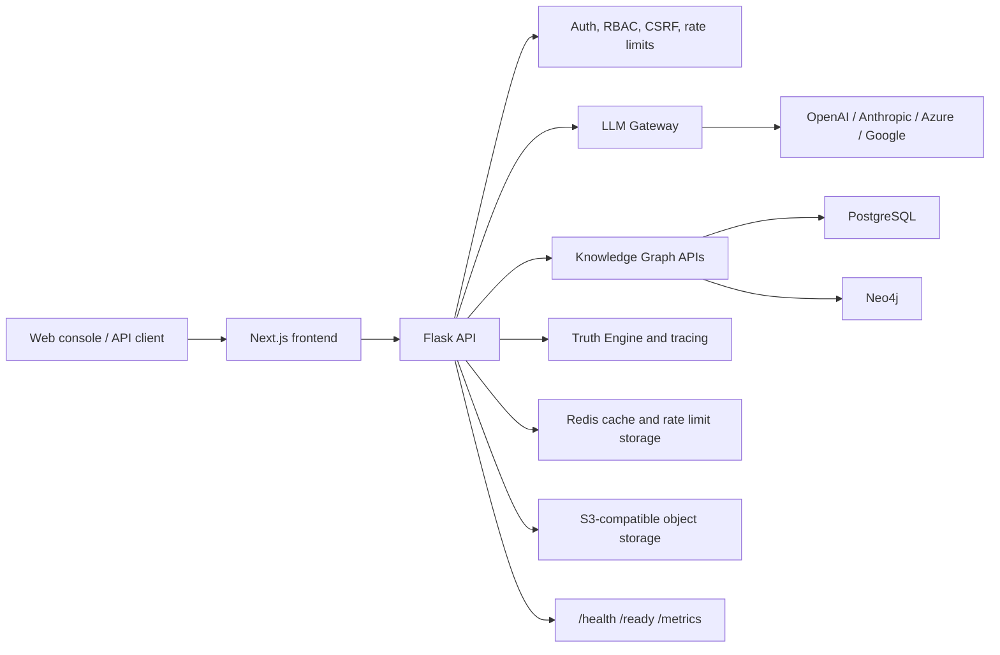

# DataLogicEngine

Enterprise AI orchestration, governed LLM routing, and knowledge graph reasoning in one deployable platform.

[](https://github.com/kherrera6219/DataLogicEngine/actions/workflows/ci.yml)
[](https://github.com/kherrera6219/DataLogicEngine/actions/workflows/security.yml)
[](https://github.com/kherrera6219/DataLogicEngine/actions/workflows/deploy.yml)
[](requirements.txt)
[](frontend/package.json)
[](LICENSE)

DataLogicEngine is a full-stack platform for building traceable AI systems over structured enterprise knowledge. It combines a Flask API, Next.js console, LLM gateway, 17-axis knowledge graph model, audit controls, and Windows/Electron packaging for local-first deployments.

> Recommended architecture asset path: `docs/assets/readme/architecture-overview.png`. Add a dark-mode-safe PNG/SVG export when publishing visual docs.

## Quickstart

Run the full local stack with Docker:

```bash
git clone https://github.com/kherrera6219/DataLogicEngine.git
cd DataLogicEngine
cp .env.template .env
docker compose up --build
```

Open:

| Service | URL |
| --- | --- |
| Web console | `http://localhost:3000` |
| Backend API | `http://localhost:5000` |
| Health probe | `http://localhost:5000/health` |
| Metrics | `http://localhost:5000/metrics` |
| Swagger UI | `http://localhost:5000/api/docs` |

Minimal API call:

```bash
curl http://localhost:5000/health
```

## Contents

- [Why DataLogicEngine](#why-datalogicengine)
- [Architecture](#architecture)
- [Installation](#installation)
- [Configuration](#configuration)
- [API Examples](#api-examples)
- [Deployment](#deployment)
- [Security and Compliance](#security-and-compliance)
- [Observability](#observability)
- [Roadmap](#roadmap)
- [Contributing](#contributing)
- [License](#license)
- [Repository Metadata](#repository-metadata)

## Why DataLogicEngine

DataLogicEngine is designed for teams that need AI workflows to be explainable, inspectable, and operable in regulated environments.

| Capability | What it provides |
| --- | --- |
| LLM gateway | Multi-provider routing for OpenAI, Anthropic, Azure OpenAI, Google, and Gemini-style providers with retries, circuit-breaker behavior, cost tracking, and audit metadata. |
| Knowledge graph | Structured graph model with sectors, domains, pillars, knowledge nodes, edges, and 17-axis reasoning support. |
| Traceable reasoning | Runs, traces, stage timing, persona context, and evidence references for audit reconstruction. |
| Governance | RBAC, MFA support, CSRF controls, CORS policy enforcement, prompt-injection checks, request limits, and immutable audit patterns. |
| Local-first distribution | Browser deployment plus Electron/NSIS Windows packaging for workstation and constrained-network scenarios. |
| Production operations | Docker Compose, cloud Dockerfile, health/readiness probes, metrics endpoint, Sentry integration, and CI/security workflows. |

## Architecture



### Runtime Components

| Layer | Components | Notes |
| --- | --- | --- |
| Frontend | Next.js 16, React 18, Electron 40 | Web console, desktop shell, graph visualization, admin surfaces. |
| Backend | Flask 3.1, SQLAlchemy, Socket.IO | API routing, auth, gateway orchestration, audit, tracing. |
| Data | PostgreSQL, Neo4j, Redis, MinIO | Relational state, graph state, cache/rate limits, object storage. |
| AI | OpenAI, Anthropic, Azure OpenAI, Google/Gemini clients | Provider keys are resolved at runtime from environment or configured provider records. |
| Quality | Pytest, Ruff, Vitest, Playwright, GitHub Actions | CI includes backend, frontend, governance, security, deploy, and Windows packaging checks. |

## Installation

### Prerequisites

| Tool | Version | Purpose |
| --- | --- | --- |
| Python | 3.11+ | Backend runtime and tests |
| Node.js | 20+ | Frontend and Electron tooling |
| Docker | Current stable | Local full-stack development |
| PostgreSQL | 15+ | Production relational store |
| Redis | 7+ | Cache, rate limiting, async support |
| Neo4j | 5+ | Knowledge graph storage |

### Backend Development

```bash
python -m venv .venv
.venv\Scripts\activate  # Windows
python -m pip install --upgrade pip
pip install -r requirements.txt
copy .env.template .env
python app.py
```

On macOS/Linux:

```bash
python -m venv .venv
source .venv/bin/activate
python -m pip install --upgrade pip
pip install -r requirements.txt
cp .env.template .env
python app.py
```

### Frontend Development

```bash
cd frontend
npm ci
npm run dev
```

### Desktop Build

```bash
npm --prefix frontend run electron:dist
```

Installer artifacts are copied to the repository root as:

- `DataLogicEngine Setup <version>.exe`
- `DataLogicEngine Setup Latest.exe`
- matching `.sha256` and `.blockmap` files

## Configuration

Copy `.env.template` to `.env` and set values for your deployment target.

### Required Production Variables

| Variable | Required | Description |
| --- | --- | --- |
| `FLASK_ENV` | Yes | Use `production` for deployed environments. |
| `SECRET_KEY` | Yes | Flask session secret. Generate a unique 64+ character value. |
| `JWT_SECRET_KEY` | Yes | JWT signing secret. Generate a unique 64+ character value. |
| `SESSION_SECRET` | Yes | Session signing secret used by runtime checks. |
| `DATABASE_URL` | Yes | SQLAlchemy database URL. PostgreSQL is recommended for production. |
| `CORS_ORIGINS` | Yes | Comma-separated allowed browser origins. Do not use `*` in production. |
| `ADMIN_USERNAME` | Initial setup | Initial administrative username. |
| `ADMIN_PASSWORD` | Initial setup | Strong initial password. Rotate after first login. |
| `ADMIN_EMAIL` | Initial setup | Initial administrator email. |

### Provider and Integration Variables

| Variable | Description |
| --- | --- |
| `OPENAI_API_KEY` | OpenAI provider key. |
| `ANTHROPIC_API_KEY` | Anthropic provider key. |
| `AZURE_OPENAI_ENDPOINT` | Azure OpenAI endpoint URL. |
| `AZURE_OPENAI_API_KEY` | Azure OpenAI provider key. |
| `GOOGLE_API_KEY` / `GEMINI_API_KEY` | Google/Gemini provider key. |
| `SENTRY_DSN` | Enables crash reporting when configured. |
| `SENTRY_TRACES_SAMPLE_RATE` | Distributed trace sampling rate. Default: `0.1`. |
| `SENTRY_PROFILES_SAMPLE_RATE` | Profiling sample rate. Default: `0.1`. |

### Data Services

| Variable | Default / Example | Description |
| --- | --- | --- |
| `REDIS_URL` | `redis://localhost:6379/0` | Cache and runtime coordination. |
| `RATELIMIT_STORAGE_URI` | `redis://localhost:6379` | Flask-Limiter storage backend. |
| `NEO4J_URI` | `bolt://localhost:7687` | Neo4j Bolt endpoint. |
| `NEO4J_USER` | `neo4j` | Neo4j username. |
| `NEO4J_PASSWORD` | unset | Neo4j password. |
| `OBJECT_ENDPOINT_URL` | `http://localhost:9000` | S3-compatible object storage endpoint. |
| `OBJECT_ACCESS_KEY` | unset | Object storage access key. |
| `OBJECT_SECRET_KEY` | unset | Object storage secret key. |
| `OBJECT_BUCKET` | `datalogic` | Object storage bucket. |

## API Examples

Base URLs:

| Environment | Base URL |
| --- | --- |
| Local backend | `http://localhost:5000` |
| Versioned API | `http://localhost:5000/api/v1` |
| Production | `https://your-domain.example/api/v1` |

### Health and Readiness

```bash
curl http://localhost:5000/health
curl http://localhost:5000/live
curl http://localhost:5000/ready
```

### Authentication

```bash
curl -X POST http://localhost:5000/api/v1/auth/login \
  -H "Content-Type: application/json" \
  -d '{
    "username": "operator@example.com",
    "password": "replace-with-a-secret"
  }'
```

### LLM Gateway Request

```bash
curl -X POST http://localhost:5000/api/v1/gateway/chat \
  -H "Authorization: Bearer $TOKEN" \
  -H "Content-Type: application/json" \
  -d '{
    "messages": [
      {
        "role": "user",
        "content": "Summarize the compliance impact of this control change."
      }
    ],
    "model": "gpt-4o",
    "mode": "ukg",
    "trace_enabled": true
  }'
```

### Knowledge Graph Query

```bash
curl -H "Authorization: Bearer $TOKEN" \
  http://localhost:5000/api/v1/knowledge-nodes
```

### Knowledge Algorithm Execution

```bash
curl -X POST http://localhost:5000/api/v1/ka/algorithms/KA-001/execute \
  -H "Authorization: Bearer $TOKEN" \
  -H "Content-Type: application/json" \
  -d '{
    "input": {
      "claim": "New customer data must remain in-region.",
      "jurisdiction": "US"
    }
  }'
```

### Standard Response Shape

```json
{
  "success": true,
  "data": {},
  "error": null,
  "timestamp": "2026-01-11T19:35:00Z"
}
```

## Deployment

### Docker Compose

Use Docker Compose for local integration testing or single-host evaluation:

```bash
cp .env.template .env
docker compose up --build -d
docker compose ps
```

### Cloud Container

`Dockerfile.cloud` builds the frontend and backend into a single runtime image:

```bash
docker build -f Dockerfile.cloud -t datalogicengine:latest .
docker run --env-file .env -p 5000:5000 -p 3000:3000 datalogicengine:latest
```

### Production Checklist

- Set `FLASK_ENV=production`.
- Use PostgreSQL, Redis, Neo4j, and S3-compatible object storage outside the app container.
- Set unique secrets for `SECRET_KEY`, `JWT_SECRET_KEY`, and `SESSION_SECRET`.
- Configure exact `CORS_ORIGINS`.
- Run database migrations instead of enabling `AUTO_CREATE_SCHEMA`.
- Terminate TLS at a trusted reverse proxy or platform load balancer.
- Enable Sentry or equivalent crash reporting.
- Confirm `/health`, `/ready`, and `/metrics` are monitored.
- Review [`docs/DEPLOYMENT.md`](docs/DEPLOYMENT.md), [`docs/OPERATIONAL_RUNBOOKS.md`](docs/OPERATIONAL_RUNBOOKS.md), and [`deploy/DEPLOYMENT_CHECKLIST.md`](deploy/DEPLOYMENT_CHECKLIST.md).

## Security and Compliance

DataLogicEngine includes security controls intended for enterprise deployments, but each deployment must still be threat-modeled and configured for its environment.

| Area | Built-in Support |
| --- | --- |
| Authentication | Session auth, JWT flows, MFA routes, SSO/OIDC integration hooks, desktop challenge flow. |
| Authorization | RBAC utilities, admin route controls, tenant-aware patterns. |
| Request security | CSRF, request size limits, CORS enforcement, rate limiting, SSRF allowlisting utilities. |
| Data protection | Secret resolution controls, encryption manager, PII redaction utilities, audit logging. |
| AI governance | Prompt-injection checks, provider usage tracking, trace IDs, policy/gateway hooks. |
| Supply chain | GitHub Actions security workflow, Bandit, npm audit, pip-audit, SBOM-oriented workflow steps. |
| Release governance | Windows installer governance, signing workflows, integrity reporting, release checklist. |

Security references:

- [`SECURITY.md`](SECURITY.md)
- [`docs/SECURITY.md`](docs/SECURITY.md)
- [`docs/AI_MANAGEMENT_SYSTEM_42001.md`](docs/AI_MANAGEMENT_SYSTEM_42001.md)
- [`docs/SDLC_SSDF_MAPPING.md`](docs/SDLC_SSDF_MAPPING.md)
- [`docs/SLSA_LEVEL_3_ATTESTATION.md`](docs/SLSA_LEVEL_3_ATTESTATION.md)

Do not report vulnerabilities in public issues. Follow the private reporting process in [`SECURITY.md`](SECURITY.md).

## Observability

| Signal | Location |
| --- | --- |
| Liveness | `GET /live` |
| Readiness | `GET /ready` |
| Health summary | `GET /health` |
| Runtime metrics | `GET /metrics` |
| API docs | `GET /api/docs` |
| Gateway provider usage | LLM gateway usage models and admin routes |
| Crash reporting | `SENTRY_DSN`, `SENTRY_TRACES_SAMPLE_RATE`, `SENTRY_PROFILES_SAMPLE_RATE` |
| Run tracing | `/api/v1/trace/*` and run-oriented UI routes |

Recommended production integrations:

- Prometheus-compatible scraping for `/metrics`.
- Sentry or an equivalent error and performance backend.
- Centralized JSON logs via `python-json-logger` and platform log shipping.
- Alerting on readiness failures, provider error spikes, token cost anomalies, and authentication failures.

## Testing

```bash
# Backend
python -m pytest tests/
python -m ruff check .
python -m pip_audit -r requirements.txt --desc

# Frontend
npm --prefix frontend ci
npm --prefix frontend run lint
npm --prefix frontend run typecheck
npm --prefix frontend run test
npm --prefix frontend audit --audit-level=high
```

Current CI runs:

- Backend tests and dependency audit
- Frontend lint, typecheck, tests, and build
- Security scan workflow
- Deploy build and test workflow
- Windows packaging smoke test
- Governance and release checklist workflows

## Roadmap

| Horizon | Focus |
| --- | --- |
| Near term | Tighten public API contracts, reduce legacy route aliases, improve generated OpenAPI coverage. |
| Near term | Add public architecture assets under `docs/assets/readme/`. |
| Mid term | Expand deployment reference material for Kubernetes, managed Postgres, managed Redis, and managed Neo4j. |
| Mid term | Publish signed release artifacts with checksums and provenance metadata. |
| Long term | Harden multi-tenant operations, cost controls, and policy-as-code governance for larger deployments. |

See [`TODO.md`](TODO.md) for the canonical open work list and [`docs/RELEASE_CHECKLIST.md`](docs/RELEASE_CHECKLIST.md) for release readiness gates.

## Contributing

Contributions are welcome when they align with the project license and governance model.

1. Read [`CONTRIBUTING.md`](CONTRIBUTING.md).
2. Read [`CODE_OF_CONDUCT.md`](CODE_OF_CONDUCT.md).
3. Create an issue for non-trivial changes before implementation.
4. Run backend and frontend checks locally.
5. Submit a pull request using the repository template.

Development references:

- [`DEVELOPMENT.md`](DEVELOPMENT.md)
- [`TESTING.md`](TESTING.md)
- [`docs/DEVELOPER_GUIDE.md`](docs/DEVELOPER_GUIDE.md)
- [`docs/DOCUMENTATION_STANDARDS.md`](docs/DOCUMENTATION_STANDARDS.md)

## License

DataLogicEngine is licensed under the [PolyForm Noncommercial License 1.0.0](LICENSE).

Personal, research, and educational use are permitted under the license terms. Commercial use, production deployment in a business environment, or integration into a paid product requires a separate commercial license. See [`COMMERCIAL_LICENSE.md`](COMMERCIAL_LICENSE.md).

## Repository Metadata

### Existing Supporting Files

| File | Status |
| --- | --- |
| `LICENSE` | Present |
| `COMMERCIAL_LICENSE.md` | Present |
| `SECURITY.md` | Present |
| `CONTRIBUTING.md` | Present |
| `CODE_OF_CONDUCT.md` | Present |
| `SUPPORT.md` | Present |
| `CHANGELOG.md` | Present |
| `.github/CODEOWNERS` | Present |
| `.github/pull_request_template.md` | Present |
| `.github/ISSUE_TEMPLATE/*` | Present |
| `.env.template` | Present |
| `Dockerfile.cloud` and `docker-compose.yml` | Present |

### Recommended Additions

| Recommendation | Purpose |
| --- | --- |
| `docs/assets/readme/architecture-overview.png` | Public README architecture image for GitHub social previews and non-Mermaid consumers. |
| `.github/FUNDING.yml` | Optional sponsorship metadata if the project accepts funding. |
| `CITATION.cff` | Citation metadata for research and academic users. |
| GitHub repository topics | Suggested: `ai`, `llm`, `knowledge-graph`, `flask`, `nextjs`, `governance`, `compliance`, `enterprise-ai`. |
