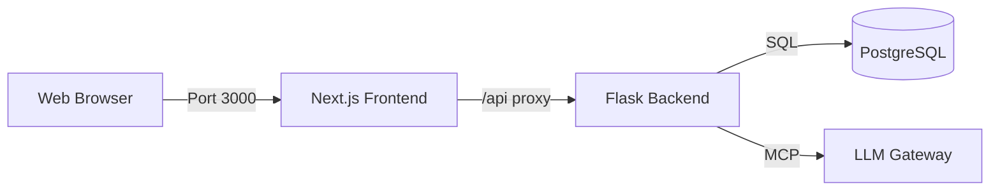

# Universal Knowledge Graph (UKG) System

> Enterprise-grade AI-powered knowledge management platform with a Next.js Frontend and Flask/MCP Backend.

[](LICENSE)
[](https://nextjs.org/)
[](https://react.dev/)
[](https://www.python.org/downloads/)
[](https://flask.palletsprojects.com/)
[](https://www.postgresql.org/)

---

## Overview

The **Universal Knowledge Graph (UKG)** is a dual-stack enterprise application designed for sophisticated knowledge synthesis and AI agent orchestration.

- **Frontend**: Modern **Next.js 16** application with **React 19** (TypeScript, Tailwind CSS) providing a rich, responsive user interface.
- **Backend**: Robust **Flask 3.1** API acting as the Knowledge Engine, MCP Server, and LLM Gateway with **PostgreSQL 15+** database.

### Core Capabilities

- **17-Axis Framework**: Multi-dimensional knowledge organization that contextualizes data across Sectors, Domains, Knowledge Types, Temporal, Regulatory, Location, and more.
- **Truth Engine**: 5-tier workflow system (Trivial → Simple → Complex → Critical → Expert) with budget tracking, compliance, and immutable audit trails using hash-chain technology.
- **Full Traceability**: Comprehensive execution tracing for every AI reasoning step with 40+ database tables capturing runs, stages, evidence, claims, personas, and policy decisions.
- **MCP Integration**: Native Model Context Protocol server exposing 100+ Knowledge Algorithms as executable tools for LLM agents.
- **LLM Gateway**: Universal adapter supporting OpenAI, Azure OpenAI, Anthropic, and Google Vertex AI with automatic failover, circuit breakers, and rate limiting.
- **Multi-tenancy**: Complete tenant isolation with `tenant_id` enforcement across all data models for enterprise security.
- **Enterprise Security**: SSO/OIDC integration, API key management, SIEM audit logging, password policies, and SOC2/GDPR compliance features.

---

## How It Works: The "API In / API Out" System

The DataLogicEngine operates as an intelligent middleware layer (The "Brain") between your applications and raw LLMs.

### 1. API In (The Request)

External systems (Web Apps, Slack Bots, ERPs) send a standard chat request to the Gateway.

- **Input**: "What are the compliance risks for AI in Healthcare?"
- **Context**: The system identifies the sectors (**Healthcare**) and domains (**AI**, **Compliance**).

### 2. Processing (The "Black Box" Illuminated)

Instead of a simple LLM pass, the engine executes a **Trace Run**:

1.  **Axis Resolution**: Maps the query to the 17-Axis Framework.
2.  **Knowledge Retrieval**: Fetches high-fidelity data from the Knowledge Graph.
3.  **Simulation**: Risks are simulated against regulatory frameworks (e.g., HIPAA).
4.  **Synthesis**: The LLM generates a response based _only_ on this verified context.

### 3. API Out (The Response)

The system returns the answer _plus_ a Trace ID.

- **Output**: "The primary risks are..."
- **Traceability**: "Reference: Trace #8a7b9c (Audit Log)"

> **Why this matters**: You get the generic reasoning power of an LLM combined with the specific, verified accuracy of your enterprise data.

## Quick Start

### Prerequisites

- Node.js 18+
- Python 3.11+
- PostgreSQL 15+ (Local or Cloud)
- Redis (Optional, for rate limiting)

### 1. Backend Setup (Flask)

Runs the knowledge engine and API on `http://localhost:5000`.

```bash
# Terminal 1: Backend
cd DataLogicEngine
python -m venv .venv
source .venv/bin/activate  # Windows: .venv\Scripts\activate

pip install -r requirements.txt

# Initial Setup
cp .env.template .env      # Configure DATABASE_URL in .env
flask db upgrade           # Run migrations
python backend/seed_data.py

python main.py
```

### 2. Frontend Setup (Next.js)

Runs the UI on `http://localhost:3000` and proxies API requests to backend.

```bash
# Terminal 2: Frontend
cd frontend
npm install
npm run dev
```

Visit **[http://localhost:3000](http://localhost:3000)** to launch the application.

---

## Architecture

The system uses a split architecture for maximum scalability and developer experience.



### Frontend (`/frontend`)

- **Framework**: Next.js 16 (App Router)
- **React**: React 19
- **Language**: TypeScript 5.x
- **Styling**: Tailwind CSS 4.x + Shadcn UI (Radix UI components)
- **Data Fetching**: SWR for caching and real-time updates
- **Icons**: Lucide React
- **Features**:
  - `dashboard/`: Real-time system monitoring with analytics
  - `chat/`: Interactive chat interface with streaming responses
  - `runs/`: Comprehensive trace run explorer with stage-by-stage breakdown
  - `graph/`: Knowledge graph visualization
  - `knowledge/`: Knowledge browser for nodes and edges
  - `algorithms/`: Knowledge Algorithm browser
  - `analytics/`: System analytics dashboard
  - `admin/`: Admin panel with compliance and MCP management
  - `settings/` & `profile/`: User configuration pages

### Backend (`/backend`, `/core`)

- **Framework**: Flask 3.1 with Gunicorn (4 workers)
- **Database**: PostgreSQL 15+ with SQLAlchemy 2.0
- **Cache/Queue**: Redis 5+ for caching, rate limiting, and Celery tasks
- **Protocol**: HTTP REST API + MCP (Model Context Protocol)
- **Key Modules**:
  - `backend/llm_gateway/`: Universal LLM adapter (OpenAI, Azure, Anthropic, Google Vertex) with circuit breakers
  - `backend/truth_engine/`: 5-tier reasoning framework with policy gates and budget management
  - `backend/tracing/`: Distributed tracing system (TraceRun, TraceStage, TraceEvidence, TraceClaim)
  - `backend/auth/`: SSO/OIDC, API keys, session management, 2FA support
  - `backend/security/`: Security headers, audit logging, SIEM integration
  - `backend/middleware/`: Correlation IDs, rate limiting, timeouts, security headers
  - `core/mcp/`: MCP server exposing 100+ Knowledge Algorithms as tools
  - `core/axes/`: 17-Axis Framework implementation
  - `core/simulation/`: Scenario simulation and query persona engine
  - `core/knowledge_algorithm/`: 100+ algorithm implementations
  - `routes/`: API blueprints (auth, admin, knowledge, mcp, ka, compliance, simulation)

---

## Enterprise Features

The system includes comprehensive enterprise-grade capabilities:

### Security & Authentication
- **🔐 SSO/OIDC Integration**: Azure AD/Entra ID authentication via Authlib
- **🔑 API Key Management**: Encrypted API keys (Fernet) with rate limiting and expiration
- **🔒 Password Policy**: Min 12 characters, complexity requirements, password history tracking
- **2️⃣ 2FA Support**: TOTP-based two-factor authentication (PyOTP)
- **🛡️ Security Headers**: CSP, HSTS, X-Frame-Options, SameSite cookies

### Compliance & Auditing
- **📋 Truth Engine Audit Trail**: EU AI Act Article 53 compliant hash-chain immutability
- **📊 SIEM Integration**: `AuditLogger` with Syslog forwarding and CSV/JSON export
- **📜 Audit Logs**: Comprehensive API request tracking with user actions, endpoints, status codes
- **✅ SOC2 Ready**: Evidence collection, retention policies, encrypted at rest
- **🌍 GDPR Compliant**: Data minimization, tenant isolation, right to be forgotten support
- **🏥 HIPAA Ready**: Audit trails, encryption, role-based access control

### Multi-tenancy & Scalability
- **🏢 Multi-tenancy**: Complete tenant isolation with `tenant_id` enforcement across all 40+ tables
- **⚡ Connection Pooling**: PostgreSQL pool (size=20, max_overflow=40)
- **💾 Redis Caching**: Knowledge graph query caching and session management
- **🔄 Celery Tasks**: Asynchronous background processing
- **🚦 Rate Limiting**: Per-user and per-API-key limits with Redis backend

### Reliability & Observability
- **🔁 Circuit Breakers**: LLM Gateway implements circuit breaker pattern for resilience
- **🔄 Auto-failover**: Multiple LLM provider support with automatic fallback
- **📊 Distributed Tracing**: Correlation IDs (X-Request-ID) across entire stack
- **🐛 Error Tracking**: Sentry integration for production monitoring
- **📈 Performance Metrics**: Trace run timing, LLM usage statistics
- **❤️ Health Checks**: `/health` endpoint for load balancers

---

## Python SDKs

DataLogicEngine provides two Python SDKs for different use cases:

### 1. UKG Python SDK (`/sdk/python`)
**Lightweight client for Trace API integration**

```python
from ukg_sdk import UKGClient

client = UKGClient(base_url="http://localhost:5000/api/v1", api_key="your-key")
runs = client.runs.list(status="pass")
evidence = client.runs.evidence("run-uuid")
```

- **Use Case**: External applications querying trace data
- **Features**: Fully typed, async support, auto-retry, rate limiting aware
- **API Coverage**: sessions, runs, exports, compliance

### 2. UKG Overlay SDK (`/sdk/UKG_Python_SDK`)
**Full-featured SDK for advanced UKG operations**

```python
from ukg_sdk import UKGOverlay
from ukg_sdk.providers import OpenAIProvider

provider = OpenAIProvider()
ukg = UKGOverlay(provider=provider, model="gpt-4o-mini")
result = await ukg.run(query="Explain compliance risks", user_id="kevin")
```

- **Use Case**: Building applications with embedded UKG reasoning
- **Features**: 17-axis resolver, memory adapters, compliance audit storage, bundled registries
- **Includes**: Workflow v2.5 (Truth17), TruthEngine v7.3, KA 1-114, OpenAPI v3.2 spec

---

## API Documentation

The backend exposes a comprehensive REST API at `http://localhost:5000/api/v1`.

| Service        | Endpoint Prefix      | Description                                   |
| :------------- | :------------------- | :-------------------------------------------- |
| **Auth**       | `/api/v1/auth`       | Login, Register, SSO, Logout, Session management |
| **Gateway**    | `/api/v1/gateway`    | Chat with UKG-enhanced LLMs (streaming support) |
| **Trace**      | `/api/v1/trace`      | Store and retrieve execution logs with full audit trails |
| **MCP**        | `/api/v1/mcp`        | Model Context Protocol endpoints (servers, tools, resources) |
| **Knowledge**  | `/api/v1/knowledge`  | Knowledge graph operations (nodes, edges, queries) |
| **KA**         | `/api/v1/ka`         | Knowledge Algorithm execution and management |
| **Compliance** | `/api/v1/compliance` | Audit logs, standards, reporting, evidence export |
| **Admin**      | `/api/v1/admin`      | User management, provider configuration (admin only) |
| **Simulation** | `/api/v1/simulation` | Scenario simulation and risk analysis |
| **System**     | `/health`            | System health check (DB, Redis, services) |

See [`docs/API.md`](docs/API.md) for detailed endpoint documentation.

---

## Testing

```bash
# Backend Tests
pytest tests/

# Frontend Tests (Lint/Build check)
cd frontend
npm run lint
npm run build
```

---

## License

MIT
