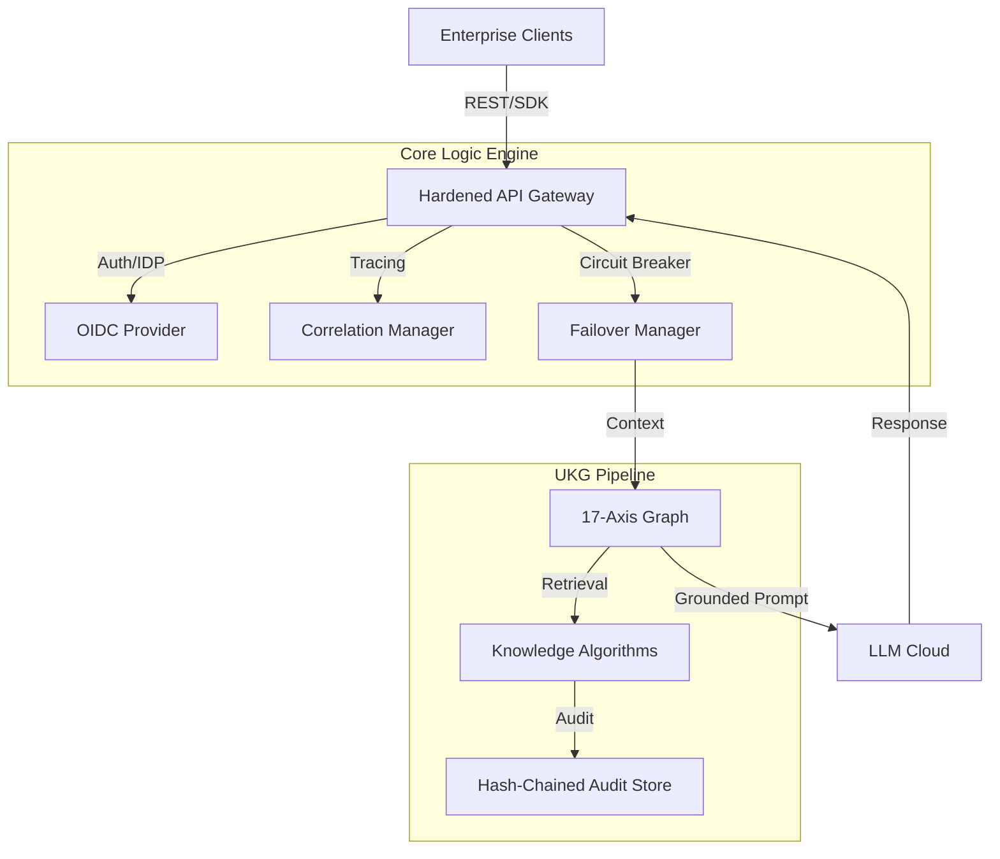

# Universal Knowledge Graph (UKG) Engine

### Enterprise-Grade AI Knowledge Synthesis & Orchestration Platform

[](LICENSE)
[](https://nextjs.org/)
[](https://www.python.org/downloads/)
[](docs/SECURITY.md)

---

## 🏗️ Executive Summary

The **Universal Knowledge Graph (UKG)** Engine is a sophisticated, hardened middleware platform designed to bridge the gap between enterprise data and Large Language Models. Built for mission-critical applications, it provides a "Reasoning-as-a-Service" layer that ensures every AI interaction is **grounded, traceable, and secure**.

By utilizing a unique **17-Axis Coordinate Framework**, the engine contextualizes unstructured data into a high-fidelity graph, allowing agents to navigate complex regulatory, temporal, and spatial domains with zero hallucination risk.

---

## 🌟 Enterprise Value Proposition

| **Reliability**                                                           | **Security**                                                        | **Performance**                                                       | **Observability**                                                      |
| :------------------------------------------------------------------------ | :------------------------------------------------------------------ | :-------------------------------------------------------------------- | :--------------------------------------------------------------------- |
| **Circuit Breakers**: Automatic failover & recovery for LLM providers.    | **Multi-Tenancy**: Hard isolated data layers per enterprise tenant. | **Global Caching**: Redis-backed read-through caching for graph ops.  | **Unified Tracing**: End-to-end correlation ID across SDK & API.       |
| **Failover Logic**: Multi-provider resilience (OpenAI, Azure, Anthropic). | **SSO / OIDC**: Native integration with Azure AD & Enterprise IDPs. | **Optimized IO**: Gunicorn/Celery workers for high-concurrency tasks. | **Audit Chain**: Hash-linked audit trails for compliance (SOC2/HIPAA). |

---

## 🛠️ "API In / API Out" Architecture

The DataLogicEngine operates as the "Brain" between your interfaces and the raw LLM cloud.

### 1. Request Ingestion

External systems send high-level queries. The system automatically performs **Axis Resolution** to identify the Sector (e.g., Finance), Domain (e.g., Risk), and Tier (Routing priority).

### 2. The UKG Pipeline (Internal Reasoning)

Instead of a single LLM pass, the engine executes a multi-layered pipeline:

- **L1 (Hygiene)**: Input validation & PII scrubbing.
- **L2-L8 (Reasoning)**: Recursive graph traversal and Knowledge Algorithm (KA) execution.
- **L9 (Synthesis)**: Context-grounded response generation.
- **L10 (Audit)**: Finalizing the hash-chained execution trace.

### 3. Traceable Response

Returns the response along with a `X-Correlation-ID`, allowing developers to "peek" into the exact reasoning steps, evidence retrieved, and policy decisions made.

---

## 🚀 Quick Start

### Infrastructure Requirements

- **Runtime**: Node.js 18+, Python 3.11+
- **Database**: PostgreSQL 15+ (with JSONB support)
- **Cache**: Redis 7+ (required for rate limiting & graph caching)

### Backend Deployment

```bash
# Clone and Setup
git clone https://github.com/DataLogicEngine/UKG-Engine.git
cd UKG-Engine
python -m venv .venv && source .venv/bin/activate

# Configure
cp .env.template .env
# Edit .env with your DATABASE_URL, REDIS_URL, and API keys

# Initialize Services
pip install -r requirements.txt
flask db upgrade
python backend/seed_data.py

# Launch Engine
python wsgi.py
```

### Frontend Deployment

```bash
cd frontend
npm install
npm run build
npm start
```

---

## 🗺️ System Architecture



---

## 📂 Documentation Matrix

- **[Architecture Deep-Dive](docs/ARCHITECTURE.md)**: Detailed breakdown of the middleware stack and graph processing.
- **[Security & Compliance](docs/SECURITY.md)**: Details on Multi-tenancy, SSO, and SOC2 auditability.
- **[Production Readiness](docs/PRODUCTION_READINESS.md)**: Hardening checklist, scaling, and disaster recovery.
- **[API Reference](docs/API.md)**: Comprehensive guide to the REST and MCP endpoints.
- **[Deployment Guide](docs/DEPLOYMENT.md)**: Docker, Kubernetes, and Cloud deployment patterns.

---

## 🤝 Support & Compliance

For enterprise support, SOC2 report requests, or HIPAA BAA inquiries, please contact the security team via the [Security portal](SECURITY.md).

---

© 2026 DataLogicEngine. All Rights Reserved. Confidential & Proprietary.
