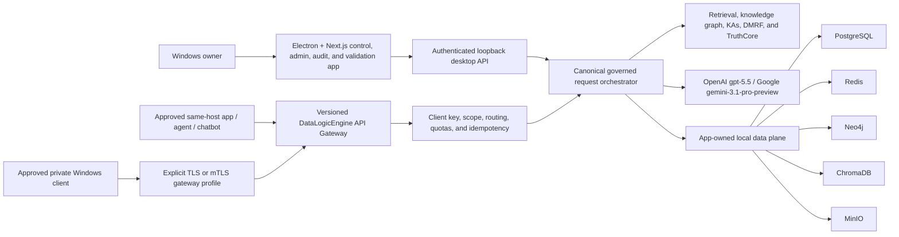

# DataLogicEngine

Local-first Windows governed LLM middleware with a production desktop control,
administration, audit, observability, and validation application.

> **Current Status - Production completion program active; not a production release**
> DataLogicEngine is available for local engineering evaluation and architecture validation. A July 12, 2026 repository-wide review found that substantial components exist but the complete governed lifecycle, full internal data plane, external gateway, security boundary, installed-system qualification, accessibility, signing, and release evidence are not yet production-complete. Work begins at Phase 0 of [`PRODUCTION_COMPLETION_PLAN_2026.md`](PRODUCTION_COMPLETION_PLAN_2026.md). Current actions are tracked in [`TODO.md`](TODO.md), and the evidence baseline is [`docs/audits/DataLogicEngine_Design_vs_Implementation_Audit_2026-07-12.md`](docs/audits/DataLogicEngine_Design_vs_Implementation_Audit_2026-07-12.md).

[](https://github.com/kherrera6219/DataLogicEngine/actions/workflows/ci.yml)
[](https://github.com/kherrera6219/DataLogicEngine/actions/workflows/security.yml)
[](https://github.com/kherrera6219/DataLogicEngine/actions/workflows/deploy.yml)
[](requirements.txt)
[](frontend/package.json)
[](LICENSE)

DataLogicEngine (DLE) is a local-first governed LLM middleware platform built
around the Universal Knowledge Graph (UKG).

Its production purpose is to accept requests from approved applications, agents,
and chatbots through the DataLogicEngine API Gateway; apply retrieval, reasoning,
policy, validation, evidence, and audit controls; call an owner-configured model;
and return a governed response.

The Windows/Electron frontend is the production control, configuration,
administration, audit, observability, support, and validation application. Its
built-in chat is the human-visible reference client for the same canonical
governed request lifecycle external clients use. Calling a page a validation or
administration surface does not lower its production quality requirements.

Designed for enterprise, government, compliance, cybersecurity, acquisition, and
research environments, the production contract requires every governed response
to be reconstructable from real evidence, executed stages, policy decisions,
provider/tool calls, validation results, and audit records. Compliance mappings
are evidence-guided design references, not formal certification claims.

**Production architecture:** DataLogicEngine is an owner-operated, local-first
Windows application. The Electron + Next.js desktop runs over a Flask + SQLAlchemy
backend. PostgreSQL, Redis, Neo4j, ChromaDB, and MinIO are intentional app-owned
internal production services with separate responsibilities. The gateway is
loopback-only by default and may later be explicitly enabled for qualified
private Windows clients; it is not a public or multi-tenant SaaS service. Model
inference uses an owner-supplied OpenAI `gpt-5.5` or Google
`gemini-3.1-pro-preview` key. External clients receive DataLogicEngine client
credentials, never the provider credential.

Major subsystems in the current local-first desktop build:

- External API Gateway foundation and client-key model
- Desktop control, administration, audit, and validation console
- Built-in governed-chat reference client
- Universal Knowledge Graph (UKG)
- 17-Axis Knowledge Framework
- 10-Layer Truth Engine
- 12-Step Refinement Workflow
- Knowledge Algorithm Framework (100+ KAs)
- Multi-Agent Orchestration
- GraphRAG Integration
- Knowledge Ingestion Pipeline
- Trace Viewer
- MCP Integration Framework
- PostgreSQL, Redis, Neo4j, ChromaDB, and MinIO lifecycle foundations
- Enterprise Audit & Governance Framework
- Cloud AI model selection — OpenAI gpt-5.5 or Google gemini-3.1-pro-preview (BYOK)

Current production-completion focus:

- Phase 0 scope, authority, service-delivery, requirements, and baseline approval
- P0/P1 trust-boundary and canonical governed-path closure
- Full app-owned internal data-plane delivery, migration, backup, and recovery
- External API Gateway and LLM middleware productization
- Complete frontend control-plane and reference-client behavior
- Installed-system, accessibility, security, signing, and release qualification

What Makes DataLogicEngine Different?

Most AI applications primarily answer questions.

DataLogicEngine's production goal is to govern the request and prove how the
result was produced.

Core Differentiators

**Universal Knowledge Graph (UKG)**

A structured knowledge system designed to organize information, expertise, regulations, compliance requirements, risk factors, locations, time contexts, and reasoning workflows into a unified framework accessible to human operators and AI agents.

**17-Axis Knowledge Framework**

A multidimensional coordinate system that maps every request across knowledge domains, industries, regulatory frameworks, compliance requirements, expertise models, geography, temporal context, risk profiles, and governance policies.

**10-Layer Truth Engine**

A progressive reasoning architecture that combines retrieval, validation, simulation, planning, trust analysis, safety controls, and audit generation into a governed AI workflow.

**12-Step Refinement Workflow**

A structured reasoning improvement pipeline that continuously validates, refines, audits, and strengthens outputs before release.

**Knowledge Algorithm Framework**

More than 100 specialized Knowledge Algorithms (KAs) provide modular capabilities for planning, validation, compliance analysis, contradiction detection, risk assessment, reasoning control, governance policy enforcement, and audit trace generation.

**Explainable AI production contract**

Every production-governed response must be traceable through:

- Evidence sources
- Personas
- Knowledge Algorithms
- Validation checkpoints
- Refinement stages
- Governance policies
- Audit records

**Local-first data, cloud AI model (BYOK)**

The production data plane, retrieval, memory, evidence, and reasoning state remain
inside the owner-operated Windows system. The LLM is an owner-selected cloud
model using BYOK for **OpenAI `gpt-5.5`** or **Google
`gemini-3.1-pro-preview`**. Provider inference and explicitly approved connectors
are the only intended external processing paths, and every disclosure must be
governed and recorded locally.

**Model Context Protocol (MCP)**

Native MCP support enables integration with tools, resources, external agent systems, subscriptions, and dynamic plugin architectures.


The canonical completion roadmap is the 19-phase
[`PRODUCTION_COMPLETION_PLAN_2026.md`](PRODUCTION_COMPLETION_PLAN_2026.md). It
progresses from Phase 0 scope/baseline approval through trust-boundary repair,
full internal-service delivery, one canonical governed path, API Gateway
productization, subsystem and frontend completion, qualification, professional
documentation replacement, release lock, and controlled launch. See
[`TODO.md`](TODO.md) for the current executable work queue.

> Recommended architecture asset path: `docs/assets/readme/architecture-overview.svg`. Keep this dark-mode-safe visual synchronized with the README architecture diagram.

## Quick Links

- 🚀 **Quick Start**: [Build the Windows installer from source](#quickstart)
- **Production Completion Plan**: [`PRODUCTION_COMPLETION_PLAN_2026.md`](PRODUCTION_COMPLETION_PLAN_2026.md)
- **Design vs. Implementation Audit**: [`docs/audits/DataLogicEngine_Design_vs_Implementation_Audit_2026-07-12.md`](docs/audits/DataLogicEngine_Design_vs_Implementation_Audit_2026-07-12.md)
- 🔒 **Report Security Issues**: See [`SECURITY.md`](SECURITY.md) for responsible disclosure
- ❓ **Ask Questions**: Open a [GitHub Discussion](https://github.com/kherrera6219/DataLogicEngine/discussions)
- 📚 **Need Help?**: See [Getting Help](#getting-help)
- 🚢 **Deploy to Production**: [`docs/DEPLOYMENT.md`](docs/DEPLOYMENT.md)

## Quickstart

The Windows installer is intentionally built locally from source. The generated `.exe`, `.blockmap`, and checksum files are large release artifacts and should not be uploaded to GitHub. Use this path when starting from a clean Windows machine and producing the installer yourself.

### 1. Download and unpack the source

Use either the GitHub ZIP download or a Git clone.

ZIP path:

1. Open `https://github.com/kherrera6219/DataLogicEngine`.
2. Select **Code** -> **Download ZIP**.
3. Extract the ZIP into a writable local folder such as `C:\software\DataLogicEngine`.
4. Open PowerShell in the extracted repository folder.

Git path:

```powershell
git clone https://github.com/kherrera6219/DataLogicEngine.git C:\software\DataLogicEngine
Set-Location C:\software\DataLogicEngine
```

### 2. Install required tools

Install these before building:

| Requirement | Use |
| --- | --- |
| Windows 11 | Primary desktop build target |
| Python 3.11 | Backend environment and build scripts |
| Node.js 24+ with npm | Frontend and Electron packaging |
| WSL2 with Podman Machine (production target) | Approved app-managed five-service container runtime; qualification remains open |
| Docker Desktop with Compose v2 | Developer-only local integration and container validation |
| Git | Optional if cloning instead of downloading the ZIP |
| Internet access | Package restore, container pulls, and cloud model inference |

Confirm the tools are available:

```powershell
py -3.11 --version
node --version
npm --version
docker --version
docker compose version
```

### 3. Create local configuration

Copy the template and edit the local `.env` file:

```powershell
Copy-Item .env.template .env
notepad .env
```

For Docker Compose, make sure these local data-service values are present and uncommented:

```dotenv
POSTGRES_PASSWORD=change-this-postgres-password
NEO4J_PASSWORD=change-this-neo4j-password
OBJECT_ENDPOINT_URL=http://127.0.0.1:9000
OBJECT_ACCESS_KEY=minioadmin
OBJECT_SECRET_KEY=minioadmin123
OBJECT_BUCKET=datalogic
```

Set local application secrets before running the backend or packaged app. Generate a unique 64-character value for each secret, for example:

```powershell
py -3.11 -c "import secrets; print(secrets.token_hex(32))"
```

Then paste the generated values into `.env`:

```dotenv
SECRET_KEY=
JWT_SECRET_KEY=
SESSION_SECRET=
WTF_CSRF_SECRET_KEY=
```

AI provider keys are normally saved encrypted through **Settings -> AI/Model** after installation. For headless or developer runs, set one of these in `.env`:

```dotenv
OPENAI_API_KEY=
GOOGLE_API_KEY=
GEMINI_API_KEY=
LLM_DEFAULT_PROVIDER=google  # optional when multiple provider keys are set
GOOGLE_MODEL_PRIMARY=gemini-3.1-pro-preview
GOOGLE_MODEL_FAST=gemini-3.1-pro-preview
```

### 4. Install source dependencies

From the repository root:

```powershell
py -3.11 -m venv .venv
.\.venv\Scripts\python.exe -m pip install --upgrade pip
.\.venv\Scripts\python.exe -m pip install -r requirements.txt
npm --prefix frontend ci
```

### 5. Start Docker services

Start the local data services used by integration checks and developer runs:

```powershell
docker compose up -d db redis neo4j minio
docker compose ps
```

To run the full containerized web stack instead:

```powershell
docker compose up --build
```

Default local service ports are `3000`, `5000`, `5432`, `6379`, `7474`, `7687`, `9000`, and `9001`. Stop conflicting services or adjust your local configuration before starting Docker if one of those ports is already in use.

### 6. Build the Windows installer

Build the packaged backend, frontend, Electron shell, and NSIS installer:

```powershell
.\.venv\Scripts\python.exe scripts\build_backend.py
$env:CSC_SKIP = "true"
npm --prefix frontend run electron:dist
```

`CSC_SKIP=true` creates an unsigned local installer. A signed public release requires trusted Windows code-signing credentials and the release checklist in [`docs/PRODUCTION_READINESS.md`](docs/PRODUCTION_READINESS.md).

The desktop build produces these root artifacts:

| Artifact | Purpose |
| --- | --- |
| `DataLogicEngine Setup Latest.exe` | NSIS Windows installer |
| `DataLogicEngine Setup Latest.exe.sha256` | Installer checksum |
| `DataLogicEngine Setup Latest.exe.blockmap` | Electron updater block map |

### 7. Verify the generated installer

Run the same local packaging checks used for release evidence:

```powershell
powershell -NoProfile -ExecutionPolicy Bypass -File .\scripts\windows\verify_nsis_governance.ps1 -RepoRoot (Get-Location).Path
.\.venv\Scripts\python.exe scripts\verify_installer_integrity.py --require-artifacts
powershell -NoProfile -ExecutionPolicy Bypass -File .\scripts\windows\run_packaging_smoke.ps1 -RepoRoot (Get-Location).Path
powershell -NoProfile -ExecutionPolicy Bypass -File .\scripts\windows\run_packaging_smoke.ps1 -RepoRoot (Get-Location).Path -Mode installer
```

The installer-mode smoke test performs a local install/uninstall cycle. Close any running DataLogicEngine windows before running it.

### 8. Run the installer

Start the installer interactively:

```powershell
.\DataLogicEngine Setup Latest.exe
```

After installation, launch DataLogicEngine from the Start menu or desktop shortcut, open **Settings -> AI/Model**, select OpenAI `gpt-5.5` or Google `gemini-3.1-pro-preview`, paste your provider key, and save it. Unsigned local builds may show a Windows SmartScreen warning until the production code-signing gate is complete.

### 9. Developer browser mode

For local browser development without the packaged installer:

```powershell
flask db upgrade
.\.venv\Scripts\python.exe main.py
npm --prefix frontend run dev
```

Open in browser mode:

| Service | URL |
| --- | --- |
| Web console | `http://localhost:3000` |
| Backend API | `http://localhost:5000` |
| Health probe | `http://localhost:5000/health` |
| Metrics | `http://localhost:5000/metrics` |
| Swagger UI | `http://localhost:5000/api/docs` |

Minimal API call:

```bash
curl http://localhost:5000/health
```

## Contents

- [Why DataLogicEngine](#why-datalogicengine)
- [Architecture](#architecture)
- [Data store design philosophy](#data-store-design-philosophy)
- [Installation](#installation)
- [Configuration](#configuration)
- [API Examples](#api-examples)
- [Deployment](#deployment)
- [Security and Compliance](#security-and-compliance)
- [Observability](#observability)
- [Testing](#testing)
- [Roadmap](#roadmap)
- [Getting Help](#getting-help)
- [Contributing](#contributing)
- [License](#license)
- [Repository Metadata](#repository-metadata)

## Why DataLogicEngine

DataLogicEngine is designed for teams that need AI workflows to be explainable, inspectable, and operable in regulated environments.

| Capability | Production responsibility |
| --- | --- |
| External API Gateway | Primary integration surface for approved applications, agents, and chatbots. It authenticates the DataLogicEngine client, applies policy and budgets, invokes the canonical governed path, and returns the governed result without exposing provider credentials. Phase 8 completes and qualifies this currently partial surface. |
| Knowledge graph | Structured graph model with sectors, domains, pillars, knowledge nodes, edges, and 17-axis reasoning support. |
| Canonical governed reasoning | One approved request lifecycle spanning policy, retrieval, KAs, TruthCore/DMRF, provider/tool execution, evidence, validation, persistence, and trace. Completion is governed by Phases 5-7. |
| Desktop control plane | Production configuration, administration, audit, observability, support, and validation application. Built-in chat is the reference client for the canonical gateway behavior. |
| Governance | Owner and client identity, scoped authorization, prompt/content defenses, request budgets, provider disclosure, evidence, trace, and durable audit contracts. |
| Local-first distribution | Signed Windows desktop package for the owner-operated machine or user-controlled Windows VM; loopback by default with separately qualified private gateway access. |
| Production operations | Supervised PostgreSQL, Redis, Neo4j, ChromaDB, and MinIO; truthful health/readiness; backup/restore; diagnostics; CI/security; signed packaging and release evidence. |

## Architecture



### Runtime Components

| Layer | Components | Notes |
| --- | --- | --- |
| Frontend | Next.js 16, React 18, Electron 40 | Desktop control, configuration, administration, audit, observability, support, graph visualization, and built-in reference client. |
| Backend | Flask 3.1, SQLAlchemy, Socket.IO | Desktop API, external gateway, identity/policy, canonical orchestration, audit, tracing, and service supervision. |
| Data | PostgreSQL 15+, Redis 7+, Neo4j 5+, ChromaDB, MinIO | Relational authority, queues/limits/events, graph provenance, vector retrieval, and artifact/evidence storage. |
| AI | OpenAI (gpt-5.5), Google/Gemini (gemini-3.1-pro-preview) | One user-selected cloud model handles every request. Provider key resolved at runtime from the app DB (Settings) or environment. |
| Quality | Pytest, Ruff, Vitest, Playwright, GitHub Actions | CI includes backend, frontend, governance, security, deploy, and Windows packaging checks. |

## Data store design philosophy

DataLogicEngine's production architecture uses five required app-owned services
plus bounded materialized working state. They are intentional because each
provides a distinct contract that must remain testable:

**1. Data security by architecture**
Every production store is app-owned and local. There are no required cloud-managed
databases or third-party data custodians. Production release still requires the
plan's complete at-rest classification, DPAPI/key handling, ACL, backup,
recovery, and copied-data-root qualification; the current source must not be
interpreted as proof that every retained field is already encrypted.

**2. Zero external API calls for data**
All retrieval, graph traversal, vector search, relational queries, memory recall,
and artifact access operate inside the owner-controlled data plane. External
traffic is limited to the configured model provider and explicitly approved MCP
connectors or update checks, with policy and local audit requirements.

**3. Internal access speed**
The USKD NetworkX RAM graph exists specifically so reasoning traversal never touches disk or a network socket during the hot path of a multi-step reasoning chain. At the scale of dozens of retrieval operations per request, local hardware latency vs. network latency compounds significantly across every step.

### These are working databases, not end-client databases

The application backend is the client of the internal data layer. Desktop and
external gateway clients receive governed application APIs, not raw database
credentials or unrestricted store access. Approved export, backup, diagnostics,
and deletion workflows remain mediated and audited by DataLogicEngine.

| Store | Role |
|---|---|
| PostgreSQL | Durable relational authority for application state, clients, sessions, chats, runs, traces, audits, Truth Engine state, policies, and provider configuration |
| Redis | Atomic limits, cache, idempotency, queues/jobs, cancellation, and TruthLink/event streams |
| Neo4j | Durable graph-native relationships, traversal, and provenance paths |
| ChromaDB | Versioned local vector collections, embeddings, and semantic retrieval |
| MinIO | Internal S3-compatible source, evidence, trace, simulation, export, backup, and support artifacts |
| USKD NetworkX and other working state | Bounded materialized runtime state loaded from a durable revision; never a silent replacement for a required service |
| SQLite, JSON, or filesystem fallbacks | Bootstrap, development, staging, or repair only unless a separately approved parity decision changes the contract |

See [`docs/DATABASE_SCHEMA.md`](docs/DATABASE_SCHEMA.md) for the full data architecture reference.

## Installation

### Prerequisites

| Tool | Version | Purpose |
| --- | --- | --- |
| Python | 3.11+ | Backend runtime and tests |
| Node.js | 24+ | Frontend and Electron tooling |
| Podman Machine on WSL2 | Version qualification open | Approved production container runtime |
| Docker | Current stable | Developer-only full-stack integration |
| PostgreSQL | 15+ | Production relational store |
| Redis | 7+ | Cache, rate limiting, async support |
| Neo4j | 5+ | Knowledge graph storage |

### Backend Development

**Windows:**

```bash
python -m venv .venv
.venv\Scripts\activate
python -m pip install --upgrade pip
pip install -r requirements.txt
copy .env.template .env
python main.py
```

**macOS/Linux:**

```bash
python -m venv .venv
source .venv/bin/activate
python -m pip install --upgrade pip
pip install -r requirements.txt
cp .env.template .env
python main.py
```

### Frontend Development

```bash
cd frontend
npm ci
npm run dev
```

### Native-Sidecar Development Path (Not Yet Production-Qualified)

For workstation development without Docker, the setup script can install portable
database components locally. Phase 0 must choose and qualify the supported
container or native-sidecar production mechanism; these commands are development
helpers and do not prove supported service versions, licensing, security,
supervision, migration, backup, or recovery:

```bash
# Install portable database binaries (one-time)
python scripts/setup_local_databases.py --all

# Seed Neo4j with UKG pillar taxonomy
python scripts/seed_neo4j.py

# Run database migrations
flask db upgrade

# Start the backend (databases auto-start on app launch)
python main.py
```

Verify all services are reachable:

```bash
python scripts/setup_local_databases.py --verify
```

### Desktop Build

The installer must include a freshly rebuilt backend executable. Use the same order as CI:

```powershell
.\.venv\Scripts\python.exe scripts\build_backend.py
$env:CSC_SKIP = "true"
npm --prefix frontend run electron:dist
```

Installer artifacts are copied to the repository root as a single canonical setup executable:

- `DataLogicEngine Setup Latest.exe`
- matching `.sha256` and `.blockmap` files

Silent install/uninstall scripts are maintained under `scripts/windows/`; see [`docs/WINDOWS_11_LOCAL_RUNBOOK.md`](docs/WINDOWS_11_LOCAL_RUNBOOK.md) for enterprise install and uninstall examples.

### Model Provider Setup

DataLogicEngine uses **one user-selected cloud model**. Choose either provider and
configure its key — an API key and internet connection are required for reasoning.

| Model | Provider | Requires |
| --- | --- | --- |
| `gpt-5.5` | OpenAI | OpenAI API key |
| `gemini-3.1-pro-preview` | Google / Gemini | Google API key |

**OpenAI — gpt-5.5**

1. Get an API key at [platform.openai.com](https://platform.openai.com).
2. In the app: **Settings → AI/Model → Provider: openai → paste key → Save**.
3. Or set `OPENAI_API_KEY` in `.env` before starting the backend.

**Google — gemini-3.1-pro-preview**

1. Get an API key at [aistudio.google.com](https://aistudio.google.com) (free tier available).
2. In the app: **Settings → AI/Model → Provider: google → paste key → Save**.
3. Or set `GOOGLE_API_KEY` (or `GEMINI_API_KEY`) in `.env` before starting the backend.

Once a key is saved, the gateway routes every request to that model. The Dashboard
**AI Model** card shows which provider is configured.

## Configuration

Copy `.env.template` to `.env` and set values for your deployment target.

### Required Production Variables

| Variable | Required | Description |
| --- | --- | --- |
| `FLASK_ENV` | Yes | Use `production` for deployed environments. |
| `SECRET_KEY` | Yes | Flask session secret. Generate a unique 64+ character value. |
| `JWT_SECRET_KEY` | Vestigial | Legacy JWT signing secret (a dev default is provided). Single-mode auth uses Flask-Login sessions + desktop auto-login, not JWT flows; set a unique value only if you wire a token-based integration. |
| `SESSION_SECRET` | Yes | Session signing secret used by runtime checks. |
| `DATABASE_URL` | Yes | SQLAlchemy database URL. PostgreSQL is the required production relational authority; SQLite is limited to approved bootstrap/development/repair roles. |
| `CORS_ORIGINS` | Yes | Comma-separated allowed browser origins. Do not use `*` in production. |

> **Single-owner note:** DataLogicEngine uses the OS user as the sole owner (desktop auto-login). There is no admin account to provision and no admin-account setup variables; authorization is a single-owner ownership check.

### Provider and Integration Variables

| Variable | Description |
| --- | --- |
| `OPENAI_API_KEY` | OpenAI provider key. |
| `GOOGLE_API_KEY` / `GEMINI_API_KEY` | Google/Gemini provider key. Enables the Google gemini-3.1-pro-preview model. |
| `LLM_DEFAULT_PROVIDER` | Optional env fallback preference (`google` or `openai`) when multiple provider keys are present. |
| `GOOGLE_MODEL_PRIMARY` / `GOOGLE_MODEL_FAST` | Optional Google model overrides. Use `gemini-3.1-pro-preview` for Gemini 3.1 Pro preview. |
| `SENTRY_DSN` | Enables crash reporting when configured. |
| `SENTRY_TRACES_SAMPLE_RATE` | Distributed trace sampling rate. Default: `0.1`. |
| `SENTRY_PROFILES_SAMPLE_RATE` | Profiling sample rate. Default: `0.1`. |

### Data Services

| Variable | Default / Example | Description |
| --- | --- | --- |
| `REDIS_URL` | `redis://localhost:6379/0` | Cache and runtime coordination. |
| `RATELIMIT_STORAGE_URI` | `redis://localhost:6379` | Flask-Limiter storage backend. |
| `NEO4J_URI` | `bolt://localhost:7687` | Neo4j Bolt endpoint. Standard Neo4j Bolt port. |
| `NEO4J_USER` | `neo4j` | Neo4j username. |
| `NEO4J_PASSWORD` | unset | Neo4j password. |
| `OBJECT_ENDPOINT_URL` | `http://localhost:9000` | S3-compatible object storage endpoint. |
| `OBJECT_ACCESS_KEY` | unset | Object storage access key. |
| `OBJECT_SECRET_KEY` | unset | Object storage secret key. |
| `OBJECT_BUCKET` | `datalogic` | Object storage bucket. |

## API Examples

The gateway examples below describe the current developer-preview route. Backend
API-key and chat foundations exist, but the complete client administration UI,
strict public contract, streaming/async behavior, virtual models, private TLS
profile, SDKs, and installed interoperability qualification remain Phase 8 work.
Do not expose the current development listener to the public internet.

Base URLs:

| Environment | Base URL |
| --- | --- |
| Local backend | `http://localhost:5000` |
| Versioned API | `http://localhost:5000/api/v1` |
| Qualified private Windows gateway | `https://<private-windows-host>:<approved-port>/api/v1` (Phase 8; explicitly enabled only) |

### Health and Readiness

```bash
curl http://localhost:5000/health
curl http://localhost:5000/live
curl http://localhost:5000/ready
```

### Authentication

DataLogicEngine is single-owner / local-first: the desktop app auto-logs in the
OS user as the owner (`POST /api/v1/auth/desktop/auto-login`), so there is no
public username/password login endpoint. Programmatic clients use a separate
DataLogicEngine `ukg_...` client key in `X-API-Key`; they never receive the
stored Google/OpenAI key. The backend key routes exist today, while the complete
desktop create/copy-once/rotate/revoke experience is part of Phase 8.

```bash
export UKG_KEY="ukg_<prefix>_<secret>"
curl -H "X-API-Key: $UKG_KEY" http://localhost:5000/api/v1/gateway/chat ...
```

### LLM Gateway Request

```bash
curl -X POST http://localhost:5000/api/v1/gateway/chat \
  -H "X-API-Key: $UKG_KEY" \
  -H "Content-Type: application/json" \
  -d '{
    "messages": [
      {
        "role": "user",
        "content": "Summarize the compliance impact of this control change."
      }
    ],
    "provider": "google",
    "model": "gemini-3.1-pro-preview",
    "mode": "chat",
    "run_ukg_pipeline": true
  }'
```

Current responses can include a run/trace reference, provider/model identity, and
available audit metadata. Production acceptance requires those fields to reflect
only work that actually executed; missing evidence or confidence must be reported
as unavailable/not measured rather than replaced with a plausible default. See
[`docs/API.md`](docs/API.md) for the current route documentation and
[`PRODUCTION_COMPLETION_PLAN_2026.md`](PRODUCTION_COMPLETION_PLAN_2026.md) Phase 8
for the required production contract.

### Knowledge Graph Query

```bash
curl -H "X-API-Key: $UKG_KEY" \
  http://localhost:5000/api/v1/knowledge-nodes
```

### Knowledge Algorithm Execution

```bash
curl -X POST http://localhost:5000/api/v1/ka/algorithms/KA-001/execute \
  -H "X-API-Key: $UKG_KEY" \
  -H "Content-Type: application/json" \
  -d '{
    "input": {
      "claim": "New customer data must remain in-region.",
      "jurisdiction": "US"
    }
  }'
```

### Standard Response Shape

```json
{
  "success": true,
  "data": {},
  "error": null,
  "timestamp": "2026-01-11T19:35:00Z"
}
```

## Deployment

### Docker Compose

Use Docker Compose for developer integration testing and evaluation of the
app-owned service set. Accepted ADR-0003 selects app-managed immutable OCI
containers through rootless Podman Machine/WSL2 for production. Docker Desktop
is not a shipped production dependency. The current Compose profile remains
non-production because ChromaDB and immutable image digests are not yet present:

```bash
cp .env.template .env
docker compose up --build -d
docker compose ps
```

### Unsupported Cloud Artifacts

`Dockerfile.cloud` and other historical cloud deployment material are not part of
the approved local-first Windows production target. They remain repository
cleanup/disposition inputs and must not be used to represent a supported release.

### Production Direction

- Build and qualify one signed Windows installer from a clean pinned source tree.
- Provision app-owned PostgreSQL, Redis, Neo4j, ChromaDB, and MinIO with unique
  protected credentials, migrations, supervision, backup, and restore.
- Keep the desktop API and internal services loopback/private.
- Keep external gateway access loopback-only by default. Enable a private Windows
  listener only after Phase 8 TLS/firewall/client-policy qualification.
- Keep external telemetry and crash reporting disabled by default unless the
  owner explicitly opts in after privacy/redaction review.
- Confirm truthful liveness, readiness, capabilities, diagnostics, trace, and
  release evidence against the installed package.
- Review [`docs/DEPLOYMENT.md`](docs/DEPLOYMENT.md), [`docs/OPERATIONAL_RUNBOOKS.md`](docs/OPERATIONAL_RUNBOOKS.md), and [`deploy/DEPLOYMENT_CHECKLIST.md`](deploy/DEPLOYMENT_CHECKLIST.md).

## Security and Compliance

DataLogicEngine contains security-control foundations intended for the approved
owner-operated Windows profiles. They are not a certification or proof of
production readiness. Every release must pass the threat model and qualification
gates in the production completion plan.

| Area | Current foundation and production requirement |
| --- | --- |
| Authentication | Single-owner desktop auto-login (OS identity), Flask-Login session auth, and API-key auth for programmatic access. Single-user by design — no multi-user login, MFA, or SSO/OIDC. |
| Authorization | Single-owner ownership checks (`current_user_is_owner()`) with owner-gated admin routes. |
| Request security | CSRF, request size limits, CORS enforcement, rate limiting, SSRF allowlisting utilities. |
| Data protection | Secret resolution controls, encryption manager, PII redaction utilities, audit logging. |
| AI governance | Prompt-injection checks, provider usage tracking, trace IDs, policy/gateway hooks. |
| Supply chain | GitHub Actions security workflow, Bandit, npm audit, pip-audit, SBOM-oriented workflow steps. |
| Release governance | Windows installer governance, signing workflows, integrity reporting, release checklist. |

Security references:

- [`SECURITY.md`](SECURITY.md)
- [`docs/SECURITY.md`](docs/SECURITY.md)
- [`docs/AI_MANAGEMENT_SYSTEM_42001.md`](docs/AI_MANAGEMENT_SYSTEM_42001.md)
- [`docs/SDLC_SSDF_MAPPING.md`](docs/SDLC_SSDF_MAPPING.md)
- [`docs/SLSA_LEVEL_3_ATTESTATION.md`](docs/SLSA_LEVEL_3_ATTESTATION.md)

**🔒 Report Security Issues Privately:**

Do not report vulnerabilities in public issues. Follow the private reporting process in [`SECURITY.md`](SECURITY.md).

## Observability

| Signal | Location |
| --- | --- |
| Liveness | `GET /live` |
| Readiness | `GET /ready` |
| Health summary | `GET /health` |
| Runtime metrics | `GET /metrics` |
| API docs | `GET /api/docs` |
| Gateway provider usage | LLM gateway usage models and admin routes |
| Crash reporting | Local redacted diagnostics by default; any external Sentry-compatible reporting requires explicit owner opt-in and separate privacy qualification |
| Run tracing | `/api/v1/trace/*` and run-oriented UI routes |

Production observability direction:

- Local structured, rotated, redacted JSON logs.
- Local metrics and authenticated diagnostics covering services, gateway clients,
  governed runs, provider usage, failures, and recovery.
- Explicitly generated support bundles that can be previewed before export.
- No external metrics, log, trace, or crash destination by default.

## Testing

```bash
# Backend
python -m pytest tests/
python -m pytest tests/ --cov=backend --cov=models --cov-report=html --cov-report=term-missing --cov-report=json --cov-fail-under=70
python -m ruff check .
python -m pip_audit -r requirements.txt --desc

# Frontend
npm --prefix frontend ci
npm --prefix frontend run lint
npm --prefix frontend run typecheck
npm --prefix frontend run test
npm --prefix frontend audit --audit-level=high
```

### Current CI Runs

- ✅ Backend tests, API contract tests, local-mode parity tests, and security regression smoke
- ✅ Frontend lint, typecheck, unit tests, Next build, route smoke, accessibility, and visual checks
- ✅ Security scan workflow
- ✅ Deploy build and test workflow
- ✅ Windows backend package, Electron/NSIS installer build, and packaging smoke
- ✅ Governance, environment parity, lockfile, docs-reference, schema-parity, and Docker build checks

## Roadmap

| Horizon | Focus |
| --- | --- |
| Immediate | Phase 0: approve scope, service delivery, requirements, ownership, supported Windows profiles, legal/distribution authority, and reproducible baseline. |
| Foundation | Phases 1-7: close trust boundaries, deliver the full internal data plane, establish one canonical governed path, and qualify provider/evidence behavior. |
| Product interface | Phase 8: complete the external API Gateway, client identity/policy, virtual models, streaming/async behavior, SDKs, desktop administration, and same-host/private interoperability. |
| Subsystems and UX | Phases 9-13: complete knowledge, simulation, MCP, every frontend workflow, accessibility, observability, diagnostics, and support. |
| Release | Phases 14-18: deterministic signed packaging, installed-system qualification, professional documentation replacement, release lock, launch, and maintenance. |

## Getting Help

### Documentation

- **Setup & Configuration**: [`DEVELOPMENT.md`](DEVELOPMENT.md), [`.env.template`](.env.template)
- **Production Completion**: [`PRODUCTION_COMPLETION_PLAN_2026.md`](PRODUCTION_COMPLETION_PLAN_2026.md), [`TODO.md`](TODO.md)
- **Design/Implementation Baseline**: [`docs/audits/DataLogicEngine_Design_vs_Implementation_Audit_2026-07-12.md`](docs/audits/DataLogicEngine_Design_vs_Implementation_Audit_2026-07-12.md)
- **Deployment**: [`docs/DEPLOYMENT.md`](docs/DEPLOYMENT.md), [`docs/OPERATIONAL_RUNBOOKS.md`](docs/OPERATIONAL_RUNBOOKS.md)
- **Testing**: [`TESTING.md`](TESTING.md)
- **Development Guide**: [`docs/DEVELOPER_GUIDE.md`](docs/DEVELOPER_GUIDE.md), [`docs/DOCUMENTATION_STANDARDS.md`](docs/DOCUMENTATION_STANDARDS.md)
- **Support**: [`SUPPORT.md`](SUPPORT.md)

### Community & Support

- **Questions**: Open a [GitHub Discussion](https://github.com/kherrera6219/DataLogicEngine/discussions)
- **Bug Reports**: [Create an issue](https://github.com/kherrera6219/DataLogicEngine/issues) with steps to reproduce
- **Security Issues**: See [`SECURITY.md`](SECURITY.md) for responsible disclosure
- **API Documentation**: Swagger UI at `http://localhost:5000/api/docs` (when running locally)

## Contributing

Contributions are welcome when they align with the project license and governance model.

1. Read [`CONTRIBUTING.md`](CONTRIBUTING.md).
2. Read [`CODE_OF_CONDUCT.md`](CODE_OF_CONDUCT.md).
3. Create an issue for non-trivial changes before implementation.
4. Run backend and frontend checks locally.
5. Submit a pull request using the repository template.

Development references:

- [`DEVELOPMENT.md`](DEVELOPMENT.md)
- [`TESTING.md`](TESTING.md)
- [`docs/DEVELOPER_GUIDE.md`](docs/DEVELOPER_GUIDE.md)
- [`docs/DOCUMENTATION_STANDARDS.md`](docs/DOCUMENTATION_STANDARDS.md)

## License

DataLogicEngine is licensed under the [PolyForm Noncommercial License 1.0.0](LICENSE).

Personal, research, and educational use are permitted under the license terms. Commercial use, production deployment in a business environment, or integration into a paid product requires a separate commercial license. See [`COMMERCIAL_LICENSE.md`](COMMERCIAL_LICENSE.md) for details.

## Repository Metadata

### Existing Supporting Files

| File | Status |
| --- | --- |
| `LICENSE` | Present |
| `COMMERCIAL_LICENSE.md` | Present |
| `SECURITY.md` | Present |
| `CONTRIBUTING.md` | Present |
| `CODE_OF_CONDUCT.md` | Present |
| `SUPPORT.md` | Present |
| `CHANGELOG.md` | Present |
| `.github/CODEOWNERS` | Present |
| `.github/pull_request_template.md` | Present |
| `.github/ISSUE_TEMPLATE/*` | Present |
| `.env.template` | Present |
| `docker-compose.yml` | Developer evaluation only; approved Podman production profile is not yet complete |
| `Dockerfile.cloud` | Historical artifact; not part of the approved local-first Windows production target |

### Recommended Additions

| Recommendation | Purpose |
| --- | --- |
| `.github/FUNDING.yml` | Optional sponsorship metadata if the project accepts funding. |
| `CITATION.cff` | Citation metadata for research and academic users. |
| GitHub repository topics | Suggested: `ai`, `llm`, `knowledge-graph`, `flask`, `nextjs`, `governance`, `compliance`, `enterprise-ai`. |
