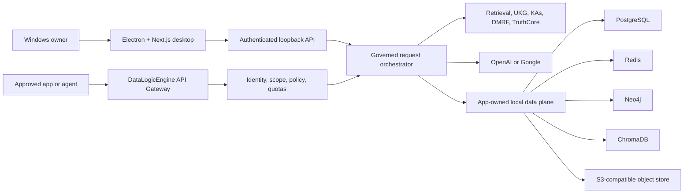
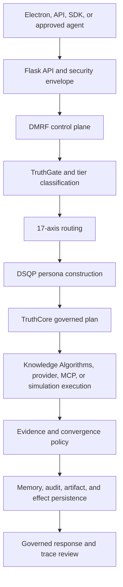

# DataLogicEngine

## Document control

| Field | Value |
|---|---|
| Document ID | DLE-ROOT-001 |
| Title | Product entry point |
| Document version | v1.5.1 |
| Product version | 4.3.0 |
| Status | release_blocked |
| Audience | Users, evaluators, integrators, and professional reviewers |
| Owner | Product Engineering |
| Approver | Kevin Herrera, Product Owner |
| Source of authority | `PRODUCTION_COMPLETION_PLAN_2026.md`, `config/product-versions.json`, and release evidence |
| Confidentiality | Public |
| Last reviewed | 2026-08-11 |
| Next-review trigger | Product scope, supported workflow, packaging, or release-status change |
| Requirements and evidence | Root plan, `TODO.md`, and `reports/production-readiness/2026/` |

[](https://github.com/kherrera6219/DataLogicEngine/actions/workflows/ci.yml)
[](https://github.com/kherrera6219/DataLogicEngine/actions/workflows/security.yml)
[](https://github.com/kherrera6219/DataLogicEngine/actions/workflows/deploy.yml)
[](requirements.txt)
[](frontend/package.json)
[](LICENSE)

**Governed AI for organizations that need evidence, control, and
accountability—not just a model response.**

DataLogicEngine is owner-operated, local-first Windows software that sits
between people or applications and cloud AI models. It provides one governed
path for AI requests, knowledge retrieval, reasoning, validation, durable
effects, evidence, and audit. The product combines a desktop control center, an
authenticated API gateway, the Universal Knowledge Graph (UKG), a governed
reasoning pipeline, and owner-selected OpenAI or Google inference.

The built-in chat is a reference client for the same gateway that approved
applications, agents, and chatbots can use. DataLogicEngine is not a model and
is not a vendor-hosted SaaS: the owner controls the Windows system, provider
accounts, connector credentials, local data, retention, backups, and operating
policy.

> [!WARNING]
> **Engineering evaluation only. DataLogicEngine 4.3.0 is not approved for a
> production or public release.** The current build is unsigned and final
> installed-system, accessibility, provider, recovery, independent-review,
> pilot, and soak acceptance remain release gates.

## Repository guide

| I want to... | Start here |
|---|---|
| Understand the product and its market | [Who it is for](#who-it-is-for) and [What the application does](#what-the-application-does) |
| Evaluate the current release boundary | [Product boundary](#product-boundary) and [Release status](#release-status) |
| Understand the system as an engineer | [Engineering guide](#engineering-guide) and the [Developer Guide](docs/DEVELOPER_GUIDE.md) |
| Set up a development environment | [Developer quickstart](#developer-quickstart) |
| Integrate an application or agent | [API](#api), [interface contract](docs/INTERFACE_INTEGRATION.md), and [OpenAPI specification](docs/openapi.yaml) |
| Build or install the Windows application | [Build the Windows installer](#build-the-windows-installer) and the [Installation Guide](docs/INSTALLATION_GUIDE.md) |
| Contribute or report a problem | [Contributing and support](#contributing-and-support), [CONTRIBUTING.md](CONTRIBUTING.md), and [SECURITY.md](SECURITY.md) |
| Understand permitted use | [Repository license](#repository-license), [LICENSE](LICENSE), and [commercial licensing](COMMERCIAL_LICENSE.md) |

## Who it is for

DataLogicEngine is designed for owner-operated deployments where AI output must
be reviewable, attributable, and governed. Its clearest fit is organizations
that want the capability of cloud models without turning their local knowledge,
credentials, policy decisions, and operational history over to a hosted AI
control plane.

| Audience or market | What DataLogicEngine provides |
|---|---|
| Enterprise AI and platform teams | A consistent gateway for approved internal applications, assistants, and agents, with centrally applied policy and provider controls |
| Government and public-sector evaluators | Owner-controlled Windows deployment, local operational data, recorded provenance, and inspectable request evidence |
| AI governance, risk, privacy, and security teams | Scoped client access, policy enforcement, provider disclosure, causal traces, reviewable effects, and controlled retention |
| Research, analysis, and knowledge-management teams | Structured knowledge, graph and vector retrieval, source provenance, evidence review, and bounded simulations |
| Software developers and integrators | A versioned API, generated Python and TypeScript SDKs, asynchronous jobs, streaming responses, and provider-key separation |
| Operators, reviewers, and pilot users | A desktop experience for configuration, governed chat, monitoring, trace review, privacy, diagnostics, and support |

The current 4.3.0 product boundary is a single owner/operator on Windows 11 or
an owner-controlled Windows VM. It is not a public web service or a multi-tenant
identity platform.

## What the application does

DataLogicEngine accepts requests from its desktop client or an approved API
client and carries them through a backend-owned governed workflow. It
authenticates the caller, applies scope and policy, retrieves relevant local
knowledge, coordinates reasoning and specialist capabilities, invokes the
configured model provider only when authorized, validates the result, and
records the causal evidence needed to inspect what happened.

Core capabilities include:

- Windows desktop control, configuration, administration, and audit console
- Authenticated, versioned AI gateway for approved applications and agents
- Universal Knowledge Graph and 17-axis knowledge framework
- 10-layer Truth Engine and 12-step refinement workflow
- 213-capability Knowledge Algorithm framework
- Governed OpenAI or Google model-provider integration using owner-supplied keys
- Provenance-aware knowledge ingestion, graph and vector retrieval, and memory
- Budgeted simulations with lifecycle, checkpoints, and retained artifacts
- Owner-approved MCP connectors with explicit scope and consent
- Correlated traces, evidence review, replay, diagnostics, and support workflows
- Generated Python and TypeScript client SDKs
- Local app-owned PostgreSQL, Redis, Neo4j, ChromaDB, and S3-compatible storage

### A governed request, end to end

1. A user, application, agent, or chatbot submits a request through the desktop
   client or versioned gateway.
2. DataLogicEngine authenticates the caller and applies its approved scopes,
   quotas, policy, and operating limits.
3. The orchestrator classifies the request and retrieves relevant records,
   graph context, vector matches, memory, and source provenance.
4. The governed reasoning path coordinates personas, Knowledge Algorithms,
   refinement, tools, and simulations that are allowed for the request.
5. If external inference is needed and permitted, the backend calls the
   owner-selected OpenAI or Google model without exposing that provider key to
   the client.
6. Truth, evidence, and policy checks evaluate the outcome and distinguish
   completed, blocked, failed, cancelled, unavailable, and unmeasured states.
7. The application returns the response and preserves a correlated trace of
   decisions, evidence, provider activity, durable effects, and limitations.

### What owners and operators can do

| Workflow | Purpose |
|---|---|
| Dashboard and administration | Review health, service readiness, provider state, usage, policy, and operational signals |
| Governed chat | Submit prompts and uploads through the same governed path exposed to approved integrations |
| Sessions and projects | Organize work and review the timeline of requests, responses, evidence, and effects |
| Traces and evidence | Inspect causal stages, provider activity, retrieved sources, outcomes, limitations, and exportable evidence |
| Knowledge and graph | Ingest and review knowledge, provenance, relationships, graph context, and retrieval behavior |
| Knowledge Algorithms | Select and run specialist capabilities through typed, traceable product workflows |
| Simulations | Run bounded scenarios with budgets, checkpoints, status, artifacts, cancellation, and restart behavior |
| Truth Engine | Monitor validation, convergence, uncertainty, and refinement behavior |
| MCP connectors | Register and use explicitly approved local tools within recorded command, scope, and file-root boundaries |
| Privacy, storage, and lifecycle | Manage export, deletion, retention, backups, recovery, and owner-controlled memory promotion |
| Diagnostics and support | Review content-restricted diagnostics and preview support bundles before export |

## Why DataLogicEngine is different

- **Local-first ownership.** Application state, knowledge, traces, memory, and
  artifacts remain in an app-owned data plane under the owner's control.
- **One governed path.** The built-in chat and approved API clients use the same
  backend orchestration instead of creating separate, inconsistent AI paths.
- **Evidence over assertions.** Requests carry a causal identity across policy,
  retrieval, reasoning, provider activity, validation, effects, and response.
- **Provider choice without credential sprawl.** Owners configure OpenAI or
  Google credentials once; approved clients never receive the raw provider key.
- **Knowledge-aware reasoning.** Graph, vector, relational, object, and memory
  services work together with recorded source identity and provenance.
- **Controlled tools and effects.** Connectors, algorithms, simulations,
  exports, and state changes are scoped, reviewable, and represented truthfully.

DataLogicEngine does not expose raw database credentials to API clients.
Compliance mappings are evidence-guided design references, not formal
certifications.

## Product boundary

- Supported target: Windows 11 x64 desktop or an owner-controlled Windows VM
- Access: Electron desktop shell and a same-host, loopback-bound gateway by
  default
- Identity: single owner/operator with installation-bound local controls
- Providers: owner-configured OpenAI or Google credentials and approved models
- Connectors: owner-approved local MCP processes with recorded scope and consent
- Data: app-owned PostgreSQL, Redis, Neo4j, ChromaDB, and S3-compatible storage
- Excluded from 4.3.0: public-internet exposure, public self-registration,
  multi-tenancy, vendor-hosted customer data or API spend, Kubernetes, managed
  cloud databases as production authorities, mobile clients, and macOS/Linux
  packaging

See the [Product Requirements](docs/PRODUCT_REQUIREMENTS.md) for the complete
supported contract and exclusions.

## Release status

The source repository is an active production candidate, but the release
decision remains **NO-GO**. Before public distribution, the same signed rebuilt
artifact must pass the remaining clean-installed and retained-data acceptance
matrix, provider and human review, packaged accessibility checks, upgrade and
recovery tests, independent professional reviews, pilot operation, and 24/72-
hour soak testing.

The live engineering status belongs in the
[production completion plan](PRODUCTION_COMPLETION_PLAN_2026.md) and
[work ledger](TODO.md). Historical phase results and detailed evidence are kept
in the [documentation portal](docs/README.md) and production-readiness reports,
not in this public overview.

## Engineering guide

DataLogicEngine is a Windows desktop application with a Python service layer,
a Next.js/Electron user interface, a versioned integration gateway, and an
app-owned local data plane. Engineers should read the [Developer
Guide](docs/DEVELOPER_GUIDE.md), [Architecture](docs/ARCHITECTURE.md),
[Interface Integration](docs/INTERFACE_INTEGRATION.md), and [Data
Architecture](docs/DATA_ARCHITECTURE.md) before changing a runtime boundary.

### System topology



| Layer | Technology | Responsibility |
|---|---|---|
| Desktop | Electron 40, Next.js 16, React 18 | Control, configuration, chat, audit, observability, and validation |
| Backend | Flask 3.1, SQLAlchemy, Socket.IO | API gateway, policy, orchestration, tracing, and service supervision |
| Data | PostgreSQL, Redis, Neo4j, ChromaDB, SeaweedFS | Relational state, queues, graph provenance, vector retrieval, and artifacts |
| AI | OpenAI `gpt-5.5` or Google `gemini-3.1-pro-preview` | Owner-selected cloud inference using BYOK |

The data plane is local and app-owned. External processing is limited to the
configured model provider and explicitly approved connectors. Desktop and API
clients use governed application interfaces rather than direct store access.
See [Data Architecture](docs/DATA_ARCHITECTURE.md) for store responsibilities
and lifecycle details.

### Governed execution workflow

Every desktop and gateway request enters the same backend-owned orchestration
path. A causal run identity follows the request through admission, routing,
execution, evidence, persistence, and response.



The important rule is that the frontend does not reproduce backend governance.
Routes normalize input and transport state; the backend owns policy,
orchestration, provider access, durable effects, evidence, and truthful outcome
semantics. See the [interface contract](docs/INTERFACE_INTEGRATION.md) for the
supported client boundary.

### Repository structure

| Area | Primary paths | Engineering responsibility |
|---|---|---|
| Application assembly | `app.py`, `main.py`, `wsgi.py` | Flask construction, runtime compatibility, service startup, and route registration |
| API and security envelope | `backend/api/`, `backend/routes/`, `backend/auth/`, `backend/middleware/` | Versioned transport, authentication, authorization, validation, limits, and response contracts |
| Governed control plane | `backend/dmrf/`, `backend/governed_execution/`, `backend/truth_engine/` | Request classification, orchestration, refinement, validation, convergence, and outcome semantics |
| Knowledge and personas | `backend/knowledge_algorithms/`, `backend/quad_persona/`, `core/` | Knowledge Algorithm ownership, persona coordination, axes, graph, and framework primitives |
| Execution adapters | `backend/llm_gateway/`, `backend/mcp_server/`, `backend/simulation/` | Provider routing, controlled connectors, tools, budgets, checkpoints, and artifacts |
| Data and lifecycle | `backend/storage/`, `backend/repositories/`, `backend/ingestion/`, `backend/memory/` | Store adapters, provenance, ingestion, retention, deletion, memory, backup, and recovery behavior |
| Desktop and web UI | `frontend/app/`, `frontend/components/`, `frontend/lib/`, `frontend/electron/` | Next.js routes, shared components, client contracts, and Electron lifecycle/security |
| Public integration | `sdk/`, `docs/openapi.yaml` | Generated Python and TypeScript clients and the versioned API contract |
| Engineering automation | `scripts/`, `.githooks/`, `.github/workflows/` | Setup, validation, documentation checks, packaging, security, CI, and signing governance |
| Verification | `tests/`, `frontend/tests/`, `reports/production-readiness/` | Backend, contract, security, frontend, Electron, installed-system, and release evidence |

### Engineering workflow

1. Read the relevant architecture and interface documents before changing a
   subsystem boundary.
2. Create a focused branch, configure a local `.env`, and install locked Python
   and Node dependencies.
3. Start the required app-owned data services, apply migrations, then run the
   backend and frontend through their documented entry points.
4. Keep contracts synchronized across backend schemas, OpenAPI, generated SDKs,
   frontend types, tests, and active documentation.
5. Run focused tests while developing, then lint, type-check, build, security,
   documentation, and packaging checks appropriate to the change.
6. Submit a focused pull request that explains the behavior change, validation,
   security impact, documentation impact, and any remaining limitation.

The full setup, coding rules, test matrix, and packaging commands are maintained
in the [Developer Guide](docs/DEVELOPER_GUIDE.md) and
[CONTRIBUTING.md](CONTRIBUTING.md).

## Developer quickstart

### Requirements

- Windows 11
- Python 3.11
- Node.js 24 or newer with npm
- WSL2 with Podman Machine for the intended production container profile
- Docker Desktop with Compose v2 for developer integration
- Internet access for package restore, container pulls, and cloud inference

### Get the source

```powershell
git clone https://github.com/kherrera6219/DataLogicEngine.git C:\software\DataLogicEngine
Set-Location C:\software\DataLogicEngine
```

### Configure the application

```powershell
Copy-Item .env.template .env
notepad .env
```

Generate unique application secrets and place them in `.env`:

```powershell
py -3.11 -c "import secrets; print(secrets.token_hex(32))"
```

The relevant secret names are `SECRET_KEY`, `JWT_SECRET_KEY`,
`SESSION_SECRET`, and `WTF_CSRF_SECRET_KEY`. Do not commit `.env` or provider
credentials. Model-provider keys can be stored after installation through
**Settings → AI/Model**.

### Install dependencies

```powershell
py -3.11 -m venv .venv
.\.venv\Scripts\python.exe -m pip install --upgrade pip
.\.venv\Scripts\python.exe -m pip install -r requirements.txt
npm --prefix frontend ci
```

### Start developer services

```powershell
docker compose up -d db redis neo4j minio
docker compose ps
```

For browser-based development:

```powershell
.\.venv\Scripts\python.exe -m flask db upgrade
.\.venv\Scripts\python.exe main.py
npm --prefix frontend run dev
```

| Service | Local URL |
|---|---|
| Web console | `http://localhost:3000` |
| Backend API | `http://localhost:5000` |
| Health | `http://localhost:5000/health` |
| Readiness | `http://localhost:5000/ready` |
| API documentation | `http://localhost:5000/api/docs` |

## Build the Windows installer

Build the packaged backend before building the Electron/NSIS installer:

```powershell
.\.venv\Scripts\python.exe scripts\build_backend.py
$env:CSC_SKIP = "true"
npm --prefix frontend run electron:dist
```

`CSC_SKIP=true` produces an unsigned local engineering build. It is not a
public release artifact. Installer output is generated as
`DataLogicEngine Setup 4.3.0.exe` with its checksum and block map.

Verify the package before installing it:

```powershell
powershell -NoProfile -ExecutionPolicy Bypass -File .\scripts\windows\verify_nsis_governance.ps1 -RepoRoot (Get-Location).Path
.\.venv\Scripts\python.exe scripts\verify_installer_integrity.py --require-artifacts
powershell -NoProfile -ExecutionPolicy Bypass -File .\scripts\windows\run_packaging_smoke.ps1 -RepoRoot (Get-Location).Path
```

For installation, upgrades, service ownership, retained data, backup, and
recovery guidance, follow the [Installation Guide](docs/INSTALLATION_GUIDE.md)
and [Administrator Operations Guide](docs/ADMINISTRATOR_OPERATIONS_GUIDE.md).

## API

The versioned API is the supported integration surface. Swagger UI is available
at `http://localhost:5000/api/docs` while the backend is running.

Health and readiness probes:

```powershell
Invoke-RestMethod http://localhost:5000/health
Invoke-RestMethod http://localhost:5000/ready
```

Approved clients authenticate with DataLogicEngine-issued credentials. They do
not receive the underlying OpenAI or Google credential. See the [OpenAPI
contract](docs/openapi.yaml) for the integration surface.

## Configuration

Start with [`.env.template`](.env.template). Important configuration groups
include:

- Application signing, session, JWT, and CSRF secrets
- PostgreSQL, Redis, Neo4j, ChromaDB, and object-store endpoints
- OpenAI or Google provider selection and credentials
- Gateway listener, client scopes, quotas, and trusted hosts
- Logging, audit retention, backup, and support-bundle policies

The desktop settings workflow is preferred for owner-managed provider keys.
Never place secrets in source control, screenshots, support bundles, or issue
reports.

## Security and privacy

- Local-first application and data plane
- Loopback-only gateway by default
- Scoped client identity and authorization
- Encrypted owner-managed provider settings
- Content-restricted logs, traces, diagnostics, and support exports
- Governed provider and connector disclosure
- Durable audit and effect receipts

Report vulnerabilities privately as described in [SECURITY.md](SECURITY.md).
Do not include credentials, private prompts, customer data, or unredacted logs
in a public issue.

## Testing

Run the primary source checks from the repository root:

```powershell
.\.venv\Scripts\python.exe -m pytest tests
.\.venv\Scripts\python.exe -m ruff check . --select E9,F63,F7
.\.venv\Scripts\python.exe -m pip_audit -r requirements.txt --desc
npm --prefix frontend run lint
npm --prefix frontend run typecheck
npm --prefix frontend run test
npm --prefix frontend run build
npm --prefix frontend audit --audit-level=high
```

GitHub Actions also validates backend and frontend behavior, security,
documentation consistency, container builds, SDKs, and Windows packaging.

## Documentation

- [Documentation portal](docs/README.md)
- [Production completion plan](PRODUCTION_COMPLETION_PLAN_2026.md)
- [Current work ledger](TODO.md)
- [Installation guide](docs/INSTALLATION_GUIDE.md)
- [Administrator operations guide](docs/ADMINISTRATOR_OPERATIONS_GUIDE.md)
- [Developer guide](docs/DEVELOPER_GUIDE.md)
- [OpenAPI contract](docs/openapi.yaml)
- [Verification and validation report](docs/VERIFICATION_VALIDATION_REPORT.md)
- [Current-build documentation reconciliation](docs/audits/CURRENT_BUILD_DOCUMENTATION_RECONCILIATION_2026-08-11.md)
- [Troubleshooting and support](docs/TROUBLESHOOTING_SUPPORT_GUIDE.md)

## Contributing and support

Before contributing, read [CONTRIBUTING.md](CONTRIBUTING.md) and the [Code of
Conduct](CODE_OF_CONDUCT.md). Run the relevant backend and frontend checks, then
submit a focused pull request.

- Questions: open a [GitHub Discussion](https://github.com/kherrera6219/DataLogicEngine/discussions)
- Bugs: open a [GitHub issue](https://github.com/kherrera6219/DataLogicEngine/issues)
- Security reports: follow [SECURITY.md](SECURITY.md)

### Repository standards

| Repository document | Purpose |
|---|---|
| [CONTRIBUTING.md](CONTRIBUTING.md) | Development setup, coding standards, testing, commits, and pull requests |
| [CODE_OF_CONDUCT.md](CODE_OF_CONDUCT.md) | Expected behavior for project participation |
| [SECURITY.md](SECURITY.md) | Private vulnerability reporting and disclosure policy |
| [Issue templates](.github/ISSUE_TEMPLATE/) | Structured bug reports and feature requests |
| [Pull request template](.github/pull_request_template.md) | Required change, testing, security, and documentation summary |
| [CODEOWNERS](.github/CODEOWNERS) | Review ownership for repository areas |

## Repository license

DataLogicEngine is a **source-available** project licensed under the [PolyForm
Noncommercial License 1.0.0](LICENSE). It is not distributed under an OSI
open-source license.

| Use | License position |
|---|---|
| Personal study, research, experimentation, and other noncommercial use | Permitted under the PolyForm Noncommercial terms |
| Educational, charitable, public-research, public-safety, health, environmental, and government-institution use | Permitted for qualifying noncommercial organizations as defined by the license |
| Internal business use supporting commercial operations | Requires a separate commercial license |
| Integration into a paid product or service | Requires a separate commercial license |
| Hosted or managed commercial access | Requires a separate commercial license |

The repository moved from MIT to PolyForm Noncommercial effective
**January 15, 2026**. The required notice is:

> Copyright (c) 2026 DataLogicEngine Team

Review the complete [LICENSE](LICENSE) before using, modifying, or distributing
the software. Commercial deployment, internal business use, paid-product
integration, and enterprise support are available under a separate agreement;
see [Commercial Licensing](COMMERCIAL_LICENSE.md) for inquiry options. Bundled
dependencies and generated SDK packages may carry their own license terms in
their respective files.
