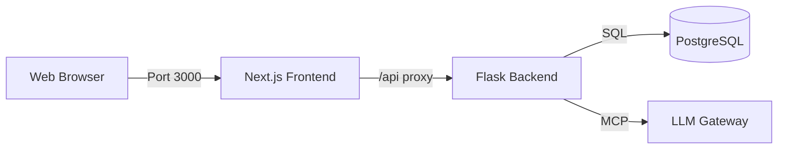

# Universal Knowledge Graph (UKG) System

> Enterprise-grade AI-powered knowledge management platform with a Next.js Frontend and Flask/MCP Backend.

[](LICENSE)
[](https://nextjs.org/)
[](https://www.python.org/downloads/)
[](https://flask.palletsprojects.com/)

---

## Overview

The **Universal Knowledge Graph (UKG)** is a dual-stack enterprise application designed for sophisticated knowledge synthesis and AI agent orchestration.

- **Frontend**: Modern **Next.js 14** application (TypeScript, Tailwind CSS) providing a rich, responsive user interface.
- **Backend**: robust **Flask** API acting as the Knowledge Engine, MCP Server, and LLM Gateway.

### Core Capabilities

- **17-Axis Framework**: Multi-dimensional knowledge organization that contextualizes data across Sectors, Domains, and Knowledge Types.
- **Traceability**: Full execution tracing for every AI reasoning step, ensuring auditability of AI decisions.
- **MCP Integration**: Native Model Context Protocol server exposing 100+ Knowledge Algorithms as executable tools.
- **LLM Gateway**: Middleware that intercepts LLM requests, injects UKG context, and returns grounded responses.

---

## How It Works: The "API In / API Out" System

The DataLogicEngine operates as an intelligent middleware layer (The "Brain") between your applications and raw LLMs.

### 1. API In (The Request)

External systems (Web Apps, Slack Bots, ERPs) send a standard chat request to the Gateway.

- **Input**: "What are the compliance risks for AI in Healthcare?"
- **Context**: The system identifies the sectors (**Healthcare**) and domains (**AI**, **Compliance**).

### 2. Processing (The "Black Box" Illuminated)

Instead of a simple LLM pass, the engine executes a **Trace Run**:

1.  **Axis Resolution**: Maps the query to the 17-Axis Framework.
2.  **Knowledge Retrieval**: Fetches high-fidelity data from the Knowledge Graph.
3.  **Simulation**: Risks are simulated against regulatory frameworks (e.g., HIPAA).
4.  **Synthesis**: The LLM generates a response based _only_ on this verified context.

### 3. API Out (The Response)

The system returns the answer _plus_ a Trace ID.

- **Output**: "The primary risks are..."
- **Traceability**: "Reference: Trace #8a7b9c (Audit Log)"

> **Why this matters**: You get the generic reasoning power of an LLM combined with the specific, verified accuracy of your enterprise data.

## Quick Start

### Prerequisites

- Node.js 18+
- Python 3.11+
- PostgreSQL 15+ (Local or Cloud)
- Redis (Optional, for rate limiting)

### 1. Backend Setup (Flask)

Runs the knowledge engine and API on `http://localhost:5000`.

```bash
# Terminal 1: Backend
cd DataLogicEngine
python -m venv .venv
source .venv/bin/activate  # Windows: .venv\Scripts\activate

pip install -r requirements.txt

# Initial Setup
cp .env.template .env      # Configure DATABASE_URL in .env
flask db upgrade           # Run migrations
python backend/seed_data.py

python main.py
```

### 2. Frontend Setup (Next.js)

Runs the UI on `http://localhost:3000` and proxies API requests to backend.

```bash
# Terminal 2: Frontend
cd frontend
npm install
npm run dev
```

Visit **[http://localhost:3000](http://localhost:3000)** to launch the application.

---

## Architecture

The system uses a split architecture for maximum scalability and developer experience.



### Frontend (`/frontend`)

- **Framework**: Next.js 14 (App Router)
- **Language**: TypeScript
- **Styling**: Tailwind CSS + Shadcn UI
- **Features**:
  - `dashboard/`: Real-time system monitoring.
  - `chat/`: Recursive reasoning interface.
  - `runs/`: Execution trace explorer.

### Backend (`/backend`, `/core`)

- **Framework**: Flask
- **Protocol**: HTTP + MCP (Model Context Protocol)
- **Key Modules**:
  - `core/mcp`: Registers 114 Knowledge Algorithms as tools.
  - `backend/tracing`: Distributed tracing for reasoning steps.
  - `backend/llm_gateway`: Universal adapter for OpenAI/Anthropic/Azure.

---

## API Documentation

The backend exposes a comprehensive REST API at `http://localhost:5000/api/v1`.

| Service     | Endpoint Prefix   | Description                        |
| :---------- | :---------------- | :--------------------------------- |
| **Trace**   | `/api/v1/trace`   | Store and retrieve execution logs. |
| **Gateway** | `/api/v1/gateway` | Chat with UKG-enhanced LLMs.       |
| **MCP**     | `/api/v1/mcp`     | Model Context Protocol endpoints.  |
| **System**  | `/health`         | System health check.               |

Interactive Swagger UI is available at `http://localhost:5000/api/docs`.

---

## Testing

```bash
# Backend Tests
pytest tests/

# Frontend Tests (Lint/Build check)
cd frontend
npm run lint
npm run build
```

---

## License

MIT
