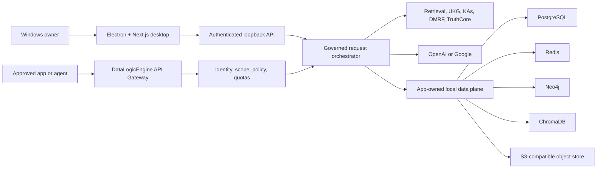

# DataLogicEngine

## Document control

| Field | Value |
|---|---|
| Document ID | DLE-ROOT-001 |
| Title | Product entry point |
| Document version | v1.3.0 |
| Product version | 4.3.0 |
| Status | release_blocked |
| Audience | Users, evaluators, integrators, and professional reviewers |
| Owner | Product Engineering |
| Approver | Kevin Herrera, Product Owner |
| Source of authority | `PRODUCTION_COMPLETION_PLAN_2026.md`, `config/product-versions.json`, and release evidence |
| Confidentiality | Public |
| Last reviewed | 2026-08-11 |
| Next-review trigger | Product scope, supported workflow, packaging, or release-status change |
| Requirements and evidence | Root plan, `TODO.md`, and `reports/production-readiness/2026/` |

[](https://github.com/kherrera6219/DataLogicEngine/actions/workflows/ci.yml)
[](https://github.com/kherrera6219/DataLogicEngine/actions/workflows/security.yml)
[](https://github.com/kherrera6219/DataLogicEngine/actions/workflows/deploy.yml)
[](requirements.txt)
[](frontend/package.json)
[](LICENSE)

DataLogicEngine is a local-first Windows platform for governed AI requests,
knowledge retrieval, reasoning, evidence validation, and auditability. It
combines a desktop control application, an authenticated API gateway, the
Universal Knowledge Graph (UKG), a governed reasoning pipeline, and
owner-selected cloud model inference.

> [!WARNING]
> **Engineering evaluation only. DataLogicEngine 4.3.0 is not approved for a
> production or public release.** The current build is unsigned and final
> installed-system, accessibility, provider, recovery, independent-review,
> pilot, and soak acceptance remain release gates.

## What it does

DataLogicEngine accepts requests from its desktop client or approved API
clients, applies identity, policy, retrieval, reasoning, validation, and audit
controls, calls the configured model provider when authorized, and returns a
governed response.

Core capabilities include:

- Windows desktop control, configuration, administration, and audit console
- Authenticated, versioned API gateway for approved applications and agents
- Universal Knowledge Graph and 17-axis knowledge framework
- 10-layer Truth Engine and 12-step refinement workflow
- 213-capability Knowledge Algorithm framework
- Governed OpenAI or Google model-provider integration using owner-supplied keys
- Retrieval, simulation, MCP, trace, support, and observability workflows
- Generated Python and TypeScript client SDKs
- Local app-owned PostgreSQL, Redis, Neo4j, ChromaDB, and S3-compatible storage

DataLogicEngine does not expose its provider key or raw database credentials to
API clients. Compliance mappings are evidence-guided design references, not
formal certifications.

## Release status

The source repository is an active production candidate, but the release
decision remains **NO-GO**. Before public distribution, the same signed rebuilt
artifact must pass the remaining clean-installed and retained-data acceptance
matrix, provider and human review, packaged accessibility checks, upgrade and
recovery tests, independent professional reviews, pilot operation, and 24/72-
hour soak testing.

The live engineering status belongs in the
[production completion plan](PRODUCTION_COMPLETION_PLAN_2026.md) and
[work ledger](TODO.md). Historical phase results and detailed evidence are kept
in the [documentation portal](docs/README.md) and production-readiness reports,
not in this public overview.

## Architecture



| Layer | Technology | Responsibility |
|---|---|---|
| Desktop | Electron 40, Next.js 16, React 18 | Control, configuration, chat, audit, observability, and validation |
| Backend | Flask 3.1, SQLAlchemy, Socket.IO | API gateway, policy, orchestration, tracing, and service supervision |
| Data | PostgreSQL, Redis, Neo4j, ChromaDB, SeaweedFS | Relational state, queues, graph provenance, vector retrieval, and artifacts |
| AI | OpenAI `gpt-5.5` or Google `gemini-3.1-pro-preview` | Owner-selected cloud inference using BYOK |

The data plane is local and app-owned. External processing is limited to the
configured model provider and explicitly approved connectors. Desktop and API
clients use governed application interfaces rather than direct store access.
See [Data Architecture](docs/DATA_ARCHITECTURE.md) for store responsibilities
and lifecycle details.

## Quickstart

### Requirements

- Windows 11
- Python 3.11
- Node.js 24 or newer with npm
- WSL2 with Podman Machine for the intended production container profile
- Docker Desktop with Compose v2 for developer integration
- Internet access for package restore, container pulls, and cloud inference

### Get the source

```powershell
git clone https://github.com/kherrera6219/DataLogicEngine.git C:\software\DataLogicEngine
Set-Location C:\software\DataLogicEngine
```

### Configure the application

```powershell
Copy-Item .env.template .env
notepad .env
```

Generate unique application secrets and place them in `.env`:

```powershell
py -3.11 -c "import secrets; print(secrets.token_hex(32))"
```

The relevant secret names are `SECRET_KEY`, `JWT_SECRET_KEY`,
`SESSION_SECRET`, and `WTF_CSRF_SECRET_KEY`. Do not commit `.env` or provider
credentials. Model-provider keys can be stored after installation through
**Settings → AI/Model**.

### Install dependencies

```powershell
py -3.11 -m venv .venv
.\.venv\Scripts\python.exe -m pip install --upgrade pip
.\.venv\Scripts\python.exe -m pip install -r requirements.txt
npm --prefix frontend ci
```

### Start developer services

```powershell
docker compose up -d db redis neo4j minio
docker compose ps
```

For browser-based development:

```powershell
.\.venv\Scripts\python.exe -m flask db upgrade
.\.venv\Scripts\python.exe main.py
npm --prefix frontend run dev
```

| Service | Local URL |
|---|---|
| Web console | `http://localhost:3000` |
| Backend API | `http://localhost:5000` |
| Health | `http://localhost:5000/health` |
| Readiness | `http://localhost:5000/ready` |
| API documentation | `http://localhost:5000/api/docs` |

## Build the Windows installer

Build the packaged backend before building the Electron/NSIS installer:

```powershell
.\.venv\Scripts\python.exe scripts\build_backend.py
$env:CSC_SKIP = "true"
npm --prefix frontend run electron:dist
```

`CSC_SKIP=true` produces an unsigned local engineering build. It is not a
public release artifact. Installer output is generated as
`DataLogicEngine Setup 4.3.0.exe` with its checksum and block map.

Verify the package before installing it:

```powershell
powershell -NoProfile -ExecutionPolicy Bypass -File .\scripts\windows\verify_nsis_governance.ps1 -RepoRoot (Get-Location).Path
.\.venv\Scripts\python.exe scripts\verify_installer_integrity.py --require-artifacts
powershell -NoProfile -ExecutionPolicy Bypass -File .\scripts\windows\run_packaging_smoke.ps1 -RepoRoot (Get-Location).Path
```

For installation, upgrades, service ownership, retained data, backup, and
recovery guidance, follow the [Installation Guide](docs/INSTALLATION_GUIDE.md)
and [Administrator Operations Guide](docs/ADMINISTRATOR_OPERATIONS_GUIDE.md).

## API

The versioned API is the supported integration surface. Swagger UI is available
at `http://localhost:5000/api/docs` while the backend is running.

Health and readiness probes:

```powershell
Invoke-RestMethod http://localhost:5000/health
Invoke-RestMethod http://localhost:5000/ready
```

Approved clients authenticate with DataLogicEngine-issued credentials. They do
not receive the underlying OpenAI or Google credential. See the [OpenAPI
contract](docs/openapi.yaml) for the integration surface.

## Configuration

Start with [`.env.template`](.env.template). Important configuration groups
include:

- Application signing, session, JWT, and CSRF secrets
- PostgreSQL, Redis, Neo4j, ChromaDB, and object-store endpoints
- OpenAI or Google provider selection and credentials
- Gateway listener, client scopes, quotas, and trusted hosts
- Logging, audit retention, backup, and support-bundle policies

The desktop settings workflow is preferred for owner-managed provider keys.
Never place secrets in source control, screenshots, support bundles, or issue
reports.

## Security and privacy

- Local-first application and data plane
- Loopback-only gateway by default
- Scoped client identity and authorization
- Encrypted owner-managed provider settings
- Content-restricted logs, traces, diagnostics, and support exports
- Governed provider and connector disclosure
- Durable audit and effect receipts

Report vulnerabilities privately as described in [SECURITY.md](SECURITY.md).
Do not include credentials, private prompts, customer data, or unredacted logs
in a public issue.

## Testing

Run the primary source checks from the repository root:

```powershell
.\.venv\Scripts\python.exe -m pytest tests
.\.venv\Scripts\python.exe -m ruff check . --select E9,F63,F7
.\.venv\Scripts\python.exe -m pip_audit -r requirements.txt --desc
npm --prefix frontend run lint
npm --prefix frontend run typecheck
npm --prefix frontend run test
npm --prefix frontend run build
npm --prefix frontend audit --audit-level=high
```

GitHub Actions also validates backend and frontend behavior, security,
documentation consistency, container builds, SDKs, and Windows packaging.

## Documentation

- [Documentation portal](docs/README.md)
- [Production completion plan](PRODUCTION_COMPLETION_PLAN_2026.md)
- [Current work ledger](TODO.md)
- [Installation guide](docs/INSTALLATION_GUIDE.md)
- [Administrator operations guide](docs/ADMINISTRATOR_OPERATIONS_GUIDE.md)
- [Developer guide](docs/DEVELOPER_GUIDE.md)
- [OpenAPI contract](docs/openapi.yaml)
- [Verification and validation report](docs/VERIFICATION_VALIDATION_REPORT.md)
- [Troubleshooting and support](docs/TROUBLESHOOTING_SUPPORT_GUIDE.md)

## Contributing and support

Before contributing, read [CONTRIBUTING.md](CONTRIBUTING.md) and the [Code of
Conduct](CODE_OF_CONDUCT.md). Run the relevant backend and frontend checks, then
submit a focused pull request.

- Questions: open a [GitHub Discussion](https://github.com/kherrera6219/DataLogicEngine/discussions)
- Bugs: open a [GitHub issue](https://github.com/kherrera6219/DataLogicEngine/issues)
- Security reports: follow [SECURITY.md](SECURITY.md)

## License

DataLogicEngine is licensed under the [PolyForm Noncommercial License
1.0.0](LICENSE). Personal, research, and educational use are permitted under the
license terms. Commercial use, production deployment in a business environment,
or integration into a paid product requires a separate commercial license. See
[COMMERCIAL_LICENSE.md](COMMERCIAL_LICENSE.md).
