# DataLogicEngine

## Document control

| Field | Value |
|---|---|
| Document ID | DLE-ROOT-001 |
| Title | Product entry point |
| Document version | v1.2.3 |
| Product version | 4.3.0 |
| Status | release_blocked |
| Audience | Users, evaluators, integrators, and professional reviewers |
| Owner | Product Engineering |
| Approver | Kevin Herrera, Product Owner |
| Source of authority | `PRODUCTION_COMPLETION_PLAN_2026.md`, `config/product-versions.json`, and release evidence |
| Confidentiality | Public |
| Last reviewed | 2026-08-02 |
| Next-review trigger | Product scope, supported workflow, packaging, or release-status change |
| Requirements and evidence | Root plan, `TODO.md`, and `reports/production-readiness/2026/` |

Local-first Windows governed LLM middleware with a production desktop control,
administration, audit, observability, and validation application.

> [!WARNING]
> **Engineering evaluation only. DataLogicEngine is not yet approved for a
> production or public release.** Source qualification, rebuilt-installed
> acceptance, signing, independent review, and operational acceptance remain
> mandatory release gates.

## Current status

DataLogicEngine 4.3.0 is in the Phase 19 production-completion program. The
current source provides the local-first Windows desktop, governed API gateway,
single canonical Knowledge Algorithm controller, auditable response lifecycle,
simulation workflow, MCP connector boundary, and generated Python/TypeScript
SDKs.

| Area | Current state |
|---|---|
| Canonical Knowledge Algorithms | 213 retained; 149 production-enabled |
| Runtime authority | One generated manifest/controller; 138-edge acyclic dependency graph |
| Current checkpoint | CP19-K per-KA production qualification |
| Individually qualified KAs | 51/213; 162 remain open |
| Grouped qualification roadmap | 36 batches (08-43); Batches 08-11 complete, Batch 12 next, 32 remain |
| Latest source validation | 2,698 passed, 18 skipped, 35 known warnings |
| Release decision | **NO-GO** until CP19-K, CP19-L, CP19-M, and retained installed gates pass |

The latest completed qualification batches make governed L1 routing, DMRF
classification, simulation planning/resource/counterfactual effects, and MCP
admission/result-release governance causal through their real production owners.
MCP result handling emits content-free structured logs and persists durable
audit/receipt records; failed connector work records a fail-closed recovery plan
without automatically retrying or claiming proposed incident actions were
performed. Provider calls now retain their pre-call context-governance plan
identity, while post-call latency monitoring recommends but never claims to send
an alert. Batch 08 now connects seven content-free observability KAs to the
authenticated diagnostics owner without rendering, distributing, delivering,
profiling secretly, opening a debug port, or mutating runtime capacity. Batch 09
now makes all eight secure-ingestion KAs causal before materialization, removes
unsupported fuzzy/provider/archive claims, and binds the admission proposal to
the owner transaction while archival remains proposal-only. No registry-only,
execute-only, or direct-test-only capability is counted as production-qualified.
Batch 10 now makes feature construction and tuning causal prerequisites of the
model-training proposal, evaluates only supplied predictions and labels, and
records an idempotent provider-owned admission receipt. The record explicitly
says no trainer, provider call, epoch, checkpoint, or model artifact exists.
Preparation rejects artifacts above 256 MiB, and replay verifies the persisted
record against its authoritative receipt before returning it.

The 186-row baseline backlog has been reviewed into 36 dependency-safe batches
of two to eight KAs. The 28 security/operations rows are intentionally split
across five owner/effect boundaries—observability, delivery/messaging,
health/recovery, cryptography/vulnerability, and topology/evolution—rather than
treated as one unsafe mega-batch. Batches 08 through 10 are complete; the
current matrix has 167 open rows and Batch 11 is provider model release.

The desktop also includes an owner-operated candidate training-dataset export
tool. It creates SFT or status-labelled PRM records only from explicitly
released traces, enforces redaction, and confines API output to the app-owned
runtime directory. Batch 10 adds an owner-only preparation path that profiles
one such app-owned artifact and records a training-admission receipt, but it
does not run training in the background. Current stored traces still do not
support DPO because genuine rejected-candidate evidence is not persisted.

See the [production completion plan](PRODUCTION_COMPLETION_PLAN_2026.md),
[current work ledger](TODO.md), [documentation portal](docs/README.md), and
[CP19-K qualification matrix](reports/production-readiness/2026/phase-19/cp19-k-qualification-matrix.md),
and [grouped qualification roadmap](reports/production-readiness/2026/phase-19/cp19-k-grouped-qualification-roadmap.md)
for the detailed evidence and remaining work.

[](https://github.com/kherrera6219/DataLogicEngine/actions/workflows/ci.yml)
[](https://github.com/kherrera6219/DataLogicEngine/actions/workflows/security.yml)
[](https://github.com/kherrera6219/DataLogicEngine/actions/workflows/deploy.yml)
[](requirements.txt)
[](frontend/package.json)
[](LICENSE)

DataLogicEngine (DLE) is a local-first governed LLM middleware platform built
around the Universal Knowledge Graph (UKG).

Its production purpose is to accept requests from approved applications, agents,
and chatbots through the DataLogicEngine API Gateway; apply retrieval, reasoning,
policy, validation, evidence, and audit controls; call an owner-configured model;
and return a governed response.

The Windows/Electron frontend is the production control, configuration,
administration, audit, observability, support, and validation application. Its
built-in chat is the human-visible reference client for the same canonical
governed request lifecycle external clients use. Calling a page a validation or
administration surface does not lower its production quality requirements.

Designed for enterprise, government, compliance, cybersecurity, acquisition, and
research environments, the production contract requires every governed response
to be reconstructable from real evidence, executed stages, policy decisions,
provider/tool calls, validation results, and audit records. Compliance mappings
are evidence-guided design references, not formal certification claims.

**Production architecture:** DataLogicEngine is an owner-operated, local-first
Windows application. The Electron + Next.js desktop runs over a Flask + SQLAlchemy
backend. PostgreSQL, Redis, Neo4j, ChromaDB, and app-owned S3-compatible object store are intentional app-owned
internal production services with separate responsibilities. The gateway is
loopback-only by default and may later be explicitly enabled for qualified
private Windows clients; it is not a public or multi-tenant SaaS service. Model
inference uses an owner-supplied OpenAI `gpt-5.5` or Google
`gemini-3.1-pro-preview` key. External clients receive DataLogicEngine client
credentials, never the provider credential.

Major subsystems in the current local-first desktop build:

- External API Gateway foundation and client-key model
- Desktop control, administration, audit, and validation console
- Built-in governed-chat reference client
- Universal Knowledge Graph (UKG)
- 17-Axis Knowledge Framework
- 10-Layer Truth Engine
- 12-Step Refinement Workflow
- Knowledge Algorithm Framework (213-capability source authority retained; full
  production integration under active Phase 19)
- Multi-Agent Orchestration
- GraphRAG Integration
- Knowledge Ingestion Pipeline
- Trace Viewer
- MCP Integration Framework
- PostgreSQL, Redis, Neo4j, ChromaDB, and app-owned S3-compatible object store lifecycle foundations
- Enterprise Audit & Governance Framework
- Cloud AI model selection — OpenAI gpt-5.5 or Google gemini-3.1-pro-preview (BYOK)

Completed source and engineering checkpoints:

- Phase 18 closed incomplete: retain CP18-A/CP18-B, the 213 unique
  implementation owners and zero source gaps;
  CP18-D failed and CP18-E-H transferred without waiver
- Phase 19 CP19-A passed: all 213 KAs have one primary subsystem owner,
  governed consumer/evidence destinations, and one runtime manifest; 16
  competing workflow surfaces have explicit dispositions and the KA suite is
  726 passed
- Phase 19 CP19-B passed: 621 production Python files scanned, 18 caller/API/
  SDK surfaces verified, 32 typed execution/helper sites, zero legacy result
  calls, 738 KA/Python-SDK tests passed, and 2,486 full-suite tests passed with
  18 skipped
- Phase 19 CP19-C passed and CP19-G corrected its manifest: one selector and a
  current bounded 131-edge zero-cycle dependency DAG
- Phase 19 CP19-D passed: one typed causal L1-L10 product path with L10 release
  before success persistence
- Phase 19 CP19-E passed: every L9/L10 KA is registered, production-admitted,
  executed from committed child traces, and fail-closed
- Phase 19 CP19-F passed: axes 8-11 profiles causally drive the applicable
  `KA-012`/`KA-013`/`KA-030` chain, provider prompt, dissent, and sufficiency;
  48 focused tests and 2,524 full-source tests pass
- Phase 19 CP19-G passed: one manifest-owned 12-step workflow accounts for
  every step, performs at most one rewrite, revalidates L6-L10, and keeps
  lifecycle effects proposal-only
- Phase 19 CP19-H passed: one typed fail-closed Truth/data/knowledge lifecycle
  owns policy, authorized recall, release-gated memory promotion, causal
  TruthLink/FROST transitions, secure pre-materialization ingestion, and
  deletion/recovery KA dispatch
- Phase 19 CP19-I passed: simulation, MCP, provider/gateway,
  security/operations, durable jobs, bounded effect proposals, and
  authoritative SHA-256 receipts execute through the one controller
- Phase 19 CP19-J passed: 12 scoped API paths, generated Python/TypeScript
  SDKs, and real-backend Algorithms/History pages share one principal-owned,
  encrypted, idempotent, exact-confirmation, cancellable durable workflow
  through the canonical controller
- Phase 19 CP19-K Batch 08 passed: `KA-091`, `KA-092`, `KA-094`, `KA-095`,
  `KA-098`, `KA-099`, and `KA-100` now analyze measured, content-free local
  diagnostics through the authenticated security/operations owner. Their
  visualization/dashboard/report/alert/profile/debug/optimization outputs are
  specifications or recommendations only and apply zero effects
- Phase 19 CP19-K Batch 09 passed: `KA-071` through `KA-078` now execute as one
  causal local-file metadata chain before any SQL/vector/graph/object/outbox
  materialization. The owner rejects broken handoffs, preserves the acquired
  identity/hash set, stores the plan identity with nodes, and binds only the
  KA-071 admission proposal to the committed transaction receipt. Enrichment
  performs no egress and archive eligibility applies no archive effect
- Completed GitHub Actions verification for the 2026-07-15 CodeQL and frontend-
  image follow-up
- Replaced the vulnerable ChromaDB Python SDK with a restricted loopback-only,
  vector-only HTTP client; focused adversarial tests, the live five-service
  contract/restart qualification, and a zero-finding isolated dependency audit
  pass. GitHub alert 389 is confirmed fixed
- Completed Phase 16 CP16-F source replacement: 72/72 retained hashes, zero
  active legacy sources, zero unmigrated links, and 18/18 routed target reviews;
  the strengthened all-document verifier migrated 175 previously missed path
  references and the full 2,192-test suite passes with 18 skips
- Approved and executed 154-file disposition crosswalk: exactly 30 canonical
  targets with verified headers and zero unclassified or duplicate routes
- Completed Phase 17 CP17-A through CP17-D active-authority, historical-archive,
  generated-parity, and zero-warning documentation lock; CP17-E retained
- Completed Phase 9-13 source engineering checkpoints for causal knowledge/
  graph retrieval, bounded simulation, governed MCP, desktop workflow and
  automated accessibility, correlation, failure semantics, redaction, support,
  and soak-profile evaluation. These are source checkpoints, not installed
  release acceptance
- Completed source/lab Replacement Control: ADR-0010 selects SeaweedFS
  4.40-dle.1 as the app-owned S3-compatible object-store implementation with
  all engineering gates passing and production authorization still false

Open engineering and release acceptance:

- Active Phase 19 CP19-K: batches 01-10 qualify 46/213 rows, including causal
  simulation, MCP admission/result governance, content-free structured logging
  with durable audit/receipt records, fail-closed MCP recovery planning,
  provider context-budget enforcement, measured provider monitoring, and the
  authenticated content-free diagnostics advisory, causal secure ingestion,
  and provider-owned measured model preparation; 167 rows remain open
- The reviewed remaining roadmap contains 33 cohesive batches (11-43), each
  bounded to one production owner and effect boundary. Batch 11 is the five-KA
  provider model-release group. Grouping shares fixtures and transactions but does
  not waive any individual semantic, owning-path, trace, security, effect, or
  performance proof
- Seven additional provider/gateway KAs remain open: model deployment,
  versioning, A/B testing, pruning, quantization, API gateway, and external deep
  research. None is
  counted from registry membership or direct tests without a real owner and,
  where applicable, an authoritative effect receipt
- CP19-L clean-source qualification must pass before any release-candidate
  rebuild is authorized
- CP19-M must bind the exact signed rebuilt artifact to representative
  all-subsystem, five-service, effect, failure/recovery, performance, trace,
  replay, UI, accessibility, provider, gateway, object-store, pilot, and soak
  evidence
- Deferred installed functional acceptance from Phases 9-13 still requires
  populated retrieval/Knowledge/Graph, simulation providers/artifacts/UI, MCP
  Windows
  containment/lifecycle/stores/Electron, real workflow/store effects,
  cross-process correlation, failure injection, redaction/no-egress, support,
  and 24-hour stress plus 72-hour idle/normal-use soaks
- Deferred external/manual acceptance still requires packaged scaling/high
  contrast, manual NVDA, owner-authorized OpenAI and Google corpus runs, blinded
  human review, second-reviewer approval, and the multi-day clean-machine pilot
- Deferred lifecycle and assurance acceptance still requires signing,
  protected-volume clean install, five-service provisioning, upgrade/rollback,
  backup/restore,
  same-host/private gateway operation, and independent security, license,
  recovery, accessibility, architecture, and AI review. Every item in these
  three deferred groups remains release-blocking

What Makes DataLogicEngine Different?

Most AI applications primarily answer questions.

DataLogicEngine's production goal is to govern the request and prove how the
result was produced.

Core Differentiators

**Universal Knowledge Graph (UKG)**

A structured knowledge system designed to organize information, expertise, regulations, compliance requirements, risk factors, locations, time contexts, and reasoning workflows into a unified framework accessible to human operators and AI agents.

**17-Axis Knowledge Framework**

A multidimensional coordinate system that maps every request across knowledge domains, industries, regulatory frameworks, compliance requirements, expertise models, geography, temporal context, risk profiles, and governance policies.

**10-Layer Truth Engine**

A progressive reasoning architecture that combines retrieval, validation, simulation, planning, trust analysis, safety controls, and audit generation into a governed AI workflow.

**12-Step Refinement Workflow**

A structured reasoning improvement pipeline that continuously validates, refines, audits, and strengthens outputs before release.

**Knowledge Algorithm Framework**

More than 100 specialized Knowledge Algorithms (KAs) provide modular capabilities for planning, validation, compliance analysis, contradiction detection, risk assessment, reasoning control, governance policy enforcement, and audit trace generation.

**Explainable AI production contract**

Every production-governed response must be traceable through:

- Evidence sources
- Personas
- Knowledge Algorithms
- Validation checkpoints
- Refinement stages
- Governance policies
- Audit records

**Local-first data, cloud AI model (BYOK)**

The production data plane, retrieval, memory, evidence, and reasoning state remain
inside the owner-operated Windows system. The LLM is an owner-selected cloud
model using BYOK for **OpenAI `gpt-5.5`** or **Google
`gemini-3.1-pro-preview`**. Provider inference and explicitly approved connectors
are the only intended external processing paths, and every disclosure must be
governed and recorded locally.

**Model Context Protocol (MCP)**

The selected MCP connector candidate supports explicitly approved local stdio
tools, resources, and prompts. It does not advertise subscriptions, sampling,
network transport, default UKG/KA tools, or automatic package-runner startup.
Every command/scope is owner-approved and every result remains untrusted until
governed controls accept it.


The canonical completion roadmap is the 19-phase
[`PRODUCTION_COMPLETION_PLAN_2026.md`](PRODUCTION_COMPLETION_PLAN_2026.md). It
progresses from Phase 0 scope/baseline approval through trust-boundary repair,
full internal-service delivery, one canonical governed path, API Gateway
productization, subsystem and frontend completion, qualification, professional
documentation replacement, release lock, and controlled launch. See
[`TODO.md`](TODO.md) for the current executable work queue.

> Recommended architecture asset path: `docs/assets/readme/architecture-overview.svg`. Keep this dark-mode-safe visual synchronized with the README architecture diagram.

## Quick Links

- 🚀 **Quick Start**: [Build the Windows installer from source](#quickstart)
- **Production Completion Plan**: [`PRODUCTION_COMPLETION_PLAN_2026.md`](PRODUCTION_COMPLETION_PLAN_2026.md)
- **Design vs. Implementation Audit**: [`docs/audits/DataLogicEngine_Design_vs_Implementation_Audit_2026-07-12.md`](docs/audits/DataLogicEngine_Design_vs_Implementation_Audit_2026-07-12.md)
- 🔒 **Report Security Issues**: See [`SECURITY.md`](SECURITY.md) for responsible disclosure
- ❓ **Ask Questions**: Open a [GitHub Discussion](https://github.com/kherrera6219/DataLogicEngine/discussions)
- 📚 **Need Help?**: See [Getting Help](#getting-help)
- 🚢 **Install and Operate**: [`docs/INSTALLATION_GUIDE.md`](docs/INSTALLATION_GUIDE.md), [`docs/ADMINISTRATOR_OPERATIONS_GUIDE.md`](docs/ADMINISTRATOR_OPERATIONS_GUIDE.md)

## Quickstart

The Windows installer is intentionally built locally from source. The generated `.exe`, `.blockmap`, and checksum files are large release artifacts and should not be uploaded to GitHub. Use this path when starting from a clean Windows machine and producing the installer yourself.

### 1. Download and unpack the source

Use either the GitHub ZIP download or a Git clone.

ZIP path:

1. Open `https://github.com/kherrera6219/DataLogicEngine`.
2. Select **Code** -> **Download ZIP**.
3. Extract the ZIP into a writable local folder such as `C:\software\DataLogicEngine`.
4. Open PowerShell in the extracted repository folder.

Git path:

```powershell
git clone https://github.com/kherrera6219/DataLogicEngine.git C:\software\DataLogicEngine
Set-Location C:\software\DataLogicEngine
```

### 2. Install required tools

Install these before building:

| Requirement | Use |
| --- | --- |
| Windows 11 | Primary desktop build target |
| Python 3.11 | Backend environment and build scripts |
| Node.js 24+ with npm | Frontend and Electron packaging |
| WSL2 with Podman Machine (production target) | Phase 3 engineering profile qualified; exact packaged runtime and clean-installer qualification remain open |
| Docker Desktop with Compose v2 | Developer-only local integration and container validation |
| Git | Optional if cloning instead of downloading the ZIP |
| Internet access | Package restore, container pulls, and cloud model inference |

Confirm the tools are available:

```powershell
py -3.11 --version
node --version
npm --version
docker --version
docker compose version
```

### 3. Create local configuration

Copy the template and edit the local `.env` file:

```powershell
Copy-Item .env.template .env
notepad .env
```

For Docker Compose, make sure these local data-service values are present and uncommented:

```dotenv
POSTGRES_PASSWORD=change-this-postgres-password
NEO4J_PASSWORD=change-this-neo4j-password
OBJECT_ENDPOINT_URL=http://127.0.0.1:9000
OBJECT_ACCESS_KEY=minioadmin
OBJECT_SECRET_KEY=minioadmin123
OBJECT_BUCKET=datalogic
```

Set local application secrets before running the backend or packaged app. Generate a unique 64-character value for each secret, for example:

```powershell
py -3.11 -c "import secrets; print(secrets.token_hex(32))"
```

Then paste the generated values into `.env`:

```dotenv
SECRET_KEY=
JWT_SECRET_KEY=
SESSION_SECRET=
WTF_CSRF_SECRET_KEY=
```

AI provider keys are normally saved encrypted through **Settings -> AI/Model** after installation. For headless or developer runs, set one of these in `.env`:

```dotenv
OPENAI_API_KEY=
GOOGLE_API_KEY=
GEMINI_API_KEY=
LLM_DEFAULT_PROVIDER=google  # optional when multiple provider keys are set
GOOGLE_MODEL_PRIMARY=gemini-3.1-pro-preview
GOOGLE_MODEL_FAST=gemini-3.1-pro-preview
```

### 4. Install source dependencies

From the repository root:

```powershell
py -3.11 -m venv .venv
.\.venv\Scripts\python.exe -m pip install --upgrade pip
.\.venv\Scripts\python.exe -m pip install -r requirements.txt
npm --prefix frontend ci
```

### 5. Start Docker services

Start the local data services used by integration checks and developer runs:

```powershell
docker compose up -d db redis neo4j minio
docker compose ps
```

To run the full containerized web stack instead:

```powershell
docker compose up --build
```

Default local service ports are `3000`, `5000`, `5432`, `6379`, `7474`, `7687`, `9000`, and `9001`. Stop conflicting services or adjust your local configuration before starting Docker if one of those ports is already in use.

### 6. Build the Windows installer

Build the packaged backend, frontend, Electron shell, and NSIS installer:

```powershell
.\.venv\Scripts\python.exe scripts\build_backend.py
$env:CSC_SKIP = "true"
npm --prefix frontend run electron:dist
```

`CSC_SKIP=true` creates an unsigned local installer. A signed public release requires the approved publisher, protected signing boundary, and release checklist in [`docs/VERIFICATION_VALIDATION_REPORT.md`](docs/VERIFICATION_VALIDATION_REPORT.md).
The stale local `Latest` artifact is not a release candidate.

The desktop build produces these root artifacts:

| Artifact | Purpose |
| --- | --- |
| `DataLogicEngine Setup 4.3.0.exe` | Canonical versioned NSIS Windows installer |
| `DataLogicEngine Setup 4.3.0.exe.sha256` | Installer checksum |
| `DataLogicEngine Setup 4.3.0.exe.blockmap` | Electron updater block map |

### 7. Verify the generated installer

Run the same local packaging checks used for release evidence:

```powershell
powershell -NoProfile -ExecutionPolicy Bypass -File .\scripts\windows\verify_nsis_governance.ps1 -RepoRoot (Get-Location).Path
.\.venv\Scripts\python.exe scripts\verify_installer_integrity.py --require-artifacts
powershell -NoProfile -ExecutionPolicy Bypass -File .\scripts\windows\run_packaging_smoke.ps1 -RepoRoot (Get-Location).Path
powershell -NoProfile -ExecutionPolicy Bypass -File .\scripts\windows\run_packaging_smoke.ps1 -RepoRoot (Get-Location).Path -Mode installer
```

The installer-mode smoke test performs a local install/uninstall cycle. Close any running DataLogicEngine windows before running it.

### 8. Run the installer

Start the installer interactively:

```powershell
.\DataLogicEngine Setup 4.3.0.exe
```

After installation, launch DataLogicEngine from the Start menu or desktop shortcut, open **Settings -> AI/Model**, select OpenAI `gpt-5.5` or Google `gemini-3.1-pro-preview`, paste your provider key, and save it. Unsigned local builds may show a Windows SmartScreen warning until the production code-signing gate is complete.

### 9. Developer browser mode

For local browser development without the packaged installer:

```powershell
flask db upgrade
.\.venv\Scripts\python.exe main.py
npm --prefix frontend run dev
```

Open in browser mode:

| Service | URL |
| --- | --- |
| Web console | `http://localhost:3000` |
| Backend API | `http://localhost:5000` |
| Health probe | `http://localhost:5000/health` |
| Metrics | `http://localhost:5000/metrics` |
| Swagger UI | `http://localhost:5000/api/docs` |

Minimal API call:

```bash
curl http://localhost:5000/health
```

## Contents

- [Why DataLogicEngine](#why-datalogicengine)
- [Architecture](#architecture)
- [Data store design philosophy](#data-store-design-philosophy)
- [Installation](#installation)
- [Configuration](#configuration)
- [API Examples](#api-examples)
- [Deployment](#deployment)
- [Security and Compliance](#security-and-compliance)
- [Observability](#observability)
- [Testing](#testing)
- [Roadmap](#roadmap)
- [Getting Help](#getting-help)
- [Contributing](#contributing)
- [License](#license)
- [Repository Metadata](#repository-metadata)

## Why DataLogicEngine

DataLogicEngine is designed for teams that need AI workflows to be explainable, inspectable, and operable in regulated environments.

| Capability | Production responsibility |
| --- | --- |
| External API Gateway | Primary integration surface for approved applications, agents, and chatbots. It authenticates the DataLogicEngine client, applies policy and budgets, invokes the canonical governed path, and returns the governed result without exposing provider credentials. The Phase 8 engineering contract is complete; rebuilt-installed same-host/private qualification remains a release gate. |
| Knowledge graph | Structured graph model with sectors, domains, pillars, knowledge nodes, edges, and 17-axis reasoning support. |
| Canonical governed reasoning | One approved request lifecycle spanning policy, retrieval, KAs, TruthCore/DMRF, provider/tool execution, evidence, validation, persistence, and trace. Completion is governed by Phases 5-7. |
| Desktop control plane | Production configuration, administration, audit, observability, support, and validation application. Built-in chat is the reference client for the canonical gateway behavior. |
| Governance | Owner and client identity, scoped authorization, prompt/content defenses, request budgets, provider disclosure, evidence, trace, and durable audit contracts. |
| Local-first distribution | Signed Windows desktop package for the owner-operated machine or user-controlled Windows VM; loopback by default with separately qualified private gateway access. |
| Production operations | Supervised PostgreSQL, Redis, Neo4j, ChromaDB, and app-owned S3-compatible object store; truthful health/readiness; backup/restore; diagnostics; CI/security; signed packaging and release evidence. |

## Architecture

```mermaid
flowchart LR
  Owner["Windows owner"] --> Frontend["Electron + Next.js control, admin, audit, and validation app"]
  Frontend --> DesktopAPI["Authenticated loopback desktop API"]
  SameHost["Approved same-host app / agent / chatbot"] --> Gateway["Versioned DataLogicEngine API Gateway"]
  PrivateClient["Approved private Windows client"] --> PrivateListener["Explicit TLS or mTLS gateway profile"]
  PrivateListener --> Gateway
  Gateway --> ClientPolicy["Client key, scope, routing, quotas, and idempotency"]
  DesktopAPI --> Governed["Canonical governed request orchestrator"]
  ClientPolicy --> Governed
  Governed --> Graph["Retrieval, knowledge graph, KAs, DMRF, and TruthCore"]
  Governed --> Providers["OpenAI gpt-5.5 / Google gemini-3.1-pro-preview"]
  Governed --> Stores["App-owned local data plane"]
  Stores --> PostgreSQL["PostgreSQL"]
  Stores --> Redis["Redis"]
  Stores --> Neo4j["Neo4j"]
  Stores --> Chroma["ChromaDB"]
  Stores --> ObjectStore["App-owned S3-compatible object store<br/>(SeaweedFS)"]
```



The Phase 5 engineering checkpoint establishes `governed.v1` and one
backend-owned causal execution path. Built-in chat and approved API clients use
the same orchestrator. A policy block prevents provider execution, failures and
cancellation stop later stages, and traces contain only measured work. Phase 6
must now validate the quality of the evidence and confidence; a present trace is
not itself proof that an answer is correct.

### Runtime Components

| Layer | Components | Notes |
| --- | --- | --- |
| Frontend | Next.js 16, React 18, Electron 40 | Desktop control, configuration, administration, audit, observability, support, graph visualization, and built-in reference client. |
| Backend | Flask 3.1, SQLAlchemy, Socket.IO | Desktop API, external gateway, identity/policy, canonical orchestration, audit, tracing, and service supervision. |
| Data | PostgreSQL 15+, Redis 7+, Neo4j 5+, ChromaDB, app-owned S3-compatible object store | Relational authority, queues/limits/events, graph provenance, vector retrieval, and artifact/evidence storage. |
| AI | OpenAI (gpt-5.5), Google/Gemini (gemini-3.1-pro-preview) | One user-selected cloud model handles every request. Provider key resolved at runtime from the app DB (Settings) or environment. |
| Quality | Pytest, Ruff, Vitest, Playwright, GitHub Actions | CI includes backend, frontend, governance, security, deploy, and Windows packaging checks. |

## Data store design philosophy

DataLogicEngine's production architecture uses five required app-owned services
plus bounded materialized working state. They are intentional because each
provides a distinct contract that must remain testable:

**1. Data security by architecture**
Every production store is app-owned and local. There are no required cloud-managed
databases or third-party data custodians. Phase 4 implemented the classification,
DPAPI/key separation, encrypted portable backup, coordinated restore, and
fail-closed protected-volume/ACL checks. Production release still requires the
rebuilt installed Windows matrix; the current source must not be interpreted as
proof that every retained location is already on a protected volume.

**2. Zero external API calls for data**
All retrieval, graph traversal, vector search, relational queries, memory recall,
and artifact access operate inside the owner-controlled data plane. External
traffic is limited to the configured model provider and explicitly approved MCP
connectors or update checks, with policy and local audit requirements.

**3. Internal access speed**
The USKD NetworkX RAM graph exists specifically so reasoning traversal never touches disk or a network socket during the hot path of a multi-step reasoning chain. At the scale of dozens of retrieval operations per request, local hardware latency vs. network latency compounds significantly across every step.

### These are working databases, not end-client databases

The application backend is the client of the internal data layer. Desktop and
external gateway clients receive governed application APIs, not raw database
credentials or unrestricted store access. Approved export, backup, diagnostics,
and deletion workflows remain mediated and audited by DataLogicEngine.

| Store | Role |
|---|---|
| PostgreSQL | Durable relational authority for application state, clients, sessions, chats, runs, traces, audits, Truth Engine state, policies, and provider configuration |
| Redis | Atomic limits, cache, idempotency, queues/jobs, cancellation, and TruthLink/event streams |
| Neo4j | Durable graph-native relationships, traversal, and provenance paths |
| ChromaDB | Versioned local vector collections, embeddings, and semantic retrieval |
| app-owned S3-compatible object store | Internal S3-compatible source, evidence, trace, simulation, export, backup, and support artifacts |
| USKD NetworkX and other working state | Bounded materialized runtime state loaded from a durable revision; never a silent replacement for a required service |
| SQLite, JSON, or filesystem fallbacks | Bootstrap, development, staging, or repair only unless a separately approved parity decision changes the contract |

See [`docs/DATA_ARCHITECTURE.md`](docs/DATA_ARCHITECTURE.md) for the full data architecture reference.

## Installation

### Prerequisites

| Tool | Version | Purpose |
| --- | --- | --- |
| Python | 3.11+ | Backend runtime and tests |
| Node.js | 24+ | Frontend and Electron tooling |
| Podman Machine on WSL2 | Version qualification open | Approved production container runtime |
| Docker | Current stable | Developer-only full-stack integration |
| PostgreSQL | 15+ | Production relational store |
| Redis | 7+ | Cache, rate limiting, async support |
| Neo4j | 5+ | Knowledge graph storage |

### Backend Development

**Windows:**

```bash
python -m venv .venv
.venv\Scripts\activate
python -m pip install --upgrade pip
pip install -r requirements.txt
copy .env.template .env
python main.py
```

**macOS/Linux:**

```bash
python -m venv .venv
source .venv/bin/activate
python -m pip install --upgrade pip
pip install -r requirements.txt
cp .env.template .env
python main.py
```

### Frontend Development

```bash
cd frontend
npm ci
npm run dev
```

### Native-Sidecar Development Path (Not Yet Production-Qualified)

For workstation development without Docker, the setup script can install portable
database components locally. Phase 0 must choose and qualify the supported
container or native-sidecar production mechanism; these commands are development
helpers and do not prove supported service versions, licensing, security,
supervision, migration, backup, or recovery:

```bash
# Install portable database binaries (one-time)
python scripts/setup_local_databases.py --all

# Seed Neo4j with UKG pillar taxonomy
python scripts/seed_neo4j.py

# Run database migrations
flask db upgrade

# Start the backend (databases auto-start on app launch)
python main.py
```

Verify all services are reachable:

```bash
python scripts/setup_local_databases.py --verify
```

### Desktop Build

The installer must include a freshly rebuilt backend executable. Use the same order as CI:

```powershell
.\.venv\Scripts\python.exe scripts\build_backend.py
$env:CSC_SKIP = "true"
npm --prefix frontend run electron:dist
```

Installer artifacts are copied to the repository root as a single canonical setup executable:

- `DataLogicEngine Setup 4.3.0.exe`
- matching `.sha256` and `.blockmap` files

Legacy standalone install/uninstall scripts under `scripts/windows/` are quarantined and excluded from the release payload. Phase 15 retains the NSIS silent lifecycle and data-choice qualification gates; see [`docs/INSTALLATION_GUIDE.md`](docs/INSTALLATION_GUIDE.md).

### Model Provider Setup

DataLogicEngine uses **one user-selected cloud model**. Choose either provider and
configure its key — an API key and internet connection are required for reasoning.

| Model | Provider | Requires |
| --- | --- | --- |
| `gpt-5.5` | OpenAI | OpenAI API key |
| `gemini-3.1-pro-preview` | Google / Gemini | Google API key |

**OpenAI — gpt-5.5**

1. Get an API key at [platform.openai.com](https://platform.openai.com).
2. In the app: **Settings → AI/Model → Provider: openai → paste key → Save**.
3. Or set `OPENAI_API_KEY` in `.env` before starting the backend.

**Google — gemini-3.1-pro-preview**

1. Get an API key at [aistudio.google.com](https://aistudio.google.com) (free tier available).
2. In the app: **Settings → AI/Model → Provider: google → paste key → Save**.
3. Or set `GOOGLE_API_KEY` (or `GEMINI_API_KEY`) in `.env` before starting the backend.

Once a key is saved, the gateway routes every request to that model. The Dashboard
**AI Model** card shows which provider is configured.

## Configuration

Copy `.env.template` to `.env` and set values for your deployment target.

### Required Production Variables

| Variable | Required | Description |
| --- | --- | --- |
| `FLASK_ENV` | Yes | Use `production` for deployed environments. |
| `SECRET_KEY` | Yes | Flask session secret. Generate a unique 64+ character value. |
| `JWT_SECRET_KEY` | Vestigial | Legacy JWT signing secret (a dev default is provided). Single-mode auth uses Flask-Login sessions + desktop auto-login, not JWT flows; set a unique value only if you wire a token-based integration. |
| `SESSION_SECRET` | Yes | Session signing secret used by runtime checks. |
| `DATABASE_URL` | Yes | SQLAlchemy database URL. PostgreSQL is the required production relational authority; SQLite is limited to approved bootstrap/development/repair roles. |
| `CORS_ORIGINS` | Yes | Comma-separated allowed browser origins. Do not use `*` in production. |

> **Single-owner note:** DataLogicEngine uses the OS user as the sole owner (desktop auto-login). There is no admin account to provision and no admin-account setup variables; authorization is a single-owner ownership check.

### Provider and Integration Variables

| Variable | Description |
| --- | --- |
| `OPENAI_API_KEY` | OpenAI provider key. |
| `GOOGLE_API_KEY` / `GEMINI_API_KEY` | Google/Gemini provider key. Enables the Google gemini-3.1-pro-preview model. |
| `LLM_DEFAULT_PROVIDER` | Optional env fallback preference (`google` or `openai`) when multiple provider keys are present. |
| `GOOGLE_MODEL_PRIMARY` / `GOOGLE_MODEL_FAST` | Optional Google model overrides. Use `gemini-3.1-pro-preview` for Gemini 3.1 Pro preview. |
| `DLE_EXTERNAL_TELEMETRY_ENABLED` | Explicit backend crash-reporting opt-in. Default: `false`; a DSN alone is inert. |
| `NEXT_PUBLIC_EXTERNAL_TELEMETRY_ENABLED` | Explicit renderer crash-reporting opt-in. Default: `false`. |
| `SENTRY_DSN` | Optional crash-reporting endpoint; does not enable egress without the applicable explicit opt-in. |
| `SENTRY_TRACES_SAMPLE_RATE` | Distributed trace sampling rate. Default: `0.1`. |
| `SENTRY_PROFILES_SAMPLE_RATE` | Profiling sample rate. Default: `0.1`. |

### Data Services

| Variable | Default / Example | Description |
| --- | --- | --- |
| `REDIS_URL` | `redis://localhost:6379/0` | Cache and runtime coordination. |
| `RATELIMIT_STORAGE_URI` | `redis://localhost:6379` | Flask-Limiter storage backend. |
| `NEO4J_URI` | `bolt://localhost:7687` | Neo4j Bolt endpoint. Standard Neo4j Bolt port. |
| `NEO4J_USER` | `neo4j` | Neo4j username. |
| `NEO4J_PASSWORD` | unset | Neo4j password. |
| `OBJECT_ENDPOINT_URL` | `http://localhost:9000` | S3-compatible object storage endpoint. |
| `OBJECT_ACCESS_KEY` | unset | Object storage access key. |
| `OBJECT_SECRET_KEY` | unset | Object storage secret key. |
| `OBJECT_BUCKET` | `datalogic` | Object storage bucket. |

## API Examples

The gateway examples below describe the versioned `dle-gateway.v1` engineering
contract. Strict native sync, governed SSE, durable async runs, virtual models,
owned trace retrieval, client administration, Python/TypeScript SDKs, and a
bounded OpenAI-compatible facade are implemented. Private TLS/two-machine and
rebuilt-installed provider interoperability remain release gates. Do not expose
the current listener to the public internet.

Base URLs:

| Environment | Base URL |
| --- | --- |
| Local backend | `http://localhost:5000` |
| Versioned API | `http://localhost:5000/api/v1` |
| Qualified private Windows gateway | `https://<private-windows-host>:<approved-port>/api/v1` (disabled until installed qualification; explicitly enabled only) |

### Health and Readiness

```bash
curl http://localhost:5000/health
curl http://localhost:5000/live
curl http://localhost:5000/ready
```

### Authentication

DataLogicEngine is single-owner / local-first: the desktop app auto-logs in the
OS user as the owner (`POST /api/v1/auth/desktop/auto-login`), so there is no
public username/password login endpoint. Programmatic clients use a separate
DataLogicEngine `ukg_...` client key in `X-API-Key`; they never receive the
stored Google/OpenAI key. The desktop Client Gateway view supports copy-once
creation, inspection, rotation, revocation, expiry, and deletion with durable
audit evidence.

```bash
export UKG_KEY="ukg_<prefix>_<secret>"
curl -H "X-API-Key: $UKG_KEY" http://localhost:5000/api/v1/gateway/chat ...
```

### LLM Gateway Request

```bash
curl -X POST http://localhost:5000/api/v1/gateway/chat \
  -H "X-API-Key: $UKG_KEY" \
  -H "Content-Type: application/json" \
  -d '{
    "messages": [
      {
        "role": "user",
        "content": "Summarize the compliance impact of this control change."
      }
    ],
    "provider": "google",
    "model": "gemini-3.1-pro-preview",
    "mode": "standard"
  }'
```

Current responses include the `governed.v1` contract version, status, stable
run/trace reference, provider/model identity, executed-stage summary, evidence
and claim metadata, warnings, and a typed failure when applicable. Missing
confidence is returned as null rather than replaced with a plausible default.
The deprecated `run_ukg_pipeline` field is ignored as a bypass control: every
accepted answer request remains governed. See
[`docs/INTERFACE_INTEGRATION.md`](docs/INTERFACE_INTEGRATION.md) for the current route documentation and
[`docs/INTERFACE_INTEGRATION.md`](docs/INTERFACE_INTEGRATION.md) for the exact
compatibility boundary and
[`PRODUCTION_COMPLETION_PLAN_2026.md`](PRODUCTION_COMPLETION_PLAN_2026.md) for
remaining installed acceptance gates.

### Knowledge Graph Query

```bash
curl -H "X-API-Key: $UKG_KEY" \
  http://localhost:5000/api/v1/knowledge-nodes
```

### Knowledge Algorithm Execution

```bash
curl -X POST http://localhost:5000/api/v1/ka/algorithms/KA-001/execute \
  -H "X-API-Key: $UKG_KEY" \
  -H "Content-Type: application/json" \
  -d '{
    "input": {
      "claim": "New customer data must remain in-region.",
      "jurisdiction": "US"
    }
  }'
```

### Standard Response Shape

```json
{
  "success": true,
  "data": {},
  "error": null,
  "timestamp": "2026-01-11T19:35:00Z"
}
```

## Deployment

### Docker Compose

Use Docker Compose for developer integration testing and evaluation of the
app-owned service set. Accepted ADR-0003 selects app-managed immutable OCI
containers through rootless Podman Machine/WSL2 for production. Docker Desktop
is not a shipped production dependency. The current Compose profile remains
non-production because ChromaDB and immutable image digests are not yet present:

```bash
cp .env.template .env
docker compose up --build -d
docker compose ps
```

### Unsupported Cloud Artifacts

`Dockerfile.cloud` and other historical cloud deployment material are not part of
the approved local-first Windows production target. They remain repository
cleanup/disposition inputs and must not be used to represent a supported release.

### Production Direction

- Build and qualify one signed Windows installer from a clean pinned source tree.
- Provision app-owned PostgreSQL, Redis, Neo4j, ChromaDB, and app-owned S3-compatible object store with unique
  protected credentials, migrations, supervision, backup, and restore.
- Keep the desktop API and internal services loopback/private.
- Keep external gateway access loopback-only by default. Enable a private Windows
  listener only after the retained CP8-B/CP8-I TLS, firewall, certificate,
  client-policy, and two-machine qualification.
- Keep external telemetry and crash reporting disabled by default unless the
  owner explicitly opts in after privacy/redaction review.
- Confirm truthful liveness, readiness, capabilities, diagnostics, trace, and
  release evidence against the installed package.
- Review [`docs/INSTALLATION_GUIDE.md`](docs/INSTALLATION_GUIDE.md), [`docs/ADMINISTRATOR_OPERATIONS_GUIDE.md`](docs/ADMINISTRATOR_OPERATIONS_GUIDE.md), and [`deploy/DEPLOYMENT_CHECKLIST.md`](deploy/DEPLOYMENT_CHECKLIST.md).

## Security and Compliance

DataLogicEngine contains security-control foundations intended for the approved
owner-operated Windows profiles. They are not a certification or proof of
production readiness. Every release must pass the threat model and qualification
gates in the production completion plan.

| Area | Current foundation and production requirement |
| --- | --- |
| Authentication | Single-owner desktop auto-login (OS identity), Flask-Login session auth, and API-key auth for programmatic access. Single-user by design — no multi-user login, MFA, or SSO/OIDC. |
| Authorization | Single-owner ownership checks (`current_user_is_owner()`) with owner-gated admin routes. |
| Request security | CSRF, request size limits, CORS enforcement, rate limiting, SSRF allowlisting utilities. |
| Data protection | Secret resolution controls, encryption manager, PII redaction utilities, audit logging. |
| AI governance | Prompt-injection checks, provider usage tracking, trace IDs, policy/gateway hooks. |
| Supply chain | GitHub Actions security workflow, Bandit, npm audit, pip-audit, SBOM-oriented workflow steps. |
| Release governance | Windows installer governance, signing workflows, integrity reporting, release checklist. |

Security references:

- [`SECURITY.md`](SECURITY.md)
- [`docs/SECURITY_ARCHITECTURE.md`](docs/SECURITY_ARCHITECTURE.md)
- [`docs/evaluation/AI_SYSTEM_CARD.md`](docs/evaluation/AI_SYSTEM_CARD.md)
- [`docs/SOFTWARE_LIFECYCLE_PLAN.md`](docs/SOFTWARE_LIFECYCLE_PLAN.md)
- [`docs/THIRD_PARTY_SOFTWARE_INDEX.md`](docs/THIRD_PARTY_SOFTWARE_INDEX.md)

**🔒 Report Security Issues Privately:**

Do not report vulnerabilities in public issues. Follow the private reporting process in [`SECURITY.md`](SECURITY.md).

## Observability

| Signal | Location |
| --- | --- |
| Liveness | `GET /live` |
| Readiness | `GET /ready` |
| Health summary | `GET /health` |
| Runtime metrics | `GET /metrics` |
| API docs | `GET /api/docs` |
| Gateway provider usage | LLM gateway usage models and admin routes |
| Crash reporting | Local redacted diagnostics by default; any external Sentry-compatible reporting requires explicit owner opt-in and separate privacy qualification |
| Run tracing | `/api/v1/trace/*` and run-oriented UI routes |
| Owner diagnostics | `GET /api/v1/system/diagnostics/summary` and Admin -> Diagnostics |
| Support evidence | Preview, confirm, local allowlisted/redacted export, per-file/archive SHA-256, optional CLI encryption |

Production observability direction:

- Local `dle.log.v1` structured, rotated, redacted backend and Electron JSON logs.
- Local metrics and authenticated diagnostics covering services, gateway clients,
  governed runs, provider usage, failures, and recovery.
- Explicitly generated support bundles that can be previewed before export.
- No external metrics, log, trace, or crash destination by default.

## Testing

```bash
# Backend
python -m pytest tests/
python -m pytest tests/ --cov=backend --cov=models --cov-report=html --cov-report=term-missing --cov-report=json --cov-fail-under=70
python -m ruff check . --select E9,F63,F7
python -m pip_audit -r requirements.txt --desc

# Frontend
npm --prefix frontend ci
npm --prefix frontend run lint
npm --prefix frontend run typecheck
npm --prefix frontend run test
npm --prefix frontend audit --audit-level=high
```

### Current CI Runs

- ✅ Backend tests, API contract tests, local-mode parity tests, and security regression smoke
- ✅ Frontend lint, typecheck, unit tests, Next build, route smoke, accessibility, and visual checks
- ✅ Security scan workflow
- ✅ Deploy build and test workflow
- ✅ Windows backend package, Electron/NSIS installer build, and packaging smoke
- ✅ Governance, environment parity, lockfile, docs-reference, schema-parity, and Docker build checks

## Roadmap

| Horizon | Focus |
| --- | --- |
| Completed foundation | Phases 0-7: scope and trust boundaries, internal data plane, canonical governed path, evidence validity, and governed provider behavior. |
| Completed product, UI, and operations checkpoints | Phases 8-13: gateway/SDKs, ingestion/retrieval/memory, simulation, MCP, truthful UI/accessibility automation, and source-level observability/diagnostics/support/compliance semantics. Installed acceptance remains gated. |
| Completed release-candidate checkpoint | Phase 15: clean candidate freeze, payload/integrity qualification, and fail-closed packaged-runtime probe; installed/signed gates retained. |
| Active subsystem | Phase 16: controlled documentation replacement, bill of materials, crosswalk, and professional review dossier. |
| Retained installed subsystem gates | Phase 12 workflow/visual/NVDA plus Phase 13 correlation/failure/redaction/support/soak acceptance. |
| Release | Phases 15-18: installed-system qualification, professional documentation replacement, release lock, launch, and maintenance. |

## Getting Help

### Documentation

- **Setup & Configuration**: [`docs/SOFTWARE_LIFECYCLE_PLAN.md`](docs/SOFTWARE_LIFECYCLE_PLAN.md), [`.env.template`](.env.template)
- **Production Completion**: [`PRODUCTION_COMPLETION_PLAN_2026.md`](PRODUCTION_COMPLETION_PLAN_2026.md), [`TODO.md`](TODO.md)
- **Design/Implementation Baseline**: [`docs/audits/DataLogicEngine_Design_vs_Implementation_Audit_2026-07-12.md`](docs/audits/DataLogicEngine_Design_vs_Implementation_Audit_2026-07-12.md)
- **Installation and Operations**: [`docs/INSTALLATION_GUIDE.md`](docs/INSTALLATION_GUIDE.md), [`docs/ADMINISTRATOR_OPERATIONS_GUIDE.md`](docs/ADMINISTRATOR_OPERATIONS_GUIDE.md)
- **Testing**: [`docs/VERIFICATION_VALIDATION_REPORT.md`](docs/VERIFICATION_VALIDATION_REPORT.md)
- **Development Guide**: [`docs/DEVELOPER_GUIDE.md`](docs/DEVELOPER_GUIDE.md), [`docs/SOFTWARE_LIFECYCLE_PLAN.md`](docs/SOFTWARE_LIFECYCLE_PLAN.md)
- **Support**: [`docs/TROUBLESHOOTING_SUPPORT_GUIDE.md`](docs/TROUBLESHOOTING_SUPPORT_GUIDE.md)

### Community & Support

- **Questions**: Open a [GitHub Discussion](https://github.com/kherrera6219/DataLogicEngine/discussions)
- **Bug Reports**: [Create an issue](https://github.com/kherrera6219/DataLogicEngine/issues) with steps to reproduce
- **Security Issues**: See [`SECURITY.md`](SECURITY.md) for responsible disclosure
- **API Documentation**: Swagger UI at `http://localhost:5000/api/docs` (when running locally)

## Contributing

Contributions are welcome when they align with the project license and governance model.

1. Read [`CONTRIBUTING.md`](CONTRIBUTING.md).
2. Read [`CODE_OF_CONDUCT.md`](CODE_OF_CONDUCT.md).
3. Create an issue for non-trivial changes before implementation.
4. Run backend and frontend checks locally.
5. Submit a pull request using the repository template.

Development references:

- [`docs/SOFTWARE_LIFECYCLE_PLAN.md`](docs/SOFTWARE_LIFECYCLE_PLAN.md)
- [`docs/VERIFICATION_VALIDATION_REPORT.md`](docs/VERIFICATION_VALIDATION_REPORT.md)
- [`docs/DEVELOPER_GUIDE.md`](docs/DEVELOPER_GUIDE.md)
- [`docs/SOFTWARE_LIFECYCLE_PLAN.md`](docs/SOFTWARE_LIFECYCLE_PLAN.md)

## License

DataLogicEngine is licensed under the [PolyForm Noncommercial License 1.0.0](LICENSE).

Personal, research, and educational use are permitted under the license terms. Commercial use, production deployment in a business environment, or integration into a paid product requires a separate commercial license. See [`COMMERCIAL_LICENSE.md`](COMMERCIAL_LICENSE.md) for details.

## Repository Metadata

### Existing Supporting Files

| File | Status |
| --- | --- |
| `LICENSE` | Present |
| `COMMERCIAL_LICENSE.md` | Present |
| `SECURITY.md` | Present |
| `CONTRIBUTING.md` | Present |
| `CODE_OF_CONDUCT.md` | Present |
| `docs/TROUBLESHOOTING_SUPPORT_GUIDE.md` | Present |
| `CHANGELOG.md` | Present |
| `.github/CODEOWNERS` | Present |
| `.github/pull_request_template.md` | Present |
| `.github/ISSUE_TEMPLATE/*` | Present |
| `.env.template` | Present |
| `docker-compose.yml` | Developer evaluation only; approved Podman production profile is not yet complete |
| `Dockerfile.cloud` | Historical artifact; not part of the approved local-first Windows production target |

### Recommended Additions

| Recommendation | Purpose |
| --- | --- |
| `.github/FUNDING.yml` | Optional sponsorship metadata if the project accepts funding. |
| `CITATION.cff` | Citation metadata for research and academic users. |
| GitHub repository topics | Suggested: `ai`, `llm`, `knowledge-graph`, `flask`, `nextjs`, `governance`, `compliance`, `enterprise-ai`. |
