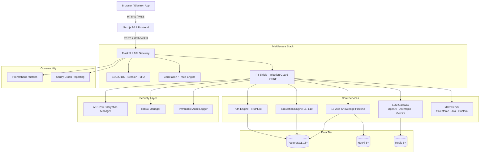

# DataLogicEngine

> **Local-first AI orchestration, knowledge graph exploration, traceable reasoning runs, and enterprise governance in one platform.**

[](https://github.com/kherrera6219/DataLogicEngine/actions/workflows/ci.yml)
[](https://github.com/kherrera6219/DataLogicEngine/actions/workflows/security.yml)
[](LICENSE)


---

**Version:** 4.1.19 &nbsp;|&nbsp; **Stack:** Flask 3.1 · Next.js 16.1 · Electron 40 · PostgreSQL 15 · Redis 5 · Neo4j 5  
**Status:** Active — production-oriented security and governance controls in place since 2026-03-24  
**License:** [PolyForm Noncommercial 1.0.0](LICENSE) · [Commercial License available](COMMERCIAL_LICENSE.md)

---

## Table of Contents

1. [What is DataLogicEngine?](#1-what-is-datalogicengine)
2. [Core Capabilities](#2-core-capabilities)
3. [Architecture Overview](#3-architecture-overview)
4. [Technology Stack](#4-technology-stack)
5. [Deployment Modes](#5-deployment-modes)
6. [Quick Start](#6-quick-start)
7. [Configuration Reference](#7-configuration-reference)
8. [API Reference](#8-api-reference)
9. [Knowledge Graph & 17-Axis System](#9-knowledge-graph--17-axis-system)
10. [Knowledge Algorithms (KA-001 – KA-116)](#10-knowledge-algorithms-ka-001--ka-116)
11. [Simulation Engine (10-Layer Pipeline)](#11-simulation-engine-10-layer-pipeline)
12. [MCP Connector Framework](#12-mcp-connector-framework)
13. [Security & Compliance](#13-security--compliance)
14. [Observability & Monitoring](#14-observability--monitoring)
15. [Testing & Quality Gates](#15-testing--quality-gates)
16. [Desktop Distribution (Electron)](#16-desktop-distribution-electron)
17. [Capability Status Matrix](#17-capability-status-matrix)
18. [Repository Structure](#18-repository-structure)
19. [Documentation Index](#19-documentation-index)
20. [Contributing](#20-contributing)
21. [Support](#21-support)
22. [License](#22-license)

---

## 1. What is DataLogicEngine?

DataLogicEngine is a **production-grade, full-stack AI orchestration and knowledge graph platform** built for organisations that require explainability, traceability, and rigorous governance over every AI-driven decision.

It combines five capabilities that normally require separate tools:

| Capability | What it provides |
|---|---|
| **AI Orchestration** | Multi-provider LLM routing (OpenAI, Anthropic, Gemini) with circuit-breaker failover, cost tracking, and prompt governance |
| **Knowledge Graph** | A 17-axis coordinate system backed by Neo4j, with interactive 3D visualisation and structured node/edge APIs |
| **Traceable Reasoning** | Every run captures stages, personas, axis coordinates, latency, and evidence — exportable as signed compliance packages |
| **Simulation & Reasoning** | A 10-layer pipeline (L1–L10) and QuadPersona engine for multi-perspective, recursive reasoning |
| **Enterprise Governance** | RBAC, MFA, AES-256 field encryption, blockchain-backed audit (TruthLink), GDPR controls, and vault-aware secret management |

DataLogicEngine ships as both a **browser-based web application** and a **standalone Windows 11 desktop application** (Electron + NSIS installer), making it equally suited for cloud deployments and air-gapped or local-first enterprise environments.

---

## 2. Core Capabilities

### 2.1 AI Orchestration & LLM Gateway

- Unified gateway for **OpenAI, Anthropic, and Google Gemini** models
- **Circuit-breaker pattern** with automatic provider failover and latency-aware routing
- Per-provider latency tracking with p50/p95/p99 percentiles exposed on `/metrics`
- Cost-attribution metrics per query, per session, and per tenant
- Knowledge-graph context injection before LLM dispatch
- Streaming output (`/api/v1/gateway/stream`) with real-time frontend delivery via Socket.IO
- AI guardrail layer: prompt-injection detection, jailbreak detection, synthetic embedding rejection

### 2.2 Knowledge Graph Exploration

- **17-axis coordinate system** for precise, multi-dimensional knowledge placement (see [Section 9](#9-knowledge-graph--17-axis-system))
- Neo4j 5+ graph database with PostgreSQL metadata mirror
- Interactive **3D force-directed visualisation** (Three.js + react-force-graph-3d) in the browser
- Structured node/edge CRUD APIs under `/api/v1/knowledge/`
- Axis-specific filtering: sector, domain, regulatory, compliance, location, time, provenance, and more
- Full-text and semantic search across the graph (`/api/search/`)

### 2.3 Traceable Run Execution

- Every LLM query and simulation run generates a **structured trace**: stages → steps → evidence
- Correlation IDs propagate through every layer for end-to-end observability
- Stage-level recording of: persona in use, axis coordinates, duration, input/output snapshots
- Runs stored persistently in PostgreSQL and browsable at `/runs`
- **Signed export manifests** and optional encrypted payload envelopes for compliance packaging
- Hash-chain immutable audit replica stream for tamper-evidence

### 2.4 Simulation & Multi-Layer Reasoning

- 10-layer simulation pipeline (`L1` entry → `L10` synthesis)
- **QuadPersona engine**: simultaneous reasoning from four distinct personas for balanced, evidence-rich outputs
- Entropy sampling, refinement orchestration, and recursive reasoning support
- Simulation parameters and results persisted with full run linkage

### 2.5 MCP (Model Context Protocol) Integration

- First-class support for **Salesforce**, **Jira**, and custom tool connectors
- Managed OAuth token lifecycle per connector
- Runtime request/response contract validation
- SSRF outbound validation and allowlist guardrails
- Connector-level latency and error telemetry (p95/p99 SLO gauges)
- Scope enforcement with user/tenant context propagation

### 2.6 Enterprise Security & Governance

- **Role-Based Access Control (RBAC)** with granular permission sets
- **TOTP-based MFA** with backup codes and account lockout policies
- **AES-256 field-level encryption** for PII and sensitive model fields
- **Blockchain-backed TruthLink** for immutable audit evidence
- GDPR: right-to-export, right-to-erasure, PII redaction, and data classification tagging
- Vault-aware secret resolution (file, DPAPI, JSON keyring, HashiCorp Vault-compatible)
- Zero-trust middleware: session ownership validation, fail-closed frontend edge, replay-defense nonce (Redis-backed)

### 2.7 Desktop-First Windows Operation

- Full **Windows 11 native packaging** via Electron 40 + NSIS installer
- Embedded local orchestration of PostgreSQL, Redis, and Neo4j via PowerShell startup scripts
- Windows DPAPI secret storage — no external secret manager required
- Auto-login via Windows SID validation (no manual credential entry)
- Auto-updater support (electron-updater)
- Code-signed installer with Authenticode certificates

---

## 3. Architecture Overview

### High-Level Component Map



### Deployment Architecture

```
┌─────────────────────────────────────────────────────────┐
│                  Load Balancer / Ingress                 │
└────────────────────┬────────────────────────────────────┘
                     │
         ┌───────────┴───────────┐
         ▼                       ▼
┌────────────────┐     ┌─────────────────┐
│  Next.js :3000 │     │  Flask/Gunicorn  │
│  (4 replicas)  │     │  :5000 (4w·2t)  │
└────────────────┘     └────────┬────────┘
                                │
              ┌─────────────────┼──────────────────┐
              ▼                 ▼                  ▼
       ┌─────────────┐  ┌─────────────┐  ┌──────────────┐
       │ PostgreSQL  │  │   Redis 5+  │  │  Neo4j 5+    │
       │ (primary +  │  │  (cluster)  │  │  (graph DB)  │
       │  replicas)  │  └─────────────┘  └──────────────┘
       └─────────────┘
```

### Architecture Hardening (2026-03-24)

The following controls were enforced as part of the production hardening baseline:

| Control | Description |
|---|---|
| Gateway object-level authorisation | Session message retrieval validates ownership against authenticated identity |
| Fail-closed frontend edge | Next.js proxy middleware returns `503` on any middleware exception — no silent pass-through |
| RAG safety controls | Synthetic/mock embeddings rejected in production; low-score and injection-style chunks filtered from retrieval context |
| Replay-defense resilience | Request-signing nonce state backed by Redis for correctness across multi-worker deployments |
| Upload trust-boundary hardening | Binary signature validated against declared MIME type before pipeline entry |

---

## 4. Technology Stack

### Backend

| Layer | Technology | Version |
|---|---|---|
| Web framework | Flask | 3.1.2 |
| ORM | SQLAlchemy + Flask-SQLAlchemy | 2.0.46 / 3.1.1 |
| Database migrations | Alembic + Flask-Migrate | 1.18.3 / 4.1.0 |
| Relational DB | PostgreSQL | 15+ |
| Cache / Queue | Redis + Celery | 5+ / 5.6.2 |
| Graph DB | Neo4j | 5+ |
| Object storage | MinIO (S3-compatible) / AWS S3 | — |
| Authentication | Flask-Login, Flask-JWT-Extended, Authlib, Flask-Dance | — |
| WebSockets | Flask-SocketIO | 5.6.0 |
| GraphQL | Flask-GraphQL + Graphene | 2.0.0 / 3.4.3 |
| LLM clients | OpenAI, Google Genai, Anthropic (httpx) | 2.16.0 / 1.60.0 |
| RAG / LLMOps | LlamaIndex, LangChain, LangGraph, ChromaDB | 0.14.13 / 1.2.9 / 1.0.8 / 1.4.1 |
| Document processing | PyPDF, python-docx, Tesseract, OpenCV | 6.6.2 / 1.2.0 / — / 4.13.0 |
| Serialisation & validation | Marshmallow, Pydantic | 3.26.2 / 2.12.5 |
| Observability | Sentry SDK, python-json-logger | 2.51.0 |
| WSGI server | Gunicorn | 24.1.1 |
| Runtime | Python | 3.11+ |

### Frontend

| Layer | Technology | Version |
|---|---|---|
| Framework | Next.js (App Router) | 16.1.6 |
| UI library | React | 18.3.1 |
| Language | TypeScript | 5.x |
| Styling | Tailwind CSS v4 + Shadcn UI (Radix primitives) | 4.x |
| Icons | Lucide React | 0.562.0 |
| Data fetching | SWR | 2.3.8 |
| Real-time | Socket.io-client | 4.8.3 |
| 3D visualisation | Three.js + react-force-graph-3d | 0.182.0 / 1.29.0 |
| Charts | Recharts | 3.6.0 |
| Desktop shell | Electron | 40.0.0 |
| Desktop packaging | electron-builder | 26.7.0 |
| Unit / component testing | Vitest + @testing-library/react | 4.0.18 / 16.3.2 |
| E2E testing | Playwright | 1.58.1 |
| Accessibility | @axe-core/cli | 4.11.0 |
| Component docs | Storybook | 8.6.15 |
| Runtime | Node.js | 20+ |

### DevOps & Infrastructure

| Aspect | Technology |
|---|---|
| Containerisation | Docker, Docker Compose |
| Orchestration | Kubernetes (Helm / Kustomize), custom K8s Operator |
| CI/CD | GitHub Actions (6 workflows) |
| Cloud targets | AWS (ECS/EC2), Azure (App Service), GCP (Cloud Run) |
| Secret management | Vault-aware resolver, Windows DPAPI |
| Code signing | Authenticode (Windows), NSIS |
| Monitoring | Prometheus metrics, Sentry, custom SLO gauges |

---

## 5. Deployment Modes

DataLogicEngine supports four deployment targets. Choose the one that fits your environment:

| Mode | Best for | Entry point |
|---|---|---|
| **Local development** | Individual contributors | `python main.py` + `npm run dev` |
| **Docker Compose** | Team evaluation, staging | `docker-compose up` |
| **Kubernetes** | Production cloud workloads | `kubectl apply -k k8s/` |
| **Windows Desktop (Electron)** | Air-gapped / local-first enterprise | `DataLogicEngine Setup Latest.exe` |

### 5.1 Docker Compose

```bash
docker-compose up
```

Services started: `backend` (Flask), `frontend` (Next.js), `postgres`, `redis`, `neo4j`, `minio`.  
All services are connected on the `ukg-network` bridge network.

### 5.2 Kubernetes

Manifests are in `k8s/`. A custom Kubernetes Operator is provided for lifecycle management.  
See [docs/K8S_OPERATOR_DESIGN.md](docs/K8S_OPERATOR_DESIGN.md) for operator design details and [docs/DEPLOYMENT.md](docs/DEPLOYMENT.md) for full Helm/Kustomize runbooks.

### 5.3 Cloud Deployments

Pre-configured deployment workflows exist for all three major clouds:

- **AWS** — ECS task definitions and EC2 launch configurations in `deploy/aws/`
- **Azure** — App Service configurations in `deploy/azure/`
- **GCP** — Cloud Build + Cloud Run specs in `deploy/gcp/`

### 5.4 Windows Desktop

```powershell
# Build the installer
npm run electron:dist

# Or run the pre-built installer
.\DataLogicEngine Setup Latest.exe
```

The installer starts the embedded local stack (PostgreSQL, Redis, Neo4j) automatically:

```powershell
powershell -ExecutionPolicy Bypass -File .\scripts\windows\start_local_stack.ps1
```

See [docs/WINDOWS_11_LOCAL_RUNBOOK.md](docs/WINDOWS_11_LOCAL_RUNBOOK.md) for the full desktop operations guide.

---

## 6. Quick Start

### Prerequisites

| Requirement | Minimum version | Notes |
|---|---|---|
| Python | 3.11 | `python --version` |
| Node.js | 20 | `node --version` |
| npm | 10 | `npm --version` |
| PostgreSQL | 15 | Optional for dev — SQLite fallback available |
| Redis | 5 | Optional for dev |
| Neo4j | 5 | Optional for dev |

### 6.1 Backend Setup

```bash
# 1. Create and activate a virtual environment
python -m venv .venv
source .venv/bin/activate          # Windows: .venv\Scripts\activate

# 2. Install dependencies
python -m pip install --upgrade pip
python -m pip install -r requirements.txt

# 3. Copy and configure environment
cp .env.template .env

# 4. Install git hooks
git config core.hooksPath .githooks
```

Edit `.env` and set at minimum:

```env
SESSION_SECRET=<a-long-random-string-minimum-32-characters>
OPENAI_API_KEY=<optional-but-recommended>
ANTHROPIC_API_KEY=<optional>
GEMINI_API_KEY=<optional>
```

### 6.2 Frontend Setup

```bash
cd frontend
npm install
cd ..
```

### 6.3 Verify Local Readiness

```bash
python scripts/dev_doctor.py --skip-ports
```

This script checks Python version, environment variables, dependency installation, and file integrity. Fix any reported issues before proceeding.

### 6.4 Run Locally

**Backend** (terminal 1):

```bash
flask db upgrade       # Apply database migrations
python main.py         # Starts on http://127.0.0.1:5000
```

> `AUTO_CREATE_SCHEMA=true` is a local-only escape hatch. Never enable it in shared or production environments — use migrations.

**Frontend** (terminal 2):

```bash
cd frontend
npm run dev            # Starts on http://localhost:3000
```

Open [http://localhost:3000](http://localhost:3000) in your browser.

### 6.5 Validate API Keys

```bash
python scripts/verify_api_keys.py
```

### 6.6 Default Ports

| Service | Default port |
|---|---|
| Flask backend | `5000` |
| Next.js frontend | `3000` |
| PostgreSQL | `5432` |
| Redis | `6379` |
| Neo4j (Bolt) | `7687` |
| Neo4j (HTTP) | `7474` |
| MinIO | `9000` |

---

## 7. Configuration Reference

All configuration is driven by environment variables. Copy `.env.template` to `.env` and populate the values below.

### 7.1 Core Application

| Variable | Required | Description |
|---|---|---|
| `SESSION_SECRET` | **Yes** | Flask session signing secret — minimum 32 random characters |
| `FLASK_ENV` | No | `development` \| `testing` \| `production` \| `desktop` (default: `development`) |
| `AUTO_CREATE_SCHEMA` | No | `true` for local-only schema bootstrap — **never use in production** |
| `LOG_LEVEL` | No | Python log level (`DEBUG`, `INFO`, `WARNING`, `ERROR`) |

### 7.2 Database

| Variable | Required | Description |
|---|---|---|
| `DATABASE_URL` | No* | PostgreSQL connection string. Falls back to SQLite in development |
| `NEO4J_URI` | No | Neo4j Bolt URI (e.g. `bolt://localhost:7687`) |
| `NEO4J_USER` | No | Neo4j username |
| `NEO4J_PASSWORD` | No | Neo4j password |

### 7.3 Cache & Queue

| Variable | Required | Description |
|---|---|---|
| `REDIS_URL` | No | Redis connection string (e.g. `redis://localhost:6379/0`) |
| `CELERY_BROKER_URL` | No | Celery broker — defaults to `REDIS_URL` |

### 7.4 AI Providers

| Variable | Required | Description |
|---|---|---|
| `OPENAI_API_KEY` | No* | OpenAI API key — at least one provider key required |
| `ANTHROPIC_API_KEY` | No* | Anthropic API key |
| `GEMINI_API_KEY` | No* | Google Gemini API key |

### 7.5 Security & Observability

| Variable | Required | Description |
|---|---|---|
| `ENCRYPTION_KEY` | Production | AES-256 field encryption key (Fernet format) |
| `JWT_SECRET_KEY` | Production | JWT signing secret |
| `SENTRY_DSN` | No | Sentry error reporting DSN |
| `CORS_ORIGINS` | Production | Comma-separated allowed CORS origins |
| `SESSION_COOKIE_SECURE` | Production | Set `true` in HTTPS environments |

### 7.6 Configuration Classes

The `FLASK_ENV` variable selects a configuration class from `backend/config.py`:

| Class | Env value | Use case |
|---|---|---|
| `DevelopmentConfig` | `development` | Local development — DEBUG on, relaxed limits |
| `TestingConfig` | `testing` | CI — in-memory SQLite, minimal simulation layers |
| `ProductionConfig` | `production` | Hardened — secure cookies, no debug, full limits |
| `DesktopConfig` | `desktop` | Windows local install — embedded databases, DPAPI secrets |

---

## 8. API Reference

All endpoints are versioned under `/api/v1/`. The OpenAPI specification is available at `static/openapi.yaml`.

### 8.1 Authentication

| Method | Endpoint | Description |
|---|---|---|
| `POST` | `/api/v1/auth/login` | Authenticate and create session |
| `POST` | `/api/v1/auth/logout` | Terminate session |
| `GET` | `/api/v1/auth/session` | Retrieve current session details |
| `POST` | `/api/v1/auth/mfa/setup` | Enrol TOTP MFA |
| `POST` | `/api/v1/auth/mfa/confirm` | Confirm TOTP token |
| `POST` | `/api/v1/auth/step-up` | Re-authenticate for sensitive operations |
| `POST` | `/api/v1/auth/refresh` | Refresh JWT access token |

### 8.2 LLM Gateway

| Method | Endpoint | Description |
|---|---|---|
| `POST` | `/api/v1/gateway/query` | Execute LLM query with knowledge-graph context |
| `POST` | `/api/v1/gateway/stream` | Streaming LLM output (SSE) |
| `GET` | `/api/v1/gateway/status` | Provider health and availability |
| `GET` | `/api/v1/gateway/metrics` | Provider latency / cost metrics |
| `POST` | `/api/v1/gateway/context/inject` | Inject knowledge-graph context before dispatch |

### 8.3 Knowledge Graph

| Method | Endpoint | Description |
|---|---|---|
| `GET` | `/api/v1/knowledge/nodes` | List nodes (paginated, axis-filterable) |
| `POST` | `/api/v1/knowledge/nodes` | Create node |
| `GET` | `/api/v1/knowledge/nodes/<id>` | Node detail with axis coordinates |
| `PUT` | `/api/v1/knowledge/nodes/<id>` | Update node |
| `DELETE` | `/api/v1/knowledge/nodes/<id>` | Delete node |
| `GET` | `/api/v1/knowledge/edges` | List edges |
| `POST` | `/api/v1/knowledge/edges` | Create edge |
| `GET` | `/api/v1/knowledge/sectors` | List sectors (Axis 2) |
| `GET` | `/api/v1/knowledge/domains` | List domains (Axis 3) |
| `GET` | `/api/v1/knowledge/pillars` | List knowledge pillars |

### 8.4 Knowledge Algorithms

| Method | Endpoint | Description |
|---|---|---|
| `POST` | `/api/v1/ka/execute` | Execute a specific algorithm by ID |
| `GET` | `/api/v1/ka/registry` | List all registered algorithms |
| `GET` | `/api/v1/ka/registry/<id>` | Algorithm metadata and schema |
| `POST` | `/api/v1/ka/test` | Test algorithm with sample input |
| `GET` | `/api/v1/ka/metrics` | Algorithm performance metrics |

### 8.5 Simulation

| Method | Endpoint | Description |
|---|---|---|
| `GET` | `/api/v1/simulations` | List simulations |
| `POST` | `/api/v1/simulations` | Create simulation |
| `GET` | `/api/v1/simulations/<id>` | Simulation details |
| `POST` | `/api/v1/simulations/<id>/run` | Execute simulation |
| `GET` | `/api/v1/simulations/<id>/results` | Fetch results |
| `DELETE` | `/api/v1/simulations/<id>` | Delete simulation |

### 8.6 Truth Engine

| Method | Endpoint | Description |
|---|---|---|
| `POST` | `/api/v1/truth/evaluate` | Evaluate a claim or statement |
| `GET` | `/api/v1/truth/status` | Truth consensus status |
| `POST` | `/api/v1/truth/evidence/add` | Submit supporting evidence |
| `GET` | `/api/v1/truth/evidence` | Retrieve evidence records |
| `POST` | `/api/v1/truth/sync` | Trigger federated sync |

### 8.7 MCP Connectors

| Method | Endpoint | Description |
|---|---|---|
| `GET` | `/api/v1/mcp/servers` | List registered MCP servers |
| `POST` | `/api/v1/mcp/servers` | Register a new server |
| `GET` | `/api/v1/mcp/servers/<id>` | Server details |
| `POST` | `/api/v1/mcp/servers/<id>/oauth` | Initiate OAuth flow |
| `POST` | `/api/v1/mcp/execute` | Execute MCP tool call |

### 8.8 Trace & Audit

| Method | Endpoint | Description |
|---|---|---|
| `GET` | `/api/v1/trace/runs` | List execution traces |
| `GET` | `/api/v1/trace/runs/<id>` | Trace detail (stages + steps) |
| `GET` | `/api/v1/trace/runs/<id>/export` | Export trace as signed evidence package |
| `GET` | `/api/v1/trace/correlation/<id>` | Fetch all records for a correlation ID |

### 8.9 Compliance & GDPR

| Method | Endpoint | Description |
|---|---|---|
| `GET` | `/api/v1/compliance/status` | Active compliance posture |
| `POST` | `/api/v1/compliance/export` | GDPR data export (Article 20) |
| `DELETE` | `/api/v1/compliance/data` | Right to erasure (Article 17) |
| `GET` | `/api/v1/compliance/audit-log` | Retrieve immutable audit trail |
| `GET` | `/api/v1/compliance/policies` | List active data policies |

### 8.10 System Health

| Endpoint | Auth required | Description |
|---|---|---|
| `GET /health` | No | Shallow health check |
| `GET /live` | No | Kubernetes liveness probe |
| `GET /ready` | No | Kubernetes readiness probe |
| `GET /metrics` | No | Prometheus metrics scrape endpoint |

### 8.11 Standard Response Envelope

**Success:**
```json
{
  "success": true,
  "data": { },
  "error": null,
  "timestamp": "2026-05-05T14:30:00Z"
}
```

**Error:**
```json
{
  "success": false,
  "data": null,
  "error": {
    "code": "VALIDATION_ERROR",
    "message": "Invalid input parameters",
    "details": { }
  },
  "timestamp": "2026-05-05T14:30:00Z"
}
```

### 8.12 Authentication Methods

| Method | Header / mechanism | Use case |
|---|---|---|
| Session cookie | `Cookie: session=<id>` | Browser-based frontend |
| Bearer token | `Authorization: Bearer <jwt>` | External API clients |
| API key | `X-API-Key: <key>` | Programmatic / service integrations |
| SSO / OIDC | Azure AD / Entra ID via Authlib | Enterprise single sign-on |

### 8.13 Legacy URL Aliases

The following aliases remain active with deprecation headers until **2026-09-30**:

| Legacy prefix | Canonical prefix |
|---|---|
| `/api/compliance/*` | `/api/v1/compliance/*` |
| `/api/ka/*` | `/api/v1/ka/*` |
| `/api/mcp/*` | `/api/v1/mcp/*` |
| `/api/simulations/*` | `/api/v1/simulations/*` |
| `/api/truth/*` | `/api/v1/truth/*` |
| `/api/ukg/*` | `/api/v1/*` |

---

## 9. Knowledge Graph & 17-Axis System

DataLogicEngine organises every piece of knowledge using a **17-axis coordinate system**. Each node in the graph has a coordinate vector that precisely locates it across all relevant dimensions simultaneously — enabling multi-dimensional filtering, cross-domain reasoning, and regulatory traceability.

| Axis | Name | Description |
|---|---|---|
| 1 | Knowledge | Core knowledge type classification |
| 2 | Sector | Industry or business sector |
| 3 | Domain | Functional domain within a sector |
| 4 | *(Reserved)* | Reserved for future extension |
| 5 | Honeycomb | Structural placement in knowledge honeycomb |
| 6 | Regulatory | Applicable regulatory frameworks |
| 7 | Compliance | Compliance programme alignment |
| 8 | Knowledge Expert | Subject-matter expert role for knowledge |
| 9 | Sector Expert | Expert role scoped to sector |
| 10 | Regulatory Expert | Expert role for regulatory interpretation |
| 11 | Compliance Expert | Expert role for compliance guidance |
| 12 | Location | Geographic or jurisdictional location |
| 13 | Time | Temporal validity and versioning |
| 14 | Provenance | Origin, source, and lineage tracking |
| 15 | Object Type | Ontological type classification |
| 16 | Validation State | Confidence and verification state |
| 17 | Security | Data classification and access tier |

The 17-axis model is implemented in `core/axes/` and visualised interactively in the browser graph view at `/graph`. NLP-based query-to-coordinate translation (`core/nlp/coordinate_mapper.py`) allows natural-language queries to be automatically located within the coordinate space.

---

## 10. Knowledge Algorithms (KA-001 – KA-116)

DataLogicEngine includes **116+ Knowledge Algorithms (KAs)** — specialised reasoning modules registered in `config/ka_registry.yaml`. Each KA:

- Extends the base class in `core/knowledge_algorithm/ka_base.py`
- Accepts a standardised Pydantic-validated input schema
- Returns a structured output with confidence scores and evidence references
- Is dynamically discovered and loaded by `core/knowledge_algorithm/ka_loader.py`
- Can be executed directly via `POST /api/v1/ka/execute` with `{"algorithm_id": "KA-001", "input": {...}}`

The registry spans `KA-001` through `KA-116`, including Layer 9 variants, and covers domains such as regulatory mapping, compliance gap analysis, risk assessment, knowledge synthesis, and domain-specific expert reasoning.

Browse all available algorithms and their schemas at `/algorithms` in the UI, or query `GET /api/v1/ka/registry`.

---

## 11. Simulation Engine (10-Layer Pipeline)

The simulation engine (`core/simulation/`) runs queries through a sequential 10-layer reasoning pipeline, each layer building on the previous:

| Layer | Name | Responsibility |
|---|---|---|
| L1 | Entry | Query intake, normalisation, routing decision |
| L2 | Knowledge Base | Knowledge retrieval and context assembly |
| L3 | Expert Selection | Persona and domain expert assignment |
| L4 | Reasoning | Core inference and logic application |
| L5 | Integration | Cross-domain knowledge integration |
| L6 | Enhancement | Enrichment with external context |
| L7 | AGI System | Advanced generalisation and pattern synthesis |
| L8 | Quantum Effects | Probabilistic and uncertainty modelling |
| L9 | Recursive Reasoning | Self-referential refinement and depth expansion |
| L10 | Synthesis | Final answer composition and confidence scoring |

The **QuadPersona engine** (`core/persona/quad_persona_engine.py`) applies four simultaneous reasoning personas at each layer, producing a multi-perspective output that is reconciled into a single response by the synthesis layer.

A refinement orchestrator (`core/simulation/refinement_orchestrator.py`) manages entropy sampling and iterative improvement passes when confidence thresholds are not met.

Run simulations via the UI at `/simulations` or via `POST /api/v1/simulations/<id>/run`.

---

## 12. MCP Connector Framework

The Model Context Protocol (MCP) integration (`backend/mcp_server/`) allows DataLogicEngine to call external tools and services as first-class context sources during AI reasoning.

### Supported Connectors

| Connector | OAuth | Contract Validation | Notes |
|---|---|---|---|
| Salesforce | Yes | Yes | Full managed token lifecycle |
| Jira | Yes | Yes | Issue/project context retrieval |
| Custom | Configurable | Yes | Extend via `backend/mcp_server/tools/` |

### Security Controls

- **SSRF protection**: All outbound connector calls are validated against an allowlist
- **Scope enforcement**: Tool calls are checked against per-user, per-tenant scope grants at runtime
- **Contract validation**: Request/response schemas validated against registered contracts
- **Observability**: p95/p99 latency SLO gauges per connector exported to Prometheus

### Adding a Custom Connector

1. Create a tool class in `backend/mcp_server/tools/`
2. Register it in `backend/mcp_server/registry.py`
3. Define the contract schema in `backend/mcp_server/contract_validation.py`
4. Configure OAuth scopes if required via `backend/mcp_server/oauth_manager.py`

See [docs/MCP_INTEGRATION.md](docs/MCP_INTEGRATION.md) for full integration documentation.

---

## 13. Security & Compliance

DataLogicEngine's security layer (`backend/security/`) totals over **8,600 lines** across 20+ modules. Security is enforced at every tier — network edge, API gateway, application logic, database, and export.

### 13.1 Access Control

| Control | Implementation |
|---|---|
| RBAC | `security/zero_trust.py` — granular permission sets per role |
| MFA | `security/mfa.py` — TOTP (RFC 6238) with backup codes |
| Session management | `security/session_manager.py` — secure cookie, SameSite, HttpOnly |
| Account lockout | `models.py` — configurable failed-attempt threshold |
| SSO / OIDC | Authlib — Azure AD / Entra ID token mapping |
| Windows SID auto-login | `security/desktop_local_auth.py` — desktop deployments only |

### 13.2 Data Protection

| Control | Implementation |
|---|---|
| Field-level encryption | `security/encryption_manager.py` — AES-256 (Fernet) |
| Password hashing | `security/password_security.py` — bcrypt with strength validation |
| PII redaction | `security/pii_redaction.py` — automatic detection and masking |
| Data classification | `security/data_classification.py` — sensitivity tagging per record |
| Windows DPAPI | `security/dpapi_store.py` — OS-level secret protection on desktop |

### 13.3 API & Network

| Control | Implementation |
|---|---|
| CSRF protection | `security/api_csrf.py` — double-submit cookie pattern |
| Security headers | `security/security_headers.py` — CSP, HSTS, X-Frame-Options |
| Rate limiting | Flask-Limiter — per-IP and per-user throttling |
| Input sanitisation | `security/api_security.py` — request validation and sanitisation |
| Prompt injection guard | `security/ai_guardrail.py` — injection and jailbreak detection |
| Upload trust boundary | Binary signature validated against declared MIME type |

### 13.4 Audit & Integrity

| Control | Implementation |
|---|---|
| Immutable audit log | `security/audit_logger.py` — hash-chain replica stream |
| Blockchain TruthLink | `backend/truth_engine/truth_link/` — immutable evidence anchoring |
| Signed export manifests | `security/export_integrity.py` — HMAC-signed trace packages |
| Replay defence | Redis-backed nonce state for multi-worker request signing |
| Active defence | `security/active_defense.py` — honeypot triggers and attack detection |

### 13.5 Compliance Frameworks

| Framework | Coverage |
|---|---|
| GDPR | Data export (Art. 20), right to erasure (Art. 17), PII tagging, retention policies |
| NIST SSDF | Mapped in `docs/SDLC_SSDF_MAPPING.md` |
| CIS Benchmarks | Baseline controls documented in `docs/CIS_BENCHMARKS.md` |
| ISO/IEC 42001 | AI management system framework in `docs/AI_MANAGEMENT_SYSTEM_42001.md` |

### 13.6 Vulnerability Reporting

Report security vulnerabilities privately via the process described in [SECURITY.md](SECURITY.md). Do not open public issues for potential vulnerabilities.

---

## 14. Observability & Monitoring

### 14.1 Metrics

Prometheus-compatible metrics are exposed at `GET /metrics` (no authentication required for scraping).

Key metric families:

| Metric prefix | Description |
|---|---|
| `llm_gateway_latency_*` | p50/p95/p99 latency per provider |
| `llm_gateway_cost_*` | Token cost per provider and model |
| `mcp_connector_latency_*` | p95/p99 per connector |
| `slo_violation_*` | SLO breach counters (p95, p99 thresholds) |
| `ka_execution_duration_*` | Knowledge algorithm execution time |
| `simulation_layer_duration_*` | Per-layer simulation timing |
| `audit_events_total` | Audit event counter by action type |

### 14.2 Health Probes

| Endpoint | Purpose | Kubernetes probe type |
|---|---|---|
| `GET /health` | Shallow service check | — |
| `GET /live` | Process is alive | `livenessProbe` |
| `GET /ready` | Ready to accept traffic | `readinessProbe` |

### 14.3 Error Tracking

Sentry integration (`sentry-sdk 2.51.0`) provides:
- Automatic exception capture with full stack traces
- Release tracking per deployment
- Fallback crash IDs when Sentry is unavailable
- Sanitised support bundles for incident triage (`scripts/generate_support_bundle.py`)

### 14.4 Structured Logging

All backend services emit JSON-structured logs via `python-json-logger`. Log fields include `correlation_id`, `tenant_id`, `user_id`, `duration_ms`, and `event_type` for log-aggregation compatibility (ELK, Splunk, Cloud Logging).

---

## 15. Testing & Quality Gates

### 15.1 Backend Tests (137 files, 14 domains)

| Suite | Framework | Location | Focus |
|---|---|---|---|
| Unit | pytest | `tests/unit/` | Component logic |
| Integration | pytest | `tests/integration/` | Service interactions, API contracts |
| Contract | pytest | `tests/contract/` | OpenAPI schema compliance |
| End-to-end | pytest | `tests/end_to_end/` | Full user workflows |
| Knowledge algorithms | pytest | `tests/knowledge_algorithms/` | KA execution and correctness |
| Truth engine | pytest | `tests/truth_engine/` | Consensus and layer logic |
| Security | pytest | `tests/security/` | Auth, encryption, audit |
| Simulation | pytest | `tests/simulation/` | Reasoning layer correctness |
| Compliance | pytest | `tests/compliance/` | GDPR and policy enforcement |
| Parity | pytest | `tests/parity/` | SQLite vs PostgreSQL schema parity |
| Windows | pytest | `tests/windows/` | Desktop-specific features |
| Axes | pytest | `tests/axes/` | 17-axis system |
| Performance | pytest | `tests/performance/` | Latency and throughput |

### 15.2 Frontend Tests

| Suite | Framework | Location |
|---|---|---|
| Unit / component | Vitest + @testing-library/react | `frontend/**/*.test.{ts,tsx}` |
| E2E | Playwright | `frontend/tests/e2e/` |
| Visual regression | Playwright | Snapshot tests |
| Accessibility | axe-core + Playwright | A11y test suite |
| Component stories | Storybook | `frontend/**/*.stories.{ts,tsx}` |

### 15.3 Running Tests

```bash
# Backend — full suite
pytest tests --maxfail=20

# Backend — specific domain
pytest tests/unit -v
pytest tests/integration -v
pytest tests/security -v

# Backend — with coverage report
pytest tests --cov=backend --cov-fail-under=70 --cov-report=html

# Frontend — unit tests (watch)
cd frontend && npm test

# Frontend — single run with coverage
cd frontend && npm run test:coverage

# Frontend — E2E
cd frontend && npm run test:e2e

# Frontend — accessibility
cd frontend && npm run test:a11y:ci
```

### 15.4 CI Quality Gates

Every pull request must pass all of the following gates before merge:

| Gate | Tool | Threshold |
|---|---|---|
| Python lint | Ruff | E9, F63, F7 — zero violations |
| Frontend lint | ESLint 9 | Zero errors |
| TypeScript types | tsc strict | Zero errors |
| Backend test suite | pytest | All tests pass |
| Backend coverage | pytest-cov | ≥ 70% |
| Frontend tests | Vitest | All pass |
| E2E tests | Playwright | All pass |
| Accessibility | axe-core | Zero critical violations |
| Dependency audit | pip-audit + npm audit | No critical CVEs |
| OpenAPI contract | pytest contract suite | Schema match |
| Schema parity | `verify_environment_parity.py` | SQLite ↔ Postgres match |
| Deterministic startup | `runtime_precheck.py --strict` | Clean boot |

### 15.5 Repo Governance Checks

```bash
python scripts/dev_doctor.py --skip-ports
python scripts/verify_environment_parity.py
python scripts/verify_lockfiles.py
python scripts/verify_docs_references.py
python scripts/verify_release_governance.py
```

---

## 16. Desktop Distribution (Electron)

The desktop build packages the full DataLogicEngine application as a self-contained Windows 11 executable.

### Build

```bash
cd frontend

# Development mode (live reload)
npm run electron:dev

# Production installer build
npm run electron:dist
```

Build artifacts appear in `frontend/dist/`. The installer is also copied to the repository root:
- `DataLogicEngine Setup <version>.exe` (versioned)
- `DataLogicEngine Setup Latest.exe` (stable alias)

### Desktop-Specific Features

| Feature | Mechanism |
|---|---|
| Auto-login | Windows SID validation — no manual credential entry |
| Secret storage | Windows DPAPI (`security/dpapi_store.py`) |
| Local databases | Embedded PostgreSQL + Redis + Neo4j via PowerShell orchestration |
| Auto-updater | electron-updater — delta updates from configured update server |
| Code signing | Authenticode certificate — passes Windows SmartScreen validation |
| Offline operation | Full feature parity with no internet dependency (except LLM provider calls) |

### Code Signing

Release builds are signed via `.github/workflows/code-signing-governance.yml` and `.github/workflows/release-installer-signing.yml`. The signing workflow enforces certificate rotation and revocation drills as part of the release gate.

---

## 17. Capability Status Matrix

*Status as of 2026-02-16. Refer to [docs/PRODUCT_OVERVIEW.md](docs/PRODUCT_OVERVIEW.md) for the authoritative current status.*

| Area | Routes | Status |
|---|---|---|
| Chat and session workflows | `/chat`, `/projects` | ✅ Live |
| Run and trace visibility | `/runs`, `/dashboard` | ✅ Live |
| Simulations | `/simulations` | ✅ Live |
| Knowledge graph | `/graph` | ✅ Live |
| Settings — API gateway | `/settings` (API Gateway tab) | ✅ Live |
| Settings — AI model controls | `/settings` (AI Models tab) | ✅ Live |
| Settings — storage (local) | `/settings` (Storage tab) | ✅ Live |
| Settings — storage (cloud config) | `/settings` (Storage tab) | ⚠️ Partial |
| Settings — notifications | `/settings` (Notifications tab) | ⚠️ Placeholder only |
| Admin dashboard | `/admin` | ✅ Live |
| MCP connector registry (view/delete) | `/admin/mcp` | ✅ Live |
| MCP connector add-server | `/admin/mcp` | ⚠️ Pending |
| MCP OAuth + contract validation | Tool execution paths | ✅ Live |
| MCP connector observability | `/metrics` | ✅ Live |
| AI latency observability | `/metrics` | ✅ Live |
| Tenant DB isolation (RLS) | All Postgres APIs | ✅ Live |
| Vault-backed secret enforcement | Runtime bootstrap | ✅ Live |
| Immutable audit replication | Audit logger | ✅ Live |
| Installer code signing | Release workflows | ✅ Live |
| GDPR export / erasure | `/api/v1/compliance/` | ✅ Live |
| User registration | `/register` | ⚠️ UI present; submit not wired |

---

## 18. Repository Structure

```
DataLogicEngine/
├── backend/                  # 276 Python files — Flask APIs, security, storage, services
│   ├── app.py                # Flask app bootstrap and middleware registration
│   ├── config.py             # Configuration classes (Dev/Test/Prod/Desktop)
│   ├── models.py             # 40+ SQLAlchemy ORM models (2,422 LOC)
│   ├── main.py               # Application entry point
│   ├── llm_gateway/          # Multi-provider LLM routing with circuit breaker
│   ├── truth_engine/         # Federated truth maintenance and TruthLink
│   ├── knowledge_algorithms/ # 116+ KA implementations
│   ├── mcp_server/           # MCP connector framework
│   ├── security/             # 20+ security modules (8,626 LOC)
│   ├── simulation/           # Simulation engine interface
│   ├── tracing/              # Correlation ID and observability
│   ├── observability/        # Sentry, SLO tracking, latency metrics
│   ├── routes/               # API endpoint handlers (10 modules)
│   ├── auth/                 # Authentication and session management
│   └── quad_persona/         # Multi-perspective reasoning engine
├── core/                     # 88 Python files — Knowledge engine core
│   ├── simulation/           # 10-layer pipeline (layer1_entry.py … layer10_synthesis.py)
│   ├── axes/                 # 17-axis coordinate system implementations
│   ├── knowledge_algorithm/  # KA base class, loader, and registry
│   ├── persona/              # QuadPersona engine
│   ├── nlp/                  # Query-to-coordinate NLP mapper
│   ├── memory/               # Structured memory manager
│   ├── orchestration/        # Master workflow coordinator
│   └── self_evolving/        # SEKRE adaptive engine
├── frontend/                 # 240 TypeScript files — Next.js 16.1 + Electron
│   ├── app/                  # App Router pages (auth, dashboard, chat, graph, …)
│   ├── components/           # Shared UI components (Shadcn + custom)
│   ├── lib/                  # API clients, state management, utilities
│   └── electron/             # Electron main process and auto-updater
├── tests/                    # 137+ Python test files across 14 domains
├── docs/                     # 100+ Markdown documentation files
├── scripts/                  # Setup, verification, and operational automation
├── migrations/               # Alembic database migrations
├── deploy/                   # AWS / Azure / GCP deployment configurations
├── k8s/                      # Kubernetes operator and manifests
├── config/                   # YAML: KA registry, axis schemas, persona config
├── data/                     # Data lineage registries and UKG datasets
├── prompts/                  # LLM prompt templates
├── sdk/                      # Python SDK for external integrations
├── static/                   # OpenAPI spec and static assets
└── .github/                  # CI/CD workflows, issue templates, CODEOWNERS
```

---

## 19. Documentation Index

### Project-Level Documents

| Document | Description |
|---|---|
| [DEVELOPMENT.md](DEVELOPMENT.md) | Contributor setup, branching strategy, and quality gates |
| [PROJECT.md](PROJECT.md) | Product scope, milestones, and repository structure |
| [CONTRIBUTING.md](CONTRIBUTING.md) | Contribution policy, standards, and review process |
| [SECURITY.md](SECURITY.md) | Vulnerability reporting and security support policy |
| [SUPPORT.md](SUPPORT.md) | How to get help and where to report issues |
| [CHANGELOG.md](CHANGELOG.md) | Release notes and version history |
| [COMMERCIAL_LICENSE.md](COMMERCIAL_LICENSE.md) | Commercial licensing terms |

### Architecture & Design

| Document | Description |
|---|---|
| [docs/ARCHITECTURE.md](docs/ARCHITECTURE.md) | System design, hardening baseline, and component responsibilities |
| [docs/ARCHITECTURE_MAP.md](docs/ARCHITECTURE_MAP.md) | Component relationship diagrams |
| [docs/COMPONENT_MAP.md](docs/COMPONENT_MAP.md) | Module responsibility mapping |
| [docs/DATA_FLOW_DIAGRAMS.md](docs/DATA_FLOW_DIAGRAMS.md) | Data movement through the system |
| [docs/SEQUENCE_DIAGRAMS.md](docs/SEQUENCE_DIAGRAMS.md) | Request/response sequence flows |
| [docs/DECISION_LOGIC.md](docs/DECISION_LOGIC.md) | Algorithm selection and routing logic |

### API & Database

| Document | Description |
|---|---|
| [docs/API.md](docs/API.md) | Full REST endpoint reference with request/response contracts |
| [docs/API_VERSIONING.md](docs/API_VERSIONING.md) | Versioning strategy and deprecation policy |
| [docs/DATABASE_SCHEMA.md](docs/DATABASE_SCHEMA.md) | SQLAlchemy model documentation and ERDs |

### Operations & Deployment

| Document | Description |
|---|---|
| [docs/DEPLOYMENT.md](docs/DEPLOYMENT.md) | Cloud, Kubernetes, Windows, and local deployment runbooks |
| [docs/PRODUCTION_READINESS.md](docs/PRODUCTION_READINESS.md) | Pre-deployment checklist |
| [docs/OPERATIONAL_RUNBOOKS.md](docs/OPERATIONAL_RUNBOOKS.md) | Incident response and debugging playbooks |
| [docs/RELEASE_CHECKLIST.md](docs/RELEASE_CHECKLIST.md) | Pre-release verification gates |
| [docs/WINDOWS_11_LOCAL_RUNBOOK.md](docs/WINDOWS_11_LOCAL_RUNBOOK.md) | Windows desktop operations guide |
| [docs/K8S_OPERATOR_DESIGN.md](docs/K8S_OPERATOR_DESIGN.md) | Kubernetes operator design and patterns |
| [docs/SSL_CONFIGURATION.md](docs/SSL_CONFIGURATION.md) | TLS/HTTPS setup guide |

### Security & Compliance

| Document | Description |
|---|---|
| [docs/CIS_BENCHMARKS.md](docs/CIS_BENCHMARKS.md) | CIS security baseline controls |
| [docs/SDLC_SSDF_MAPPING.md](docs/SDLC_SSDF_MAPPING.md) | NIST SSDF compliance alignment |
| [docs/AI_MANAGEMENT_SYSTEM_42001.md](docs/AI_MANAGEMENT_SYSTEM_42001.md) | ISO/IEC 42001 AI governance framework |
| [docs/AI_PRODUCTION_DOCUMENTATION_BASELINE.md](docs/AI_PRODUCTION_DOCUMENTATION_BASELINE.md) | Production AI standards |
| [docs/BRANCH_PROTECTION_POLICY.md](docs/BRANCH_PROTECTION_POLICY.md) | CI gate enforcement and branch rules |

### Testing & Developer Guides

| Document | Description |
|---|---|
| [docs/TESTING.md](docs/TESTING.md) | Test taxonomy, frameworks, and coverage requirements |
| [docs/DEVELOPER_GUIDE.md](docs/DEVELOPER_GUIDE.md) | Deep developer onboarding guide |
| [docs/PRODUCT_OVERVIEW.md](docs/PRODUCT_OVERVIEW.md) | Feature overview and current capability status |
| [docs/MCP_INTEGRATION.md](docs/MCP_INTEGRATION.md) | MCP connector setup and extension guide |
| [docs/FILE_STRUCTURE.md](docs/FILE_STRUCTURE.md) | Complete repository directory mapping |

### Whitepapers

| Document | Description |
|---|---|
| [docs/whitepapers/UKG_Grok_Whitepaper.md](docs/whitepapers/UKG_Grok_Whitepaper.md) | Reasoning architecture theory and the UKG model |
| [docs/whitepapers/UKG_Workflow_Architecture.md](docs/whitepapers/UKG_Workflow_Architecture.md) | Workflow patterns and orchestration design |

---

## 20. Contributing

We welcome contributions. Before opening a pull request:

1. Read [CONTRIBUTING.md](CONTRIBUTING.md) for the full contribution policy.
2. Read [DEVELOPMENT.md](DEVELOPMENT.md) for environment setup and workflow expectations.
3. Install the git hooks: `git config core.hooksPath .githooks`
4. Run the full preflight check: `python scripts/dev_doctor.py --skip-ports`
5. Ensure all CI quality gates pass locally before pushing (see [Section 15.4](#154-ci-quality-gates)).

### Branch Strategy

| Branch | Purpose |
|---|---|
| `main` | Protected — production-ready code only |
| `dev` / `develop` | Integration branch for feature work |
| `feature/<name>` | Individual feature development |
| `fix/<name>` | Bug fixes |

Branch protection rules are documented in [docs/BRANCH_PROTECTION_POLICY.md](docs/BRANCH_PROTECTION_POLICY.md).

### GitHub Collaboration

This repository includes:

- Issue forms in `.github/ISSUE_TEMPLATE/`
- Pull request template in `.github/pull_request_template.md`
- CI, security, deploy, and release workflows in `.github/workflows/`
- Code ownership in `.github/CODEOWNERS`
- GitHub process guide in `.github/README.md`

---

## 21. Support

| Channel | Use |
|---|---|
| [GitHub Issues](https://github.com/kherrera6219/DataLogicEngine/issues) | Bug reports and feature requests |
| [SUPPORT.md](SUPPORT.md) | Support tiers and escalation paths |
| [SECURITY.md](SECURITY.md) | Private vulnerability disclosure |
| [docs/OPERATIONAL_RUNBOOKS.md](docs/OPERATIONAL_RUNBOOKS.md) | Self-service incident triage |

For diagnostic information to include in a support request:

```bash
python scripts/generate_support_bundle.py
```

This generates a sanitised support bundle (no secrets, no PII) suitable for sharing with the support team.

---

## 22. License

DataLogicEngine is dual-licensed:

- **Non-commercial use:** [PolyForm Noncommercial 1.0.0](LICENSE) — free for research, personal projects, and evaluation.
- **Commercial use:** See [COMMERCIAL_LICENSE.md](COMMERCIAL_LICENSE.md) for terms and contact information.

---

<p align="center">
  <strong>DataLogicEngine</strong> &nbsp;·&nbsp; Local-first AI orchestration and traceable knowledge-graph platform with enterprise security, governance, and desktop/web delivery.
</p>
