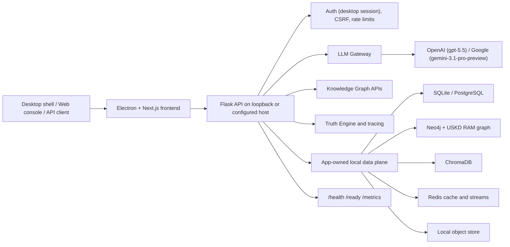

# DataLogicEngine

Local-first Windows desktop AI orchestration, governed LLM routing, and knowledge graph reasoning in one deployable platform.

> ⚠️ **Current Status — Local Desktop Release Candidate, Not Signed Production Release**
> DataLogicEngine is usable for local-first desktop evaluation, architecture review, and engineering validation. The Windows desktop build, backend package, Electron/NSIS installer, packaging smoke, install smoke, uninstall smoke, CI/CD pipeline, deploy workflow, and security scan have been validated on the current main line. A public/signed production release still requires trusted Windows code-signing credentials, signed artifact verification, manual NVDA or equivalent screen-reader evidence, and final release checklist approval. Release status is tracked in [`docs/PRODUCTION_READINESS.md`](docs/PRODUCTION_READINESS.md) and [`TODO.md`](TODO.md).

[](https://github.com/kherrera6219/DataLogicEngine/actions/workflows/ci.yml)
[](https://github.com/kherrera6219/DataLogicEngine/actions/workflows/security.yml)
[](https://github.com/kherrera6219/DataLogicEngine/actions/workflows/deploy.yml)
[](requirements.txt)
[](frontend/package.json)
[](LICENSE)

DataLogicEngine (DLE) is a local-first Enterprise AI Platform built around the Universal Knowledge Graph (UKG).

Unlike traditional AI applications that operate as black boxes, DLE provides explainable reasoning, multi-agent orchestration, GraphRAG retrieval, governance controls, and complete audit traceability.

Designed for enterprise, government, compliance, cybersecurity, acquisition, and research environments, every AI decision can be traced through evidence sources, personas, reasoning stages, validation checkpoints, and immutable audit records designed to align with EU AI Act Article 53 transparency expectations. (Compliance mappings are evidence-guided design references, not a formal certification.)

Current Status: Local-first desktop release candidate with signed-release caveats

**How it's built:** DataLogicEngine runs as a single-owner, local-first Windows desktop application: an Electron + Next.js front end over a Flask + SQLAlchemy backend, with app-owned SQL, graph, vector, object, cache, and memory stores local to the machine or user-controlled Windows VM. The OS user is the sole owner via desktop auto-login; there are no multi-user accounts. AI reasoning is served by one user-selected cloud model — OpenAI `gpt-5.5` or Google `gemini-3.1-pro-preview` (bring your own key) — so an API key and internet connection are required for inference while the data plane stays local. The Windows desktop installer is produced end-to-end from source: PyInstaller backend, Next.js static export, Electron shell, and NSIS installer. Release gates still open before a formal signed release — trusted production code-signing, NVDA accessibility evidence, provider-backed staging validation, and final release checklist approval — are tracked in [`docs/PRODUCTION_READINESS.md`](docs/PRODUCTION_READINESS.md) and [`TODO.md`](TODO.md).

Major subsystems in the current local-first desktop build:

- Universal Knowledge Graph (UKG)
- 17-Axis Knowledge Framework
- 10-Layer Truth Engine
- 12-Step Refinement Workflow
- Knowledge Algorithm Framework (100+ KAs)
- Multi-Agent Orchestration
- GraphRAG Integration
- Knowledge Ingestion Pipeline
- Trace Viewer
- MCP Integration Framework
- Local Database Lifecycle Management
- Enterprise Audit & Governance Framework
- Cloud AI model selection — OpenAI gpt-5.5 or Google gemini-3.1-pro-preview (BYOK)

Current Focus:

- Accessibility validation (NVDA)
- Production code signing
- Release evidence package
- Public architecture assets
- Expanded integration benchmarks
- Public release readiness

What Makes DataLogicEngine Different?

Most AI applications answer questions.

DataLogicEngine explains how answers were produced.

Core Differentiators

**Universal Knowledge Graph (UKG)**

A structured knowledge system designed to organize information, expertise, regulations, compliance requirements, risk factors, locations, time contexts, and reasoning workflows into a unified framework accessible to human operators and AI agents.

**17-Axis Knowledge Framework**

A multidimensional coordinate system that maps every request across knowledge domains, industries, regulatory frameworks, compliance requirements, expertise models, geography, temporal context, risk profiles, and governance policies.

**10-Layer Truth Engine**

A progressive reasoning architecture that combines retrieval, validation, simulation, planning, trust analysis, safety controls, and audit generation into a governed AI workflow.

**12-Step Refinement Workflow**

A structured reasoning improvement pipeline that continuously validates, refines, audits, and strengthens outputs before release.

**Knowledge Algorithm Framework**

More than 100 specialized Knowledge Algorithms (KAs) provide modular capabilities for planning, validation, compliance analysis, contradiction detection, risk assessment, reasoning control, governance policy enforcement, and audit trace generation.

**Explainable AI**

Every response can be traced through:

- Evidence sources
- Personas
- Knowledge Algorithms
- Validation checkpoints
- Refinement stages
- Governance policies
- Audit records

**Local-First Data, Cloud AI Model (BYOK)**

All data stores, retrieval, memory, and reasoning state run locally on the user's machine. The LLM itself is a user-selected cloud model — bring your own key for **OpenAI `gpt-5.5`** or **Google `gemini-3.1-pro-preview`**. An API key and internet connection are therefore required for reasoning; the data plane stays local and only the model inference call leaves the machine.

**Model Context Protocol (MCP)**

Native MCP support enables integration with tools, resources, external agent systems, subscriptions, and dynamic plugin architectures.


Roadmap

**Release Readiness:**

- Complete NVDA accessibility validation
- Production code-signing pipeline
- Final release evidence package
- Public architecture diagrams and assets
- Expanded integration and performance benchmarking

**Enterprise Enhancements:**

- Advanced policy-as-code governance
- Enhanced cost and usage analytics
- Human feedback and review workflows
- Advanced persona orchestration strategies

**Platform Evolution:**

- Expanded GraphRAG retrieval capabilities
- Enterprise deployment automation
- Additional knowledge ingestion connectors
- Advanced knowledge graph learning and adaptation

See [`TODO.md`](TODO.md) for the canonical backlog and release-readiness work items.

> Recommended architecture asset path: `docs/assets/readme/architecture-overview.svg`. Keep this dark-mode-safe visual synchronized with the README architecture diagram.

## Quick Links

- 🚀 **Quick Start**: [Build the Windows installer from source](#quickstart)
- 🔒 **Report Security Issues**: See [`SECURITY.md`](SECURITY.md) for responsible disclosure
- ❓ **Ask Questions**: Open a [GitHub Discussion](https://github.com/kherrera6219/DataLogicEngine/discussions)
- 📚 **Need Help?**: See [Getting Help](#getting-help)
- 🚢 **Deploy to Production**: [`docs/DEPLOYMENT.md`](docs/DEPLOYMENT.md)

## Quickstart

The Windows installer is intentionally built locally from source. The generated `.exe`, `.blockmap`, and checksum files are large release artifacts and should not be uploaded to GitHub. Use this path when starting from a clean Windows machine and producing the installer yourself.

### 1. Download and unpack the source

Use either the GitHub ZIP download or a Git clone.

ZIP path:

1. Open `https://github.com/kherrera6219/DataLogicEngine`.
2. Select **Code** -> **Download ZIP**.
3. Extract the ZIP into a writable local folder such as `C:\software\DataLogicEngine`.
4. Open PowerShell in the extracted repository folder.

Git path:

```powershell
git clone https://github.com/kherrera6219/DataLogicEngine.git C:\software\DataLogicEngine
Set-Location C:\software\DataLogicEngine
```

### 2. Install required tools

Install these before building:

| Requirement | Use |
| --- | --- |
| Windows 11 | Primary desktop build target |
| Python 3.11 | Backend environment and build scripts |
| Node.js 24+ with npm | Frontend and Electron packaging |
| Docker Desktop with Compose v2 | Local database/cache/graph/object services and container validation |
| Git | Optional if cloning instead of downloading the ZIP |
| Internet access | Package restore, container pulls, and cloud model inference |

Confirm the tools are available:

```powershell
py -3.11 --version
node --version
npm --version
docker --version
docker compose version
```

### 3. Create local configuration

Copy the template and edit the local `.env` file:

```powershell
Copy-Item .env.template .env
notepad .env
```

For Docker Compose, make sure these local data-service values are present and uncommented:

```dotenv
POSTGRES_PASSWORD=change-this-postgres-password
NEO4J_PASSWORD=change-this-neo4j-password
OBJECT_ENDPOINT_URL=http://127.0.0.1:9000
OBJECT_ACCESS_KEY=minioadmin
OBJECT_SECRET_KEY=minioadmin123
OBJECT_BUCKET=datalogic
```

Set local application secrets before running the backend or packaged app. Generate a unique 64-character value for each secret, for example:

```powershell
py -3.11 -c "import secrets; print(secrets.token_hex(32))"
```

Then paste the generated values into `.env`:

```dotenv
SECRET_KEY=
JWT_SECRET_KEY=
SESSION_SECRET=
WTF_CSRF_SECRET_KEY=
```

AI provider keys are normally saved encrypted through **Settings -> AI/Model** after installation. For headless or developer runs, set one of these in `.env`:

```dotenv
OPENAI_API_KEY=
GOOGLE_API_KEY=
GEMINI_API_KEY=
```

### 4. Install source dependencies

From the repository root:

```powershell
py -3.11 -m venv .venv
.\.venv\Scripts\python.exe -m pip install --upgrade pip
.\.venv\Scripts\python.exe -m pip install -r requirements.txt
npm --prefix frontend ci
```

### 5. Start Docker services

Start the local data services used by integration checks and developer runs:

```powershell
docker compose up -d db redis neo4j minio
docker compose ps
```

To run the full containerized web stack instead:

```powershell
docker compose up --build
```

Default local service ports are `3000`, `5000`, `5432`, `6379`, `7474`, `7687`, `9000`, and `9001`. Stop conflicting services or adjust your local configuration before starting Docker if one of those ports is already in use.

### 6. Build the Windows installer

Build the packaged backend, frontend, Electron shell, and NSIS installer:

```powershell
.\.venv\Scripts\python.exe scripts\build_backend.py
$env:CSC_SKIP = "true"
npm --prefix frontend run electron:dist
```

`CSC_SKIP=true` creates an unsigned local installer. A signed public release requires trusted Windows code-signing credentials and the release checklist in [`docs/PRODUCTION_READINESS.md`](docs/PRODUCTION_READINESS.md).

The desktop build produces these root artifacts:

| Artifact | Purpose |
| --- | --- |
| `DataLogicEngine Setup Latest.exe` | NSIS Windows installer |
| `DataLogicEngine Setup Latest.exe.sha256` | Installer checksum |
| `DataLogicEngine Setup Latest.exe.blockmap` | Electron updater block map |

### 7. Verify the generated installer

Run the same local packaging checks used for release evidence:

```powershell
powershell -NoProfile -ExecutionPolicy Bypass -File .\scripts\windows\verify_nsis_governance.ps1 -RepoRoot (Get-Location).Path
.\.venv\Scripts\python.exe scripts\verify_installer_integrity.py --require-artifacts
powershell -NoProfile -ExecutionPolicy Bypass -File .\scripts\windows\run_packaging_smoke.ps1 -RepoRoot (Get-Location).Path
powershell -NoProfile -ExecutionPolicy Bypass -File .\scripts\windows\run_packaging_smoke.ps1 -RepoRoot (Get-Location).Path -Mode installer
```

The installer-mode smoke test performs a local install/uninstall cycle. Close any running DataLogicEngine windows before running it.

### 8. Run the installer

Start the installer interactively:

```powershell
.\DataLogicEngine Setup Latest.exe
```

After installation, launch DataLogicEngine from the Start menu or desktop shortcut, open **Settings -> AI/Model**, select OpenAI `gpt-5.5` or Google `gemini-3.1-pro-preview`, paste your provider key, and save it. Unsigned local builds may show a Windows SmartScreen warning until the production code-signing gate is complete.

### 9. Developer browser mode

For local browser development without the packaged installer:

```powershell
flask db upgrade
.\.venv\Scripts\python.exe main.py
npm --prefix frontend run dev
```

Open in browser mode:

| Service | URL |
| --- | --- |
| Web console | `http://localhost:3000` |
| Backend API | `http://localhost:5000` |
| Health probe | `http://localhost:5000/health` |
| Metrics | `http://localhost:5000/metrics` |
| Swagger UI | `http://localhost:5000/api/docs` |

Minimal API call:

```bash
curl http://localhost:5000/health
```

## Contents

- [Why DataLogicEngine](#why-datalogicengine)
- [Architecture](#architecture)
- [Data store design philosophy](#data-store-design-philosophy)
- [Installation](#installation)
- [Configuration](#configuration)
- [API Examples](#api-examples)
- [Deployment](#deployment)
- [Security and Compliance](#security-and-compliance)
- [Observability](#observability)
- [Testing](#testing)
- [Roadmap](#roadmap)
- [Getting Help](#getting-help)
- [Contributing](#contributing)
- [License](#license)
- [Repository Metadata](#repository-metadata)

## Why DataLogicEngine

DataLogicEngine is designed for teams that need AI workflows to be explainable, inspectable, and operable in regulated environments.

| Capability | What it provides |
| --- | --- |
| LLM gateway | Routes requests to the user's selected cloud model (OpenAI gpt-5.5 or Google gemini-3.1-pro-preview) with retries, circuit-breaker behavior, cost tracking, and audit metadata. |
| Knowledge graph | Structured graph model with sectors, domains, pillars, knowledge nodes, edges, and 17-axis reasoning support. |
| Traceable reasoning | Runs, traces, stage timing, persona context, and evidence references for audit reconstruction. |
| Governance | Single-owner desktop auth, CSRF controls, CORS policy enforcement, prompt-injection checks, request limits, and immutable audit patterns. |
| Local-first distribution | Browser deployment plus Electron/NSIS Windows packaging for workstation and constrained-network scenarios. |
| Production operations | Docker Compose, cloud Dockerfile, health/readiness probes, metrics endpoint, Sentry integration, and CI/security workflows. |

## Architecture



### Runtime Components

| Layer | Components | Notes |
| --- | --- | --- |
| Frontend | Next.js 16, React 18, Electron 40 | Web console, desktop shell, graph visualization, admin surfaces. |
| Backend | Flask 3.1, SQLAlchemy, Socket.IO | API routing, auth, gateway orchestration, audit, tracing. |
| Data | PostgreSQL 15+, Neo4j 5+, Redis 7+, MinIO | Relational state, graph state, cache/rate limits, object storage. |
| AI | OpenAI (gpt-5.5), Google/Gemini (gemini-3.1-pro-preview) | One user-selected cloud model handles every request. Provider key resolved at runtime from the app DB (Settings) or environment. |
| Quality | Pytest, Ruff, Vitest, Playwright, GitHub Actions | CI includes backend, frontend, governance, security, deploy, and Windows packaging checks. |

## Data store design philosophy

DataLogicEngine uses eight purpose-built local stores — not because of complexity for its own sake, but because of three founding principles:

**1. Data security by architecture**
Every store is app-owned and local. There are no external database endpoints, no cloud-managed storage, no third-party data custodians. Field-level AES-256-GCM encryption with Windows DPAPI-bound keys means sensitive data is protected at the OS level — not by a vendor service agreement.

**2. Zero external API calls for data**
All retrieval — graph traversal, vector search, relational queries, memory recall — operates entirely on local hardware. The only external traffic is the LLM inference call to the user's selected cloud provider. The data plane itself has no network dependency.

**3. Internal access speed**
The USKD NetworkX RAM graph exists specifically so reasoning traversal never touches disk or a network socket during the hot path of a multi-step reasoning chain. At the scale of dozens of retrieval operations per request, local hardware latency vs. network latency compounds significantly across every step.

### These are working databases, not end-client databases

The LLM reasoning engine is the sole client of the data layer. There is no user-facing query interface, no raw export surface, and no direct store access exposed to users. Each store serves a specific cognitive role in the reasoning pipeline — memory, retrieval, traversal, artifact storage — not as a system of record for user data.

| Store | Role |
|---|---|
| SQLAlchemy DB (SQLite / PostgreSQL) | Durable application state, traces, audit records, Truth Engine sessions |
| Redis | Cache, sessions, rate limiting, TruthLink event streams |
| Neo4j | Graph-native knowledge relationships and durable traversal |
| USKD NetworkX graph | RAM-resident reasoning graph — fast traversal, no DB round trips on hot path |
| ChromaDB | Local vector embeddings and semantic retrieval |
| Local object store | Deliverables, audit logs, trace exports, simulation artifacts |
| UnifiedMemoryService | Structured reasoning memory with embeddings and JSON persistence |
| TruthMemory | Audit chain, metrics, explainability, MLflow-style run tracking |

See [`docs/DATABASE_SCHEMA.md`](docs/DATABASE_SCHEMA.md) for the full data architecture reference.

## Installation

### Prerequisites

| Tool | Version | Purpose |
| --- | --- | --- |
| Python | 3.11+ | Backend runtime and tests |
| Node.js | 24+ | Frontend and Electron tooling |
| Docker | Current stable | Local full-stack development |
| PostgreSQL | 15+ | Production relational store |
| Redis | 7+ | Cache, rate limiting, async support |
| Neo4j | 5+ | Knowledge graph storage |

### Backend Development

**Windows:**

```bash
python -m venv .venv
.venv\Scripts\activate
python -m pip install --upgrade pip
pip install -r requirements.txt
copy .env.template .env
python main.py
```

**macOS/Linux:**

```bash
python -m venv .venv
source .venv/bin/activate
python -m pip install --upgrade pip
pip install -r requirements.txt
cp .env.template .env
python main.py
```

### Frontend Development

```bash
cd frontend
npm ci
npm run dev
```

### Local Mode (no Docker, no cloud databases)

For workstation development without Docker, the setup script downloads and installs portable PostgreSQL, Redis, and Neo4j binaries locally and the app manages their lifecycle automatically:

```bash
# Install portable database binaries (one-time)
python scripts/setup_local_databases.py --all

# Seed Neo4j with UKG pillar taxonomy
python scripts/seed_neo4j.py

# Run database migrations
flask db upgrade

# Start the backend (databases auto-start on app launch)
python main.py
```

Verify all services are reachable:

```bash
python scripts/setup_local_databases.py --verify
```

### Desktop Build

The installer must include a freshly rebuilt backend executable. Use the same order as CI:

```powershell
.\.venv\Scripts\python.exe scripts\build_backend.py
$env:CSC_SKIP = "true"
npm --prefix frontend run electron:dist
```

Installer artifacts are copied to the repository root as a single canonical setup executable:

- `DataLogicEngine Setup Latest.exe`
- matching `.sha256` and `.blockmap` files

Silent install/uninstall scripts are maintained under `scripts/windows/`; see [`docs/WINDOWS_11_LOCAL_RUNBOOK.md`](docs/WINDOWS_11_LOCAL_RUNBOOK.md) for enterprise install and uninstall examples.

### Model Provider Setup

DataLogicEngine uses **one user-selected cloud model**. Choose either provider and
configure its key — an API key and internet connection are required for reasoning.

| Model | Provider | Requires |
| --- | --- | --- |
| `gpt-5.5` | OpenAI | OpenAI API key |
| `gemini-3.1-pro-preview` | Google / Gemini | Google API key |

**OpenAI — gpt-5.5**

1. Get an API key at [platform.openai.com](https://platform.openai.com).
2. In the app: **Settings → AI/Model → Provider: openai → paste key → Save**.
3. Or set `OPENAI_API_KEY` in `.env` before starting the backend.

**Google — gemini-3.1-pro-preview**

1. Get an API key at [aistudio.google.com](https://aistudio.google.com) (free tier available).
2. In the app: **Settings → AI/Model → Provider: google → paste key → Save**.
3. Or set `GOOGLE_API_KEY` (or `GEMINI_API_KEY`) in `.env` before starting the backend.

Once a key is saved, the gateway routes every request to that model. The Dashboard
**AI Model** card shows which provider is configured.

## Configuration

Copy `.env.template` to `.env` and set values for your deployment target.

### Required Production Variables

| Variable | Required | Description |
| --- | --- | --- |
| `FLASK_ENV` | Yes | Use `production` for deployed environments. |
| `SECRET_KEY` | Yes | Flask session secret. Generate a unique 64+ character value. |
| `JWT_SECRET_KEY` | Vestigial | Legacy JWT signing secret (a dev default is provided). Single-mode auth uses Flask-Login sessions + desktop auto-login, not JWT flows; set a unique value only if you wire a token-based integration. |
| `SESSION_SECRET` | Yes | Session signing secret used by runtime checks. |
| `DATABASE_URL` | Yes | SQLAlchemy database URL. PostgreSQL is recommended for production. |
| `CORS_ORIGINS` | Yes | Comma-separated allowed browser origins. Do not use `*` in production. |

> **Single-owner note:** DataLogicEngine uses the OS user as the sole owner (desktop auto-login). There is no admin account to provision and no admin-account setup variables; authorization is a single-owner ownership check.

### Provider and Integration Variables

| Variable | Description |
| --- | --- |
| `OPENAI_API_KEY` | OpenAI provider key. |
| `GOOGLE_API_KEY` / `GEMINI_API_KEY` | Google/Gemini provider key. Enables the Google gemini-3.1-pro-preview model. |
| `SENTRY_DSN` | Enables crash reporting when configured. |
| `SENTRY_TRACES_SAMPLE_RATE` | Distributed trace sampling rate. Default: `0.1`. |
| `SENTRY_PROFILES_SAMPLE_RATE` | Profiling sample rate. Default: `0.1`. |

### Data Services

| Variable | Default / Example | Description |
| --- | --- | --- |
| `REDIS_URL` | `redis://localhost:6379/0` | Cache and runtime coordination. |
| `RATELIMIT_STORAGE_URI` | `redis://localhost:6379` | Flask-Limiter storage backend. |
| `NEO4J_URI` | `bolt://localhost:7687` | Neo4j Bolt endpoint. Standard Neo4j Bolt port. |
| `NEO4J_USER` | `neo4j` | Neo4j username. |
| `NEO4J_PASSWORD` | unset | Neo4j password. |
| `OBJECT_ENDPOINT_URL` | `http://localhost:9000` | S3-compatible object storage endpoint. |
| `OBJECT_ACCESS_KEY` | unset | Object storage access key. |
| `OBJECT_SECRET_KEY` | unset | Object storage secret key. |
| `OBJECT_BUCKET` | `datalogic` | Object storage bucket. |

## API Examples

Base URLs:

| Environment | Base URL |
| --- | --- |
| Local backend | `http://localhost:5000` |
| Versioned API | `http://localhost:5000/api/v1` |
| Production | `https://your-domain.example/api/v1` |

### Health and Readiness

```bash
curl http://localhost:5000/health
curl http://localhost:5000/live
curl http://localhost:5000/ready
```

### Authentication

DataLogicEngine is single-owner / local-first: the desktop app auto-logs in the
OS user as the owner (`POST /api/v1/auth/desktop/auto-login`), so there is no
public username/password login endpoint. For programmatic access, use an API
key — generate one in the app and include it as `X-API-Key`:

```bash
export UKG_KEY="ukg_<prefix>_<secret>"
curl -H "X-API-Key: $UKG_KEY" http://localhost:5000/api/v1/gateway/chat ...
```

### LLM Gateway Request

```bash
curl -X POST http://localhost:5000/api/v1/gateway/chat \
  -H "X-API-Key: $UKG_KEY" \
  -H "Content-Type: application/json" \
  -d '{
    "messages": [
      {
        "role": "user",
        "content": "Summarize the compliance impact of this control change."
      }
    ],
    "model": "gpt-5.5",
    "tier": "2"
  }'
```

Tier 2+ responses include a verifiable audit footer:

```
[UKG Audit Trace]
Tier: 2
Active Axes: ...
Personas Invoked: ...
Confidence: 0.395
Refinement Steps Executed: ...
Compliance Flags: ...
Key Assumption to Verify: ...
What Changes if Wrong: ...
```

Every Tier 2+ run also writes a `TruthAuditEvent` row with a SHA-256 hash-chain receipt for EU AI Act Article 53 compliance.

### Knowledge Graph Query

```bash
curl -H "X-API-Key: $UKG_KEY" \
  http://localhost:5000/api/v1/knowledge-nodes
```

### Knowledge Algorithm Execution

```bash
curl -X POST http://localhost:5000/api/v1/ka/algorithms/KA-001/execute \
  -H "X-API-Key: $UKG_KEY" \
  -H "Content-Type: application/json" \
  -d '{
    "input": {
      "claim": "New customer data must remain in-region.",
      "jurisdiction": "US"
    }
  }'
```

### Standard Response Shape

```json
{
  "success": true,
  "data": {},
  "error": null,
  "timestamp": "2026-01-11T19:35:00Z"
}
```

## Deployment

### Docker Compose

Use Docker Compose for local integration testing or single-host evaluation:

```bash
cp .env.template .env
docker compose up --build -d
docker compose ps
```

### Cloud Container

`Dockerfile.cloud` builds the frontend and backend into a single runtime image:

```bash
docker build -f Dockerfile.cloud -t datalogicengine:latest .
docker run --env-file .env -p 5000:5000 -p 3000:3000 datalogicengine:latest
```

### Production Checklist

- Set `FLASK_ENV=production`.
- Use PostgreSQL, Redis, Neo4j, and S3-compatible object storage outside the app container.
- Set unique secrets for `SECRET_KEY`, `JWT_SECRET_KEY`, and `SESSION_SECRET`.
- Configure exact `CORS_ORIGINS`.
- Run database migrations instead of enabling `AUTO_CREATE_SCHEMA`.
- Terminate TLS at a trusted reverse proxy or platform load balancer.
- Enable Sentry or equivalent crash reporting.
- Confirm `/health`, `/ready`, and `/metrics` are monitored.
- Review [`docs/DEPLOYMENT.md`](docs/DEPLOYMENT.md), [`docs/OPERATIONAL_RUNBOOKS.md`](docs/OPERATIONAL_RUNBOOKS.md), and [`deploy/DEPLOYMENT_CHECKLIST.md`](deploy/DEPLOYMENT_CHECKLIST.md).

## Security and Compliance

DataLogicEngine includes security controls intended for enterprise deployments, but each deployment must still be threat-modeled and configured for its environment.

| Area | Built-in Support |
| --- | --- |
| Authentication | Single-owner desktop auto-login (OS identity), Flask-Login session auth, and API-key auth for programmatic access. Single-user by design — no multi-user login, MFA, or SSO/OIDC. |
| Authorization | Single-owner ownership checks (`current_user_is_owner()`) with owner-gated admin routes. |
| Request security | CSRF, request size limits, CORS enforcement, rate limiting, SSRF allowlisting utilities. |
| Data protection | Secret resolution controls, encryption manager, PII redaction utilities, audit logging. |
| AI governance | Prompt-injection checks, provider usage tracking, trace IDs, policy/gateway hooks. |
| Supply chain | GitHub Actions security workflow, Bandit, npm audit, pip-audit, SBOM-oriented workflow steps. |
| Release governance | Windows installer governance, signing workflows, integrity reporting, release checklist. |

Security references:

- [`SECURITY.md`](SECURITY.md)
- [`docs/SECURITY.md`](docs/SECURITY.md)
- [`docs/AI_MANAGEMENT_SYSTEM_42001.md`](docs/AI_MANAGEMENT_SYSTEM_42001.md)
- [`docs/SDLC_SSDF_MAPPING.md`](docs/SDLC_SSDF_MAPPING.md)
- [`docs/SLSA_LEVEL_3_ATTESTATION.md`](docs/SLSA_LEVEL_3_ATTESTATION.md)

**🔒 Report Security Issues Privately:**

Do not report vulnerabilities in public issues. Follow the private reporting process in [`SECURITY.md`](SECURITY.md).

## Observability

| Signal | Location |
| --- | --- |
| Liveness | `GET /live` |
| Readiness | `GET /ready` |
| Health summary | `GET /health` |
| Runtime metrics | `GET /metrics` |
| API docs | `GET /api/docs` |
| Gateway provider usage | LLM gateway usage models and admin routes |
| Crash reporting | `SENTRY_DSN`, `SENTRY_TRACES_SAMPLE_RATE`, `SENTRY_PROFILES_SAMPLE_RATE` |
| Run tracing | `/api/v1/trace/*` and run-oriented UI routes |

Recommended production integrations:

- Prometheus-compatible scraping for `/metrics`.
- Sentry or an equivalent error and performance backend.
- Centralized JSON logs via `python-json-logger` and platform log shipping.
- Alerting on readiness failures, provider error spikes, token cost anomalies, and authentication failures.

## Testing

```bash
# Backend
python -m pytest tests/
python -m pytest tests/ --cov=backend --cov=models --cov-report=html --cov-report=term-missing --cov-report=json --cov-fail-under=70
python -m ruff check .
python -m pip_audit -r requirements.txt --desc

# Frontend
npm --prefix frontend ci
npm --prefix frontend run lint
npm --prefix frontend run typecheck
npm --prefix frontend run test
npm --prefix frontend audit --audit-level=high
```

### Current CI Runs

- ✅ Backend tests, API contract tests, local-mode parity tests, and security regression smoke
- ✅ Frontend lint, typecheck, unit tests, Next build, route smoke, accessibility, and visual checks
- ✅ Security scan workflow
- ✅ Deploy build and test workflow
- ✅ Windows backend package, Electron/NSIS installer build, and packaging smoke
- ✅ Governance, environment parity, lockfile, docs-reference, schema-parity, and Docker build checks

## Roadmap

| Horizon | Focus |
| --- | --- |
| Near term | Complete app-readiness evidence: authenticated accessibility coverage, keyboard/NVDA checks, failure-mode tests, and export/delete end-to-end validation. |
| Near term | Tighten public API contracts, reduce legacy route aliases, and improve generated OpenAPI coverage. |
| Near term | Keep public architecture assets under `docs/assets/readme/` synchronized with current architecture changes. |
| Mid term | Expand deployment reference material for Kubernetes, managed Postgres, managed Redis, and managed Neo4j. |
| Mid term | Publish signed release artifacts with checksums and provenance metadata. |
| Long term | Cost controls, recursive persona evaluation, human feedback loops, and policy-as-code governance for larger deployments. |

## Getting Help

### Documentation

- **Setup & Configuration**: [`DEVELOPMENT.md`](DEVELOPMENT.md), [`.env.template`](.env.template)
- **Deployment**: [`docs/DEPLOYMENT.md`](docs/DEPLOYMENT.md), [`docs/OPERATIONAL_RUNBOOKS.md`](docs/OPERATIONAL_RUNBOOKS.md)
- **Testing**: [`TESTING.md`](TESTING.md)
- **Development Guide**: [`docs/DEVELOPER_GUIDE.md`](docs/DEVELOPER_GUIDE.md), [`docs/DOCUMENTATION_STANDARDS.md`](docs/DOCUMENTATION_STANDARDS.md)
- **Support**: [`SUPPORT.md`](SUPPORT.md)

### Community & Support

- **Questions**: Open a [GitHub Discussion](https://github.com/kherrera6219/DataLogicEngine/discussions)
- **Bug Reports**: [Create an issue](https://github.com/kherrera6219/DataLogicEngine/issues) with steps to reproduce
- **Security Issues**: See [`SECURITY.md`](SECURITY.md) for responsible disclosure
- **API Documentation**: Swagger UI at `http://localhost:5000/api/docs` (when running locally)

## Contributing

Contributions are welcome when they align with the project license and governance model.

1. Read [`CONTRIBUTING.md`](CONTRIBUTING.md).
2. Read [`CODE_OF_CONDUCT.md`](CODE_OF_CONDUCT.md).
3. Create an issue for non-trivial changes before implementation.
4. Run backend and frontend checks locally.
5. Submit a pull request using the repository template.

Development references:

- [`DEVELOPMENT.md`](DEVELOPMENT.md)
- [`TESTING.md`](TESTING.md)
- [`docs/DEVELOPER_GUIDE.md`](docs/DEVELOPER_GUIDE.md)
- [`docs/DOCUMENTATION_STANDARDS.md`](docs/DOCUMENTATION_STANDARDS.md)

## License

DataLogicEngine is licensed under the [PolyForm Noncommercial License 1.0.0](LICENSE).

Personal, research, and educational use are permitted under the license terms. Commercial use, production deployment in a business environment, or integration into a paid product requires a separate commercial license. See [`COMMERCIAL_LICENSE.md`](COMMERCIAL_LICENSE.md) for details.

## Repository Metadata

### Existing Supporting Files

| File | Status |
| --- | --- |
| `LICENSE` | Present |
| `COMMERCIAL_LICENSE.md` | Present |
| `SECURITY.md` | Present |
| `CONTRIBUTING.md` | Present |
| `CODE_OF_CONDUCT.md` | Present |
| `SUPPORT.md` | Present |
| `CHANGELOG.md` | Present |
| `.github/CODEOWNERS` | Present |
| `.github/pull_request_template.md` | Present |
| `.github/ISSUE_TEMPLATE/*` | Present |
| `.env.template` | Present |
| `Dockerfile.cloud` and `docker-compose.yml` | Present |

### Recommended Additions

| Recommendation | Purpose |
| --- | --- |
| `.github/FUNDING.yml` | Optional sponsorship metadata if the project accepts funding. |
| `CITATION.cff` | Citation metadata for research and academic users. |
| GitHub repository topics | Suggested: `ai`, `llm`, `knowledge-graph`, `flask`, `nextjs`, `governance`, `compliance`, `enterprise-ai`. |
