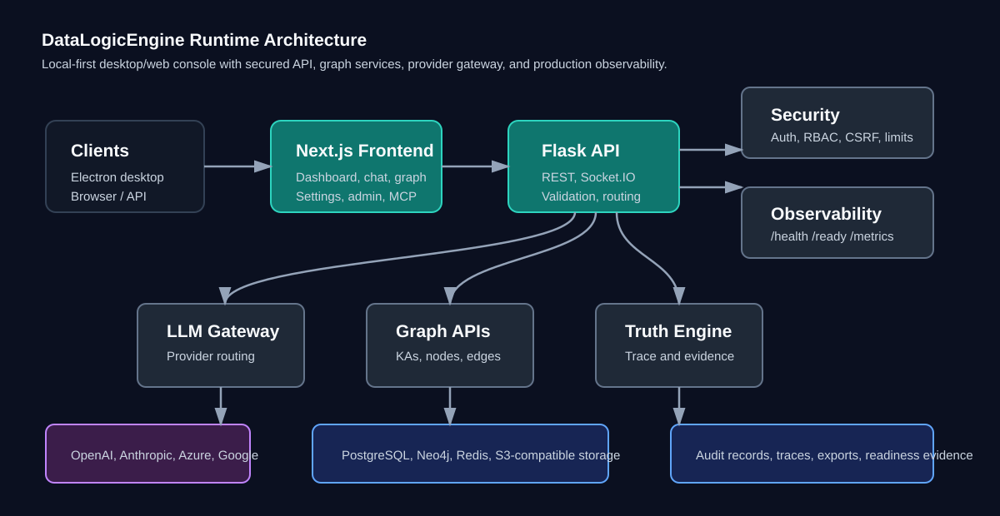
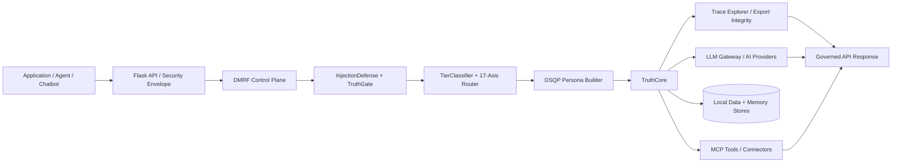

# DataLogicEngine

> **Licensed local-first Windows AI gateway and governed reasoning runtime for applications, agents, chatbots, and enterprise knowledge workflows.**

[](https://github.com/kherrera6219/DataLogicEngine/actions/workflows/ci.yml)
[](https://github.com/kherrera6219/DataLogicEngine/actions/workflows/security.yml)
[](https://github.com/kherrera6219/DataLogicEngine/actions/workflows/deploy.yml)
[](requirements.txt)
[](frontend/package.json)
[](LICENSE)

DataLogicEngine sits between your application and AI providers as an **API-in/API-out governed AI control plane**. It is designed to run on a user's own Windows machine or a user-controlled Windows VM, using the user's own provider accounts, API keys, data stores, retention policies, and operating environment.

It is **not** intended to be a conventional vendor-hosted multi-tenant SaaS where the project owner centrally hosts customer data or manages customer API spend.

```text
Application / Agent / Chatbot
        ↓ API request
DataLogicEngine
        ↓ DMRF + Truth Engine + DSQP + Trace + Policy
AI Providers / MCP Tools / Local Knowledge Stores
        ↓ governed response
Application / Agent / Chatbot
```

---

## What it is

DataLogicEngine combines:

| Capability | Purpose |
|---|---|
| **Local-first Windows runtime** | Run on a workstation or user-controlled Windows VM. |
| **API gateway mode** | Accept requests from applications, agents, or chatbots and return governed responses. |
| **BYOK provider model** | Users bring their own OpenAI/Anthropic/Gemini/Azure/local provider keys and own their API spend. |
| **DMRF control plane** | Injection defense, tiering, routing, evidence, convergence, memory, and trace hooks. |
| **Truth Engine** | TruthGate, TruthCore, TruthMemory, and TruthLink for policy, reasoning, memory, and events. |
| **17-axis routing** | Structured coordinate/risk/context routing for knowledge workflows. |
| **DSQP personas** | Deterministic structured persona construction for Knowledge, Sector, Regulatory, and Compliance expert perspectives. |
| **Trace Explorer** | Runs, stages, evidence, claims, personas, hashes, manifests, and export review. |
| **MCP governance** | Connector scope enforcement, contract validation, telemetry, and audit path. |
| **Multi-store memory** | SQLAlchemy DB, Redis, Neo4j, ChromaDB, object storage, USKD, UnifiedMemory, and TruthMemory. |

---

## Why it matters

Most AI applications connect directly to a model provider.

DataLogicEngine adds a governed middle layer:

```text
Before
App → AI Provider

After
App → DataLogicEngine → Policy / Routing / Evidence / Memory / Trace → AI Provider or Tool
```

That gives builders and operators a place to manage:

- prompt-injection and policy gates;
- provider and model routing;
- reasoning traceability;
- evidence and claim review;
- tool/connector scope enforcement;
- local data and memory ownership;
- export integrity and audit evidence;
- release and documentation governance.

---

## Deployment model

| Mode | Description | Default data posture |
|---|---|---|
| **Windows desktop** | Electron + local Flask backend on the user's Windows machine. | Data remains in local app-owned stores unless the user sends selected context to configured providers/tools. |
| **Windows VM gateway** | Same stack running on a user-controlled Windows VM as API-in/API-out middleware. | Data remains inside the operator-controlled VM environment. |
| **Controlled web/cloud** | Explicitly configured hosted/internal deployment. | Operator-defined; not the default managed SaaS model. |

### Responsibility model

| Responsibility | Intended owner |
|---|---|
| Software license | DataLogicEngine vendor/project owner |
| Installation target | User/customer/operator |
| Provider accounts and API keys | User/customer/operator |
| Provider API spend | User/customer/operator |
| Local documents, traces, memory, exports | User/customer/operator environment |
| Backups and retention | User/customer/operator |
| Connector credentials and external service permissions | User/customer/operator |
| Central hosting of customer data | Not the default model |
| Central management of customer API bills | Not the default model |

---

## Architecture





### Runtime components

| Layer | Components |
|---|---|
| Product surface | Next.js, React, Electron, dashboard, chat, trace explorer, graph, settings, admin, MCP hub. |
| Backend/API | Flask, route modules, canonical `/api/v1/*`, auth/session/security envelope. |
| AI control plane | DMRF, InjectionDefense, TruthGate, TierClassifier, 17-axis router, DSQP, TruthCore. |
| Integrations | LLM Gateway, provider adapters, MCP server/connectors. |
| Data and memory | SQLAlchemy DB, Redis, Neo4j, ChromaDB, object store, USKD graph, UnifiedMemory, TruthMemory. |
| Evidence/release | Run traces, export manifests, hashes/HMAC, CI, tests, packaging smoke, release checklist. |

---

## Quickstart

Run the local development stack with Docker:

```bash
git clone https://github.com/kherrera6219/DataLogicEngine.git
cd DataLogicEngine
cp .env.template .env
docker compose up --build
```

Open:

| Service | URL |
|---|---|
| Web console | `http://localhost:3000` |
| Backend API | `http://localhost:5000` |
| Health probe | `http://localhost:5000/health` |
| Metrics | `http://localhost:5000/metrics` |
| Swagger UI | `http://localhost:5000/api/docs` |

Minimal health check:

```bash
curl http://localhost:5000/health
```

---

## Local development

### Prerequisites

| Tool | Version | Purpose |
|---|---|---|
| Python | 3.11+ | Backend runtime and tests. |
| Node.js | 24+ | Frontend and Electron tooling. |
| Docker | Current stable | Local full-stack development. |
| PostgreSQL | 15+ | Relational store where configured. |
| Redis | 7+ | Cache, sessions, rate limiting, async support where configured. |
| Neo4j | 5+ | Graph storage where configured. |

### Backend

```bash
python -m venv .venv
.venv\Scripts\activate
python -m pip install --upgrade pip
pip install -r requirements.txt
copy .env.template .env
python app.py
```

macOS/Linux activation alternative:

```bash
source .venv/bin/activate
cp .env.template .env
python app.py
```

### Frontend

```bash
cd frontend
npm ci
npm run dev
```

---

## Validation

Common governance checks:

```bash
python scripts/verify_docs_references.py
python scripts/verify_environment_parity.py --strict
python scripts/verify_lockfiles.py
python scripts/runtime_precheck.py --strict --skip-ports --allow-env-from-process
```

Backend tests:

```bash
python -m pytest tests --maxfail=20
```

Frontend checks:

```bash
cd frontend
npm run lint
npm run typecheck
npm test
```

Windows packaging checks:

```powershell
powershell -NoProfile -ExecutionPolicy Bypass -File .\scripts\windows\verify_nsis_governance.ps1 -RepoRoot (Get-Location).Path
powershell -NoProfile -ExecutionPolicy Bypass -File .\scripts\windows\run_packaging_smoke.ps1 -RepoRoot (Get-Location).Path
```

---

## Reviewer path

Start here if you are evaluating the project for employment, sponsorship, contest judging, architecture review, or acquisition-style due diligence:

1. [`docs/PRODUCT_OVERVIEW.md`](docs/PRODUCT_OVERVIEW.md)
2. [`docs/README.md`](docs/README.md)
3. [`docs/ARCHITECTURE.md`](docs/ARCHITECTURE.md)
4. [`docs/ARCHITECTURE_MAP.md`](docs/ARCHITECTURE_MAP.md)
5. [`docs/WORKFLOW.md`](docs/WORKFLOW.md)
6. [`docs/DATA_FLOW_DIAGRAMS.md`](docs/DATA_FLOW_DIAGRAMS.md)
7. [`docs/DECISION_LOGIC.md`](docs/DECISION_LOGIC.md)
8. [`docs/PROCESS_MAP.md`](docs/PROCESS_MAP.md)
9. [`docs/SEQUENCE_DIAGRAMS.md`](docs/SEQUENCE_DIAGRAMS.md)
10. [`docs/PRODUCTION_READINESS.md`](docs/PRODUCTION_READINESS.md)

High-value implementation paths:

| Area | Path |
|---|---|
| DMRF | `backend/dmrf/` |
| Truth Engine | `backend/truth_engine/` |
| DSQP | `backend/dsqp/` |
| MCP | `backend/mcp_server/` |
| API/security | `app.py`, `routes/`, `backend/security/`, `backend/auth/` |
| Frontend product surface | `frontend/app/`, `frontend/components/` |
| Tests | `tests/` |
| CI/release | `.github/workflows/`, `scripts/` |

---

## Documentation

The active documentation portal is [`docs/README.md`](docs/README.md).

Historical material under `docs/archive/` is reference-only. Active source-of-truth documents under `docs/` govern implementation and release decisions.

Generated inventory files should be refreshed with:

```bash
python scripts/generate_docs.py
```

---

## Security and privacy

Report vulnerabilities privately. See [`SECURITY.md`](SECURITY.md).

Security and privacy details:

- [`docs/SECURITY.md`](docs/SECURITY.md)
- [`docs/PRIVACY_POLICY.md`](docs/PRIVACY_POLICY.md)
- [`docs/SSL_CONFIGURATION.md`](docs/SSL_CONFIGURATION.md)
- [`docs/SLSA_LEVEL_3_ATTESTATION.md`](docs/SLSA_LEVEL_3_ATTESTATION.md)
- [`docs/RELEASE_CHECKLIST.md`](docs/RELEASE_CHECKLIST.md)

Security/compliance mapping documents are evidence-guided references. They should not be treated as formal certification claims unless a separate signed/validated attestation is provided.

---

## Current release posture

Known release caveats are tracked in:

- [`docs/PRODUCTION_READINESS.md`](docs/PRODUCTION_READINESS.md)
- [`docs/RELEASE_CHECKLIST.md`](docs/RELEASE_CHECKLIST.md)
- [`TODO.md`](TODO.md)

Current caveats may include trusted production code-signing, signed installer validation, provider-backed staging validation, external connector validation, manual accessibility evidence, and final release approval evidence.

---

## License

This project is licensed under the PolyForm Noncommercial License. See [`LICENSE`](LICENSE).
