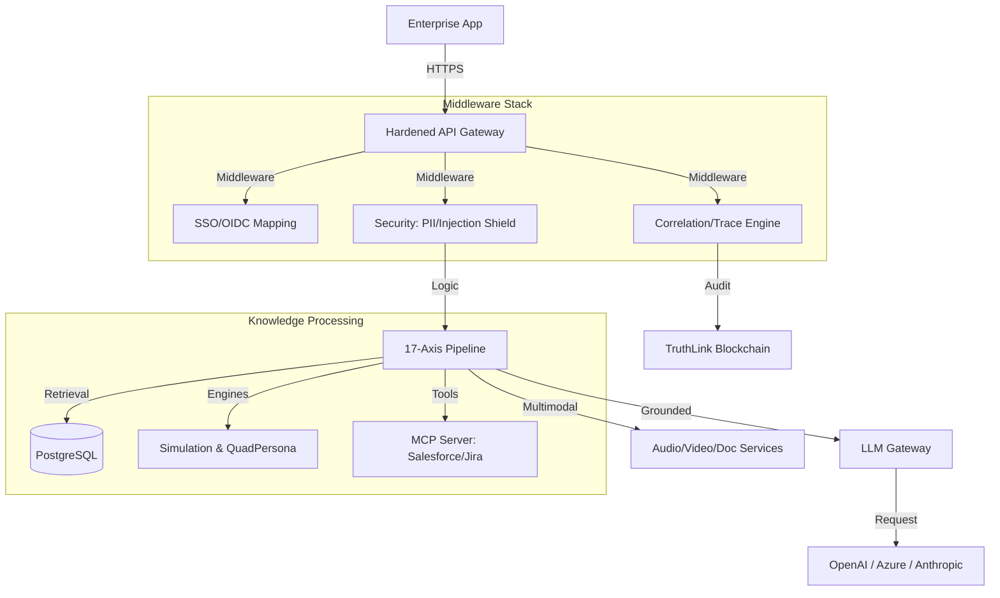

# Universal Knowledge Graph (UKG) system architecture

## Purpose

Define the logical and runtime architecture of DataLogicEngine for engineering, security, and operations stakeholders.

## Audience

1. Platform engineers
2. Security engineers
3. SRE/operations
4. Technical architects

## Document control

1. Owner: Platform Architecture
2. Last updated: 2026-03-17
3. Status: Active
4. Review cadence: Every 60 days

## Related documents

1. `docs/API.md`
2. `docs/SECURITY.md`
3. `docs/DEPLOYMENT.md`
4. `docs/PRODUCTION_READINESS.md`
5. `docs/ARCHITECTURE_MAP.md`

## Overview

The Universal Knowledge Graph (UKG) System employs a **hardened middleware architecture** designed for high-availability, consistent reasoning, and enterprise-grade security.

### 2026-03-24 Architecture Hardening Delta

This architecture baseline includes the following newly enforced controls:

1. **Gateway object-level authorization**
   - Session message retrieval now enforces ownership against authenticated identity.
2. **Fail-closed frontend edge**
   - Next.js proxy middleware now fails with service-unavailable on middleware exceptions.
3. **RAG safety/reliability controls**
   - Production no longer silently accepts synthetic/mock embeddings during provider outages.
   - Retrieval context filtering now excludes suspicious prompt-injection style chunks and low-score chunks.
4. **Replay defense resilience**
   - Request signing nonce state supports Redis-backed persistence for multi-worker deployments.
5. **Upload trust boundary hardening**
   - Upload pipeline validates binary signatures against declared MIME type.

- **Frontend**: Next.js 16.1 App Router (React 18.3)
  - _Role_: User Interface, Visualization, State Management, Real-time Updates
- **Backend**: Flask 3.1 (Python 3.11+)
  - _Role_: API Gateway, Knowledge Engine, MCP Server, LLM Gateway, Truth Engine
- **Database**: PostgreSQL 15+ with SQLAlchemy 2.0
  - _Role_: Persistent storage for 40+ tables including users, knowledge graph, traces, audit logs
- **Cache/Queue**: Redis 5+
  - _Role_: Caching, rate limiting, session storage (hardened), Celery task queue
- **Security Layer**: Enterprise Managers
  - _RBACManager_: Granular permission enforcement
  - _EncryptionManager_: Field-level AES-256 protection
  - _MFAManager_: TOTP-based identity verification

---

## High-level component map



---

## Enterprise hardening features

Built with a modern stack including **Next.js 16.1**, **React 18.3**, and **Flask 3.1**, the system implements multiple layers of enterprise security and resilience.

### 1. Resilience: Circuit Breaker & Failover

The `LLM Gateway` implements a **Circuit Breaker** pattern. If a provider (e.g., OpenAI) returns sequential errors, the circuit opens, and the gateway automatically reroutes traffic to the next highest priority provider (e.g., Anthropic).

- **Recovery**: Circuits enter "Half-Open" state after a timeout to test provider health.
- **Failover**: Sequential provider attempt logic ensures near 100% availability for reasoning tasks.

### 2. Multi-Tenancy: Data Isolation

Data isolation is enforced at the core database manager level. Every request carries a `tenant_id` context (mapped from SSO claims).

- **Isolation**: SQL queries are automatically filtered by `tenant_id`.
- **Graph Safety**: Graph traversals are scoped to the requesting tenant's nodes and edges.

### 3. Observability: End-to-End Tracing

Using a unified **Correlation ID**, the system links the initial HTTP request to the deep Knowledge Algorithm execution steps in the UKG SDK.

- **Audit Chain**: Every execution culminates in a hash-chained audit record.
- **Trace Explorer**: Admins can view the full reasoning path, including which evidence was used for which claim.

```typescript
rewrites: async () => [
  {
    source: '/api/:path*',
    destination: 'http://localhost:5000/api/:path*',
  },
],
```

This enables:

- Seamless API communication without CORS issues
- Session cookie sharing
- Simplified deployment architecture

---

## 🧠 17-Axis Knowledge Framework

A robust **Flask 3.1** application serving as the central nervous system, deployed with **Gunicorn** (4 workers, 2 threads each).

1.  **Sectors**: Vertical industry (Healthcare, Finance, etc.)
2.  **Domains**: Technical areas (Compliance, Security, etc.)
3.  **Tiers**: Priority and complexity scoring.
4.  **Layers**: Reasoning depth (L1 Hygiene to L10 Completion).
5.  **Coordinates**: A compact 17-part vector representing the precise context of a query.

This coordinate system allows the engine to retrieve exactly the right "slice" of knowledge for any query, significantly outperforming traditional RAG.

---

## 🧪 Deployment Patterns

- **Edge Deployment**: Next.js frontend deployed to Vercel/Cloudflare.
- **Engine Cluster**: Flask backend deployed to Kubernetes with HPA.
- **Data Persistence**: Managed RDS (PostgreSQL) and Managed Redis.

---

## 🖥️ Desktop & Local-First Architecture (Windows 11)

In v2.4.0, the system introduced first-class support for **Local-First** desktop execution on Windows 11.

### 1. Multi-Mode Execution Layer
The system can operate in two primary modes defined by environment variables:
- **Local-Only**: Uses local instances of PostgreSQL and Redis. Data residency is strictly on the local machine.
- **Cloud-Hybrid**: Connects to existing cloud-hosted databases while maintaining local application state.

### 2. Service Orchestration (Windows)
For local Windows bring-up, the supported workflow uses `scripts/windows/start_local_stack.ps1` and `scripts/windows/stop_local_stack.ps1`.
- **Backend Runtime**: Flask backend on `127.0.0.1:5000` (SQLite fallback supported).
- **Frontend Runtime**: Next.js on `127.0.0.1:3000`.
- **Optional Service Wrapper**: WinSW XML definitions (`DataLogic_Backend.xml`, `DataLogic_Frontend.xml`) are retained for service-based deployments.

### 3. Native Identity & Security
- **Identity Integrity**: Validated user recognition via Windows Security Identifier (SID) with standard format enforcement, ensuring that local data residency is tied to a verified profile.
- **DPAPI Secret Storage**: Sensitive LLM API keys are encrypted using the **Windows Data Protection API (DPAPI)** with externalizable entropy (UKG_DPAPI_ENTROPY), ensuring secrets are tied strictly to the user and machine.

### 4. Local Data Paths
The application respects Windows standards for data residency:
- **Data Directory**: `C:\ProgramData\DataLogicEngine` (Configurable via `UKG_DATA_DIR`).
- **Log Residency**: All service logs are stored in the local data directory under `/logs`.

### 5. Distributable Packaging (Setup.exe)
The current default installer path is **Electron Builder (NSIS)** (`frontend/build_installer.ps1`).
- **Primary Build**: Packages desktop artifacts via `electron-builder`.
- **Windows Script Integration**: Uses modular PowerShell scripts for setup/diagnostics.
- **Optional WiX/WinSW Path**: WiX manifests remain available under `deploy/windows/` for service-based packaging workflows.
- **WiX Asset Prep**: Run `scripts/windows/prepare_wix_assets.ps1` before WiX packaging to fetch required WinSW assets.

---

## 🧠 Unified Knowledge Algorithm (KA) Infrastructure


The system employs a unified infrastructure for managing and executing **Knowledge Algorithms (KAs)**. These algorithms (KA-001 to KA-116, L9-KA-001 to 007) are implemented as modern Python modules that inherit from a standard base class and register themselves via a central registry.

- **KAMasterController**: Discovered and managed from `knowledge_algorithms/`, this controller orchestrates KA discovery, performance tracing, and resilient execution.
- **Enterprise Base Class**: All 123 algorithms (KA-001 to L9-KA-007) inherit from a hardened base class with Pydantic validation and `_fallback_logic` hooks.
- **Resilient Execution**: Multi-tier error handling with structured error codes (E400-E500) and graceful degradation support.
- **Registry System**: Unified discoverability via `knowledge_algorithms/ka_registry.yaml`.

#### 1. LLM Gateway (`backend/llm_gateway/`)

**Purpose**: Universal adapter for multiple LLM providers with UKG context injection

- **Providers Supported**: OpenAI, Azure OpenAI, Anthropic, Google Vertex AI
- **Features**:
  - Encrypted API key storage (Fernet)
  - Automatic provider failover
  - Circuit breaker pattern
  - Rate limiting (RPM/TPM)
  - Request/response streaming
  - Usage tracking and analytics

**Key Files**:

- `api.py` - REST endpoints (`/api/v1/gateway/chat`, `/api/v1/gateway/stream`)
- `gateway.py` - Core routing logic
- `providers.py` - Provider adapters
- `models.py` - LLMProvider, LLMProviderUsage database models

#### 2. Truth Engine (`backend/truth_engine/`)

**Purpose**: 5-tier reasoning framework with compliance and audit trails

**Processing Layers (L1-L10)**:

1. **L1: Context Initialization** - Parses query into `Coord17Intent`, resolves coordinates, and sets guardrails.
2. **L2: USKD Materialization** - Materializes a bounded subgraph (the "mini-world") from the UKG into working memory.
3. **L3: Controlled Expansion** - Agentic enrichment layer that fills knowledge gaps using specialized KAs.
4. **L4: POV Overlays** - Adds stakeholder constraints and interpretive weighting without factual mutation.
5. **L5: Quad Persona Projections** - Parallel multi-persona debate with conflict detection and synthesis.
6. **L6: Validation & Scoring** - High-fidelity confidence weighting and risk driver mapping.
7. **L7: Scenario Simulation** - Nested forks (Baseline/Stress/Optimistic) to test outcome robustness.
8. **L8: Consistency Verification** - Cross-checks claims against constraints with recursive refinement triggers.
9. **L9: Strategic Alignment** - Aligns the validated state with enterprise strategy and roadmaps.
10. **L10: Final Emergence & Safety Gate** - The final release authority. Dual-lane architecture: **Lane A (Response Gate)** for real-time safety/emergence audit; **Lane B (Knowledge Commit)** for authorized persistence of new learning into long-term memory.

**Components**:

- `truth_core/` - Core reasoning logic
- `truth_gate/` - Policy enforcement and access control
- `truth_link/` - Evidence linking and citation
- `truth_memory/` - Structured memory management
- `api.py` - Session management endpoints

**Features**:

- Budget tracking (token/cost limits)
- Immutable audit trail with hash chains (EU AI Act Article 53 compliant)
- Confidence and safety scoring
- Persona-based reasoning
- Workflow step tracking

#### 4. MCP Server (`backend/mcp_server/`)

**Purpose**: Model Context Protocol implementation for LLM agent integration

**Components**:

- `router.py` - MCP JSON-RPC router (25 KB)
- `registry.py` - Decorator-based tool registry
- `tools/` - Salesforce, Jira, and KA tool implementations

**Exposes**:

- **Resources**: Knowledge graph stats, pillars, algorithms
- **Tools**: 116 Knowledge Algorithms + CRM/Jira connectors
- **Prompts**: Expert persona templates, regulatory analysis templates

#### 5. Multimodal Services (`backend/services/`)

**Purpose**: High-fidelity media processing services

- `document_processor.py`: PDF/OCR/Docx extraction
- `audio_service.py`: Real-time STT (Whisper) and TTS synthesis
- `video_service.py`: Keyframe extraction and Vision LLM (GPT-4o) analysis

**Database Models**:

- `MCPServer` - Server configurations
- `MCPResource` - Resource definitions
- `MCPTool` - Tool specifications
- `MCPPrompt` - Prompt templates

#### 5. Authentication & Authorization (`backend/auth/`)

**Purpose**: Enterprise-grade authentication and access control

**Authentication Methods**:

- Session-based (Flask-Login)
- SSO/OIDC (Azure AD via Authlib)
- API Keys with encryption
- OAuth (Replit, etc.)
- JWT tokens

**Security Features**:

- Password policy (min 12 chars, complexity)
- Password history tracking
- 2FA support (TOTP via PyOTP)
- API key rate limiting
- Session timeout

**Database Models**:

- `User` - Core users with tenant_id
- `APIKey` - API credentials
- `OAuthAccount` - OAuth linkages
- `PasswordHistory` - Audit trail

#### 6. Security & Audit (`backend/security/`)

**Purpose**: Enterprise security hardening and compliance

**Features**:

- Security headers (CSP, HSTS, X-Frame-Options)
- SIEM audit logging (Syslog, CSV export)
- API request auditing
- Compliance reporting (SOC2, GDPR, HIPAA)

**Audit Logger**:

- Records all API requests
- User action tracking
- Export to SIEM systems
- Configurable retention policies

#### 7. Middleware (`backend/middleware/`)

**Purpose**: Cross-cutting concerns for all requests

- `correlation_id.py` - Distributed tracing (X-Request-ID)
- `request_limits.py` - Max content length enforcement
- `timeout.py` - Request timeout handling
- `security_headers.py` - HTTP security headers

### Data Storage

#### PostgreSQL (40+ Tables)

Organized by domain:

1. **User & Access Control**

   - users, api_keys, oauth_accounts, password_history

2. **Knowledge Graph**

   - kg_nodes, kg_edges (legacy)
   - ukg_nodes, ukg_edges (modern with tenant isolation)

3. **Chat & Sessions**

   - chats, messages, ukg_sessions, memory_entries

4. **Tracing**

   - trace_runs, trace_stages, trace_evidence, trace_claims, etc.

5. **Truth Engine**

   - truth_sessions, truth_audit_events, truth_artifacts, truth_budgets

6. **MCP**

   - mcp_servers, mcp_resources, mcp_tools, mcp_prompts

7. **LLM Gateway**

   - llm_providers, llm_provider_usage, external_api_keys

8. **Compliance**

   - audit_logs, compliance_events, policy_records

9. **Simulations**

   - simulation_sessions, simulation_steps, simulation_outcomes

10. **Knowledge Algorithms**
    - knowledge_algorithms, ka_executions

**Key Features**:

- All tables have `tenant_id` for multi-tenancy
- UTC timestamps (created_at, updated_at)
- Foreign key relationships with cascading
- Indexes on frequently queried columns
- JSON columns for flexible attributes

#### Redis

- **Caching**: Knowledge graph query results
- **Rate Limiting**: Flask-Limiter backend
- **Session Storage**: User sessions
- **Celery Broker**: Task queue messages

---

## 3. 17-Axis Knowledge Framework (`core/axes/`)

The data model organizes information across 17 dimensions for multi-dimensional knowledge contextualization:

### The 17 Axes

1. **Axis 1 - Pillar**: Top-level knowledge domain (FAR, DFARS, CFR)
2. **Axis 2 - Sector**: Industry sectors and market areas (NAICS, SIC)
3. **Axis 3 - Honeycomb**: Cross-domain semantic bridges and intra-expansion
4. **Axis 4 - Branch**: Knowledge sub-hierarchies and Methods
5. **Axis 5 - Node**: Atomic knowledge nodes and specific Tools
6. **Axis 6 - Octopus**: Regulatory hub (one-to-many authority mapping)
7. **Axis 7 - Spiderweb**: Compliance mesh (many-to-many framework overlap)
8. **Axis 8 - Knowledge Expert**: SME persona (theoretical/technical)
9. **Axis 9 - Sector Expert**: Practitioner persona (industry implementation)
10. **Axis 10 - Regulatory Expert**: Regulatory strategist persona (octopus-driven)
11. **Axis 11 - Compliance Expert**: Compliance/audit persona (spiderweb-driven)
12. **Axis 12 - Location**: Geospatial context (country, region, jurisdiction) with hierarchical parent-child relationships and proximity-based retrieval.
13. **Axis 13 - Temporal**: Time context (effective date, version, validity)
14. **Axis 14 - Risk & Confidence**: Probability vectors and trust scores
15. **Axis 15 - Federated Intelligence**: Federated knowledge sharing and distributed state
16. **Axis 16 - Arrows of Time**: Causality chains and temporal vectors
17. **Axis 17 - Observability**: Audit trails and performance markers

### Implementation

Each axis is implemented as a comprehensive module (30+ KB each) in `core/axes/`:

- `axis_system.py` - Framework orchestrator
- `axis1_identity.py` - Identity context resolver
- `axis2_sector.py` - Sector specialization mapping
- `axis3_domain.py` - Domain expertise mapping
- `axis6_regulatory.py` - Regulatory framework resolver
- `axis7_compliance.py` - Compliance obligation mapping
- `axis12_location.py` - Geolocation resolver and hierarchy manager
- `axis13_time.py` - Temporal context resolver
- `axis17_observability.py` - Tracing and metrics

### Usage

When a query is processed:

1. Query is parsed and mapped to relevant axes
2. Each axis contributes contextual dimensions
3. Knowledge retrieval is filtered by axis coordinates
4. Results are contextualized based on axis intersection
5. This ensures domain-specific, compliant, and accurate responses

**Example**:

- Query: "What are AI compliance requirements in healthcare?"
- Axis 2 (Sector): Healthcare
- Axis 3 (Domain): AI
- Axis 6 (Regulatory): HIPAA, FDA
- Axis 7 (Compliance): Healthcare AI regulations
- Result: Targeted retrieval of healthcare AI compliance knowledge

---

## 4. Routes & API Structure (`/routes`)

All API routes return standardized JSON responses:

```json
{
  "success": true,
  "data": {},
  "error": null,
  "timestamp": "2026-01-09T00:00:00Z"
}
```

### Route Blueprints

1. **auth_routes.py** - Authentication endpoints

   - `POST /api/v1/auth/login` - Username/password login
   - `POST /api/v1/auth/register` - User registration
   - `GET /api/v1/auth/login/sso` - SSO/OIDC login
   - `POST /api/v1/auth/logout` - Logout
   - `GET /api/v1/auth/check` - Session status

2. **admin_routes.py** - Admin operations (admin only)

   - `GET /api/v1/admin/users` - List users
   - `POST /api/v1/admin/users/:id/promote` - Promote to admin
   - `GET /api/v1/admin/providers` - List LLM providers
   - `POST /api/v1/admin/providers` - Add provider

3. **knowledge_routes.py** - Knowledge graph operations

   - `GET /api/v1/knowledge/nodes` - List nodes
   - `POST /api/v1/knowledge/nodes` - Create node
   - `GET /api/v1/knowledge/edges` - List edges
   - `POST /api/v1/knowledge/edges` - Create edge
   - `GET /api/v1/knowledge/query` - Query graph

4. **mcp_routes.py** - MCP operations (18 KB)

   - `GET /api/v1/mcp/servers` - List MCP servers
   - `POST /api/v1/mcp/servers` - Create server
   - `POST /api/v1/mcp/servers/:id/initialize` - Initialize server
   - `GET /api/v1/mcp/tools` - List tools
   - `POST /api/v1/mcp/tools/:id/call` - Execute tool

5. **ka_routes.py** - Knowledge Algorithm routes (19 KB)

   - `GET /api/v1/ka/algorithms` - List algorithms
   - `GET /api/v1/ka/algorithms/:id` - Get algorithm details
   - `POST /api/v1/ka/execute` - Execute algorithm

6. **compliance_routes.py** - Compliance operations (9 KB)

   - `GET /api/v1/compliance/audit-logs` - Get audit logs
   - `GET /api/v1/compliance/standards` - List compliance standards
   - `GET /api/v1/compliance/audit/export` - Export audit logs (CSV/JSON)

7. **simulation_routes.py** - Simulation operations
   - `POST /api/v1/simulation/start` - Start simulation
   - `GET /api/v1/simulation/:id` - Get simulation results
   - `POST /api/v1/simulation/:id/step` - Execute next step

---

## 5. Enterprise Features

### Multi-Tenancy Architecture

**Tenant Isolation**:

- All 40+ database tables include `tenant_id` column
- Automatic filtering via SQLAlchemy query filters
- User tenant derived from SSO token or user.tenant_id
- Request context stores `g.tenant_id` for all operations

**Data Isolation**:

- Knowledge graph nodes/edges isolated per tenant
- Chat sessions and messages isolated
- Trace runs isolated
- Audit logs isolated
- API keys scoped to tenant

**Benefits**:

- GDPR Article 5 data minimization compliance
- SOC2 logical isolation requirement
- Prevents cross-tenant data leakage
- Supports SaaS deployment model

### Security Architecture

**Layers of Security**:

1. **Network**: HTTPS enforcement, TLS 1.3
2. **Application**:
   - CSRF protection (Flask-WTF)
   - XSS prevention (CSP headers)
   - SQL injection prevention (SQLAlchemy parameterized queries)
   - Input validation (Marshmallow, Pydantic)
3. **Authentication**: Multiple methods (session, SSO, API keys, OAuth)
4. **Authorization**: Role-based access control (RBAC)
5. **Data**: Encryption at rest (database), encryption in transit (TLS)
6. **API Keys**: Fernet encryption for stored keys

**Security Headers**:

- Content-Security-Policy (CSP)
- HTTP Strict Transport Security (HSTS)
- X-Frame-Options: DENY
- X-Content-Type-Options: nosniff
- Referrer-Policy: strict-origin-when-cross-origin
- SameSite cookies: Strict

### Compliance & Audit

**Compliance Standards**:

- **EU AI Act**: Article 53 audit trail with hash chains
- **SOC2**: Evidence collection, audit logging, encryption
- **GDPR**: Data minimization, right to be forgotten, consent management
- **HIPAA**: Audit trails, encryption, access controls

**Audit Trail**:

- Every API request logged (user, endpoint, status, timestamp)
- Truth Engine immutable audit events with hash chain
- Trace runs capture full execution path
- SIEM integration via Syslog
- Export to CSV/JSON for compliance reporting

### High Availability & Reliability

**Connection Pooling**:

- PostgreSQL: pool_size=20, max_overflow=30
- Redis: Connection pooling enabled

**Circuit Breakers**:

- LLM Gateway implements circuit breaker pattern
- Prevents cascade failures
- Automatic recovery

**Failover**:

- Multiple LLM providers with automatic failover
- Health checks for all services
- Graceful degradation (falls back to standard LLM if UKG unavailable)

**Monitoring**:

- Sentry error tracking
- Distributed tracing (correlation IDs)
- Health endpoint (`/health`) for load balancers
- Performance metrics (trace timing, LLM usage)

### Scalability

**Horizontal Scaling**:

- Stateless backend (Gunicorn workers)
- Session storage in Redis (shared state)
- Database connection pooling

**Asynchronous Processing**:

- Celery for background tasks
- Redis as task queue broker
- Long-running operations offloaded

**Caching**:

- Redis caching for knowledge graph queries
- SWR caching on frontend
- HTTP caching headers

**Rate Limiting**:

- Per-user limits
- Per-API-key limits
- Per-endpoint limits
- Redis-backed for distributed rate limiting

---

## 6. Deployment Architecture

### Local Development

**Terminal 1 - Backend**:

```bash
python -m venv .venv
source .venv/bin/activate
pip install -r requirements.txt
flask db upgrade
python backend/seed_data.py
python main.py  # Runs on :5000
```

**Terminal 2 - Frontend**:

```bash
cd frontend
npm install
npm run dev  # Runs on :3000
```

### Docker Compose

```yaml
services:
  backend:
    build: .
    ports: ["5000:5000"]
    environment:
      - DATABASE_URL=postgresql://postgres:postgres@db:5432/ukg_db
      - REDIS_URL=redis://redis:6379/0
      - NEO4J_URI=bolt://neo4j:7687
      - OBJECT_ENDPOINT_URL=http://minio:9000
    depends_on: [db, redis, neo4j, minio]
    command: gunicorn -w 4 -b 0.0.0.0:5000 app:app

  frontend:
    build: ./frontend
    ports: ["3000:3000"]
    environment:
      - NEXT_PUBLIC_API_URL=http://localhost:5000/api/v1
    depends_on: [backend]

  db:
    image: postgres:15-alpine
    volumes: ["postgres_data:/var/lib/postgresql/data"]

  redis:
    image: redis:7-alpine

  neo4j:
    image: neo4j:5
    ports: ["7687:7687", "7474:7474"]
    environment:
      - NEO4J_AUTH=neo4j/neo4jpassword

  minio:
    image: minio/minio
    ports: ["9000:9000", "9001:9001"]
    environment:
      - MINIO_ROOT_USER=minioadmin
      - MINIO_ROOT_PASSWORD=minioadmin123
    command: server /data --console-address ":9001"
```

### Kubernetes (Production)

**Components**:

- Backend Deployment (4 replicas)
- Frontend Deployment (2 replicas)
- PostgreSQL StatefulSet
- Redis Deployment
- Ingress for routing
- ConfigMaps for configuration
- Secrets for credentials

**Features**:

- Auto-scaling based on CPU/memory
- Rolling updates
- Health checks
- Persistent volumes for PostgreSQL
- Load balancing

### Cloud Platforms

**Azure**:

- Azure App Service (Backend)
- Azure Static Web Apps (Frontend)
- Azure Database for PostgreSQL
- Azure Redis Cache
- Azure Container Registry

**AWS**:

- ECS/EKS for containers
- RDS for PostgreSQL
- ElastiCache for Redis
- CloudFront for frontend
- Application Load Balancer

---

## 7. Data Flow Architecture

### Chat Request Flow

```
1. User sends message via frontend
   ↓
2. Frontend → /api/v1/gateway/chat
   ↓
3. API Gateway authenticates & validates
   ↓
4. Routes to LLM Gateway
   ↓
5. LLM Gateway:
   a. Resolves query to 17-Axis coordinates
   b. Retrieves knowledge from graph
   c. Runs simulations if needed
   d. Injects MCP tools for agents
   e. Calls LLM provider (OpenAI/Anthropic/etc.)
   f. Applies circuit breakers & fallbacks
   ↓
6. Response flows back through:
   a. Truth Engine (validation, scoring)
   b. Tracing system (audit trail creation)
   c. Compliance checks
   ↓
7. Response + Trace ID returned to frontend
   ↓
8. Frontend displays answer with audit link
   ↓
9. All steps logged to audit trail
```

### Trace Storage Flow

```
1. TraceRun created (UUID)
   ↓
2. Each execution stage:
   a. TraceStage recorded (timing, status)
   b. Evidence collected → TraceEvidence
   c. Claims extracted → TraceClaim
   d. Persona usage → TracePersona
   e. KA invocations → TraceKAInvocation
   f. Policy decisions → TracePolicyDecision
   ↓
3. Final scores calculated:
   - Confidence
   - Entropy
   - Bias risk
   ↓
4. Trace marked complete
   ↓
5. Available via /api/v1/trace/runs/:id
```

### Multi-Tenant Request Flow

```
1. Request arrives with auth
   ↓
2. User authenticated (session/SSO/API key)
   ↓
3. Tenant ID extracted:
   - From user.tenant_id
   - From SSO token ('tid' claim)
   - From API key tenant association
   ↓
4. tenant_id stored in g.tenant_id
   ↓
5. All database queries automatically filter:
   WHERE tenant_id = {current_tenant}
   ↓
6. Response contains only tenant's data
   ↓
7. Audit log records tenant context
```

---

## 8. Performance Considerations

### Database Optimization

- Indexes on tenant_id, user_id, status, created_at
- Connection pooling (pool_size=20, max_overflow=30)
- Query optimization with SQLAlchemy eager loading
- JSON columns for flexible attributes

### Caching Strategy

- Redis caching for knowledge graph queries
- SWR caching on frontend (stale-while-revalidate)
- HTTP caching headers for static assets
- Session caching in Redis

### API Performance

- Rate limiting to prevent abuse
- Request timeout enforcement (120s default)
- Compression (gzip) enabled
- Streaming responses for long operations

### LLM Gateway Optimization

- Provider response caching
- Circuit breakers to fail fast
- Automatic provider fallback
- Token usage tracking and limits

---

## 9. Technology Summary

| Layer | Technology | Version |
|-------|-----------|---------|
| Frontend Framework | Next.js | 16.1 |
| UI Library | React | 18.3 |
| Frontend Language | TypeScript | 5 |
| Styling | Tailwind CSS | 4 |
| Desktop Shell | Electron | 40 |
| Backend Framework | Flask | 3.1.2 |
| Backend Language | Python | 3.11+ |
| ORM | SQLAlchemy | 2.0 |
| Database | PostgreSQL | 15+ |
| Cache / Queue | Redis | 7 |
| Graph DB | Neo4j | 5 |
| Object Storage | MinIO | latest |
| Task Queue | Celery | 5.6 |
| Frontend Tests | Vitest | 4 |
| E2E Tests | Playwright | 1.58 |
| Backend Tests | pytest | 9 |

**Key backend modules**:

```
backend/
  ukg_api.py              # Main UKG API
  mcp_server/             # MCP JSON-RPC server
    router.py             # Request router
    registry.py           # Tool registry
    tools/                # Salesforce/Jira connectors
  services/               # Multimodal services
    document_processor.py
    audio_service.py
    video_service.py
  security/               # Hardening modules
    pii_redaction.py
    prompt_injection_shield.py
    rbac.py
    ai_guardrail.py
```

---

## 11. Maintenance & Support

- **Bug Tracking**: Sentry.io integration
- **Documentation**: README.md, docs/ directory
- **Support**: support@datalogicengine.com

---

## 12. Shipped & In Progress

Already implemented in the current codebase:

- WebSocket support (`backend/websocket.py`, initialized via `init_socketio(app)`)
- GraphQL API endpoint (`/graphql`, registered via `backend/graphql_schema.py`)
- Advanced graph visualization — 3D (`react-force-graph-3d` in `frontend/`)
- Kubernetes operator (`k8s/` manifests and operator definitions)
- Advanced analytics dashboard (`backend/routes/analytics_routes.py`)

Active backlog:

- Mobile applications (React Native — research tracked in `docs/REACT_NATIVE_RESEARCH.md`)
- Machine learning model serving (local SLM routing for L1/L2 tasks)
- Multi-language support (i18n)
