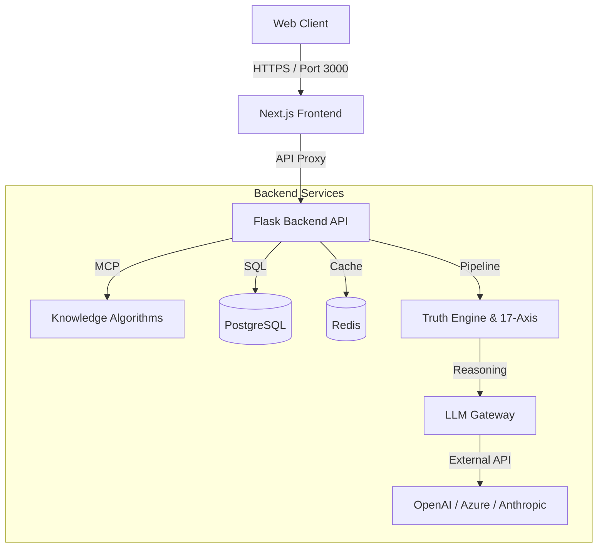

# Universal Knowledge Graph (UKG) System Architecture

## Overview

The Universal Knowledge Graph (UKG) System employs a **modern split-stack architecture** optimized for scalability, interactivity, and enterprise integration.

- **Frontend**: Next.js 14 App Router (React)
  - _Role_: User Interface, Visualization, State Management
- **Backend**: Flask (Python 3.11)
  - _Role_: API, Knowledge Engine, MCP Server, LLM Gateway

---

## High-Level Architecture

## 1. Frontend Layer (`/frontend`)

Built with **Next.js 14**, utilizing Server Components and Client Components for optimal performance.

### Key Components

- **App Router**: File-system based routing (e.g., `app/dashboard/page.tsx`).
- **API Client (`lib/api.ts`)**: Unified client for fetching traces, chat, and system health.
- **UI Library (`components/ui`)**: Accessible components based on Radix UI and Tailwind CSS.
- **Visualization**: D3.js and React Flow for Graph visualization.

### Integration

The frontend communicates with the backend via a **Rewrites Proxy** in `next.config.ts`:

- `/api/*` -> `http://localhost:5000/api/*`
- `/auth/*` -> `http://localhost:5000/auth/*`

---

## 2. Backend Layer (`/backend`, `/core`)

A robust **Flask** application serving as the central nervous system.

### Core Modules

- **LLM Gateway**: Standardizes interactions with AI models, injecting UKG context.
- **Tracing Engine**: Distributed tracing for every reasoning step (Trace -> Spans -> Evidence).
- **MCP Server**: Implements the Model Context Protocol to expose UKG capabilities to agents.
- **Knowledge Graph**: NetworkX-based in-memory graph processing with PostgreSQL persistence.

### Data Storage

- **PostgreSQL**: Primary store for Users, Nodes, Edges, and Traces.
- **Redis**: Caching layer for graph queries and API rate limiting.

---

## 3. 17-Axis Knowledge Framework

The data model organizes information across 17 dimensions:

1.  **Pillar**: Fundamental Domain
2.  **Level**: Abstraction Depth
3.  **Time**: Temporal Context
4.  **Space**: Geospatial Context
5.  ... (and 13 others)

This structure ensures sophisticated retrieval and reduced hallucinations in AI responses.
