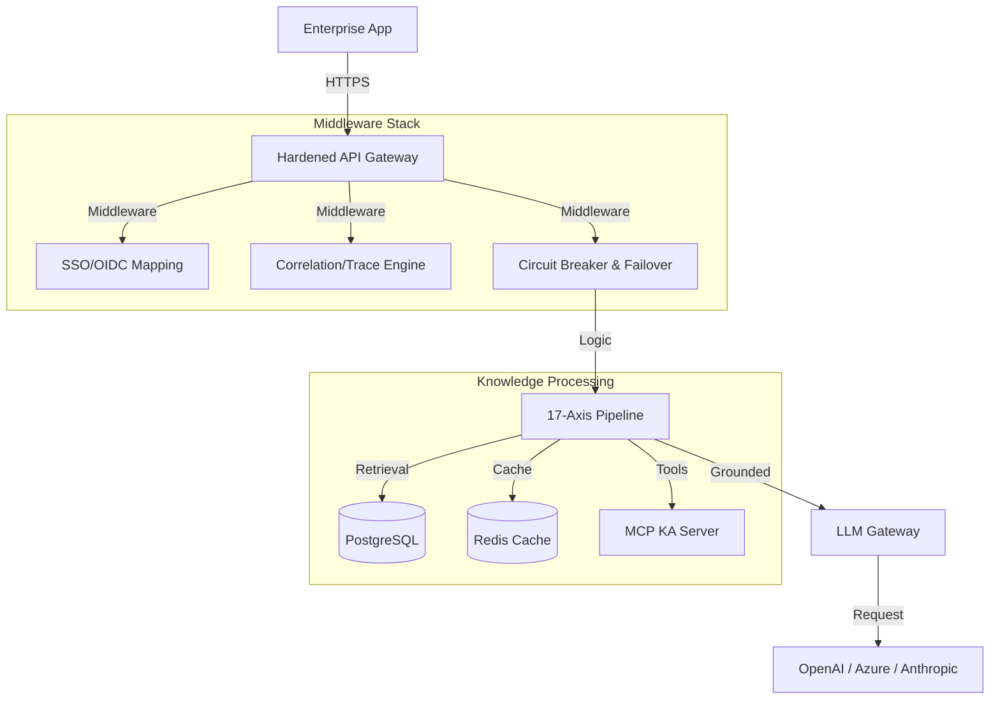

# Universal Knowledge Graph (UKG) System Architecture

## Overview

The Universal Knowledge Graph (UKG) System employs a **hardened middleware architecture** designed for high-availability, consistent reasoning, and enterprise-grade security.

- **Frontend**: Next.js 14 App Router (React + TypeScript)
- **Hardened Middleware**: Flask-based "Reasoning Engine" with integrated circuit breakers and distributed tracing.
- **Data Layer**: PostgreSQL (Persistent) + Redis (Cache) + UKG Graph (NetworkX).

---

## 🏗️ High-Level Component Map

---

## 🛡️ Enterprise Hardening Features

### 1. Resilience: Circuit Breaker & Failover

The `LLM Gateway` implements a **Circuit Breaker** pattern. If a provider (e.g., OpenAI) returns sequential errors, the circuit opens, and the gateway automatically reroutes traffic to the next highest priority provider (e.g., Anthropic).

- **Recovery**: Circuits enter "Half-Open" state after a timeout to test provider health.
- **Failover**: Sequential provider attempt logic ensures near 100% availability for reasoning tasks.

### 2. Multi-Tenancy: Data Isolation

Data isolation is enforced at the core database manager level. Every request carries a `tenant_id` context (mapped from SSO claims).

- **Isolation**: SQL queries are automatically filtered by `tenant_id`.
- **Graph Safety**: Graph traversals are scoped to the requesting tenant's nodes and edges.

### 3. Observability: End-to-End Tracing

Using a unified **Correlation ID**, the system links the initial HTTP request to the deep Knowledge Algorithm execution steps in the UKG SDK.

- **Audit Chain**: Every execution culminates in a hash-chained audit record.
- **Trace Explorer**: Admins can view the full reasoning path, including which evidence was used for which claim.

---

## 🧠 17-Axis Knowledge Framework

The core innovation is the organization of knowledge across 17 distinct axes:

1.  **Sectors**: Vertical industry (Healthcare, Finance, etc.)
2.  **Domains**: Technical areas (Compliance, Security, etc.)
3.  **Tiers**: Priority and complexity scoring.
4.  **Layers**: Reasoning depth (L1 Hygiene to L10 Completion).
5.  **Coordinates**: A compact 17-part vector representing the precise context of a query.

This coordinate system allows the engine to retrieve exactly the right "slice" of knowledge for any query, significantly outperforming traditional RAG.

---

## 🧪 Deployment Patterns

- **Edge Deployment**: Next.js frontend deployed to Vercel/Cloudflare.
- **Engine Cluster**: Flask backend deployed to Kubernetes with HPA.
- **Data Persistence**: Managed RDS (PostgreSQL) and Managed Redis.

---

© 2026 DataLogicEngine. Proprietary Architecture Documentation.
