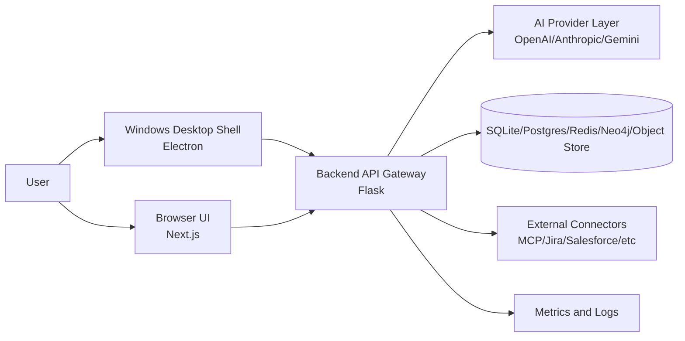
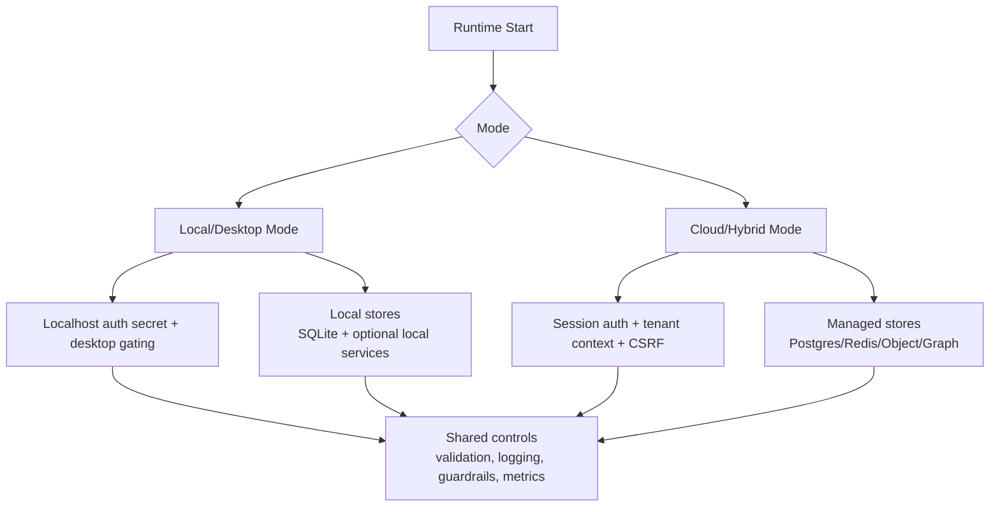
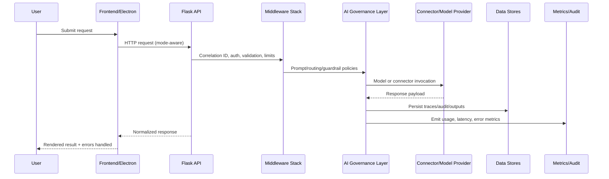

# DataLogicEngine Architecture Map

## Purpose

Provide an implementation-mapped architecture view of DataLogicEngine that links runtime components to repository paths, trust boundaries, and operational controls.

## Audience

1. Platform architects
2. Backend and frontend engineers
3. Security engineers
4. SRE and support teams

## System context map

## Runtime mode map

## Repository architecture map

| Layer | Primary paths | Responsibility |
|---|---|---|
| Desktop shell | `frontend/electron/`, `frontend/build_installer.ps1`, `scripts/windows/` | Electron runtime, installer/update controls, desktop IPC boundary |
| Frontend application | `frontend/app/`, `frontend/components/`, `frontend/lib/`, `frontend/middleware.ts` | UI routes, client state, route guards, UX and telemetry hooks |
| API and orchestration | `app.py`, `backend/`, `routes/` | API gateway, auth/session, AI orchestration, connector routing |
| Middleware and policy | `backend/middleware/`, `backend/security/` | correlation ID, limits, headers, CSP, error normalization |
| AI governance | `backend/llm_gateway/`, `backend/truth_engine/`, `backend/model_context/` | model routing, guardrails, prompt controls, usage tracking |
| Connector framework | `backend/mcp_server/`, `backend/services/`, `backend/api_gateway/` | connector auth, contract validation, SSRF controls, evidence capture |
| Data layer | `models.py`, `backend/storage/`, `backend/repositories/`, `migrations/` | schema governance, retention/deletion, backups, export packaging |
| Observability and ops | `backend/logging_config.py`, `scripts/`, `.github/workflows/` | structured logging, metrics, startup validation, CI/CD gates |
| Governance docs | `docs/`, `docs/adr/` | policies, standards, runbooks, decisions, release controls |

## Request lifecycle map

## Trust boundaries

1. Client boundary:
   renderer/browser is untrusted input surface.
2. API boundary:
   all inbound requests pass centralized validation, auth, and rate/resource controls.
3. External boundary:
   AI providers and connectors are treated as untrusted dependencies with timeout/retry/contract checks.
4. Data boundary:
   write paths require schema checks, retention policy alignment, and audit logging.
5. Operations boundary:
   diagnostics and export artifacts require redaction and integrity protection.

## Validation matrix

| Architecture area | Primary validation command |
|---|---|
| Documentation cross-links | `python scripts/verify_docs_references.py` |
| Runtime startup controls | `python scripts/runtime_precheck.py --strict --skip-ports --allow-env-from-process` |
| Schema parity | `python scripts/validate_schema_parity.py` |
| Installer integrity | `python scripts/verify_installer_integrity.py --require-artifacts` |
| Windows packaging checks | `powershell -ExecutionPolicy Bypass -File .\scripts\windows\run_packaging_smoke.ps1` |
| Environment parity | `python scripts/verify_environment_parity.py` |
| Lockfile integrity | `python scripts/verify_lockfiles.py` |

## Startup notes

1. Canonical Flask bootstrap lives in `app.py`.
2. App-level blueprint wiring is centralized in `app.py::_register_application_routes()`.
3. Startup schema creation is opt-in via `AUTO_CREATE_SCHEMA=true`; the default path is migration-first.
4. `main.py` and `wsgi.py` share runtime compatibility patches through `backend/bootstrap_compat.py`.
5. Production startup rejects `AUTO_CREATE_SCHEMA=true`; deployment prechecks should catch this before boot.
6. Canonical REST integrations should use `/api/v1/*`; legacy `/api/ka/*`, `/api/mcp/*`, and `/api/simulations/*` aliases emit deprecation headers with successor routes.

## Known limitations

1. Some `Settings` and `MCP admin` UI actions remain partially wired; see `docs/PRODUCT_OVERVIEW.md`.
2. External connector coverage depends on configured credentials and environment readiness.
3. Architecture details in `docs/whitepapers/` may include exploratory content that is not operational source-of-truth.
4. Some legacy aliases remain active for compatibility, but they are now explicitly marked as transitional in response headers and API docs.

## Related documents

1. `docs/ARCHITECTURE.md`
2. `docs/WORKFLOW.md`
3. `docs/API.md`
4. `docs/SECURITY.md`
5. `docs/DEPLOYMENT.md`
6. `docs/PRODUCTION_READINESS.md`
7. `docs/FILE_STRUCTURE.md`

## Document control

1. Owner: Platform Architecture
2. Last updated: 2026-03-31
3. Status: Active
4. Review cadence: Every 30 days
