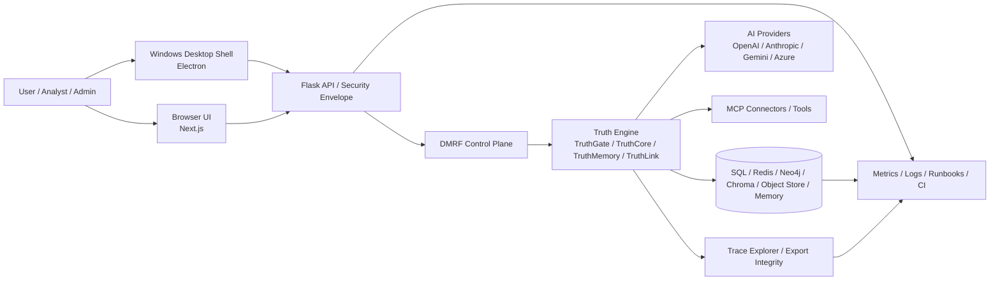
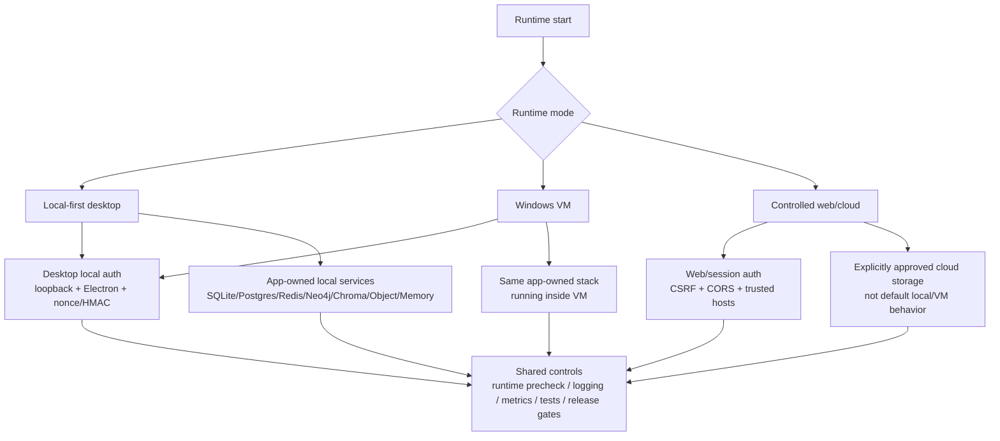
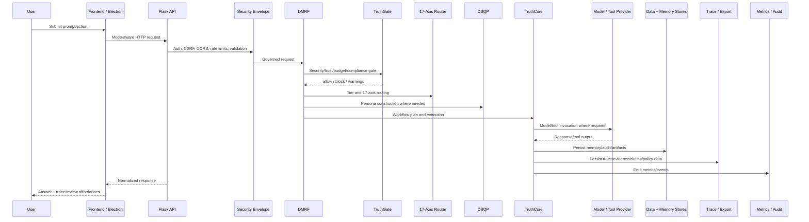

# DataLogicEngine Architecture Map

## Document metadata

| Field | Value |
|---|---|
| Document version | v2.6.0 |
| Last updated | 2026-05-30 |
| Status | Active |
| Owner | Platform Architecture |
| Review cadence | Every 30 days |

## Purpose

Provide an implementation-mapped architecture view of DataLogicEngine that links runtime components to repository paths, diagrams, trust boundaries, validation gates, and operational controls.

This map is the fastest way for a new reviewer to move from high-level product understanding to actual code and evidence.

## Audience

1. Platform architects
2. Backend and frontend engineers
3. Security engineers
4. SRE/support teams
5. Technical judges and external reviewers

---

## System context map

---

## Runtime mode map

---

## Repository architecture map

| Layer | Primary paths | Responsibility |
|---|---|---|
| Desktop shell | `frontend/electron/`, `frontend/build_installer.ps1`, `scripts/windows/` | Electron runtime, installer/update controls, desktop IPC boundary, packaging smoke. |
| Frontend application | `frontend/app/`, `frontend/components/`, `frontend/lib/` | UI routes, product shell, Trace Explorer, settings, graph, MCP, admin, API clients. |
| Runtime policy | `frontend/lib/runtime/policy.ts`, `frontend/contexts/AuthContext.tsx` | local/hybrid/cloud runtime behavior and desktop auto-login. |
| API and app assembly | `app.py`, `routes/`, `backend/routes/` | Flask app, middleware, route registration, canonical and compatibility APIs. |
| Security | `backend/security/`, `backend/auth/` | desktop auth, DPAPI, encryption, export integrity, tenant RLS, API decorators. |
| DMRF | `backend/dmrf/` | governed AI request lifecycle and control plane. |
| Truth Engine | `backend/truth_engine/` | TruthGate, TruthCore, TruthMemory, TruthLink. |
| DSQP | `backend/dsqp/` | deterministic structured expert/persona construction. |
| 17-axis / FROST | `core/axes/`, `backend/dmrf/router.py` | coordinate/risk/trust/FROST routing context. |
| LLM Gateway | `backend/llm_gateway/` | provider routing, model access, latency/usage behavior. |
| MCP / connectors | `backend/mcp_server/`, `backend/routes/mcp_routes.py`, `frontend/components/mcp/` | connector auth, scopes, contract validation, registry/admin UI. |
| Data and memory | `models.py`, `backend/storage/`, `backend/memory/`, `migrations/` | SQL, Redis, Neo4j, ChromaDB, object store, USKD, UnifiedMemory, schema governance. |
| Trace/export | `backend/tracing/`, `backend/security/export_integrity.py`, `frontend/app/runs/` | traces, evidence, claims, personas, export manifests and integrity. |
| Observability and ops | `backend/logging_config.py`, `scripts/`, `.github/workflows/` | logging, metrics, startup validation, CI/deploy/signing gates. |
| Governance docs | `docs/`, `docs/diagrams/`, `docs/adr/` | architecture, security, testing, runbooks, release, compliance, product docs. |

---

## Request lifecycle map

---

## Diagram navigation map

| Diagram | Use |
|---|---|
| `docs/diagrams/01_master_system_architecture.md` | top-level platform architecture. |
| `docs/diagrams/02_research_to_code_traceability.md` | research-to-implementation traceability. |
| `docs/diagrams/03_ai_reasoning_sequence.md` | AI reasoning sequence. |
| `docs/diagrams/04_17_axis_coordinate_model.md` | 17-axis coordinate model. |
| `docs/diagrams/05_truth_engine_architecture.md` | Truth Engine components. |
| `docs/diagrams/06_local_first_security_model.md` | desktop/local security. |
| `docs/diagrams/07_data_storage_and_memory_architecture.md` | data and memory architecture. |
| `docs/diagrams/08_testing_validation_and_release_governance.md` | validation and release governance. |
| `docs/diagrams/09_dmrf_control_plane_deep_dive.md` | DMRF internals. |
| `docs/diagrams/10_dsqp_persona_construction_architecture.md` | DSQP persona construction. |
| `docs/diagrams/11_frontend_product_surface_and_trace_review_map.md` | frontend/product surfaces. |
| `docs/diagrams/12_end_to_end_request_lifecycle.md` | complete request lifecycle. |

---

## Trust boundaries

1. **Client boundary** — renderer/browser input is untrusted.
2. **Desktop boundary** — desktop local-auth is only valid in local/Electron/loopback context.
3. **API boundary** — inbound requests pass centralized auth, validation, CSRF/CORS, rate/resource controls.
4. **AI boundary** — providers/tools/connectors are untrusted dependencies with timeout, contract, and policy controls.
5. **Data boundary** — write paths require schema, tenant, retention, and audit controls.
6. **Trace/export boundary** — evidence bundles require integrity metadata and redaction where needed.
7. **Operations boundary** — diagnostics/support bundles require sanitization.
8. **Release boundary** — public desktop distribution requires packaging smoke and trusted signature evidence.

---

## Validation matrix

| Architecture area | Primary validation command |
|---|---|
| Documentation cross-links | `python scripts/verify_docs_references.py` |
| Runtime startup controls | `python scripts/runtime_precheck.py --strict --skip-ports --allow-env-from-process` |
| Schema parity | `python scripts/validate_schema_parity.py` |
| Environment parity | `python scripts/verify_environment_parity.py --strict` |
| Lockfile governance | `python scripts/verify_lockfiles.py` |
| Release governance | `python scripts/verify_release_governance.py` |
| Backend tests | `python -m pytest tests --maxfail=20` |
| API contracts | `python -m pytest -q --no-cov tests\contract` |
| Security regressions | `python -m pytest -q --no-cov tests\security` |
| Local-mode parity | `python -m pytest -q --no-cov tests\parity` |
| Frontend validation | `npm --prefix frontend run lint && npm --prefix frontend run typecheck && npm --prefix frontend test` |
| Windows packaging checks | `powershell -NoProfile -ExecutionPolicy Bypass -File .\scripts\windows\run_packaging_smoke.ps1 -RepoRoot (Get-Location).Path` |
| NSIS governance | `powershell -NoProfile -ExecutionPolicy Bypass -File .\scripts\windows\verify_nsis_governance.ps1 -RepoRoot (Get-Location).Path` |
| Signed installer verification | `powershell -ExecutionPolicy Bypass -File .\scripts\windows\verify_installer_signature.ps1 -RequireArtifacts -CheckRevocation` |

---

## Startup notes

1. Canonical Flask bootstrap lives in `app.py`.
2. App-level blueprint wiring is centralized in app startup/registration logic.
3. Startup schema creation is opt-in via `AUTO_CREATE_SCHEMA=true`; default release path is migration-first.
4. Production startup rejects `AUTO_CREATE_SCHEMA=true`.
5. Canonical application integrations should use `/api/v1/*`.
6. Compatibility aliases remain transitional and should emit deprecation/successor route headers where implemented.
7. Desktop runtime uses local/Electron/loopback policy; cloud mode must not rely on desktop trust.
8. Local/VM storage modes use app-owned internal services by default.

---

## Source-of-truth document map

| Question | Read first |
|---|---|
| What is the product? | `docs/PRODUCT_OVERVIEW.md` |
| How does the system work? | `docs/ARCHITECTURE.md` |
| What APIs exist? | `docs/API.md` |
| How is data stored? | `docs/DATABASE_SCHEMA.md` |
| How is it secured? | `docs/SECURITY.md` |
| How is it tested? | `docs/TESTING.md` |
| How is it deployed? | `docs/DEPLOYMENT.md` |
| Is it production-ready? | `docs/PRODUCTION_READINESS.md` |
| How is it operated? | `docs/OPERATIONAL_RUNBOOKS.md` |
| How is it released? | `docs/RELEASE_CHECKLIST.md` |
| How does Windows local mode work? | `docs/WINDOWS_11_LOCAL_RUNBOOK.md` |
| What should users do first? | `docs/USER_GUIDE.md` |
| How should engineers onboard? | `docs/ENGINEER_ONBOARDING.md` |

---

## Known limitations

1. External connector coverage depends on configured credentials and environment readiness.
2. Architecture details in `docs/archive/whitepapers/` may include exploratory content that is not operational source of truth.
3. Compatibility aliases remain active for migration coverage but should not be treated as the preferred integration path.
4. Signed public Windows distribution still requires trusted certificate workflow evidence.
5. Manual accessibility evidence remains required before final production distribution claims.

---

## Related documents

1. `docs/ARCHITECTURE.md`
2. `docs/WORKFLOW.md`
3. `docs/API.md`
4. `docs/SECURITY.md`
5. `docs/DEPLOYMENT.md`
6. `docs/PRODUCTION_READINESS.md`
7. `docs/FILE_STRUCTURE.md`
8. `docs/PRODUCT_OVERVIEW.md`
9. `docs/ENGINEER_ONBOARDING.md`

## Change notes for v2.6.0

1. Added document metadata with explicit version and update date.
2. Updated system context, runtime mode, repository, and request lifecycle maps for DMRF, Truth Engine, DSQP, local-first, trace/export, and multi-store architecture.
3. Added diagram navigation map and source-of-truth document map.
4. Expanded trust boundaries and validation matrix.
5. Updated limitations to distinguish source-of-truth docs from archived/exploratory material.
