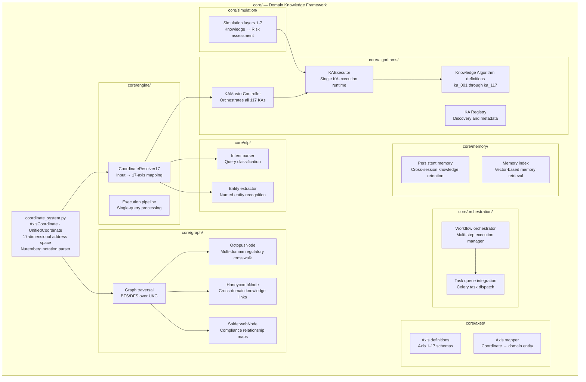
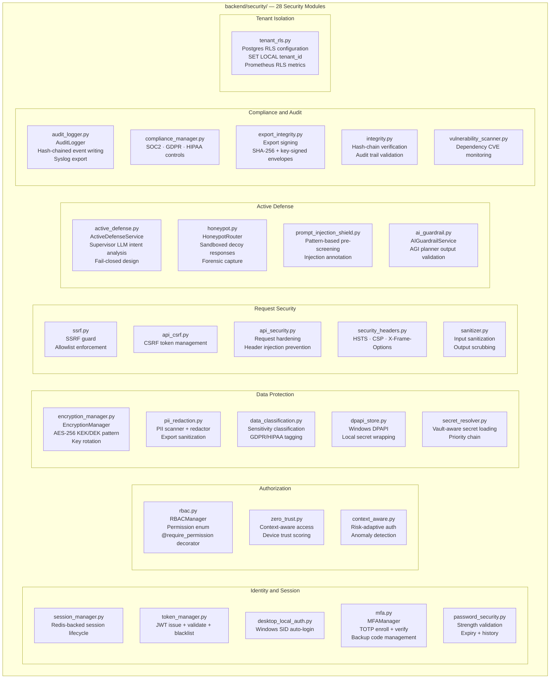
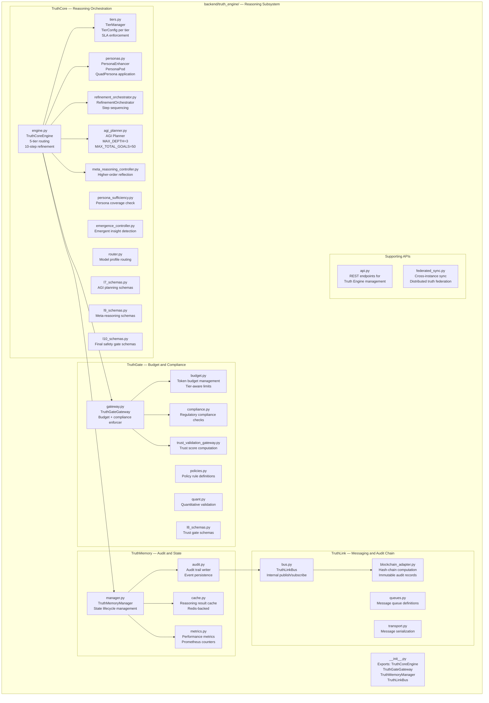

# Component Map — DataLogicEngine

**Document Control**

| Field | Value |
|-------|-------|
| Owner | Platform Architecture |
| Last Updated | March 2026 |
| Status | Active |
| Audience | Software engineers, architects, QA, technical reviewers |
| Review Cadence | Every 60 days |

---

## Table of Contents

1. [System-Level Component Diagram](#system-level-component-diagram)
2. [Backend Component Map](#backend-component-map)
3. [Frontend Component Map](#frontend-component-map)
4. [Core Knowledge Engine Component Map](#core-knowledge-engine-component-map)
5. [Security Layer Component Map](#security-layer-component-map)
6. [Truth Engine Component Map](#truth-engine-component-map)
7. [Observability and Operations Component Map](#observability-and-operations-component-map)
8. [Module Responsibility Matrix](#module-responsibility-matrix)
9. [External Dependency Map](#external-dependency-map)
10. [Inter-Module Communication Patterns](#inter-module-communication-patterns)

---

## System-Level Component Diagram

```mermaid
graph TB
    subgraph "Client Layer"
        BROWSER[Browser\nChrome · Edge · Firefox]
        ELECTRON[Electron Shell\nWindows Desktop App]
    end

    subgraph "Frontend — Next.js 16 (port 3000)"
        NEXTJS[Next.js App Router\nReact 18.3 + TypeScript 5]
        SHADCN[Shadcn UI\nRadix UI primitives]
        TAILWIND[Tailwind CSS 4.x\nDesign tokens]
        SWR_LIB[SWR\nData fetching + caching]
        THREE[Three.js + React Force Graph\n3D knowledge graph viz]
        RECHARTS[Recharts\nAnalytics dashboards]
        API_CLIENT[Frontend API Clients\nfrontend/lib/]
    end

    subgraph "Backend — Flask 3.1 (port 5000)"
        FLASK_APP[Flask Application\napp.py]
        MIDDLEWARE[Middleware Stack\nCorrelation ID · Rate Limit · CSRF · SSRF]
        ROUTES[Route Handlers\nroutes/]
        BLUEPRINTS[Blueprint Modules\nbackend/api/]
    end

    subgraph "Core Engine"
        COORD_SYS[17-Axis Coordinate System\ncore/coordinate_system.py]
        KA_ENGINE[Knowledge Algorithm Engine\ncore/knowledge_algorithm/]
        GRAPH_OPS[Graph Operations\ncore/graph/]
        ORCH[Orchestration\ncore/orchestration/]
        MEMORY[Persistent Memory\ncore/memory/]
    end

    subgraph "Intelligence Layer"
        TRUTH_ENGINE[Truth Engine\nbackend/truth_engine/]
        LLM_GW[LLM Gateway\nbackend/llm_gateway/]
        MCP_SERVER[MCP Server\nbackend/mcp_server/]
        QUAD_PERSONA[QuadPersona\nbackend/quad_persona/]
        SIMULATION[Simulation Engine\nbackend/simulation/]
    end

    subgraph "Security Layer"
        RBAC_MOD[RBAC Manager\nbackend/security/rbac.py]
        ENCRYPT[Encryption Manager\nbackend/security/encryption_manager.py]
        ACTIVE_DEF[Active Defense\nbackend/security/active_defense.py]
        MFA_MOD[MFA Manager\nbackend/security/mfa.py]
        AUDIT_LOG[Audit Logger\nbackend/security/audit_logger.py]
        TENANT_RLS[Tenant RLS\nbackend/security/tenant_rls.py]
    end

    subgraph "Data Layer"
        POSTGRES[(PostgreSQL 15+\nPrimary store\nRLS enforced)]
        REDIS[(Redis 5+\nSessions · Cache · Queue)]
        NEO4J[(Neo4j 5\nGraph database)]
        CHROMA[(ChromaDB 0.5\nVector store / RAG)]
        MINIO[(MinIO\nObject storage)]
    end

    subgraph "External Services"
        OPENAI[OpenAI API]
        ANTHROPIC[Anthropic API]
        GEMINI[Google Gemini API]
        GROK[Grok API]
        JIRA[Jira API]
        SALESFORCE[Salesforce API]
        AZURE_AD[Azure AD / Entra ID]
        SENTRY[Sentry.io]
    end

    BROWSER & ELECTRON --> NEXTJS
    NEXTJS --> API_CLIENT --> FLASK_APP
    FLASK_APP --> MIDDLEWARE --> ROUTES --> BLUEPRINTS
    BLUEPRINTS --> COORD_SYS & KA_ENGINE & GRAPH_OPS
    BLUEPRINTS --> TRUTH_ENGINE --> LLM_GW --> OPENAI & ANTHROPIC & GEMINI & GROK
    BLUEPRINTS --> MCP_SERVER --> JIRA & SALESFORCE
    TRUTH_ENGINE --> QUAD_PERSONA & SIMULATION
    FLASK_APP --> RBAC_MOD & ENCRYPT & ACTIVE_DEF & MFA_MOD
    FLASK_APP --> AUDIT_LOG --> POSTGRES
    BLUEPRINTS --> POSTGRES & REDIS & NEO4J & CHROMA & MINIO
    RBAC_MOD & ENCRYPT & TENANT_RLS --> POSTGRES
    AZURE_AD --> FLASK_APP
    FLASK_APP --> SENTRY
```



---

## Backend Component Map

```mermaid
graph TD
    subgraph "app.py — Application Factory"
        APP_FACTORY[create_app\nFlask instance creation]
        SECRET_RES[resolve_runtime_secret\nVault-aware secret loading]
        CRASH_INIT[initialize_crash_reporting\nSentry + fallback ID]
        BLUEPRINT_REG[Blueprint registration\nAll route modules]
        MW_STACK[Middleware registration\nProxyFix · Rate limit · Logging]
        HEALTH_EP[/health endpoint\nLiveness probe]
        METRICS_EP[/metrics endpoint\nPrometheus scrape target]
    end

    subgraph "backend/api/ — API Handlers"
        CHAT_API[chat.py\nChat session and message API]
        KNOWLEDGE_API[knowledge.py\nKnowledge graph CRUD API]
        RUNS_API[runs.py\nRun execution and retrieval API]
        SETTINGS_API[settings.py\nUser and system settings API]
        HEALTH_API[health.py\nStorage and service health API]
    end

    subgraph "backend/llm_gateway/ — AI Routing"
        GATEWAY_CORE[gateway.py\nLLMGateway class\nProvider routing + circuit breaker]
        GOVERNANCE[governance.py\nAIGovernanceEngine\nToken limits + content policy]
        LATENCY[latency_metrics.py\nPrometheus latency recording]
        GW_SCHEMAS[schemas.py\nPydantic request/response schemas]
        GW_API[api.py\nREST wrapper around gateway]
    end

    subgraph "backend/mcp_server/ — MCP Protocol"
        MCP_ROUTER[router.py\nMCPRouter\nConnector dispatching]
        MCP_REG[registry.py\nToolRegistry\nTool registration + discovery]
        MCP_SCOPE[scope_enforcement.py\nScopeEnforcement\nOAuth scope validation]
        MCP_OAUTH[oauth_manager.py\nOAuthManager\nToken lifecycle]
        MCP_CONTRACT[contract_validation.py\nJSON schema validation]
        MCP_METRICS[connector_metrics.py\nConnector latency Prometheus]
    end

    subgraph "backend/truth_engine/ — Reasoning Engine"
        TE_CORE[truth_core/engine.py\nTruthCoreEngine\n5-tier orchestrator]
        TE_TIERS[truth_core/tiers.py\nTierManager\nTier selection + config]
        TE_PERSONAS[truth_core/personas.py\nPersonaEnhancer\nQuadPersona reasoning]
        TE_REFINE[truth_core/refinement_orchestrator.py\nRefinementOrchestrator\n10-step pipeline]
        TE_AGI[truth_core/agi_planner.py\nAGI Planner\nMulti-goal planning]
        TE_META[truth_core/meta_reasoning_controller.py\nMetaReasoning]
        TE_GATE[truth_gate/gateway.py\nTruthGateGateway\nBudget + compliance]
        TE_BUDGET[truth_gate/budget.py\nBudget enforcement]
        TE_COMPLIANCE[truth_gate/compliance.py\nCompliance checks]
        TE_MEMORY_MGR[truth_memory/manager.py\nTruthMemoryManager]
        TE_AUDIT[truth_memory/audit.py\nAudit trail writer]
        TE_CACHE[truth_memory/cache.py\nReasoning result cache]
        TE_BUS[truth_link/bus.py\nTruthLinkBus\nInternal event bus]
        TE_BLOCKCHAIN[truth_link/blockchain_adapter.py\nBlockchain / hash-chain adapter]
    end

    subgraph "backend/tracing/ — Distributed Tracing"
        TRACE_MGR[Trace manager\nCorrelation ID propagation]
        TRACE_WRITER[Trace writer\nRunTrace record management]
        TRACE_EXPORT[Trace exporter\nSigned envelope generation]
    end

    subgraph "backend/observability/ — Platform Observability"
        CRASH[crash_reporting.py\ncapture_exception_with_fallback\nSentry + fallback ID]
        SLO[latency_slo.py\nSLO tracker\nPrometheus SLO gauges]
        DIAG[diagnostic_bundle.py\nSanitized support bundle\nIncident triage]
    end

    APP_FACTORY --> SECRET_RES & CRASH_INIT & BLUEPRINT_REG & MW_STACK
    BLUEPRINT_REG --> CHAT_API & KNOWLEDGE_API & RUNS_API & SETTINGS_API & HEALTH_API
    CHAT_API --> GATEWAY_CORE & TE_CORE
    KNOWLEDGE_API --> MCP_ROUTER
    GATEWAY_CORE --> GOVERNANCE & LATENCY
    MCP_ROUTER --> MCP_REG & MCP_SCOPE & MCP_OAUTH & MCP_CONTRACT & MCP_METRICS
    TE_CORE --> TE_TIERS & TE_PERSONAS & TE_REFINE & TE_AGI & TE_META
    TE_CORE --> TE_GATE --> TE_BUDGET & TE_COMPLIANCE
    TE_CORE --> TE_MEMORY_MGR --> TE_AUDIT & TE_CACHE
    TE_AUDIT --> TE_BUS --> TE_BLOCKCHAIN
```

---

## Frontend Component Map

```mermaid
graph TD
    subgraph "frontend/app/ — Page Routes (Next.js App Router)"
        ROOT[page.tsx\nRoot redirect → /dashboard]
        LAYOUT[layout.tsx\nRoot layout + providers]
        AUTH_GROUP["(auth)/\nLogin · Register"]
        DASHBOARD[dashboard/\nMain dashboard\nCompliance trend · Command bar]
        CHAT[chat/\nAI chat interface\nStreaming · Trace linking]
        PROJECTS["projects/ · projects/[id]/\nProject management CRUD"]
        RUNS[runs/ · runs/view/\nRun trace viewer\nTimeline + evidence]
        GRAPH[graph/\nKnowledge graph\nThree.js 3D visualization]
        SIMULATIONS[simulations/\nSimulation management]
        ALGORITHMS[algorithms/\nKA browser and executor]
        MCP_PAGE[mcp/\nConnector registry\nOAuth management]
        TRUTH_PAGE[truth-engine/\nTruth Engine monitoring]
        ADMIN["admin/ · admin/compliance/\nadmin/mcp/ · admin/mcp/servers/\nUser management · Audit logs"]
        SETTINGS["settings/ · settings/privacy/\nUser settings · AI model config"]
        ANALYTICS[analytics/\nUsage analytics\nLatency dashboards]
        KNOWLEDGE[knowledge/\nKnowledge browser\nNode/edge explorer]
        ABOUT["about/ · about/ai-limitations/\nabout/cloud-services/\nlegal/privacy/"]
    end

    subgraph "frontend/components/ — Shared UI Components"
        LAYOUT_COMP[layout/AppSidebar\nCollapsible sidebar · Nav items\nlocalStorage-persisted state]
        UI_COMP[ui/\nShadcn primitives\nButton · Dialog · Table · Badge\nApiErrorBoundary · PageLayout]
        CHAT_COMP[Chat/\nChatInterface · MessageBubble\nTraceVisualizer · LiveTracePanel\nAdvancedControls · DetailedResponseView]
        GRAPH_COMP[Graph/AxisSelector\n17-axis navigation]
        DASH_COMP[Dashboard/\nCommandBar · ComplianceTrendChart]
        MCP_COMP[mcp/\nMcpHub · McpAnalytics · McpClientConfig\nMcpServerConfig · McpIntegrationExamples]
        SETTINGS_COMP[settings/\nAiModelSettings · DatabaseSettings\nApiOverlayConfig]
        PROJECTS_COMP[projects/ProjectDetail]
        TOP_LEVEL[NavBar · ThemeToggle · DesktopStatus\nCloudDisclosureBanner · AppInitializer\nClientErrorBootstrap · PlaceholderPage]
        FF_COMP[feature-flags/FeatureFlagGate\nRuntime flag evaluation]
    end

    subgraph "frontend/lib/ — API Client Layer"
        AUTH_API[api/auth.ts\nLogin · Logout · Session\nDesktop auto-login]
        KNOWLEDGE_API[api/knowledge.ts\nNode CRUD · Graph queries]
        CHAT_API[api/chat.ts\nSession management · Message send]
        RUNS_API[api/trace.ts\nRun fetch · Stage fetch · Export]
        SIM_API[api/simulation.ts\nSimulation CRUD]
        MCP_API[api/mcp.ts\nConnector CRUD · Tool list · OAuth flow]
        SYSCHAT_API[api/system_chat.ts\nSystem-level chat]
        COMPLIANCE_API[api/compliance.ts\nCompliance status]
        BASE_CLIENT[api/index.ts\nBase request handler\nCSRF token management]
        WS_CLIENT[socket.ts\nSocket.io client\nReal-time updates]
        FF_DEFS[feature-flags/definitions.ts\n5 runtime flags]
    end

    subgraph "frontend/electron/ — Desktop Shell"
        ELECTRON_MAIN[main.ts\nElectron main process\nBrowserWindow · IPC · autoUpdater\nelectron-store · safeStorage]
        PRELOAD[preload.ts\nContext bridge\nSafe IPC exposure]
    end

    ROOT --> LAYOUT
    LAYOUT --> AUTH_GROUP & DASHBOARD & CHAT & PROJECTS & RUNS & GRAPH
    LAYOUT --> SIMULATIONS & ALGORITHMS & MCP_PAGE & TRUTH_PAGE & ADMIN & SETTINGS & ABOUT
    CHAT --> CHAT_COMP & CHAT_API
    GRAPH --> GRAPH_COMP & KNOWLEDGE_API
    RUNS --> RUNS_API
    DASHBOARD --> DASH_COMP
    MCP_PAGE --> MCP_COMP & MCP_API
    SETTINGS --> SETTINGS_COMP
    PROJECTS --> PROJECTS_COMP
    ELECTRON_MAIN --> PRELOAD
```



---

## Core Knowledge Engine Component Map



---

## Security Layer Component Map



---

## Truth Engine Component Map



---

## Observability and Operations Component Map

```mermaid
graph TD
    subgraph "Observability Subsystem"
        subgraph "Crash Reporting (backend/observability/)"
            CRASH_REPORT[crash_reporting.py\ncapture_exception_with_fallback\nSentry integration\nFallback crash ID generation]
            LATENCY_SLO[latency_slo.py\nSLO tracker\nPrometheus p50/p95/p99 gauges]
            DIAG_BUNDLE[diagnostic_bundle.py\nSupport bundle generator\nSanitized export for triage]
        end

        subgraph "AI Latency Metrics (backend/llm_gateway/)"
            AI_LATENCY[latency_metrics.py\nai_latency_metrics_prometheus_lines\nPer-provider per-model histograms]
        end

        subgraph "Connector Metrics (backend/mcp_server/)"
            CONN_METRICS[connector_metrics.py\nconnector_metrics_prometheus_lines\nPer-connector per-tool histograms]
        end

        subgraph "Tenant Metrics (backend/security/)"
            RLS_METRICS[tenant_rls.py\ntenant_rls_prometheus_lines\nRLS operation counters]
        end

        subgraph "Distributed Tracing (backend/tracing/)"
            CORR_ID_MW[Correlation ID middleware\nX-Correlation-ID injection\nPropagated to all service calls]
            TRACE_WRITER[Trace writer\nRunTrace record management]
            TRACE_EXPORT[Trace exporter\nSigned envelope generation]
        end

        subgraph "Logging"
            LOG_CONFIG[backend/logging_config.py\nconfigure_structured_logging\nJSON structured output]
            SYSLOG_EMIT[Syslog emitter\nSIEM real-time feed]
        end
    end

    subgraph "Prometheus /metrics endpoint"
        PROM_EP[/metrics\nAll Prometheus lines combined:\nAI latency + Connector latency\n+ SLO gauges + RLS metrics\n+ Crash metrics]
    end

    AI_LATENCY & CONN_METRICS & RLS_METRICS & LATENCY_SLO & CRASH_REPORT --> PROM_EP
    CORR_ID_MW --> TRACE_WRITER --> TRACE_EXPORT
    LOG_CONFIG --> SYSLOG_EMIT
```

---

## Module Responsibility Matrix

| Module | Package | Primary Responsibility | Depends On |
|--------|---------|----------------------|------------|
| `app.py` | root | Flask application factory; middleware registration; route mounting | All backend modules |
| `models.py` | root | All SQLAlchemy model definitions; PII encryption properties | `extensions.py` |
| `extensions.py` | root | Shared Flask extension instances (db, login_manager, rbac_manager, encryption_manager) | Flask, SQLAlchemy |
| `config.py` | root | Config classes (Development, Production, Testing, Desktop) | Python stdlib |
| `backend/llm_gateway/gateway.py` | llm_gateway | LLM provider routing, circuit breaker, UKG pipeline integration | `models.py`, `core/` |
| `backend/truth_engine/truth_core/engine.py` | truth_engine | 5-tier reasoning orchestration | All truth_* submodules |
| `backend/truth_engine/truth_gate/gateway.py` | truth_engine | Budget enforcement, compliance gate | `budget.py`, `compliance.py` |
| `backend/truth_engine/truth_memory/manager.py` | truth_engine | Audit trail, metrics, result caching | `audit.py`, `cache.py` |
| `backend/truth_engine/truth_link/bus.py` | truth_engine | Internal event bus; blockchain adapter for audit | `blockchain_adapter.py` |
| `backend/mcp_server/registry.py` | mcp_server | Tool registration and discovery | `scope_enforcement.py` |
| `backend/mcp_server/scope_enforcement.py` | mcp_server | OAuth scope validation before tool execution | `oauth_manager.py` |
| `backend/security/rbac.py` | security | RBAC permission definitions; `@require_permission` decorator | `audit_logger.py` |
| `backend/security/encryption_manager.py` | security | AES-256 field-level encryption; KEK/DEK key management | Python cryptography |
| `backend/security/active_defense.py` | security | Supervisor LLM intent analysis; fail-closed design | `llm_gateway/gateway.py` |
| `backend/security/audit_logger.py` | security | Hash-chained audit event writing; Syslog export | `models.py` |
| `backend/security/tenant_rls.py` | security | PostgreSQL RLS session configuration | SQLAlchemy |
| `backend/security/secret_resolver.py` | security | Vault-aware secret resolution priority chain | Python stdlib |
| `core/coordinate_system.py` | core | 17-axis coordinate parsing, validation, node ID generation | Python stdlib |
| `core/knowledge_algorithm/` | core | 117 KA definitions and execution runtime | `coordinate_system.py` |
| `core/graph/` | core | Knowledge graph traversal; Octopus/Honeycomb/Spiderweb nodes | Neo4j, PostgreSQL |
| `backend/observability/crash_reporting.py` | observability | Sentry integration + fallback crash ID | Sentry SDK |
| `backend/observability/latency_slo.py` | observability | SLO tracking; Prometheus gauge updates | Prometheus |

---

## External Dependency Map

| External Service | Protocol | Authentication | Used By | Circuit Breaker |
|-----------------|----------|----------------|---------|----------------|
| OpenAI API | HTTPS REST | API Key (encrypted) | LLM Gateway | Yes |
| Anthropic API | HTTPS REST | API Key (encrypted) | LLM Gateway | Yes |
| Google Gemini API | HTTPS REST | API Key (encrypted) | LLM Gateway | Yes |
| Grok API | HTTPS REST | API Key (encrypted) | LLM Gateway | Yes |
| Codestral API | HTTPS REST | API Key (encrypted) | LLM Gateway | Yes |
| Jira API | HTTPS REST | OAuth 2.0 | MCP Server | No |
| Salesforce API | HTTPS REST | OAuth 2.0 | MCP Server | No |
| Azure AD / Entra ID | HTTPS OIDC | OAuth 2.0 PKCE | Auth module | No |
| Sentry.io | HTTPS | DSN token | Crash reporting | No (has fallback) |
| SIEM / Syslog | UDP/TCP Syslog | Network trust | Audit logger | No |
| PostgreSQL | TCP | Username/password (TLS) | SQLAlchemy | No |
| Redis | TCP | Password (TLS) | Flask-Caching, Flask-Limiter | No |
| Neo4j | Bolt protocol | Username/password | Graph operations | No |
| MinIO (S3) | HTTPS S3 | Access key / secret | Object storage | No |
| ChromaDB | HTTP | API key | Vector store | No |

---

## Inter-Module Communication Patterns

| Pattern | Modules | Description |
|---------|---------|-------------|
| **Direct import** | All backend modules | Standard Python import; used for synchronous in-process calls |
| **Flask extension** | `extensions.py` → all modules | `db`, `rbac_manager`, `encryption_manager` accessed as `from extensions import X` |
| **Request context** | Middleware → Routes | Flask request context carries: correlation_id, current_user, tenant_id |
| **Decorator injection** | `rbac.py` → Routes | `@require_permission(Permission.X)` wraps route functions |
| **Property accessor** | `models.py` → `encryption_manager` | Encrypted field properties call `encryption_manager` on get/set |
| **Event bus** | `truth_memory/audit.py` → `truth_link/bus.py` | TruthLinkBus used for async audit event delivery |
| **Celery tasks** | `core/orchestration/` → Redis | Async task dispatch for long-running workflows |
| **Prometheus lines** | Multiple modules → `app.py /metrics` | Each module returns a `prometheus_lines()` function; `app.py` aggregates them at `/metrics` |
| **Database** | All data-bearing modules | SQLAlchemy session; all queries automatically filtered by tenant_id via RLS |
| **Redis** | Session manager, rate limiter, Celery, cache | Multiple clients share the same Redis instance |
