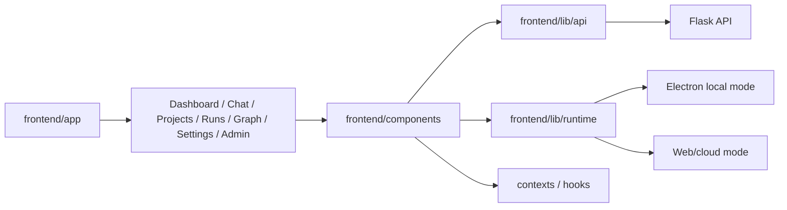
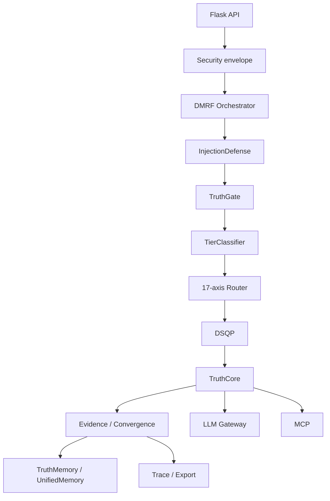

# Component Map — DataLogicEngine

## Document metadata

| Field | Value |
|---|---|
| Document version | v2.7.0 |
| Last updated | 2026-07-04 |
| Status | Active |
| Owner | Platform Architecture |
| Audience | Software engineers, architects, QA, technical reviewers |
| Review cadence | Every 60 days |

## Purpose

Map the major DataLogicEngine runtime components to implementation areas and explain how they interact in the current architecture.

This document reflects the current local-first, DMRF, Truth Engine, 17-axis, DSQP, MCP, trace/export, and multi-store architecture. Older component names from exploratory designs should be treated as historical unless they appear in current implementation paths.

---

## System-level component diagram

```mermaid
flowchart TB
    subgraph Client[Client surfaces]
        Browser[Browser UI]
        Electron[Electron Windows Desktop]
    end

    subgraph Frontend[Frontend / Product Surface]
        Next[Next.js App Router]
        Components[React Components]
        RuntimePolicy[Runtime Policy]
        ApiClient[API Clients]
        TraceUI[Trace Explorer / Runs]
        GraphUI[Graph / Simulation / MCP UI]
    end

    subgraph Backend[Flask API / Security Envelope]
        App[app.py]
        Routes[backend/routes/]
        Auth[Auth / Session / API decorators]
        Security[CSRF / CORS / Trusted Hosts / Rate Limits]
        DesktopAuth[Desktop Local Auth]
    end

    subgraph Control[Governed AI Control Plane]
        DMRF[DMRF Orchestrator]
        Injection[InjectionDefense]
        TruthGate[TruthGate]
        Tier[TierClassifier]
        Axis[17-Axis Router]
        DSQP[DSQP Persona Builder]
        TruthCore[TruthCore]
        Evidence[Evidence + Convergence]
    end

    subgraph Integration[External execution]
        LLM[LLM Gateway]
        Providers[AI Providers]
        MCP[MCP Server / Connectors]
        Tools[External Tools / APIs]
    end

    subgraph Data[Data and Memory]
        SQL[(SQLAlchemy DB)]
        Redis[(Redis)]
        Neo4j[(Neo4j)]
        Chroma[(ChromaDB)]
        ObjectStore[(Object Store)]
        USKD[(USKD RAM Graph)]
        UnifiedMemory[(UnifiedMemory)]
        TruthMemory[(TruthMemory)]
    end

    subgraph Ops[Operations and Governance]
        Metrics[/metrics / health / readiness]
        Tests[CI / Tests / Governance Scripts]
        Release[Packaging / Signing / Release Gates]
        Docs[Docs / ADRs / Diagrams]
    end

    Browser --> Next
    Electron --> Next
    Next --> Components --> ApiClient
    Components --> RuntimePolicy
    Components --> TraceUI
    Components --> GraphUI
    ApiClient --> App
    App --> Security --> Auth --> Routes
    App --> DesktopAuth
    Routes --> DMRF
    DMRF --> Injection --> TruthGate --> Tier --> Axis --> DSQP --> TruthCore --> Evidence
    TruthCore --> LLM --> Providers
    TruthCore --> MCP --> Tools
    Evidence --> SQL
    Evidence --> Redis
    Evidence --> Neo4j
    Evidence --> Chroma
    Evidence --> ObjectStore
    Evidence --> USKD
    Evidence --> UnifiedMemory
    Evidence --> TruthMemory
    App --> Metrics
    Tests --> Release
    Docs --> Tests
```

---

## Module responsibility matrix

| Component | Primary paths | Responsibility |
|---|---|---|
| Frontend shell | `frontend/app/`, `frontend/components/` | Product routes, UI surfaces, trace/runs/graph/settings/admin UX. |
| Electron runtime | `frontend/electron/` | Windows desktop shell, local launch, desktop trust boundary. |
| Runtime policy | `frontend/lib/runtime/` | Local/hybrid/cloud runtime behavior. |
| API assembly | `app.py`, `backend/routes/` | Flask app, route registration, middleware, canonical/compat APIs. |
| Auth/security | `backend/auth/`, `backend/security/` | Auth decorators, sessions, desktop auth, export integrity, DPAPI, security controls (single-mode OS-level auth). |
| DMRF | `backend/dmrf/` | Governed AI request lifecycle and orchestration. |
| Truth Engine | `backend/truth_engine/` | TruthGate, TruthCore, TruthMemory, TruthLink. |
| 17-axis/FROST | `backend/dmrf/router.py`, `core/axes/` | Coordinate routing, FROST depth, TruthCore mode selection. |
| DSQP | `backend/dsqp/` | Deterministic structured persona construction. |
| LLM Gateway | `backend/llm_gateway/` | Cloud model execution (OpenAI gpt-5.5 / Google gemini-3.1-pro-preview), usage/error handling, retries, circuit breaker. |
| MCP | `backend/mcp_server/` | Connector registry, scopes, tool execution contracts. |
| Storage/memory | `backend/storage/`, `backend/memory/`, `models.py` | SQL, Redis, Neo4j, Chroma, object storage, UnifiedMemory, USKD. |
| Trace/export | `backend/tracing/`, `backend/security/export_integrity.py`, `frontend/app/runs/` | Run traces, evidence review, export integrity. |
| Ops/release | `scripts/`, `.github/workflows/`, `docs/RELEASE_CHECKLIST.md` | Validation, packaging, governance, release evidence. |

---

## Frontend component map



---

## Backend control-plane component map



---

## External dependency map

| Dependency class | Examples | Notes |
|---|---|---|
| AI providers | OpenAI and Google/Gemini where configured | Provider calls may move selected prompt/context outside local machine. |
| MCP/external tools | configured connector targets | Scope/contract validation required. |
| Local data services | SQL, Redis, Neo4j, ChromaDB, object store | App-owned local/VM stack by default. |
| CI/release services | GitHub Actions, signing workflows | Evidence required for release claims. |
| Optional observability | Sentry/SIEM-style integrations where configured | Do not claim active integrations without environment evidence. |

---

## Communication patterns

1. Frontend communicates with backend through HTTP/API clients.
2. Canonical application integrations use `/api/v1/*`.
3. Desktop mode may use local/Electron/loopback authentication.
4. DMRF coordinates AI lifecycle decisions before provider/tool execution.
5. Truth Engine persists traceable policy/evidence/memory signals.
6. MCP tool execution must pass scope and contract validation.
7. Trace/export flows should preserve integrity metadata.

## Change notes for v2.6.0

1. Added document metadata with explicit version and update date.
2. Replaced older Knowledge Engine, Active Defense, QuadPersona, and legacy gateway maps with current DMRF/Truth Engine/DSQP architecture.
3. Added current module responsibility matrix and communication patterns.
4. Added clearer local-first, provider, MCP, storage, and release-governance components.
