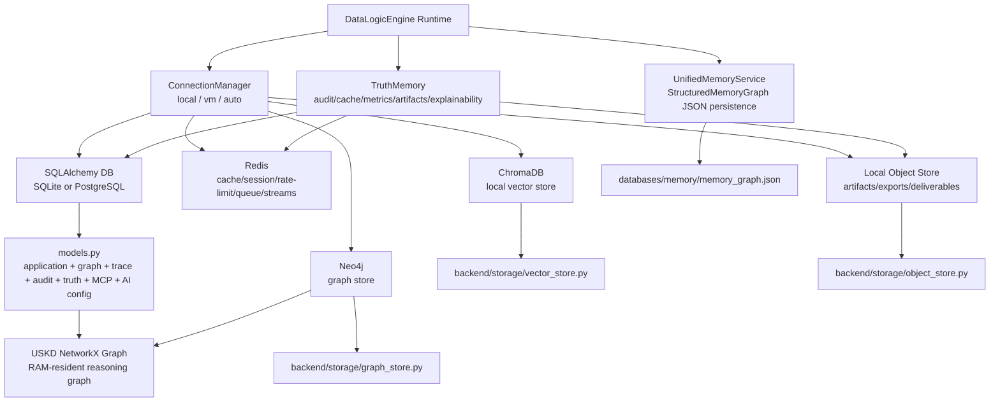
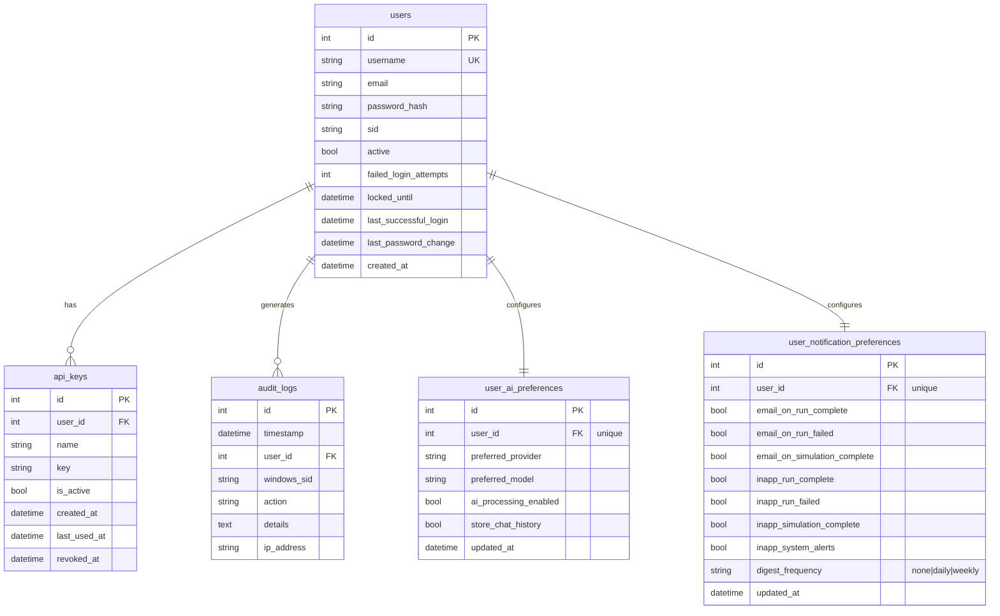
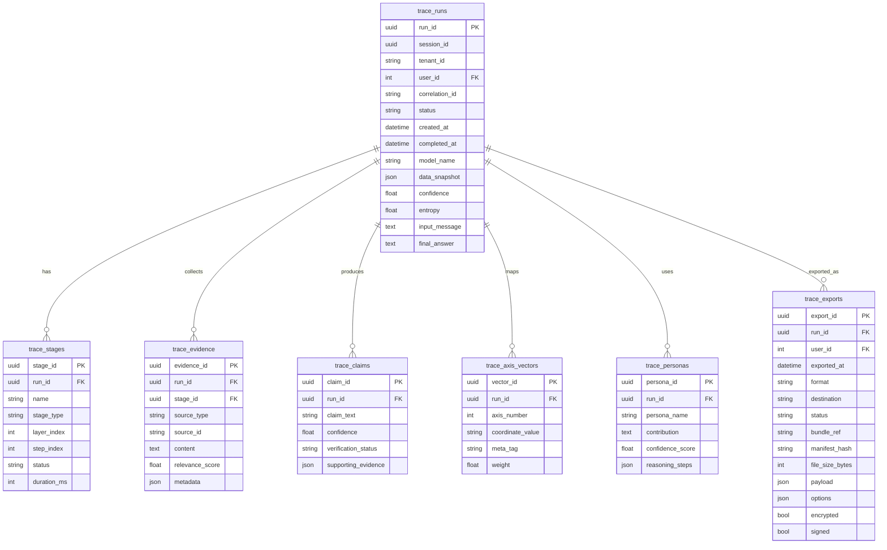
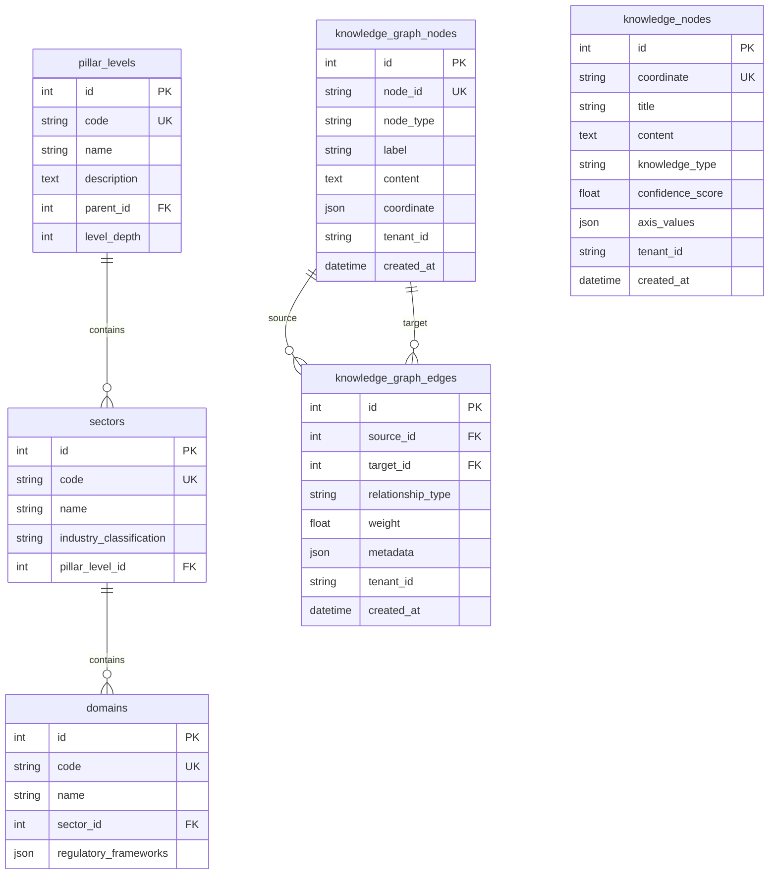
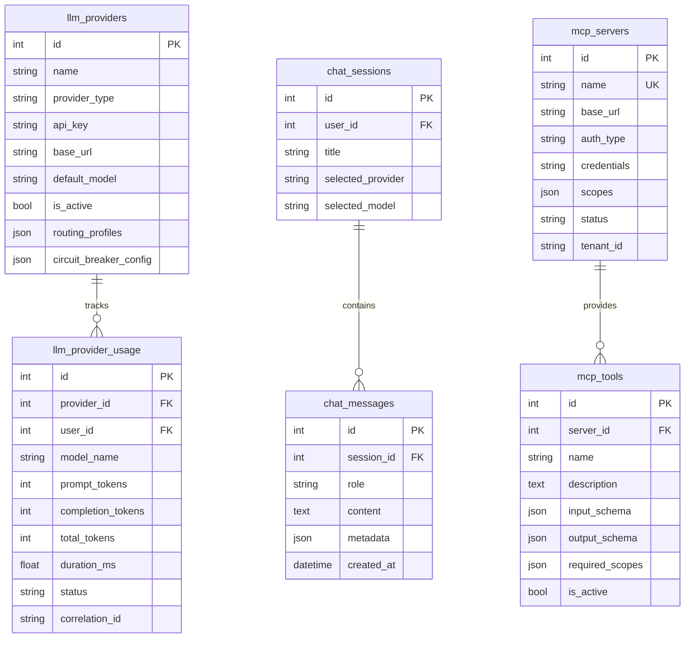

# Database and Data Architecture Reference — DataLogicEngine

## Document metadata

| Field | Value |
|---|---|
| Document version | v3.4.0 |
| Last updated | 2026-07-13 |
| Status | Active |
| Owner | Platform Engineering |
| Review cadence | Every 60 days |
| Primary SQL source | `models.py` |
| Primary storage modules | `backend/storage/` |

## Purpose

Define the current data architecture for DataLogicEngine across SQL models, graph storage, vector storage, object storage, runtime cache/queue, USKD memory graph, UnifiedMemory, TruthMemory, and trace/export evidence.

This document replaces the older PostgreSQL-only framing with the current multi-store architecture.

Phase 6 adds source provenance and measured quality columns to `trace_evidence`,
claim type/citation identifiers to `trace_claims`, explicit relationship and
validator identity to `claim_evidence_links`, and the new `trace_citations`,
`trace_validators`, and `trace_quality_decisions` tables. Alembic head
`c2d3e4f5a6b7` is authoritative.

## Audience

1. Backend engineers
2. Database engineers
3. Security reviewers
4. Compliance/audit reviewers
5. Release engineers
6. Technical judges validating storage architecture

## Related documents

1. `docs/ARCHITECTURE.md`
2. `docs/API.md`
3. `docs/DEPLOYMENT.md`
4. `docs/diagrams/07_data_storage_and_memory_architecture.md`
5. `docs/diagrams/12_end_to_end_request_lifecycle.md`
6. `backend/storage/connection_manager.py`
7. `backend/storage/uskd_memory_graph.py`
8. `backend/memory/unified_memory_service.py`
9. `backend/truth_engine/truth_memory/manager.py`
10. `models.py`

---

## Table of contents

1. [Current data architecture](#current-data-architecture)
2. [Storage responsibility map](#storage-responsibility-map)
3. [SQL schema domains](#sql-schema-domains)
4. [Graph architecture](#graph-architecture)
5. [Vector architecture](#vector-architecture)
6. [Object storage architecture](#object-storage-architecture)
7. [Memory architecture](#memory-architecture)
8. [Trace and export architecture](#trace-and-export-architecture)
9. [Tenant scoping (single-mode)](#tenant-scoping-columns-single-mode)
10. [Field-level encryption pattern](#field-level-encryption-pattern)
11. [Schema parity and validation](#schema-parity-and-validation)
12. [Reviewer verification path](#reviewer-verification-path)
13. [Change notes](#change-notes-for-v260)

---

## Current data architecture

### Phase 4 authoritative data lifecycle

The production profile now injects supervisor-owned connection contracts for
PostgreSQL, Redis, Neo4j, ChromaDB, and S3-compatible object operations. It
refuses SQLite, embedded Chroma, filesystem object storage, or in-memory service
substitution when the managed profile is selected. Development mode retains
those bounded fallbacks explicitly.

The required object buckets are `audit-logs`, `simulation-artifacts`,
`deliverables`, `graphs`, `evaluation-data`, and `trace-exports`. The generated
The authority registry assigns one authority to 70 PostgreSQL entities and 28 logical
data classes. PostgreSQL is the logical authority for graph nodes/relationships
and vector sources; Neo4j and ChromaDB are rebuildable, revisioned
materializations. MinIO remains authoritative for declared artifact classes.

Cross-store writes use a transactional outbox, stable IDs, schema/source
revisions, payload hashes, idempotent handlers, retry/reclaim behavior, and a
materialization-state record. A required artifact or index is not marked
complete until the destination confirms the same revision/hash.

Production startup runs a fail-closed migration coordinator before stores and
workers. The 14-revision Alembic chain has base `000000000001` and head
`a9b0c1d2e3f4`; Redis, Neo4j, ChromaDB, MinIO, retained configuration, and JSON
memory also carry version probes and ledger entries. See
`docs/MIGRATION_SUPPORT_MATRIX.md` for the supported-upgrade limits.

DataLogicEngine is not a single-database application. It uses a multi-store data architecture where each store has a distinct role.



The current `ConnectionManager` supports:

1. `local` — app-owned local services and local filesystem stores.
2. `vm` — the same app-owned stack running inside a Windows VM.
3. `auto` — auto-detect/internal configuration.

Cloud/hybrid database modes are deprecated for the runtime data layer unless a future architecture revision explicitly reintroduces them.

## Storage responsibility map

| Store | Implementation | Responsibility |
|---|---|---|
| SQLAlchemy DB | `models.py`, `extensions.py`, migrations | durable application state, users, sessions, chat, traces, audit rows, graph rows, Truth sessions, MCP metadata, provider configuration. |
| Redis | `app.py`, `ConnectionManager`, TruthLink | required production cache, sessions, rate limiting, queue/broker behavior, and TruthLink streams. |
| Neo4j | `backend/storage/graph_store.py` | graph-oriented knowledge relationships and graph query behavior. |
| USKD NetworkX graph | `backend/storage/uskd_memory_graph.py` | RAM-resident graph materialization from SQL or Neo4j for reasoning traversal. |
| ChromaDB | `backend/storage/vector_store.py` | required production local vector embeddings and semantic retrieval. |
| MinIO | object-storage adapters and artifact services | required production S3-compatible artifacts, evidence, exports, and backup objects. |
| Local object store | `backend/storage/object_store.py` | deliverables, audit logs, simulation artifacts, graphs, eval data, DSQP personas, trace exports. |
| UnifiedMemory | `backend/memory/unified_memory_service.py` | structured reasoning memory graph persisted to JSON. |
| TruthMemory | `backend/truth_engine/truth_memory/manager.py` | audit chain, cache, metrics, artifacts, explainability, MLflow-style tracking. |

## SQL schema domains

The SQL schema remains important, but it is one layer in the broader architecture.

Major SQL domains:

1. Identity and access management.
2. Chat and AI provider configuration.
3. Knowledge graph records.
4. Trace and audit records.
5. Truth Engine sessions, budgets, artifacts, metrics, and audit events.
6. MCP connector/server metadata.
7. Compliance, privacy, retention, feature flags, and operational records.
8. Knowledge Algorithm metadata and execution records.

### Core identity domain



### Trace and audit domain



### Knowledge graph domain



### MCP and AI configuration domain



## Graph architecture

There are three graph layers:

1. **PostgreSQL graph authority** — durable graph tables such as `knowledge_graph_nodes`, `knowledge_graph_edges`, `nodes`, `edges`, `pillar_levels`, `sectors`, `domains`, and `knowledge_nodes`.
2. **Neo4j graph materialization** — revisioned, outbox-driven graph-native traversal and relationship queries.
3. **USKD RAM graph** — NetworkX directed graph used by reasoning layers to avoid database round trips for every traversal.

`backend/storage/uskd_memory_graph.py` can load from:

- SQLAlchemy model records;
- Neo4j graph records;
- dictionaries/test doubles.

This creates the current pattern:

```text
PostgreSQL authoritative graph -> Neo4j materialization
        ↓
USKD NetworkX in-memory graph
        ↓
fast reasoning traversal
```

## Vector architecture

Production vector sources are PostgreSQL-authoritative and materialize into
versioned ChromaDB collections through the durable outbox. Development can use a
local persistent Chroma client.

Key behavior:

1. Persistent local path defaults to `./databases/chroma`.
2. `chromadb.PersistentClient` is used when ChromaDB is installed.
3. Anonymized telemetry is disabled in the Chroma settings.
4. Collections can be created, queried, counted, and deleted.
5. Semantic search returns IDs, scores, text, metadata, and optional embeddings.

Current vector role:

```text
text/document chunks/query embeddings
        ↓
ChromaDB collections
        ↓
semantic retrieval
        ↓
TruthCore / DMRF / graph-assisted response generation
```

## Object storage architecture

Production object storage uses the app-owned MinIO service. A contained local
filesystem backend remains development/bootstrap/repair-only.

Default path:

```text
./databases/objects
```

Default app buckets include:

```text
audit-logs
simulation-artifacts
deliverables
graphs
evaluation-data
trace-exports
```

Object-store safety controls include:

1. strict bucket-name validation;
2. object-key normalization;
3. null-byte rejection;
4. absolute-path rejection;
5. `..` traversal rejection;
6. resolved-path containment checks;
7. optional metadata sidecar files;
8. SHA-256 ETag computation.

Stored artifacts can include:

- DSQP persona deliverables;
- trace/export bundles;
- simulation artifacts;
- audit logs;
- graph exports;
- evaluation data.

## Memory architecture

DataLogicEngine currently has multiple memory systems, each with a different purpose.

| Memory system | Implementation | Purpose |
|---|---|---|
| USKD memory graph | `backend/storage/uskd_memory_graph.py` | RAM-resident graph memory for fast traversal of knowledge graph structures. |
| UnifiedMemoryService | `backend/memory/unified_memory_service.py` | Structured reasoning memory with embeddings, vertices, edges, recall, consolidation, and JSON persistence. |
| TruthMemory | `backend/truth_engine/truth_memory/manager.py` | Audit-grade session memory: audit chain, cache, metrics, artifacts, explainability, MLflow-style tracking. |

UnifiedMemory persists to:

```text
databases/memory/memory_graph.json
```

Recall scoring considers:

1. embedding relevance;
2. temporal importance;
3. stored importance score.

## Trace and export architecture

Trace data can exist across:

1. SQL trace tables;
2. TruthMemory audit/artifact records;
3. object-store export bundles;
4. frontend Trace Explorer payloads;
5. integrity-protected export manifests.

Trace exports are protected by `backend/security/export_integrity.py`:

```text
trace bundle
  -> per-section hashes
  -> bundle SHA-256
  -> optional HMAC-SHA256 signature
  -> optional AES-256-GCM-encrypted payload
  -> manifest/envelope
```

This supports judge/auditor review because exported traces can include deterministic integrity metadata.

## Tenant scoping columns (single-mode)

> **Single-mode note.** The app runs in **single operating mode with OS-level
> auth** (one owner; even cloud runs on a single-tenant VM). The PostgreSQL
> row-level-security enforcement module (`backend/security/tenant_rls.py`) and
> its app wiring/metrics were **removed** (auth deprecation Phase D). The
> `tenant_id` columns below are **left in place** as vestigial scoping columns
> (intentionally wider than RLS — a separate concern) but are not enforced by an
> RLS policy. Under single-mode, tenant scope is the local profile/app context.

Several tables still carry a `tenant_id` column:

| Table | tenant_id column | Notes |
|---|---|---|
| `knowledge_graph_nodes` | `tenant_id` | graph records |
| `knowledge_graph_edges` | `tenant_id` | graph relationships |
| `nodes` | `tenant_id` | core UKG nodes |
| `edges` | `tenant_id` | core UKG edges |
| `knowledge_nodes` | `tenant_id` | coordinate knowledge records |
| `mcp_servers` | `tenant_id` | connector/server registry |
| `trace_runs` | `tenant_id` | trace/session scoping |

Desktop/local and user-controlled VM modes treat these vestigial tenant columns as local profile/app context, not as enforced multi-tenant isolation.

## Field-level encryption pattern

Sensitive SQL fields are encrypted through the application encryption layer where models and services use it.

Current implementation notes:

1. `backend/security/encryption_manager.py` implements KEK/DEK pattern, PBKDF2-HMAC-SHA256, DEK rotation, versioned encrypted payloads, and audit logging hooks.
2. The current implementation writes new encrypted fields with AES-256-GCM and records `AES-256-GCM` in the registry.
3. Legacy `Fernet-AES-128-CBC` registry entries remain decryptable so pre-upgrade field values can still be read.
4. `backend/security/dpapi_store.py` provides Windows DPAPI helpers for local protected data.

Example model pattern:

```python
_email = db.Column('email', db.String(255), unique=True, nullable=False)

@property
def email(self):
    return encryption_manager.decrypt(self._email, field_name='email')

@email.setter
def email(self, value):
    self._email = encryption_manager.encrypt(value, field_name='email')
```

Representative sensitive fields:

| Area | Example data |
|---|---|
| users | email (MFA secret/backup-code columns dropped in auth deprecation Phase E-1) |
| LLM providers | API keys and provider credentials |
| MCP servers | connector credentials/tokens |
| MCP server credentials | connector credentials and server configuration secrets where configured |
| trace exports | optional encrypted export payloads |

## Schema parity and validation

Schema validation is part of CI and deployment governance.

Relevant commands:

```powershell
python scripts/validate_schema_parity.py --report reports/schema_parity_report_local.json
python scripts/runtime_precheck.py --strict --skip-ports --allow-env-from-process
```

CI uses schema parity checks to prevent SQLite/PostgreSQL drift where relevant.

Important release rule:

```text
AUTO_CREATE_SCHEMA=true is local-only and must not be used in production.
```

Use migrations for controlled database evolution.

## Reviewer verification path

A technical reviewer should inspect these files in order:

1. `models.py` — SQLAlchemy models and relationships.
2. `migrations/` — schema migration history.
3. `backend/storage/connection_manager.py` — supported storage modes and service configuration.
4. `backend/storage/object_store.py` — local object-store safety controls.
5. `backend/storage/vector_store.py` — ChromaDB vector persistence and search.
6. `backend/storage/graph_store.py` — Neo4j graph interface.
7. `backend/storage/uskd_memory_graph.py` — NetworkX RAM graph loading from SQL/Neo4j.
8. `backend/memory/unified_memory_service.py` — structured reasoning memory persistence.
9. `backend/truth_engine/truth_memory/manager.py` — audit/explainability memory.
10. `backend/security/encryption_manager.py` — field encryption and key rotation behavior.
11. `backend/security/dpapi_store.py` — Windows DPAPI helper.
12. `backend/security/export_integrity.py` — trace export integrity.
13. `scripts/validate_schema_parity.py` — schema parity validation.
14. `.github/workflows/ci.yml` — CI enforcement of schema, test, and release gates.

## Change notes for v3.3.0

1. Recorded the generated ownership registry, PostgreSQL authority for graph and
   vector sources, and durable outbox/materialization contract.
2. Recorded the 14-revision startup migration boundary and current-version
   coordinated backup/restore qualification.

## Change notes for v3.2.0

1. Added the Phase 3 supervisor-owned production connection mapping and six
   required object buckets.
2. Defined the Phase 4 ownership, migration, coordinated recovery, retention,
   and reconciliation boundary without claiming those contracts are complete.

## Change notes for v3.1.0

1. Updated metadata for the production top-level documentation review.
2. Removed stale `OAuth accounts` sensitive-field wording after the `oauth_accounts` table/model removal; MCP credential storage is now the active connector-secret concern.
3. Clarified that vestigial `tenant_id` columns are local profile/app context in desktop and user-controlled VM modes, not active multi-tenant isolation.

## Change notes for v3.0.0

1. Added `user_notification_preferences` table to the core identity domain ER diagram.
   One row per user (`user_id` unique FK); 7 boolean notification toggles; `digest_frequency`
   enum (`none | daily | weekly`). Replaces the file-backed `runtime_settings` JSON store
   that was introduced as a placeholder. Commit `cc01c15b`.
2. Added `user_ai_preferences` table to the core identity domain ER diagram (was implemented
   but missing from the schema doc).
3. Added ER relationships: `users ||--|| user_ai_preferences` and
   `users ||--|| user_notification_preferences`.

## Change notes for v2.6.0

1. Added document metadata with explicit version and update date.
2. Reframed the document from PostgreSQL-only schema reference to multi-store data architecture reference.
3. Added storage responsibility map for SQL, Redis, Neo4j, USKD, ChromaDB, object store, UnifiedMemory, and TruthMemory.
4. Added current graph, vector, object-store, memory, and trace/export architecture sections.
5. Updated encryption notes for the current AES-256-GCM implementation and legacy Fernet decrypt compatibility.
6. Added schema parity and release validation guidance.
7. Added reviewer verification path tied to actual implementation files.
