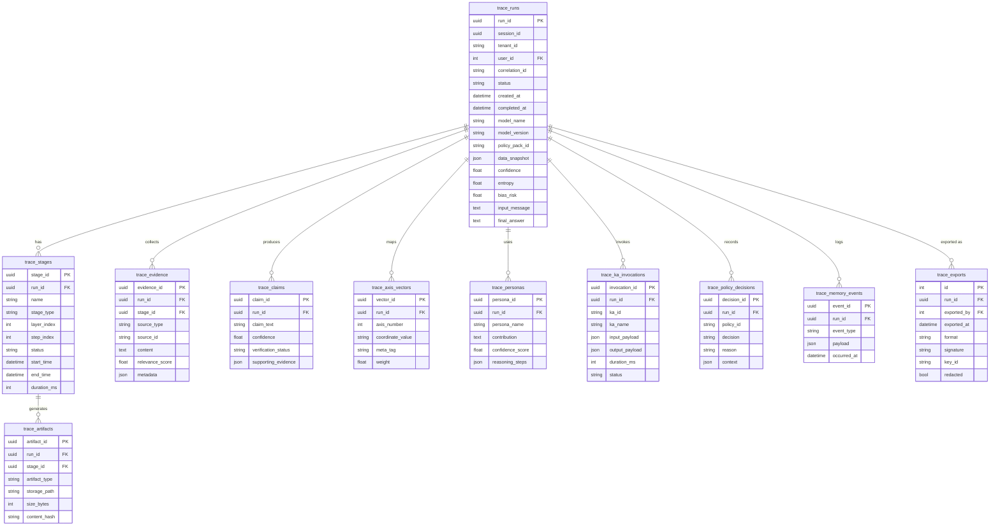
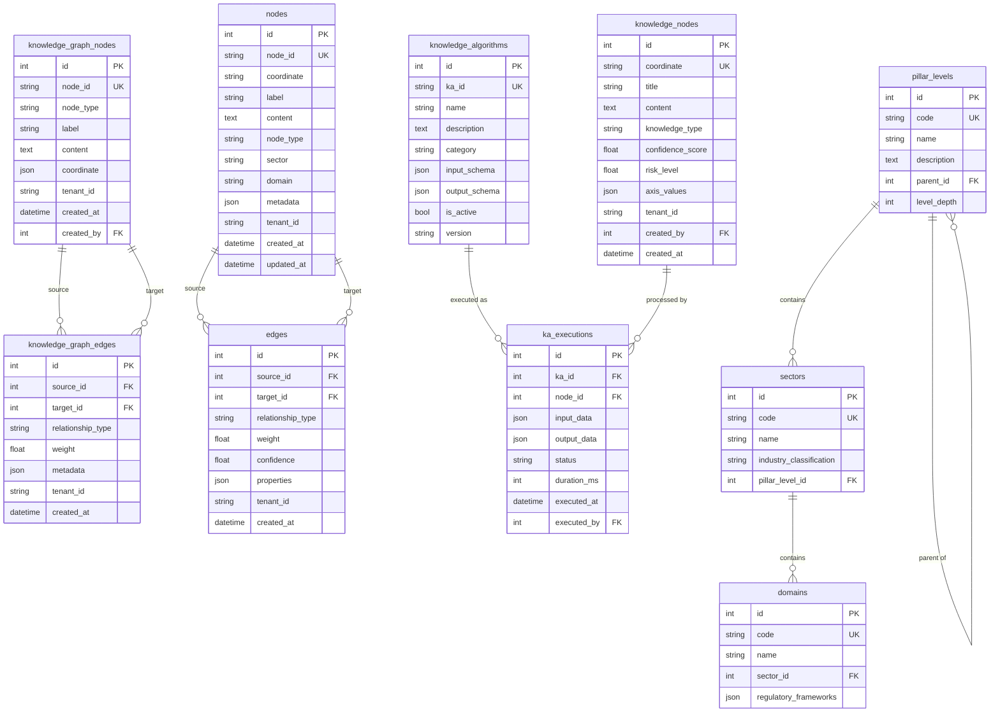

# Database Schema Reference — DataLogicEngine

**Document Control**

| Field | Value |
|-------|-------|
| Owner | Platform Engineering |
| Last Updated | March 2026 |
| Status | Active |
| Source File | `models.py` (~3,000 lines, ~50 SQLAlchemy models) |
| Primary Database | PostgreSQL 15+ with Row-Level Security (RLS) |
| Local Fallback | SQLite (WAL mode) — schema maintained in parity |
| Audience | Backend engineers, DBAs, security reviewers |
| Review Cadence | Every 60 days |

---

## Table of Contents

1. [Overview and Conventions](#overview-and-conventions)
2. [Entity Relationship Diagram — Core Domain](#entity-relationship-diagram--core-domain)
3. [Entity Relationship Diagram — Trace and Audit Domain](#entity-relationship-diagram--trace-and-audit-domain)
4. [Entity Relationship Diagram — Knowledge Graph Domain](#entity-relationship-diagram--knowledge-graph-domain)
5. [Entity Relationship Diagram — MCP and AI Config Domain](#entity-relationship-diagram--mcp-and-ai-config-domain)
6. [Table Reference](#table-reference)
7. [Tenant Isolation Pattern](#tenant-isolation-pattern)
8. [Field-Level Encryption Pattern](#field-level-encryption-pattern)
9. [Key Indexes](#key-indexes)

---

## Overview and Conventions

### Database Architecture

```
┌──────────────────────────────────────────────────────────────────┐
│  PostgreSQL 15+                                                   │
│                                                                   │
│  Row-Level Security (RLS) enforced at session level               │
│  tenant_id SET via SET LOCAL before every query                  │
│                                                                   │
│  ┌─────────────────────┬───────────────────┬────────────────┐    │
│  │ Identity Domain     │ Knowledge Domain  │ Trace Domain   │    │
│  │ users               │ knowledge_nodes   │ trace_runs     │    │
│  │ api_keys            │ knowledge_edges   │ trace_stages   │    │
│  │ oauth_accounts      │ nodes (UKG)       │ trace_evidence │    │
│  │ password_history    │ edges (UKG)       │ trace_claims   │    │
│  │ audit_logs          │ pillar_levels     │ trace_personas │    │
│  │                     │ sectors           │ trace_ka_...   │    │
│  │                     │ domains           │ trace_spans    │    │
│  ├─────────────────────┼───────────────────┼────────────────┤    │
│  │ AI Config Domain    │ MCP Domain        │ Truth Domain   │    │
│  │ llm_providers       │ mcp_servers       │ truth_sessions │    │
│  │ llm_provider_usage  │ mcp_resources     │ truth_audit_   │    │
│  │ chat_sessions       │ mcp_tools         │ truth_budgets  │    │
│  │ chat_messages       │ mcp_prompts       │ truth_metrics  │    │
│  │ prompt_templates    │                   │ truth_links    │    │
│  │ model_routing_...   │                   │                │    │
│  └─────────────────────┴───────────────────┴────────────────┘    │
└──────────────────────────────────────────────────────────────────┘
                              +
┌──────────────────┐  ┌──────────────┐  ┌───────────────────┐
│ Redis 5+         │  │ Neo4j 5      │  │ ChromaDB 1.4      │
│ Sessions         │  │ Graph nodes  │  │ Embedding vectors │
│ Rate limit       │  │ Graph edges  │  │ RAG index         │
│ Celery queue     │  │ (mirror of   │  │ (mirror of PG     │
│ Cache            │  │  PG nodes)   │  │  node content)    │
└──────────────────┘  └──────────────┘  └───────────────────┘
```

### Conventions

| Convention | Detail |
|-----------|--------|
| Primary keys | `Integer` auto-increment (most tables) or `UUID` (trace/run tables) |
| Timestamps | Always stored as UTC (`datetime.now(UTC)`) |
| Soft delete | `active` / `deleted_at` flag — hard deletes are rare |
| Tenant isolation | `tenant_id` column on multi-tenant tables, enforced by PostgreSQL RLS |
| Encrypted fields | Stored with `_` prefix (e.g., `_email`), exposed via Python property |
| Relationships | All FK constraints defined; cascade delete used for child records |
| Indexes | Defined in `__table_args__` per model class |

---

## Entity Relationship Diagram — Core Domain

```mermaid
erDiagram
    users {
        int id PK
        string username UK
        string _email UK
        string password_hash
        string sid
        bool active
        bool is_admin
        string role
        bool mfa_enabled
        string mfa_secret
        json backup_codes
        int failed_login_attempts
        datetime locked_until
        datetime last_successful_login
        datetime last_password_change
        datetime created_at
    }

    api_keys {
        int id PK
        int user_id FK
        string name
        string key UK
        bool is_active
        datetime created_at
        datetime last_used_at
        datetime revoked_at
    }

    oauth_accounts {
        int id PK
        int user_id FK
        string provider
        string provider_user_id
        json token
        string refresh_token
        datetime token_expires_at
        datetime created_at
        datetime updated_at
    }

    password_history {
        int id PK
        int user_id FK
        string password_hash
        datetime created_at
    }

    audit_logs {
        int id PK
        datetime timestamp
        int user_id FK
        string windows_sid
        string action
        text details
        string ip_address
    }

    feature_flags {
        int id PK
        string key UK
        bool enabled
        json metadata
        datetime created_at
        datetime updated_at
    }

    feature_flag_audit_events {
        int id PK
        int flag_id FK
        int changed_by FK
        string old_value
        string new_value
        datetime changed_at
    }

    users ||--o{ api_keys : "has"
    users ||--o{ oauth_accounts : "linked to"
    users ||--o{ password_history : "history"
    users ||--o{ audit_logs : "generates"
    feature_flags ||--o{ feature_flag_audit_events : "tracked by"
    users ||--o{ feature_flag_audit_events : "changed by"
```



---

## Entity Relationship Diagram — Trace and Audit Domain



---

## Entity Relationship Diagram — Knowledge Graph Domain



---

## Entity Relationship Diagram — MCP and AI Config Domain

```mermaid
erDiagram
    llm_providers {
        int id PK
        string name
        string provider_type
        string _api_key
        string base_url
        string default_model
        bool is_active
        json routing_profiles
        json circuit_breaker_config
        datetime created_at
        int created_by FK
    }

    llm_provider_usage {
        int id PK
        int provider_id FK
        int user_id FK
        string model_name
        int prompt_tokens
        int completion_tokens
        int total_tokens
        float duration_ms
        string status
        string correlation_id
        datetime recorded_at
    }

    chat_sessions {
        int id PK
        int user_id FK
        string title
        string selected_provider
        string selected_model
        datetime created_at
        datetime updated_at
    }

    chat_messages {
        int id PK
        int session_id FK
        string role
        text content
        json metadata
        datetime created_at
    }

    prompt_templates {
        int id PK
        string name UK
        string category
        text template
        json variables
        bool is_active
        int created_by FK
        datetime created_at
    }

    model_routing_policies {
        int id PK
        string task_profile UK
        int provider_id FK
        string model_name
        int priority
        bool is_active
        datetime created_at
    }

    ai_audit_events {
        int id PK
        int user_id FK
        string event_type
        string provider
        string model
        text prompt_hash
        text response_hash
        json safety_scores
        string correlation_id
        datetime created_at
    }

    mcp_servers {
        int id PK
        string name UK
        string base_url
        string auth_type
        string _credentials
        json scopes
        string status
        string tenant_id
        int registered_by FK
        datetime created_at
    }

    mcp_resources {
        int id PK
        int server_id FK
        string resource_uri
        string resource_type
        json metadata
        bool is_active
    }

    mcp_tools {
        int id PK
        int server_id FK
        string name
        text description
        json input_schema
        json output_schema
        json required_scopes
        bool is_active
    }

    mcp_prompts {
        int id PK
        int server_id FK
        string name
        text description
        json arguments
        bool is_active
    }

    truth_sessions {
        int id PK
        int user_id FK
        string session_token UK
        string status
        string active_tier
        json context_window
        float budget_remaining
        float budget_total
        datetime created_at
        datetime expires_at
    }

    truth_budgets {
        int id PK
        int session_id FK
        string budget_type
        float allocated
        float consumed
        float remaining
        datetime period_start
        datetime period_end
    }

    truth_audit_events {
        int id PK
        int session_id FK
        int user_id FK
        string event_type
        string tier
        json payload
        string correlation_id
        datetime created_at
    }

    llm_providers ||--o{ llm_provider_usage : "tracks"
    llm_providers ||--o{ model_routing_policies : "routed by"
    chat_sessions ||--o{ chat_messages : "contains"
    mcp_servers ||--o{ mcp_resources : "exposes"
    mcp_servers ||--o{ mcp_tools : "provides"
    mcp_servers ||--o{ mcp_prompts : "offers"
    truth_sessions ||--o{ truth_budgets : "has"
    truth_sessions ||--o{ truth_audit_events : "generates"
```



---

## Table Reference

### Identity and Access Management

| Table | Purpose | Key Columns | Notes |
|-------|---------|-------------|-------|
| `users` | User accounts | `id`, `username`, `_email` (encrypted), `role`, `mfa_enabled` | `_email` stored AES-256 encrypted; exposed via `.email` property |
| `api_keys` | Programmatic API access | `key`, `user_id`, `is_active` | Key value is hashed before storage |
| `oauth_accounts` | OIDC / OAuth linked accounts | `provider`, `provider_user_id`, `token` | Links external identity to local user |
| `password_history` | Password reuse prevention | `user_id`, `password_hash` | Last N hashes retained per policy |
| `audit_logs` | Basic security event log | `action`, `user_id`, `ip_address` | Simpler model than trace audit system |

### Knowledge Graph

| Table | Purpose | Key Columns | Notes |
|-------|---------|-------------|-------|
| `knowledge_graph_nodes` | UKG node records | `node_id`, `coordinate`, `label`, `tenant_id` | Node ID is SHA-256 of coordinate string |
| `knowledge_graph_edges` | UKG graph relationships | `source_id`, `target_id`, `relationship_type` | Mirrors to Neo4j for graph queries |
| `nodes` | Core UKG node (alternate) | `coordinate`, `node_type`, `sector`, `domain` | Normalized domain node representation |
| `edges` | Core UKG edge (alternate) | `source_id`, `target_id`, `weight`, `confidence` | |
| `pillar_levels` | Knowledge hierarchy root | `code`, `name`, `parent_id` | Self-referential for hierarchy |
| `sectors` | Industry sectors | `code`, `industry_classification` | Axis 2 classification |
| `domains` | Sub-sector domains | `sector_id`, `regulatory_frameworks` | Links to regulatory framework metadata |
| `knowledge_nodes` | Knowledge with coordinates | `coordinate`, `axis_values`, `confidence_score` | Rich 17-axis coordinate representation |
| `knowledge_algorithms` | KA definitions | `ka_id`, `input_schema`, `output_schema` | 117 KAs defined here |
| `ka_executions` | KA execution records | `ka_id`, `node_id`, `status`, `duration_ms` | Per-execution audit trail |

### Trace and Audit System

| Table | Purpose | Key Columns | Notes |
|-------|---------|-------------|-------|
| `trace_runs` | Top-level run record | `run_id` (UUID), `correlation_id`, `status`, `confidence` | Primary execution unit |
| `trace_stages` | Individual pipeline steps | `run_id`, `name`, `layer_index`, `step_index`, `duration_ms` | Layers 1-10 or steps 1-12 |
| `trace_evidence` | Evidence collected per run | `run_id`, `source_type`, `relevance_score` | Sources: knowledge graph, web, documents |
| `trace_claims` | Claims made in response | `run_id`, `claim_text`, `confidence`, `verification_status` | Claim-evidence linkage |
| `trace_axis_vectors` | 17-axis coordinate for run | `run_id`, `axis_number`, `coordinate_value` | One row per axis used |
| `trace_personas` | QuadPersona contributions | `run_id`, `persona_name`, `reasoning_steps` | Four personas per run |
| `trace_ka_invocations` | KAs called during run | `run_id`, `ka_id`, `duration_ms` | Full KA I/O captured |
| `trace_policy_decisions` | TruthGate decisions | `run_id`, `policy_id`, `decision`, `reason` | Compliance and budget gates |
| `trace_memory_events` | Memory state changes | `run_id`, `event_type` | TruthMemory audit |
| `trace_artifacts` | Binary outputs of stages | `stage_id`, `storage_path`, `content_hash` | Stored in MinIO |
| `trace_exports` | Signed export records | `run_id`, `signature`, `key_id`, `redacted` | Export integrity |

### AI Configuration

| Table | Purpose | Key Columns | Notes |
|-------|---------|-------------|-------|
| `llm_providers` | AI provider configs | `provider_type`, `_api_key` (encrypted), `routing_profiles` | API key encrypted at rest |
| `llm_provider_usage` | Per-call usage tracking | `provider_id`, `prompt_tokens`, `completion_tokens`, `duration_ms` | Used for billing and SLO |
| `chat_sessions` | Chat session metadata | `user_id`, `selected_provider`, `selected_model` | Groups ChatMessages |
| `chat_messages` | Individual messages | `session_id`, `role`, `content` | role: `user` or `assistant` |
| `prompt_templates` | Reusable prompt templates | `name`, `template`, `variables` | Admin-managed |
| `model_routing_policies` | Task-profile routing | `task_profile`, `provider_id`, `priority` | Maps profile to provider |
| `ai_audit_events` | AI call audit trail | `prompt_hash`, `response_hash`, `safety_scores` | Hashed — no raw content |

### MCP and Connectors

| Table | Purpose | Key Columns | Notes |
|-------|---------|-------------|-------|
| `mcp_servers` | Registered connector servers | `name`, `base_url`, `_credentials` (encrypted), `scopes` | Credentials encrypted |
| `mcp_resources` | Resources exposed by server | `server_id`, `resource_uri`, `resource_type` | |
| `mcp_tools` | Tools provided by server | `server_id`, `input_schema`, `required_scopes` | Schema-validated at call time |
| `mcp_prompts` | Prompt templates from server | `server_id`, `arguments` | |

### Truth Engine

| Table | Purpose | Key Columns | Notes |
|-------|---------|-------------|-------|
| `truth_sessions` | Active reasoning sessions | `session_token`, `active_tier`, `budget_remaining` | Stateful reasoning context |
| `truth_budgets` | Token budget allocation | `session_id`, `allocated`, `consumed`, `remaining` | Per-tier budget control |
| `truth_audit_events` | Truth Engine audit | `session_id`, `event_type`, `tier`, `correlation_id` | Hash-chained via TruthLink |
| `truth_artifacts` | Outputs from reasoning | `session_id`, `artifact_type`, `content_hash` | |
| `truth_metrics` | Performance metrics | `session_id`, `metric_name`, `value` | SLO measurement |
| `truth_link_messages` | TruthLink event bus | `message_id`, `event_type`, `payload` | Blockchain adapter inputs |

---

## Tenant Isolation Pattern

All multi-tenant tables include a `tenant_id` column. Row-Level Security is enforced at the PostgreSQL session level via `backend/security/tenant_rls.py`.

**Enforcement mechanism:**

```sql
-- Executed before every query in multi-tenant mode
SET LOCAL app.tenant_id = '<tenant_uuid>';

-- RLS policy on knowledge_graph_nodes (example)
CREATE POLICY tenant_isolation ON knowledge_graph_nodes
    USING (tenant_id = current_setting('app.tenant_id')::text);
```

**Tables with tenant_id:**

| Table | tenant_id column | Notes |
|-------|-----------------|-------|
| `knowledge_graph_nodes` | `tenant_id` | RLS enforced |
| `knowledge_graph_edges` | `tenant_id` | RLS enforced |
| `nodes` | `tenant_id` | RLS enforced |
| `edges` | `tenant_id` | RLS enforced |
| `knowledge_nodes` | `tenant_id` | RLS enforced |
| `mcp_servers` | `tenant_id` | RLS enforced |
| `trace_runs` | `tenant_id` | RLS enforced |

**Desktop/local mode:** `tenant_id` is set to the local machine identifier. All data is isolated per machine.

---

## Field-Level Encryption Pattern

Sensitive fields are encrypted at rest using `EncryptionManager` (AES-256, KEK/DEK pattern) via Python property accessors.

**Implementation in `models.py`:**

```python
# Stored column has _ prefix
_email: str = db.Column('email', db.String(255), unique=True, nullable=False)

@property
def email(self) -> Optional[str]:
    """Transparent decryption on read."""
    return encryption_manager.decrypt(self._email, field_name='email')

@email.setter
def email(self, value: Optional[str]) -> None:
    """Transparent encryption on write."""
    self._email = encryption_manager.encrypt(value, field_name='email')
```

**Encrypted fields across models:**

| Table | Column (stored) | Exposed as | Data |
|-------|----------------|-----------|------|
| `users` | `_email` | `.email` | User email address |
| `users` | `mfa_secret` | `.mfa_secret` | TOTP secret |
| `llm_providers` | `_api_key` | `.api_key` | AI provider API key |
| `mcp_servers` | `_credentials` | `.credentials` | Connector credentials |
| `external_api_keys` | `_encrypted_key` | `.key` | External system API key |

**Never do:**
```python
# WRONG — bypasses decryption, returns ciphertext
raw = user._email

# WRONG — bypasses encryption, stores plaintext
user._email = "alice@example.com"
```

**Always do:**
```python
# CORRECT — uses property accessors
email = user.email           # auto-decrypts
user.email = "alice@..."     # auto-encrypts
```

---

## Key Indexes

Performance-critical indexes defined across all models:

| Table | Index Name | Columns | Purpose |
|-------|-----------|---------|---------|
| `users` | `ix_users_username` | `username` | Login lookup |
| `users` | `ix_users_email` | `email` | Dedup + lookup |
| `users` | `ix_users_role_active` | `role, active` | Role-based queries |
| `trace_runs` | `ix_trace_runs_session_id` | `session_id` | Session run history |
| `trace_runs` | `ix_trace_runs_user_id` | `user_id` | User run history |
| `trace_runs` | `ix_trace_runs_created_at` | `created_at` | Time-range queries |
| `trace_runs` | `ix_trace_runs_status` | `status` | Active run monitoring |
| `trace_stages` | `ix_trace_stages_run_id` | `run_id` | Stage lookup per run |
| `trace_stages` | `ix_trace_stages_layer_index` | `layer_index` | Layer filtering |
| `audit_logs` | (implicit) | `timestamp` | Time-range audit queries |
| `llm_provider_usage` | (implicit) | `provider_id, recorded_at` | Usage analytics |
| `knowledge_graph_nodes` | (implicit) | `tenant_id, node_id` | Tenant-scoped node lookup |
