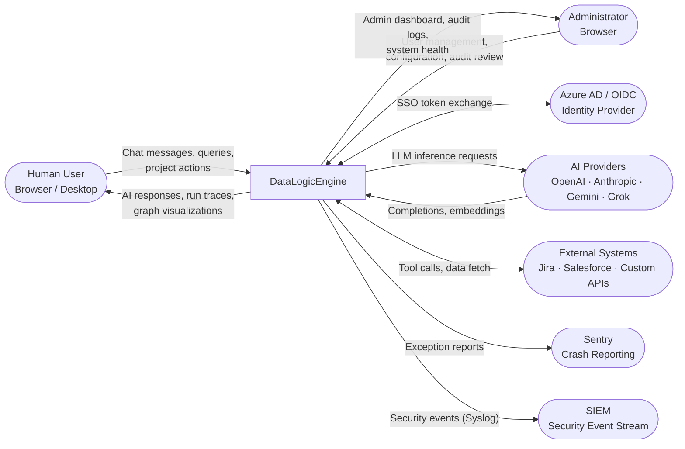
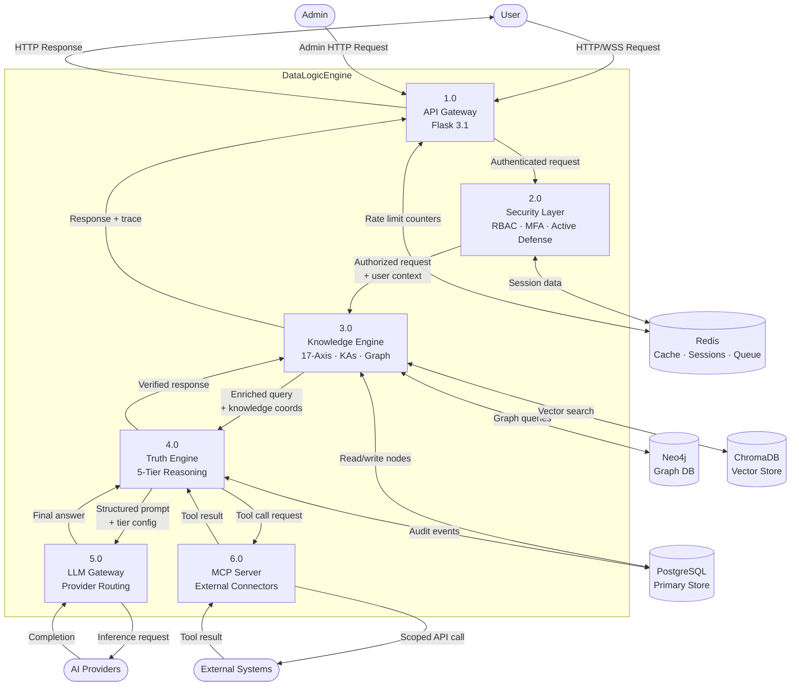
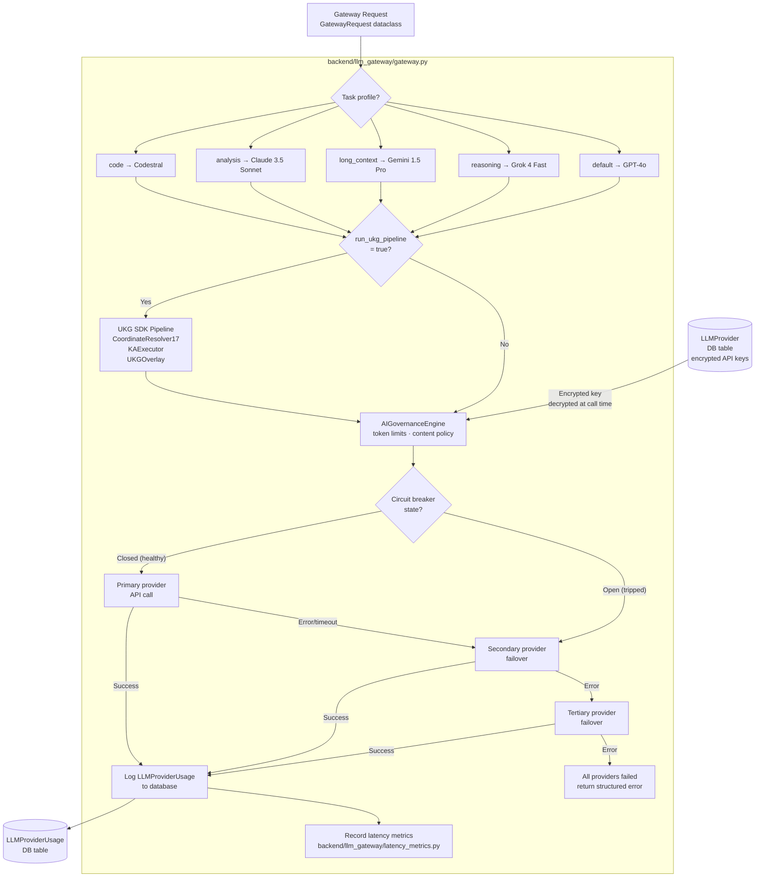
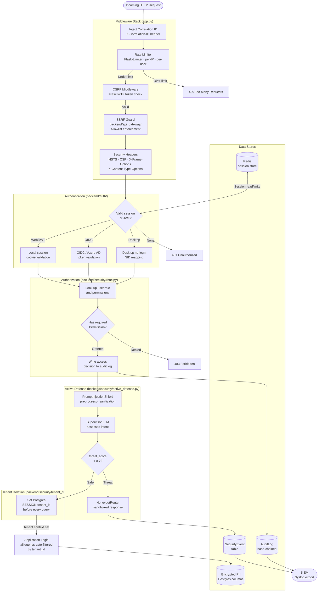
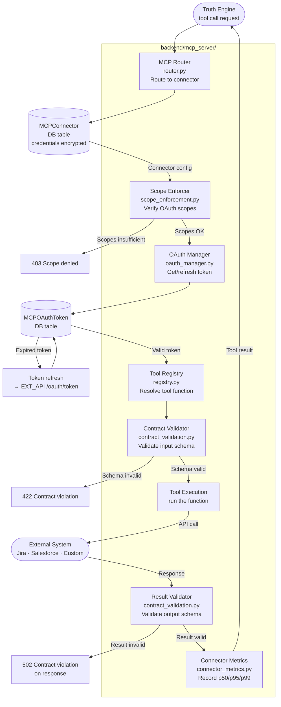
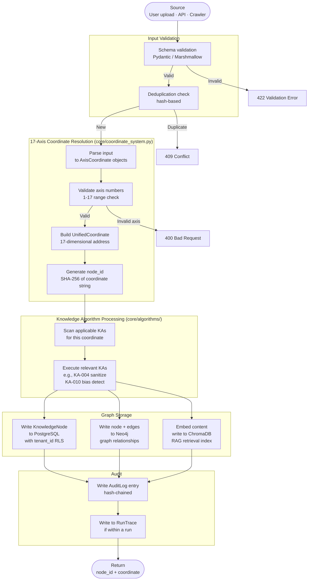
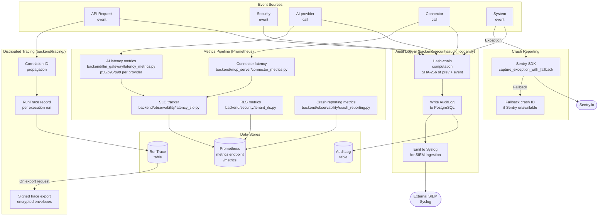
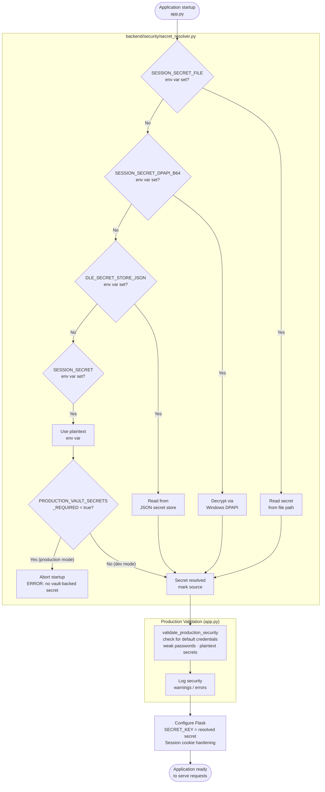

# Data Flow Diagrams — DataLogicEngine

**Document Control**

| Field | Value |
|-------|-------|
| Owner | Platform Architecture |
| Last Updated | March 2026 |
| Status | Active |
| Audience | Software engineers, architects, technical reviewers |
| Review Cadence | Every 60 days |

---

## Table of Contents

1. [Overview](#overview)
2. [DFD-01: System Context (Level 0)](#dfd-01-system-context-level-0)
3. [DFD-02: Top-Level Data Flows (Level 1)](#dfd-02-top-level-data-flows-level-1)
4. [DFD-03: Chat Message — End-to-End Flow (Level 2)](#dfd-03-chat-message--end-to-end-flow-level-2)
5. [DFD-04: LLM Gateway and Provider Routing](#dfd-04-llm-gateway-and-provider-routing)
6. [DFD-05: Security Data Flow](#dfd-05-security-data-flow)
7. [DFD-06: MCP Connector Execution Flow](#dfd-06-mcp-connector-execution-flow)
8. [DFD-07: Knowledge Graph Write Flow](#dfd-07-knowledge-graph-write-flow)
9. [DFD-08: Audit and Observability Flow](#dfd-08-audit-and-observability-flow)
10. [DFD-09: Secret Resolution Flow (Startup)](#dfd-09-secret-resolution-flow-startup)
11. [Data Classification Reference](#data-classification-reference)

---

## Overview

These data flow diagrams describe how data moves through DataLogicEngine at multiple levels of abstraction. They follow the Yourdon-DeMarco DFD notation adapted for Mermaid rendering:

- **Rectangles** — External entities (users, external systems)
- **Rounded boxes** — Processes (internal transformation steps)
- **Cylinders / DB icons** — Data stores
- **Arrows** — Data flows with labels

---

## DFD-01: System Context (Level 0)

This diagram shows DataLogicEngine as a single system with its external entities.

---

## DFD-02: Top-Level Data Flows (Level 1)

This diagram decomposes the system into its six major processing subsystems.

---

## DFD-03: Chat Message — End-to-End Flow (Level 2)

This is the most important flow. It traces a single chat message from the user through all processing layers and back.

```mermaid
graph TD
    START([User submits\nchat message])

    subgraph "Layer 1 — API Gateway (app.py)"
        MW1[Correlation ID\ninjection]
        MW2[Rate limit\ncheck]
        MW3[CSRF token\nvalidation]
        MW4[Security headers\napplication]
    end

    subgraph "Layer 2 — Security Gate (backend/security/)"
        AUTH[Session /\nJWT validation]
        RBAC_CHK[RBAC permission\ncheck\nMCP_EXECUTE or UKG_READ]
        MFA_CHK{MFA\nrequired?}
        ACTIVE_DEF[Active Defense\nSupervisor LLM\nassesses intent]
        VERDICT{Threat\nscore < 0.7?}
        HONEYPOT[Route to\nhoneypot sandbox]
    end

    subgraph "Layer 3 — Knowledge Engine (core/)"
        COORD[Resolve 17-axis\nknowledge coordinate]
        KA_SELECT[Select applicable\nKnowledge Algorithms]
        GRAPH_ENR[Enrich with\ngraph context\nNeo4j / Postgres]
        VECTOR_RTR[Vector retrieval\nChromaDB RAG]
    end

    subgraph "Layer 4 — Truth Engine (backend/truth_engine/)"
        TIER_SELECT[Tier classifier\ntrivial/moderate/high_stakes\nextreme/autonomous]
        REFINEMENT[Refinement\norchestrator\n10 possible steps]
        PERSONA[QuadPersona\nfour-perspective\nreasoning]
        TRUST_GATE[TruthGate\nbudget + compliance\nvalidation]
        META[Meta-reasoning\ncontroller]
        SAFETY[Final safety\ngate]
    end

    subgraph "Layer 5 — LLM Gateway (backend/llm_gateway/)"
        PROFILE[Model profile\nselection]
        CIRCUIT{Circuit\nbreaker\nopen?}
        PROVIDER_CALL[Primary provider\nAPI call]
        FAILOVER[Failover to\nnext provider]
        LATENCY[Record latency\np50/p95/p99]
    end

    subgraph "Layer 6 — Connectors (backend/mcp_server/)"
        MCP_SCOPE[Scope\nenforcement]
        MCP_CALL[Tool execution]
        MCP_VALIDATE[Result\ncontract validation]
        MCP_METRICS[Record connector\nlatency metrics]
    end

    subgraph "Layer 8 — Observability"
        AUDIT[Write audit\nhash-chain entry]
        TRACE[Write run\ntrace record]
        METRICS[Emit Prometheus\nmetrics]
    end

    RESP([Return response\nto user])

    START --> MW1 --> MW2 --> MW3 --> MW4
    MW4 --> AUTH
    AUTH -->|"Valid session"| RBAC_CHK
    AUTH -->|"Invalid"| E401[401 Unauthorized]

    RBAC_CHK -->|"Permitted"| MFA_CHK
    RBAC_CHK -->|"Denied"| E403[403 Forbidden]

    MFA_CHK -->|"Required + verified"| ACTIVE_DEF
    MFA_CHK -->|"Not required"| ACTIVE_DEF
    MFA_CHK -->|"Required + missing"| E403

    ACTIVE_DEF --> VERDICT
    VERDICT -->|"Safe"| COORD
    VERDICT -->|"Threat detected"| HONEYPOT
    HONEYPOT -->|"Sandboxed\ndecoy response"| RESP

    COORD --> KA_SELECT --> GRAPH_ENR --> VECTOR_RTR
    VECTOR_RTR --> TIER_SELECT

    TIER_SELECT -->|"trivial"| SAFETY
    TIER_SELECT -->|"moderate"| PERSONA
    TIER_SELECT -->|"high_stakes+"| REFINEMENT

    REFINEMENT --> PERSONA --> TRUST_GATE --> META --> SAFETY
    PERSONA --> TRUST_GATE

    SAFETY -->|"Approved"| PROFILE
    SAFETY -->|"Blocked"| E422[Safety block\nerror response]

    PROFILE --> CIRCUIT
    CIRCUIT -->|"Closed"| PROVIDER_CALL
    CIRCUIT -->|"Open"| FAILOVER
    PROVIDER_CALL -->|"Success"| LATENCY
    PROVIDER_CALL -->|"Error"| FAILOVER
    FAILOVER --> PROVIDER_CALL
    LATENCY --> MCP_SCOPE

    MCP_SCOPE -->|"Scopes valid"| MCP_CALL
    MCP_SCOPE -->|"No tool call needed"| AUDIT
    MCP_CALL --> MCP_VALIDATE --> MCP_METRICS --> AUDIT

    AUDIT --> TRACE --> METRICS --> RESP
```

---

## DFD-04: LLM Gateway and Provider Routing

---

## DFD-05: Security Data Flow

---

## DFD-06: MCP Connector Execution Flow

---

## DFD-07: Knowledge Graph Write Flow

---

## DFD-08: Audit and Observability Flow

---

## DFD-09: Secret Resolution Flow (Startup)

This flow runs at application startup before any request is served. It shows how `SESSION_SECRET` (and other secrets) are resolved through the vault-aware pipeline.

---

## Data Classification Reference

| Data Category | Examples | Storage | Encryption |
|---------------|----------|---------|-----------|
| **PII — Tier 1** | User email addresses | PostgreSQL (`users._email`) | AES-256 field encryption (EncryptionManager) |
| **PII — Tier 2** | Usernames, API key metadata | PostgreSQL | Hashed (password_hash) or plaintext column |
| **Secrets** | API keys, OAuth tokens, MFA secrets | PostgreSQL (encrypted columns) | AES-256 field encryption |
| **Session data** | Active session tokens | Redis | Redis TLS in transit; HTTPONLY/SECURE cookies |
| **Knowledge graph** | Nodes, edges, coordinates | PostgreSQL + Neo4j | At-rest encryption (disk-level) |
| **Vectors / embeddings** | RAG document chunks | ChromaDB | At-rest encryption (disk-level) |
| **Audit trail** | Access events, security events | PostgreSQL (`audit_logs`) | Hash-chained; immutable |
| **Run traces** | Execution steps, LLM outputs | PostgreSQL (`run_traces`) | Signed envelopes on export |
| **Binary assets** | Documents, exports | MinIO (S3) | Server-side encryption |
| **Metrics** | Latency counters, SLO gauges | Prometheus (in-memory) | None — no PII in metrics |
| **Crash reports** | Exception tracebacks | Sentry (external) | Sanitized before export |
