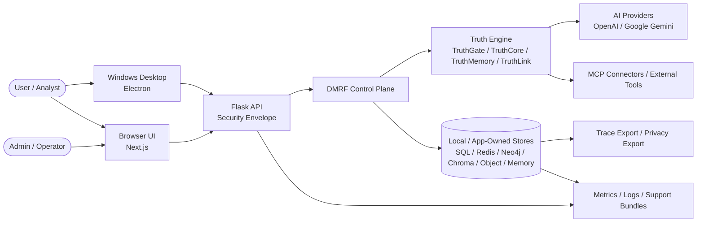
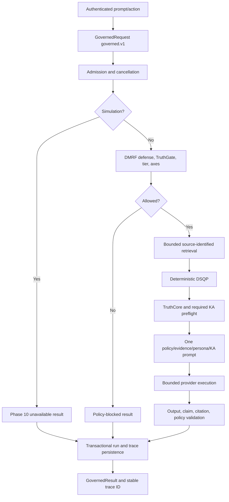
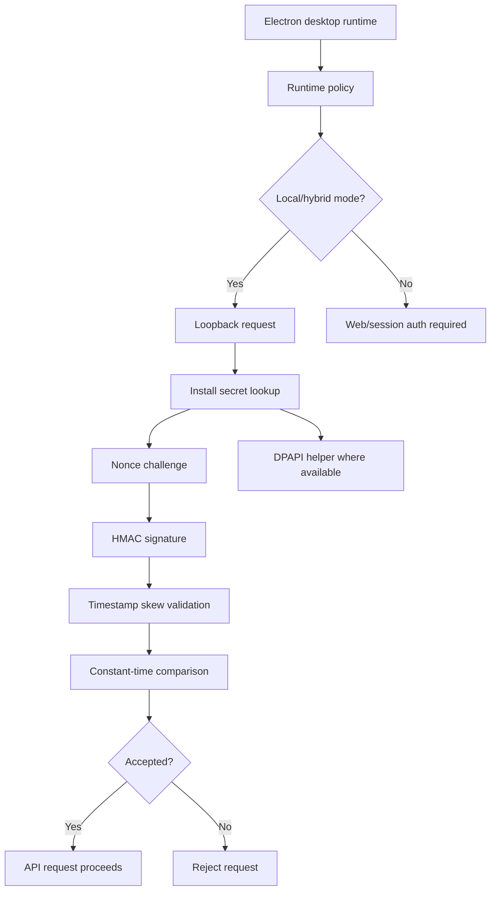
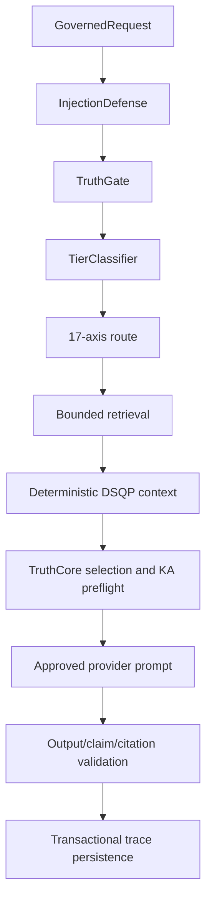
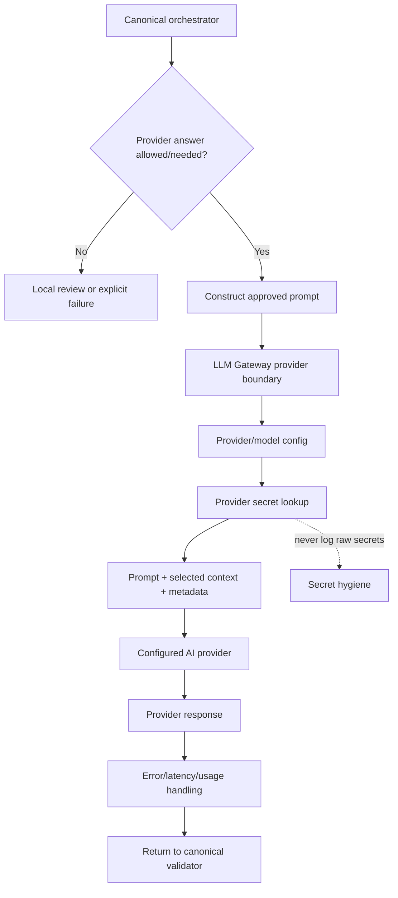
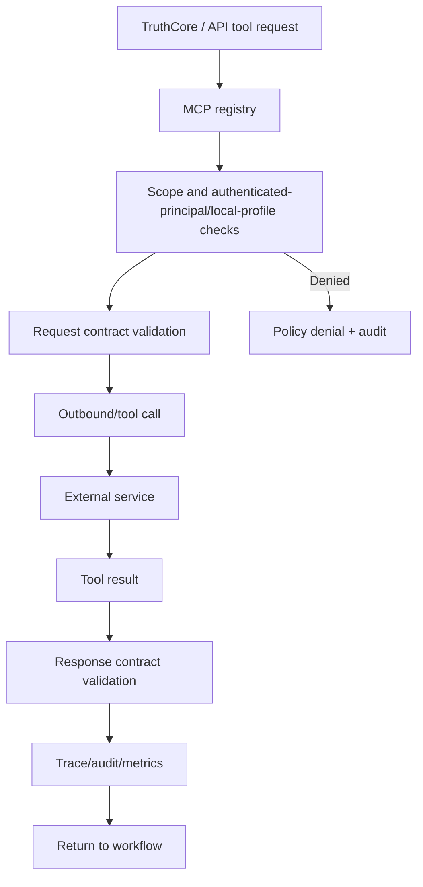
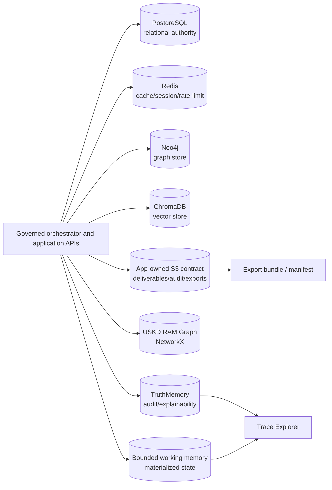
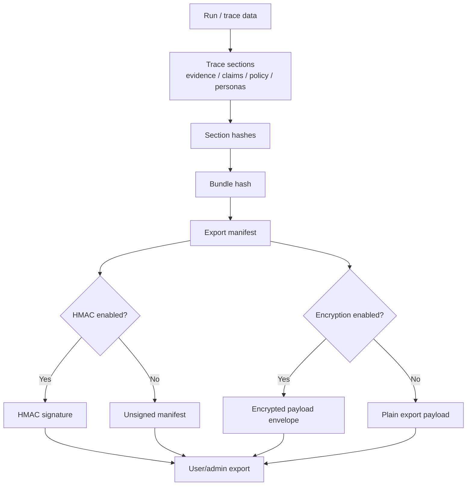
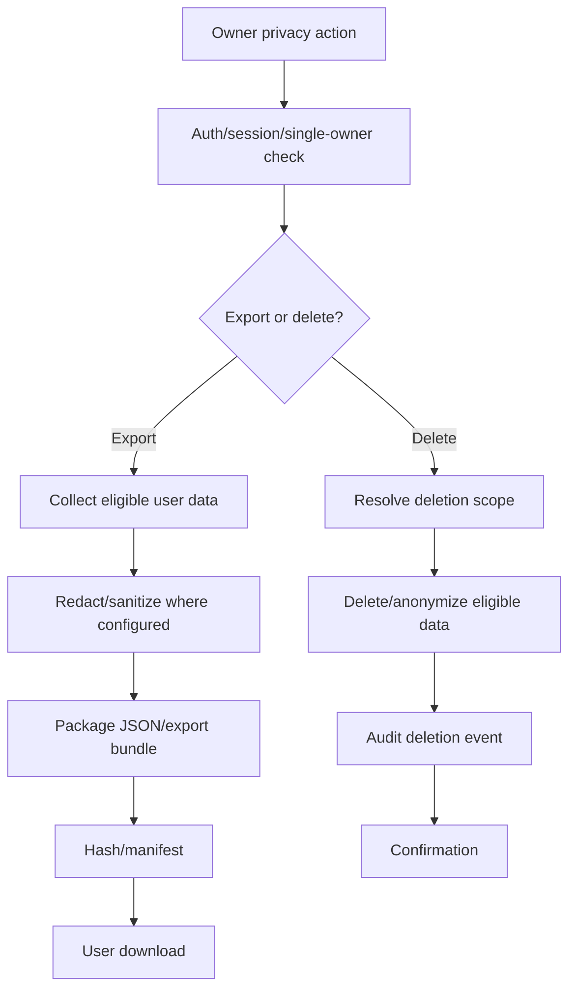
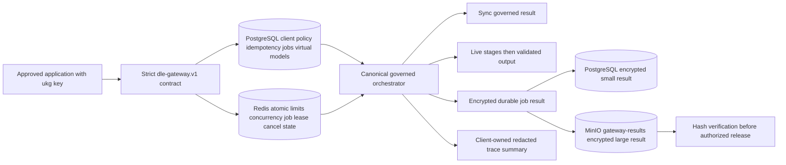

# Data Flow Diagrams — DataLogicEngine

## Document metadata

| Field | Value |
|---|---|
| Document version | v3.1.0 |
| Last updated | 2026-07-13 |
| Status | Active |
| Owner | Platform Architecture |
| Audience | Software engineers, architects, security reviewers, technical evaluators |
| Review cadence | Every 60 days |

## Purpose

Describe how data moves through the Phase 5 `governed.v1` contract, one causal
orchestrator, provider boundary, transactional trace, storage, privacy, and
observability surfaces.

These diagrams are source-of-truth data-flow references for the current architecture. Archived whitepapers may contain older exploratory diagrams and should not override this document.

## Related documents

1. `docs/ARCHITECTURE.md`
2. `docs/ARCHITECTURE_MAP.md`
3. `docs/WORKFLOW.md`
4. `docs/DATABASE_SCHEMA.md`
5. `docs/SECURITY.md`
6. `docs/PRIVACY_POLICY.md`
7. `docs/diagrams/12_end_to_end_request_lifecycle.md`
8. `docs/diagrams/07_data_storage_and_memory_architecture.md`

---

## Data classification reference

| Class | Examples | Handling guidance |
|---|---|---|
| User content | prompts, uploaded files, notes, project data | local-first by default; may be sent to providers/connectors only when configured/required. |
| Identity/session data | username, email, session, desktop auth metadata | protect with auth/session controls and avoid leaking to traces/logs. |
| Provider secrets | API keys, tokens, connector credentials | store through configured secret paths; never log raw values. |
| AI trace data | stages, evidence, claims, personas, policy decisions | audit/review value; may include sensitive context; protect export paths. |
| Operational telemetry | metrics, latency, errors, health, readiness | sanitize where needed; use for reliability and release evidence. |
| Export bundles | trace/data exports, manifests, hashes, signatures | integrity protected; user/admin controls govern sharing. |

---

## DFD-01: System context



---

## DFD-02: Top-level governed request flow



Every mode uses the same trace ID from request admission through persisted run,
stage, evidence, claim, KA, persona, policy, API, and UI state. The SDK consumes
the service result and does not add or reconstruct execution stages.

---

## DFD-03: Desktop local-auth and runtime policy



Desktop local-auth data must not be treated as a public cloud/web trust boundary.

---

## DFD-04: DMRF and Truth Engine internal flow



---

## DFD-05: Model/provider execution



Provider calls can transmit selected prompt/context data outside the local machine depending on configuration.

---

## DFD-06: MCP connector/tool execution



Connector data handling depends on connector scopes, external service policy, and user/admin configuration.

---

## DFD-07: Data, memory, and artifact flow



Local-first storage does not mean air-gapped operation. Providers/connectors/export flows can move selected data externally.

---

## DFD-08: Trace and export integrity flow



Exported files may leave the application boundary after download and should be handled according to privacy/security policy.

---

## DFD-09: Privacy export/delete flow



Deletion behavior may be constrained by backup, audit, legal, security, or deployment retention policy.

---

## DFD-10: Observability and support bundle flow

```mermaid
flowchart TD
    APP[Application runtime] --> METRICS[/metrics]
    APP --> LOGS[Runtime logs]
    APP --> ERRORS[Error records / crash IDs]
    APP --> TRACE[Trace/audit records]
    METRICS --> OPS[Operator review]
    LOGS --> SUPPORT[Support bundle generator]
    ERRORS --> SUPPORT
    TRACE --> SUPPORT
    SUPPORT --> SANITIZE[Sanitize/redact]
    SANITIZE --> BUNDLE[Support bundle artifact]
```

Support bundles must avoid raw secrets and should be treated as sensitive operational artifacts.

---

## Primary trust boundaries

1. Client/browser/Electron renderer boundary.
2. Desktop local-auth boundary.
3. API/security envelope boundary.
4. Provider/model boundary.
5. MCP connector/external tool boundary.
6. Local data-store boundary.
7. Trace/export boundary.
8. Operational logs/support bundle boundary.

## DFD-09: Client Gateway admission and durable result flow



Provider keys and all internal service credentials remain outside the client
boundary. Private network ingress remains disabled pending qualification.

## Change notes for v3.1.0

1. Added the Client Gateway contract, PostgreSQL/Redis/MinIO responsibility,
   validated-output SSE, durable result, and owned trace flow.

## Change notes for v3.0.0

1. Replaced plan-only refinement/convergence flow with the implemented
   `governed.v1` causal lifecycle and transactional trace boundary.
2. Corrected the SDK, simulation, confidence, and production-store data flows.

## Change notes for v2.7.0

1. Replaced stale tenant/user MCP scope wording with authenticated-principal/local-profile checks.
2. Updated metadata for the production top-level documentation review.

## Change notes for v2.6.0

1. Added document metadata with explicit version and update date.
2. Replaced older Active Defense/QuadPersona/legacy layered diagrams with current DMRF, Truth Engine, DSQP, and 17-axis flow.
3. Added local-first desktop auth, provider execution, MCP connector, data/memory, trace/export, privacy, and support-bundle DFDs.
4. Added data classification and trust-boundary guidance.
