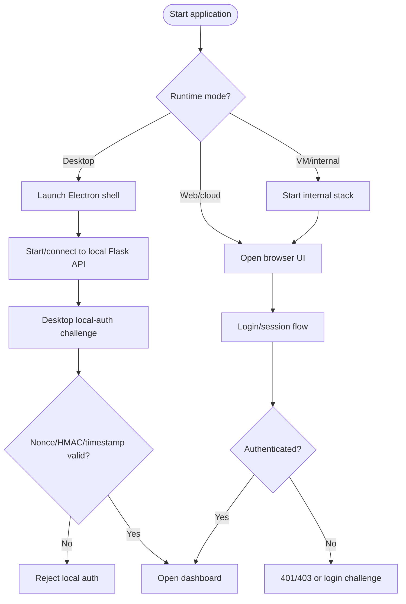
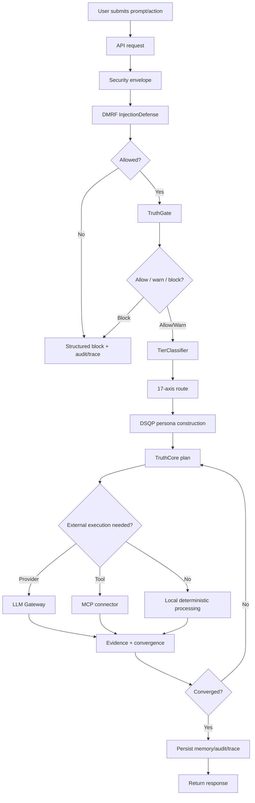
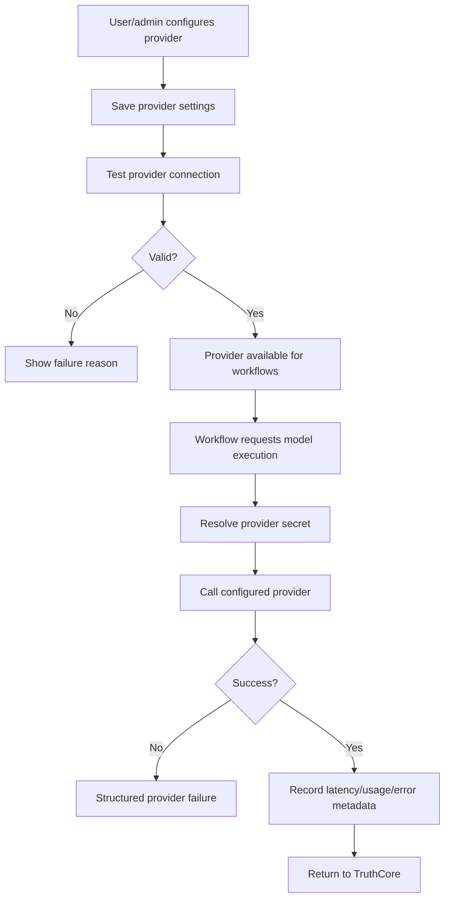
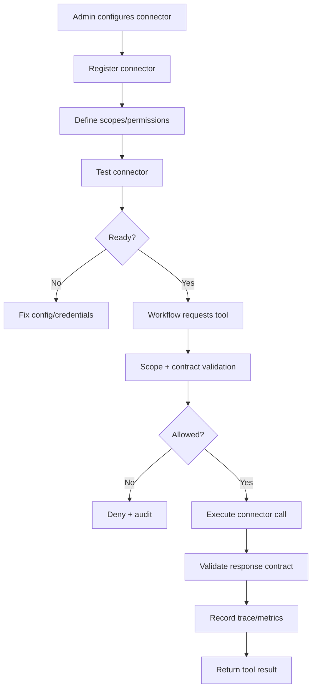
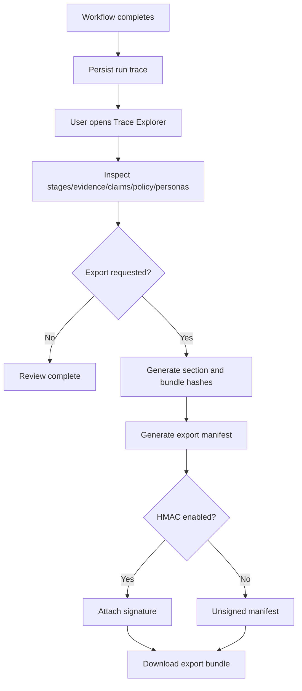
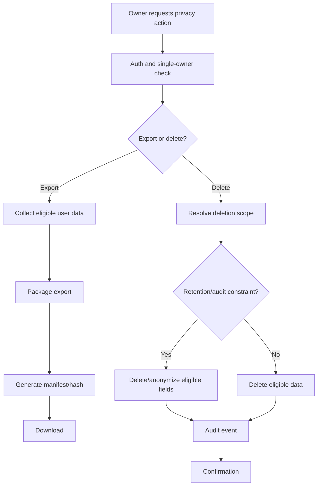
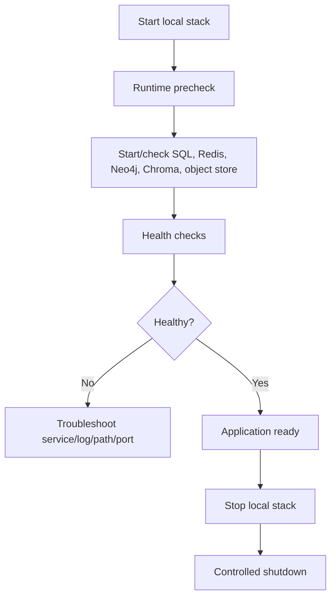
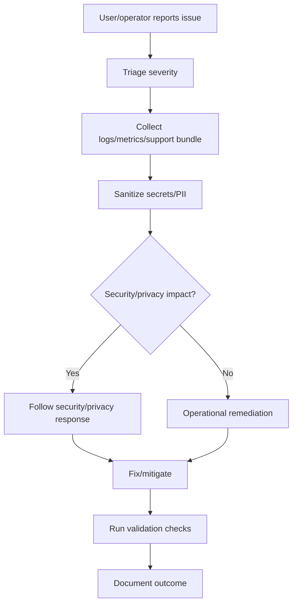
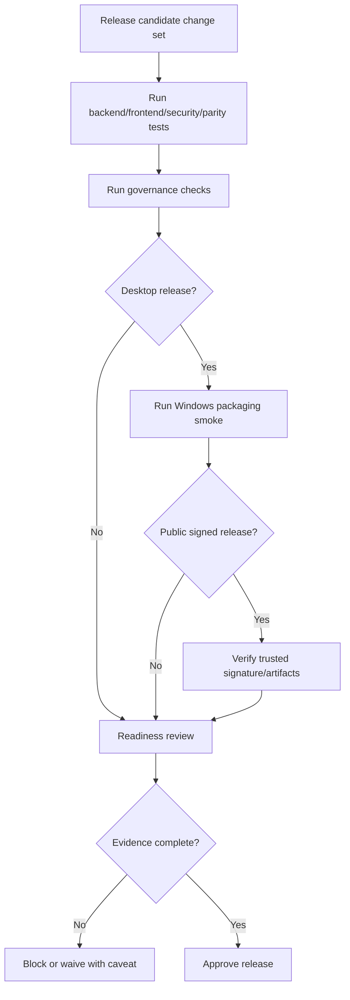
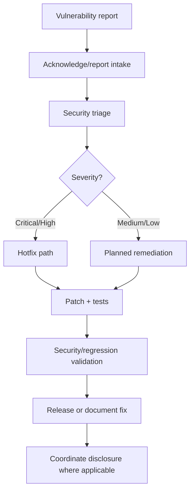

# Process Maps — DataLogicEngine

## Document metadata

| Field | Value |
|---|---|
| Document version | v2.6.0 |
| Last updated | 2026-05-30 |
| Status | Active |
| Owner | Platform Architecture |
| Audience | Engineers, product managers, QA, technical reviewers |
| Review cadence | Every 60 days |
| Notation | BPMN-inspired process maps rendered in Mermaid |

## Purpose

Describe the major business and technical processes in the current DataLogicEngine architecture.

This version aligns process flows with local-first desktop operation, Flask/API security envelope, DMRF, Truth Engine, 17-axis routing, DSQP, MCP, trace/export, privacy, testing, and release governance.

---

## PM-01: Runtime start and authentication

---

## PM-02: Governed AI request lifecycle

---

## PM-03: Provider configuration and execution

---

## PM-04: MCP connector workflow

---

## PM-05: Trace review and export

---

## PM-06: Privacy export/delete process

---

## PM-07: Local data service lifecycle

---

## PM-08: Incident/support process

---

## PM-09: Release process

---

## PM-10: Vulnerability response

## Change notes for v2.6.0

1. Added document metadata with explicit version and update date.
2. Replaced older Active Defense, SID auto-login, Knowledge Engine, and QuadPersona process flows with current DMRF/Truth Engine/DSQP/local-first process flows.
3. Added trace/export, privacy, local data lifecycle, incident, release, and vulnerability processes.
