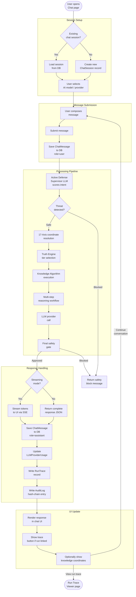
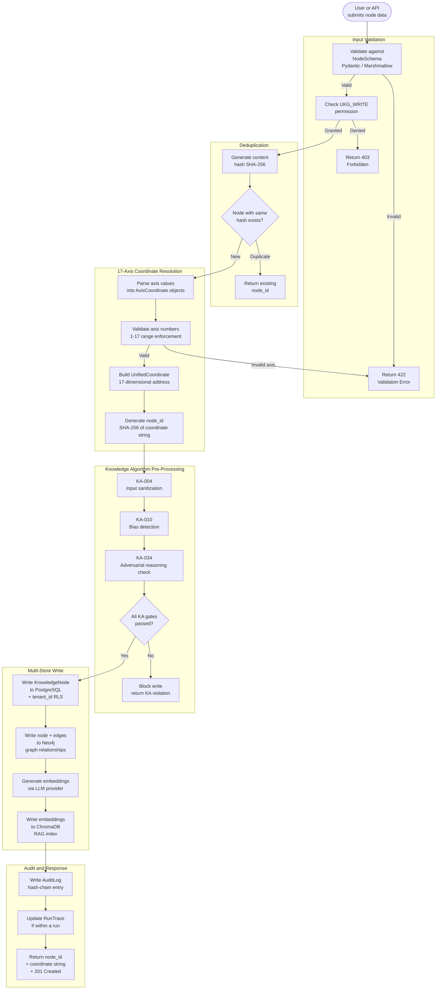
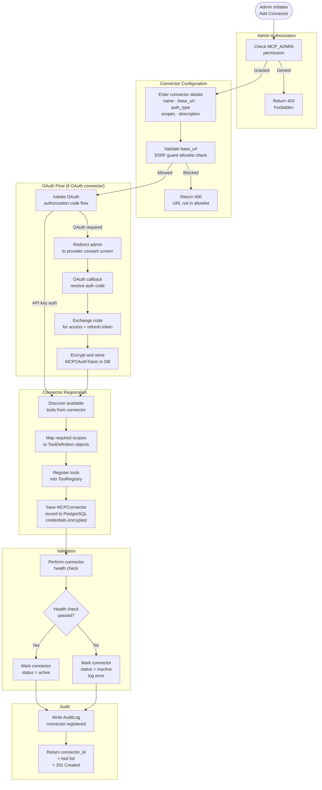
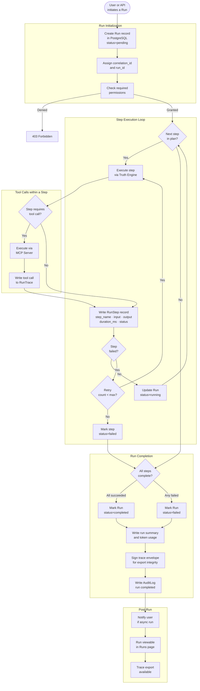
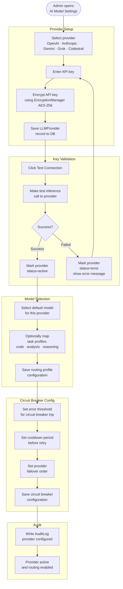
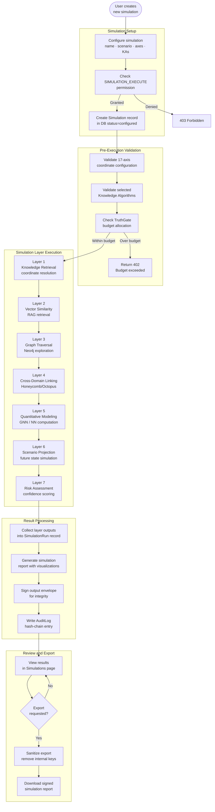
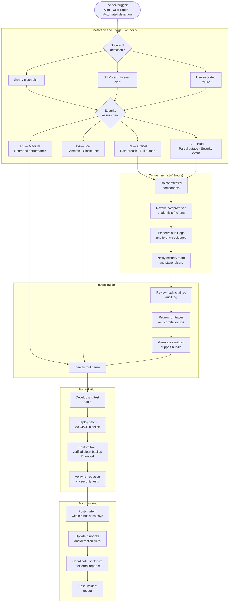
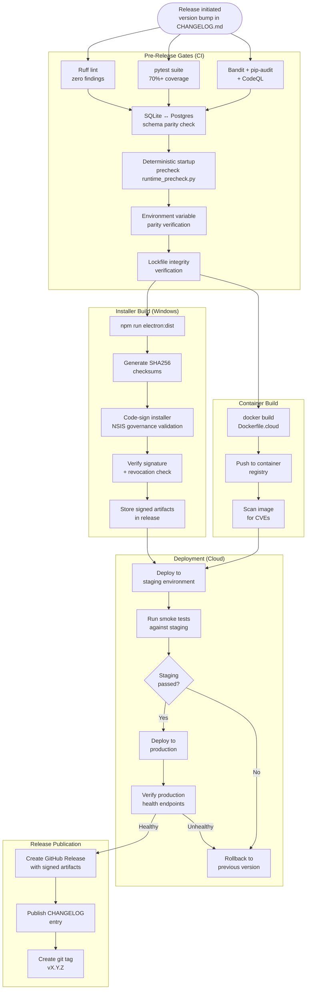
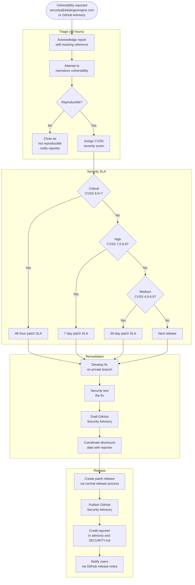

# Process Maps — DataLogicEngine

**Document Control**

| Field | Value |
|-------|-------|
| Owner | Platform Architecture |
| Last Updated | March 2026 |
| Status | Active |
| Audience | Engineers, product managers, QA, technical reviewers |
| Review Cadence | Every 60 days |
| Notation | BPMN-inspired swimlane process maps rendered in Mermaid |

---

## Table of Contents

1. [PM-01: User Onboarding and Authentication](#pm-01-user-onboarding-and-authentication)
2. [PM-02: Chat Workflow — Full Lifecycle](#pm-02-chat-workflow--full-lifecycle)
3. [PM-03: Knowledge Node Creation Workflow](#pm-03-knowledge-node-creation-workflow)
4. [PM-04: MCP Connector Registration Workflow](#pm-04-mcp-connector-registration-workflow)
5. [PM-05: Run Execution Lifecycle](#pm-05-run-execution-lifecycle)
6. [PM-06: LLM Provider Configuration Workflow](#pm-06-llm-provider-configuration-workflow)
7. [PM-07: Simulation Execution Workflow](#pm-07-simulation-execution-workflow)
8. [PM-08: Incident Response Process](#pm-08-incident-response-process)
9. [PM-09: Release and Deployment Process](#pm-09-release-and-deployment-process)
10. [PM-10: Security Vulnerability Response Process](#pm-10-security-vulnerability-response-process)

---

## PM-01: User Onboarding and Authentication

This map covers the full lifecycle from a new user arriving at the application through to an authenticated, active session.

```mermaid
flowchart TD
    START([New user\narrives at application])

    subgraph "Mode Detection"
        MODE{Deployment\nmode?}
        DESKTOP[Desktop / Electron\nno-login path]
        WEB[Web application\nlogin required]
    end

    subgraph "Desktop Path"
        SID_LOOKUP[Look up Windows SID\nfrom OS context]
        SID_MATCH{SID matches\nexisting user?}
        AUTO_LOGIN[Auto-login as\nlocal owner user]
        SID_CREATE[Create new user\nfrom SID + hostname]
    end

    subgraph "Web Login Path"
        LOGIN_PAGE[Login page]
        AUTH_METHOD{Authentication\nmethod?}

        subgraph "Local Auth"
            ENTER_CREDS[Enter username\n+ password]
            CHK_LOCK{Account\nlocked?}
            CHK_PASS[Verify password\nhash]
            PASS_FAIL[Increment failed\nattempts counter]
            LOCK_CHK{Failed attempts\n≥ threshold?}
            LOCK_ACCT[Lock account\nuntil cooldown]
        end

        subgraph "OIDC / Azure AD"
            REDIRECT_OIDC[Redirect to\nAzure AD / Entra ID]
            OIDC_CALLBACK[OAuth callback\ntoken exchange]
            OIDC_MAP[Map OIDC claims\nto local user]
        end

        MFA_GATE{MFA\nenabled?}
        TOTP_PROMPT[Prompt for\nTOTP code]
        TOTP_VERIFY[Verify TOTP\nor backup code]
        TOTP_FAIL[MFA verification\nfailed — retry]
        MAX_MFA{Max MFA\nattempts?}

        CREATE_SESSION[Create encrypted\nRedis session]
        JWT_ISSUE[Issue JWT\n(API clients)]
    end

    subgraph "Post-Login"
        ROLE_LOAD[Load user roles\nand permissions]
        TENANT_SET[Set tenant_id\nin request context]
        LAST_LOGIN[Update\nlast_successful_login]
        AUDIT_LOGIN[Write login\naudit event]
        DASHBOARD[Redirect to\nDashboard]
    end

    START --> MODE
    MODE -->|"Electron"| DESKTOP
    MODE -->|"Browser"| WEB

    DESKTOP --> SID_LOOKUP --> SID_MATCH
    SID_MATCH -->|"Found"| AUTO_LOGIN
    SID_MATCH -->|"New"| SID_CREATE --> AUTO_LOGIN

    WEB --> LOGIN_PAGE --> AUTH_METHOD
    AUTH_METHOD -->|"Local"| ENTER_CREDS
    AUTH_METHOD -->|"OIDC"| REDIRECT_OIDC

    ENTER_CREDS --> CHK_LOCK
    CHK_LOCK -->|"Locked"| E423[423 Account locked\nshow unlock instructions]
    CHK_LOCK -->|"Active"| CHK_PASS
    CHK_PASS -->|"Match"| MFA_GATE
    CHK_PASS -->|"No match"| PASS_FAIL --> LOCK_CHK
    LOCK_CHK -->|"Yes"| LOCK_ACCT --> E423
    LOCK_CHK -->|"No"| LOGIN_PAGE

    REDIRECT_OIDC --> OIDC_CALLBACK --> OIDC_MAP --> MFA_GATE

    MFA_GATE -->|"Disabled"| CREATE_SESSION
    MFA_GATE -->|"Enabled"| TOTP_PROMPT --> TOTP_VERIFY
    TOTP_VERIFY -->|"Valid"| CREATE_SESSION
    TOTP_VERIFY -->|"Invalid"| TOTP_FAIL --> MAX_MFA
    MAX_MFA -->|"No"| TOTP_PROMPT
    MAX_MFA -->|"Yes"| E423

    AUTO_LOGIN & CREATE_SESSION --> ROLE_LOAD
    ROLE_LOAD --> TENANT_SET --> LAST_LOGIN --> AUDIT_LOGIN --> JWT_ISSUE --> DASHBOARD
```

---

## PM-02: Chat Workflow — Full Lifecycle

This is the primary user workflow. It covers submitting a message and receiving a response.



---

## PM-03: Knowledge Node Creation Workflow



---

## PM-04: MCP Connector Registration Workflow



---

## PM-05: Run Execution Lifecycle

A "Run" is the platform's fundamental unit of traceable work — a complete, recorded execution of a knowledge workflow.



---

## PM-06: LLM Provider Configuration Workflow



---

## PM-07: Simulation Execution Workflow



---

## PM-08: Incident Response Process



---

## PM-09: Release and Deployment Process



---

## PM-10: Security Vulnerability Response Process


