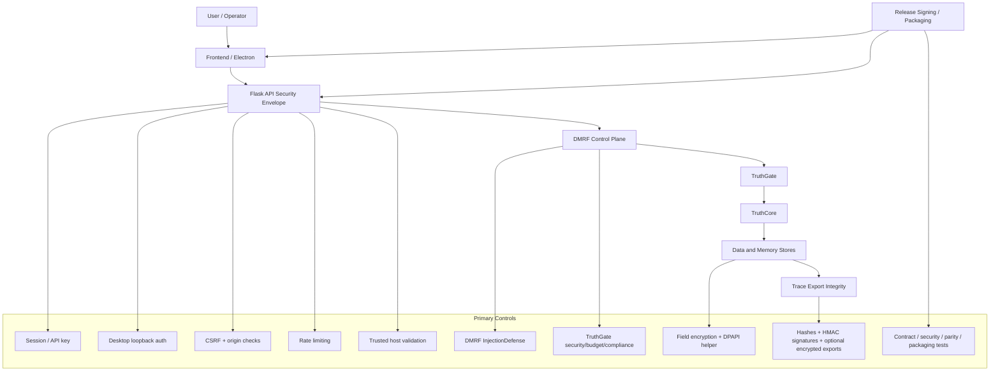

# Enterprise Security and Compliance

## Document metadata

| Field | Value |
|---|---|
| Document version | v2.11.0 |
| Last updated | 2026-07-13 |
| Status | Active |
| Owner | Security Engineering |
| Review cadence | Every 30 days |

## Purpose

Define DataLogicEngine security controls, identity/access patterns, local-first desktop protections, data protection measures, AI safety controls, trace/export integrity, and audit/compliance posture.

This version reflects the current architecture: canonical `/api/v1/*` APIs, DMRF injection defense, TruthGate, Truth Engine v7.3, desktop loopback auth, DPAPI helper, export integrity, multi-store data protections, MCP governance, and signed-release controls.

## Audience

1. Security engineers
2. Platform engineers
3. Compliance and audit stakeholders
4. Incident response operators
5. Release engineers
6. Technical judges and external reviewers

## Related documents

1. `docs/ARCHITECTURE.md`
2. `docs/API.md`
3. `docs/DATABASE_SCHEMA.md`
4. `docs/DEPLOYMENT.md`
5. `docs/PRODUCTION_READINESS.md`
6. `docs/OPERATIONAL_RUNBOOKS.md`
7. `docs/SDLC_SSDF_MAPPING.md`
8. `docs/AI_MANAGEMENT_SYSTEM_42001.md`
9. `docs/diagrams/06_local_first_security_model.md`
10. `docs/diagrams/05_truth_engine_architecture.md`

---

## Security architecture overview

DataLogicEngine uses layered security across the product, API, AI control plane, data plane, desktop runtime, and release pipeline.



Security is implemented as a defense-in-depth model, not a single perimeter.

### Phase 3 internal data-plane controls

The engineering profile generates unique service credentials per installation,
stores the credential vault through DPAPI with restrictive Windows ACLs, and
passes credentials to rootless containers through app-owned secrets rather than
a plaintext production `.env`. Service endpoints bind to installation-specific
loopback ports. Containers use immutable digest verification, app/installation
identity labels, read-only root filesystems where supported, dropped
capabilities, no-new-privileges, bounded memory/CPU/process resources, and a
private app network. Foreign listeners or resources are rejected, not adopted.

Required production storage clients fail closed on missing service health or
required audit/simulation/deliverable object writes. The Storage UI receives
safe supervisor status and does not expose editable cloud credentials or
internal ports.

These are engineering controls, not an independent security approval. TLS
policy, data-at-rest limitations, exact image/runtime vulnerability review,
redistribution review, clean signed-installer behavior, supported-host failure
testing, and coordinated recovery remain release blockers. SeaweedFS remains a
production-disabled candidate under Proposed ADR-0004.

---

## Identity and access management

Supported identity/authentication patterns:

1. **Session authentication** — cookie-based frontend sessions.
2. **API key / bearer token authentication** — programmatic access where enabled.
3. **Desktop local auth** — loopback/Electron-only local-first auth flow (the primary single-mode path).

Single-mode / OS-level auth: there is one owner — whoever has OS access to the machine. The former multi-user surfaces (SSO/OIDC, MFA/TOTP, and application RBAC) were removed in the auth deprecation.

Security expectations:

- Canonical `/api/v1/*` auth failures must return JSON-native `401`/`403` responses, not browser redirects.
- Admin and retention routes must enforce the single-owner auth check.
- API principal resolution must not assume browser session identity when API key identity is used.
- Auth checks should fail closed when desktop/session identity state is ambiguous.

Relevant implementation:

- `backend/routes/auth_routes.py`
- `backend/auth/api_decorators.py`
- `frontend/contexts/AuthContext.tsx`
- `tests/contract/test_canonical_v1_route_contracts.py`

---

## Desktop local-auth security

Desktop authentication is local/hybrid runtime security. It is not a cloud trust mechanism.

Current controls:

1. loopback/Electron runtime policy;
2. per-install local secret;
3. one-time challenge nonce;
4. nonce TTL;
5. HMAC-SHA256 challenge response;
6. per-request HMAC signature;
7. unique per-request nonce with replay rejection;
8. timestamp skew validation;
9. constant-time signature comparison;
10. main-process-only purpose signature for path-bearing backup/ingestion calls;
11. desktop auto-login tests.

Security rules:

- Desktop auth must never be accepted as a public cloud trust boundary.
- Cloud mode must disable desktop-only auth assumptions.
- Nonce reuse and stale timestamps must fail.
- Desktop local-auth failure should produce explicit, logged failure behavior.

Relevant implementation:

- `backend/security/desktop_local_auth.py`
- `frontend/lib/runtime/policy.ts`
- `frontend/contexts/AuthContext.tsx`
- `tests/integration_routes/test_desktop_auto_login_security.py`

---

## API and network security

Required controls:

1. CSRF token/origin validation.
2. CORS allowlist.
3. Trusted host validation.
4. Secure session cookies.
5. HTTPS enforcement in production web/cloud mode.
6. Rate limiting.
7. JSON-native API errors.
8. Sanitized 5xx responses.
9. Request size/limit controls.
10. Security headers such as CSP, HSTS, X-Frame-Options, and X-Content-Type-Options where configured.

Operational probes intentionally exposed without authentication:

1. `/health`
2. `/live`
3. `/ready`

`/metrics`, `/health/cache`, and `/api/v1/system/diagnostics/health` are
authenticated diagnostic surfaces. Public `/health` does not include
configuration, database, credential-source, or storage-detail fields.

Canonical route policy:

- `/api/v1/*` is the supported route family.
- Legacy aliases are transition-only and should emit deprecation headers.

### Client Gateway boundary

The external Client Gateway is header-authenticated and does not use browser
CSRF semantics. Desktop owner mutations retain session, origin, and CSRF
controls. The production gateway requires:

1. high-entropy copy-once `ukg_` secrets with protected hash-only verification,
   explicit scopes, expiry, rotation, revocation, and audit tombstones;
2. no external-key access to provider credentials, owner/admin APIs, or internal
   PostgreSQL, Redis, Neo4j, ChromaDB, MinIO, supervisor, or diagnostics;
3. strict request/nested-message schemas and pre-execution body/message/metadata/
   token/deadline limits;
4. atomic Redis minute/day/concurrency enforcement with fail-closed production
   behavior when Redis policy state is unavailable;
5. PostgreSQL idempotency authority and durable jobs, Redis job leases/cancel
   state, encrypted payloads, and hash-verified S3 retention for large results;
6. client-owned trace/result reads, explicit `trace:read`/`evidence:read`, and
   404 isolation for another client's identifiers;
7. logs, errors, metrics, audit, exports, and support bundles that omit client
   secrets, provider keys, authorization headers, prompt/response content, and
   certificate private material; and
8. CORS disabled plus loopback binding by default.

`private_windows_gateway` remains fail-closed. It cannot start until TLS/mTLS,
certificate lifecycle, firewall, interface/address restriction, two-machine,
security, failure/recovery, and uninstall qualification passes. Public internet,
anonymous access, browser registration, and multi-tenant operation remain out
of scope. See `docs/PRIVATE_GATEWAY_RUNBOOK.md`.

---

## AI safety and governed reasoning security

DataLogicEngine security extends into AI reasoning.

Primary AI controls:

1. **DMRF InjectionDefense** — detects prompt injection, logical traps, obfuscation, persona hijack, and resource-exhaustion patterns.
2. **TruthGate** — evaluates trust, budget, priority, compliance, PII, and blocked-pattern controls before deeper processing.
3. **TierClassifier** — classifies requests into trivial, moderate, high-stakes, extreme, or autonomous tiers.
4. **17-axis router** — binds request context to explicit coordinates, including risk and ethics/trust axes.
5. **DSQP personas** — structured personas reduce vague role-prompting and support explainable review.
6. **TruthCore** — applies tiered workflow planning and execution.
7. **EvidenceModel and ConvergencePolicy** — incorporate freshness and confidence thresholds.
8. **Trace Explorer** — exposes evidence, claims, personas, policy decisions, and run metadata for review.

Fail-safe behavior:

- InjectionDefense blocks return structured `ok=false` results.
- TruthGate blocks stop deeper execution.
- Provider/gateway failures must not silently return synthetic success.
- Low-confidence or stale-evidence conditions should trigger refinement or safe fallback.

Relevant implementation:

- `backend/dmrf/orchestrator.py`
- `backend/dmrf/injection_defense.py`
- `backend/dmrf/evidence_model.py`
- `backend/dmrf/convergence_policy.py`
- `backend/truth_engine/truth_gate/gateway.py`
- `backend/truth_engine/truth_core/engine.py`

---

## Data protection

### In transit

Production web/cloud deployments require:

1. HTTPS.
2. strict trusted-host configuration.
3. production-safe CORS allowlist.
4. secure cookies.
5. no loopback trust assumptions.

### At rest

Current data protection layers:

1. SQL model-level encryption where fields use the encryption manager.
2. Windows DPAPI helper for local protected data.
3. local filesystem permissions/ACLs for app-owned databases and object stores.
4. trace export hashing/signing/encryption options.
5. provider and internal-service credential storage through DPAPI-protected values;
6. Electron `safeStorage` for desktop-managed runtime secrets;
7. restrictive current-user/System ACLs on secret and settings files;
8. backup exclusion for `.env`, settings, logs, and secret/key material.

Implementation notes:

- Current `EncryptionManager` writes new field-level encrypted payloads with AES-256-GCM and records `AES-256-GCM` in key registry metadata.
- Legacy `Fernet-AES-128-CBC` key registry entries remain decryptable for backward compatibility with data encrypted before the AES-256-GCM upgrade.
- DPAPI protection is platform-provided through Windows `win32crypt` when available.

Relevant implementation:

- `backend/security/encryption_manager.py`
- `backend/security/dpapi_store.py`
- `backend/security/export_integrity.py`
- `backend/security/windows_acl.py`
- `docs/THREAT_MODEL.md`

## Phase 1 trust-boundary closure

The live surface inventory classifies Flask, GraphQL, Electron IPC, MCP, file,
and listener surfaces. The desktop listener is loopback-only before Phase 8;
untrusted Host/Origin values and proxy Host overrides fail closed. Electron uses
typed preload capabilities, exact origin parsing, bounded schemas, timeouts,
cancellation, and single-use path tokens. Provider egress is backend-only.

Public errors use stable messages/codes and correlation metadata; raw exception
details remain in redacted local logs. The authoritative threat analysis and
residual risks are in `docs/THREAT_MODEL.md`.

---

## Multi-store data security

DataLogicEngine uses multiple data stores with different control requirements.

| Store | Security control focus |
|---|---|
| SQLAlchemy DB | auth/principal context, vestigial local-profile scoping columns, migrations, encrypted fields, audit records. |
| Redis | session/cache/rate-limit/queue isolation and secure configuration. |
| Neo4j | graph scope, connection security, and local profile/app-context traversal where applicable. |
| ChromaDB | Pinned Rust single-node service, loopback/rootless containment, no telemetry, caller-supplied vectors only, and fail-closed rejection of persisted embedding-function/schema configuration. GHSA-f4j7-r4q5-qw2c remains release-blocking until an upstream patch is qualified. |
| Object store | bucket validation, key normalization, traversal rejection, hashes, metadata sidecars. |
| USKD NetworkX graph | controlled source loading and runtime memory containment. |
| UnifiedMemory | local JSON persistence controls and safe recall behavior. |
| TruthMemory | audit/explainability integrity and session artifact controls. |

Object-store safety controls include null-byte rejection, absolute-path rejection, `..` traversal rejection, resolved-path containment, strict bucket names, and SHA-256 ETags.

---

## Tenant scope (single-mode)

The app runs in **single operating mode with OS-level auth** — one owner, even on
a cloud single-tenant VM. Application-level multi-tenant isolation has been
removed: the PostgreSQL row-level-security module (`backend/security/tenant_rls.py`),
its app wiring, its `/metrics` signal, and its test were deleted in auth
deprecation Phase D.

Security expectations:

1. Several tables still carry a vestigial `tenant_id` column (intentionally
   wider than RLS — a separate concern), but it is not enforced by an RLS policy.
2. Tenant scope is the local profile/app context for the single owner.
3. The security boundary is the OS account plus desktop local-auth (per-install
   secret, nonce/HMAC signed loopback), not application tenancy.

---

## MCP and connector security

MCP connector security controls:

1. connector/server registry access control;
2. connector credential handling and scope configuration;
3. scope enforcement;
4. input/output schema validation;
5. connector analytics and audit logging;
6. SSRF/upstream allowlist controls where applicable;
7. admin-only server management routes.

Incident signals:

- repeated `MCP_SCOPE_DENIED`;
- schema validation failures;
- unexpected upstream target;
- connector credential or token-source failure;
- connector latency SLO surge.

Relevant implementation:

- `backend/mcp_server/`
- `backend/routes/mcp_routes.py`
- `frontend/components/mcp/`

---

## Trace, audit, and export integrity

Security-relevant AI execution evidence can be reviewed through traces and exports.

Trace/evidence surfaces:

1. DMRF step records and FROST snapshots.
2. TruthMemory audit/explainability data.
3. Trace runs, stages, evidence, claims, personas, KAs, policy decisions, memory events, and artifacts.
4. Trace Explorer UI.
5. Export integrity manifest.

Export integrity pipeline:

```text
trace bundle
  -> section hashes
  -> bundle SHA-256
  -> optional HMAC-SHA256 signature
  -> optional encrypted payload
  -> manifest/envelope
```

Relevant implementation:

- `backend/security/export_integrity.py`
- `backend/tracing/`
- `backend/truth_engine/truth_memory/manager.py`
- `frontend/app/runs/`

---

## Release and supply-chain security

Release security controls:

1. CI backend, frontend, packaging, governance, and Docker build verification.
2. Dependency audit through `pip-audit` in CI.
3. Lockfile governance.
4. Environment parity validation.
5. Runtime precheck.
6. Schema parity validation.
7. Documentation reference validation.
8. Windows packaging smoke.
9. NSIS governance.
10. Installer integrity verification.
11. Installer-mode install/uninstall smoke where release scope requires install behavior evidence.
12. Trusted Windows code signing for production distribution.
13. Signature verification before release distribution.

Required signing path:

- `.github/workflows/release-installer-signing.yml`
- `scripts/windows/verify_signing_certificate_health.ps1`
- `scripts/windows/sign_release_installers.ps1`
- `scripts/windows/verify_installer_signature.ps1`

Local dev certificates are not production release evidence.

---

## Security testing and validation

Required security validation includes:

1. `tests/security/`
2. `tests/contract/`
3. `tests/parity/`
4. `tests/integration_routes/test_desktop_auto_login_security.py`
5. Truth Engine tests.
6. DMRF-adjacent tests.
7. export authenticity tests.
8. audit logger immutable replica tests where present.
9. runtime precheck.
10. lockfile and environment governance.
11. installer integrity, packaging smoke, installer-mode smoke, and signing validation for release.

Common commands:

```powershell
python -m pytest -q --no-cov tests\security\test_security_headers.py tests\security\test_request_limits.py
python -m pytest -q --no-cov tests\contract\test_api_contract.py tests\contract\test_canonical_v1_route_contracts.py
python .\scripts\runtime_precheck.py --strict --skip-ports --allow-env-from-process
python .\scripts\verify_lockfiles.py
python .\scripts\verify_environment_parity.py --strict
```

---

## Security incident response

Use `docs/OPERATIONAL_RUNBOOKS.md` for incident-specific procedures covering:

1. DMRF injection-defense block/bypass.
2. TruthGate failure.
3. PII leakage.
4. unauthorized access attempt.
5. desktop local-auth failure.
6. local object/vector/graph store failure.
7. runtime precheck failure.
8. schema parity/migration failure.
9. installer signature failure.
10. packaging smoke failure.
11. export/audit integrity failure.
12. MCP scope/contract failure.
13. latency SLO surge.
14. frontend trace-review failure.

Vulnerability disclosures should be sent to `security@datalogicengine.com` when that mailbox is operational for the project. Sensitive disclosures should use encrypted communication when available.

---

## Reviewer verification path

A security reviewer should inspect these files in order:

1. `docs/diagrams/06_local_first_security_model.md`
2. `docs/diagrams/05_truth_engine_architecture.md`
3. `docs/diagrams/09_dmrf_control_plane_deep_dive.md`
4. `app.py`
5. `backend/security/desktop_local_auth.py`
6. `backend/security/dpapi_store.py`
7. `backend/security/encryption_manager.py`
8. `backend/security/export_integrity.py`
9. `backend/dmrf/injection_defense.py`
10. `backend/truth_engine/truth_gate/gateway.py`
11. `backend/truth_engine/truth_memory/manager.py`
12. `backend/storage/object_store.py`
13. `backend/auth/api_decorators.py`
14. `tests/security/`
15. `tests/contract/`
16. `.github/workflows/ci.yml`
17. `.github/workflows/release-installer-signing.yml`

---

## Change notes for v2.11.0

1. Added the Phase 8 client-principal, scope, idempotency, Redis admission/job,
   encrypted retained-result, trace ownership, redaction, and fail-closed private
   listener controls.

## Change notes for v2.10.0

1. Recorded the critical ChromaDB advisory disposition: locked Rust server,
   constrained Python client, hostile collection-configuration rejection, open
   Dependabot release blocker, and no production approval without a patch.

## Change notes for v2.9.0

1. Added the Phase 3 credential, loopback, rootless-container, immutable-
   identity, fail-closed adapter, and safe-status controls.
2. Kept independent security, TLS/data-at-rest, vulnerability, installer, and
   object-store selection gates explicitly open.

## Change notes for v2.8.0

1. Documented Phase 1 listener, Electron, replay, DPAPI/ACL, backup, and public-error controls.
2. Separated public-safe health from authenticated diagnostics and metrics.

## Change notes for v2.7.0

1. Removed stale OAuth-token lifecycle wording from MCP security guidance and replaced it with connector credential, token-source, scope, and contract controls.
2. Reframed vestigial tenant-scope wording around local profile/app context instead of active multi-tenant traversal.
3. Added installer integrity and installer-mode install/uninstall smoke to release and security-validation evidence.

## Change notes for v2.6.0

1. Added document metadata with explicit version and update date.
2. Reframed the security guide around current DMRF, TruthGate, Truth Engine, local-first desktop auth, export integrity, and multi-store security architecture.
3. Added desktop local-auth security section.
4. Added AI safety and governed reasoning security section.
5. Added multi-store data security, MCP security, trace/export integrity, and release supply-chain security sections.
6. Updated field-encryption notes after `EncryptionManager` was upgraded to AES-256-GCM with legacy Fernet decrypt compatibility.
7. Added security reviewer verification path tied to actual implementation files.
