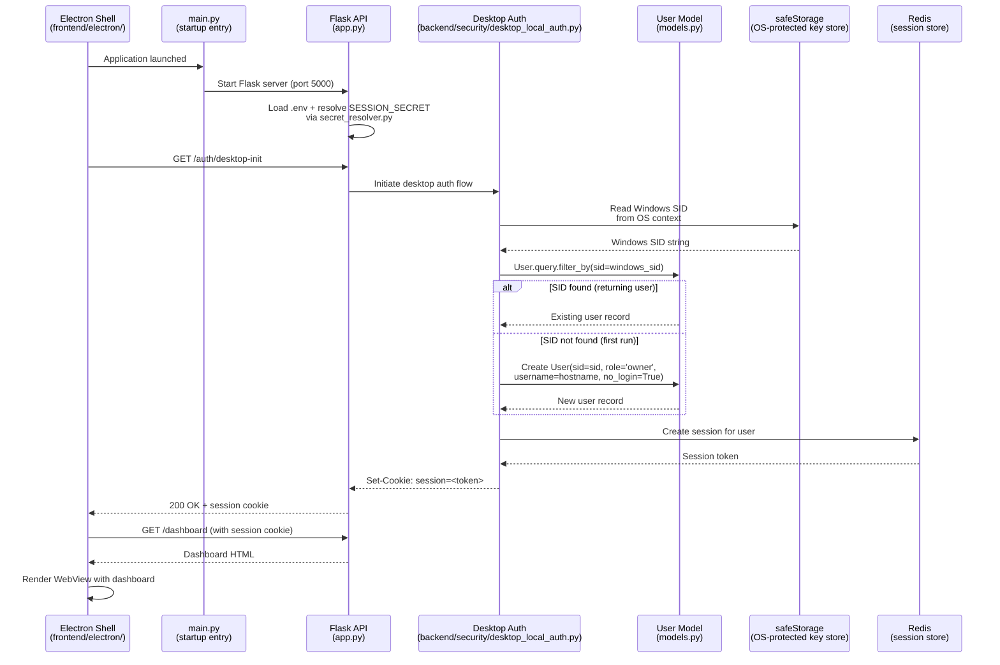
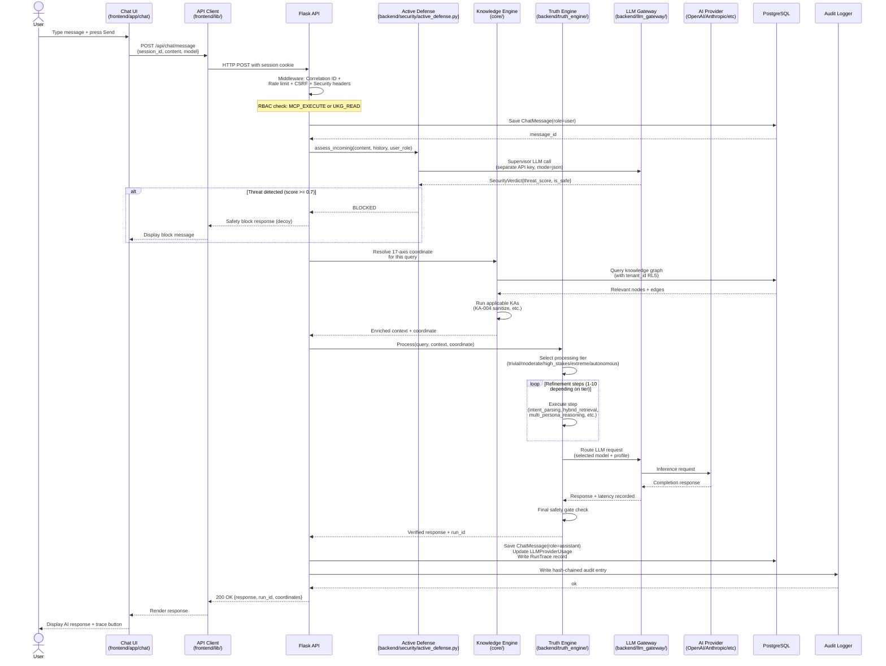
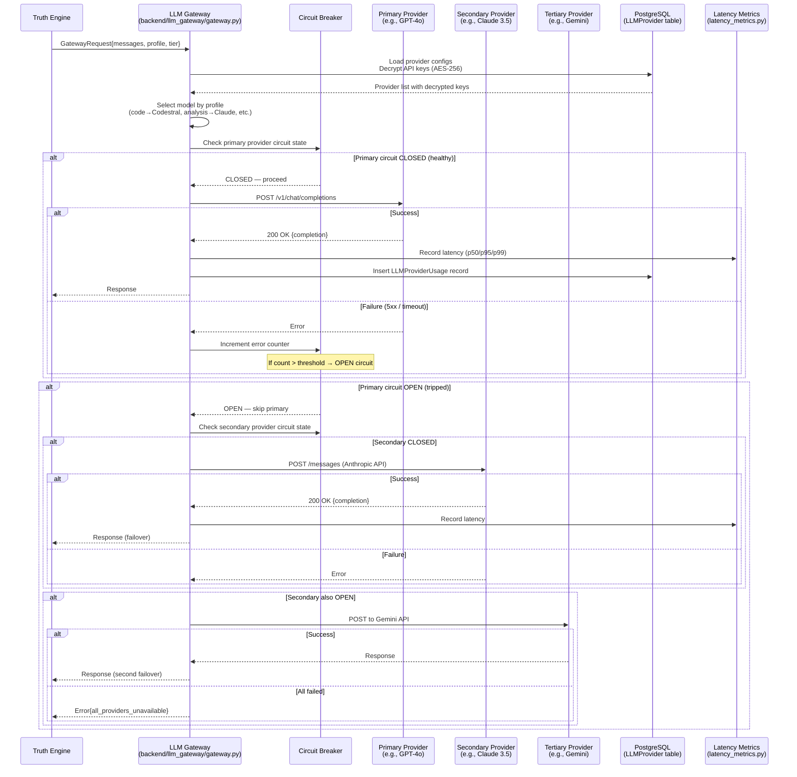
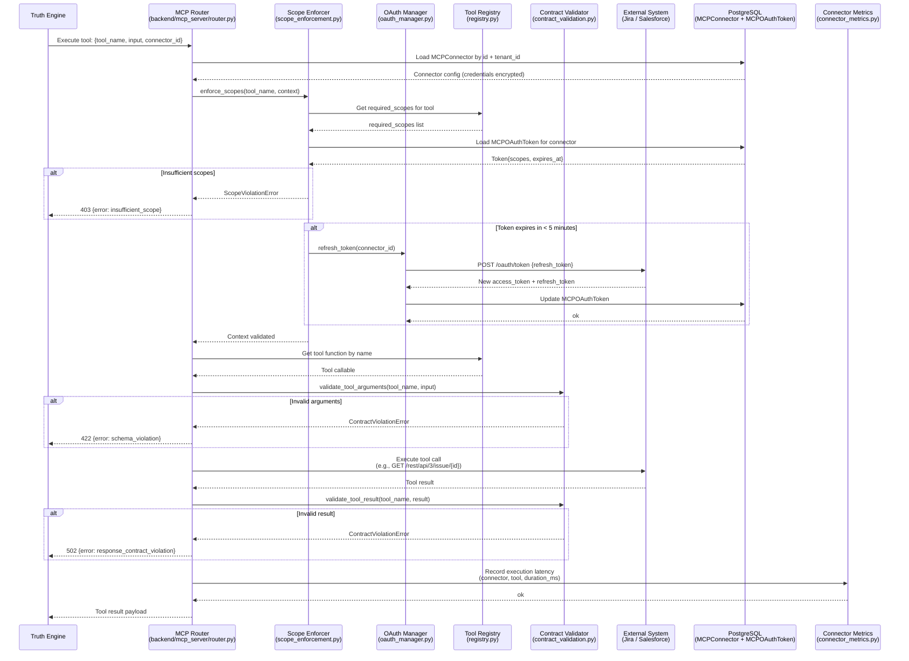
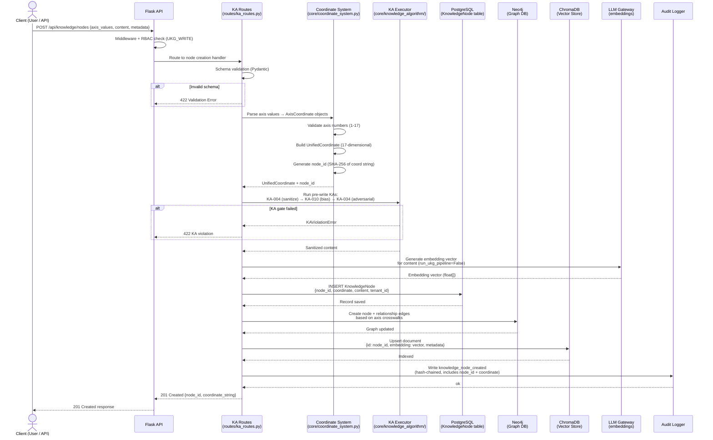
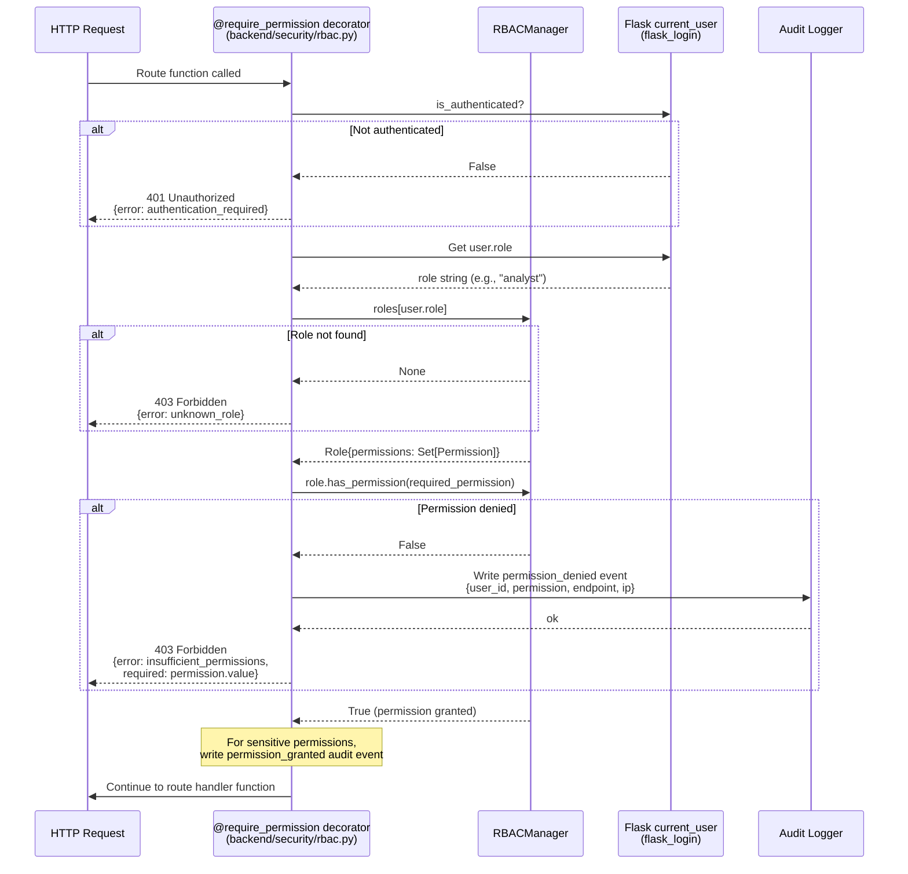
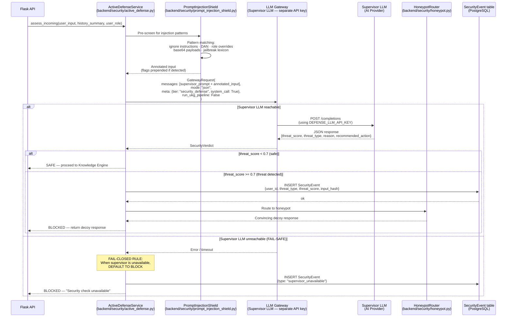
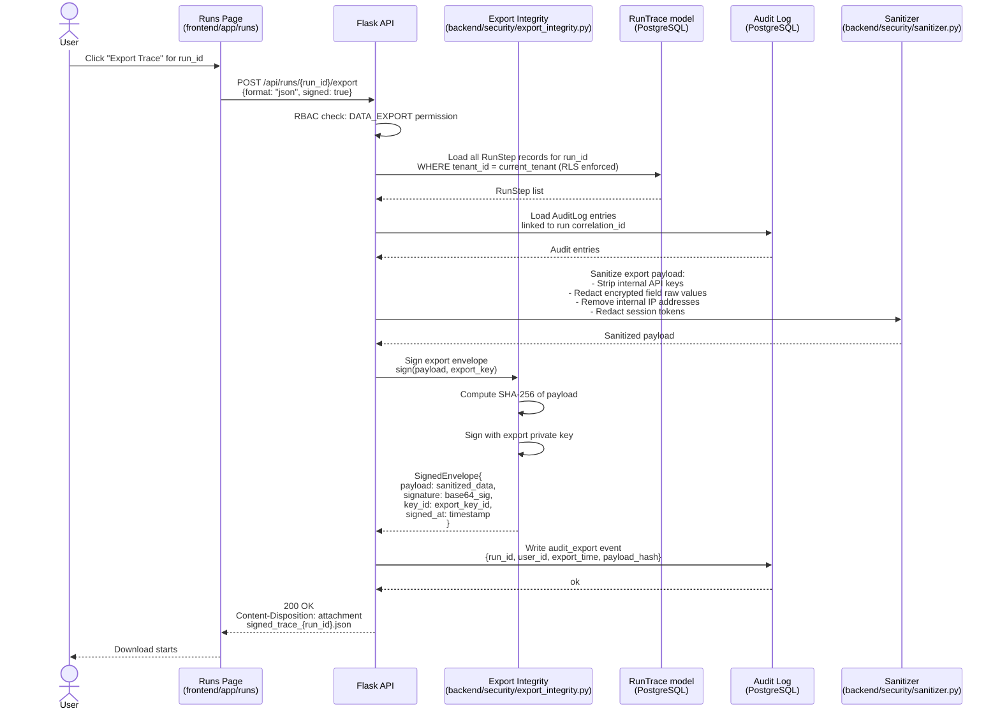

# Sequence Diagrams — DataLogicEngine

**Document Control**

| Field | Value |
|-------|-------|
| Owner | Platform Architecture |
| Last Updated | March 2026 |
| Status | Active |
| Audience | Software engineers, architects, QA, API integrators |
| Review Cadence | Every 60 days |
| Notation | UML sequence diagram syntax rendered in Mermaid |

---

## Table of Contents

1. [SD-01: Web Login with MFA](#sd-01-web-login-with-mfa)
2. [SD-02: Desktop Auto-Login (Electron)](#sd-02-desktop-auto-login-electron)
3. [SD-03: Chat Message — Full Round Trip](#sd-03-chat-message--full-round-trip)
4. [SD-04: LLM Provider Call with Circuit Breaker Failover](#sd-04-llm-provider-call-with-circuit-breaker-failover)
5. [SD-05: MCP Tool Call Execution](#sd-05-mcp-tool-call-execution)
6. [SD-06: Knowledge Node Write](#sd-06-knowledge-node-write)
7. [SD-07: RBAC Permission Check](#sd-07-rbac-permission-check)
8. [SD-08: Active Defense Assessment](#sd-08-active-defense-assessment)
9. [SD-09: Run Trace Export (Signed)](#sd-09-run-trace-export-signed)
10. [SD-10: OIDC / Azure AD Authentication](#sd-10-oidc--azure-ad-authentication)

---

## SD-01: Web Login with MFA

```mermaid
sequenceDiagram
    actor User
    participant Browser
    participant Flask as Flask API<br/>(app.py)
    participant AuthRoutes as Auth Routes<br/>(routes/auth_routes.py)
    participant UserModel as User Model<br/>(models.py)
    participant MFA as MFA Manager<br/>(backend/security/mfa.py)
    participant Redis as Redis<br/>(session store)
    participant AuditLog as Audit Logger<br/>(backend/security/audit_logger.py)

    User->>Browser: Navigate to /login
    Browser->>Flask: GET /login
    Flask->>Browser: Login page HTML

    User->>Browser: Enter username + password
    Browser->>Flask: POST /auth/login {username, password}

    Flask->>Flask: Apply middleware:<br/>Correlation ID, CSRF check,<br/>Rate limit check

    Flask->>AuthRoutes: Route to login handler
    AuthRoutes->>UserModel: User.query.filter_by(username=username)
    UserModel-->>AuthRoutes: User record

    AuthRoutes->>UserModel: user.is_account_locked()
    alt Account locked
        UserModel-->>AuthRoutes: locked_until > now()
        AuthRoutes-->>Flask: 423 Locked
        Flask-->>Browser: Account locked message
    end

    AuthRoutes->>UserModel: user.check_password(password)
    alt Password invalid
        UserModel-->>AuthRoutes: False
        AuthRoutes->>UserModel: Increment failed_login_attempts
        AuthRoutes-->>Flask: 401 Invalid credentials
        Flask-->>Browser: Error message
    end

    alt MFA enabled
        AuthRoutes-->>Browser: Redirect to /auth/mfa-challenge
        User->>Browser: Enter TOTP code
        Browser->>Flask: POST /auth/mfa-verify {totp_code}
        Flask->>MFA: verify_totp(user.mfa_secret, totp_code)
        alt TOTP invalid
            MFA-->>Flask: False
            Flask-->>Browser: 401 Invalid MFA code
        end
        MFA-->>Flask: True
    end

    AuthRoutes->>UserModel: Reset failed_login_attempts<br/>Update last_successful_login
    AuthRoutes->>Redis: Create encrypted session<br/>session[user_id] = user.id
    Redis-->>AuthRoutes: Session token
    AuthRoutes->>AuditLog: Write login_success event<br/>(hash-chained)
    AuditLog-->>AuthRoutes: ok

    AuthRoutes-->>Flask: Set-Cookie: session=<token>; HttpOnly; Secure
    Flask-->>Browser: 302 Redirect to /dashboard
    Browser->>Flask: GET /dashboard (with session cookie)
    Flask-->>Browser: Dashboard page
```

---

## SD-02: Desktop Auto-Login (Electron)



---

## SD-03: Chat Message — Full Round Trip



---

## SD-04: LLM Provider Call with Circuit Breaker Failover



---

## SD-05: MCP Tool Call Execution



---

## SD-06: Knowledge Node Write



---

## SD-07: RBAC Permission Check



---

## SD-08: Active Defense Assessment



---

## SD-09: Run Trace Export (Signed)



---

## SD-10: OIDC / Azure AD Authentication

```mermaid
sequenceDiagram
    actor User
    participant Browser
    participant Flask as Flask API<br/>(routes/auth_routes.py)
    participant OIDCClient as OIDC Client<br/>(Authlib / Flask-Dance)
    participant AzureAD as Azure AD / Entra ID
    participant UserModel as User Model<br/>(models.py)
    participant Redis as Redis<br/>(session store)
    participant AuditLog as Audit Logger

    User->>Browser: Click "Login with Azure AD"
    Browser->>Flask: GET /auth/oidc/login

    Flask->>OIDCClient: Generate authorization URL<br/>+ state parameter (CSRF token)
    OIDCClient-->>Flask: authorization_url + state

    Flask->>Redis: Store state → session[oidc_state] = state
    Flask-->>Browser: 302 Redirect to Azure AD<br/>authorize?client_id=...&state=...&scope=openid+email+profile

    Browser->>AzureAD: Navigate to Azure AD login
    User->>AzureAD: Enter Azure AD credentials<br/>(+ corporate MFA if configured)
    AzureAD-->>Browser: 302 Redirect to /auth/oidc/callback?code=...&state=...

    Browser->>Flask: GET /auth/oidc/callback?code=AUTH_CODE&state=STATE

    Flask->>Redis: Validate state matches session[oidc_state]
    alt State mismatch (CSRF)
        Flask-->>Browser: 400 Invalid state — CSRF detected
    end

    Flask->>OIDCClient: Exchange code for tokens
    OIDCClient->>AzureAD: POST /token {code, client_secret, redirect_uri}
    AzureAD-->>OIDCClient: {access_token, id_token, refresh_token}

    OIDCClient->>OIDCClient: Validate id_token signature<br/>+ verify iss, aud, exp claims

    OIDCClient->>AzureAD: GET /userinfo (using access_token)
    AzureAD-->>OIDCClient: {email, name, oid, groups}

    OIDCClient-->>Flask: Validated claims

    Flask->>UserModel: User.query.filter_by(email=claims.email)
    alt Existing user
        UserModel-->>Flask: User record
        Flask->>UserModel: Update last_successful_login
    else First OIDC login (new user)
        Flask->>UserModel: Create User{<br/>  email: claims.email,<br/>  username: claims.preferred_username,<br/>  role: 'user',<br/>  oidc_sub: claims.oid<br/>}
        UserModel-->>Flask: New user record
    end

    Flask->>Redis: Create encrypted session<br/>session[user_id] = user.id
    Redis-->>Flask: Session token

    Flask->>AuditLog: Write oidc_login_success event<br/>{user_id, provider: "azure_ad", oid: claims.oid}
    AuditLog-->>Flask: ok

    Flask-->>Browser: Set-Cookie: session=<token>; HttpOnly; Secure<br/>302 Redirect to /dashboard
    Browser->>Flask: GET /dashboard (with session cookie)
    Flask-->>Browser: Dashboard
    Browser-->>User: Logged in to dashboard
```
