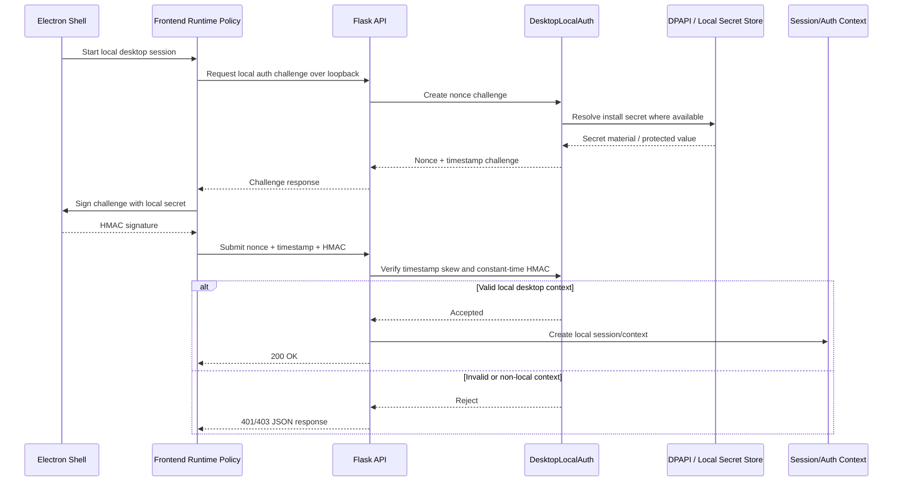
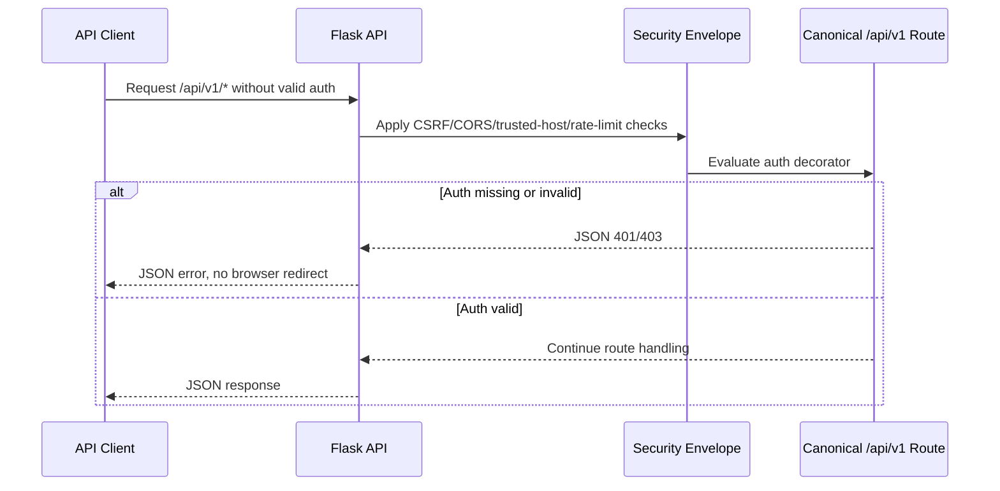
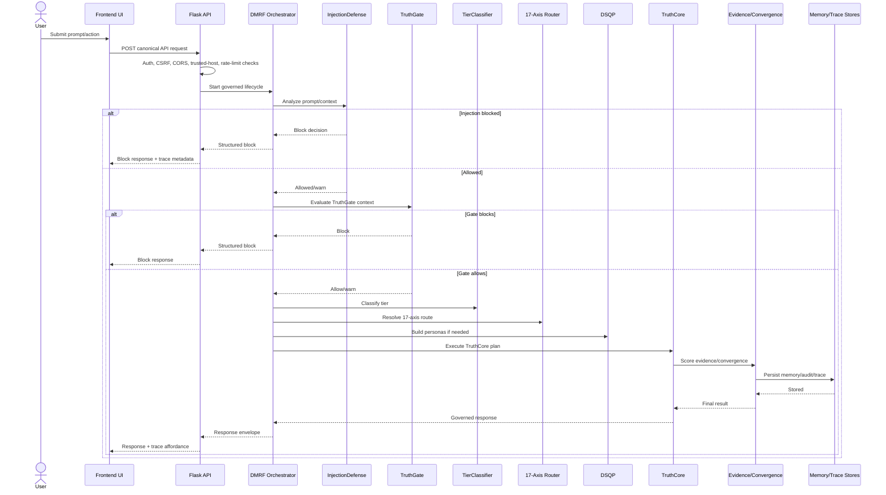
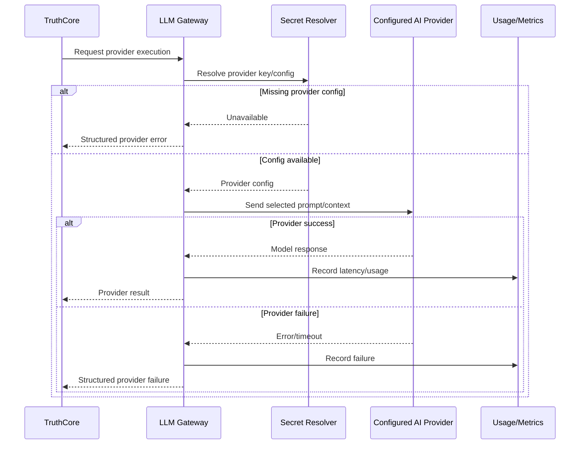
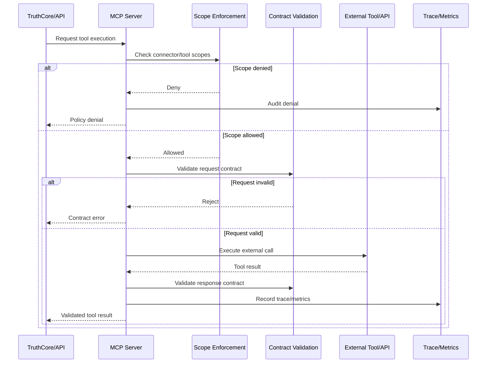
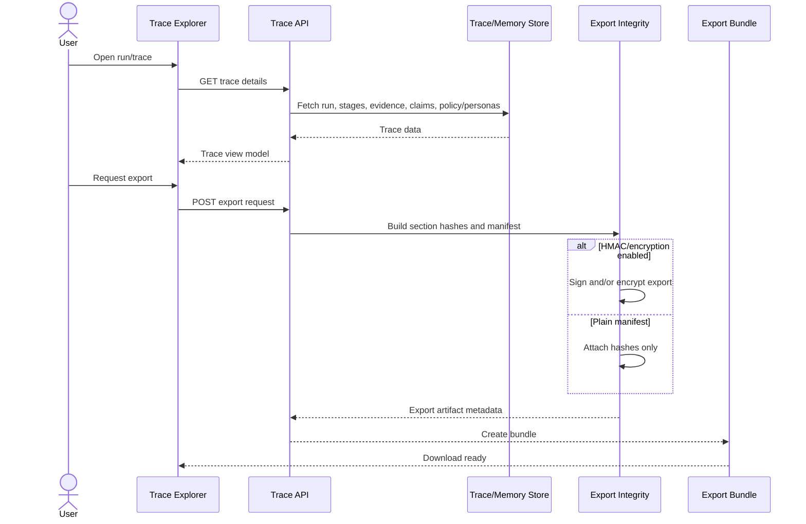
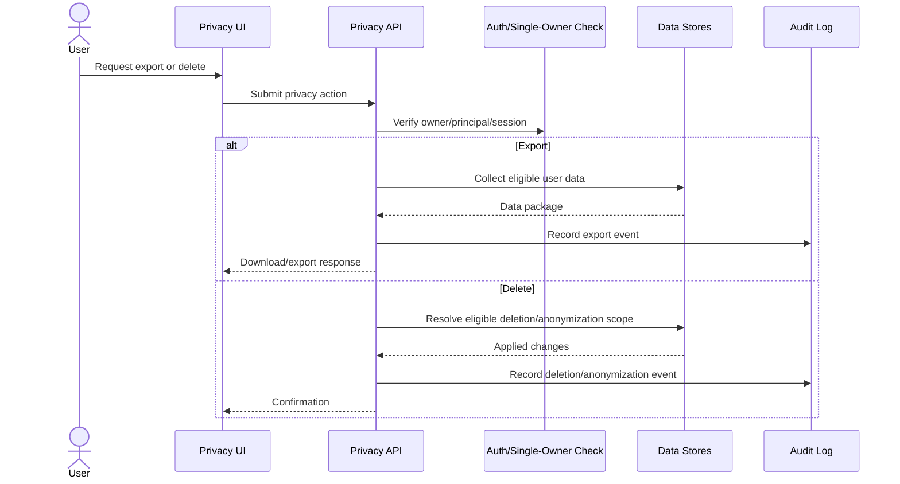
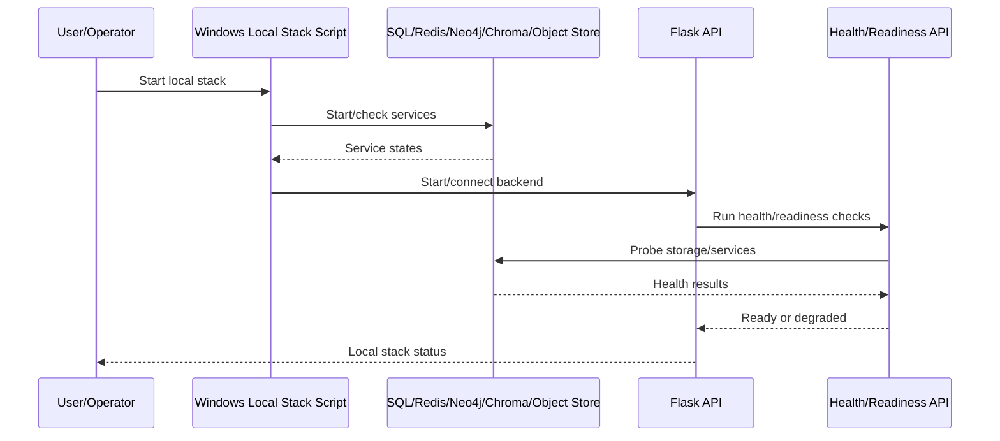
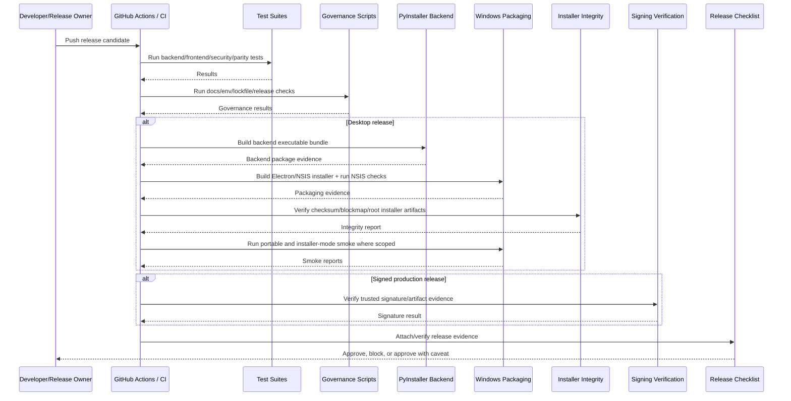
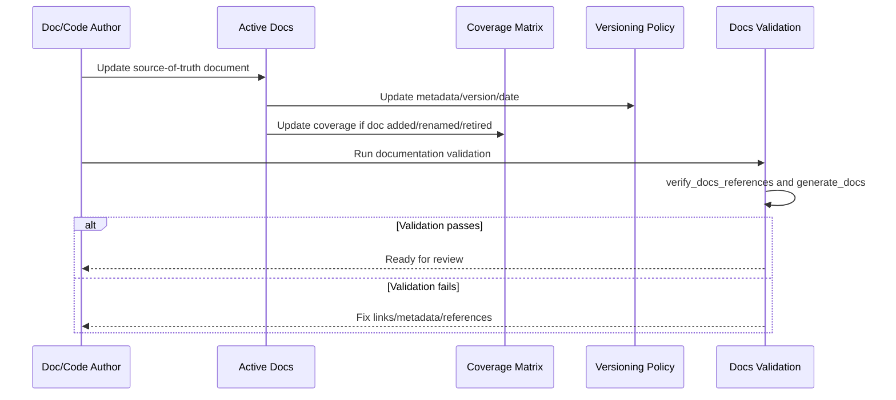

# Sequence Diagrams — DataLogicEngine

## Document metadata

| Field | Value |
|---|---|
| Document version | v2.7.0 |
| Last updated | 2026-07-06 |
| Status | Active |
| Owner | Platform Architecture |
| Audience | Software engineers, architects, QA, API integrators |
| Review cadence | Every 60 days |
| Notation | Mermaid UML sequence diagrams |

## Purpose

Document key runtime sequences in the current DataLogicEngine architecture.

This version aligns sequence diagrams with the local-first desktop trust model, canonical API behavior, DMRF, Truth Engine, 17-axis routing, DSQP, provider/tool execution, trace/export, privacy, and release governance.

---

## SD-01: Desktop local-auth sequence

---

## SD-02: Web/cloud API auth failure sequence

---

## SD-03: Governed AI request sequence

---

## SD-04: Provider execution sequence

---

## SD-05: MCP tool execution sequence

---

## SD-06: Trace review and export sequence

---

## SD-07: Privacy export/delete sequence

---

## SD-08: Local data service health sequence

---

## SD-09: Release validation sequence

---

## SD-10: Documentation governance sequence

## Change notes for v2.7.0

1. Updated privacy-action auth wording for single-owner/principal verification.
2. Expanded the release validation sequence to include backend bundle build, installer integrity, and installer-mode smoke.
3. Updated metadata for the production top-level documentation review.

## Change notes for v2.6.0

1. Added document metadata with explicit version and update date.
2. Replaced older MFA/SID/Active Defense/Knowledge Engine/QuadPersona sequences with current local-auth, DMRF, Truth Engine, provider, MCP, trace/export, privacy, local data, release, and docs-governance sequences.
3. Aligned sequence terminology with `ARCHITECTURE.md`, `WORKFLOW.md`, `DATA_FLOW_DIAGRAMS.md`, `PROCESS_MAP.md`, and `DECISION_LOGIC.md`.
