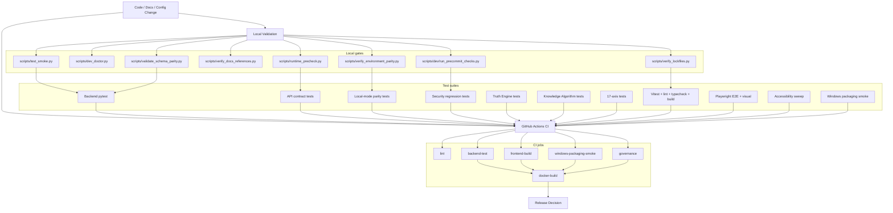

# Testing Standards and Execution Guide

## Document metadata

| Field | Value |
|---|---|
| Document version | v2.11.0 |
| Last updated | 2026-07-14 |
| Status | Active |
| Owner | Quality Engineering |
| Review cadence | Every 30 days |

## Purpose

Define enterprise testing standards, required quality gates, CI parity expectations, and release-validation workflows for DataLogicEngine.

This version reflects the current validation architecture: backend tests, frontend tests, API contract tests, local-mode parity tests, security regression sweeps, runtime precheck, schema parity, docs reference validation, environment parity, lockfile governance, Windows packaging smoke tests, NSIS governance, Docker build verification, and release-governance checks.

## Audience

1. Backend engineers
2. Frontend engineers
3. QA engineers
4. Release managers
5. Security reviewers
6. Technical judges validating project maturity

## Related documents

1. `pyproject.toml`
2. `.github/workflows/ci.yml`
3. `.github/workflows/deploy.yml`
4. `docs/PRODUCTION_READINESS.md`
5. `docs/DEPLOYMENT.md`
6. `docs/RELEASE_CHECKLIST.md`
7. `docs/BRANCH_PROTECTION_POLICY.md`
8. `docs/diagrams/08_testing_validation_and_release_governance.md`

## Current quality baseline

Current validation posture:

1. GitHub Actions is the release source of truth for routine branch validation: lint, backend-test, frontend-build, Windows packaging smoke, governance, deploy/build, security scan, and Docker checks where applicable.
2. The July 2026 local desktop rebuild validated backend packaging, Electron/NSIS installer generation, installer integrity, NSIS governance, portable packaging smoke, and installer-mode install/uninstall smoke.
3. Full local pytest counts are release evidence only when regenerated for that release candidate; do not reuse old pass counts as current production evidence.
4. Required backend coverage gate remains `>=70%` where the coverage suite is invoked.
5. The Phase 11 engineering checkpoint regenerated the local baseline: 2,094
   backend tests passed with 18 skipped, 411 frontend tests passed, and frontend
   typecheck/lint/build, Ruff, Python compilation, schema parity, migration
   inventory, route inventory, and governed MCP adversarial checks passed. This
   remains source and build evidence, not rebuilt-installed acceptance.

Before external submission, award review, sponsorship review, or production release, regenerate the full local baseline and attach the current date, command, environment, and report artifacts.

## Validation architecture overview



## Test taxonomy

1. Unit tests: fast isolated module/class tests.
2. Integration tests: service interactions, API route behavior, and policy behavior.
3. Route wiring tests: application-level route registration and canonical route expectations.
4. Contract tests: OpenAPI/static contract checks and runtime JSON status/error semantics.
5. Security tests: desktop auth, session, headers, encryption, injection/prompt-injection defenses, rate/request limits, and attack-surface controls.
6. Local-mode parity tests: validation that local-first behavior remains consistent.
7. Truth Engine tests: TruthGate, TruthCore, TruthMemory, TruthLink, layer behavior, and audit behavior.
8. Knowledge Algorithm tests: KA execution, registry, timing, and contract behavior.
9. 17-axis tests: coordinate, routing, FROST mode, risk, and trust/ethics behavior.
10. Frontend tests: Vitest unit tests, lint, typecheck, Next build, E2E, accessibility, and visual regression.
11. Windows/platform tests: desktop auth, backend package build, installer integrity, packaging smoke, NSIS governance, installer launch/install/uninstall behavior.
12. Governance tests: release governance, environment parity, lockfile governance, pre-commit checks.

## Directory model

```text
tests/
  unit/                   # Isolated backend module tests
  integration/            # Service interaction and API route tests
  integration_routes/     # App-level route wiring tests
  end_to_end/             # Cross-service workflow tests
  security/               # Desktop auth, encryption, injection-defense, attack-surface tests
  simulation/             # Simulation engine layer tests
  knowledge_algorithms/   # KA execution and contract tests
  truth_engine/           # Truth Engine layer tests
  compliance/             # GDPR, SOC 2, regulatory tests
  parity/                 # Local-mode parity tests
  contract/               # OpenAPI and canonical API contract tests
  performance/            # Load and latency tests
  axes/                   # 17-axis system tests
  persona/quad/           # Quad-persona library tests (pod scaling, orchestration)
  windows/                # Windows-specific and desktop-mode tests
  utils/                  # Test utilities and helpers
frontend/
  tests/
    unit/                 # React component unit tests with Vitest
    e2e/                  # Playwright route, accessibility, and visual regression tests
```

## Prerequisites

1. Python virtual environment created at `.venv`.
2. Dependencies installed from `requirements.txt`.
3. Frontend dependencies installed from `frontend/package-lock.json` using `npm ci`.
4. Local test environment variables configured where needed.
5. Python and Node versions aligned with CI: Python `3.11`, Node `24`.

## Standard execution commands

### Bootstrap smoke check

```powershell
.\.venv\Scripts\python .\scripts\test_smoke.py
```

### Backend full suite

```powershell
.\.venv\Scripts\python -m pytest tests --maxfail=20
```

### Backend coverage gate

```powershell
.\.venv\Scripts\python -m pytest tests --cov=backend --cov=models --cov-report=html --cov-report=term-missing --cov-report=json --cov-fail-under=70
```

### Backend contract, parity, and security sweeps

```powershell
.\.venv\Scripts\python -m pytest -q --no-cov tests\contract\test_api_contract.py
.\.venv\Scripts\python -m pytest -q --no-cov tests\parity\test_local_mode_parity.py
.\.venv\Scripts\python -m pytest -q --no-cov tests\security\test_security_headers.py tests\security\test_request_limits.py
```

### Canonical route contract hardening

```powershell
.\.venv\Scripts\python -m pytest -q --no-cov tests\contract\test_canonical_v1_route_contracts.py
```

### Truth Engine, KA, and 17-axis targeted sweeps

```powershell
.\.venv\Scripts\python -m pytest -q --no-cov tests\truth_engine
.\.venv\Scripts\python -m pytest -q --no-cov tests\knowledge_algorithms
.\.venv\Scripts\python -m pytest -q --no-cov tests\axes
```

### Frontend lint, typecheck, unit tests, and build

```powershell
cd frontend
npm run lint
npm run typecheck
npm test
npm run build
```

### Frontend E2E and visual regression

```powershell
cd frontend
npm run test:e2e -- tests/e2e/route-sidebar-smoke.spec.ts
npm run test:e2e:visual
```

### Documentation reference validation

```powershell
.\.venv\Scripts\python .\scripts\verify_docs_references.py
```

### Phase 13 observability and failure-boundary gates

```powershell
.\.venv\Scripts\python .\scripts\check_exception_boundaries.py --output reports\production-readiness\2026\phase-13\failure-boundary-inventory.json
.\.venv\Scripts\python .\scripts\check_circular_deps.py --output reports\production-readiness\2026\phase-13\python-import-cycles.json
.\.venv\Scripts\python .\scripts\run_phase13_soak.py --profile stress24 --duration-seconds 5 --output reports\production-readiness\2026\phase-13\soak-engineering-latest.json
```

The short soak command validates collection and bound evaluation only. It cannot
qualify CP13-E; installed 24-hour stress and 72-hour idle runs are required. The
circular-dependency gate currently reports four real cycles and therefore fails
truthfully until Phase 14 technical-debt work removes them.

### Schema parity validation

```powershell
python .\scripts\validate_schema_parity.py --report reports\schema_parity_report_local.json
```

### Runtime precheck

```powershell
python .\scripts\runtime_precheck.py --strict --skip-ports --allow-env-from-process --json-report reports\runtime_precheck_report_local.json
```

### Governance and parity checks

```powershell
python .\scripts\dev_doctor.py --skip-ports
python .\scripts\verify_environment_parity.py --strict --json-report reports\environment_parity_report_local.json
python .\scripts\verify_lockfiles.py --json-report reports\lockfile_governance_report_local.json
python .\scripts\dev\run_precommit_checks.py
```

### Windows packaging smoke

```powershell
.\.venv\Scripts\python.exe scripts\build_backend.py
$env:CSC_SKIP = "true"
npm --prefix frontend run electron:dist
powershell -NoProfile -ExecutionPolicy Bypass -File .\scripts\windows\verify_nsis_governance.ps1 -RepoRoot (Get-Location).Path
.\.venv\Scripts\python.exe scripts\verify_installer_integrity.py --require-artifacts
powershell -NoProfile -ExecutionPolicy Bypass -File .\scripts\windows\run_packaging_smoke.ps1 -RepoRoot (Get-Location).Path
powershell -NoProfile -ExecutionPolicy Bypass -File .\scripts\windows\run_packaging_smoke.ps1 -RepoRoot (Get-Location).Path -Mode installer
```

## CI enforcement pipeline

The current `.github/workflows/ci.yml` enforces these jobs:

| Job | Gates |
|---|---|
| `lint` | Python setup and Ruff fatal/error class checks. |
| `backend-test` | dependency install, `pip-audit`, smoke check, runtime precheck, docs reference validation, schema parity, full pytest without coverage, API contract tests, local-mode parity tests, security regression suite. |
| `frontend-build` | Node 24, `npm ci`, design token build, frontend lint, typecheck, Vitest, Next build, Playwright install, accessibility sweep, route E2E smoke, visual regression smoke. |
| `windows-packaging-smoke` | Python/Node setup, backend executable build, frontend install, NSIS governance, Electron installer build, installer integrity checks, portable launch smoke, report upload. |
| `governance` | pre-commit governance, environment parity, lockfile governance, report upload. |
| `docker-build` | backend and frontend Docker build verification after required jobs succeed. |

## Required release gates

1. All required CI jobs pass on protected branch.
2. Backend coverage remains at or above configured threshold.
3. No medium/high security regression in enforced security scans.
4. No failing migration, schema parity, or startup checks in deployment workflows.
5. Runtime precheck passes in strict mode.
6. Documentation references are valid.
7. Frontend lint, typecheck, tests, and build pass.
8. Contract, parity, and security regression sweeps pass.
9. Windows packaging smoke job passes for desktop release.
10. Backend desktop bundle is rebuilt before Electron/NSIS packaging for release-candidate evidence.
11. NSIS governance passes for installer release.
12. Installer integrity verification passes for root installer artifacts.
13. Installer-mode install/uninstall smoke passes where release scope requires install behavior evidence.
14. Environment parity and lockfile governance pass.
15. Docker build verification passes where applicable.

## Recent validation updates

### 2026-03-31 contract hardening

1. Added canonical `/api/v1/*` route contract tests in `tests/contract/test_canonical_v1_route_contracts.py`.
2. Contract suite asserts JSON `401` behavior for unauthenticated canonical endpoints.
3. Malformed-request behavior is locked for key canonical route families.
4. Canonical analytics/GDPR/privacy/storage/persona/trace/retention routes have explicit authentication behavior coverage.

### 2026-03-31 observability regression update

1. `/metrics` route-level counters and latency gauges are tested.
2. Unmatched-route `4xx` telemetry is tested.
3. Route metrics use low-cardinality labels: `method`, `route`, and status family.

### 2026-03-31 developer experience update

1. `scripts/dev_doctor.py` aggregates runtime precheck, CI parity, lockfile governance, and git-hook bootstrap checks.
2. `tests/unit/test_dev_doctor.py` locks strict-mode failure semantics and git-hook guidance behavior.

### 2026-03-31 release governance update

1. `scripts/verify_release_governance.py` checks that CI, deploy, and release checklist gates remain aligned.
2. `tests/unit/test_release_governance.py` validates missing-gate and happy-path cases.
3. Targeted release sweeps include desktop auto-login security and release-governance checks.

## Test authoring standards

1. Name tests by behavior, not implementation detail.
2. Use deterministic fixtures.
3. Isolate external dependencies with mocks or local test doubles.
4. Keep unit tests side-effect free.
5. Add regression tests for every production bug/security fix.
6. Use explicit assertions for security controls and error semantics.
7. Prefer canonical `/api/v1/*` routes for new route tests.
8. Do not loosen route-contract assertions to tolerate redirects or server-error buckets.
9. Do not require external network services for local unit tests.
10. Keep local commands aligned with CI.

## Failure triage protocol

1. Reproduce locally with the most targeted failing command.
2. Identify whether the failure is a test defect, product defect, dependency defect, or environment defect.
3. Fix with minimal blast radius.
4. Add or adjust regression coverage.
5. Re-run targeted tests.
6. Re-run relevant suite.
7. Re-run full suite for high-risk/security/release changes.
8. Document notable failures/remediations in release notes, incident reports, or this testing guide where needed.

## CI parity guidelines

1. Use Python `3.11` and Node `24`, matching CI.
2. Use `npm ci`, not ad-hoc package installation, for frontend parity.
3. Keep local commands aligned with `.github/workflows/ci.yml` and `.github/workflows/deploy.yml`.
4. Avoid undocumented local-only test flags for critical flows.
5. Generate JSON reports for readiness, environment parity, schema parity, packaging smoke, and lockfile governance when preparing a release.
6. Treat CI as the release source of truth.

## Reviewer verification path

A reviewer should inspect these files in order:

1. `docs/diagrams/08_testing_validation_and_release_governance.md`
2. `.github/workflows/ci.yml`
3. `.github/workflows/deploy.yml`
4. `docs/RELEASE_CHECKLIST.md`
5. `scripts/runtime_precheck.py`
6. `scripts/dev_doctor.py`
7. `scripts/verify_release_governance.py`
8. `scripts/verify_environment_parity.py`
9. `scripts/verify_lockfiles.py`
10. `scripts/verify_docs_references.py`
11. `scripts/validate_schema_parity.py`
12. `scripts/build_backend.py`
13. `scripts/verify_installer_integrity.py`
14. `scripts/windows/run_packaging_smoke.ps1`
15. `scripts/windows/verify_nsis_governance.ps1`
16. `tests/contract/`
17. `tests/security/`
18. `tests/parity/`
19. `tests/truth_engine/`
20. `tests/knowledge_algorithms/`
21. `tests/axes/`
22. `frontend/tests/`

## Change notes for v2.11.0

1. Added the Phase 13 exception-boundary inventory, real circular-import graph,
   and engineering-only soak commands with explicit release-gate semantics.

## Change notes for v2.9.0

1. Recorded the isolated Phase 9 backend/frontend baseline and preserved the
   distinction between source/build evidence and installed acceptance.

## Change notes for v2.8.0

1. Added backend bundle rebuild, installer integrity, and installer-mode install/uninstall smoke to required release gates and reviewer verification.
2. Clarified Windows/platform tests include installer launch, install, and uninstall behavior.

## Change notes for v2.7.0

1. Replaced stale fixed local test counts with a current validation-posture section tied to CI and release-candidate evidence.
2. Added backend-before-Electron packaging order, installer integrity verification, and installer-mode smoke validation.
3. Clarified that full local pytest counts must be regenerated per release candidate before being used as production evidence.

## Change notes for v2.6.0

1. Added document metadata with explicit version and update date.
2. Updated the purpose and scope to include release governance, CI parity, packaging smoke, and environment/lockfile governance.
3. Added validation architecture diagram.
4. Expanded test taxonomy for DMRF-adjacent systems, Truth Engine, 17-axis, local-mode parity, frontend, Windows, and governance tests.
5. Added current CI job map.
6. Expanded standard execution commands for schema parity, runtime precheck, governance, and Windows packaging smoke.
7. Added reviewer verification path tied to actual workflow, script, and test directories.
