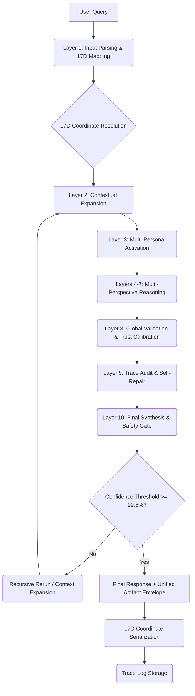

# UKG Unified System Workflow

## Purpose

Provide a high-level workflow reference for how a query traverses reasoning layers and validation gates.

## Audience

1. Architects
2. Backend engineers
3. QA and observability engineers

## Document control

1. Owner: Platform Architecture
2. Last updated: 2026-02-08
3. Status: Active
4. Review cadence: Every 60 days

## Related documents

1. `docs/ARCHITECTURE.md`
2. `docs/API.md`
3. `docs/OPERATIONAL_RUNBOOKS.md`

## Workflow diagram

This diagram illustrates query flow through the UKG system, from interpretation to final 17D-addressed response artifact.

## 17D coordinate transformation
1. **Input Stage:** Query intent is mapped to primary Axes (1-5, 12-13).
2. **Expansion Stage:** Octopus/Spiderweb (Axes 6-7) resolve cross-domain links.
3. **Reasoning Stage:** Personas (Axes 8-11) inject authoritative perspective vectors.
4. **Meta Stage:** Risk, Performance, Causality, and Observability (Axes 14-17) refine the artifact's metadata.
