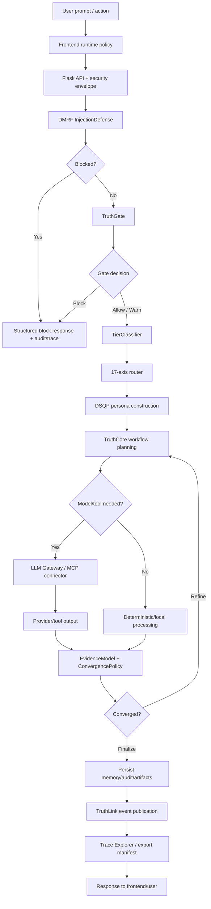

# DataLogicEngine Unified System Workflow

## Document metadata

| Field | Value |
|---|---|
| Document version | v2.6.0 |
| Last updated | 2026-05-30 |
| Status | Active |
| Owner | Platform Architecture |
| Review cadence | Every 60 days |

## Purpose

Provide a high-level workflow reference for how a request traverses DataLogicEngine reasoning layers, security controls, validation gates, memory systems, and trace/export paths.

This version replaces the older generic 17D/layer diagram with the current DMRF + Truth Engine + 17-axis + DSQP + trace lifecycle.

## Audience

1. Architects
2. Backend engineers
3. QA and observability engineers
4. Security reviewers
5. Technical judges and evaluators

## Related documents

1. `docs/ARCHITECTURE.md`
2. `docs/ARCHITECTURE_MAP.md`
3. `docs/API.md`
4. `docs/DATABASE_SCHEMA.md`
5. `docs/SECURITY.md`
6. `docs/OPERATIONAL_RUNBOOKS.md`
7. `docs/diagrams/12_end_to_end_request_lifecycle.md`
8. `docs/diagrams/09_dmrf_control_plane_deep_dive.md`
9. `docs/diagrams/05_truth_engine_architecture.md`

---

## Workflow summary

A governed DataLogicEngine request follows this lifecycle:

```text
user prompt/action
  -> frontend/runtime policy
  -> Flask API/security envelope
  -> DMRF injection defense
  -> TruthGate
  -> tier classification
  -> 17-axis routing
  -> DSQP persona construction
  -> TruthCore workflow planning
  -> model/tool execution where required
  -> evidence and convergence policy
  -> memory/audit/artifact persistence
  -> TruthLink event publication
  -> Trace Explorer and export integrity
```

This workflow is intentionally broader than a direct LLM call. The model/provider is one component inside a governed lifecycle.

---

## Workflow diagram



---

## Stage responsibilities

| Stage | Responsibility | Key implementation paths |
|---|---|---|
| Frontend/runtime policy | determine desktop/web behavior, auth UX, route handling, API calls. | `frontend/app/`, `frontend/lib/runtime/policy.ts`, `frontend/contexts/AuthContext.tsx` |
| API/security envelope | sessions, CSRF, CORS, trusted hosts, rate limits, JSON errors, health/metrics. | `app.py`, `routes/`, `backend/auth/`, `backend/security/` |
| DMRF InjectionDefense | detect prompt injection, logical traps, obfuscation, persona hijack, resource exhaustion. | `backend/dmrf/injection_defense.py` |
| TruthGate | trust, budget, priority, compliance, PII, blocked-pattern gate. | `backend/truth_engine/truth_gate/gateway.py` |
| TierClassifier | classify request as trivial/moderate/high-stakes/extreme/autonomous. | `backend/dmrf/tier_classifier.py` |
| 17-axis router | assign coordinate, active axes, FROST depth, Truth mode. | `backend/dmrf/router.py`, `core/axes/` |
| DSQP | construct structured personas from axes 8-11. | `backend/dsqp/dsqp_chain.py` |
| TruthCore | plan and execute tiered workflow. | `backend/truth_engine/truth_core/engine.py` |
| LLM/tool execution | call provider/model or MCP connector when needed. | `backend/llm_gateway/`, `backend/mcp_server/` |
| Evidence/convergence | score evidence and decide finalize/refine behavior. | `backend/dmrf/evidence_model.py`, `backend/dmrf/convergence_policy.py` |
| Memory/audit/artifacts | persist run memory, audit, artifacts, metrics, explainability. | `backend/storage/`, `backend/memory/`, `backend/truth_engine/truth_memory/` |
| Trace/export | expose run review and integrity-protected exports. | `backend/tracing/`, `backend/security/export_integrity.py`, `frontend/app/runs/` |

---

## 17-axis transformation

The 17-axis model provides structured routing context rather than acting as a standalone answer generator.

Typical transformation:

1. **Intent and domain mapping** — identify relevant knowledge pillar, sector, branch, node, and temporal/location context.
2. **Crosswalk mapping** — resolve Octopus/Spiderweb relationships for regulatory, compliance, or cross-domain context.
3. **Persona mapping** — use axes 8-11 to construct DSQP expert personas.
4. **Risk/trust mapping** — use risk/threat and ethics/trust/criticality signals to influence tier and guardrails.
5. **FROST/Truth routing** — map tier and risk to deeper or shallower workflow execution.
6. **Trace serialization** — persist coordinate, decisions, evidence, and output metadata for review.

---

## Workflow outcomes

Possible outcomes:

| Outcome | Meaning |
|---|---|
| Blocked | InjectionDefense or TruthGate prevented unsafe or invalid processing. |
| Safe fallback | Evidence, confidence, provider, or policy state did not support a final answer. |
| Finalized deterministic result | Request was resolved without external model/tool execution. |
| Finalized provider-backed result | Request used LLM/tool execution and passed evidence/convergence gates. |
| Refinement required | Convergence policy required another pass or deeper tier. |
| Human review recommended | High-risk/uncertain conditions require user/operator review. |

---

## Validation points

1. DMRF trace should show injection-defense result.
2. TruthGate decision should be visible in run/trace context where enabled.
3. Tier and 17-axis routing should be inspectable for governed requests.
4. DSQP persona data should be visible where persona construction occurs.
5. Evidence/claims should connect to final output.
6. Export manifests should include integrity metadata where export is used.
7. Metrics should show route/provider/connector behavior through `/metrics`.

## Change notes for v2.6.0

1. Added document metadata with explicit version and update date.
2. Replaced older generic workflow with current DMRF + Truth Engine lifecycle.
3. Added stage responsibility matrix with implementation paths.
4. Updated 17-axis transformation language to match current routing architecture.
5. Added workflow outcomes and validation points.
