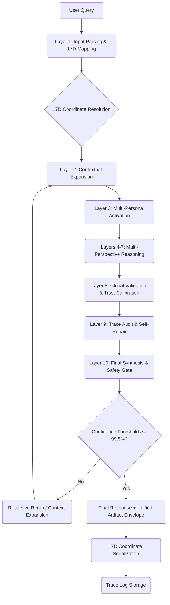

# UKG Unified System Workflow

This diagram illustrates the flow of a query through the UKG Unified System, from interpretation to the final 17D-addressed artifact response.

## 17D Coordinate Transformation
1. **Input Stage:** Query intent is mapped to primary Axes (1-5, 12-13).
2. **Expansion Stage:** Octopus/Spiderweb (Axes 6-7) resolve cross-domain links.
3. **Reasoning Stage:** Personas (Axes 8-11) inject authoritative perspective vectors.
4. **Meta Stage:** Risk, Performance, Causality, and Observability (Axes 14-17) refine the artifact's metadata.
