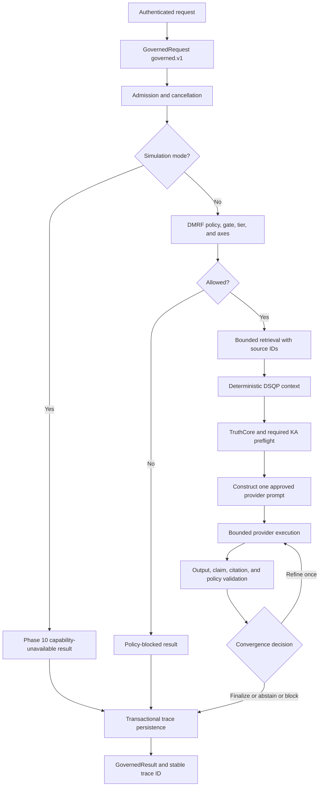

# DataLogicEngine Unified System Workflow

## Document metadata

| Field | Value |
|---|---|
| Document version | v3.1.0 |
| Last updated | 2026-07-13 |
| Status | Active |
| Owner | Platform Architecture |
| Review cadence | Every 60 days |

## Purpose

Provide a high-level workflow reference for how a request traverses DataLogicEngine reasoning layers, security controls, validation gates, memory systems, and trace/export paths.

This version records the Phase 6 evidence, validation, confidence, convergence,
TruthCore, and KA contracts on the single backend-owned `governed.v1` path.

## Audience

1. Architects
2. Backend engineers
3. QA and observability engineers
4. Security reviewers
5. Technical judges and evaluators

## Related documents

1. `docs/ARCHITECTURE.md`
2. `docs/ARCHITECTURE_MAP.md`
3. `docs/API.md`
4. `docs/DATABASE_SCHEMA.md`
5. `docs/SECURITY.md`
6. `docs/OPERATIONAL_RUNBOOKS.md`
7. `docs/diagrams/12_end_to_end_request_lifecycle.md`
8. `docs/diagrams/09_dmrf_control_plane_deep_dive.md`
9. `docs/diagrams/05_truth_engine_architecture.md`

---

## Workflow summary

A standard or enhanced governed request follows this lifecycle:

```text
authenticated user/client request
  -> GovernedRequest(governed.v1)
  -> admission and cancellation check
  -> DMRF injection defense + TruthGate + tier + 17-axis route
  -> bounded source-identified retrieval
  -> deterministic DSQP axes 8-11 context
  -> TruthCore workflow selection + required KA preflight
  -> one policy/persona/evidence/KA-aware provider request
  -> output/claim/citation/policy validation
  -> dle-confidence.v1 measurement or explicit not_measured
  -> bounded finalize/refine/abstain/block decision
  -> one transactional run/stage/evidence/claim/citation/validator persistence operation
  -> GovernedResult with stable trace_id
```

`standard`, `enhanced`, `local_review`, and `simulation` are the supported modes.
`simulation` currently fails explicitly at the Phase 10 capability boundary
immediately after admission. `local_review` does not claim a provider answer.
Compatibility values `chat`, `trace`, and `explain` map to `standard`; `quad`
maps to `enhanced`. The deprecated `run_ukg_pipeline` flag cannot bypass this
workflow.

---

## Workflow diagram



---

## Stage responsibilities

| Stage | Responsibility | Key implementation paths |
|---|---|---|
| Transport/security envelope | Authenticates the owner/client and supplies server-owned principal, scope, project, privacy, and budget context. | `app.py`, `backend/routes/`, `backend/auth/`, `backend/security/` |
| Contract and orchestration | Validates `governed.v1`, prevents recursion/bypass, owns stage transitions, and bounds provider calls. | `backend/governed_execution/contracts.py`, `backend/governed_execution/orchestrator.py` |
| DMRF/TruthGate | Applies injection defense, TruthGate, tier, and 17-axis routing with measured data. | `backend/dmrf/`, `backend/truth_engine/truth_gate/` |
| Retrieval | Selects bounded, source-identified local context and rejects suspicious chunks. | `backend/governed_execution/retrieval.py` |
| DSQP/TruthCore/KAs | Builds deterministic persona context, selects the workflow, and executes required preflight KAs. | `backend/governed_execution/orchestrator.py`, `backend/dsqp/`, `backend/truth_engine/` |
| Prompt/provider | Builds one prompt containing approved policy, sources, personas, and KAs, then performs bounded provider execution. | `backend/governed_execution/prompt.py`, `backend/llm_gateway/` |
| Validation/quality | Extracts stable claims and citations, resolves persisted evidence relationships, records validators, measures named components, and selects bounded convergence. | `backend/governed_execution/validation.py`, `backend/governed_execution/quality.py` |
| Trace persistence | Stores the run and only executed stages, sources, evidence, claims, links, citations, validators, decisions, personas, KAs, policies, and axes under one trace ID. | `backend/governed_execution/trace_persistence.py`, `backend/tracing/` |
| Result/UI | Returns completed, abstained, blocked, failed, cancelled, or unavailable state; evidence-support coverage includes its explanation or displays Not measured. | `frontend/components/Chat/ChatTracePanel.tsx`, `frontend/app/runs/view/page.tsx` |

---

## 17-axis transformation

The 17-axis model provides structured routing context rather than acting as a standalone answer generator.

Typical transformation:

1. **Intent and domain mapping** — identify relevant knowledge pillar, sector, branch, node, and temporal/location context.
2. **Crosswalk mapping** — resolve Octopus/Spiderweb relationships for regulatory, compliance, or cross-domain context.
3. **Persona mapping** — use axes 8-11 to construct DSQP expert personas.
4. **Risk/trust mapping** — use risk/threat and ethics/trust/criticality signals to influence tier and guardrails.
5. **FROST/Truth routing** — map tier and risk to deeper or shallower workflow execution.
6. **Trace serialization** — persist coordinate, decisions, evidence, and output metadata for review.

---

## Workflow outcomes

Possible outcomes:

| Outcome | Meaning |
|---|---|
| Blocked | InjectionDefense or TruthGate prevented unsafe or invalid processing. |
| Capability unavailable | A later-phase mode such as simulation is explicitly unavailable; no answer is fabricated. |
| Failed | Provider, validation, or internal execution failed; later stages are absent. |
| Cancelled | Execution stopped and no additional provider/tool calls occur. |
| Abstained | Required evidence remained insufficient or contradicted after the bounded refinement cycle. |
| Finalized deterministic result | Request was resolved without external model/tool execution. |
| Finalized provider-backed result | Request used LLM/tool execution and passed evidence/convergence gates. |
| Human review recommended | High-risk/uncertain conditions require user/operator review. |

---

## Validation points

1. A TruthGate block prevents provider execution.
2. Removing or changing a retrieved source changes the constructed provider
   context and its available citations.
3. DSQP and KA items shown in trace must appear in the provider request or final
   decision.
4. Provider failure cannot create completed validation/evidence stages.
5. Cancellation stops additional provider/tool calls.
6. Every outcome returns one stable trace ID and stores only executed stages.
7. Confidence must be null when no versioned measurement exists.

## Change notes for v3.0.0

1. Replaced the plan-shaped DMRF diagram with the implemented Phase 5
   `governed.v1` lifecycle and its explicit modes/failure boundaries.
2. Recorded the single backend orchestrator, causal prompt construction,
   transactional trace truth, and Phase 6 evidence-quality boundary.

## Change notes for v2.7.0

1. Reviewed the governed request lifecycle during the production top-level documentation pass; workflow model remains current.
2. Updated metadata so this source-of-truth workflow reference is no longer dated to the May documentation baseline.

## Change notes for v2.6.0

1. Added document metadata with explicit version and update date.
2. Replaced older generic workflow with current DMRF + Truth Engine lifecycle.
3. Added stage responsibility matrix with implementation paths.
4. Updated 17-axis transformation language to match current routing architecture.
5. Added workflow outcomes and validation points.
