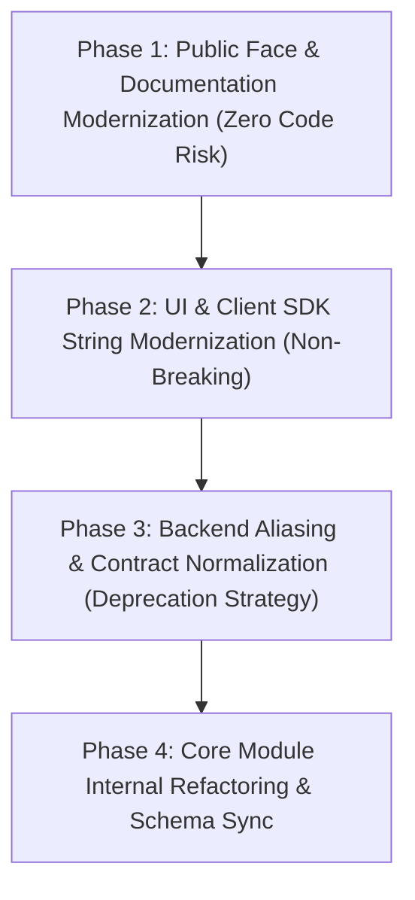

# DataLogicEngine Terminology Modernization & Enterprise Alignment Plan

## Document Control

| Field | Value |
|---|---|
| Document ID | DLE-PLAN-002 |
| Title | Terminology Modernization & Enterprise Standard Alignment Plan |
| Document Version | v1.0.0 |
| Target Audience | Product Owner, Engineering, Technical Evaluators, Enterprise & Defense Reviewers |
| Scope | Repository-wide nomenclature, API schemas, UI labels, documentation, and compliance crosswalks |
| Governing Standards | NIST AI Risk Management Framework (AI 100-1), DoD Responsible AI Principles, ISO/IEC 42001 (AI Management System), EU AI Act (High-Risk AI Governance), IEEE 7000 Series |
| Status | Proposed Execution Plan |

---

## 1. Executive Summary & Problem Statement

### 1.1 The Challenge
DataLogicEngine possesses advanced technical capabilities: deterministic causal tracing, strict local credential isolation via Windows DPAPI, an app-owned 5-service data plane, multi-persona adversarial review, and calibrated claim-to-evidence validation.

However, several core components currently use **speculative metaphors, theoretical buzzwords, or colloquial naming** (e.g., *"Simulated Quantum Computer"*, *"Schrödinger Confidence"*, *"Layer 7 AGI System"*, *"FROST Mode"*, *"Octopus/Spiderweb Crosswalks"*).

### 1.2 The Risk
When presented to enterprise architects, institutional investors (e.g., Gradient Ventures), government evaluators (DoD, DARPA, DIU), or healthcare/finance compliance officers:
1. **Credibility Friction:** Sci-fi terminology obscures rigorous engineering and raises skepticism during technical due diligence.
2. **Compliance Misalignment:** Enterprise procurement teams look for standard terminology mapped directly to NIST AI 100-1, ISO/IEC 42001, and MIL-STD / FedRAMP controls.
3. **Understated Value:** Rigorous Bayesian statistics and discrete ontology routing are misperceived as toy simulations rather than defense-grade middleware.

### 1.3 The Objective
Systematically modernize and align the product vocabulary with **defense-grade, mathematical, and enterprise AI standards** across documentation, UI strings, API contracts, and source code—without breaking backward compatibility or runtime contracts.

---

## 2. Terminology Modernization Crosswalk

The following canonical translation matrix establishes the standard terminology across all product layers:

| Current Internal / Legacy Term | Modernized Enterprise / Defense Term | Theoretical & Functional Foundation | Applicable Standards & Frameworks |
|---|---|---|---|
| **Simulated Quantum Computer (SQC)** | **Bayesian Uncertainty Quantification Engine (UQ Engine)** | Monte Carlo belief sampling and entropy quantification over conflicting knowledge states. | NIST AI RMF §1.2 (Measure), ISO/IEC 24029 (Neural network robustness) |
| **Schrödinger Confidence** | **Calibrated Conformal Prediction Score** | Finite-sample coverage guarantees and probabilistic calibration over multi-agent consensus. | NIST AI RMF §2.3, Conformal Inference Standards |
| **Superposition Logic Engine** | **Multi-Hypothesis State Estimator** | Tracking concurrent plausible interpretations before convergence or evidence collapse. | IEEE 7001 (Transparency of Autonomous Systems) |
| **Quantum Entanglement Manager** | **Cross-Domain Correlation Graph** | Relational dependency mapping linking cross-sector constraints. | W3C Provenance Ontology (PROV-O), ISO/IEC 21838 |
| **Layer 7 AGI System / AGI Planner** | **Hierarchical Goal Decomposer & Task Planner (HDP)** | Directed Acyclic Graph (DAG) task decomposition with dependency resolution. | NIST AI RMF §1.1 (Map), STRIPS/PDDL Task Planning |
| **FROST Mode / FROST-Depth (Axis 17)** | **Execution Assurance Level (EAL 1–5)** | Formal depth scaling governing required verification layers and audit rigor. | Common Criteria (ISO/IEC 15408 EAL), NIST SP 800-53 |
| **TruthCore / Truth Engine** | **Deterministic Factuality & Guardrail Engine** | Real-time policy admission, PII scrubbing, and claim-to-evidence validation. | NIST AI RMF §1.3 (Govern), OWASP Top 10 for LLMs |
| **Quad Persona Engine (DSQP)** | **Multi-Perspective Adversarial Review Ensemble** | Multi-agent red-teaming and compliance verification (Legal, Compliance, Domain, Operations). | DoD Responsible AI Principle 2 (Equitable & Traceable), NIST AI RMF §3.2 |
| **Octopus Node (Axis 6)** | **Meta-Regulatory Cross-Jurisdictional Aggregator** | Hierarchical harmonization of multi-jurisdiction legal frameworks (ITAR, HIPAA, GDPR, FAR). | ISO/IEC 27001 Annex A.18, FedRAMP High |
| **Spiderweb Node (Axis 7)** | **Multi-Constraint Compliance Mesh** | Constraint satisfaction network evaluating organizational policy adherence. | ISO/IEC 38500 (Corporate Governance of IT) |
| **Honeycomb System (Axis 3)** | **Semantic Cross-Domain Bridge Network** | Poly-hierarchical semantic graph linking non-adjacent domain concepts. | W3C SKOS (Simple Knowledge Organization System) |
| **Nuremberg Coordinate Notation** | **Hierarchical Discrete Knowledge Vector (HDKV)** | Multi-dimensional coordinate vector $K \equiv (x_1, \dots, x_{17})$ for deterministic indexing. | ISO/IEC 11179 (Metadata registries) |
| **SEKRE (Self-Evolving Knowledge Refinement)** | **Continuous Model Distillation & Dataset Synthesis** | Generating verified SFT/DPO fine-tuning datasets from audited traces. | NIST SP 800-218 (Secure Software Development) |
| **DMRF 12-Step Refinement** | **Bounded Auto-Correction & Verification Loop** | Single-cycle iterative repair preventing hallucination drift and unbounded execution cost. | IEEE 2801 (Standard for Medical AI Management) |

---

## 3. Phased Modernization Plan

---

### Phase 1: Public Documentation & External Presentation Modernization
**Goal:** Align all public documents, evaluator guides, whitepapers, and presentation decks with defense and enterprise standards. Zero breaking code changes.

1. **Update Root Architecture & Product Requirements:**
   - Modify [`README.md`](file:///c:/software/DataLogicEngine/README.md), [`docs/ARCHITECTURE.md`](file:///c:/software/DataLogicEngine/docs/ARCHITECTURE.md), and [`docs/PRODUCT_REQUIREMENTS.md`](file:///c:/software/DataLogicEngine/docs/PRODUCT_REQUIREMENTS.md).
   - Reframe Section 1 from *"17-axis Nuremberg / Quantum / AGI"* to *"17-Dimensional Policy & Ontology Routing Mesh with Bayesian Uncertainty Quantification"*.
   - Add explicit NIST AI RMF (AI 100-1) and DoD Responsible AI crosswalk tables.
2. **Reframe Dataset Exporting Capabilities:**
   - Update [`docs/DATASET_EXPORT_HANDOFF.md`](file:///c:/software/DataLogicEngine/docs/DATASET_EXPORT_HANDOFF.md) and developer guides to emphasize the **"Air-Gapped SFT / DPO Fine-Tuning Distillation Pipeline"**.

---

### Phase 2: User Interface & Client SDK Modernization
**Goal:** Update operator-visible screens, settings, trace inspection views, and SDK docstrings.

1. **Mission Control / Desktop UI Labels:**
   - In [`frontend/components/`](file:///c:/software/DataLogicEngine/frontend/components/) and [`frontend/app/`](file:///c:/software/DataLogicEngine/frontend/app/):
     - Replace `"TruthCore FROST Mode"` with `"Execution Assurance Level (EAL)"`.
     - Replace `"Quantum Simulation"` with `"Bayesian Uncertainty Analysis"`.
     - Replace `"Schrödinger Confidence"` with `"Calibrated Confidence (Conformal Score)"`.
     - Replace `"AGI Planner"` with `"Hierarchical Task Planner"`.
     - Replace `"Quad Persona"` with `"Multi-Perspective Review Ensemble"`.
2. **SDK Documentation & Type Hints:**
   - Update [`sdk/UKG_Python_SDK/`](file:///c:/software/DataLogicEngine/sdk/UKG_Python_SDK/) and [`sdk/DataLogicEngine_TypeScript_SDK/`](file:///c:/software/DataLogicEngine/sdk/DataLogicEngine_TypeScript_SDK/) client types with modern parameter descriptions, retaining legacy parameter aliases for compatibility.

---

### Phase 3: Backend API Aliasing & Backward-Compatible Normalization
**Goal:** Introduce modernized endpoint parameters and JSON response schemas while supporting legacy client keys.

1. **Schema Aliasing in LLM Gateway & Governed Execution:**
   - In [`backend/governed_execution/contracts.py`](file:///c:/software/DataLogicEngine/backend/governed_execution/contracts.py) and [`backend/truth_engine/truth_core/engine.py`](file:///c:/software/DataLogicEngine/backend/truth_engine/truth_core/engine.py):
     - Map `uncertainty_model: "bayesian_conformal"` as primary, accepting `"quantum_sim"` as legacy alias.
     - Map `assurance_level: 1..5` as primary, accepting `"frost_tier"` as legacy alias.
2. **OpenAPI Specification Sync:**
   - Update [`docs/openapi.yaml`](file:///c:/software/DataLogicEngine/docs/openapi.yaml) to declare enterprise-standard fields as canonical with `x-deprecated-alias` tags for backward compatibility.

---

### Phase 4: Core Module Internal Refactoring & Schema Sync
**Goal:** Clean up internal class naming and mathematical docstrings across `core/` and `backend/`.

1. **Refactor Simulated Modules:**
   - In [`core/simulation/`](file:///c:/software/DataLogicEngine/core/simulation/):
     - Refactor `layer8_quantum_computer.py` docstrings and class aliases to `BayesianUncertaintyEngine` / `UncertaintyQuantificationService`.
     - Refactor `layer7_agi_system.py` to `HierarchicalGoalPlanner`.
     - Refactor `sekre_engine.py` to `ContinuousKnowledgeDistillationEngine`.
2. **Alembic Migration & Data Models:**
   - Add non-destructive column aliases or metadata descriptors in [`models.py`](file:///c:/software/DataLogicEngine/models.py) where legacy tables use older naming.

---

## 4. Immediate Action Items & Recommendations

1. **Immediate Presentation Asset:** Create an executive one-page briefing document for defense/enterprise evaluators using the new terminology:
   - *Title:* **"DataLogicEngine: Sovereign AI Governance & Air-Gapped Causal Verification Appliance"**
   - *Core Pillars:* Zero-Trust Air-Gapped Enforcement, Causal Audit DAGs (`ClaimEvidenceLink`), Multi-Perspective Review Ensemble, and Automated SFT/DPO Dataset Distillation.
2. **NIST AI RMF Crosswalk Document:** Author a dedicated compliance mapping document (`docs/compliance/NIST_AI_RMF_CROSSWALK.md`) that explicitly maps each of the 213 Knowledge Algorithms and 10 TruthCore layers to NIST AI 100-1 categories (*Govern, Map, Measure, Manage*).
3. **Google Public Sector & Defense Positioning Brief:** Prepare a technical brief showcasing integration with **Google Distributed Cloud Hosted (GDCH)** and local open weights (e.g., Google Gemma 2 / Med-Gemma).
