# Truth Engine Architecture Map

> **Document metadata**
> - Document version: v1.1.0
> - Last reviewed: 2026-07-06
> - Status: Active architecture review map
> - Owner: Platform Architecture
> - Scope: Truth Engine subsystem map for local-first production review.

## Purpose

This diagram maps the actual Truth Engine implementation into its four primary subsystems:

1. **TruthGate** — security, trust, budget, priority, and compliance entry gate.
2. **TruthCore** — adaptive reasoning engine and tiered workflow executor.
3. **TruthMemory** — persistent memory, audit, artifacts, cache, metrics, and explainability data.
4. **TruthLink** — event bus, publish/subscribe, persistence, Redis streams, SSE transport, and dead-letter handling.

The goal is to help judges verify that the Truth Engine is not only a name in the documentation. It is implemented as a modular backend subsystem under `backend/truth_engine/` and exposed through REST APIs under `/api/v1/truth`.

## Primary Code Paths

- `backend/truth_engine/api.py`
- `backend/truth_engine/truth_gate/gateway.py`
- `backend/truth_engine/truth_core/engine.py`
- `backend/truth_engine/truth_memory/manager.py`
- `backend/truth_engine/truth_link/bus.py`
- `backend/dmrf/truth_integration/`

## Mermaid Architecture Diagram

```mermaid
flowchart TD
    Client[Client / Frontend / DMRF Orchestrator]
    API[Truth Engine API Blueprint\nbackend/truth_engine/api.py\n/api/v1/truth]

    Client --> API

    subgraph INIT[Truth Engine Initialization]
        Lazy[Lazy Init on First Use]
        CoreInit[TruthCoreEngine\nwith DB Session + SimulationEngine + KA Controller]
        GateInit[TruthGateGateway\nwith DB Session]
        MemoryInit[TruthMemoryManager\nwith Audit + Cache + Metrics + MLflow]
        LinkInit[TruthLinkBus\nwith Queue + SSE + Optional Redis Streams]
    end

    API --> Lazy
    Lazy --> CoreInit
    Lazy --> GateInit
    Lazy --> MemoryInit
    Lazy --> LinkInit

    subgraph TG[TruthGate]
        Gate[TruthGateGateway]
        InputSanitize[Input Sanitization\nAdversarial Pattern Blocking + XSS Cleanup + Length Cap]
        Budget[Budget Manager\nTenant-compatible Budget + Kill Switch]
        Priority[Priority Tiering\np0-p5 SLA Routing]
        Compliance[Compliance Enforcer\nArticle 53 + Article 13 + PII Detection]
        GateStats[Gate Stats]
    end

    GateInit --> Gate
    Gate --> InputSanitize
    Gate --> Budget
    Gate --> Priority
    Gate --> Compliance
    Gate --> GateStats

    subgraph TC[TruthCore]
        Core[TruthCoreEngine]
        Tier[Determine Tier\nKA-005 fallback to heuristics]
        Profile[Routing Profile\nKA-113 fallback to heuristics]
        Session[Truth Session\nUUID + tenant + query + embedding + tier + profile]
        Workflow[Workflow Step Selection\nTier + Axis17 Truth Mode]
        Loop[Unified Execution Loop]
        L1[L1 Intent Parsing]
        L2[L2 Hybrid Retrieval]
        L3[L3 Deep Research]
        L4[L4 POV Expansion]
        L5[L5 Multi-Persona Reasoning]
        L6[L6 Quant Validation]
        L7[L7 AGI Planning]
        L8[L8 Trust Validation]
        L9[L9 Meta Reasoning]
        L10[L10 Final Safety / Memory Patch]
    end

    CoreInit --> Core
    Core --> Tier
    Core --> Profile
    Tier --> Session
    Profile --> Session
    Session --> Workflow
    Workflow --> Loop
    Loop --> L1
    Loop --> L2
    Loop --> L3
    Loop --> L4
    Loop --> L5
    Loop --> L6
    Loop --> L7
    Loop --> L8
    Loop --> L9
    Loop --> L10

    subgraph TM[TruthMemory]
        Memory[TruthMemoryManager]
        Audit[Audit Logger\nHash Chains]
        Cache[Truth Cache\nMemory or Redis]
        Metrics[Metrics Tracker\nConfidence + Latency + Aggregates]
        Artifacts[Artifacts\nContent Hash + Retention]
        Explain[Explainability Data\nSession + Audit Trail + Artifacts + Reasoning Trace + Confidence]
        MLflow[TruthMemory MLflow Tracker]
    end

    MemoryInit --> Memory
    Memory --> Audit
    Memory --> Cache
    Memory --> Metrics
    Memory --> Artifacts
    Memory --> Explain
    Memory --> MLflow

    subgraph TL[TruthLink]
        Link[TruthLinkBus]
        Queue[Priority Message Queue]
        DBPersist[Optional DB Message Persistence]
        Redis[Optional Redis Streams]
        PubSub[Subscribers / Handlers]
        SSE[SSE Transport\nReal-Time Event Broadcast]
        DLQ[Dead Letter Queue]
    end

    LinkInit --> Link
    Link --> Queue
    Link --> DBPersist
    Link --> Redis
    Link --> PubSub
    Link --> SSE
    Link --> DLQ

    %% Primary request/session flow
    API --> Gate
    Gate -- passed sanitized query --> Core
    Gate -- blocked --> API
    Core -- create/process session --> Memory
    Core -- session_created/session_completed --> Link
    Memory -- audit_logged/artifact_stored/metric_recorded --> Link
    Link -- stream/pending/dead-letter/stats --> API
    Memory -- explainability + session + artifacts --> API
    Core -- status/tiers/session result --> API
    API --> Client

    %% DMRF integration
    DMRF[DMRF Truth Integration Adapters\nbackend/dmrf/truth_integration]
    DMRF --> Gate
    DMRF --> Core
    DMRF --> Memory
    DMRF --> Link
```



## Truth Engine API Surface

`backend/truth_engine/api.py` exposes the subsystem as REST endpoints:

| Endpoint group | Purpose |
|---|---|
| `/health` | Truth Engine health and component initialization state. |
| `/core/session` | Create TruthCore processing session after TruthGate evaluation. |
| `/core/session/<session_id>/process` | Process a session through TruthCore, then record in TruthMemory and publish through TruthLink. |
| `/core/session/<session_id>` | Read session status. |
| `/core/tiers` | Read tier information. |
| `/gate/evaluate` | Direct TruthGate evaluation. |
| `/gate/stats` | TruthGate stats. |
| `/gate/budget/<tenant_id>` | Budget status. The `tenant_id` path parameter is retained for route/schema compatibility in the current single-owner local-first posture. |
| `/memory/session/<session_id>` | TruthMemory session retrieval. |
| `/memory/artifacts/<session_id>` | Artifact read/write. |
| `/memory/explain/<session_id>` | Article 13-style explainability data. |
| `/memory/stats` and `/memory/metrics/<metric_name>` | Memory, audit, and metrics status. |
| `/link/publish` | Publish a TruthLink event. |
| `/link/stats`, `/link/pending`, `/link/dead-letter` | Event bus status and operational views. |
| `/link/stream/<client_id>` | Server-sent event stream for real-time events. |
| `/compliance/report` and `/compliance/audit/<session_id>` | Compliance report and audit trail access. |

## TruthGate Details

`TruthGateGateway` provides the zero-trust entry gate. The code implements:

- Request ID generation.
- Query hashing.
- Sanitized query output.
- Security flags.
- Blocked adversarial patterns.
- Dangerous character cleanup.
- Maximum input length truncation.
- Tenant-compatible budget checks. In the current local-first posture, tenant fields are compatibility/context fields rather than proof of multi-tenant SaaS operation.
- Budget kill switch support.
- Priority tier determination.
- Compliance result with Article 53 logging and Article 13 enablement markers.
- PII-pattern detection flagging.

Important code:

- `backend/truth_engine/truth_gate/gateway.py`
- `backend/truth_engine/truth_gate/budget.py`
- `backend/truth_engine/truth_gate/compliance.py`
- `backend/truth_engine/truth_gate/trust_validation_gateway.py`
- `backend/truth_engine/truth_gate/quant.py`

## TruthCore Details

`TruthCoreEngine` is the adaptive reasoning engine. It defines five tiers:

| Tier | SLA | Description |
|---|---:|---|
| `trivial` | 1s | Direct answer. |
| `moderate` | 3s | Hybrid vector RAG + chain-of-thought style workflow. |
| `high_stakes` | 10s | 12-step/refinement-style workflow. |
| `extreme` | 60s | Deep research, simulations, advanced validation. |
| `autonomous` | 300s | Governed multi-agent planning. |

`TruthCoreEngine.get_workflow_steps()` maps tier and Axis 17 Truth Engine mode into execution steps. Regulatory strict, full refinement, and governed agentic modes force deeper paths.

Workflow steps include:

```text
intent_parsing
hybrid_retrieval
deep_research
pov_expansion
multi_persona_reasoning
quant_validation
agi_planning
trust_validation
meta_reasoning
final_safety_gate
memory_patch
```

Important code:

- `backend/truth_engine/truth_core/engine.py`
- `backend/truth_engine/truth_core/refinement_orchestrator.py`
- `backend/truth_engine/truth_core/persona_sufficiency.py`
- `backend/truth_engine/truth_core/persona_scaling_bridge.py`
- `backend/truth_engine/truth_core/meta_reasoning_controller.py`
- `backend/truth_engine/truth_core/agi_planner.py`
- `backend/truth_engine/truth_core/emergence_controller.py`

## TruthMemory Details

`TruthMemoryManager` coordinates persistence and explainability:

- `AuditLogger` for audit events and hash chains.
- `TruthCache` for session/persona/citation caching.
- `MetricsTracker` for confidence and latency metrics.
- Artifact storage with SHA-256 content hashes.
- Seven-year retention default for stored artifacts.
- Article 13-style explainability data including session, audit trail, artifacts, reasoning trace, confidence breakdown, personas used, and axis context.
- MLflow-style session tracking.

Important code:

- `backend/truth_engine/truth_memory/manager.py`
- `backend/truth_engine/truth_memory/audit.py`
- `backend/truth_engine/truth_memory/cache.py`
- `backend/truth_engine/truth_memory/metrics.py`
- `backend/truth_engine/truth_memory/provenance.py`
- `backend/truth_engine/truth_memory/retention_router.py`
- `backend/truth_engine/truth_memory/mlflow_tracker.py`

## TruthLink Details

`TruthLinkBus` is the inter-module communication layer. It implements:

- Message IDs.
- Source/target module routing.
- Message types such as `session_created`, `session_completed`, `policy_evaluated`, `budget_updated`, `audit_logged`, `artifact_stored`, and `metric_recorded`.
- Priority queue sorting.
- Optional DB persistence.
- Optional Redis Stream publication and readback.
- Subscriber dispatch.
- Retry counter and dead-letter queue after repeated handler failures.
- SSE broadcast for real-time frontend/event consumers.

Important code:

- `backend/truth_engine/truth_link/bus.py`
- `backend/truth_engine/truth_link/transport.py`
- `backend/truth_engine/truth_link/queues.py`
- `backend/truth_engine/truth_link/blockchain_adapter.py`

## Session Lifecycle

```mermaid
sequenceDiagram
    autonumber
    participant Client as Client / DMRF
    participant API as Truth API
    participant Gate as TruthGate
    participant Core as TruthCore
    participant Memory as TruthMemory
    participant Link as TruthLink
    participant Store as DB / Cache / Audit / Event Store

    Client->>API: POST /core/session {query, user_id, tenant_id, context}
    API->>Gate: evaluate(query, tenant_id, user_context)
    Gate-->>API: passed + sanitized_query + flags + budget + compliance

    alt Gate blocked
        API-->>Client: 403 block_reason + security_flags
    else Gate passed
        API->>Core: create_session(sanitized_query, user, tenant, context)
        Core->>Core: determine tier + routing profile + embedding
        Core->>Store: persist TruthSession if DB session exists
        Core-->>API: session
        API->>Link: publish(session_created)
        Link->>Store: queue/persist/stream/SSE event
        API-->>Client: 201 session
    end

    Client->>API: POST /core/session/{id}/process
    API->>Core: process(session_id)
    Core->>Core: select workflow steps
    Core->>Core: execute workflow loop
    Core->>Store: update TruthSession if DB session exists
    Core-->>API: result/session
    API->>Memory: record_session(result)
    Memory->>Store: audit event + cache + metrics + MLflow
    API->>Link: publish(session_completed)
    Link->>Store: queue/persist/stream/SSE event
    API-->>Client: result
```

## DMRF Integration

The DMRF system uses Truth Engine through adapter modules:

| Adapter | Code | Role |
|---|---|---|
| TruthGate adapter | `backend/dmrf/truth_integration/gate_adapter.py` | Runs `TruthGateGateway.evaluate()` as the DMRF entry gate. |
| TruthCore adapter | `backend/dmrf/truth_integration/core_adapter.py` | Maps DMRF tier and Axis 17 context into TruthCore workflow steps. |
| TruthMemory adapter | `backend/dmrf/truth_integration/memory_adapter.py` | Persists DMRF results into memory/audit structures when a DB session is available. |
| TruthLink adapter | `backend/dmrf/truth_integration/link_adapter.py` | Publishes DMRF completion/export bundle events. |

This means Truth Engine is both directly accessible through `/api/v1/truth/*` and embedded into the DMRF reasoning path.

## Judge Review Path

A technical judge should inspect these in order:

1. `backend/truth_engine/api.py` — confirms the component lifecycle, API endpoints, lazy initialization, and session flow.
2. `backend/truth_engine/truth_gate/gateway.py` — confirms zero-trust gate behavior, input checks, budget checks, priority, and compliance markers.
3. `backend/truth_engine/truth_core/engine.py` — confirms tiered workflow planning, session creation, processing, graph context refresh, persona construction hooks, and workflow execution.
4. `backend/truth_engine/truth_memory/manager.py` — confirms audit, cache, metrics, artifacts, explainability, and MLflow tracking.
5. `backend/truth_engine/truth_link/bus.py` — confirms event bus, priority queue, DB persistence, Redis streams, SSE broadcast, and dead-letter queue.
6. `backend/dmrf/truth_integration/` — confirms Truth Engine is integrated into the broader DMRF reasoning pipeline.

## Interpretation

Truth Engine is the governance and reasoning backbone of DataLogicEngine. TruthGate determines whether a request is allowed and under what constraints. TruthCore determines how deeply to reason. TruthMemory records what happened and makes it explainable. TruthLink publishes the lifecycle events so the rest of the platform can react, stream, audit, and export.

Together these modules convert AI execution from a single model call into a governed, traceable, evented, auditable reasoning workflow.
