# Research-to-Code Traceability Map

## Purpose

This diagram documents how the DataLogicEngine codebase maps back to its research-first architecture. It is intended for judges, reviewers, and future contributors who need to understand that the implementation is not a code-first prompt-wrapper. The repository contains a research/documentation corpus, architecture artifacts, standards, and implementation modules that trace the original concepts into executable software.

## Repository Evidence Snapshot

The generated repository structure currently indexes **~1,612 files** of project material, including backend code, frontend code, tests, scripts, docs, demos, reports, PDFs, and deployment assets. (Regenerate with `scripts/generate_docs.py`.)

Relevant inventory signals:

- `docs/` — architecture, production readiness, security, operational, generated structure, and diagram documentation.
- `markdowns/` — research/design markdown corpus.
- `.pdf` files — white papers and historical research artifacts.
- `backend/` — implementation of the AI/control-plane, security, storage, gateway, truth engine, and application APIs.
- `core/` — axis model, knowledge algorithms, graph, memory, orchestration, personas, and simulation primitives.
- `frontend/` — product surface for interacting with the research-backed system.
- `tests/` and `reports/` — validation and release-readiness evidence.

## Traceability Principle

DataLogicEngine should be reviewed as a chain:

```text
Research idea → Architecture model → System standard → Backend module → Frontend surface → Test evidence → Release evidence
```

The key question for technical review is not only whether code exists, but whether the code preserves the original architectural intent.

## Mermaid Source

```mermaid
flowchart TD
    %% =========================
    %% Research Layer
    %% =========================
    subgraph R[Research and Historical Design Layer]
        WhitePapers[White Papers / PDFs / Historical Notes]
        MarkdownCorpus[Research Markdown Corpus]
        UKGResearch[Universal Knowledge Graph Concept]
        USKDResearch[Universal Simulated Knowledge Database Concept]
        TruthResearch[Truth Engine Concept\nTruthGate + TruthCore + TruthMemory + TruthLink]
        AxisResearch[17-Axis Coordinate Framework]
        PersonaResearch[Quad Persona / DSQP Persona Framework]
        FrostResearch[FROST / Multi-Layer Simulation / Recursive Reasoning]
        LocalFirstResearch[Local-First Windows Security and Error Standards]
    end

    WhitePapers --> UKGResearch
    WhitePapers --> TruthResearch
    MarkdownCorpus --> AxisResearch
    MarkdownCorpus --> PersonaResearch
    MarkdownCorpus --> FrostResearch
    MarkdownCorpus --> LocalFirstResearch
    UKGResearch --> USKDResearch

    %% =========================
    %% Architecture Layer
    %% =========================
    subgraph A[Architecture and Standards Layer]
        ArchitectureDocs[Architecture / Generated Structure / Component Maps]
        ProdReadiness[Production Readiness and Release Governance]
        SecurityStandard[Local-First Security Architecture Standard]
        ErrorStandard[Local-First Error Handling Standard]
        ApiStandards[API Versioning / Canonical Route Governance]
        OperationalDocs[Operational Runbooks / Deployment Docs]
    end

    UKGResearch --> ArchitectureDocs
    USKDResearch --> ArchitectureDocs
    TruthResearch --> ArchitectureDocs
    AxisResearch --> ArchitectureDocs
    PersonaResearch --> ArchitectureDocs
    FrostResearch --> ArchitectureDocs
    LocalFirstResearch --> SecurityStandard
    LocalFirstResearch --> ErrorStandard
    ArchitectureDocs --> ProdReadiness
    ArchitectureDocs --> ApiStandards
    ArchitectureDocs --> OperationalDocs

    %% =========================
    %% Core Concept Implementation
    %% =========================
    subgraph C[Core Concept Implementation]
        AxesCode[core/axes\n17-Axis Coordinate Modules]
        KACode[backend/knowledge_algorithms + core/knowledge_algorithm\nKnowledge Algorithm Registry and Execution]
        QuadCode[backend/quad_persona + core/persona\nQuad Persona and Persona Systems]
        SimulationCode[core/simulation + backend/simulation\nLayered Simulation and Refinement]
        DMRFCode[backend/dmrf\nDMRF Orchestration]
        DSQPCode[backend/dsqp\nDeterministic Seven-Part Persona Construction]
        TruthCode[backend/truth_engine\nTruthGate + TruthCore + TruthMemory + TruthLink]
    end

    AxisResearch --> AxesCode
    UKGResearch --> AxesCode
    UKGResearch --> KACode
    PersonaResearch --> QuadCode
    PersonaResearch --> DSQPCode
    FrostResearch --> SimulationCode
    FrostResearch --> DMRFCode
    TruthResearch --> TruthCode
    TruthResearch --> DMRFCode
    ArchitectureDocs --> DMRFCode
    ArchitectureDocs --> TruthCode

    %% =========================
    %% Platform Implementation
    %% =========================
    subgraph P[Platform Implementation Layer]
        BackendAPI[app.py + backend/routes\nFlask API, Canonical /api/v1 Surface, GraphQL, WebSockets]
        LLMGateway[backend/llm_gateway\nProvider Routing, Governance, Usage, Latency]
        MCP[backend/mcp_server + core/mcp\nConnector Registry, Scope Enforcement, OAuth, Contract Validation]
        SecurityCode[backend/security + backend/middleware\nDesktop Auth, CSRF, SSRF, PII, DPAPI, Encryption, Headers, Request Limits]
        StorageCode[backend/storage + models + migrations\nSQL, Graph, Vector, Object, Runtime Settings, USKD Memory]
        TraceCode[backend/tracing + TruthMemory\nTrace Runs, Provenance, Audit Persistence]
        FrontendCode[frontend/app + frontend/components + frontend/lib\nDashboard, Chat, Graph, Runs, Trace Viewer, Admin, MCP, Privacy]
    end

    DMRFCode --> BackendAPI
    TruthCode --> BackendAPI
    KACode --> BackendAPI
    BackendAPI --> LLMGateway
    BackendAPI --> MCP
    SecurityStandard --> SecurityCode
    ErrorStandard --> SecurityCode
    ErrorStandard --> BackendAPI
    UKGResearch --> StorageCode
    USKDResearch --> StorageCode
    TruthResearch --> TraceCode
    TraceCode --> FrontendCode
    AxisResearch --> FrontendCode
    TruthResearch --> FrontendCode

    %% =========================
    %% Validation and Release Evidence
    %% =========================
    subgraph V[Validation, Evidence, and Release Layer]
        Tests[tests/\nUnit + Contract + Integration + Security + Compliance + E2E]
        Reports[reports/\nApp Readiness, A11y, Keyboard, Playwright, Release Evidence]
        Workflows[.github/workflows\nCI + Security + Deploy + Release Checklist + Signing]
        Scripts[scripts/\nRuntime Precheck, Dev Doctor, Release Governance, Lockfile Verification]
        Diagrams[docs/diagrams\nArchitecture Review Maps]
    end

    BackendAPI --> Tests
    LLMGateway --> Tests
    SecurityCode --> Tests
    StorageCode --> Tests
    TraceCode --> Tests
    FrontendCode --> Tests
    Tests --> Reports
    Tests --> Workflows
    Scripts --> Workflows
    ProdReadiness --> Reports
    ProdReadiness --> Workflows
    ArchitectureDocs --> Diagrams
```



## Research Concept to Code Crosswalk

| Research / Design Concept | Implementation Areas | Review Notes |
|---|---|---|
| Universal Knowledge Graph | `core/axes/`, `backend/storage/graph_store.py`, `backend/storage/uskd_memory_graph.py`, `backend/ukg_api.py`, `frontend/app/graph/`, `frontend/app/knowledge/` | Shows the knowledge model moving from concept into axis modules, graph persistence, API surface, and UI navigation. |
| 17-Axis Coordinate Framework | `core/axes/`, `backend/dmrf/router.py`, `backend/dmrf/tier_classifier.py`, `frontend/app/graph/`, `frontend/components/Graph/` | The axis model is implemented as code modules and used by routing/orchestration surfaces. |
| Truth Engine | `backend/truth_engine/truth_gate/`, `backend/truth_engine/truth_core/`, `backend/truth_engine/truth_memory/`, `backend/truth_engine/truth_link/`, `backend/truth_engine/api.py` | Maps the research modules TruthGate, TruthCore, TruthMemory, and TruthLink into separate executable packages. |
| DMRF / FROST / Recursive Reasoning Control | `backend/dmrf/`, `core/simulation/`, `backend/simulation/`, `backend/knowledge_algorithms/l9/`, `backend/knowledge_algorithms/l10/` | Connects multi-layer reasoning, recursion, convergence, evidence, and simulation concepts into code. |
| DSQP / Seven-Part Persona Construction | `backend/dsqp/`, `backend/dsqp/templates/`, `backend/quad_persona/`, `core/persona/` | Implements deterministic offline persona construction and persona scaffolding. |
| Knowledge Algorithms | `backend/knowledge_algorithms/`, `backend/knowledge_algorithms/config/`, `backend/knowledge_algorithms/ka_master_controller.py`, `core/knowledge_algorithm/` | Converts reasoning primitives into many discrete knowledge algorithm files and registry/config entries. |
| AI Gateway and Model Governance | `backend/llm_gateway/api.py`, `backend/llm_gateway/gateway.py`, `backend/llm_gateway/governance.py`, `backend/llm_gateway/latency_metrics.py` | Converts provider routing and AI governance into a managed gateway layer. |
| Local-First Security | `# Local-First Security Architecture.txt`, `backend/security/desktop_local_auth.py`, `backend/security/dpapi_store.py`, `backend/security/encryption_manager.py`, `frontend/components/AppInitializer.tsx`, `frontend/electron/` | Maps the Windows-identity/local-first design into desktop bootstrap, DPAPI, encryption, and Electron surfaces. |
| Error Handling Standard | `# Local-First Error Handling Standa.txt`, `backend/utils/error_normalization.py`, `backend/utils/exceptions.py`, `frontend/components/ui/api-error-boundary.tsx`, `frontend/lib/telemetry/client-errors.ts` | Links the written error standard to backend normalization and frontend recovery/telemetry behavior. |
| Governance / Compliance / Auditability | `docs/PRODUCTION_READINESS.md`, `backend/security/audit_logger.py`, `backend/security/export_integrity.py`, `backend/truth_engine/truth_memory/`, `backend/tracing/`, `reports/` | Connects audit concepts to trace, provenance, export integrity, and release-readiness evidence. |
| MCP / Enterprise Connectors | `backend/mcp_server/`, `core/mcp/`, `frontend/app/mcp/`, `frontend/components/mcp/` | Maps external system integration research into scoped connectors, OAuth lifecycle, registry, validation, and UI. |
| Production and Release Governance | `.github/workflows/`, `scripts/runtime_precheck.py`, `scripts/dev_doctor.py`, `scripts/verify_release_governance.py`, `docs/RELEASE_CHECKLIST.md`, `docs/PRODUCTION_READINESS.md` | Shows that the research system is not only implemented but also guarded by release and operational controls. |

## Judge Review Path

A serious judge can verify the research-to-code chain in this order:

1. Review the historical PDFs, markdowns, and white papers under the repository documentation/research corpus.
2. Inspect `docs/GENERATED_STRUCTURE.md` and `docs/FILE_INVENTORY.csv` to verify the scale and distribution of documents, code, tests, scripts, reports, and PDFs.
3. Review the local-first security and error-handling standards in the root-level standards files.
4. Inspect `core/axes/` to see the 17-axis coordinate framework implemented as code.
5. Inspect `backend/truth_engine/` to verify the Truth Engine decomposition.
6. Inspect `backend/dmrf/orchestrator.py` to see the control plane that binds injection defense, TruthGate, tier classification, axis routing, DSQP, TruthCore, evidence, convergence, persistence, and TruthLink.
7. Inspect `backend/dsqp/` and `backend/quad_persona/` to verify persona framework implementation.
8. Inspect `backend/knowledge_algorithms/` to verify the algorithm library and registry.
9. Inspect `frontend/app/`, `frontend/components/`, and `frontend/lib/api/` to see where the research concepts become product surfaces.
10. Inspect `tests/`, `reports/`, `.github/workflows/`, and `scripts/` to verify that the platform is tested, validated, and release-governed.

## Interpretation

This map is intended to preserve the central claim of the project:

> DataLogicEngine began as a research architecture and was later operationalized into a full-stack AI platform through AI-assisted systems engineering.

For review purposes, the codebase should be read as an implementation of a prior conceptual framework, not as a set of disconnected generated files.
