# 17-Axis Coordinate Model Map

## Purpose

This diagram maps the Universal Knowledge Graph 17-axis coordinate model to the actual implementation files. It is intended for judges and technical reviewers who need to verify that the 17-axis framework is implemented as code and used in the runtime reasoning path.

The primary implementation areas are:

- `core/axes/axis_system.py` — central 17-axis coordinator.
- `core/axes/axis*.py` — individual axis managers/resolvers.
- `backend/dmrf/router.py` — compact runtime 17-axis query router used by DMRF.
- `backend/dmrf/tier_classifier.py` — risk tier input into Axis 17/FROST mode.
- `core/axes/axis17_frost_mode.py` — maps tier to FROST depth and TruthCore mode.
- `backend/dsqp/` — uses persona axes 8-11 for deterministic persona construction.

## Axis Groups

The model can be read in five groups:

1. **Knowledge context axes** — axes 1-7 define domain, sector, semantic bridges, branch, nodes, regulatory aggregation, and compliance mesh.
2. **Persona axes** — axes 8-11 define expert perspectives: knowledge, sector, regulatory, and compliance.
3. **Spatiotemporal axes** — axes 12-13 define location/jurisdiction and time/version context.
4. **Governance axes** — axes 14-16 define lifecycle, risk/threat, and ethics/trust/criticality.
5. **Execution mode axis** — axis 17 maps the risk tier into FROST depth and TruthCore execution mode.

## Mermaid Source

```mermaid
flowchart TD
    Query[User Query + Context]
    Tier[DMRF Tier Classifier\ntrivial / moderate / high_stakes / extreme / autonomous]
    Router[DMRF 17-Axis Router\nbackend/dmrf/router.py]
    AxisVector[AxisVector\naxes 1-17 + confidence + active_axes + FROST depth + Truth mode]

    Query --> Tier
    Query --> Router
    Tier --> Router
    Router --> AxisVector

    subgraph G1[Group I: Knowledge Context Axes]
        A1[Axis 1\nPillar Level System\nTop-level knowledge domain]
        A2[Axis 2\nSector of Industry\nIndustry context]
        A3[Axis 3\nHoneycomb System\nCross-domain semantic bridges]
        A4[Axis 4\nBranch System\nHierarchical sub-domains]
        A5[Axis 5\nNode System\nInterdisciplinary convergence]
        A6[Axis 6\nOctopus Node\nMeta-regulatory aggregation]
        A7[Axis 7\nSpiderweb Node\nCompliance constraint mesh]
    end

    subgraph G2[Group II: Persona Axes]
        A8[Axis 8\nKnowledge Expert]
        A9[Axis 9\nSector Expert]
        A10[Axis 10\nRegulatory Expert]
        A11[Axis 11\nCompliance Expert]
    end

    subgraph G3[Group III: Spatiotemporal Axes]
        A12[Axis 12\nLocation / Jurisdiction]
        A13[Axis 13\nTemporal / Validity Window]
    end

    subgraph G4[Group IV: Governance Axes]
        A14[Axis 14\nAcquisition Lifecycle]
        A15[Axis 15\nRisk & Threat Context]
        A16[Axis 16\nEthics, Trust & Criticality]
    end

    subgraph G5[Group V: Execution Mode Axis]
        A17[Axis 17\nFROST-Mode Selector\nTier → FROST depth + TruthCore mode]
    end

    AxisVector --> A1
    AxisVector --> A2
    AxisVector --> A3
    AxisVector --> A4
    AxisVector --> A5
    AxisVector --> A6
    AxisVector --> A7
    AxisVector --> A8
    AxisVector --> A9
    AxisVector --> A10
    AxisVector --> A11
    AxisVector --> A12
    AxisVector --> A13
    AxisVector --> A14
    AxisVector --> A15
    AxisVector --> A16
    AxisVector --> A17

    A8 --> DSQP[DSQP Persona Construction\nbackend/dsqp/]
    A9 --> DSQP
    A10 --> DSQP
    A11 --> DSQP

    A15 --> Evidence[Evidence Model + Convergence Policy\nbackend/dmrf/evidence_model.py\nbackend/dmrf/convergence_policy.py]
    A16 --> Gate[Governance / Human Review / Ethics Routing]
    A17 --> TruthCore[TruthCore Workflow Steps\nbackend/truth_engine/truth_core/]

    DSQP --> DMRF[DMRF Orchestrator]
    Evidence --> DMRF
    Gate --> DMRF
    TruthCore --> DMRF
```



## Axis-to-Code Crosswalk

| Axis | Name | Primary code | Runtime usage |
|---:|---|---|---|
| 1 | Pillar Level System | `core/axes/axis1_knowledge.py`, `core/axes/axis_system.py`, `backend/dmrf/router.py` | Top-level domain/pillar routing. DMRF router maps query/context into a domain-like value. |
| 2 | Sector of Industry | `core/axes/axis2_sector.py`, `core/axes/axis_system.py`, `backend/dmrf/router.py` | Industry context such as technology, healthcare, financial services, or cross-industry. |
| 3 | Honeycomb System | `core/axes/axis5_honeycomb.py`, `core/axes/axis_system.py`, `backend/dmrf/router.py` | Cross-domain semantic bridge between pillar/domain and sector. |
| 4 | Branch System | `core/axes/axis3_domain.py`, `core/axes/axis_system.py`, `backend/dmrf/router.py` | Hierarchical branch/sub-domain context. |
| 5 | Node System | `core/axes/axis_system.py`, `backend/dmrf/router.py` | Interdisciplinary convergence node; router currently emits `interdisciplinary`. |
| 6 | Octopus Node | `core/axes/axis6_regulatory.py`, `core/axes/axis_system.py`, `backend/dmrf/router.py` | Meta-regulatory aggregation; router emits `multi_regulatory` when risk is not standard. |
| 7 | Spiderweb Node | `core/axes/axis7_compliance.py`, `core/axes/axis_system.py`, `backend/dmrf/router.py` | Compliance constraint mesh; router emits `constraint_mesh`. |
| 8 | Knowledge Expert | `core/axes/axis8_knowledge_expert.py`, `core/axes/axis_system.py`, `backend/dsqp/` | Persona axis used by DSQP to construct a knowledge expert profile. |
| 9 | Sector Expert | `core/axes/axis9_sector_expert.py`, `core/axes/axis_system.py`, `backend/dsqp/` | Persona axis used by DSQP to construct a sector expert profile. |
| 10 | Regulatory Expert | `core/axes/axis10_regulatory_expert.py`, `core/axes/axis_system.py`, `backend/dsqp/` | Persona axis used by DSQP to construct a regulatory expert profile. |
| 11 | Compliance Expert | `core/axes/axis11_compliance_expert.py`, `core/axes/axis_system.py`, `backend/dsqp/` | Persona axis used by DSQP to construct a compliance expert profile. |
| 12 | Location | `core/axes/axis12_location.py`, `core/axes/axis_system.py`, `backend/dmrf/router.py` | Jurisdiction/geography/authority. DMRF router uses `context.jurisdiction` or `global`. |
| 13 | Temporal | `core/axes/axis13_time.py`, `core/axes/axis_system.py`, `backend/dmrf/router.py` | Time, validity window, regulatory versioning. DMRF router uses `context.timeframe` or `current`. |
| 14 | Acquisition Lifecycle | `core/axes/axis14_acquisition_lifecycle.py`, `core/axes/axis_system.py`, `backend/dmrf/router.py` | Acquisition or workflow stage. DMRF router uses `context.acquisition_stage` or `analysis`. |
| 15 | Risk & Threat Context | `core/axes/axis15_risk_threat.py`, `core/axes/axis_system.py`, `backend/dmrf/router.py` | Risk domain and six-dimensional risk decomposition: technical, security, compliance, financial, schedule, reputational. |
| 16 | Ethics, Trust & Criticality | `core/axes/axis16_ethics_trust.py`, `core/axes/axis_system.py`, `backend/dmrf/router.py` | Ethics/safety criticality and human-review routing. DMRF router marks high for high-stakes/extreme/autonomous tiers. |
| 17 | FROST-Mode Selector | `core/axes/axis17_frost_mode.py`, `core/axes/axis_system.py`, `backend/dmrf/router.py` | Bridges tier to FROST layer depth and TruthCore mode. |

## Runtime AxisVector Shape

`backend/dmrf/router.py` emits an `AxisVector` containing:

```text
axes: dict[str, Any]
confidence: float
active_axes: list[int]
frost_layer_depth: int
truth_engine_mode: str
```

The DMRF router constructs all 17 axes for each routed query and calculates confidence as the average of per-axis confidence values.

## Axis 17: Tier to FROST / TruthCore Mode

`core/axes/axis17_frost_mode.py` maps reasoning tier into execution depth:

| Tier | FROST depth | TruthCore mode |
|---|---:|---|
| `trivial` | 2 | `direct` |
| `moderate` | 4 | `standard` |
| `high_stakes` | 7 | `regulatory_strict` |
| `extreme` | 10 | `full_refinement` |
| `autonomous` | 10 | `governed_agentic` |

This is one of the most important links in the system: the risk tier is not just a label. It changes depth and TruthCore execution mode.

## Persona Axes 8-11 and DSQP

Axes 8-11 are special because they are not merely labels. They activate DSQP persona construction:

- Axis 8 → Knowledge persona
- Axis 9 → Sector persona
- Axis 10 → Regulatory persona
- Axis 11 → Compliance persona

`backend/dsqp/dsqp_orchestrator.py` constructs these profiles, validates them, and returns profiles/failures/partial state. `backend/dsqp/dsqp_chain.py` builds seven-component persona outputs for each supported persona axis.

## Governance Axes 15-17

Axes 15-17 are the governance bridge:

- **Axis 15** identifies risk/threat context and can resolve technical, security, compliance, financial, schedule, and reputational dimensions.
- **Axis 16** identifies ethics/trust/criticality, ethics framework routing, and whether human review is required.
- **Axis 17** converts the classified tier into FROST depth and TruthCore mode.

These axes are what make the coordinate model operational rather than descriptive.

## Judge Review Path

A technical judge should inspect these files in order:

1. `core/axes/axis_system.py` — confirms the 17-axis model, axis names, manager registration, coordinate creation, parsing, resolving, and traversal.
2. `backend/dmrf/router.py` — confirms runtime query-to-axis-vector routing.
3. `core/axes/axis17_frost_mode.py` — confirms tier-to-FROST/TruthCore bridge.
4. `backend/dmrf/tier_classifier.py` — confirms tier classification logic that feeds Axis 17.
5. `backend/dsqp/dsqp_orchestrator.py` and `backend/dsqp/dsqp_chain.py` — confirms axes 8-11 become persona outputs.
6. `core/axes/axis15_risk_threat.py` — confirms risk/threat dimensional scoring.
7. `core/axes/axis16_ethics_trust.py` — confirms ethics/trust/criticality and human-review routing.
8. `backend/dmrf/orchestrator.py` — confirms the axis vector is used by the reasoning sequence.

## Interpretation

The 17-axis system is a coordinate model for enterprise AI reasoning. It converts a natural-language query into a structured context vector that can drive routing, persona construction, evidence scoring, governance, refinement depth, TruthCore mode, and traceability.

This model is a major differentiator because it gives the application a repeatable reasoning structure instead of treating every user prompt as unstructured text.
