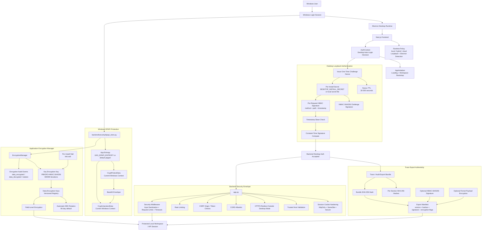
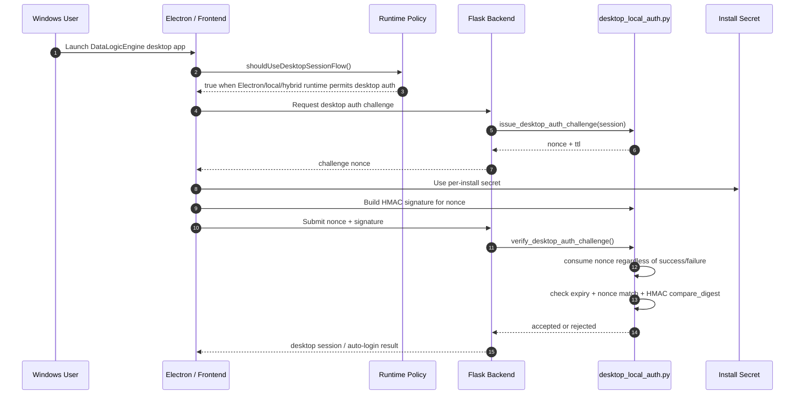

# Local-First Security Model Map

## Purpose

This diagram maps DataLogicEngine's local-first Windows security model to the actual code paths that implement desktop identity, loopback authentication, DPAPI protection, encryption/key rotation, export integrity, frontend runtime policy, and desktop session behavior.

The goal is to show that local-first security is not only a written standard. The repository contains concrete implementation modules for desktop auth, DPAPI, encryption, signed requests, runtime policy, export authenticity, and frontend auto-login behavior.

## Primary Code Paths

- `backend/security/desktop_local_auth.py`
- `backend/security/dpapi_store.py`
- `backend/security/encryption_manager.py`
- `backend/security/export_integrity.py`
- `backend/security/integrity.py`
- `frontend/contexts/AuthContext.tsx`
- `frontend/lib/runtime/policy.ts`
- `frontend/components/AppInitializer.tsx`
- `frontend/electron/main.ts`
- `frontend/electron/preload.ts`
- `app.py`

## Mermaid Architecture Diagram



## Desktop Authentication Flow



## Local-First Security Responsibilities

| Responsibility | Implementation | Notes |
|---|---|---|
| Runtime mode selection | `frontend/lib/runtime/policy.ts` | Determines `local`, `hybrid`, or `cloud`; cloud disables desktop auth. |
| Electron/desktop detection | `frontend/lib/runtime/policy.ts` | Uses `window.electronAPI` or Electron user agent. |
| Desktop auto-login path | `frontend/contexts/AuthContext.tsx` | Calls `desktopAutoLogin()` when desktop session flow is allowed and no user is already authenticated. |
| Startup loading/bootstrapping | `frontend/components/AppInitializer.tsx` | Provides controlled loading state while auth/session initialization runs. |
| Per-install secret | `backend/security/desktop_local_auth.py` | Reads env secret or creates `instance/desktop_install_secret.txt`; attempts `0600` permissions. |
| One-time challenge | `backend/security/desktop_local_auth.py` | Stores nonce and expiry in session; invalidates nonce regardless of outcome to reduce replay risk. |
| Per-request desktop signing | `backend/security/desktop_local_auth.py` | HMAC over method, path/query, and timestamp; validates skew and signature. |
| DPAPI storage | `backend/security/dpapi_store.py` | Uses Windows `win32crypt.CryptProtectData` / `CryptUnprotectData` with app entropy. |
| Key hierarchy | `backend/security/encryption_manager.py` | KEK/DEK pattern, PBKDF2-HMAC-SHA256, versioned DEK registry. |
| Key rotation | `backend/security/encryption_manager.py` | 90-day default rotation; archived old keys retained for decryption. |
| Field-level encryption | `backend/security/encryption_manager.py` | `FieldEncryption` helper encrypts/decrypts selected model fields. |
| Export authenticity | `backend/security/export_integrity.py` | Builds manifest with bundle hash, section hashes, optional HMAC signature, optional Fernet encryption. |
| Backend envelope | `app.py` | Session hardening, trusted hosts, HTTPS redirect, CORS allowlist, CSRF checks, rate limits, middleware. |

## DPAPI Model

The DPAPI helper is Windows-specific and intentionally tied to the local Windows context:

```text
plaintext
  ↓
CryptProtectData + app entropy
  ↓
base64 encoded protected payload
  ↓
CryptUnprotectData + same Windows context + same app entropy
  ↓
plaintext
```

This supports the local-first design principle that the Windows user account is the application identity boundary.

## Encryption Manager Model

The encryption manager uses a hierarchical model:

```text
ENCRYPTION_KEK_SECRET + salt
        ↓ PBKDF2-HMAC-SHA256, 600000 iterations
KEK
        ↓ encrypts
Versioned DEKs
        ↓ encrypt data fields
Encrypted payloads with v{version}: prefix
```

Important behavior:

- A salt file is created under the configured key directory.
- DEKs are stored encrypted by the KEK.
- Each encrypted value includes a key version prefix.
- Rotation archives old DEKs while preserving decryption support.
- Encrypt/decrypt operations can emit audit events when an audit logger is supplied.

## Export Integrity Model

Trace exports are protected as envelopes:

```text
Trace bundle
  ↓
section hashes + bundle hash
  ↓
manifest
  ↓
optional HMAC-SHA256 signature
  ↓
optional Fernet-encrypted payload
  ↓
export document
```

This supports judge/auditor review because exported trace bundles can carry integrity metadata instead of being raw JSON dumps.

## Security Boundary Notes

### Local/desktop mode

- Desktop auth is allowed only when runtime policy permits it.
- Loopback and Electron runtime checks are part of the frontend policy.
- Backend desktop auth relies on nonce challenge and HMAC signatures.
- DPAPI protection is bound to the local Windows environment.

### Cloud mode

- Desktop auth is denied by runtime policy when mode is `cloud`.
- Backend controls such as trusted hosts, HTTPS redirect, CORS allowlist, CSRF checks, sessions, and rate limits remain relevant.

### Hybrid mode

- Hybrid can permit desktop auth while still using selected external services.
- This should be reviewed carefully during deployment because hybrid mode crosses local and external trust boundaries.

## Judge Review Path

A technical judge should inspect these files in order:

1. `frontend/lib/runtime/policy.ts` — verifies runtime mode, loopback host detection, Electron detection, and desktop request authorization rules.
2. `frontend/contexts/AuthContext.tsx` — verifies desktop auto-login behavior and web/desktop route handling.
3. `backend/security/desktop_local_auth.py` — verifies install secret, nonce challenge, HMAC challenge signatures, per-request signatures, timestamp skew checks, and nonce invalidation.
4. `backend/security/dpapi_store.py` — verifies Windows DPAPI usage and app entropy.
5. `backend/security/encryption_manager.py` — verifies KEK/DEK hierarchy, PBKDF2, versioned encrypted payloads, rotation, and field-level encryption.
6. `backend/security/export_integrity.py` — verifies trace export hashing, manifest construction, optional HMAC signing, and optional encryption.
7. `app.py` — verifies backend session, CORS, CSRF, trusted host, HTTPS, rate limiting, and middleware envelope.
8. `frontend/electron/main.ts` and `frontend/electron/preload.ts` — verifies desktop runtime and IPC exposure boundaries.

## Implementation Caveat

The local-first security standard references AES-256-GCM as the target data-encryption standard. The current `EncryptionManager` implementation uses Fernet and records the algorithm as `Fernet-AES-128-CBC`; DPAPI uses Windows platform crypto through `win32crypt`. This diagram maps the implementation as it exists in code. If the target is strict AES-256-GCM everywhere, the code should either be upgraded or the standard should explicitly distinguish current implementation from target future state.

## Interpretation

The local-first security model is one of DataLogicEngine's strongest differentiators. Most AI applications assume cloud identity, cloud storage, and cloud key management. DataLogicEngine includes a path for a local Windows user to run the application with desktop session flow, per-install secrets, signed loopback requests, DPAPI-protected local secrets, encrypted application data, and integrity-protected exports.

This gives the platform a credible local-first enterprise security story while still allowing web/cloud/hybrid deployments when configured.
