# Data, Storage, and Memory Architecture Map

## Purpose

This diagram maps where DataLogicEngine stores relational state, graph knowledge, embeddings, artifacts, audit evidence, trace exports, and persistent memory. It is grounded in the actual storage and memory implementation modules.

The storage architecture is local/app-owned by default. The connection manager explicitly treats PostgreSQL, Redis, Neo4j, vector storage, and object storage as internal services, with local and VM modes rather than externally hosted database mode.

## Primary Code Paths

- `backend/storage/connection_manager.py`
- `backend/storage/database_manager.py`
- `backend/storage/graph_store.py`
- `backend/storage/object_store.py`
- `backend/storage/vector_store.py`
- `backend/storage/uskd_memory_graph.py`
- `backend/memory/unified_memory_service.py`
- `backend/truth_engine/truth_memory/manager.py`
- `backend/tracing/`
- `models.py`
- `migrations/`
- `app.py`

## Mermaid Architecture Diagram

```mermaid
flowchart TD
    App[DataLogicEngine App\nFlask + DMRF + Truth Engine + Frontend]
    CM[ConnectionManager\nbackend/storage/connection_manager.py]

    App --> CM

    subgraph CONFIG[Storage Configuration]
        Mode[Connection Mode\nLOCAL / VM / AUTO]
        PGConfig[PostgresConfig\n127.0.0.1:5432 / datalogic]
        RedisConfig[RedisConfig\n127.0.0.1:6379]
        Neo4jConfig[Neo4jConfig\nbolt://127.0.0.1:7687]
        VectorConfig[VectorDBConfig\n./databases/chroma]
        ObjectConfig[ObjectStorageConfig\n./databases/objects]
    end

    CM --> Mode
    CM --> PGConfig
    CM --> RedisConfig
    CM --> Neo4jConfig
    CM --> VectorConfig
    CM --> ObjectConfig

    subgraph REL[Relational Store]
        SQL[PostgreSQL / SQLite via SQLAlchemy]
        Models[models.py\nUsers + Sessions + TruthSession + Artifacts + Graph Rows + Audit Tables]
        Migrations[migrations/\nSchema Evolution]
        TenantRLS[Tenant RLS\nOptional Postgres Policy Binding]
    end

    PGConfig --> SQL
    SQL --> Models
    Models --> Migrations
    SQL --> TenantRLS

    subgraph CACHE[Cache / Queue / Session Layer]
        Redis[Redis]
        RateLimits[Rate Limit Counters]
        Sessions[Session Manager]
        Celery[Celery Broker / Result Backend]
        Nonces[Replay / Nonce / Runtime State]
        Streams[TruthLink Redis Streams]
    end

    RedisConfig --> Redis
    Redis --> RateLimits
    Redis --> Sessions
    Redis --> Celery
    Redis --> Nonces
    Redis --> Streams

    subgraph GRAPH[Graph Knowledge Layer]
        Neo4j[Neo4j Graph Store]
        GraphStore[backend/storage/graph_store.py]
        USKD[USKD Memory Graph\nNetworkX RAM-Resident Graph]
        SQLGraph[SQL Graph Records\nPillarLevel + KnowledgeGraphNode + KnowledgeGraphEdge]
        AxisGraph[17-Axis Coordinate Context]
    end

    Neo4jConfig --> Neo4j
    Neo4j --> GraphStore
    SQL --> SQLGraph
    GraphStore --> USKD
    SQLGraph --> USKD
    AxisGraph --> USKD

    subgraph VECTOR[Vector / Embedding Layer]
        Chroma[ChromaDB PersistentClient]
        Collections[Required Collections]
        Embeddings[Text / Query Embeddings]
        Search[Semantic Search Results]
    end

    VectorConfig --> Chroma
    Chroma --> Collections
    Embeddings --> Chroma
    Chroma --> Search

    subgraph OBJECT[Object / Artifact Layer]
        ObjectStore[LocalFileBackend / Object Store]
        Buckets[Buckets\naudit_logs + simulation_artifacts + deliverables + graphs + eval_data]
        Metadata[Object Metadata + Content Type]
        ETag[SHA-256 ETag]
        PathGuard[Bucket + Key Sanitization\nTraversal Protection]
    end

    ObjectConfig --> ObjectStore
    ObjectStore --> Buckets
    ObjectStore --> Metadata
    ObjectStore --> ETag
    ObjectStore --> PathGuard

    subgraph MEMORY[Persistent Reasoning Memory]
        UnifiedMemory[UnifiedMemoryService]
        StructuredGraph[StructuredMemoryGraph]
        MemoryFile[databases/memory/memory_graph.json]
        Recall[Recall\nembedding relevance + temporal importance + importance score]
        Consolidate[Consolidate\nrecord or strengthen memory vertex]
    end

    App --> UnifiedMemory
    UnifiedMemory --> StructuredGraph
    StructuredGraph --> MemoryFile
    UnifiedMemory --> Recall
    UnifiedMemory --> Consolidate

    subgraph TRUTHMEM[TruthMemory]
        TruthMemory[TruthMemoryManager]
        Audit[AuditLogger\nHash Chains]
        TruthCache[TruthCache\nMemory or Redis]
        Metrics[MetricsTracker\nConfidence + Latency]
        Artifacts[TruthArtifact\nContent Hash + Retention]
        Explain[Explainability Data\nSession + Audit + Artifacts + Trace]
        MLflow[TruthMemory MLflow Tracker]
    end

    App --> TruthMemory
    TruthMemory --> Audit
    TruthMemory --> TruthCache
    TruthMemory --> Metrics
    TruthMemory --> Artifacts
    TruthMemory --> Explain
    TruthMemory --> MLflow
    Audit --> SQL
    TruthCache --> Redis
    Metrics --> SQL
    Artifacts --> SQL

    subgraph TRACE[Trace and Export Evidence]
        TraceAPI[backend/tracing/api.py]
        TraceLogger[backend/tracing/logger.py]
        ExportIntegrity[backend/security/export_integrity.py]
        ExportManifest[Manifest\nsection hashes + bundle hash + optional HMAC + optional encryption]
        ExportObjects[Export Bundles / Audit Evidence]
    end

    App --> TraceAPI
    TraceAPI --> TraceLogger
    TraceLogger --> SQL
    TraceLogger --> ObjectStore
    ExportIntegrity --> ExportManifest
    ExportManifest --> ExportObjects
    ExportObjects --> ObjectStore

    %% Consumers
    DMRF[DMRF / TruthCore Reasoning]
    Frontend[Frontend\nGraph + Runs + Trace + Admin + Knowledge UI]

    DMRF --> SQL
    DMRF --> USKD
    DMRF --> Search
    DMRF --> UnifiedMemory
    DMRF --> TruthMemory
    DMRF --> ObjectStore

    Frontend --> TraceAPI
    Frontend --> SQL
    Frontend --> GraphStore
    Frontend --> ObjectStore
```



## Storage Service Crosswalk

| Storage service | Implementation | Stores / manages | Notes |
|---|---|---|---|
| Relational store | `app.py`, `extensions.py`, `models.py`, `migrations/`, `backend/storage/database_manager.py` | users, sessions, TruthSession, artifacts, graph rows, audit/release/application records | SQLAlchemy supports SQLite/PostgreSQL paths. Production pool settings are configured in `app.py`. |
| Connection manager | `backend/storage/connection_manager.py` | unified config and health for Postgres, Redis, Neo4j, vector, object | Modes are `local`, `vm`, and `auto`; cloud/hybrid DB modes are deprecated into internal app-owned storage. |
| Redis | `app.py`, `backend/storage/connection_manager.py` | cache, rate limits, sessions, Celery, nonces, TruthLink streams | Optional; app falls back to memory/simple cache in some dev/test paths. |
| Neo4j graph store | `backend/storage/graph_store.py` | knowledge graph / UKG nodes and relationships | Used alongside SQL graph records and USKD RAM graph. |
| USKD memory graph | `backend/storage/uskd_memory_graph.py` | RAM-resident NetworkX graph of pillars, knowledge nodes, edges | Loads from SQL records or Neo4j to avoid database round trip for every traversal. |
| Vector store | `backend/storage/vector_store.py` | embeddings and semantic search collections | Uses ChromaDB `PersistentClient` locally by default. |
| Object store | `backend/storage/object_store.py` | audit logs, simulation artifacts, deliverables, graphs, eval data, exports | Local filesystem backend includes bucket/key validation and traversal protection. |
| Unified memory | `backend/memory/unified_memory_service.py` | persistent structured reasoning memory graph | Stores JSON graph under `databases/memory/memory_graph.json`; recall ranks by embedding relevance, temporal importance, and importance score. |
| TruthMemory | `backend/truth_engine/truth_memory/manager.py` | audit, cache, metrics, artifacts, explainability, MLflow-style tracking | Bridges reasoning sessions to audit/explainability records. |
| Trace/export evidence | `backend/tracing/`, `backend/security/export_integrity.py` | trace runs, export bundles, manifests, hashes/signatures | Protects exported trace evidence with hashes, optional HMAC signatures, and optional encryption. |

## Startup and Bucket Initialization

`app.py` initializes storage-facing services during startup. The object store creates these buckets:

```text
audit_logs
simulation_artifacts
deliverables
graphs
eval_data
```

The vector store initializes ChromaDB collections and exposes collection counts for health/readiness and desktop IPC.

## Object Store Safety Model

`LocalFileBackend` enforces local object safety with:

- strict bucket-name validation;
- object key normalization;
- null-byte rejection;
- absolute-path rejection;
- `..` traversal rejection;
- resolved path containment checks;
- SHA-256 ETag computation;
- optional metadata sidecar files.

This makes local object storage safer than simply writing arbitrary paths to disk.

## Vector Store Model

The default vector backend is ChromaDB:

```text
Text / document chunks / query embeddings
        ↓
ChromaDB PersistentClient
        ↓
collections
        ↓
semantic search results
```

The implementation disables anonymized telemetry and persists under the configured local path.

## USKD Memory Graph Model

The USKD memory graph is a RAM-resident NetworkX directed graph:

```text
SQL rows or Neo4j records
        ↓
Pillars + KnowledgeNodes + Edges
        ↓
NetworkX DiGraph
        ↓
fast reasoning-layer graph traversal
```

It can load from:

- SQLAlchemy models: `PillarLevel`, `KnowledgeGraphNode`, `KnowledgeGraphEdge`;
- Neo4j graph records;
- direct in-memory records or test doubles.

## Unified Memory Model

`UnifiedMemoryService` wraps `StructuredMemoryGraph` with local persistence:

```text
Reasoning content / layer result
        ↓
embedding generation
        ↓
memory consolidation
        ↓
StructuredMemoryGraph vertex/edge update
        ↓
JSON save to databases/memory/memory_graph.json
```

Recall ranks memory vertices by:

1. embedding relevance;
2. temporal importance;
3. stored importance score.

It also updates access count, last-accessed timestamp, and importance after recall.

## TruthMemory Model

TruthMemory is the audit/explainability side of memory:

```text
TruthCore / DMRF session result
        ↓
Audit event
        ↓
Cache session
        ↓
Record confidence/latency metrics
        ↓
Track with MLflow-style tracker
        ↓
Expose explainability data
```

Explainability data includes:

- session;
- audit trail;
- artifacts;
- reasoning trace;
- confidence breakdown;
- personas used;
- axis context;
- generation timestamp.

## Judge Review Path

A technical judge should inspect these files in order:

1. `backend/storage/connection_manager.py` — verifies internal storage mode, local/VM/auto behavior, service configs, and health checks.
2. `app.py` — verifies SQLAlchemy setup, Redis/cache/Celery setup, rate-limit storage, vector collection init, object bucket init, and health/readiness metrics.
3. `backend/storage/object_store.py` — verifies local object storage, metadata, ETags, and path traversal protections.
4. `backend/storage/vector_store.py` — verifies local ChromaDB vector persistence and search behavior.
5. `backend/storage/graph_store.py` — verifies Neo4j graph interface.
6. `backend/storage/uskd_memory_graph.py` — verifies RAM-resident NetworkX USKD graph loading from SQL and Neo4j.
7. `backend/memory/unified_memory_service.py` — verifies persistent structured memory, recall, consolidation, and JSON graph persistence.
8. `backend/truth_engine/truth_memory/manager.py` — verifies audit, cache, metrics, artifact storage, explainability, and MLflow tracking.
9. `backend/tracing/` and `backend/security/export_integrity.py` — verifies trace/export evidence handling.

## Interpretation

The storage architecture supports the larger DataLogicEngine thesis: enterprise AI systems need more than a prompt and a response. They need relational state, graph context, vector retrieval, artifact storage, structured memory, audit evidence, explainability, trace exports, and operational health reporting.

The result is a multi-store architecture where each storage type has a distinct purpose:

- SQL for durable application and audit state;
- Redis for fast runtime coordination;
- Neo4j and NetworkX for graph reasoning;
- ChromaDB for semantic retrieval;
- object storage for evidence/artifacts/deliverables;
- structured memory for long-term reasoning context;
- TruthMemory for audit-grade session memory and explainability.
