# Testing, Validation, and Release Governance Map

## Purpose

This diagram maps DataLogicEngine's testing, validation, CI, release, packaging, and governance controls to the actual repository files that enforce them.

The goal is to help judges answer the practical question:

> How do we know this large AI platform is testable, reviewable, and release-governed rather than only architecturally ambitious?

## Primary Code and Documentation Paths

- `docs/TESTING.md`
- `docs/PRODUCTION_READINESS.md`
- `docs/RELEASE_CHECKLIST.md`
- `.github/workflows/ci.yml`
- `.github/workflows/deploy.yml`
- `tests/`
- `frontend/tests/`
- `scripts/runtime_precheck.py`
- `scripts/dev_doctor.py`
- `scripts/verify_release_governance.py`
- `scripts/verify_environment_parity.py`
- `scripts/verify_lockfiles.py`
- `scripts/verify_docs_references.py`
- `scripts/validate_schema_parity.py`
- `scripts/windows/run_packaging_smoke.ps1`
- `scripts/windows/verify_nsis_governance.ps1`
- `reports/`

## Mermaid Architecture Diagram

```mermaid
flowchart TD
    Change[Code / Docs / Config Change]
    Local[Local Developer / AI Agent Workflow]
    CI[GitHub Actions CI]
    Evidence[Reports / Artifacts / Evidence]
    Release[Release Governance Decision]

    Change --> Local
    Change --> CI

    subgraph LOCAL[Local Quality Gates]
        Smoke[scripts/test_smoke.py]
        DevDoctor[scripts/dev_doctor.py]
        RuntimePrecheck[scripts/runtime_precheck.py]
        Precommit[scripts/dev/run_precommit_checks.py]
        DocsRefs[scripts/verify_docs_references.py]
        EnvParity[scripts/verify_environment_parity.py]
        Lockfiles[scripts/verify_lockfiles.py]
    end

    Local --> Smoke
    Local --> DevDoctor
    Local --> RuntimePrecheck
    Local --> Precommit
    Local --> DocsRefs
    Local --> EnvParity
    Local --> Lockfiles

    subgraph TESTS[Test Taxonomy]
        Unit[Unit Tests\ntests/unit + frontend/tests/unit]
        Integration[Integration Tests\ntests/integration + tests/integration_routes]
        Contract[Contract Tests\ntests/contract]
        Security[Security Tests\ntests/security]
        Parity[Local Mode Parity\ntests/parity]
        Truth[Truth Engine Tests\ntests/truth_engine]
        KA[Knowledge Algorithm Tests\ntests/knowledge_algorithms]
        Axes[17-Axis Tests\ntests/axes]
        Compliance[Compliance Tests\ntests/compliance]
        E2E[End-to-End / Playwright\nfrontend/tests/e2e]
        Visual[Visual Regression\nPlaywright snapshots]
        A11y[Accessibility Sweep\naxe / ChromeDriver]
        Windows[Windows / Desktop Tests\ntests/windows + packaging smoke]
    end

    Smoke --> Unit
    DevDoctor --> Unit
    RuntimePrecheck --> Contract
    Precommit --> Security
    DocsRefs --> Contract
    EnvParity --> Parity
    Lockfiles --> Release

    Unit --> Evidence
    Integration --> Evidence
    Contract --> Evidence
    Security --> Evidence
    Parity --> Evidence
    Truth --> Evidence
    KA --> Evidence
    Axes --> Evidence
    Compliance --> Evidence
    E2E --> Evidence
    Visual --> Evidence
    A11y --> Evidence
    Windows --> Evidence

    subgraph CIJOBS[CI Jobs]
        LintJob[lint\nRuff E9/F63/F7]
        BackendJob[backend-test\nDependency install + pip-audit + smoke + runtime precheck + docs refs + schema parity + pytest + contract + parity + security]
        FrontendJob[frontend-build\nNode 24 + npm ci + tokens + lint + typecheck + Vitest + Next build + Playwright + a11y + visual]
        WindowsJob[windows-packaging-smoke\nPyInstaller backend + Electron dist + NSIS governance + portable launch smoke]
        GovernanceJob[governance\nprecommit + env parity + lockfile governance]
        DockerJob[docker-build\nbackend image + frontend image]
    end

    CI --> LintJob
    CI --> BackendJob
    CI --> FrontendJob
    CI --> WindowsJob
    CI --> GovernanceJob
    BackendJob --> DockerJob
    FrontendJob --> DockerJob
    WindowsJob --> DockerJob
    GovernanceJob --> DockerJob

    LintJob --> Evidence
    BackendJob --> Evidence
    FrontendJob --> Evidence
    WindowsJob --> Evidence
    GovernanceJob --> Evidence
    DockerJob --> Evidence

    subgraph REPORTS[Evidence and Reports]
        RuntimeReport[reports/runtime_precheck_report_ci.json]
        SchemaReport[reports/schema_parity_report_ci.json]
        EnvReport[reports/environment_parity_report_ci.json]
        LockReport[reports/lockfile_governance_report_ci.json]
        PackagingReport[reports/packaging_smoke_report.json]
        NSISReport[reports/nsis_governance_report.json]
        Coverage[Coverage Reports\nbackend coverage baseline]
        PlaywrightReports[Playwright / Visual / A11y Reports]
    end

    Evidence --> RuntimeReport
    Evidence --> SchemaReport
    Evidence --> EnvReport
    Evidence --> LockReport
    Evidence --> PackagingReport
    Evidence --> NSISReport
    Evidence --> Coverage
    Evidence --> PlaywrightReports

    subgraph RELEASE[Release Governance]
        Checklist[docs/RELEASE_CHECKLIST.md]
        ProdReady[docs/PRODUCTION_READINESS.md]
        VerifyRelease[scripts/verify_release_governance.py]
        BranchPolicy[docs/BRANCH_PROTECTION_POLICY.md]
        RequiredGates[Required Gates\nCI + coverage + security + migration/startup + typecheck + contract/parity/security + packaging]
    end

    Evidence --> Checklist
    Evidence --> ProdReady
    Checklist --> VerifyRelease
    ProdReady --> VerifyRelease
    BranchPolicy --> VerifyRelease
    VerifyRelease --> RequiredGates
    RequiredGates --> Release
```



## CI Workflow Breakdown

The main CI workflow is `.github/workflows/ci.yml` and contains these major jobs:

| CI job | Purpose | Key checks |
|---|---|---|
| `lint` | Python syntax/static safety gate | Ruff focused on fatal/error-class rules. |
| `backend-test` | Backend quality and security gate | Dependency install, `pip-audit`, smoke check, runtime precheck, docs reference validation, schema parity, full pytest, API contract tests, local-mode parity tests, security regression tests. |
| `frontend-build` | Frontend quality gate | Node 24, `npm ci`, design tokens, lint, typecheck, Vitest, Next build, Playwright install, accessibility sweep, route E2E smoke, visual regression. |
| `windows-packaging-smoke` | Desktop installer/release gate | PyInstaller backend build, Electron dependencies, NSIS governance check, Electron distribution build, portable launch packaging smoke, artifact upload. |
| `governance` | Release/process governance gate | Pre-commit governance checks, environment parity, lockfile governance, governance report upload. |
| `docker-build` | Container build verification | Backend Docker image build and frontend Docker image build after required jobs succeed. |

## Test Taxonomy

The documented test directory model includes:

```text
tests/
  unit/
  integration/
  integration_routes/
  end_to_end/
  security/
  simulation/
  knowledge_algorithms/
  truth_engine/
  compliance/
  parity/
  contract/
  performance/
  axes/
  quad_persona/
  windows/
  utils/
frontend/
  tests/
    unit/
    e2e/
```

This is important because the repo validates more than ordinary unit behavior. It tests route wiring, contracts, security controls, local-mode behavior, Truth Engine behavior, knowledge algorithms, 17-axis logic, compliance behavior, E2E UI behavior, and Windows packaging.

## Quality Baseline

The testing guide records a backend baseline of:

```text
1769 passed, 19 skipped (SQLite, 2026-06-24)
coverage gate: >=70%
```

These values should be periodically regenerated and dated, but they are useful as current repository evidence for judging maturity.

## Required Release Gates

The documented required release gates are:

1. All required CI jobs pass on protected branch.
2. Backend coverage remains at or above configured threshold.
3. No medium/high security regression in enforced security scans.
4. No failing migration or startup checks in deployment workflows.
5. Frontend typecheck must pass.
6. Contract/parity/security regression sweeps must pass.
7. Windows packaging smoke job must pass.

## Validation Layers

### 1. Static and dependency gates

- Ruff linting.
- `pip-audit` dependency scan.
- lockfile governance.
- environment parity checks.
- docs reference validation.

### 2. Backend execution gates

- smoke bootstrap check;
- runtime precheck;
- schema parity validation;
- full pytest suite;
- API contract tests;
- local-mode parity tests;
- security header/request-limit tests.

### 3. Frontend execution gates

- token generation;
- lint;
- TypeScript typecheck;
- Vitest unit tests;
- Next.js build;
- accessibility sweep;
- route-level E2E smoke;
- Playwright visual regression.

### 4. Windows desktop release gates

- PyInstaller backend build;
- Electron distribution build;
- NSIS governance verification;
- portable packaging smoke launch;
- packaging and NSIS report artifacts.

### 5. Release governance gates

- pre-commit governance checks;
- release checklist alignment;
- environment parity report;
- lockfile governance report;
- Docker build verification.

## Judge Review Path

A technical judge should inspect these files in order:

1. `docs/TESTING.md` — confirms test taxonomy, quality baseline, standard commands, and release gates.
2. `.github/workflows/ci.yml` — confirms actual CI enforcement across backend, frontend, Windows packaging, governance, and Docker verification.
3. `tests/contract/` — confirms API contract discipline and route expectations.
4. `tests/security/` — confirms attack-surface and security-control regression coverage.
5. `tests/parity/` — confirms local-mode parity validation.
6. `tests/truth_engine/`, `tests/knowledge_algorithms/`, `tests/axes/` — confirms coverage of the unique AI architecture areas.
7. `frontend/tests/` — confirms frontend unit/E2E/visual validation.
8. `scripts/runtime_precheck.py` and `scripts/dev_doctor.py` — confirms startup and developer readiness checks.
9. `scripts/verify_release_governance.py`, `scripts/verify_environment_parity.py`, and `scripts/verify_lockfiles.py` — confirms governance automation.
10. `scripts/windows/run_packaging_smoke.ps1` and `scripts/windows/verify_nsis_governance.ps1` — confirms Windows release validation.
11. `reports/` — confirms generated evidence outputs.
12. `docs/PRODUCTION_READINESS.md` and `docs/RELEASE_CHECKLIST.md` — confirms release decision framing.

## Interpretation

This testing and release architecture is a major signal that DataLogicEngine is not only a prototype. The repo includes multiple validation layers across backend code, frontend code, API contracts, security controls, local-first behavior, AI reasoning subsystems, Windows packaging, environment parity, lockfile governance, documentation references, and release readiness.

For contest review, this map helps prove that the application has moved beyond code generation into software product governance.
