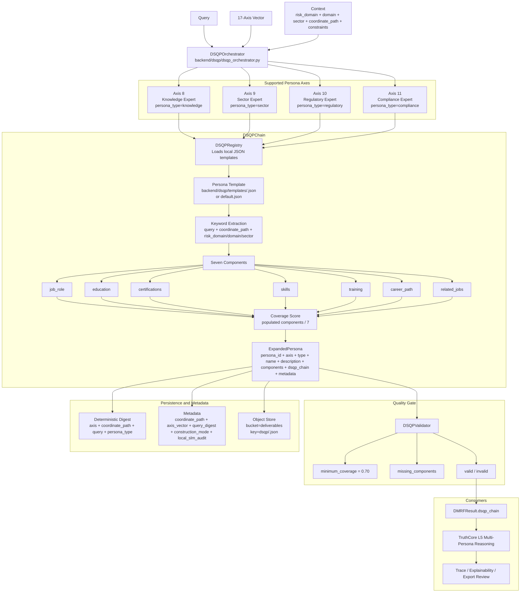
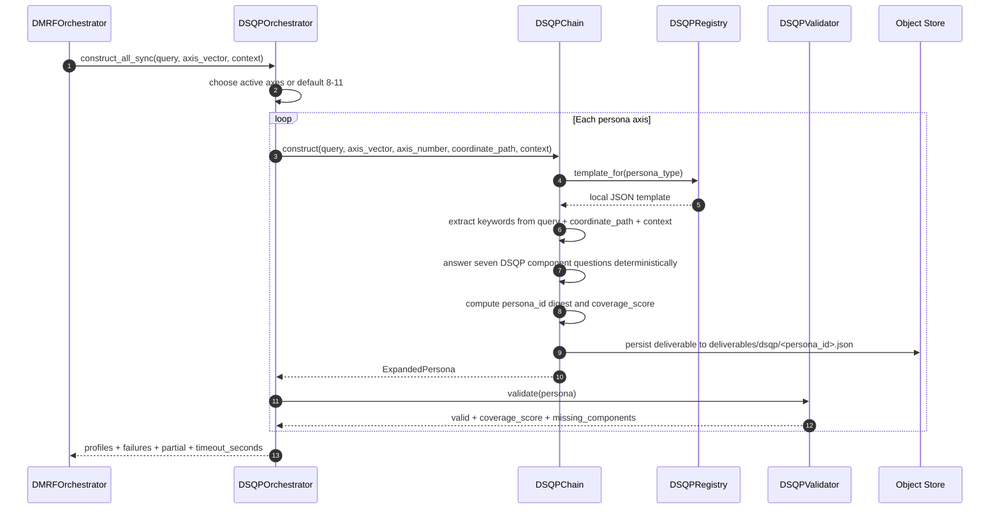

# DSQP Persona Construction Architecture

## Purpose

This diagram maps how DataLogicEngine constructs deterministic seven-component personas for the 17-axis model's persona axes. DSQP is important because it turns axes 8-11 into structured expert profiles rather than leaving them as labels.

The implementation is offline-capable and deterministic today, with a stable serialized output contract that can later support LLM-assisted construction without changing downstream consumers.

## Primary Code Paths

- `backend/dsqp/dsqp_chain.py`
- `backend/dsqp/dsqp_orchestrator.py`
- `backend/dsqp/dsqp_validator.py`
- `backend/dsqp/dsqp_registry.py`
- `backend/dsqp/templates/`
- `backend/dmrf/orchestrator.py`
- `core/system/persona_construction_service.py`
- `backend/truth_engine/truth_core/engine.py`

## Mermaid Architecture Diagram



## DSQP Runtime Flow



## Supported Persona Axes

| Axis | Persona type | Role |
|---:|---|---|
| 8 | `knowledge` | Scholar/domain expert perspective. |
| 9 | `sector` | Industry practitioner perspective. |
| 10 | `regulatory` | External laws, regulations, and standards perspective. |
| 11 | `compliance` | Internal policy, control, and governance perspective. |

The mapping lives in `AXIS_PERSONA_TYPES` in `backend/dsqp/dsqp_chain.py`.

## Seven DSQP Components

Each persona is built from seven components:

```text
job_role
education
certifications
skills
training
career_path
related_jobs
```

Each component becomes a step in the `dsqp_chain` with:

```text
step
component
question
answer
axis_number
persona_type
```

This means the persona is not only a final profile. It includes the construction chain used to build the profile.

## ExpandedPersona Output Contract

`ExpandedPersona` serializes to:

```text
persona_id
axis_number
persona_type
name
description
components
dsqp_chain
coverage_score
metadata
created_at
```

Important metadata includes:

```text
coordinate_path
axis_vector
query_digest
construction_mode = deterministic_offline
local_slm_audit
object_store location
```

## Validation Gate

`DSQPValidator` enforces a coverage threshold:

```text
minimum_coverage = 0.70
```

Validation calculates:

```text
coverage_score = populated_components / 7
```

and returns:

```text
valid
coverage_score
missing_components
minimum_coverage
```

If validation fails inside the orchestrator, the persona is recorded as a failure for that axis.

## Offline and Local-First Behavior

The DSQP registry loads bundled templates from local files:

```text
backend/dsqp/templates/<persona_type>.json
backend/dsqp/templates/default.json
```

The chain is deterministic and offline-capable. It does not need an LLM call to create personas. The code explicitly states that later LLM-assisted construction can replace the internal answer function without changing the serialized output contract.

## Object Store Persistence

Each DSQP persona deliverable is written to the app-owned object store when available:

```text
bucket: deliverables
key: dsqp/<persona_id>.json
content_type: application/json
metadata:
  artifact_type: dsqp_persona
  persona_id: <persona_id>
  axis_number: <axis>
```

This makes DSQP output inspectable as an artifact rather than an invisible in-memory step.

## DMRF Integration

DMRF calls DSQP with:

```text
query
axis_vector
risk_domain = axis_vector.axes["15"]["value"]
coordinate_path = dmrf.<axis1 value>.<axis2 value>
```

The returned DSQP object becomes:

```text
DMRFResult.dsqp_chain
```

This is then available for trace, export, and review.

## TruthCore Integration

TruthCore also contains persona construction hooks for the `multi_persona_reasoning` layer. When L5 multi-persona reasoning runs, TruthCore can construct persona profiles for active persona axes and attach:

```text
constructed_persona_profiles
dsqp_chain
personas_used
```

This means DSQP concepts appear both in the DMRF orchestration path and the deeper TruthCore refinement path.

## Judge Review Path

A technical judge should inspect these files in order:

1. `backend/dsqp/dsqp_chain.py` — confirms persona axes, seven components, deterministic output construction, metadata, coverage score, and object-store persistence.
2. `backend/dsqp/dsqp_orchestrator.py` — confirms concurrent/sync construction across persona axes 8-11 and partial failure handling.
3. `backend/dsqp/dsqp_validator.py` — confirms coverage threshold and missing component logic.
4. `backend/dsqp/dsqp_registry.py` — confirms local template loading without network access.
5. `backend/dsqp/templates/` — confirms bundled persona question templates.
6. `backend/dmrf/orchestrator.py` — confirms DMRF invokes DSQP and stores output in the DMRF result.
7. `backend/truth_engine/truth_core/engine.py` — confirms TruthCore L5 persona construction hooks.
8. `backend/storage/object_store.py` — confirms DSQP deliverables are persisted as local artifacts when storage is available.

## Interpretation

DSQP is a structured persona construction system. Instead of telling an LLM to "act as an expert," DataLogicEngine builds explicit expert profiles tied to coordinate axes, risk/domain context, templates, validation, artifacts, and traceable construction steps.

This is a major architectural difference from ordinary role prompting.
