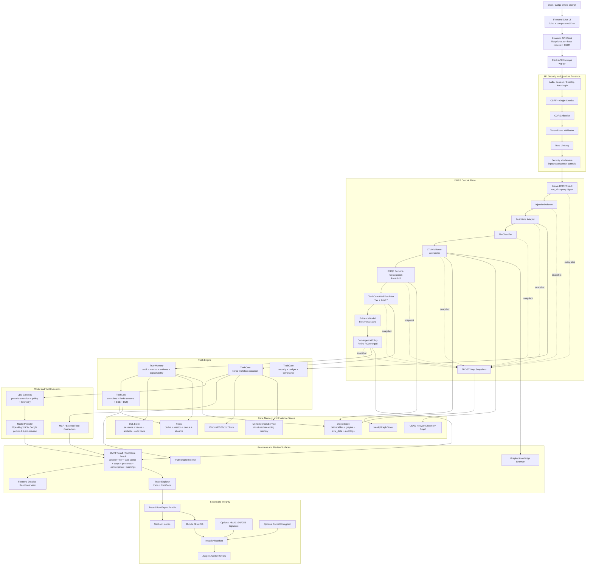
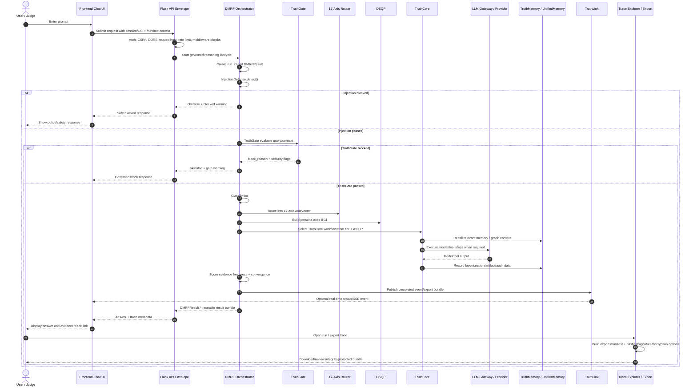

# End-to-End Request Lifecycle

## Purpose

This is the single judge-facing walkthrough for how DataLogicEngine processes an AI request from user prompt to traceable, exportable evidence.

It connects the major subsystems already mapped in the earlier diagrams:

- Frontend product surface
- API/security envelope
- DMRF control plane
- 17-axis routing
- DSQP persona construction
- Truth Engine
- LLM Gateway
- Storage and memory systems
- Trace explorer
- Export integrity
- Observability and release evidence

The point of this diagram is simple:

> A DataLogicEngine request is not just prompt → model → answer. It is prompt → governed reasoning lifecycle → auditable result.

## Primary Code Paths

- `frontend/app/layout.tsx`
- `frontend/app/chat/`
- `frontend/components/Chat/`
- `frontend/lib/api/chat.ts`
- `frontend/lib/api/trace.ts`
- `app.py`
- `backend/dmrf/orchestrator.py`
- `backend/dmrf/models.py`
- `backend/dmrf/router.py`
- `backend/dsqp/dsqp_orchestrator.py`
- `backend/truth_engine/api.py`
- `backend/truth_engine/truth_gate/gateway.py`
- `backend/truth_engine/truth_core/engine.py`
- `backend/truth_engine/truth_memory/manager.py`
- `backend/truth_engine/truth_link/bus.py`
- `backend/llm_gateway/`
- `backend/storage/`
- `backend/memory/unified_memory_service.py`
- `backend/tracing/`
- `backend/security/export_integrity.py`

## Mermaid Lifecycle Diagram



## Sequence Diagram



## Lifecycle Stages

| Stage | Code area | Output |
|---:|---|---|
| 1 | `frontend/app/chat/`, `frontend/components/Chat/` | User prompt and UI context. |
| 2 | `frontend/lib/api/` | API request with CSRF/session handling. |
| 3 | `app.py` | Authenticated, rate-limited, middleware-screened backend request. |
| 4 | `backend/dmrf/orchestrator.py` | `DMRFResult` with run ID and lifecycle state. |
| 5 | `backend/dmrf/injection_defense.py` | Safe/blocked injection-defense result. |
| 6 | `backend/dmrf/truth_integration/gate_adapter.py`, `backend/truth_engine/truth_gate/` | TruthGate evaluation, flags, budget, compliance. |
| 7 | `backend/dmrf/tier_classifier.py` | Five-tier classification. |
| 8 | `backend/dmrf/router.py`, `core/axes/` | 17-axis `AxisVector`. |
| 9 | `backend/dsqp/` | Persona profiles for axes 8-11. |
| 10 | `backend/truth_engine/truth_core/engine.py` | Workflow plan and layer execution. |
| 11 | `backend/llm_gateway/`, `backend/mcp_server/` | Model/tool execution when needed. |
| 12 | `backend/dmrf/evidence_model.py`, `backend/dmrf/convergence_policy.py` | Evidence freshness and convergence/refinement decision. |
| 13 | `backend/truth_engine/truth_memory/`, `backend/memory/` | Audit, artifacts, metrics, explainability, structured memory. |
| 14 | `backend/truth_engine/truth_link/` | Completion/event publication. |
| 15 | `backend/tracing/`, `frontend/app/runs/` | Trace explorer and run detail review. |
| 16 | `backend/security/export_integrity.py` | Integrity-protected export manifest. |

## What Makes This Different From a Wrapper

A simple wrapper usually has this lifecycle:

```text
prompt → model → response
```

DataLogicEngine has this lifecycle:

```text
prompt
  → auth/security/middleware
  → injection defense
  → TruthGate
  → tier classification
  → 17-axis routing
  → DSQP persona construction
  → TruthCore workflow planning
  → evidence freshness scoring
  → convergence policy
  → model/tool execution when required
  → memory/audit/artifact persistence
  → event publication
  → frontend trace review
  → integrity-protected export
```

## Judge Review Path

To verify this lifecycle, inspect:

1. `frontend/app/layout.tsx` and `frontend/app/chat/` — product entry and chat surface.
2. `frontend/lib/api/index.ts`, `frontend/lib/api/chat.ts`, `frontend/lib/api/trace.ts` — frontend request and trace export clients.
3. `app.py` — backend security and API route envelope.
4. `backend/dmrf/orchestrator.py` — the main lifecycle controller.
5. `backend/dmrf/models.py` — result, step, axis vector, and export bundle structures.
6. `backend/truth_engine/truth_gate/gateway.py` — gate/security/budget/compliance behavior.
7. `backend/dmrf/router.py` and `core/axes/` — 17-axis routing.
8. `backend/dsqp/` — persona construction.
9. `backend/truth_engine/truth_core/engine.py` — workflow selection and execution.
10. `backend/storage/`, `backend/memory/`, `backend/truth_engine/truth_memory/` — persistence and memory layers.
11. `backend/truth_engine/truth_link/bus.py` — event publication and streaming.
12. `backend/security/export_integrity.py` — trace export authenticity.
13. `frontend/app/runs/` — user-facing trace review.

## Interpretation

This request lifecycle is the clearest end-to-end explanation of DataLogicEngine. It shows how a user action becomes a governed, routed, reasoned, persisted, observable, and exportable AI event.

For a contest or technical evaluation, this is the diagram to put first when someone asks:

> What does the system actually do?
