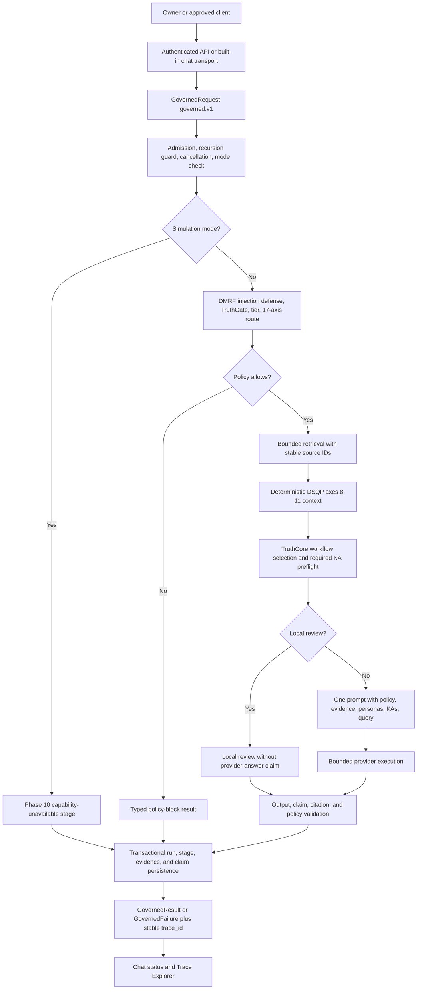
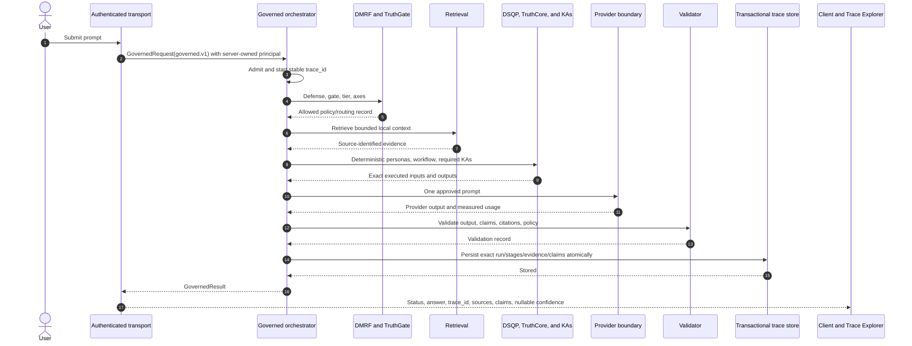
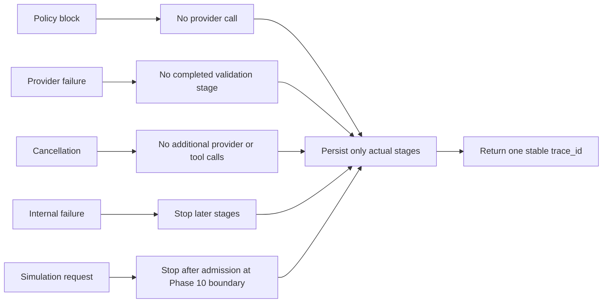

# End-to-End Governed Request Lifecycle

> **Document metadata**
> - Document version: v2.0.0
> - Last reviewed: 2026-07-13
> - Status: Active architecture review map
> - Owner: Platform Architecture
> - Contract: `governed.v1`

## Purpose

This is the reviewer-facing walkthrough for the Phase 5 canonical request path.
It shows the one backend-owned causal lifecycle used by built-in chat and
approved answer clients, the exact trace boundary, and the capabilities that are
deliberately deferred.

A governed request is not prompt to model to answer. It is an authenticated,
policy-controlled, source-aware, bounded execution that returns an explicit
result or failure with one stable trace ID.

## Primary code paths

- `backend/governed_execution/contracts.py`
- `backend/governed_execution/orchestrator.py`
- `backend/governed_execution/retrieval.py`
- `backend/governed_execution/prompt.py`
- `backend/governed_execution/validation.py`
- `backend/governed_execution/trace_persistence.py`
- `backend/llm_gateway/gateway.py`
- `backend/llm_gateway/api.py`
- `frontend/components/Chat/LiveTracePanel.tsx`
- `frontend/lib/api/types.ts`

## Canonical lifecycle

## Success sequence

## Failure and cancellation rules

Failure kinds are `policy_block`, `validation_failure`, `provider_failure`,
`cancelled`, `internal_failure`, and `capability_unavailable`. A policy or
capability decision is not relabeled as a network failure.

## Supported modes

| Mode | Phase 5 behavior |
|---|---|
| `standard` | Full bounded governed lifecycle with the standard required KA set. |
| `enhanced` | Full bounded lifecycle with the approved deeper KA preflight set. |
| `local_review` | Local retrieval/review path; it does not claim a provider answer. |
| `simulation` | Explicit Phase 10 capability-unavailable result immediately after admission. |

Compatibility values `chat`, `trace`, and `explain` map to `standard`; `quad`
maps to `enhanced`. `run_ukg_pipeline=false` is deprecated and cannot bypass
governance.

## Trace truth contract

Every admitted outcome uses one trace ID. Persistence records only work that
executed:

1. actual stage status, timestamps, and measured duration;
2. DMRF policy/tier/axis outputs;
3. accepted source-identified evidence;
4. DSQP contributions and KA inputs/outputs that influenced execution;
5. provider identity, model, usage, and failure metadata when called;
6. claims/citations and validation state when validation ran;
7. typed terminal failure when the run did not complete.

Planned stages, fixed durations, default routing confidence, and unexecuted KAs
are not inserted. Answer and claim confidence remain null when unmeasured.

## Phase boundary

Phase 5 proves causal execution, a single path, and trace truth. Phase 6 must
prove provenance, evidence sufficiency, claim support, contradiction handling,
category-specific validators, calibrated confidence, convergence, and KA
validity. The later rebuilt installed application must still complete real
OpenAI and Gemini runs with resolvable traces for CP5-E.
